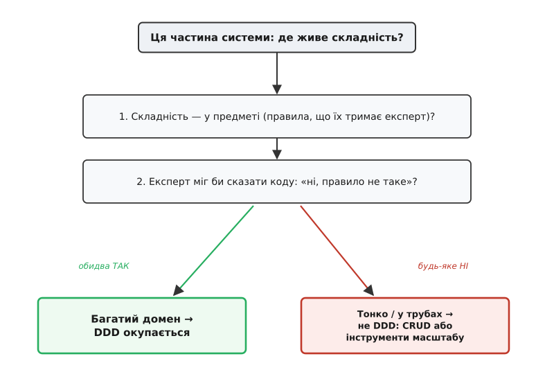

# Коли DDD

<preknowlist>
- [YAGNI і ціна передчасної складності](root:sf-apps/dry-kiss-yagni) — модель чи абстракція, якою ще не користуєшся, — не запас на майбутнє, а пасив, що його хтось пише, читає й тримає живим; уся ця стаття міряє DDD цією ж лінійкою.
- [Зчеплення і зв'язність](root:sf-apps/coupling-cohesion) — дві лінійки якості розрізання коду; DDD піднімає зв'язність саме тієї частини, де густо правил, і дозу ми міряємо по частинах.
</preknowlist>

DDD спокушає так само, як спокушав гексагон. Тільки-но ти [пройшов сходинки — єдину мову, багату модель, агрегат, обмежений контекст](root:sf-apps/domain-driven-design), кожен `updateStatus(3)` у коді починає здаватися голим і трохи соромним: «як це — тримати правило числом, а не мовою предмета?». І рука сама тягнеться зробити багатою кожну структуру, обвести інваріантом кожну купку полів, порізати на контексти те, де досі стояла одна проста таблиця. Це відчуття треба зловити й назвати, бо воно оманливе — точнісінько як тоді, коли [кортіло обгорнути в порт геть усе](root:progarch/hexagon-when-overkill).

Ми ж уже знаємо з [найпершого DH](root:progarch/dh-v0-one-sensor), що архітектура, яка **складається сама собою**, — пастка. Але пастка й тут симетрична: DDD, який тягнуть **рефлексом**, «бо так грамотно», — та сама біда з іншого боку. Багата модель, агрегати й контексти — не «правильна форма коду», яку вмикають скрізь; це **ціна, яку платять там, де є що приборкувати**. І як усяку ціну, її можна заплатити намарне. Тож навичка цього кроку — не «вміти в DDD» (це ми вже вміємо), а **судити, чи в цій частині системи взагалі живе те, що DDD приборкує**.

## Що саме DDD приборкує

Пригадаймо тверезо, за що тут беруть гроші. [DDD-лайт](root:sf-apps/domain-driven-design) б'ється з однією-єдиною бідою — зі **складністю предмета**: правилами, які тримає в голові знавець справи й які легко зрозуміти **неправильно**. Єдина мова робить хибно зрозуміле правило видимим у коді; багата модель садить правило в одне захищене місце; контекст не дає одному слову означати різне. Усе це — зброя проти **самопородженого** хаосу, що виникає, коли предмет кепсько переклали на код.

А тепер — тонкість, на якій усе тримається. Якщо в частині системи **немає складності предмета** — DDD нема чого приборкувати. Форма, що переписує поле у стовпець; звіт, що згортає таблицю; труба, що переливає дані з місця на місце, — у них немає правила, яке знавець міг би тримати чи наплутати. «Логіка» тут вичерпується словом «збережи». Наведи на таку частину всю силу DDD — і заплатиш церемонією, а купиш порожнечу: інваріант, якому нема чого стерегти, контекст, у якому одне слово й так означає одне.

Тут легко проминути ще одну підміну. Складність предмета — не єдина складність на світі; буває ще **технічна** — навантаження, паралелізм, затримки, обсяги. Але її DDD **не лікує**: багата модель нічим не зарадить трубі, що захлинається мільйоном подій на секунду. Там потрібні інші інструменти — про пропускну здатність, чергу, кеш, — а не про мову домену. Сплутати ці дві складності — і почнеш моделювати домен там, де насправді треба масштабувати залізо. А переплутавши навпаки — засипавши чергами й кешем те, що насправді є заплутаним правилом предмета, — ти лиш глибше закопаєш саме правило, і воно вилізе хибою там, де його вже ніхто не шукає.

Отже, все судження зводиться до одного питання, і його добре ставить простий тест. **Чи є той, хто тримає в цій частині правила, — і чи міг би він, глянувши в код, сказати «ні, воно працює не так»?** Якщо так — тут живе складність предмета, тут DDD окупиться. Якщо ж єдине «правило» — «поклади це поле в той стовпець», то перед тобою не предмет, а сантехніка, і приборкувати нема чого.

А як розпізнати ту складність предмета в уже написаному коді, коли спитати нема кого? Вона лишає слід. Одне й те саме правило, переказане в п'яти місцях трохи по-різному; низка `if`-ів, що їх ніхто не наважується спростити, бо не певен, чого вони стережуть; поле-число, значення якого «всі знають» напам'ять, а в коді воно ніде не назване. Це не безлад від ліні — це складність предмета, яка **просочилася** в код, бо їй не дали власного місця. І навпаки: якщо частину можна переписати з нуля за годину, нічого не боячись зламати, — правил, які треба приборкувати, у ній просто немає.

І ще один бік того самого сигналу — людський. Уся дешевизна єдиної мови тримається на тому, що є **кому** читати код і казати «так» чи «ні». Якщо знавця предмета поруч немає взагалі — нікому підписати мову, нікому спіймати хибно зрозуміле правило, — то головний зиск DDD просто нема з ким замкнути. Це не привід кинути метод, а привід спершу **знайти того знавця**: без нього багата модель зостанеться здогадом програміста про предмет, а не самим предметом.

> 🔧 **Навіщо це.** Питання «чи вартий тут DDD» ставлять **не про застосунок цілком, а про кожну частину окремо** — так само, як питання про порт ставили про кожен шов. Ти не вирішуєш «ми — DDD-проєкт»; ти дивишся на конкретну підсистему — ось автоматика сценаріїв, а ось реєстр пристроїв — і питаєш саме про неї. Тому відповідь буває різна в сусідніх частинах однієї програми: у ядрі багата модель окупилась, а в реєстрі — ні.



*Одне питання відсіює зайве: чи живе в цій частині складність предмета — правила, що їх тримає знавець і міг би виправити? Так — багатий домен, DDD окупається; ні — це CRUD або труба, і потрібні зовсім інші інструменти.*

## Доза, а не вимикач

Тепер найважливіша поправка, без якої тест перетвориться на новий рефлекс. Сходинки DDD — **не пакет, який беруть цілим**. Це радше **регулятор гучності**: лізеш ним рівно настільки, наскільки частина заслужила. А щоб крутити цей регулятор свідомо, треба бачити не лише зиск кожної сходинки, а й **ціну** — бо саме ціна росте швидше за зиск і саме вона вирішує, де спинитися.

Пройдімо чотири приступки знизу вгору й на кожній спитаймо те саме: **що вона коштує** і **що вмикає потребу в ній**.

- **Єдина мова.** Ціна майже нульова: сама лиш дисципліна називати речі так, як їх зве предмет, без нової будови коду. Тому вона варта майже завжди — навіть проста форма читається легше, коли поле зветься `квитанція`, а не `doc2`. Тут регулятор стоїть на «увімкнено» за замовчуванням.
- **Багата модель.** Ціна вже відчутна: щоб правило жило в одному захищеному місці, доводиться пустити **кожну** зміну стану через методи об'єкта й закрити пряме тикання в поля ззовні. Ти віддаєш зручність вільного доступу до даних в обмін на те, що правило не можна обійти. Це окупається рівно тоді, коли є **бодай одне правило, яке мусить триматися завжди**; де правил нема — ти заплатив за сейф, а класти в нього нема чого.
- **[Агрегат](root:sf-apps/aggregates-consistency).** Ціна ще вища: ти проводиш **межу узгодженості** — грона об'єктів, що завантажуються, міняються й зберігаються як одне ціле, під однією транзакцією, і дістатися всередину можна лиш через корінь. Ця межа сковує запити (не вихопиш окрему деталь повз корінь) і транзакції (одиниця блокування — вся грона). Потреба вмикається аж тоді, коли **інваріант розтягнувся на кілька об'єктів разом**, а не сидить в одному.
- **[Обмежений контекст](root:sf-apps/bounded-context).** Найдорожча сходинка: дві моделі «того самого» починають жити нарізно, і все, що переходить кордон, треба **перекладати** — ти навмисне дублюєш поняття й тримаєш живим шов між копіями, а сама інтеграція контекстів стає окремою роботою. Це варте плати тільки тоді, коли **одне слово вже справді означає різне** в різних кутках, і силувана єдина модель псує обидва боки.

Тепер видно, чому це регулятор, а не вимикач: ціна від сходинки до сходинки росте стрибками — від дисципліни називати до перекладу між дублікатами, — а потреба, навпаки, рідшає. Помилка — брати всі чотири гуртом, «бо так у книжці»: тоді ти платиш за верхні сходинки скрізь, а користуєшся ними в одній частині з десяти. Береш їх **по одній**, і різні частини системи спиняються на різній висоті: одна доходить лиш до мови, інша — до багатої моделі, і тільки ядро вилазить на самий верх, до власного контексту. Це та сама думка, що й у гексагоні: [число портів дорівнювало числу справжніх швів](root:progarch/hexagon-when-overkill) — а тут висота DDD дорівнює густоті правил у частині.

> 🔧 **Навіщо це.** Регулятор — це готовий доказ у рев'ю коду. Приходить гілка, що обвела реєстр пристроїв агрегатом і окремим контекстом заради «додати» й «перейменувати» — ти не сперечаєшся про смаки, а показуєш висоту сходинки й питаєш про її тригер: де тут інваріант на кілька об'єктів, де тут слово, що двоїться? Нема тригера — сходинка не варта своєї ціни, і це видно без суперечки.

А «частина», яку ти дозуєш, — це зазвичай не клас і не окремий файл, а цілий **піддомен**: та сама одиниця, яку ми щойно зважували як [кандидата в окремий сервіс](root:progarch/context-as-service-candidate). Не випадково густе на правила ядро часто і є тим контекстом, що заслуговує заразом і повного DDD, і — згодом — власних меж: висока густина правил тягне за собою і високу дозу моделювання, і сильний привід відрізати цю частину начисто.


*Сходинки беруть не пакетом, а по одній: єдина мова майже безкоштовна й майже завжди варта, а вище — дорожче й рідше. Кожна частина спиняється на своїй висоті.*

## Digital Homes: доза по частинах

Приміряймо регулятор до Digital Homes — і почуємо, як він клацає на різних поділках. DH — не однорідна брила; це частини з дуже різною густотою правил.

**Ядро — автоматика сценаріїв.** Коли вмикати обігрівач, як складаються сцени, які блокування безпеки не можна порушити ніколи («у кімнаті не працюють разом обігрівач і кондиціонер»). Ось тут живе справжня складність предмета: правила, які тримає задум господаря, та інваріанти, що мусять справджуватися завжди. Сюди — **повна доза**: вилизана мова, багата модель, агрегат зі своїм інваріантом, власний контекст. Це та частина, що варта церемонії, бо саме вона — причина, чому DH узагалі існує.

**Допоміжне — реєстр пристроїв, кімнати, розклади.** Трохи мови варто (пристрій хай зветься пристроєм, а кімната кімнатою), але по суті це **CRUD**: додати пристрій, перейменувати кімнату. Легка доза: названі типи, тонка модель, жодних розлогих агрегатів. І знекровлений об'єкт тут — **не гріх, а норма**, точно як [DTO](root:sf-apps/dto), якому й не належить нести правил.

Різницю видно в кількох рядках. Ядро тримає інваріант само; реєстр — просто запис:

```ts
// Ядро: правило живе в одному захищеному місці, названо мовою предмета
class Room {
  private heater = false;
  private cooler = false;

  startHeating(): void {
    if (this.cooler)                       // інваріант безпеки — тут і тільки тут
      throw new DomainError("не можна гріти й холодити кімнату разом");
    this.heater = true;
  }
}

// Допоміжне: реєстр пристроїв — голий запис, і це правильно
interface Device { id: string; room: string; name: string; }
// «додати» і «перейменувати» — то й уся «логіка»; багатити тут нема чого
```

**Загальне — користувачі, сповіщення, аудит, пошта.** Це однакове в усіх і давно зроблене; його [не пишуть, а беруть готовим](root:progarch/dh-not-building). DDD тут ні до чого — і приборкувати нема чого, і свого нема.

Виходить, DDD усередині DH — **асиметричний**, точнісінько як [асиметричним був його гексагон](root:progarch/hexagon-when-overkill): густо в ядрі, тонко скраю. [Робочий шматок, що показує три частини DH у трьох дозах](root:progarch/ddd-when-overkill/proj-dh-ddd-doses.md), збирає той самий задум тричі — сценарій автоматики як багатий агрегат з інваріантом опалення, реєстр пристроїв як майже голий CRUD, сповіщення як узяте готовим — і робить очевидним те, що словами лише мріє: одна система, різна доза в кожній частині.


*Та сама система, різна доза: ядро автоматики бере повний DDD, реєстр пристроїв — легкий (трохи мови, здебільшого CRUD), загальне береться готовим. Асиметрія тут правильна.*

## Дві помилки й сигнал

Тепер видно, що надмір і недобір — **та сама помилка**, зроблена в різні боки.

**Надмір.** Повний обряд DDD на реєстрі пристроїв: багаті агрегати, окремий контекст, шар за шаром — заради «додати» й «перейменувати». Платиш церемонією, купуєш порожнечу. Це [передчасна складність, від якої застерігає YAGNI](root:sf-apps/dry-kiss-yagni), лише вбрана в доменні шати.

**Недобір.** Протилежне: ядро автоматики лишили купою `if status == 3`, розкиданих по сервісах, правило опалення продубльоване тричі, інваріант безпеки не стереже ніхто. І [велика грудка багна](root:progarch/what-is-architecture/hist-big-ball-of-mud.md) виростає рівно там, де правил було найгустіше, — у частині, що найдужче заслуговувала мови й моделі.

Обидві ростуть з одного кореня — з рішення **рефлексом**: чи то «DDD — це грамотно, вмикаємо скрізь», чи то «DDD — це роздуте, не чіпаємо ніде». А посередині чигає третя, найпідступніша: взяти **імена** DDD без його суті. Класи, названі мовою предмета, але порожні всередині — [знекровлена модель](root:progarch/data-access-choice/hist-anemic-domain-debate.md), що, за словами Мартіна Фаулера, несе всі витрати доменної моделі, не даючи жодної з переваг. Найгірше, що вона й проходить рев'ю легше за все: імена правильні, теки на місці — з вигляду це «ми робимо DDD», хоч усередині той самий CRUD, лише обвішаний церемонією. Це культ вантажу: обряд без судження, [принцип, перетворений на догму](root:progarch/principles-as-tools-not-dogma).

Тож навичка — не завчене «моделюй домен багато», а вміння **читати сигнал**: чи є в цій частині знавець, що тримає правила, які можна наплутати? Показово, що [цей самий висновок зробив і сам автор DDD](root:progarch/ddd-when-overkill/hist-ddd-overkill-pendulum.md): тактичні цеглинки — найменш важлива частина методу, а вся сила в тому, щоб знайти своє **ядро** й вилити мову та модель саме туди, а не рівним шаром на все.

Отож повернімося до того, з чого крок і почався. Як [число портів дорівнювало числу справжніх швів](root:progarch/hexagon-when-overkill), так доза DDD дорівнює густоті правил у частині — і рахують її частина за частиною, не проєкт цілком. Більшість частин більшості систем — це CRUD і труби, і там DDD лежить мертвою вагою. Але та одна частина, що є твоїм ядром, — мозок автоматики DH, ціноутворення в перевізника, гросбух у банку — покарає тебе за кожен день, поки вона грудка багна. DDD — інструмент, по який тягнешся саме туди. І тільки туди.
