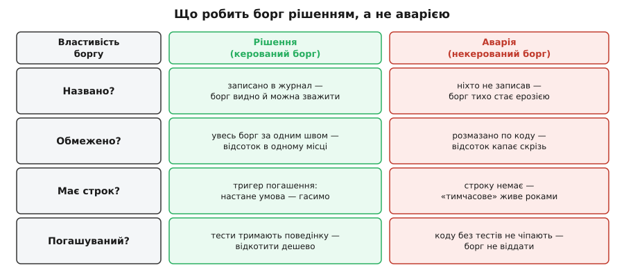
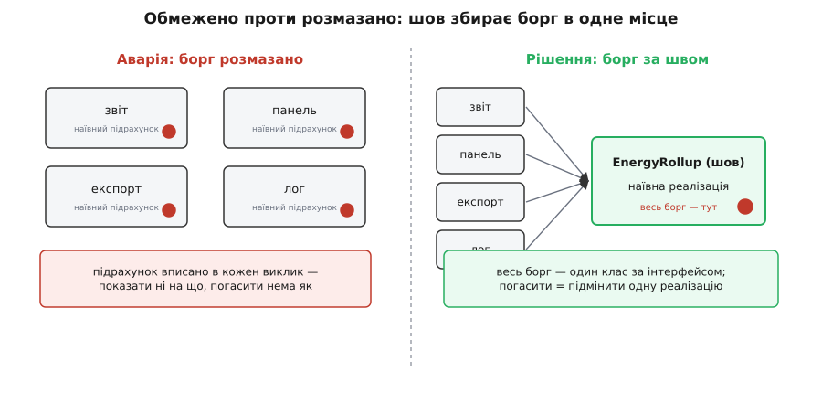

# Технічний борг як свідоме рішення, не аварія

<preknowlist>
- [Середнє й дисперсія](topic:math-probability/mean-variance) — очікуване значення як імовірність, помножена на наслідок; чому «скільки в середньому заплатиш» — це зважена сума можливих кінцівок, а не одне число.
</preknowlist>

Панель енергоспоживання, заради якої підписався перший платний клієнт Digital Homes, уже в проді — ми викотили її на звичайному Postgres, не чекаючи «правильної» бази часових рядів. Але всередині панелі ховається річ, яку команда зробила свідомо й зі стиснутими зубами: щоразу, коли оселя відкриває панель, код **сканує всю сиру телеметрію за день і підсумовує її на льоту**. Це працює. На двадцяти оселях це навіть швидко. Правильно було б тримати передпідраховані «відра» енергії й діставати готове число — але то ще два тижні роботи, а панель треба було вчора. Отже, взяли наївний підрахунок за два дні замість чесного rollup за два тижні.

Питання, яке ставить цей крок: те, що ми щойно зробили, — це катастрофа чи розумний хід? І відповідь не залежить від коду. Той самий рядок, той самий наївний `SUM`, може бути **зразком інженерної зрілості** або **першою цеглиною майбутнього болота** — залежно від того, чи це було **рішення**, чи **аварія**.

Ми вже знаємо метафору, на якій усе тримається: борг має [тіло й відсотки](topic:sf-apps/technical-debt) — тіло це код, що структурою не відповідає задачі, а відсоток це зайвий час і ризик на **кожну** майбутню правку цього місця. Знаємо й Фаулерів квадрант: борг буває свідомий чи випадковий, розважливий чи безрозсудний. Цей крок бере одну клітину квадранта — свідомий розважливий борг — і показує, **що конкретно робить його свідомим і розважливим у коді, а не на словах**. Бо між «ми взяли борг як дорослі» і «ми просто нахалтурили й назвали це боргом» лежить не настрій, а чотири цілком перевірні властивості.

## Рішення проти аварії: у чому різниця насправді

Слово «аварія» (від італ. *avaria* — шкода вантажу) описує те, що **стається з тобою**: раптово, без твого вибору, без плану. Слово «рішення» описує те, що **робиш ти**: обдумано, назвавши, з наміром на майбутнє. Різниця не в тому, добрий код чи поганий, — а в тому, хто тут суб'єкт.

Візьми справжню банківську позику, яку доросла людина бере навмисно. Вона має чотири риси, яких немає в боргу, що звалився на тебе випадково. Позику ти **підписав** — вона на папері, її видно. Вона має **тіло в конкретному місці** — ти точно знаєш, скільки й за що винен. Вона має **строк** — дату, коли платити. І вона **погашувана** — ти справді можеш віддати її, коли строк настане. Прибери будь-яку з цих чотирьох — і замість керованої позики отримаєш пастку: борг, про який забув, розмазаний невідомо де, без дати повернення й такий, що його фізично нема як віддати. Саме це люди й проклинають словом «технічний борг».

Отже, свідомий розважливий борг — це борг, що проходить крізь чотири брами: **названо, обмежено, має строк, погашуваний**. Провалив бодай одну — і твоє «рішення» насправді аварія, яка просто ще не гримнула.


*Ті самі чотири питання, що відрізняють банківську позику від пастки, відрізняють свідомий борг від аварії. Ліва колонка — борг, що пройшов усі брами: записаний, за швом, зі строком-тригером і під тестами. Права — той самий за кодом борг, якого ніхто не назвав, не обмежив, не датував і не може відкотити. Різниця не в рядку коду, а в чотирьох рішеннях довкола нього.*

Пройдімо ці брами по черзі — не як список, а як ланцюг, де кожна ланка тримає наступну. І одразу на нашому наївному підрахунку, щоб брами були не абстракцією, а тим, що можна вписати в журнал уже сьогодні.

## Брама перша: борг названо

Почнімо з найтихішої й найважливішої. Аварійний борг — це борг, якого **ніхто не записав**. Хтось поспішив, зрізав кут, поїхав далі; за півроку той хтось звільнився, а код лишився. Тепер нова людина дивиться на наївний `SUM` і не знає головного: це **навмисна затичка з планом на заміну** чи **так і задумано**? Не знаючи цього, вона не чіпає код — і борг тихо перетворюється на [ерозію архітектури](topic:sf-apps/technical-debt): систему, де кожна зміна дорога, а причини ніхто вже не пам'ятає.

Ліки — назвати борг у ту саму мить, коли його береш, і назвати **там, де живуть рішення**. Ми вже вміємо це робити: у курсі був [журнал архітектурних рішень](topic:sf-apps/architecture-decision-records) — коротка нотатка «що вирішили й чому», яку читають ті, хто прийде після нас. Свідомий борг — це просто ще один запис у цьому журналі, тільки з полями під борг. Ось як виглядає наш наївний підрахунок, проведений крізь усі чотири брами одразу:

```
БОРГ DH-014 · Панель енергії на наївній агрегації
  Тіло:      kwhForDay сканує всю сиру телеметрію оселі на кожен запит.
  Чому:      панель — платна фіча з дедлайном; чесний rollup — 2 тижні,
             наївний підрахунок — 2 дні. Свідомо взяли швидший.
  Межа:      увесь борг замкнено в класі NaiveRollup за інтерфейсом EnergyRollup.
  Відсоток:  час відповіді панелі росте лінійно з кількістю пристроїв оселі.
  Тригер:    p95(запит панелі) > 800 мс  АБО  оселя > 5 000 пристроїв → гасити.
  Погашення: BucketedRollup (передпідраховані відра) як заміна на композиційному корені.
  Страховка: характеризаційний тест пінить числа NaiveRollup перед заміною.
  Власник:   команда Telemetry · відкрито 2026-07-11
```

Цей запис — не бюрократія. Це той самий хід, що [ризик-реєстр](topic:sf-apps/risk-register), який ми вели раніше: винести небезпеку з голів у видимий артефакт, де її можна зважити, переглянути й комусь доручити. Поки борг лише в чиїйсь голові, він не існує для планування — його не поставиш у чергу, не порахуєш, не спитаєш про нього на рев'ю.

> 🔧 **Навіщо це.** Каннінгем, який і вигадав метафору, окремо повертався пояснити, що [ніколи не радив писати код погано](topic:sf-apps/technical-debt/hist-ward-cunningham-debt.md) — він радив писати за нинішнім розумінням і впаювати нове, щойно воно приходить. «Технічний борг» у його устах був **інструментом чесної розмови**, а не виправданням халтури. Названий борг цю чесність зберігає: рядок у журналі каже наступному інженеру «ми знали, на що йшли, ось умова повернення» — і код перестає бути мовчазною міною.

## Брама друга: борг обмежено

Записати борг мало — треба, щоб було **що показати**, коли дійде до сплати. І тут вирішує те, наскільки борг **обмежений місцем**.

Згадаймо механіку відсотка: зайвий час на правку береться з того, що зміна розтікається хвилею по всьому, що знало про змінене. Якщо наш наївний підрахунок вписати **прямо в кожен виклик** — у звіт, у панель, в експорт, у лог, — то борг розмазується: відсоток капає в чотирьох місцях, і, головне, ти вже не можеш **показати пальцем**, де він. Погасити такий борг означає обійти всю базу, знайти всі копії наївної логіки й не забути жодної. Це вже не сплата позики — це археологія.

Тому свідомий борг беруть **за швом**. [Шов](root:progarch/seams-and-boundaries) — це вузьке місце, за яким можна підмінити реалізацію, не чіпаючи тих, хто нею користується. Ми ховаємо наївний підрахунок за інтерфейсом `EnergyRollup`, і тепер **увесь борг — це один клас**. Решта коду бачить лише контракт «дай кіловат-години за день» і не знає й не хоче знати, наївно воно рахує чи розумно.


*Ліворуч борг розмазано: наївна логіка живе копією в кожному виклику, відсоток капає скрізь, показати ні на що. Праворуч той самий борг зібрано за шов: усі виклики залежать від інтерфейсу, а наївна реалізація — один клас під ним. Погасити перший борг — переписати пів бази; погасити другий — підмінити одну реалізацію.*

:::tabs
```ts
// Шов: усе, що знає решта коду, — цей контракт.
interface EnergyRollup {
  kwhForDay(home: string, day: string): Promise<number>;
}

// Свідомий борг: наївно скануємо й підсумовуємо сирі рядки на кожен запит.
// Розплата за масштабом реальна — але ОБМЕЖЕНА цим одним класом.
class NaiveRollup implements EnergyRollup {
  constructor(private db: Db) {}
  async kwhForDay(home: string, day: string): Promise<number> {
    const rows = await this.db.query(
      "SELECT power_w FROM telemetry WHERE home=$1 AND day=$2", [home, day]);
    return rows.reduce((kwh, r) => kwh + r.power_w / 1000 / 3600, 0); // груба інтеграція
  }
}

// Панель бачить лише шов — не знає й не хоче знати про наївність під ним.
async function renderPanel(rollup: EnergyRollup, home: string) {
  const today = await rollup.kwhForDay(home, "2026-07-11");
  // ...малюємо число
}
```
```py
from typing import Protocol

# Шов: контракт, який бачить решта коду.
class EnergyRollup(Protocol):
    def kwh_for_day(self, home: str, day: str) -> float: ...

# Свідомий борг: наївний підсумок сирих рядків на кожен запит.
# Розплата за масштабом реальна — але ОБМЕЖЕНА цим одним класом.
class NaiveRollup:
    def __init__(self, db):
        self.db = db

    def kwh_for_day(self, home: str, day: str) -> float:
        rows = self.db.query(
            "SELECT power_w FROM telemetry WHERE home=%s AND day=%s", (home, day))
        return sum(r.power_w / 1000 / 3600 for r in rows)  # груба інтеграція

# Панель бачить лише шов — не знає про наївність під ним.
def render_panel(rollup: EnergyRollup, home: str) -> None:
    today = rollup.kwh_for_day(home, "2026-07-11")
    # ...малюємо число
```
:::

Тут ховається пастка на пастці. «Обмежити борг» не означає **завчасно натягти абстракцію на все, що рухається** — це вже інший борг, борг [передчасного узагальнення](topic:sf-apps/dry-kiss-yagni): фальшивий шов там, де завтра доведеться його боляче розчіпляти. Свідомий борг обмежують **одним чесним швом навколо саме тієї частини, що тимчасова**, — не менше (бо тоді відсоток розтече) і не більше (бо тоді сама «межа» стане новим боргом).

## Брама третя: борг має строк

Позика без дати повернення ніколи не стає простроченою — а отже, її ніколи не повертають. Це найтихіший спосіб, у який свідомий борг перероджується в аварію: рішення було чесне, шов охайний, а от строку ніхто не назвав. Мине рік — і «тимчасовий» наївний підрахунок стане просто тим, як воно працює, аж поки одного вечора не ляже під навантаженням великого клієнта.

Але з боргом є халепа: **календарну дату не назвеш**. Ми не знаємо, коли підключиться оселя на п'ять тисяч пристроїв — за місяць чи за рік. Тому строк боргу задають не датою, а **тригером** — умовою, яка, ставши правдою, означає «плати зараз». У нашому записі це `p95(запит панелі) > 800 мс` **або** `оселя > 5 000 пристроїв`. Це та сама ідея, що [останній відповідальний момент](topic:sf-apps/last-responsible-moment): гаси не завчасно (переплатиш за роботу, яка ще не потрібна) і не запізно (переплатиш, коли панель уже гальмує в клієнта), а рівно тоді, коли зволікати стало дорожче, ніж гасити. Тригер — це той момент, зроблений **вимірним**.

Чому не погасити просто зараз, для певності? Бо чи варто гасити наперед — це питання про **очікуваний відсоток**, а не про сам факт боргу. Груба оцінка:

```
очікуваний відсоток ≈ зайвий час на одну правку · скільки разів код іще чіпатимемо
```

Код, до якого ми більше не повернемось, має очікуваний відсоток близький до нуля — його борг можна лишити навічно, бо він ніколи не набіжить. Наш наївний підрахунок інший: панель у гарячій зоні, її правитимуть часто, а відсоток ще й **росте сам** із кожним новим пристроєм оселі. Саме тому цьому боргу строк потрібен, а якомусь холодному скрипту-міграції — ні. Рішення «взяти борг» без відповіді «а де цей код на шкалі гарячий-холодний» — це знову не рішення, а вгадування. Коли настане час гасити й скільки за зволікання ми вже переплачуємо — це той самий рахунок [вартості зволікання](root:progarch/cost-of-delay), який ми вже вміємо вести.

І щоб строк не забувся, його **доручають машині**. Тригер із запису — це готова [фітнес-функція](topic:sf-apps/fitness-functions): перевірка в CI, яка щоночі дивиться на метрики й **валить збірку**, щойно `p95` перетнув поріг, а борг DH-014 усе ще відкритий. Людина забуде — конвеєр згадає. Як саме звести журнал боргу з такою перевіркою — щоб жоден борг не жив без запису й жоден прострочений тригер не лишався непоміченим — [винесено в окрему роботу з кодом](root:progarch/debt-as-decision/proj-debt-register.md).

## Брама четверта: борг погашуваний

І остання брама, найпідступніша, бо вона обнуляє всі попередні. Уяви, що борг названо, обмежено швом і споряджено тригером. Тригер спрацював: панель гальмує, час гасити. Ти відкриваєш `NaiveRollup`, щоб замінити його на `BucketedRollup`, — і завмираєш. Бо в наївного класу **немає жодного тесту**, а панель уже бачать реальні клієнти, і платять вони за правильні числа. Будь-яка твоя заміна може тихо збити кіловат-години на пару відсотків, і ти цього не помітиш, поки не подзвонить розлючений користувач. Тому ти не чіпаєш. «Рішення погасити» виявилося брехнею: борг був **непогашуваним із самого початку**.

Ось де окупається весь цей модуль. Борг стає погашуваним не в мить сплати, а в мить, коли його **беруть** — якщо тоді ж накинути на нього страхувальну сітку. Наша сітка — [характеризаційний тест](root:progarch/characterization-tests): він не питає, «правильно» рахує наївний клас чи ні, він **пришпилює те, що клас робить зараз** — на десятку реальних осель фіксує рівно ті числа, які повертає `NaiveRollup` сьогодні. Тепер заміна безпечна: пишемо `BucketedRollup`, ганяємо його проти того самого тесту, і зелене світло означає «нова реалізація дає ті самі числа, що клієнти вже бачать». [Безпечний рефакторинг](root:progarch/refactoring-safe) — це і є заміна під зеленим тестом, малими кроками, з можливістю відкотитися будь-якої миті.

> 🔧 **Навіщо це.** Ось чому «погашуваний» — не побажання, а інженерна властивість, яку закладають наперед. Шов робить борг **обмеженим**, а характеризаційний тест робить його **відкотним** — разом вони перетворюють наче незворотне рішення на [двобічні двері](topic:sf-apps/reversible-irreversible-decisions): взяли наївну реалізацію сьогодні, спокійно підмінили розумну завтра, і жодного клієнта по дорозі не зачепили. Борг без тестів — це позика, яку фізично нема чим віддати, скільки б ти не хотів; саме такий борг і топить системи.

## Аварія в костюмі рішення

Тепер видно найнебезпечніший різновид — той, що маскується під свідомий борг. Фаулерів квадрант називає його **свідомий безрозсудний**, і його гасло — точні слова: «У нас немає часу на дизайн». Хтось же його вибрав — отже, ніби рішення? Ні. Проведи його крізь чотири брами, і воно провалить усі: борг ніде не названо (просто нахалтурили), нічим не обмежено (розлізлося по коду), без строку (ніхто не думав повертати) і без тестів (чіпати страшно). Це аварія, яка вдягла костюм рішення й ходить із розумним виглядом.

Саме тому чотири брами корисніші за квадрант: квадрант називає стан, а брами дають **перевірку**. Не питай себе «а це в мене свідомий розважливий борг?» — на це кожен відповість «звісно, так». Питай конкретне: чи він **названий** у журналі? чи **обмежений** одним швом? чи має **тригер** повернення? чи **прикритий** тестом? Чотири «так» — маєш здорову позику. Бодай одне «ні» — маєш аварію, яка просто ще не гримнула, і ти щойно дізнався, котру браму лагодити.

## Що лишається в руках

Найбільша ілюзія про технічний борг — що команди, які тонуть у ньому, набрали його **більше**. Це не так. Вони набрали його **непоміченим**. Дві команди можуть нести однаковий за обсягом борг: одна квітне, друга задихається — і різниця не в кількості наївних `SUM`, а в тому, що в першої кожен із них **на рахунку**, а в другої жоден.

Тож борг — це рішення рівно тоді, коли ти можеш відповісти на чотири питання про кожен його шматок: чи він названий, чи обмежений, чи має строк, чи погашуваний. Можеш відповісти — ти дорослий позичальник, і борг працює на тебе, як іпотека, що дає житло на десять років раніше. Не можеш — значить, ти нічого не вирішував; борг просто **стався** з тобою, а ти дізнаєшся про нього того дня, коли він уже нічого не питатиме.

І тримати ці чотири «так» правдивими з роками — окрема тиха дисципліна. Людина, що взяла борг, звільниться; тригер забудеться; тест хтось видалить як «зайвий». Тому журнал боргу — не разовий запис, а **живий облік**, який переглядають, як ризик-реєстр, і чиї тригери вшиті у фітнес-функції, щоб машина пам'ятала те, що забуває людина. Не «чистий код» відрізняє здорову систему від болота — а **облік**. Аварія — це не борг. Аварія — це борг, за яким ніхто не веде рахунку.
