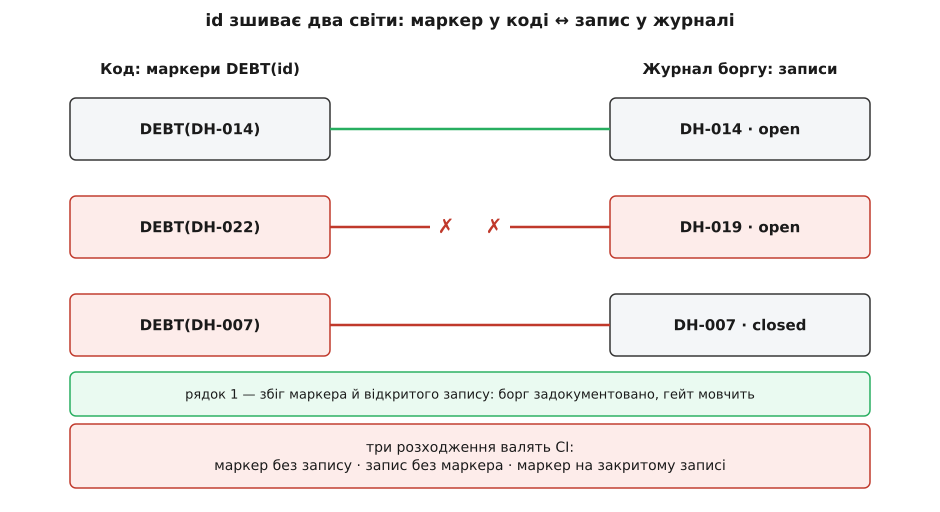

# ⚙️ Журнал боргу, зшитий зі збіркою

Запис `БОРГ DH-014`, який ми склали, поки що лежить простим текстом — у вікі, у файлі `DEBT.md`, будь-де. І тут криється зрада: текстовий запис протухає рівно так само, як борг, що він описує. Мине півроку — дата в ньому збреше, тригер уже спрацює, а ніхто не гляне, бо глянути мала людина, а людина забула. Обіцянка була інша: тримати журнал так, щоб забути не було кому — **зшити його зі збіркою**, аби машина сама на кожному пуші перечитувала і код, і журнал, і живі метрики й валила білд, щойно вони розійшлися.

Розходяться вони двома способами, і обидва треба зробити машинно неможливими. Перший: борг живе **у коді, але не в журналі** — хтось зрізав кут і не записав; або живе **в журналі, але не в коді** — запис лишився, а код давно переписали. Маркер і запис роз'їхались, і «названо» тихо перестало бути правдою. Другий: тригер **став правдою, а цього ніхто не помітив** — борг прострочився в тиші, і «має строк» обернулось на порожній рядок. Інструмент мусить стерегти саме ці два шви — і нічого більше.

Що люди зізнаються в борзі просто в коментарях — давно не новина. Ще 2014 року Айкет Потдар і Емад Шихаб, розібравши вручну коментарі в чотирьох великих проєктах, назвали це **самовизнаним технічним боргом** (self-admitted technical debt): місця, де автор зізнається в халтурі прямо в коментарі — «TODO», «hack», «тимчасово, потім перепишемо». Вони знайшли такі зізнання в 2–31% файлів — і, що куди важливіше, лише від чверті до двох третин із них колись прибирали; решта осідала в коді назавжди (це задокументоване емпіричне спостереження, не оцінка на око). Голе зізнання не тримає нічого: ні плану, ні строку, ні власника — за рік це просто шум, повз який усі ходять. Наше завдання — зробити так, щоб зізнання в коді **вказувало на запис**, запис **ніс вимірний строк**, а збірка **стерегла обидва**.

## Задача

Чого ми хочемо від інструмента — рівно три речі.

Перше — тримати борг **даними**, а не прозою. Той самий запис із журналу, але як типізована структура, яку однаково читає й людина на рев'ю, і скрипт у CI: id, тіло, причина, шов, сигнал відсотка, тригер, план погашення, страховка-тест, власник. Друге — стерегти **синхронізацію коду й журналу** в обидва боки: жодного маркера боргу в коді без відкритого запису, жодного відкритого запису без маркера, жодного маркера на вже закритому записі. Третє — стерегти **строки**: обчислювати кожен тригер проти свіжого знімка метрик і валити білд, коли тригер став правдою, а борг ще відкритий.

Чого ми навмисне **не** хочемо — то це платформи керування боргом із дашбордами й полями на пів екрана. Такий інструмент уміє більше, але саме тому в нього ніхто не заглядає, а маркери в коді живуть окремим життям від нього. Нам треба вісімдесят рядків, що лежать у репозиторії поряд із кодом, які кожен у команді прочитає за один захід і яким довіряє, бо бачить їх наскрізь. Журнал живий рівно доти, доки лишається дрібним і чесним.

## Ідея

Уся механіка тримається на двох рішеннях, які легко проґавити, — і саме через них інструмент або справді стереже борг, або лише вдає, що стереже.

**Перше рішення — тригер мусить бути машинно-обчислюваний, а не проза.** Спокуса — записати строк словами: «коли пристроїв стане багато» чи «як панель почне гальмувати». Людина таке прочитає й кивне. Але гейт таку умову перевірити не може — а строк, який ніхто (і ніщо) не перевіряє, це не строк, а побажання. «Має строк» перетворюється на театр: рядок є, а машина повз нього проходить. Тому тригер у записі — не речення, а **предикат над метрикою**: назва метрики, оператор, поріг. У DH-014 це дві клаузи — `panel_p95_ms > 800` **або** `max_devices_per_home > 5000`; будь-яка істинна означає «гасити». Ціна цього рішення прямо названа: ти мусиш назвати метрику, яку моніторинг **справді знімає**. Не можеш назвати — значить, у тебе не тригер, а туман, і гейт має це підсвітити, а не проковтнути. Ця перевірка метрик проти порогів на кожному пуші — рівно [фітнес-функція](book:programming/fitness-functions): автоматичний тест, що міряє код не за поведінкою, а за наскрізною властивістю (тут — «чи не прострочився борг») і тримає його в межах.

**Друге рішення — id як шов між двома світами: кодом і журналом.** Борг живе двічі. У коді — маркером у коментарі, `// DEBT(DH-014)`, просто там, де сидить наївний `SUM`. У журналі — записом із усіма полями. Зшиває їх **id**: та сама мітка `DH-014` в обох місцях. Гейт бере дві множини, кейовані за id, і вимагає, щоб вони збіглися. Розходження буває трьох видів, і кожен має свій сенс. **Маркер без запису** — хтось зрізав кут і не завів рядка: недокументований борг, той самий, що тихо стає ерозією. **Відкритий запис без маркера** — журнал показує пальцем у нікуди: код, який він описував, змінили чи прибрали, а рядок забули закрити; тепер журнал бреше про те, де борг. **Маркер на закритому записі** — борг погасили, а зізнання в коді лишилось: наступний інженер прочитає «тут наївно», злякається й не чіпатиме давно вже здорове місце. Усі три — це дрейф, а дрейф і є тим, як «керований» борг нечутно стає аварією.


*id — це шов, за яким гейт звіряє два світи. Маркер у коді й запис у журналі мусять указувати один на одного: збіг (зелена лінія) означає задокументований борг, а будь-яке з трьох розходжень червонить білд. Так «названо» перестає бути обіцянкою й стає властивістю, яку не можна тихо порушити.*

Обидві перевірки перетворюються на **гейт** тим самим фокусом, що й будь-який лінтер: складають список порушень, і якщо він не порожній — процес виходить із ненульовим кодом. А ненульовий код — універсальна мова CI: збірка читає його як «впало» й фарбує білд червоним. Журнал, що розійшовся з кодом чи прострочив тригер, просто не «збереться».

> 🔧 **Навіщо це.** Чому зшивати з білдом, а не поставити нагадування «переглянь борг раз на місяць»? Бо дрейф між кодом і журналом стається **між** переглядами, тихо, тієї самої миті, коли хтось переписав функцію й не торкнувся рядка. Нагадування в календарі конкурує з усім іншим у голові й одного напруженого тижня програє. А гейт не просить, щоб про нього пам'ятали: він ганяється на кожному пуші й ловить розходження **того ж дня**, коли воно з'явилось, — поки автор ще пам'ятає, що робив, і поки борг не встиг протухнути до наступного календарного нагадування. Це та сама різниця, що між «ми домовились чистити борг» і автоформатером на коміті: перше тримається на дисципліні, друге — на тому, що інакше не збереться.

## Робочий код

Це не екзотична ідея: половину нашої роботи вже робить готовий інструмент. **todocheck** (Преслав Михайлов, написаний на Go) вимагає, щоб кожен коментар `// TODO(#412)` указував на **відкриту** задачу в трекері, і валить CI, щойно задачу закрили, а `TODO` в коді лишився. Ми будуємо боргового родича: маркер указує не на задачу в трекері, а на **запис у журналі поруч із кодом**, і цей запис несе ще й метричний тригер, який той самий гейт уміє **обчислити**.

Мова тут — загальна бекенд-склейка й CI, тож показую двома: TypeScript і Python. Зважмо чесно: вся робота — це обхід дерева файлів, регулярка та звірка кількох множин і словника метрик; гарячого шляху, паралелізму чи роботи з пам'яттю немає, тож перформанс-мова (C, Rust, Go) сирої ваги тут не набрала б — виразність важить більше за такти, а обидві показані мови однаково прозоро лягають на задачу. Обидва файли самодостатні: скопіюй, запусти — і побачиш той самий звіт із ненульовим кодом виходу.

### Схема запису

Спершу — сам запис як тип. Полів десять, але вся сила запису в двох, що роблять борг **керованим машиною**: `id`, яким запис зчеплено з маркером у коді, і `trigger`, яким строк стає обчислюваним. Ще два гейт теж читає — `state` (борг відкритий чи вже погашений) і `owner` (чи є кого підняти); а решта шість описують борг для людини на рев'ю та для того, хто його колись гаситиме.

:::tabs
```ts
// debt-gate.ts — журнал боргу як дані, що звіряються з кодом і метриками.
// Запуск у CI:  npx tsx debt-gate.ts   (ненульовий код виходу = білд червоний)

type State = "open" | "closed";
type Op = ">" | ">=" | "<" | "<=";

interface Clause { metric: string; op: Op; threshold: number; }  // машинний строк

interface Debt {
  id: string;          // ← ЗШИВАЧ: та сама мітка в коді (// DEBT(id)) і тут
  body: string;        // тіло боргу — що саме тимчасове
  why: string;         // чому взяли (дедлайн проти чесного рішення)
  seam: string;        // за яким швом замкнено (де його весь видно)
  interest: string;    // сигнал відсотка — куди дивитись, щоб побачити, як капає
  trigger: Clause[];   // ← СТРОК: будь-яка клауза істинна → час гасити
  repay: string;       // план погашення — чим заміняємо
  test: string;        // страховка — тест, що робить заміну безпечною
  owner: string;       // жива людина/команда; "" = діра
  state: State;
}
```
```py
# debt_gate.py — журнал боргу як дані, що звіряються з кодом і метриками.
# Запуск у CI:  python debt_gate.py   (ненульовий код виходу = білд червоний)

from dataclasses import dataclass
import re, sys
from pathlib import Path


@dataclass(frozen=True)
class Clause:            # машинний строк
    metric: str
    op: str             # ">" | ">=" | "<" | "<="
    threshold: float


@dataclass
class Debt:
    id: str             # ← ЗШИВАЧ: та сама мітка в коді (# DEBT(id)) і тут
    body: str           # тіло боргу — що саме тимчасове
    why: str            # чому взяли (дедлайн проти чесного рішення)
    seam: str           # за яким швом замкнено (де його весь видно)
    interest: str       # сигнал відсотка — куди дивитись, щоб побачити, як капає
    trigger: list       # ← СТРОК: list[Clause]; будь-яка істинна → час гасити
    repay: str          # план погашення — чим заміняємо
    test: str           # страховка — тест, що робить заміну безпечною
    owner: str          # жива людина/команда; "" = діра
    state: str          # "open" | "closed"
```
:::

Поле `id` — це той самий шов, тільки перенесений у дані: воно й тільки воно зв'язує коментар у коді з рядком у журналі. Поле `trigger` — машинний строк: не «коли стане повільно», а `panel_p95_ms > 800`, умова, яку можна **обчислити**. Поле `seam` називає [шов](root:progarch/seams-and-boundaries) — вузьке місце, за яким реалізацію підміняють, не чіпаючи тих, хто нею користується; воно каже рев'ю, де борг увесь видно. Поле `test` — [характеризаційний тест](root:progarch/characterization-tests), що пришпилює поведінку класу «як є», щоб заміну потім звірити число-в-число. Ці два останні гейт не читає — вони для людини, — але без них «обмежено» й «погашуваний» лишаються словами, тож у записі вони обов'язкові.

### Журнал

Тепер дані. Це запис DH-014 із журналу плюс три інші — і всі три навмисне «підпсуто», щоб побачити, як гейт кусає. Живе це поряд із кодом, там само, де [журнал архітектурних рішень](book:programming/architecture-decision-records): коротка нотатка «що вирішили й чому», яку читає той, хто прийде після.

:::tabs
```ts
const JOURNAL: Debt[] = [
  { id: "DH-014",
    body: "kwhForDay сканує всю сиру телеметрію оселі на кожен запит",
    why: "панель — платна фіча з дедлайном; rollup — 2 тижні, наївно — 2 дні",
    seam: "EnergyRollup", interest: "час відповіді росте лінійно з пристроями оселі",
    trigger: [{ metric: "panel_p95_ms", op: ">", threshold: 800 },
              { metric: "max_devices_per_home", op: ">", threshold: 5000 }],
    repay: "BucketedRollup на композиційному корені",
    test: "характеризаційний тест пінить числа NaiveRollup",
    owner: "команда Telemetry", state: "open" },

  { id: "DH-031",
    body: "нічний експорт CSV збирає весь місяць у пам'ять",
    why: "перший корпоративний клієнт просив «вже»; стрімінг — потім",
    seam: "MonthlyExport", interest: "пік пам'яті росте з розміром оселі",
    trigger: [{ metric: "export_lag_s", op: ">", threshold: 120 }],  // ← метрики ще нема у знімку
    repay: "потоковий експорт партіями", test: "золотий CSV на еталонній оселі",
    owner: "команда Data", state: "open" },

  { id: "DH-019",
    body: "правила автоматизації тримаються в одному JSON-полі",
    why: "форму правил ще шукали — не хотіли фіксувати схему рано",
    seam: "RuleStore", interest: "кожен новий тип правила чіпає парсинг усього поля",
    trigger: [{ metric: "rule_types", op: ">", threshold: 6 }],
    repay: "нормалізована таблиця правил", test: "снапшот чинних правил",
    owner: "", state: "open" },   // ← власника не призначили, і маркера в коді вже нема

  { id: "DH-007",
    body: "перша версія парсера телеметрії на регулярках",
    why: "треба було завести хоч якісь дані з першого хабу",
    seam: "TelemetryParser", interest: "—",
    trigger: [], repay: "бінарний декодер за схемою (зроблено)",
    test: "корпус реальних кадрів", owner: "Данило", state: "closed" }, // ← погашено, та маркер завис
];
```
```py
JOURNAL = [
    Debt("DH-014", "kwhForDay сканує всю сиру телеметрію оселі на кожен запит",
         "панель — платна фіча з дедлайном; rollup — 2 тижні, наївно — 2 дні",
         "EnergyRollup", "час відповіді росте лінійно з пристроями оселі",
         [Clause("panel_p95_ms", ">", 800), Clause("max_devices_per_home", ">", 5000)],
         "BucketedRollup на композиційному корені",
         "характеризаційний тест пінить числа NaiveRollup",
         "команда Telemetry", "open"),

    Debt("DH-031", "нічний експорт CSV збирає весь місяць у пам'ять",
         "перший корпоративний клієнт просив «вже»; стрімінг — потім",
         "MonthlyExport", "пік пам'яті росте з розміром оселі",
         [Clause("export_lag_s", ">", 120)],          # ← метрики ще нема у знімку
         "потоковий експорт партіями", "золотий CSV на еталонній оселі",
         "команда Data", "open"),

    Debt("DH-019", "правила автоматизації тримаються в одному JSON-полі",
         "форму правил ще шукали — не хотіли фіксувати схему рано",
         "RuleStore", "кожен новий тип правила чіпає парсинг усього поля",
         [Clause("rule_types", ">", 6)],
         "нормалізована таблиця правил", "снапшот чинних правил",
         "", "open"),                                  # ← без власника, і маркера в коді вже нема

    Debt("DH-007", "перша версія парсера телеметрії на регулярках",
         "треба було завести хоч якісь дані з першого хабу",
         "TelemetryParser", "—", [],
         "бінарний декодер за схемою (зроблено)", "корпус реальних кадрів",
         "Данило", "closed"),                          # ← погашено, та маркер завис
]
```
:::

DH-031 несе тригер на метрику `export_lag_s`, якої в моніторингу ще нема; DH-019 — відкритий, але без власника й без маркера в коді; DH-007 погашено (`closed`), проте маркер у коді хтось забув прибрати. Це три пастки, розкладені по кутах, — зараз гейт кожну підсвітить.

### Скан коду на маркери

Другий бік шва — самі маркери. `scanMarkers` обходить дерево вихідників і збирає кожен `DEBT(id)` з файлом і рядком. Регулярка чіпляється **саме за синтаксис мітки** `DEBT(DH-\d+)`, а не за слово «борг» у прозі коментаря, — інакше перевірка спотикалася б об кожну згадку й скоро втратила б довіру.

:::tabs
```ts
import { readdirSync, readFileSync } from "node:fs";
import { join, relative } from "node:path";

const MARKER = /DEBT\((DH-\d+)\)/g;             // // DEBT(DH-014) — саме мітка, не слово
interface Marker { id: string; at: string; }

function walk(dir: string): string[] {
  return readdirSync(dir, { withFileTypes: true }).flatMap((e) => {
    const p = join(dir, e.name);
    return e.isDirectory() ? walk(p) : [p];
  });
}

function scanMarkers(root: string): Marker[] {
  const out: Marker[] = [];
  for (const file of walk(root)) {
    if (!/\.(ts|js|sql)$/.test(file)) continue;
    readFileSync(file, "utf8").split("\n").forEach((ln, i) => {
      for (const m of ln.matchAll(MARKER))
        out.push({ id: m[1], at: `${relative(root, file).replaceAll("\\", "/")}:${i + 1}` });
    });
  }
  return out;
}
```
```py
MARKER = re.compile(r"DEBT\((DH-\d+)\)")          # # DEBT(DH-014) — саме мітка, не слово


def scan_markers(root: Path):
    out = []
    for f in root.rglob("*"):
        if f.suffix not in (".py", ".sql"):
            continue
        for i, ln in enumerate(f.read_text(encoding="utf-8").splitlines(), 1):
            for m in MARKER.finditer(ln):
                out.append((m.group(1), f"{f.relative_to(root).as_posix()}:{i}"))
    return out
```
:::

### Дві перевірки

І серце інструмента — дві функції над даними. `checkSync` звіряє маркери з журналом у обидва боки; `checkOverdue` обчислює тригери проти знімка метрик. Обидві **чисті**: беруть дані, повертають список порушень — тому їх легко тестувати й легко читати.

:::tabs
```ts
interface Violation { id: string; detail: string; }

function checkSync(markers: Marker[], journal: Debt[]): Violation[] {
  const out: Violation[] = [];
  const byId = new Map(journal.map((d) => [d.id, d]));
  const marked = new Set(markers.map((m) => m.id));

  for (const m of markers) {                         // напрям 1: маркер → запис
    const d = byId.get(m.id);
    if (!d) out.push({ id: m.id, detail: `маркер у ${m.at} без запису в журналі` });
    else if (d.state === "closed")
      out.push({ id: m.id, detail: `маркер у ${m.at} на ЗАКРИТОМУ записі — прибрати з коду` });
  }
  for (const d of journal) {                         // напрям 2: відкритий запис → маркер
    if (d.state !== "open") continue;
    if (!marked.has(d.id)) out.push({ id: d.id, detail: "відкритий запис без жодного маркера в коді" });
    if (!d.owner.trim())   out.push({ id: d.id, detail: "відкритий борг без власника" });
  }
  return out;
}

const CMP: Record<Op, (a: number, b: number) => boolean> = {
  ">": (a, b) => a > b, ">=": (a, b) => a >= b, "<": (a, b) => a < b, "<=": (a, b) => a <= b,
};

function checkOverdue(journal: Debt[], metrics: Record<string, number>): Violation[] {
  const out: Violation[] = [];
  for (const d of journal) {
    if (d.state !== "open") continue;
    for (const c of d.trigger) {
      const v = metrics[c.metric];
      if (v === undefined)                            // метрики нема у знімку → перевірити НЕ можемо
        out.push({ id: d.id, detail: `тригер зважає на метрику "${c.metric}", якої нема у знімку — перевірити нема як` });
      else if (CMP[c.op](v, c.threshold))             // тригер став правдою, а борг відкритий → прострочено
        out.push({ id: d.id, detail: `ПРОСТРОЧЕНО: ${c.metric}=${v} ${c.op} ${c.threshold} — гасити (власник: ${d.owner || "—"})` });
    }
  }
  return out;
}
```
```py
CMP = {">": lambda a, b: a > b, ">=": lambda a, b: a >= b,
       "<": lambda a, b: a < b, "<=": lambda a, b: a <= b}


def check_sync(markers, journal):
    out = []
    by_id = {d.id: d for d in journal}
    marked = {mid for mid, _ in markers}

    for mid, at in markers:                          # напрям 1: маркер → запис
        d = by_id.get(mid)
        if d is None:
            out.append((mid, f"маркер у {at} без запису в журналі"))
        elif d.state == "closed":
            out.append((mid, f"маркер у {at} на ЗАКРИТОМУ записі — прибрати з коду"))
    for d in journal:                                # напрям 2: відкритий запис → маркер
        if d.state != "open":
            continue
        if d.id not in marked:
            out.append((d.id, "відкритий запис без жодного маркера в коді"))
        if not d.owner.strip():
            out.append((d.id, "відкритий борг без власника"))
    return out


def check_overdue(journal, metrics):
    out = []
    for d in journal:
        if d.state != "open":
            continue
        for c in d.trigger:
            if c.metric not in metrics:              # метрики нема у знімку → перевірити НЕ можемо
                out.append((d.id, f'тригер зважає на метрику "{c.metric}", якої нема у знімку — перевірити нема як'))
            elif CMP[c.op](metrics[c.metric], c.threshold):  # тригер став правдою, борг відкритий → прострочено
                out.append((d.id, f"ПРОСТРОЧЕНО: {c.metric}={metrics[c.metric]} {c.op} {c.threshold} — гасити (власник: {d.owner or '—'})"))
    return out
```
:::

Три деталі варті окремого слова. Перша — `if (d.state !== "open") continue`: прострочення й вимогу власника застосовуємо лише до **відкритого** боргу, бо закритий за визначенням уже погашено, і чіпати його безглуздо. Друга — гілка `v === undefined` у `checkOverdue`: якщо тригер посилається на метрику, якої в знімку немає, ми **не** мовчки пропускаємо рядок, а видаємо порушення. «Не можу перевірити» — це не «все гаразд»: строк, який нема чим зміряти, гейт мусить оголосити зламаним уголос. Третя — власне гейт: обидві функції повертають списки, а `report` нижче складе їхню довжину в код виходу.

### Звіт, гейт і що друкує CI

Лишилось зібрати докупи: обчислити обидві перевірки й вийти з кодом, який читає CI.

:::tabs
```ts
function report(sync: Violation[], overdue: Violation[]): number {
  const show = (title: string, vs: Violation[]) => {
    console.log(`\n${title}`);
    if (!vs.length) { console.log("  чисто"); return; }
    for (const v of vs) console.log(`  ✗ ${v.id.padEnd(7)} ${v.detail}`);
  };
  show("СИНХРОНІЗАЦІЯ КОД ↔ ЖУРНАЛ", sync);
  show("СТРОКИ (тригер проти знімка метрик)", overdue);
  const n = sync.length + overdue.length;
  console.log(n ? `\n${n} порушень → борг вийшов з-під контролю, CI падає`
                : "\nборг під контролем — CI зелений");
  return n ? 1 : 0;
}

// У CI:  const markers = scanMarkers("src");  const metrics = readSnapshot();
// Тут — відтворюваний знімок того, що вони повернули б.
const MARKERS: Marker[] = [
  { id: "DH-014", at: "panel/energy.ts:42" }, { id: "DH-031", at: "export/report.ts:17" },
  { id: "DH-022", at: "panel/energy.ts:31" }, { id: "DH-007", at: "panel/legacy.ts:88" },
];
const METRICS = { panel_p95_ms: 930, max_devices_per_home: 4200, rule_types: 4 };

process.exit(report(checkSync(MARKERS, JOURNAL), checkOverdue(JOURNAL, METRICS)));
```
```py
def report(sync, overdue) -> int:
    def show(title, vs):
        print(f"\n{title}")
        if not vs:
            print("  чисто"); return
        for vid, detail in vs:
            print(f"  ✗ {vid:<7} {detail}")
    show("СИНХРОНІЗАЦІЯ КОД ↔ ЖУРНАЛ", sync)
    show("СТРОКИ (тригер проти знімка метрик)", overdue)
    n = len(sync) + len(overdue)
    print(f"\n{n} порушень → борг вийшов з-під контролю, CI падає" if n
          else "\nборг під контролем — CI зелений")
    return 1 if n else 0


# У CI:  markers = scan_markers(Path("src"));  metrics = read_snapshot()
# Тут — відтворюваний знімок того, що вони повернули б.
MARKERS = [("DH-014", "panel/energy.py:42"), ("DH-031", "export/report.py:17"),
           ("DH-022", "panel/energy.py:31"), ("DH-007", "panel/legacy.py:88")]
METRICS = {"panel_p95_ms": 930, "max_devices_per_home": 4200, "rule_types": 4}

if __name__ == "__main__":
    sys.exit(report(check_sync(MARKERS, JOURNAL), check_overdue(JOURNAL, METRICS)))
```
:::

**Запуск на журналі й знімку вище.** Обидві версії дають той самий звіт — різняться лише розширення у шляхах (`.ts` проти `.py`), бо це знімок сканування коду відповідною мовою:

```text
СИНХРОНІЗАЦІЯ КОД ↔ ЖУРНАЛ
  ✗ DH-022  маркер у panel/energy.ts:31 без запису в журналі
  ✗ DH-007  маркер у panel/legacy.ts:88 на ЗАКРИТОМУ записі — прибрати з коду
  ✗ DH-019  відкритий запис без жодного маркера в коді
  ✗ DH-019  відкритий борг без власника

СТРОКИ (тригер проти знімка метрик)
  ✗ DH-014  ПРОСТРОЧЕНО: panel_p95_ms=930 > 800 — гасити (власник: команда Telemetry)
  ✗ DH-031  тригер зважає на метрику "export_lag_s", якої нема у знімку — перевірити нема як

6 порушень → борг вийшов з-під контролю, CI падає
```

Код виходу — `1`, білд червоний. І кожен рядок — не тривога, а конкретна дія. `DH-022` у коді є, а в журналі нема: або заведи запис, або, якщо це не борг, а забутий кут, прибери мітку. `DH-007` погашено — зітри застарілий маркер, поки він нікого не злякав. `DH-019` живе в журналі, а в коді його вже нема — закрий запис, і заразом признач власника, бо відкритий борг без власника нікому не належить. `DH-014` прострочився насправді: p95 панелі вже 930 мс проти порогу 800 — час діставати `BucketedRollup`, і команда Telemetry знає, що це її робота. А `DH-031` показує найтихішу пастку: тригер начебто є, але метрики `export_lag_s` моніторинг не шле, тож строк цей ніхто не міг би перевірити — його треба або підперти реальною метрикою, або чесно визнати, що строку в боргу поки нема.

## Складність і пастки

Інструмент дрібний, але саме дрібнота ховає пастки — і всі вони не в коді, а в тому, як ним користуються.

**Тригер без вимірної метрики — це гейт-театр.** Найспокусливіше — записати строк красивими словами й піти далі з чистим сумлінням. Але «коли навантаження зросте» гейт обчислити не може: він не знає, що таке «зросте» й де це число взяти. Саме тому схема силою заганяє тригер у форму `метрика · оператор · поріг`, а `checkOverdue` на невідому метрику не мовчить, а падає. Це ключовий захист: пастку видно **в мить, коли борг беруть**, а не того вечора, коли панель уже гальмує в клієнта. Практичний наслідок жорсткий: якщо ти не можеш назвати метрику, яку моніторинг справді знімає, — у тебе не строк, а надія, і DH-031 у прикладі — саме така надія, спіймана за руку. Строк реальний рівно настільки, наскільки реальна метрика під ним.

**Маркери й журнал розходяться — і то підступніше, ніж здається.** Найтихіший різновид — не халтура, а **друкарська помилка**: хтось напише `DEBT(DH-14)` замість `DH-014`, і мітка тихо осиротіє — вкаже на запис, якого нема. Саме тому гейт трактує маркер із незнайомим id як порушення, а не як дрібницю: помилка в id не має права прикинутися «задокументованим боргом». Друга тонкість — **протухлий маркер після погашення**: борг закрили, а зізнання в коді лишилось, і наступний читач вірить брехні. Тому `checkSync` дивиться в обидва боки, а не лише «чи є запис на маркер». І навпаки: один борг може законно розсипатися міткою по десятку файлів — багато маркерів, один id — і це **не** порушення; вимагати «рівно одна мітка на запис» було б хибним спрощенням, бо борг справді буває розкиданий. А коли протухлих, дозволених маркерів у коді набирається десяток, вони стають [розбитими вікнами](book:programming/technical-debt): видима нечупарність, що кожному нижче по коду каже «тут так можна».

**Борг без власника — це аварія з відкладеним детонатором.** Порожнє поле `owner` саме по собі мовчазне: сьогодні воно нічого не ламає. Але згадай, що станеться, коли DH-019 колись прострочиться: гейт закричить «гасити!» — і в порожнечу, бо нема кому цей крик адресувати. Тому ми ловимо порожнього власника **на відкритому записі одразу**, ще до будь-якого тригера: краще зчепитися за власника, поки борг спокійний, ніж шукати винного, коли вже горить. Власник — це не поле для звітності, а відповідь на питання «кого підняти о третій ночі», і питати його треба заздалегідь.

І остання, майже непомітна пастка ховається в слові «знімок». Гейт чесний рівно настільки, наскільки свіжий і повний `metrics`. Метрика може бути в схемі тригера, але якщо моніторинг її не шле — гілка «нема у знімку» спрацює й підсвітить це; а от якщо шле, але знімок **застарілий** (учорашній, коли p95 був іще низький), гейт спокійно позеленіє над боргом, що вже прострочений. «Вимірна» й «зміряна» — різні слова: перше про схему, друге про живий конвеєр метрик, який цей знімок наповнює. Тому знімок беруть свіжим, з того самого моніторингу, що годує панелі, — інакше найчесніший тригер стереже порожнечу. Зшити журнал зі збіркою — це не написати вісімдесят рядків і забути; це тримати живими три речі одразу: мітку в коді, запис у журналі й струмок метрик, який робить строк не словом, а числом.
