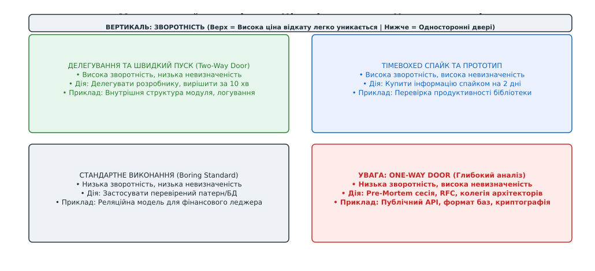
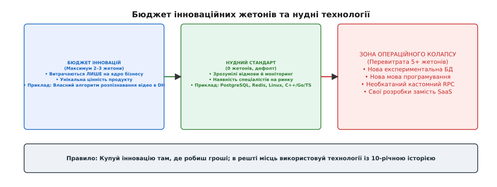
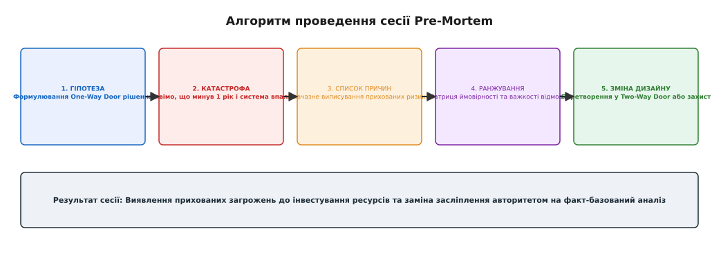
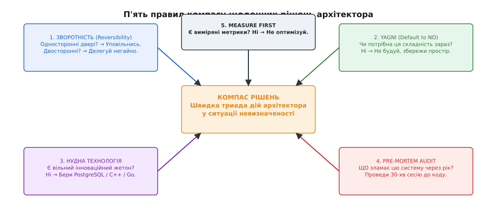

# Евристики рішення на щодень

<preknowlist>
- [Зворотні й незворотні рішення](root:progarch/decisions-under-uncertainty/reversible-irreversible-decisions) — класифікація односторонніх і двосторонніх дверей (One-Way vs Two-Way Doors) та вартість відкату.
- [YAGNI та межа DRY](book:programming/software-design/dry-kiss-yagni) — боротьба з передчасною складністю та незапитаними абстракціями.
- [Ризик-мислення та Pre-mortem](book:programming/architecture-discipline/risk-thinking) — аналіз потенційних відмов системи до початку розробки.
- [Вибір нудної технології](book:programming/architecture-discipline/build-vs-buy) — інноваційні жетони та стійкі інфраструктурні стандарти.
</preknowlist>

Команда архітекторів платформенного сервісу Digital Homes опиняється перед вибором брокера повідомлень під обробку 50 000 телеметричних подій на секунду з мільйона підключених хабів. Застосування формального аналізу корисності з побудовою повного дерева атрибутів якості (ATAM) та порівняльним бенчмаркінгом чотирьох кандидатів вимагає трьох місяців дослідницької роботи. Проте бізнес вимагає виходу на новий ринок через три тижні, а інвестори змінюють продуктивні пріоритети швидше, ніж інженери встигають завершити синтетичні тести. Намагання довести кожне архітектурне рішення до математично вивіреного оптимуму в умовах браку часу та неповної інформації неминуче призводить до аналітичного паралічу (*analysis paralysis*), коли система взагалі перестає розвиватися, а команда витрачає весь ресурс на безкінечні мітинги та порівняльні таблиці.

## 1. Пастка аналітичного паралічу у системному дизайні

Аналітичний параліч виникає тоді, коли інженерна команда плутає теоретичну досконалість із практичною придатністю. У класичних підручниках із системного проєктування пропонується впорядкований послідовний підхід: вичерпне збирання атрибутів якості, побудова формальних математичних моделей, порівняльне тестування кандидатів за матрицею критеріїв і лише після цього — затвердження рішення. Проте реальне інженерне середовище фундаментально відрізняється від академічної лабораторії за трьома критичними вимірами:

1. **Хронічна дефіцитність даних:** На момент прийняття рішення архітектор ніколи не має точних значень майбутнього навантаження, реального профілю трафіку, паттернів поведінки користувачів чи показників надійності мережевих каналів у нових дата-центрах. Будь-які бенчмарки на штучних даних дають лише приблизне уявлення про майбутню поведінку системи.
2. **Мінливість часового горизонту:** Припущення, на яких будується «ідеальна архітектура на 10 років», стають застарілими через пів року внаслідок зміни продуктової стратегії, переорієнтації ринку або появи нових технологічних стандартів. Прагнення спроєктувати систему «на віки» створює надлишкову складність, яка стає тягарем вже завтра.
3. **Висока вартість зволікання (*Cost of Delay*):** Кожен тиждень, витрачений на порівняльний аналізу зворотних варіантів, коштує компанії втраченої ринкової частки та зарплатного бюджету інженерів, що значно перевищує потенційні витрати на виправлення дрібних інженерних помилок.

```
КЛАСИЧНИЙ АНАЛІЗ (ATAM / Formal Trade-off)        ЕВПИСТИЧНИЙ ТРИАЖ (Daily Heuristics)
  ├── 100% збір усіх сценаріїв якості               ├── 5-хвилинний фільтр зворотності
  ├── Тримісячне порівняльне тестування              ├── Автономне делегування зворотного
  └── Пошук математичного оптимуму                  └── Зупинка на першому прийнятному
            ↓                                                 ↓
  Затримка релізу на 3 місяці                       Викатка сьогодні, виправлення завтра
```

Для подолання аналітичного паралічу архітектори спираються на евристики (грец. *ευρίσκω* — «знаходжу», «відкриваю»). Евристика в системній інженерії — це емпіричне правило або ментальна модель, яка скорочує простір пошуку рішень, не гарантуючи математично оптимального результату, але забезпечуючи знаходження «достатньо доброго» рішення за мінімальний час.

Замість глобальної оптимізації прагматичний архітектор керується принципом **задоволення** (*satisficing* — гібрид слів *satisfy* та *suffice*), сформульованим нобелівським лауреатом Гербертом Саймоном. Пошук альтернатив зупиняється негайно, як тільки виявлено перший варіант, який задовольняє мінімально необхідні граничні вимоги затримки (*latency*), пропускної здатності (*throughput*) та безпеки.

Повний історичний огляд формування ментальних моделей у системній інженерії — від праць Саймона, Канемана і Тверського до принципових листів Безоса та правил нудної технології Маккінлі — наведено у вставці [📜 Історія евристичних методів та ментальних моделей в інженерії](root:progarch/legacy-and-evolution/decision-heuristics/hist-heuristics-lineage.md).

### Когнітивне навантаження та інформаційна ентропія

Аналітичний параліч не просто гальмує розробку, він виснажує когнітивний ресурс інженерної команди. Згідно з дослідженнями когнітивної психології, людина здатна одночасно утримувати в оперативній пам'яті лише 4–7 незалежних змінних. Коли архітектор намагається обчислити багатокритеріальний компроміс між 15 атрибутами якості для 5 варіантів баз даних без евристичних обмежень, оцінка перетворюється на ілюзію об'єктивності.

Евристики діють як фільтри стиснення інформаційної ентропії: вони відсікають несуттєві параметри і фокусують когнітивну увагу інженера на 1–2 критичних змінних (зворотність і ризик відмови). Це дозволяє зберігати високу швидкість мислення без втрати якості дизайну.

## 2. Перший фільтр: Класифікація дій за ціною відкату (One-Way vs Two-Way Doors)

Перша і найголовніша евристика щоденної роботи архітектора звучить так: *перш ніж оцінювати, яка з альтернатив є кращою, визнач, скільки коштує відкотити це рішення назад, якщо ти помилишся*.

Більшість інженерних суперечок виникає через те, що команда витрачає однакову кількість когнітивної енергії та процесуального часу на рішення з принципово різною ціною помилки. Джефф Безос сформулював цей розподіл через концепцію односторонніх та двосторонніх дверей:

* **Односторонні двері (One-Way Doors / Type 1):** Рішення, відкат яких вимагає зупинки системи, деструктивної міграції терабайт даних, переписання публічних API для сотень зовнішніх клієнтів або зміни юридичних умов комплаєнсу. Перехід крізь ці двері є незворотним або надзвичайно дорогим. Сюди належать: вибір первинного сховища баз даних, форматування структур даних на диску, криптографічні схеми аутентифікації та мультирегіональна топологія даних.
* **Двосторонні двері (Two-Way Doors / Type 2):** Рішення, які можна легко відкотити назад викликом `git revert`, зміною прапорця конфігурації або деплоєм нової версії внутрішнього сервісу за 10 хвилин. Сюди належать: внутрішня геометрія модуля, вибір алгоритму сортування в пам'яті, конфігурація HTTP-таймаутів, структура логування та налаштування кешування.


*_Матриця прийняття рішень: розподіл пропозицій за коефіцієнтом зворотності та рівнем невизначеності_*

Головна помилка недосвідченого керівництва — застосування важких процесуальних вимог One-Way Door (скликання архітектурних рад, тривалі RFC, бюрократичні погодження) до Two-Way Door рішень. Це вбиває автономію інженерів і сповільнює розробку.

> 🔧 **Навіщо це в реальній розробці.**
> Зріла архітектурна дисципліна вимагає автоматичного розмежування: рішення Type 2 приймаються негайно розробником на місці за 10 хвилин. Якщо виявиться, що обраний алгоритм логування у пам'яті споживає забагато ресурсу, команда просто замінить його в наступному спринті. Ресурс аналітичного рев'ю зберігається виключно для рішень Type 1.

### Техніки перетворення One-Way Doors на Two-Way Doors

Справжня майстерність архітектора полягає не лише в тому, щоб правильно класифікувати рішення, а й у тому, щоб **штучно змінювати природу рішення**, перетворюючи незворотні односторонні двері на зворотні двосторонні за допомогою спеціальних конструктивних методів:

1. **Ізоляція за допомогою шовних абстракцій (Branch by Abstraction):** Замість того, щоб впроваджувати новий SDK або нову базу даних безпосередньо у бізнес-код, розробник створює тонкий інтерфейсний шов (Порт-Адаптер). Це дозволяє перемикати реалізацію баз даних за допомогою конфігураційного прапорця, перетворюючи вибір БД з Type 1 на Type 2.
2. **Тіньовий запуск (Dark Launching & Shadow Traffic):** Нова підсистема викочується в продакшн, але отримує лише дубльований (копійований) трафік від шлюзу без відправки відповідей реальним користувачам. Якщо нова база даних не витримує навантаження, її просто вимикають без будь-якого впливу на клієнтів.
3. **Еволюційне розширення контрактів (Expand-Contract Pattern):** Зміна схем баз даних або API виконується у дві рознесені за часом фази. Спочатку додаються нові поля поруч зі старими (Expand), і лише після повного переходу всіх клієнтів видаляються старі структури (Contract). Це зберігає зворотну сумісність на всіх проміжних етапах.

Організаційний ефект цієї техніки полягає в тому, що команда припиняє боятися експериментів. Якщо будь-яку важку зміну можна відкотити за допомогою прапорця фічі, час на обговорення скорочується з тижнів до годин.

## 3. Евристики складності: YAGNI-дефолт, «нудна технологія» та опціональність

Після проходження фільтра зворотності архітектор застосовує групу евристик, спрямованих на контроль випадкової складності (*accidental complexity*).

### YAGNI як початковий стан (Default to NO)

Більшість складних систем ламається не тому, що їм бракує якоїсь фічі, а тому, що вони перевантажені незапитаними абстракціями, збудованими «на майбутнє». Принцип **YAGNI** (*You Aren't Gonna Need It* — «Вам це не знадобиться») у щоденній роботі архітектора вимагає встановлення дефолтного стану **«НІ»** для будь-якої пропозиції щодо створення узагальнених плагінів, додаткових шарів індирекції або саморобних фреймворків доти, доки не з'явиться пряма вимога бізнесу.

```
ПЕРЕДЧАСНЕ УЗАГАЛЬНЕННЯ (Over-engineering)      ПРАГМАТИЧНИЙ YAGNI-ДЕФОЛТ
  ├── 5 шарів абстракцій на старті                 ├── Прямий монолітний виклик сьогодні
  ├── Генератори коду та кастомні DSL               ├── Чітка межа модуля в Git
  └── Підготовка до 1,000,000 RPS                  └── Виділення сервісу ЛИШЕ при навантаженні
```

Якщо інженер стверджує: *«Нам потрібно виділити цей модуль у окремий мікросервіс, бо через два роки ми будемо обробляти мільйон запитів»*, відповідь архітектора має бути жорсткою: *«Сьогодні ми обробляємо 100 запитів. Напиши це як монолітний модуль із чіткою межею. Якщо ми виростемо до мільйона, ми виділимо його за три дні, бо межа буде чистою»*.

Математичне обґрунтування YAGNI спирається на концепцію часової вартості грошей та накопичення когнітивного боргу: код, написаний сьогодні ради гіпотетичної фічі майбутнього, вимагає компиляції, тестування, підтримки та розуміння іншими інженерами вже зараз. Оскільки ймовірність того, що гіпотетична фіча знадобиться у первинному вигляді, становить менше 20%, інвестиція в передчасний код має негативну чисту приведену вартість (*NPV*).

### Бюджет інноваційних жетонів (Choose Boring Technology)

Кожна нова технологія, введена у проєкт (нова мова програмування, експериментальна NoSQL база даних, новий бінарний протокол), додає системі операційного ризику. Ден Маккінлі запропонував оцінювати цей ризик через концепцію **інноваційних жетонів** (*innovation tokens*).

Будь-який проєкт має жорстко обмежений бюджет — максимум **2–3 жетони** на весь життєвий цикл.


*_Бюджет інноваційних жетонів: лімітування технологічного ризику в архітектурі_*

Інноваційні жетони повинні витрачатися **виключно** на ті компоненти, які утворюють унікальну бізнес-цінність продукту (наприклад, унікальний алгоритм обробки просторових даних у Digital Homes). Усі інші супутні завдання (зберігання користувачів, логування, авторизація, черги) мають будуватися на **«нудних» технологіях** (*boring technology*) — PostgreSQL, Redis, Linux, Nginx, C++, Go, TypeScript. 

«Нудна» технологія означає не те, що вона застаріла, а те, що її граничні випадки відмов добре відомі, а розв'язання проблем під час нічної аварії можна знайти за 5 хвилин у документації або на профільному форумі, замість того щоб писати баг-репорт розробникам молодого опенсорс-проєкту.

### Останній відповідальний момент (Last Responsible Moment)

Прийняття незворотного рішення надто рано позбавляє команду маневреності. Евристика **останнього відповідального моменту** закликує відкладати прийняття рішень One-Way Door до тієї точки часової шкали, коли відсутність рішення починає блокувати реальну розробку або приносити прямі збитки.

Утримання опціональності коштує ресурсів (потрібно підтримувати чисті межі модуля), але передчасне фіксування невірно обраного сховища чи протоколу коштує в десятки разів більше. Архітектор будує систему так, щоб підсистеми залишалися незав'язаними на конкретні реалізації якомога довше.

## 4. Евристики ризику та вимірювань: Pre-Mortem та "Measure First"

Навіть найдосвідченіший архітектор піддається впливу когнітивних викривлень (подвійний оптимізм, засліплення авторитетом, confirmation bias). Для нейтралізації цих викривлень використовуються дві практичні евристики аудиту.

### Симульована катастрофа (Pre-Mortem Audit)

Перед викатною будь-якої великої архітектурної зміни проводиться 30-хвилинна сесія Pre-Mortem за методом Ґері Кляйна. На відміну від аварійного Post-Mortem, який аналізує вже зроблену катастрофу, Pre-Mortem симулює її до написання першого рядка коду.


*_Алгоритм проведення сесії Pre-Mortem до початку розробки системи_*

Сесія проходить за чотири покрокові фази:
1. **Фатальна гіпотеза:** Фасилітатор оголошує, що проєкт запущено, минув 1 рік, і система повністю впала, спричинивши мільйонні збитки.
2. **Мовчазний список:** Кожен учасник у тиші виписує у листок від 3 до 5 причин, чому це сталося. Відсутність обговорення знімає психологічний тиск та легалізує дисидентство.
3. **Агрегація та кластеризація:** Названі причини групуються за матрицею «Ймовірність × Вплив».
4. **Коригування дизайну:** Для ризиків із високим балом додаються архітектурні заходи мітигації (перетворення One-Way Door на Two-Way Door або впровадження захисних патернів Circuit Breaker / Bulkhead).

### Правило вимірювання (Measure First Rule)

Оптимізація продуктивності без наявних даних профілювання є найпоширенішим джерелом випадкової складності у розробці. Інженери часто витрачають тижні на переписування алгоритмів на C++ чи Rust, переконані у тому, що саме обчислення є пляшковим горлом системи.

Евристика **Measure First** встановлює жорстке правило: *будь-яка пропозиція щодо оптимізації продуктивності, яка ускладнює код, автоматично відхиляється у CI чи на рев'ю, якщо вона не супроводжується метриками та flamegraph-профілюванням*.

```
СЛІПА ОПТИМІЗАЦІЯ (Faith-Based)                   ІНЖЕНЕРНИЙ ВИМІР (Measure First)
  ├── Переписування на C++/Rust на око             ├── Зняття Flamegraph та профілю пам'яті
  ├── 10 нових шарів індирекції                   ├── Виявлення справжньої гарячої точки (Hotspot)
  └── Затримка p99 НЕ змінилася                    └── Локальна зміна з підтвердженим бенчмарком
```

Розробник повинен надати докази того, що гаряча точка (*hotspot*) дійсно існує у виміряному коді і що її усунення дає відчутне зміщення перцентилів затримки (p99 latency), а не просто теоретичний виграш у кілька наносекунд, який розчиняється у затримках мережевого I/O.

## 5. Компас щоденних рішень архітектора (decision heuristics in action)

Для повсякденного використання п'ять головних евристик об'єднуються у єдину послідовну систему — **Компас рішень архітектора**.


*_Компас прийняття щоденних архітектурних рішень у ситуаціях невизначеності_*

При виникненні будь-якої архітектурної розвилки інженер проходить п'ять точок компасу:

```
[ПИТАННЯ АРХІТЕКТУРИ]
       │
       ├── 1. Зворотність?  ──> (Two-Way Door? → Делегувати негайно за 10 хв)
       ├── 2. YAGNI?        ──> (Немає потреби сьогодні? → Зрізати абстракцію)
       ├── 3. Boring Tech?  ──> (Немає жетонів? → Взяти PostgreSQL / C++ / Go)
       ├── 4. Pre-Mortem?   ──> (One-Way Door? → 30-хв сесія виявлення відмов)
       └── 5. Measure First ──> (Немає профілю? → Заборонити ускладнення коду)
```

### Простеження евристичного компасу на прикладі Digital Homes

Розглянемо практичний випадок еволюції платформи **Digital Homes v2**, коли команда отримала продуктивну вимогу запровадити підсистему розпізнавання облич на відеопотоках із дверних дзвінків для автоматичного відчинення замків мешканцям.

#### Крок 1: Оцінка зворотності (Reversibility Filter)
Архітектор розділяє пропозицію на дві частини:
* Схема зберігання біометричних ембеддингів облич у базі даних та публічний REST/gRPC API для мобільних застосунків — це **One-Way Door** (`I_door = 0.85`). Помилка в структурі баз даних або витік біометрії вимагатиме важкої юридичної міграції.
* Алгоритм попередньої обробки та кадрування відеосигналу в пам'яті хаба — це **Two-Way Door** (`I_door = 0.10`). Його можна змінювати автономно в будь-який момент.

#### Крок 2: Перевірка YAGNI (Default to NO)
Інженер пропонує спроєктувати власну розподілену кластерну ферму розпізнавання на Kubernetes з підтримкою автоматичного масштабування GPU-вузлів. 
* *Рішення за YAGNI:* Відхилено. На першому етапі кількість підключених дзвінків становить 500 одиниць. Розпізнавання запускається як ізольований C++ модуль безпосередньо на локальному хабі з можливістю фолбеку на хмару. Повна кластерна ферма буде збудована лише тоді, коли кількість хабів перевищить 50 000.

#### Крок 3: Бюджет жетонів (Boring Technology Audit)
Для розпізнавання потрібна бібліотека нейромережевого виводу. 
* Команда витрачає **1 інноваційний жетон** на впровадження стандартизованого рушія ONNX Runtime. 
* Для зберігання користувачів, зв'язків та журналів доступу використовується вже наявна «нудна» база даних **PostgreSQL** (0 жетонів) замість впровадження нової експериментальної NoSQL БД. Сума жетонів проєкту дорівнює 1.5, що вкладається у бюджет (`≤ 3.0`).

#### Крок 4: Сесія Pre-Mortem (Simulated Disaster)
Команда проводити 30-хвилинний воркшоп Pre-Mortem. Виявляється критичний ризик: *«У разі обриву інтернет-кабелю або падіння хмарного сервісу мешканець не зможе потрапити додому, бо хаб чекає відповіді від хмари»*.
* *Зміна дизайну:* Локальний хаб кешує ембеддинги облич мешканців конкретної квартири в енергонезалежній пам'яті. Відчинення дверей стає автономним і працює навіть при повному офлайні.

#### Крок 5: Застосування Measure First (Measure First Rule)
Розробник надсилає пул-реквест із саморобною оптимізацією векторного сортування на SIMD-інструкціях C++. PR містить порівняльні бенчмарки та flamegraph з реального single-board комп'ютера хаба, які показують падіння затримки виводу з 240 мс до 45 мс на кадр. Зміна схвалюється, оскільки вона підтверджена даними.

Програмну реалізацію автоматизованого двигуна аудиту евристик, який можна інтеграти в CI/CD або linter файлів ADR, наведено у вставці [⚙️ Автоматизований аудит евристик та матриця прийняття рішень](root:progarch/legacy-and-evolution/decision-heuristics/proj-heuristics-engine.md).

Оперативний довідник із кількісними порогами, таблицями тригерів та чек-лістами сесій наведено у вставці [📋 Довідник евристик архітектора: правила, тригери та метрики](root:progarch/legacy-and-evolution/decision-heuristics/api-heuristics-playbook.md).

## 6. Межі застосування евристик та пастки мислення

Евристики є потужним інструментом прискорення розробки та зняття когнітивного навантаження з команди. Проте їх сліпе, догматичне застосування створює нові архітектурні ризики. Зрілий архітектор повинен чітко розуміти межі, де емпіричні правила перестають працювати.

### Пастка надмірної спрощеності (Dogmatic YAGNI)

Найнебезпечніша деформація YAGNI виникає тоді, коли під гаслом «нам це не потрібно зараз» команда ігнорує фундаментальні, незворотні вимоги безпеки, мультиарендності (*multi-tenancy*) або збір аудиторських логів.

Якщо відкласти проєктування меж довіри або схеми шифрування на «потім», виправлення цих огріхів у зрілій системі вимагатиме повного переписання (Big Rewrite). YAGNI застосовується до випадкової складності та надлишкових абстракцій, але **ніколи** не застосовується до незворотних драйверів безпеки та консистентності даних.

```
СЛІПИЙ ДОГМАТИЗМ (Dogmatic YAGNI)                ЗРІЛИЙ ЕВПИСТИЧНИЙ БАЛАНС
  ├── Ігнорування шифрування «бо зараз мало людей»  ├── Незворотний атрибут безпеки закладається одразу
  ├── Відсутність меж довіри та аудиту            ├── Службові шари індирекції зрізаються
  └── Неминучий катастрофічний Big Rewrite         └── Система розвивається еволюційно та стійко
```

### Системний дрейф та накопичення "дешевих" рішень

Друга пастка — ефект накопичення технічного боргу через серію локально виправданих двохсторонніх рішень (Two-Way Doors). Якщо команда протягом року приймає сотні швидких автономних рішень без систематичного рефакторингу та вирівнювання геометрії коду, система піддається архітектурній ерозії.

Накопичені "дешеві" рішення в сукупності перетворюються на один великий незворотний вузол складності (*Big Ball of Mud*), декодувати який стає дорожче, ніж побудувати нову систему з нуля. Для запобігання цьому дрейфу архітектор регулярно проводить ретроспективний аудит журналу ADR та фітнес-функції в CI.

### Сліпа віра в "нудну технологію"

Використання «нудних» інструментів не захищає від фундаментальних помилок у виборі класи систем. Якщо задача вимагає низьколатентного впорядкованого консенсусу в розподіленому середовищі, спроба збудувати його на звичайній реляційній БД PostgreSQL за допомогою локів таблиць призведе до катастрофічної метастабільної аварії під навантаженням. 

«Нудна технологія» працює лише тоді, коли її фундаментальна модель відповідає фізиці та алгоритмічній суті проблеми. Евристика не замінює розуміння теорії розподілених систем та моделей консистентності, а лише захищає від марної зміни інструментів ради моди.

Зріле архітектурне судження полягає у збалансованому поєднанні теоретичних знань із прагматичними евристиками: евристики дають швидкість у 80% стандартних ситуацій, а глибинний аналіз першопричин застосовується там, де ціна помилки визначає виживання системи.
