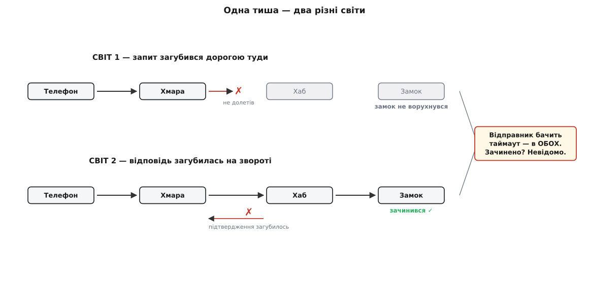
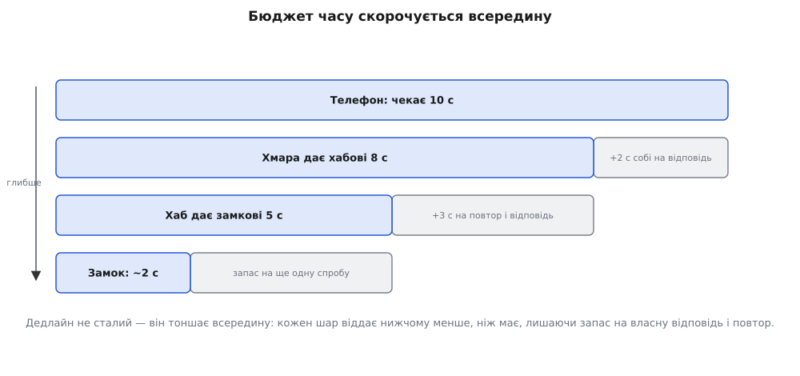

# Хаб на поганому Wi-Fi

<preknowlist>
- [Життєвий цикл пристрою](root:progarch/dh-device-fsm) — пристрій живе автоматом `new → online → offline → retired`; у `offline` хаб переводить пристрій, коли пропустив кілька його «пульсів». Тобто `offline` — це вже **здогад** хаба, а не твердий факт; ця думка нам знадобиться наприкінці.
</preknowlist>

Одного вечора засновнику приходить повідомлення від однієї з перших родин-клієнтів: «У застосунку написано, що замок не зачинився. Але я стою біля дверей — вони зачинені. То зачинено чи ні?» Він відкриває логи хаба й розуміє, що чесної відповіді в нього немає. Хаб надіслав команду «зачинити», не дочекався підтвердження за відведений час — і написав у застосунок «не вдалося». А замок тим часом спокійно зачинився. Обидва праві. І обидва не знають правди одне про одного.

Досі такого статися не могло. Весь наш код — від першого скрипта до [хаба з базою й кешем](root:progarch/dh-first-cache) — жив в одному процесі або принаймні на одній машині. Там виклик `lock()` мав дві чесні долі: або повернув «зачинено», або кинув виняток — і тоді **точно нічого не сталося**. Помилка була правдивою: кинуло — отже, дії не було. А тепер між тим, хто просить, і тим, хто виконує, ліг **шматок домашнього Wi-Fi**, і разом із ним прийшла хвороба, якої в одному процесі не буває. Це — [часткова відмова](root:progarch/partial-failure): операція наполовину відбулася, а той, хто її замовив, не може дізнатися, з якого вона боку. Цей крок — про те, як хаб на поганому Wi-Fi живе з цією хворобою, не вдаючи, що її немає.

## Тиша, у якої два різні значення

Розкладімо шлях команди. Хтось у застосунку тисне «зачинити». Телефон каже хмарі, хмара — хабові, що стоїть у домі на кволому роутері, хаб уже своїм місцевим радіо — замкові. Найслабша ланка сьогодні — саме та, що між хмарою й хабом: домашній Wi-Fi, який просідає, коли ввімкнули мікрохвильовку. І ось хаб не почув відповіді. Що це означає?

А означати це може три зовсім різні речі. Запит **не долетів** до хаба — розчинився дорогою всередину, і замок навіть не ворухнувся. Або запит долетів, замок **зачинився**, а от «готово» на зворотному шляху загубилося — дію зроблено, підтвердження ні. Або пакет просто **повільний** і ще в дорозі. І тут головне, від чого болить голова: **з крісла відправника всі три випадки виглядають однаково** — тиша, а потім таймаут (англ. *time out* — «вичерпаний час»). Він не бачить, у якому з трьох світів опинився.


*Втрачений запит і втрачене підтвердження — два різні світи з однаковим виглядом ізсередини відправника. Таймаут не каже, у котрому ти; він каже лише «відповіді нема».*

Ось перший висновок, який доведеться прийняти цілком: **таймаут — це не відповідь. Це відсутність відповіді.** Він не означає «не зробилося»; він означає «я не знаю». Уся решта кроку — про те, що робити з цим «не знаю», бо просто чекати далі не вийде, а вгадувати — небезпечно. Те, що локальний виклик і віддалений — це дві різні тварини, лиш прикидані однаковим синтаксисом, ми вже [назвали серед оман розподілених систем](topic:sf-distributed/distributed-fallacies); тепер ми тримаємо цю оману в руках на прикладі одного замка.

## Таймаут — це стеля чекання, а не вирок

Спитаймо просто: чому взагалі не чекати, доки прийде відповідь? Бо по той бік чекання — жива людина, що дивиться на «крутилку» в застосунку; бо з'єднання й потік, які висять у чеканні, — це ресурс, і якщо їх не відпускати, вони закінчаться; бо на поганому Wi-Fi «доки прийде» іноді означає «ніколи». Тож чекати доводиться зі **стелею**: не прийшло за стільки-то — припиняємо чекати. Ця стеля і є таймаут.

Але одну стелю поставити мало, бо чекань у нас **вкладені** одне в одне. Телефон чекає на хмару, хмара — на хаб, хаб — на замок. Якщо хмара віддасть увесь свій час хабові, їй самій не лишиться ані секунди, щоб відповісти телефону до того, як той здасться. Тому час — це [бюджет, який нарізають, спускаючись усередину](topic:sf-distributed/timeouts-deadlines): телефон дає 10 секунд, хмара лишає собі трохи на відповідь і дає хабові 8, хаб дає замкові 5 — і кожен шар притримує запас на власну відповідь і на можливий повтор.


*Дедлайн не сталий на всіх рівнях — він скорочується всередину. Кожен шар віддає нижчому менше, ніж має сам, лишаючи запас на власну відповідь і на повтор.*

> 🔧 **Навіщо це.** Перше питання до будь-якого мережевого виклику в хабі: скільки часу він може висіти? Якщо відповіді нема — значить, десь є виклик без стелі, а це рано чи пізно потік, що висить вічно, і ресурс, який не повернувся. Друге питання одразу за ним: цей таймаут узгоджений із тим, хто чекає на **мене**? Бо таймаут, довший за бюджет того, хто мене викликав, — це брехня: я ще чекаю, а йому вже байдуже, він давно здався.

## Повтор — чесна відповідь на «не знаю», але з пасткою

Гаразд, ми дочекалися стелі й отримали «не знаю». Найприродніше, що спадає на думку, — **спробувати ще раз**. Це і є повтор (ретрай), і часто він доречний: Wi-Fi просів на секунду й вернувся, друга спроба пролітає. Але саме тут захована пастка, і вона рівно та, з якої ми почали.

Пригадаймо другий світ із першої картинки: замок **уже зачинився**, а загубилося тільки підтвердження. Що зробить повтор? Надішле команду **знову** — до замка, який уже її виконав. Для «зачинити» це нестрашно: зачинити зачинене — це те саме зачинене, кінцевий стан не змінився. А тепер уявімо інші команди дому: «перемкни світло на ґанку», «додай яскравості на 10%», «відчини на 30 секунд для гостя». Повтори «перемкни» двічі — і світло вернулося туди, звідки почало. Повтори «+10%» двічі — отримав +20%. Оце і є вододіл:

```
lock()              — ідемпотентна: зачинити зачинене = те саме
setBrightness(30)   — ідемпотентна: виставити 30% = те саме
toggle()            — НЕ ідемпотентна: двічі = повернулись назад
bumpBrightness(+10) — НЕ ідемпотентна: двічі = +20, тричі = +30
```

Команда **ідемпотентна** (лат. *idem* — «той самий» + *potens* — «здатний»), коли повторити її вдруге — те саме, що виконати один раз: вона задає **кінцевий стан**, а не зсув від поточного. Наївний повтор безпечний лише для таких. Для решти кожен зайвий повтор — окрема справжня дія, і на поганому Wi-Fi, де повторів буде багато, це не рідкісний збіг, а щоденний баг.

І є ще одна пастка, більша за один дім. Уяви, що роутери в цілому районі моргнули разом і десять тисяч хабів одночасно втратили зв'язок. Якщо кожен, скривджений, кинеться повторювати **тієї ж миті**, як мережа ожила, вони вдарять по хмарі синхронним залпом — і покладуть її знову, вже не Wi-Fi, а власним натиском. Тому [повтори роблять із відступом](topic:sf-distributed/retries-backoff): чекати перед кожною наступною спробою дедалі довше — 0.5, 1, 2, 4 секунди (це **відступ**, англ. *backoff*), — і додавати до кожної паузи випадковий **розкид** (англ. *jitter* — «тремтіння»), щоб хаби не били в унісон, а розмазалися в часі.

**Приклад: спроби в межах бюджету на поганому Wi-Fi.**
```
бюджет усього                = 10.0 с
спроба 1  о 0.0 с            → тиша, стеля спроби 3.0 с вичерпалась
відступ = 0.5 с + розкид     ≈ 0.7 с
спроба 2  о 3.7 с            → знову тиша, стеля 3.0 с
відступ = 1.0 с + розкид     ≈ 1.3 с
спроба 3  о 8.0 с            → лишилось 2.0 с < 3.0 → остання спроба зі стелею 2.0 с
о 10.0 с                     → бюджет вичерпано; віддаємо «не знаю» вгору, чесно
```
Три спроби вмістилися в бюджет, кожна мала свою стелю, паузи між ними росли й були трохи різні в різних хабів. Але помітьте, що лишилося невирішеним: якщо перша спроба таки виконалась, а ми про це не дізналися, то другою і третьою ми **повторили дію**. Відступ урятував хмару від залпу — але не врятував замок від того, щоб команду виконали двічі. Це лагодить не повтор.

> 🔧 **Навіщо це.** Перш ніж додати автоматичний повтор кудись у хабі, спитай про команду одне: повторити її двічі — це те саме, що раз, чи ні? Якщо «те саме» — повторюй сміливо. Якщо ні — повтор без захисту нижче зробить із рідкісного мережевого збою регулярну подвійну дію, і найгірше, що це буде не видно в логах як помилка: обидві дії «успішні».

## Ідемпотентність — те, що робить повтор безпечним

Вихід не в тому, щоб повторювати лише «безпечні» команди — надто вузько, бо відчинити для гостя треба надійно так само, як зачинити. Вихід у тому, щоб зробити **будь-яку** команду безпечною для повтору. А для цього команді треба дати **особу**.

Ідея проста до незручності. Коли команду **створюють** — один раз, ще до першої спроби — до неї чіпляють унікальний **ключ ідемпотентності**. Не новий на кожну спробу, а **один на команду**, той самий крізь усі повтори. Хаб, отримавши команду, спершу дивиться, чи він цей ключ уже бачив. Не бачив — виконує й **запам'ятовує ключ разом із результатом**. Бачив — не виконує вдруге, а мовчки віддає той самий збережений результат. Тепер «відчинити для гостя», повторене п'ять разів через кепський Wi-Fi, — це **одне** відчинення й чотири впізнані дублікати.


*Той самий загублений ack, той самий повтор — різниця лише в ключі. Без ключа хаб не має як відрізнити дубль від нової команди й виконує двічі; з ключем повтор стає впізнаним, а виконання лишається одне.*

Ось цей впізнавач на боці хаба — усього кілька рядків, і в них уся суть:

:::tabs
```ts
// на боці хаба: ключ уже бачили → не виконуємо вдруге, віддаємо збережене
async function handle(cmd: Command, key: string): Promise<Result> {
  const seen = await store.get(key);
  if (seen !== undefined) return seen;      // дубль повтору — той самий результат
  const result = await execute(cmd);        // ЄДИНЕ справжнє виконання
  await store.put(key, result, { ttlHours: 24 });
  return result;
}
```
```py
# на боці хаба: ключ уже бачили → не виконуємо вдруге, віддаємо збережене
def handle(cmd: Command, key: str) -> Result:
    seen = store.get(key)
    if seen is not None:
        return seen                         # дубль повтору — той самий результат
    result = execute(cmd)                   # ЄДИНЕ справжнє виконання
    store.put(key, result, ttl=hours(24))
    return result
```
:::

А ось інший бік — клієнт у хмарі, що зводить докупи всі три речі одразу: ключ, бюджет-стелю й повтор із відступом. Зверніть увагу на дві деталі, у яких легко схибити: ключ народжується **над** циклом спроб, тож усі спроби несуть один і той самий; а дедлайн ми міряємо **монотонним** годинником, [який не стрибне назад від синхронізації часу](root:progarch/concurrency-and-clocks) посеред чекання.

:::tabs
```ts
async function sendCommand(cmd: Command): Promise<Result> {
  const key = uuid();                        // ОДИН ключ на команду — крізь усі спроби
  const deadline = now() + 10_000;           // весь бюджет — 10 с, монотонний годинник
  let backoff = 500;
  while (true) {
    const left = deadline - now();
    if (left <= 0) throw new Timeout("бюджет вичерпано");   // чесне «не знаю»
    try {
      return await post("/hub/command", cmd, key, Math.min(left, 3_000));
    } catch (e) {
      if (!isRetryable(e)) throw e;          // 4xx — не мережа, повторювати нема сенсу
      const pause = Math.min(backoff + Math.random() * backoff, left);
      await sleep(pause);                    // відступ + розкид
      backoff *= 2;                          // 0.5 → 1 → 2 → 4 с
    }
  }
}
```
```py
def send_command(cmd: Command) -> Result:
    key = uuid4().hex                         # ОДИН ключ на команду — крізь усі спроби
    deadline = monotonic() + 10.0             # весь бюджет — 10 с, монотонний годинник
    backoff = 0.5
    while True:
        left = deadline - monotonic()
        if left <= 0:
            raise Timeout("бюджет вичерпано")  # чесне «не знаю»
        try:
            return post("/hub/command", cmd, key, timeout=min(left, 3.0))
        except NetworkError as e:
            if not is_retryable(e):           # 4xx — не мережа, повторювати нема сенсу
                raise
            pause = min(backoff + random() * backoff, left)
            sleep(pause)                       # відступ + розкид
            backoff *= 2                        # 0.5 → 1 → 2 → 4 с
```
:::

Разом ці два боки роблять річ, яку варто назвати вголос. Повтор дає нам доставку [«щонайменше раз»](topic:sf-distributed/idempotency) — команда точно дійде, можливо, кілька разів. Ключ на боці хаба перетворює її на виконання **«фактично раз»**: скільки б разів команда не прилетіла, справжня дія одна. Повний робочий клієнт із сервером, сховищем ключів і тестом, що б'є одну команду десятьма повторами й доводить одне-єдине виконання, зібрано в [стійкому клієнті команд](root:progarch/dh-bad-network/proj-resilient-command.md); там же — тонкі місця: скільки тримати ключі, що робити з двома повторами, які прилетіли одночасно, і чому ключ мусить генерувати відправник, а не хаб.

> 🔧 **Навіщо це.** Ключ ідемпотентності — це найдешевша страховка в розподіленій системі, і ставити її треба до того, як припече. Одне поле в команді й один погляд у сховище на боці виконавця знімають цілий клас найгидкіших багів — тих, що трапляються лише коли зірки збіглися: погана мережа, загублений ack, автоматичний повтор. Такі баги майже неможливо відтворити на столі й боляче ловити в проді, бо в логах усе «успішно». Дешевше зробити повтор безпечним заздалегідь, ніж потім пояснювати родині, чому їхні двері відчинялися самі.

## Назад до автомата: «offline» — це теж лише здогад

Тепер повернімося до того, з чого починали в передумові, — і побачимо ту саму хворобу на поверх нижче. Хаб позначає пристрій `offline`, коли пропустив кілька його «пульсів». Але за логікою, яку ми щойно вивели, пропущений пульс **не відрізняє** «пристрій сів / зламався» від «пристрій цілий, а радіо загубило пульс». `offline` — це не факт, це **здогад** хаба, така сама тиша з двома значеннями, лише між хабом і замком, а не між хмарою й хабом.

Ось чому в тому автоматі стрілку `offline → retired` веде **тільки навмисна команда людини й ніколи таймер**: ми ще в тому кроці відмовилися дозволяти невизнаній тиші перетікати в незворотне рішення. Тепер видно, що то було не педантство, а той самий закон: **над мережею мовчання двозначне, і систему будують навколо цієї двозначності, а не вдаючи, ніби її нема.** А що двозначність не прибрати зовсім — що жоден обмін підтвердженнями через ненадійний канал не дає повної певності, — це стара й доведена річ, [класична задача двох генералів](root:progarch/dh-bad-network/hist-two-generals.md), до якої ми ще повернемося окремо. Повтор і ключ не **скасовують** невизначеність — вони роблять життя з нею безпечним.

## Що тепер у руках

Ми взяли три речі, що досі стояли поряд у цьому розділі як окремі прийоми — стеля часу, повтор, ідемпотентність, — і побачили, що це **один рефлекс**, а не три трюки. Таймаут перетворює нескінченне чекання на скінченну точку рішення й чесно каже «не знаю» замість того, щоб висіти. Повтор перетворює це «не знаю» на ще одну спробу — але безпечно лише тоді, коли ключ ідемпотентності дав команді особу, тож дубль **упізнають**, а не виконають наново. І відступ із розкидом стежить, щоб наші повтори не стали новою причиною відмови.

Жодна з цих речей не робить домашній Wi-Fi надійним. Вони роблять інше, важливіше: роблять хаб **чесним** щодо того, що Wi-Fi ненадійний. Хаб більше не вдає, ніби мережевий виклик — це звичайний виклик функції; він від початку припускає, що будь-яка команда може відбутися наполовину, і тримає напоготові рівно ці три відповіді. Далі ми дамо всьому хабові перейти межу машини по-справжньому — і ця чесність із трьох рухів стане не окремою латкою на один замок, а звичною поставою всього, що спілкується через мережу.
