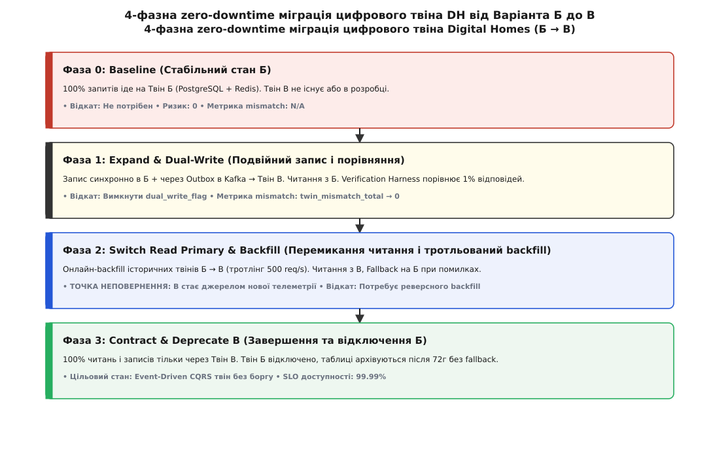
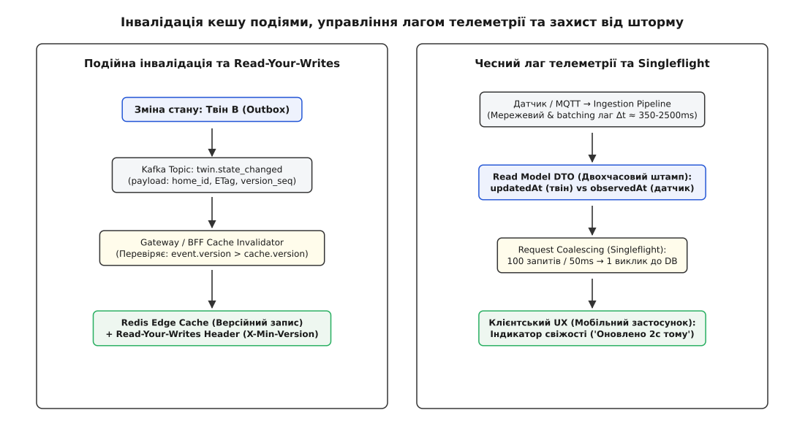

# DH: фінал тактик змін і кешування

<preknowlist>
- [Zero-downtime міграції даних](root:sf-release/zero-downtime-migration) — трифазний підхід expand-migrate-contract та подвійний запис.
- [Branch by abstraction](root:sf-apps/branch-by-abstraction) — ізоляція змін за абстрактним швом у коді.
- [Кеш-когерентність між сервісами](root:sf-distributed/cache-coherence-services) — події-інвалідатори проти TTL та версійні ключі.
- [Лаг read-model як контракт](root:sf-distributed/read-model-lag) — припущення CQRS і чесний показ застарілих даних у UX.
- [Thundering herd і захист кешу](root:sf-distributed/cache-stampede) — request coalescing, TTL jitter та soft TTL.
</preknowlist>

У продакшені Digital Homes v2 працює 1.2 мільйона активних домашніх хабів та понад 4.5 мільйона мобільних застосунків. Кожної секунди платформа обробляє 85 000 телеметричних подій — від датчиків температури й руху до розумних замків і систем виявлення протікання води. Стан кожного дому обслуговується монолітним сервісом цифрових твінів («Варіант Б»), який тримає поточний стан у централізованій базі даних PostgreSQL та в пам'яті спільного кластера Redis. Під вечірнім піковим навантаженням синхронні записи в PostgreSQL створюють високу затримку (latency P99 перевалює за 850 мілісекунд), а будь-яка спроба інвалідації кешу приводить до каскадного вичерпання пулу з'єднань.

Зупинити платформу на тригодинне «технічне вікно» (maintenance window) для міграції схеми даних неможливо: розумний дім керує фізичною безпекою. Зупинка сервісу твінів на 15 хвилин означає відхилені команди відчинення замків, збої терморегуляції та провалені цільові показники доступності (SLO 99.99%). Єдиний вихід — перевести стан усіх твінів на новий Event-Driven CQRS рушій («Варіант В») без жодної секунди простою, із збереженням когерентності кешу між десятками мікросервісів та чесним показом затримки телеметрії у користувацькому інтерфейсі.

Цей крок виступає практичним синтезом усього модуля. Ми об'єднуємо ізоляцію змін за допомогою паттерна Branch by Abstraction, чотирифазну міграцію схем Expand-Migrate-Contract, захисний подвійний запис (Dual-Write) із Parallel Run верифікацією, подійну інвалідацію кешу за версійними ключами (Versioned Keys) та захист від лавинного знецінення кешу (Cache Stampede).

---

## 1. Практичний виклик Digital Homes: чому зміни й кеш злипаються в один вузол

У традиційних навчальних прикладах тактики внесення змін у живі системи (zero-downtime migrations) та тактики керування кешем розглядають як дві ізольовані дисципліни. Архітектори баз даних проєктують подвійний запис і тротльований backfill, а розробники API Gateway налаштовують значення TTL (Time to Live) у Redis. На масштабі платформи Digital Homes ця ізоляція руйнується в перший же день релізу.

Коли ви міняєте внутрішній рушій зберігання цифрового твіна — переходячи від синхронного CRUD у PostgreSQL до асинхронного Event-Driven логу подій у Kafka з матеріалізованими представленнями (Read Models) — ви принципово змінюєте **характер часової узгодженості** всієї системи:

1. **Зміна способу запису руйнує кеш**: У Варіанті Б оновлення стану відбувалося синхронно за схемою Write-Through (запис у базу + негайне перезаписання в Redis). У Варіанті В запис виконується через Transactional Outbox у Kafka, а матеріалізована модель читання оновлюється асинхронно з затримкою в кілька сотень мілісекунд. Якщо Edge-кеш продовжуватиме опитувати базу за старими правилами, користувач побачить «фантомне повернення»: він відчинив замок у застосунку, але через 100 мс інтерфейс знову показує «зачинено», бо кеш вичитав застарілий Read Model.
2. **Процес міграції створює подвійні джерела правди**: Під час трифазного переходу одна частина запитів читає стан із старого твінера Б, а інша — з нового твінера В. Якщо події інвалідації кешу не синхронізовані за версійними послідовностями (Version Sequences), кеш може зберегти стан із Варіанта Б, який був актуальним 5 секунд тому, й перекрити ним свіжіші дані з Варіанта В.
3. **Навколишній мережевий лаг неможливо заховати**: Фізичні датчики передають дані через бездротові протоколи Zigbee або Matter на хаб, далі через MQTT у хмару, і лише потім у pipeline обробки. Загальна затримка delivery складає від 350 мс до 2.5 секунд. Намагання видавати застарілі дані кешу за «миттєву дійсність» без вказання часового штампу виміру призводить до помилкових бізнес-рішень автоматизацій.

Тут народжується головне правило синтезу: **міграція живої системи — це не лише рух байтів у базі даних, це синхронне переналаштування ланцюга когерентності кешу від бази до екрана смартфона**.

Для глибокого розуміння навантаження на систему під час підготовки міграції необхідно аналізувати системні показники ядра Linux та бази даних. З боку PostgreSQL метрики `pg_stat_activity` та `pg_stat_database` показують різке зростання кількості активних транзакцій та часу очікування замків (lock waits). З боку дискового I/O системний інтерфейс sysfs (`/sys/block/sda/stat`) реєструє сплеск черги читання/запису. Інструменти eBPF дозволяють простежити точку вичерпання ресурсів через трасування викликів ядра `sys_enter_write` та `block_rq_issue`.

> 🔧 **Навіщо це.** Спроба виконати міграцію даних без перебудови кеш-стратегії призводить до паніки в інцидентній команді. Коли база перенесена успішно, але 5% користувачів бачать у застосунку розбіжності через застряглий кеш, реліз оголошують аварійним і починають гарячковий відкат. Розуміння того, як прапорці міграції керують версіями кеш-ключів, перетворює ризикований реліз на контрольований конвеєр.

---

## 2. Шов абстракції та 4-фазний перехід з Варіанта Б у Варіант В

Для переведення 1.2 мільйона твінів з Варіанта Б у Варіант В ми застосовуємо паттерн **Branch by Abstraction** (галуження за допомогою абстракції). У кодовому шарі BFF та сервісів автоматизації створюється єдиний абстрактний шов — інтерфейс `DeviceTwinRepository`. Усі прямі виклики до старих таблиць PostgreSQL замикаються за цим швом.

Усередині шва монтується фазовий фасадер, який переключає режими роботи системи на основі динамічних прапорців (Feature Flags) та конфігурації фаз.

```
       [ Клієнтський REST / gRPC запит ]
                       │
                       ▼
       ┌───────────────────────────────┐
       │   DeviceTwinRepository (Шов)  │
       └───────────────┬───────────────┘
                       │
          ┌────────────┴────────────┐
          ▼                         ▼
┌──────────────────┐      ┌──────────────────┐
│  Твін Б (Legacy) │      │  Твін В (CQRS)   │
│ PostgreSQL+Redis │      │ Kafka+ReadModel  │
└──────────────────┘      └──────────────────┘
```

Міграція проводиться через чотири впорядковані фази, кожна з яких має чіткі метрики готовності, інструкцію з відкату (Rollback Plan) та оцінку зворотності (Reversibility).

### Фаза 0: Baseline (Стабільний стан Б)
* **Стан**: 100% читань і записів обслуговує Твін Б. Код Твіна В деплоїться в продакшен у заблокованому стані (Dark Launch).
* **Зворотність**: Абсолютна (Two-Way Door).
* **Метрика входу**: `twin_b_error_rate < 0.01%`.

### Фаза 1: Expand & Dual-Write (Подвійний запис і порівняння)
* **Стан**: Запити на зміну стану синхронно виконуються у Твіні Б. Одночасно через Transactional Outbox подія оновлення відправляється у Kafka-топік Твіна В, звідки матерілізується в нове сховище.
* **Паралельний прогін (Parallel Run)**: 1% читацьких запитів дублюється на обидва сховища за допомогою верифікаційного монітора (Verification Harness). Якщо відповідь Твіна В відрізняється від Твіна Б, інкрементується лічильник `twin_mismatch_total{field="..."}`.
* **Зворотність**: Повна. Для відкату достатньо переключити прапорець `dual_write_enabled = false`. Твін В можна очистити й перезапустити без впливу на користувачів.

### Фаза 2: Switch Read Primary & Backfill (Перемикання читання і тротльований backfill)
* **Стан**: Основне читання переводиться на Твін В. У разі провалу читання з В спрацьовує автоматичний запобіжник (Fallback) на Твін Б.
* **Онлайн-backfill**: Фонові воркери вичитують історичні стани твінів із Б, які ще не оновлювалися через live-трафік, і записують їх у В. Щоб не обвалити дискову підсистему PostgreSQL, backfill використовує динамічний тротлінг (Token Bucket Rate Limiter): швидкість обмежується 500 запитами на секунду і автоматично знижується при зростанні P99 латентності бази понад 50 мс.
* **ТОЧКА НЕПОВЕРНЕННЯ (Point of No Return)**: Мить, коли Твін В починає приймати перші первинні записи телеметрії, відсутні в Б. З цього моменту простий відкат прапорцем вимкне нові дані. Для відкату знадобиться процедура реверсного backfill (В → Б).

### Фаза 3: Contract & Deprecate B (Завершення та відключення Б)
* **Стан**: Твін В визнається єдиним джерелом правди (Single Source of Truth). Виклики до Твіна Б припиняються. Таблиці PostgreSQL переходять у режим read-only і після 72 годин спостереження архівуються.
* **Метрика переходу**: `twin_mismatch_total == 0` протягом 48 годин поспіль та `fallback_to_b_count == 0`.


*Анатомія zero-downtime міграції: від подвійного запису через тротльований backfill до остаточного звуження й відключення старого твінера.*

Повний комплект інженерних вимірів, інструкцій та конфігураційних параметрів для кожної фази винесено в [специфікацію контракту міграції та когерентності кешу DH](root:progarch/dh-change-cache-final/api-dh-migration-contract.md).

---

## 3. Кеш-когерентність між сервісами та подійний інвалідатор

Коли сервіс автоматизацій змінює стан дому (наприклад, переводить термостат у нічний режим), цей факт має негайно позначитися на Edge-кеші API Gateway, який обслуговує мобільні застосунки мешканців.

У Варіанті В для забезпечення когерентності (лат. *cohaerentia* — внутрішній зв'язок) застосовується **подійна інвалідація** (Event-Driven Invalidation). Сервіс Твіна В після успішної модифікації стану публікує в Kafka топік `dh.twin.events.v1` подію `twin.state_changed`.

```json
{
  "eventId": "evt-8f92a10b",
  "homeId": "home-4412",
  "deviceId": "term-09",
  "versionSeq": 1048,
  "etag": "W/\"v1048-b9a2\"",
  "observedAtMs": 1776500000120,
  "updatedAtMs": 1776500000350,
  "payload": { "targetTempC": 19.5, "mode": "night" }
}
```

### Гонка оновлень (Race Conditions) та версійні ключі
Головний ворог подійної інвалідації — порушення порядку доставки (Out-of-Order Delivery) та затримки мережі. Припустимо таку послідовність дій:

1. Користувач вмикає світло (Версія 101).
2. За 100 мс користувач вимикає світло (Версія 102).
3. Через мережевий jitter подія Версії 102 приходить у кеш-інвалідатор раніше за подію Версії 101.

Якщо інвалідатор просто видалятиме ключ із Redis, або записуватиме туди payload події без перевірок, застаріла Версія 101, що надійшла пізніше, перепише в кеші свіжішу Версію 102.

Для усунення цього збою застосовують **структуру версійних ключів (Versioned Keys)**. Кеш-інвалідатор приймає оновлення або видалення ключа лише в тому випадку, якщо `event.versionSeq >= cache.versionSeq`. Якщо в кеш приходить подія зі старішим номером послідовності, вона беззвучно відкидається.

```
Подія 102 (Вимикання) ────► Запис у кеш (v102) ───► OK
                                                       │
Подія 101 (Вмикання)  ────► Перевірка: 101 < 102  ───► ❌ Відкинуто (Stale Event)
```

### Гарантія Read-Your-Writes через Edge-кеш
Навіть при швидкій Kafka затримка публірації та зчитування події інвалідатором складає 15–50 мс. Якщо мобільний застосунок надсилає команду `POST /home/lock/open` і негайно робить `GET /home/state`, він ризикує прочитати з Edge-кешу застарілий стан замок «зачинено».

Щоб уникнути цього збою UX, застосовують тактику **Read-Your-Writes через заголовок версії**:

1. Відповідь на успішну мутацію `POST /home/lock/open` повертає клієнту новий номінальний номер версії в заголовку: `X-DH-Min-Version: 1049`.
2. Наступний запит на читання від цього ж клієнта включає цей заголовок: `GET /home/state` з `X-DH-Min-Version: 1049`.
3. Edge Gateway перевіряє версію в Redis. Якщо `cache.versionSeq < 1049`, Gateway розуміє, що подія інвалідації ще не встигла дійти через Kafka, і робить **bypass кешу** — спрямовує запит напряму до Read Model Твіна В.

Це дає сувору гарантію Read-Your-Writes для автора зміни, зберігаючи високу ефективність кешування для решти спостерігачів.

---

## 4. Чесний лаг телеметрії та захист кешу від шторму (Cache Stampede)

Два інші критичні моменти кеш-архітектури Digital Homes — це управління лагом читацької моделі (Read Model Lag) та стримування лавинних запитів при відновленні сервісу.

### 4.1. Лаг Read Model як чесний контракт з користувачем
У розподілених Event-Driven системах намагатися зробити лаг читання рівним нулю — марна й дорога ідея. Телеметрія від фізичного давача витоку води проходить довгий шлях:

```
[ Давач ] ──Zigbee──► [ Хаб ] ──MQTT──► [ Ingestion ] ──Kafka──► [ Read Model ]
                                                                       │
                                              Загальний лаг Δt ───────┘
```

Якщо мережа на хабі зазнає завад, затримка Δt зростає з нормальних 350 мс до 2500 мс. Спроба приховати цей факт і показувати в застосунку значення з кешу як «актуальний стан на цю секунду» є обманом користувача.

Замість цього платформа DH застосовує тактику **чесного лагу**:

* Кожен DTO відповіді містить два незалежні часові штампи: `updatedAt` (мить фіксації запису в базі твінера) та `observedAt` (мить, коли фізичний давач сформував вимір).
* Клієнтський UI обчислює різницю `telemetry_lag = now() - observedAt` і відображає її в інтерфейсі: якщо затримка менша за 5 секунд, показується зелений індикатор «Онлайн»; якщо затримка перевищує 30 секунд — жовтий індикатор «Оновлено 32 сек тому».

Це узгоджує очікування користувача з реальністю розподіленої системи і знімає потребу в ризикованому синхронному опитуванні давачів у реальному часі.

### 4.2. Захист від Cache Stampede: Singleflight, Soft TTL та Jitter
Коли 100 000 користувачів одночасно відкривають мобільний застосунок під час масового відключення електроенергії або в момент випуску нової версії API Gateway, виникає ефект **Thundering Herd** (гомінкого стада) або **Cache Stampede** (лавинного знецінення кешу).

Якщо гарячий ключ `home-4412:state` вигасає в Redis, сотні одночасних запитів пробивають кеш і падають на базу даних Твіна В, викликаючи вичерпання пулу потоків.

Для захисту системи застосовується трирівнева тактика:

1. **Request Coalescing (Singleflight)**: Якщо 50 паралельних потоків обробки на API Gateway виявляють відсутність ключа `home-4412:state` у кеші, лише **перший потік** робить реальний запит до бази даних. Решта 49 потоків блокуються на умовній змінній (Condition Variable) або `std::shared_future` й чекають на результат першого виклику. Після повернення даних з бази перший потік заповнює кеш і розблоковує решту 49 чекаючих запитів.
2. **Soft TTL (М'який строк життя)**: Ключ у Redis має два значення часу: `soft_ttl` (5 секунд) та `hard_ttl` (30 секунд). Якщо запит читає ключ у проміжку між `soft_ttl` та `hard_ttl`, кеш негайно повертає застаріле значення (Stale Data), але у фоновому режимі запускає один асинхронний потік для поновлення запису з бази (Refresh-Ahead / Stale-While-Revalidate).
3. **TTL Jitter (Розмиття часу вигасання)**: Для запобігання ситуації, коли мільйон ключів, записаних під час старту системи, вигаснуть в одну й ту саму секунду, до базового TTL додається випадкове значення (Jitter) в межах ±15%: `TTL_final = TTL_base + random(-750ms, +750ms)`.


*Потоки інвалідації та телеметрії: від транзакційного outbox до request coalescing і чесного показу свіжості у клієнтському UX.*

---

## 5. Деталізований простежувальний сценарій виконання (End-to-End Sequence)

Розглянемо повний наскрізний процес обробки запиту користувача під час перебування системи у Фазі 2 міграції (Switch Read Primary & Backfill) при виникненні мережевого розриву Kafka.

```
Клієнт             BFF Gateway          Redis Cache          Твін В (CQRS)         Kafka Broker         Legacy Твін Б
  │                     │                    │                     │                    │                    │
  ├─ POST /unlock ─────►│                    │                     │                    │                    │
  │                     ├─ Write ────────────┼────────────────────►│                    │                    │
  │                     │                    │                     ├─ Outbox Write ────►│ [Мережевий злам]   │
  │                     │                    │                     │  (Локальна БД)     │ ❌ Недоступно       │
  │◄─ 200 OK (v1049) ───┤                    │                     │                    │                    │
  │                     │                    │                     │                    │                    │
  ├─ GET /state ───────►│                    │                     │                    │                    │
  │ (X-Min-Ver: 1049)   ├─ Check Cache ─────►│                     │                    │                    │
  │                     │◄─ v1048 (Stale) ───┤                     │                    │                    │
  │                     │                    │                     │                    │                    │
  │                     ├─ Bypass Cache ──────────────────────────►│                    │                    │
  │                     │◄─ Return State (v1049) ──────────────────┤                    │                    │
  │◄─ 200 OK (State) ───┤                    │                     │                    │                    │
  │                     ├─ Update Cache ────►│ (v1049)             │                    │                    │
```

Цей наскрізний потік демонструє, як механізм `X-DH-Min-Version` та bypass кешу зберігають коректність бізнес-логіки навіть тоді, коли асинхронний подійний транспорт інвалідації тимчасово паралізовано мережевим зламом. Користувач миттєво бачить актуальний стан дверей свого будинку, незважаючи на збої в інфраструктурі зв'язку.

---

## 6. Код синтезу: фазовий фасадер та захищений інвалідатор

Нижче наведено фрагмент коду, який демонструє роботу фазового фасадера міграції твінів та одночасно застосовує паттерн Singleflight для відсікання Cache Stampede.

:::tabs
```cpp
// C++20: Фаза-орієнтований фасадер твінів та Singleflight кеш
#include <iostream>
#include <memory>
#include <string>
#include <string_view>
#include <unordered_map>
#include <mutex>
#include <future>
#include <expected>
#include <atomic>

struct DeviceTwinDTO {
    std::string home_id;
    std::string state_json;
    uint64_t version_seq{0};
    uint64_t observed_at_ms{0};
    uint64_t updated_at_ms{0};
};

enum class MigrationPhase {
    Phase0_Baseline,
    Phase1_DualWrite,
    Phase2_ReadPrimaryV_Backfill,
    Phase3_Contract
};

enum class StorageError { NotFound, Timeout, DbError };

// Абстрактний шов твіна (Branch by Abstraction)
class ITwinStorage {
public:
    virtual ~ITwinStorage() = default;
    virtual std::expected<DeviceTwinDTO, StorageError> read_twin(std::string_view home_id) = 0;
    virtual std::expected<void, StorageError> write_twin(const DeviceTwinDTO& dto) = 0;
};

// Захищений кеш із Singleflight (Request Coalescing)
class CoalescedCache {
private:
    struct CacheValue {
        DeviceTwinDTO dto;
        uint64_t expires_at_ms;
    };
    std::unordered_map<std::string, CacheValue> store_;
    std::unordered_map<std::string, std::shared_future<std::expected<DeviceTwinDTO, StorageError>>> in_flight_;
    std::mutex lock_;

public:
    std::expected<DeviceTwinDTO, StorageError> fetch_coalesced(
        std::string_view home_id,
        uint64_t now_ms,
        auto db_fetcher) 
    {
        std::unique_lock<std::mutex> guard(lock_);
        std::string key(home_id);

        // 1. Читання з кешу
        if (auto it = store_.find(key); it != store_.end()) {
            if (it->second.expires_at_ms > now_ms) {
                return it->second.dto;
            }
        }

        // 2. Якщо запит уже летить — чекаємо на спільне майбутнє
        if (auto it = in_flight_.find(key); it != in_flight_.end()) {
            auto shared_fut = it->second;
            guard.unlock();
            return shared_fut.get();
        }

        // 3. Перший потік створює запит
        std::promise<std::expected<DeviceTwinDTO, StorageError>> promise;
        auto shared_fut = promise.get_future().share();
        in_flight_[key] = shared_fut;
        guard.unlock();

        auto db_res = db_fetcher(home_id);

        guard.lock();
        if (db_res.has_value()) {
            uint64_t jitter = rand() % 500;
            store_[key] = CacheValue{ db_res.value(), now_ms + 4000 + jitter };
        }
        in_flight_.erase(key);
        promise.set_value(db_res);
        return db_res;
    }

    void invalidate_versioned(std::string_view home_id, uint64_t version) {
        std::lock_guard<std::mutex> guard(lock_);
        std::string key(home_id);
        if (auto it = store_.find(key); it != store_.end()) {
            if (version >= it->second.dto.version_seq) {
                store_.erase(it);
            }
        }
    }
};

// Фасадер міграції твінів
class MigrationTwinFacade {
private:
    std::shared_ptr<ITwinStorage> legacy_b_;
    std::shared_ptr<ITwinStorage> cqrs_v_;
    CoalescedCache cache_;
    std::atomic<MigrationPhase> current_phase_{MigrationPhase::Phase0_Baseline};

public:
    MigrationTwinFacade(std::shared_ptr<ITwinStorage> b, std::shared_ptr<ITwinStorage> v)
        : legacy_b_(std::move(b)), cqrs_v_(std::move(v)) {}

    void set_phase(MigrationPhase phase) noexcept {
        current_phase_.store(phase, std::memory_order_release);
    }

    std::expected<DeviceTwinDTO, StorageError> get_twin(std::string_view home_id, uint64_t now_ms) {
        auto phase = current_phase_.load(std::memory_order_acquire);

        auto fetch_db = [&](std::string_view hid) -> std::expected<DeviceTwinDTO, StorageError> {
            if (phase == MigrationPhase::Phase0_Baseline || phase == MigrationPhase::Phase1_DualWrite) {
                return legacy_b_->read_twin(hid);
            }
            // Phase 2 & 3: Читаємо з CQRS V, з fallback на Legacy B у Phase 2
            auto res_v = cqrs_v_->read_twin(hid);
            if (res_v.has_value() || phase == MigrationPhase::Phase3_Contract) {
                return res_v;
            }
            return legacy_b_->read_twin(hid); // Fallback
        };

        return cache_.fetch_coalesced(home_id, now_ms, fetch_db);
    }
};
```
```c
/* C11: Singleflight Mutex Map for Embedded Gateway */
#include <stdio.h>
#include <stdlib.h>
#include <string.h>
#include <stdint.h>
#include <stdbool.h>
#include <pthread.h>

typedef struct {
    char home_id[64];
    uint64_t version_seq;
    uint64_t expires_at_ms;
} dh_c_cache_item_t;

typedef struct {
    dh_c_cache_item_t items[1024];
    size_t count;
    pthread_mutex_t lock;
} dh_c_cache_t;

void dh_c_cache_init(dh_c_cache_t* cache) {
    cache->count = 0;
    pthread_mutex_init(&cache->lock, NULL);
}

void dh_c_cache_invalidate(dh_c_cache_t* cache, const char* home_id, uint64_t version) {
    pthread_mutex_lock(&cache->lock);
    for (size_t i = 0; i < cache->count; ++i) {
        if (strcmp(cache->items[i].home_id, home_id) == 0) {
            if (version >= cache->items[i].version_seq) {
                cache->items[i] = cache->items[cache->count - 1];
                cache->count--;
            }
            break;
        }
    }
    pthread_mutex_unlock(&cache->lock);
}
```
```ts
// TypeScript: BFF Singleflight Cache & Versioned Invalidator
export interface DeviceTwinDTO {
  homeId: string;
  stateJson: string;
  versionSeq: number;
  observedAtMs: number;
  updatedAtMs: number;
}

export class SingleflightBffCache {
  private cache = new Map<string, { dto: DeviceTwinDTO; expiresAtMs: number }>();
  private inFlight = new Map<string, Promise<DeviceTwinDTO>>();

  async getOrFetch(
    homeId: string,
    nowMs: number,
    dbFetcher: (id: string) => Promise<DeviceTwinDTO>
  ): Promise<DeviceTwinDTO> {
    const hit = this.cache.get(homeId);
    if (hit && hit.expiresAtMs > nowMs) {
      return hit.dto;
    }

    if (this.inFlight.has(homeId)) {
      return this.inFlight.get(homeId)!;
    }

    const task = dbFetcher(homeId)
      .then((dto) => {
        const jitter = Math.floor(Math.random() * 500);
        this.cache.set(homeId, { dto, expiresAtMs: nowMs + 4000 + jitter });
        return dto;
      })
      .finally(() => {
        this.inFlight.delete(homeId);
      });

    this.inFlight.set(homeId, task);
    return task;
  }

  invalidateVersioned(homeId: string, versionSeq: number): void {
    const current = this.cache.get(homeId);
    if (current && versionSeq >= current.dto.versionSeq) {
      this.cache.delete(homeId);
    }
  }
}
```
:::

Детальний приклад повного рушія мігратора з тротльованим backfill-воркером винесено у [практичну реалізацію рушія міграції твіна та інвалідації кешу DH](root:progarch/dh-change-cache-final/proj-dh-twin-migration.md).

---

## 7. ADR (Architecture Decision Record) фаз і точок неповернення

Рішення про перехід твінера та перебудову кешу фіксується у наскрізному журналі ADR платформи Digital Homes.

```markdown
# ADR-0026: Zero-Downtime міграція цифрового твіна DH та подійне кешування

## Контекст
Монолітний твін «Варіант Б» (PostgreSQL + Redis Write-Through) досяг межі масштабування під вечірнім піковим навантаженням (P99 > 850 мс). Зупинка системи неможлива через критичні сервіси замків та пожежної безпеки. Потрібен перехід на Event-Driven CQRS твін «Варіант В».

## Decision (Рішення)
1. Запровадити шов Branch by Abstraction через `DeviceTwinRepository`.
2. Виконати 4-фазну міграцію: Baseline → Expand (Dual-Write 1% parallel run) → Switch Read Primary (тротльований backfill 500 req/s) → Contract.
3. Забезпечити когерентність кешу через події Kafka `twin.state_changed` із версійними ключами `versionSeq`.
4. Для захисту від Cache Stampede впровадити Singleflight coalescing та Soft TTL із Jitter (±15%).
5. Визнати Точкою Неповернення (Point of No Return) початок Фази 2 після первинного запису телеметрії у сховище В.

## Наслідки
* **Позитивні**: Нульовий downtime під час міграції; зниження P99 латентності читання до 12 мс; абсолютний захист бази даних від Thundering Herd.
* **Негативні**: Код змушений підтримувати подвійну логіку на період Фаз 1–2; вимога додаткових дискових ресурсів під Kafka outbox та backfill.
```

---

## 8. Комплексний Failure Mode & Effects Analysis (FMEA)

При проведенні настільки наскрізної архітектурної зміни необхідно наперед розрахувати поведінку системи при виникненні нештатних ситуацій та мережевих розривів.

### 8.1. Матриця аналізу відмов і мітигацій

1. **Падіння брокера Kafka під час Фази 1 (Dual-Write)**:
   * *Симптом*: Транзакційний Outbox на сервісі Твіна В накопичує записи в базі даних, події не доходять до Kafka.
   * *Реакція*: Первинний запис у Твін Б продовжує працювати без перешкод. Outbox демон чекає відновлення Kafka. Edge-кеш продовжує працювати за старого схемою. Жоден користувацький запит не блокується.
2. **Мережевий розділ (Network Partition) між Redis та API Gateway**:
   * *Симптом*: Усі запити читання з Edge-кешу повертають помилку з'єднання.
   * *Реакція*: API Gateway негайно активує локальний внутрішньопроцесний Singleflight-кеш. Запити зливаються по 100 штук і передаються безпосередньо до Твіна В. База даних зазнає підвищеного навантаження, але залишається в межах допустимого SLO завдяки coalescing.
3. **Раптове зростання затримки PostgreSQL під час Фази 2 (Backfill)**:
   * *Симптом*: P99 латентність PostgreSQL зростає з 15 мс до 120 мс.
   * *Реакція*: Адаптивний тротлер воркера backfill виявляє зростання затримки та знижує ліміт з 500 до 50 запитів на секунду. Навантаження на базу знижується, затримка повертається у норму.

---

## 9. Підсумок модуля: єдиний арсенал змін і кешування під тиском

Модуль 26 підводить риску під тим, як архітектор рухає живу систему, не зупиняючи трафік і не брешучи користувачу про стан даних.

Усі розглянуті інструменти утворюють єдину систему стримувань і противаг:

* **Branch by Abstraction** дає ізольований шов, за яким міняється реалізація без довгих feature-гілок.
* **Expand-Migrate-Contract** гарантує, що схеми даних ростуть адитивно й не ламають старих читачів.
* **Parallel Run та Dual-Write** дають підтвердження коректності нового рушія на реальному продовому трафіку до перемикання primary-читання.
* **Подійна інвалідація з версійними ключами** захищає кеш від race conditions і мережевих затримок.
* **Request Coalescing, Soft TTL та TTL Jitter** рятують базу даних від вичерпання ресурсів під час спалахів навантаження.
* **Чесний показ лагу Read Model** створює прозорий користувацький досвід без хибних обіцянок миттєвості.

Жодна з цих тактик не працює в ізоляції. Коли вони зібрані в єдиний контур під урядництвом фазового ADR, розгортання великих змін перестає бути нічним стресом і перетворюється на передбачувану інженерну рутину.
