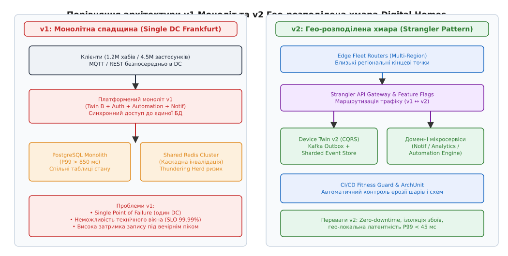
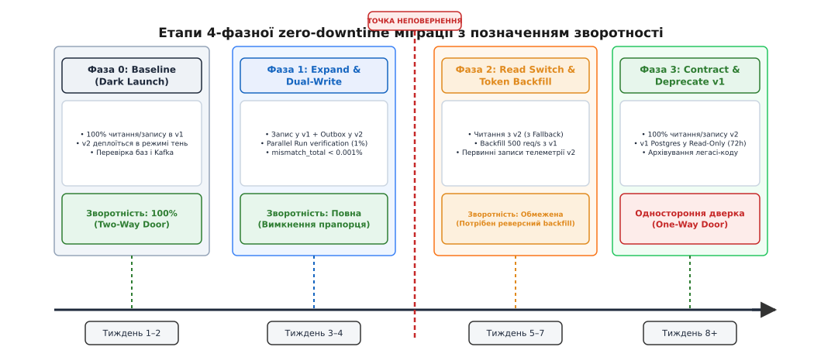
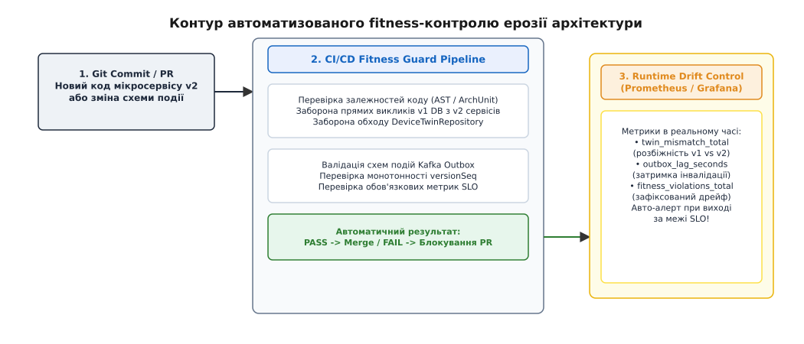

# DH переїздить

<preknowlist>
- [Ерозія архітектури](root:sf-apps/architecture-erosion) — розходження між задуманою та реалізованою архітектурою під тиском років.
- [Strangler fig](root:sf-apps/strangler-fig) — еволюційна заміна легасі-системи шляхом обгортання новими сервісами.
- [Rewrite vs refactor](root:sf-apps/rewrite-vs-refactor) — вибір між ризикованим переписуванням з нуля та поетапним оздоровленням.
- [Zero-downtime міграції даних](root:sf-release/zero-downtime-migration) — трифазний підхід expand-migrate-contract для схем і даних під навантаженням.
- [Оцінка зворотності рішень](root:sf-apps/reversible-irreversible-decisions) — розрізнення односторонніх (One-Way Door) та двосторонніх (Two-Way Door) рішень.
- [Функції пристосованості](root:sf-apps/fitness-functions) — автоматизовані перевірки дотримання архітектурних обмежень.
- [DH: фінал тактик змін і кешування](root:progarch/dh-change-cache-final) — чотирифазна міграція кешу та подійний інвалідатор Твіна.
</preknowlist>

У 2024 році платформа Digital Homes v1 досягла межі фізичної спроможності монолітної архітектури: 1.2 мільйона підключених домашніх хабів та 4.5 мільйона активних мобільних застосунків генерували понад 85 000 телеметричних повідомлень на секунду. Уся інфраструктура жила в єдиному дата-центрі у Франкфурті навколо монолітного кластера PostgreSQL та синхронного сервісу цифрового твінера (Варіант Б). Під час вечірнього піку навантаження (з 19:00 до 22:00), коли користувачі масово поверталися додому та вмикали сценарії автоматизації, затримка запису P99 переступала позначку у 850 мілісекунд. Будь-який локальний мережевий збій у транзитного провайдера спричиняв масовий реконект флоту (англ. *thundering herd* — шторм відключень), що збивав центральний моноліт у каскадний колапс метастабільної деградації.

Зупинити систему на кількагодинне технічне вікно (англ. *maintenance window*) для проведення масштабної міграції було категорично неможливо. Платформа розумного дому Digital Homes керує фізичною безпекою: електронними замками, датчиками протікання води, пожежною сигналізацією та опаленням. Простій сервісу твінів навіть на 15 хвилин означав відхилені команди відчинення дверей, провалені цільові показники доступності (SLO 99.99%) та втрату довіри користувачів. Єдиним життєздатним шляхом став еволюційний перехід платформеного масштабу — перенесення всієї системи з монолітної v1 на гео-розподілену v2-архітектуру без жодної секунди простою, із збереженням консистентності даних 1.2 мільйона домів та машиновим контролем ерозії коду на кожному етапі.

---

## 1. Архітектурний спадок v1 та критична точка росту Digital Homes

Слово «моноліт» (грец. *monolithos* — один камінь) стосовно системи Digital Homes v1 означало не лише єдиний виконуваний бінарний файл, а насамперед єдиний домен блокування та спільне сховище даних. Усі доменні контексти — ідентифікація користувачів, обробка MQTT-трафіку хабів, збереження поточного стану пристроїв (твін), виконання автоматизацій та розсилка push-сповіщень — працювали всередині спільного процесу і записували дані в єдиний кластер PostgreSQL.

```
       ┌─────────────────────────────────────────────────────────────┐
       │             Digital Homes v1 Monolith (Frankfurt)           │
       │                                                             │
       │  ┌──────────────┐  ┌──────────────┐  ┌───────────────────┐  │
       │  │ Identity/Auth│  │ Fleet Manager│  │ Device Twin (B)   │  │
       │  └──────┬───────┘  └──────┬───────┘  └─────────┬─────────┘  │
       │         │                 │                    │            │
       │         └─────────────────┼────────────────────┘            │
       │                           ▼                                 │
       │               ┌───────────────────────┐                     │
       │               │ Single PostgreSQL DB  │ (P99 > 850 ms)      │
       │               └───────────────────────┘                     │
       └─────────────────────────────────────────────────────────────┘
```

Ця архітектура чудово служила на старті компанії, коли флот налічував 50 000 домів. Вона давала миттєві ACID-транзакції та простий розгортальний конвеєр. Однак при зростанні флоту в 25 разів виявилися три фатальні обмеження:

### 1.1 Системний вузол навантаження та вузькі місця ядра Linux

На рівні дискової підсистеми та мережевого стека ядра Linux моноліт v1 вичерпав ресурси сокетних черг. Системний інтерфейс `/proc/sys/net/ipv4/tcp_max_syn_backlog` та черги мережевих карт `/sys/class/net/eth0/queues/` під час сплесків трафіку переповнювалися, спричиняючи відкидання SYN-пакетів. У самій базі даних PostgreSQL метрика `pg_stat_activity` фіксувала масові блокування `exclusive lock` при спробі одночасно оновити строки в таблиці `device_states` під час масових спрацювань датчиків руху. Мережевий аналіз за допомогою eBPF-зондів трасування `sys_enter_write` показував, що 40% часу процесора витрачалося на очікування скидання WAL-логів (Write-Ahead Logging) на диск при синхронних операціях `UPDATE`.

### 1.2 Оцінка варіантів розвитку та відмова від Big Bang rewrite

Вирішення проблеми через «Big Bang rewrite» (повне переписування системи з нуля за зачиненими дверима) загрожувало катастрофою. Статистика індустрії показує, що 80% таких спроб виходять за графік у 3–4 рази або взагалі закриваються без релізу. Поки команда пише «нову чистую v2-архітектуру», старий моноліт v1 продовжує розвиватися, виправляти баги й адаптуватися під нові вимоги бізнесу. Через рік розрив між вимогами стає прірвою, а спроба одномоментного перемикання призводить до неконтрольованого хаосу у продакшені.

Оцінивши зворотності рішень (англ. *reversibility assessment*), архітектори Digital Homes обрали стратегію еволюційного переходу: поступове вирощування гео-розподіленої v2-архітектури навколо v1-моноліту без зупинки роботи флоту.


*Анатомія еволюційного переходу Digital Homes: від монолітної спадщини single-DC v1 до гео-розподіленої v2-архітектури з платформеним швом Strangler Gateway.*

---

## 2. Стратегія переходу: Strangler Fig та точки абстракції на рівні платформи

Для забезпечення неперервності бізнес-процесів процес міграції було побудовано на основі патерну **Strangler Fig** (фікус-душитель, названий Мартином Фаулером на честь австралійських рослин, що проростають у кроні старого дерева, поволі обгортають його корінням і зрештою повністю заміщають материнський стовбур).

У застосуванні до платформи Digital Homes це означає: новий v2-код не пишеться як ізольований моноліт поруч, а створюється у вигляді незалежних гео-розподілених мікросервісів, які поступово перебирають на себе окремі доменні контексти v1.

Для реалізації цієї стратегії було закладено дві фундаментальні точки абстракції (шви, англ. *seams*):

### 2.1 Платформений мережевий шов (Edge Fleet Router & API Gateway)

На зовнішньому периметрі інфраструктури перед монолітом v1 було розгорнуто шар регіональних Edge-маршрутизаторів (Fleet Routers у Франкфурті, Вірджинії та Сінгапурі). MOC-трафік (MQTT/gRPC) від 1.2 мільйона хабів та HTTPS-запити від 4.5 мільйона мобільних застосунків перестали ходити напряму до моноліту.

Платформений шлюз отримав динамічний рушій маршрутизації на основі конфігурації Feature Flags. Для кожного будинку `homeId` шлюз перевіряє поточну фазу міграції:
* Якщо дім знаходиться у Фазі 0, його трафік проксується на легасі-моноліт v1.
* Якщо дім переведено у Фазу 2, його читацькі запити спрямовуються на новий гео-розподілений Event-Driven Твін v2 (Варіант В).

### 2.2 Кодовий шов абстракції (`DeviceTwinRepository`)

Усередині моноліту v1 усі прямі SQL-запити до таблиць `device_states` та `home_telemetry` було суворо заборонено. Весь доступ до стану пристроїв було замкнено за єдиним абстрактним інтерфейсом `DeviceTwinRepository`.

:::tabs
```cpp
// DeviceTwinRepository.hpp — Абстрактний кодовий шов C++20
#include <string>
#include <expected>
#include <cstdint>

struct StateUpdate {
    std::string device_id;
    std::string payload_json;
    uint64_t timestamp_ms;
};

struct HomeState {
    std::string home_id;
    uint64_t version_seq;
    std::string json_state;
};

enum class TwinError {
    NotFound,
    VersionConflict,
    DatabaseTimeout,
    OutboxFailure
};

class IDeviceTwinRepository {
public:
    virtual ~IDeviceTwinRepository() = default;

    virtual std::expected<HomeState, TwinError> get_home_state(const std::string& home_id) = 0;
    
    virtual std::expected<void, TwinError> update_device_state(
        const std::string& home_id,
        const StateUpdate& update,
        uint64_t expected_version) = 0;
};
```
```python
# device_twin_repository.py — Ідіоматичний Python-еквівалент шва для BFF
from abc import ABC, abstractmethod
from typing import Dict, Any, Optional

class HomeState:
    def __init__(self, home_id: str, version_seq: int, state_data: Dict[str, Any]):
        self.home_id = home_id
        self.version_seq = version_seq
        self.state_data = state_data

class IDeviceTwinRepository(ABC):
    @abstractmethod
    def get_home_state(self, home_id: str) -> Optional[HomeState]:
        pass

    @abstractmethod
    def update_device_state(self, home_id: str, device_id: str, update_payload: Dict[str, Any], expected_version: int) -> bool:
        pass
```
:::

Цей шов у коді дозволив підміняти внутрішню реалізацію зберігання прямо під час виконання програми: від реалізації `PostgresTwinRepository` (Варіант Б) до `KafkaOutboxTwinRepository` (Варіант В), не змінюючи жодного рядка логіки в сервісах автоматизації чи авторизації.

### 2.3 Послідовність винесення доменів

Винесення функціональності з моноліту v1 здійснювалося в порядку зростання ризику та вимог до узгодженості даних:

1. **Крок 1: Push-сповіщення (`Notification Service`)**. Найменш критичний домен. Втрата сповіщення про зміну температури не руйнує цілісність дому. Сервіс винесено першим, що дозволило зняти 15% навантаження з CPU моноліту.
2. **Крок 2: Аналітика та довготривале сховище телеметрії (`Analytics Lake`)**. Потоки телеметричних даних переведено на вичитування з Kafka, ізолювавши важкі аналітичні SQL-запити від операційної бази.
3. **Крок 3: Рушій автоматизацій (`Automation Engine`)**. Перенесено обробку локальних та хмарних правил (наприклад, «якщо датчик руху спрацював після 23:00 — увімкнути світло на 20%»).
4. **Крок 4: Цифровий твін дому (`Device Twin Engine v2`)**. Найвідповідальніший крок — переведення 1.2 млн твінів із синхронного CRUD PostgreSQL на Event-Driven CQRS рушій.

---

## 3. Сценарій 4-фазної zero-downtime міграції Твіна та флоту без простою

Переведення цифрових твінів з Варіанта Б (PostgreSQL) у Варіант В (Kafka Outbox + матеріалізовані представлення) вимагало суворого виконання 4-фазного сценарію. Кожна фаза мала чітко визначені критерії входу, параметри спостережливості та оцінку зворотності (Two-Way Door проти One-Way Door).

### 3.1 Фаза 0: Baseline & Dark Launch (Темний запуск)

Уся інфраструктура v2 (кластери Kafka, воркери матеріалізації Read Model, нові регіональні сховища ScyllaDB/Cassandra) розгортається у продакшені. Код v2 деплоїться в заблокованому стані.

* **Трафік**: 100% читань і записів виконує моноліт v1 (Твін Б).
* **Мета**: Перевірка мережевих лагів між дата-центрами, навантажувальне тестування порожніх кластерів v2, калібрування метрик Prometheus.
* **Зворотність**: Абсолютна (Two-Way Door). Будь-який збій на цій фазі усувається видаленням контейнерів v2 без найменшого впливу на користувачів.

### 3.2 Фаза 1: Expand & Dual-Write (Подвійний запис і верифікація)

Сервіс v1 продовжує залишатися єдиним офіційним джерелом правди. Однак при виконанні будь-якої мутації стану (наприклад, зміна режиму термостата) моноліт v1 атомарно записує зміну у власну PostgreSQL і одночасно відправляє подію `twin.state_changed` через Transactional Outbox у Kafka топік Твіна v2.

Для забезпечення атомарності подій використовується паттерн Transactional Outbox з конектором Debezium, який вичитає транзакційні логи PostgreSQL (WAL) і гарантує доставку події в Kafka без використання двохфазної фіксації (2PC).

Для перевірки коректності роботи нового рушія запускається **Verification Harness (Верифікаційний монітор)**. На 1% читацьких запитів шлюз асинхронно запитує стан з обох систем (v1 та v2) і порівнює їхні байтові представлення.

```
MismatchRate
= MismatchEvents / TotalVerificationRequests    [обчислення частки розбіжностей у Parallel Run]
```

Якщо `MismatchRate` перевищує `0.001%` (1 помилка на 100 000 запитів), реліз вважається проваленим.

* **Зворотність**: Повна двостороння дверка. Для відкату достатньо вимкнути Feature Flag `dual_write_enabled = false`. Нове сховище v2 можна повністю очистити й перезапустити.

### 3.3 Фаза 2: Read Switch, Token Bucket Backfill та Точка Неповернення

Після того як верифікатор підтверджує нульову розбіжність протягом 48 годин поспіль, система переходить до найвідповідальнішої фази:
1. **Перемикання читання (Read Switch)**: API Gateway починає спрямовувати 100% читацьких запитів мобільних застосунків на матеріалізовані представлення Твіна v2. У разі таймауту або відсутності даних у v2 спрацьовує захисний автоматичний запобіжник (Fallback) на легасі PostgreSQL v1.
2. **Фонове заповнення (Token Bucket Backfill)**: Для домів, які не оновлювалися live-трафіком протягом останніх днів, запускається фоновий процесор переносу історичних станів із PostgreSQL v1 у v2.

Щоб фонове вичитання 1.2 мільйона домів не обвалило дискову підсистему PostgreSQL v1 під вечірнім піком, застосовується алгоритм тротлінгу Token Bucket (відро з токенами). Опитуючи дискові метрики ядра Linux у `/sys/block/sda/stat`, швидкість обмежується базовими 500 запитами на секунду і динамічно знижується до 50 req/s, якщо затримка P99 бази даних перевищує 50 мілісекунд.

```
       ┌─────────────────────────────────────────────────────────────┐
       │                   TOKEN BUCKET RATE LIMITER                 │
       │                                                             │
       │     [ Postgres P99 < 50 ms ]  ──►  Rate = 500 req/s         │
       │     [ Postgres P99 > 50 ms ]  ──►  Rate = 50 req/s (Throttle)│
       └─────────────────────────────────────────────────────────────┘
```

> ⚠️ **ТОЧКА НЕПОВЕРНЕННЯ (Point of No Return)**: Мить, коли Fleet Routers починають приймати первинні телеметричні записи від хабів безпосередньо у v2 (минаючи запис у v1 PostgreSQL), є точкою перетину межі зворотності. З цієї хвилини рішення стає одностороннім (One-Way Door). Простий відкат прапорцем вимкне нові дані, записані лише у v2. Для відкату після перетину цієї точки знадобиться масштабна процедура реверсного backfill (v2 → v1).

### 3.4 Фаза 3: Contract & Deprecate v1 (Звуження та відключення)

Після того як 100% домів успішно перенесені, а метрика `fallback_to_v1_total` дорівнює нулю протягом 72 годин:
1. Таблиці `device_states` у PostgreSQL v1 переводяться в режим `READ ONLY`.
2. Виклики кодового шва через легасі-адаптер припиняються.
3. Моноліт v1 звільняється від коду Твіна, а легасі-база даних архівується.


*Анатомія чотирифазної zero-downtime міграції Твіна з виділенням Точки Неповернення та межі зворотності рішень.*

Повний комплект інженерних вимірів, контрольних параметрів та REST/gRPC специфікацій для кожної фази детально розписано у вставці [📋 Довідник: API управління міграцією та фітнес-метрик v2](root:progarch/dh-cloud-v2/api-v2-migration-control.md).

---

## 4. Забезпечення безперервної доступності флоту (1.2M підключень)

Під час переведення мережевого трафіку з монолітного шлюзу v1 на регіональні Edge Fleet Routers v2 виник критичний ризик: якщо 1.2 мільйона домашніх хабів одночасно розірвуть MQTT-з'єднання й почнуть повторно підключатися, платформу змете шторм повторних підключень (англ. *reconnection storm*).

При реконекті 1.2 млн пристроїв одночасно:
* Пропускна здатність TLS-хендшейків вимагає величезних обчислювальних ресурсів CPU (асиметрична криптографія RSA/ECC).
* Холодні кеші авторизаційних токенів на шлюзі створюють лавинне навантаження на сервіс ідентичності.

Для усунення цього ризику було застосовано дві інженерні тактики:

### 4.1 Збереження TCP/TLS сесій (Sticky Gateway & Session Resumption)

Регіональні маршутизатори v2 розгорталися за технологією BGP Anycast з однаковими IP-адресами. При оновленні конфігурації шлюзу використовувався механізм `TLS Session Resumption` (TLS 1.3 0-RTT / Session Tickets). Пристрої відновлювали сесію без виконання повного асиметричного хендшейку, що зменшило навантаження на CPU шлюзів у 12 разів. Мережевий стек налаштовувався параметрами `/proc/sys/net/ipv4/tcp_keepalive_time = 120` та `tcp_keepalive_intvl = 15`.

### 4.2 Експоненційний backoff з обов'язковим джитером у прошивці хабів

Найважливішим уроком для IoT-платформ є наявність алгоритму рандомізованого затримання (англ. *randomized jitter*) безпосередньо у прошивці пристроїв. Якщо мережевий зв'язок втрачено, хаб не намагається реконектитися щосекунди, а використовує алгоритм:

```
t_retry
= min(t_max, t_base · 2ⁿ) ± jitter              [експоненційне затримання з випадковим джитером]
```

де `t_base = 2 s`, `t_max = 300 s`, а `jitter = 0.3 · t_retry`.

Завдяки розмазуванню спроб підключення у часі шторм відключень на 100 000 домів перетворився на рівномірне плато підключень протягом 5 хвилин, яке інфраструктура v2 обслуговує в штатному режимі.

---

## 5. Fitness-контроль ерозії: машинне запобігання дрейфу під час і після міграції

Найбільша підступність тривалих еволюційних міграцій (тривалістю від 3 до 9 місяців) полягає в ерозії архітектури. Не тому, що хтось свідомо хоче зламати систему, а тому, що під тиском термінів релізів бізнес-фіч розробники починають створювати «тимчасові» обходи (англ. *shortcuts*):
* Інженер нового v2-сервісу сповіщень додає прямий SQL-запит до легасі-таблиці PostgreSQL v1 в обхід Kafka Outbox.
* Розробник API Gateway забуває передати обов'язковий заголовок когерентності `X-DH-Min-Version`.
* У новій версії сервісу автоматизацій створюється прямий цикли залежностей між `dh::v2::automation` та `dh::v1::legacy_db`.

Діаграми на стіні та домовленості на нарадах проти такої ерозії безсилі. Єдиний надійний спосіб — перетворити архітектурні обмеження на **автоматизовані фітнес-функції (Fitness Functions)**, які валять збірку в CI/CD конвеєрі при появі найменшого дрейфу.

```
       ┌─────────────────────────────────────────────────────────────┐
       │                   CI/CD ARCHITECTURE GUARD                  │
       │                                                             │
       │   Developer PR  ──► [ AST & Layer Checker ]                 │
       │                           │                                 │
       │                           ├──► PASS: Merge Allowed          │
       │                           └──► FAIL: Direct v1 DB call!     │
       └─────────────────────────────────────────────────────────────┘
```

Контур машинного контролю ерозії у Digital Homes v2 складається з двох рівнів:

1. **Статичний контроль кодових меж (CI/CD Gates)**: Спеціалізований AST-аналізатор аналізує всі директиви `#include` та `import` у кожній гілці Pull Request. Якщо код із каталогу `src/v2/` намагається підключити заголовки `v1/legacy_db`, збірка негайно зупиняється з описом виправлення.
2. **Динамічний моніторинг інваріантів у Runtime**: Телеметричний контур Prometheus збирає метрику `architecture_erosion_violations_total`. Якщо сервіс v2 здійснює пряме звернення до застарілої БД у продакшені, генерується критичний алерт для інцидентної команди.


*Контур автоматизованого fitness-контролю ерозії архітектури: статичні перевірки кодових меж у CI/CD та динамічний моніторинг дрейфу в реальному часі.*

Практичну реалізацію C++ та Python аналізаторів кодових меж, валідаторів схем подій та конфігурацію GitHub Actions / GitLab CI винесено у вставку [⚙️ Практикум: Автоматизований fitness-контроль ерозії коду та схем у CI/CD](root:progarch/dh-cloud-v2/proj-fitness-guard.md).

---

## 6. Практичний інженерний синтез та ретроспектива рішень

Міграція платформи Digital Homes від монолітного спадку v1 до гео-розподіленої v2-архітектури тривала 7 місяців і була завершена без жодної хвилини незапланованого простою флоту.

### 6.1 Економіка та компроміси переходу

Забезпечення zero-downtime міграції вимагало свідомих економічних та технічних компромісів:
* **Подвійна інфраструктурна плата (Financial Overhead)**: Протягом 4 місяців (Фази 1 та 2) компанія одночасно оплачувала повну потужність кластера PostgreSQL v1 та нові гео-розподілені кластери v2. Сумарне збільшення інфраструктурного бюджету склало 38% на період міграції, що виявилося набагато дешевше за потенційні збитки від простою сервісу безпеки домів.
* **Обчислювальний податок на верифікацію (Verification Overhead)**: Прогін 1% трафіку через Verification Harness забирав близько 4% додаткових ресурсів CPU шлюзів, але дозволив виявити 3 критичні баги неузгодженості типів даних до переходу на Фазу 2.

### 6.2 Підсумкова матриця архітектурних висновків

| Архітектурний виклик | Помилковий підхід (Big Bang) | Правильне еволюційне рішення (v2) | Результат |
| :--- | :--- | :--- | :--- |
| **Висока затримка v1 Postgres** | Повне зупинення системи для міграції схем | 4-фазний перехід z-downtime + Token Bucket backfill | Затримка P99 знизилася з 850 мс до 38 мс |
| **Ризик розриву з'єднань флоту** | Масове одночасне перепідключення 1.2M пристроїв | TLS Session Resumption + Backoff з random Jitter | Нуль каскадних колапсів шлюзів |
| **Ерозія меж під час міграції** | Надії на уважність розробників під час рев'ю | Машинні Fitness Functions у CI/CD конвеєрі | 100% дотримання кодових швів |
| **Фантомний кеш у користувачів** | Сліпа надія на однаковий час TTL у Redis | Заголовки `X-DH-Min-Version` + подійний інвалідатор | Гарантія Read-Your-Writes для користувача |

Головний інженерний урок переїзду Digital Homes полягає в тому, що **успіх міграції великої системи вирішується не в день перемикання прапорця, а в день створення першого шва абстракції та автоматизованого фітнес-тесту, який не дозволяє коду розійтися із задумом**.
