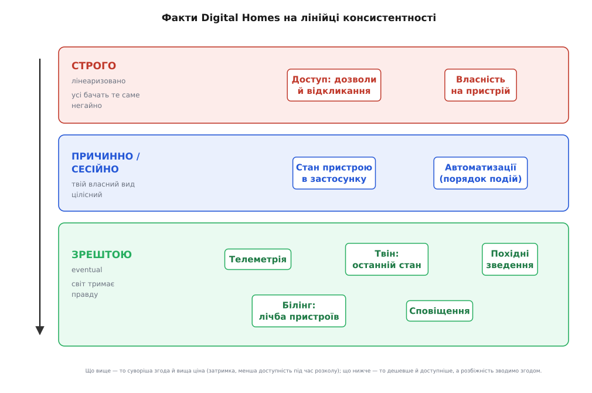
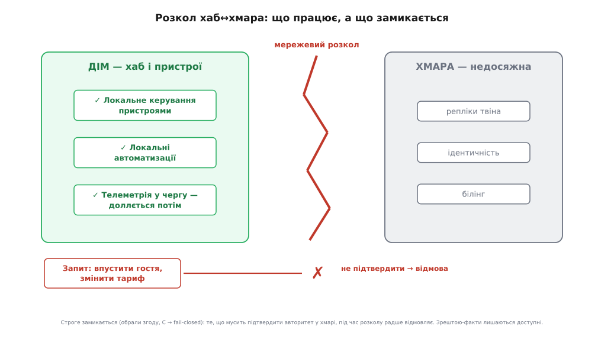
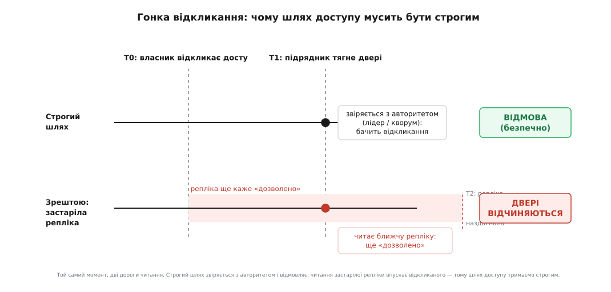

# Що в DH строго, а що «зрештою»

<preknowlist>
- [Спектр консистентності](book:programming/consistency-models) — лінійка від лінеаризовності (усі бачать те саме негайно) через причинну до кінцевої узгодженості; саме на цю лінійку ми розкладаємо факти дому.
- [CAP і PACELC](book:programming/cap-theorem) — під час розколу мережі система обирає між згодою (C) і доступністю (A); без розколу — між затримкою (L) і згодою (C).
- [Кінцева узгодженість](book:programming/eventual-consistency) — копії, лишені на самоті, розходяться, але, отримавши час, сходяться до спільного значення; читання дорогою буває застарілим.
- [Модель даних DH](root:progarch/dh-data-model) — бажаний стан проти справжнього; агрегат як одиниця, всередині якої все узгоджене в одну мить.
</preknowlist>

Минулим кроком ми поставили [твін дому на репліки](root:progarch/dh-replicas) — кілька копій дзеркала, ближче до користувача й здатних пережити падіння однієї машини. І тим самим впустили в дім річ, якої доти не було: **дві копії, що можуть не збігатися**. Поки твін жив в одному примірнику, питання «котра копія права» не існувало — правда була одна. Тепер репліка в одному регіоні на секунду відстає від репліки в іншому; а коли між ними обірветься мережа, кожна лишиться зі своєю правдою й доганяти не буде взагалі.

`fsync`, яким ми в [гарантіях сховища](root:progarch/dh-storage-guarantees) довели байти до диска, на це нове питання не відповідає. Він знав лише «чи збережено», а тепер над ним постає інше: збережено **де саме** — і чи згодні копії між собою в цю мить. Консистентність (лат. *consistere* — стояти твердо, триматися купи) — це і є про згоду копій: наскільки міцно й наскільки негайно всі, хто дивиться, бачать те саме. І, як і тривкість, вона не «є чи нема», а важіль із ціною.

## Один важіль на всю систему — знову програш

Спокуса та сама, що й зі сховищем, тільки під новим приводом: вивернути **все** на строгу згоду. Хай кожне читання, хоч би з якої репліки, бачить найсвіжіший запис, зроблений будь-де. Начебто найбезпечніше — що зайвого в тому, щоб усі завжди бачили правду? Зайве — ціна, і платять її двічі.

По-перше, **затримкою на кожній дії**. Строге читання не може відповісти з найближчої копії — воно мусить сходити до авторитетного джерела або зібрати [кворум](book:programming/quorum-and-leaderless) копій, щоб пересвідчитися, що не проґавило свіжішого запису. Це вже не наносекунди пам'яті, а походи по мережі туди-назад, на кожен чит.

По-друге, і головне — **доступністю в мить розколу**. [Теорема CAP](book:programming/cap-theorem) (Ерік Брюер висловив її здогадом 2000 року, Гілберт і Лінч довели 2002-го — усталений результат) каже прямо: коли мережа розпалася надвоє, система не втримає водночас і згоду, і доступність — доводиться обрати. Наполягати на строгій згоді означає обрати згоду: **відмовляти**, поки копії не домовляться. А для дому відмова — це двері, що перестали відчинятися, бо хмара недосяжна. Дорого золотити те, що не потребує позолоти, ми вже [навчилися не робити](root:progarch/dh-not-building) — і строга згода всюди є рівно таким золоченням, лише в найдорожчому місці: у затримці й у праві дому працювати.

Протилежний рефлекс — лишити **все** зрештою-узгодженим і не думати — програє тихіше, але так само певно. Бо серед фактів дому є такі, де прочитати застаріле значення — не дрібна незручність, а відчинені двері перед тим, кому ти щойно закрив доступ. На такому факті «доллється потім» — це діра в безпеці, а не оптимізація.

Отже, як і з важелями ACID, правильна відповідь — не одна позиція на всю систему, а **питання до кожного факту окремо**. І питання те саме, що врятувало нас у сховищі, лише повернуте іншим боком. Там ми питали: *скільки коштує цей факт **утратити**?* Тут: *скільки коштує прочитати цей факт **застарілим**?* Дешево, бо світ надішле свіже за секунду, — бери зрештою-узгодженість і забирай доступність та швидкість. Дорого до злому чи небезпеки — плати за строгу згоду, і плати радо, бо таких фактів мало.

## Три клани фактів дому

Пройдімо тим самим інвентарем дому, що вже служив нам не раз, — але тепер сортуючи кожен факт за одним: **що станеться, якщо його прочитати трохи несвіжим?** Виходить не два, а три клани, бо між «строго» й «зрештою» лежить корисна середина.

**Строго — це «ворота».** Сюди падає те, де застаріле «так» є порушенням. Найгостріший приклад — **дозволи й відкликання доступу**: хто має право відчинити цей замок. Власник виписав підрядника й забрав доступ; якщо репліка на дверях ще секунду вважає його дозволеним — він заходить. Тут читати треба строго, з авторитетного джерела, а в мить розколу — радше **відмовити**, ніж ризикнути. Сюди ж — **заявка власності на пристрій**: «цей давач мій». Дві родини, що під час розколу обидві застовпили один сенсор, — це не дрібниця, а чужі очі у твоєму домі. Це той самий [останній квиток](root:progarch/last-ticket-race), лише розтягнутий тепер між репліками: двоє читають старе «вільний» і обидва пишуть «моє».

**Причинно, або сесійно — це «твоя історія мусить складатися».** Тут не треба, щоб увесь світ бачив однакове в ту саму мить, — треба, щоб **твій власний вид** був цілісним. Замкнув замок із телефона — застосунок мусить показати «замкнено» негайно, а не застаріле «відчинено» з відсталої репліки; це гарантія **читай-свій-запис**. А правило «двері відчинили після 23:00 — увімкнути світло» мусить бачити подію «відчинили» **раніше** за свою реакцію, у правильному причинному порядку. Це [сесійні гарантії](book:programming/replication-lag) — помітно дешевші за повну лінеаризовність, бо тримають узгодженість лише в межах одного погляду, а не глобально.

**Зрештою — це «світ тримає правду».** Сюди падає майже все інше, і це добре. **Телеметрія** — потік показів давача: прочитав температуру на секунду застарілою — наступний вимір прилетить і виправить, ніхто не постраждав. **Дзеркало твіна** — останній відомий стан пристроїв — уже за природою наближення до фізичного світу, що змінюється; свіжість тут бажана, а не свята. **Похідні зведення** (сковзні середні, «востаннє бачили о 14:03») перераховуються з телеметрії й правди не тримають зовсім. Сюди ж, попри першу оману, — **лічба пристроїв у білінгу** й **сповіщення**.


*Один дім, три різні зобов'язання про згоду. Що вище на лінійці — то суворіша згода й вища ціна (затримка, менша доступність під час розколу); що нижче — то дешевше й доступніше, а розбіжність копій зводимо згодом. Міцність купуємо на факт, а не на систему.*

> 🔧 **Навіщо це.** Ця сортувальна вправа — не академія, вона прямо визначає, скільки коштуватиме дім і чи витримає він поганий день мережі. Загнати телеметрію в строгу згоду — це заплатити кворумом за кожен показ температури й зробити дім повільним там, де він мав бути легким. Лишити відкликання доступу зрештою-узгодженим — це відчинені двері перед виписаним підрядником у вікні реплікаційного лагу. Обидві помилки коштують дорого й тихо; правильний клан для кожного факту — те, чого не видно, поки він правильний.

## Розкол, побачений з дому

Найкраще ця сортовка проявляється в найгіршу мить — коли між домом і хмарою обривається мережа. І тут DH показує свою суть чіткіше за будь-яку абстрактну систему, бо в нього є **хаб** — коробка в самому домі, що є місцевим джерелом правди про фізичні залізяки.

Що має статися з домом, коли хмара недосяжна? Відповідь очевидна, щойно її вимовити: **дім мусить далі працювати**. Світло за розкладом, обігрів за порогом, місцеві автоматизації «відчинили двері — увімкни лампу» — усе це хаб виконує сам, не питаючи хмару, бо стан фізичних пристроїв він тримає локально. Телеметрія тим часом не губиться — вона лягає в чергу на хабі й доллється в хмару, щойно лінія повернеться. Це і є вибір **доступності** (A з теореми): ми радше дозволимо копіям дому й хмари розійтися на час розколу, ніж дамо дому змертвіти через недосяжний дата-центр. Для зрештою-фактів це рівно те, чого ми хотіли.

А що **не** може статися офлайн? Строгі ворота. Впустити в дім **нового гостя**, видавши йому доступ; змінити **тарифний план**. Бо ці факти мусить підтвердити авторитет у хмарі, а його зараз не чути — і ми свідомо обрали радше **відмовити**, ніж ризикнути видати доступ, який на другій половині розколу виявиться конфліктним. Це вибір **згоди** (C), і його технічна назва — **fail-closed**: за сумніву замкнутися, а не відчинитися. Двері о третій ночі — не те місце, де хочеться «про всяк випадок дозволити».


*CAP не як гасло, а як точна поведінка дому, коли провайдер моргнув. Зрештою-факти лишаються доступні — дім живе локально (обрали A). Строгі ворота замикаються — те, що потребує авторитетної згоди, під час розколу відмовляє (обрали C, fail-closed). Той самий розкол, дві різні відповіді — бо факти різного клану.*

## Гонка, заради якої все це строго

Придивімося до найдорожчого рядка — відкликання доступу — впритул, бо саме він виправдовує всю ціну строгої згоди. Власник о 17:00 забирає доступ у підрядника. Той о 17:01, поки одна з реплік ще не почула про відкликання, тягне ручку дверей. Усе рішення тепер — у тому, **звідки двері читають право входу**.

Якщо читати **строго** — двері звіряються з авторитетним джерелом (лідером чи кворумом реплік), бачать свіже «відкликано» і **відмовляють**. А якщо не змогли строго підтвердити, бо саме розкол, — теж відмовляють, бо fail-closed. Безпечно в обох випадках. Якщо ж читати **зрештою**, з найближчої, ще не оновленої репліки — вона каже «дозволено», і двері **відчиняються** перед тим, кого щойно виписали. Той самий момент, той самий підрядник — а результат вирішує єдиний вибір міцності читання.


*Вікно між відкликанням і тим, як його побачить остання репліка, — це вікно вразливості. Строге читання його закриває ціною затримки й можливої відмови; зрештою-читання лишає відчиненим. Тому шлях доступу — і тільки він — вартий повної ціни строгої згоди.*

У коді ця різниця — не окрема система, а **аргумент міцності на кожен чит**, який диктує клан факту:

:::tabs
```ts
// Клас факту диктує міцність читання — не система і не «всюди строго».
type Consistency = "strong" | "eventual";

async function mayOpen(deviceId: string, userId: string): Promise<boolean> {
  // Право відчинити двері читаємо СТРОГО: авторитетне джерело (лідер/кворум).
  const grant = await store.read(`grant:${homeOf(deviceId)}:${userId}`, "strong");
  return grant?.active === true;   // не підтвердили строго (розкол) → «ні»: fail-closed
}

async function latestTemp(deviceId: string): Promise<number | null> {
  // Температуру читаємо ЗРЕШТОЮ: з найближчої репліки, хай трохи застарілу.
  const r = await store.read(`temp:${deviceId}`, "eventual");
  return r?.value ?? null;         // застаріле число нікому не шкодить
}
```
```py
# Клас факту диктує міцність читання — не система і не «всюди строго».

async def may_open(device_id: str, user_id: str) -> bool:
    # Право відчинити двері читаємо СТРОГО: авторитетне джерело (лідер/кворум).
    grant = await store.read(f"grant:{home_of(device_id)}:{user_id}", "strong")
    return bool(grant and grant.active)   # не підтвердили строго (розкол) → «ні»: fail-closed

async def latest_temp(device_id: str) -> float | None:
    # Температуру читаємо ЗРЕШТОЮ: з найближчої репліки, хай трохи застарілу.
    r = await store.read(f"temp:{device_id}", "eventual")
    return r.value if r else None         # застаріле число нікому не шкодить
```
:::

Одна функція ходить по строге право, друга бере дешеве наближення — і ця різниця вписана в **клас факту**, а не в глобальний перемикач. Повний робочий приклад — зі строгим шляхом на кворумі, зрештою-шляхом на локальній репліці й відтворенням гонки відкликання, що доводить: строгий шлях відмовляє, а зрештою-шлях впускає, — зібрано в [окремому розборі-проєкті](root:progarch/dh-consistency-choice/proj-dh-consistency-map.md).

## «Зрештою» — не недбалість, а чесна модель

Лишається зняти підозру, ніби зрештою-узгодженість — це поступка, на яку йдуть знехотя. Навпаки: для більшості дому вона **точніша** за строгу, бо чесніше описує світ.

Згадаймо режим «нікого немає» з [моделі дому](root:progarch/dh-data-model): дім тримає бажане «хочу всі замкнені», кожен замок — свій справжній стан, а між ними живе процес, що показує «дев'ять замкнено, гараж офлайн — замкнемо, щойно з'явиться». Тепер цьому процесу є точне ім'я: це **[анти-ентропія](book:programming/anti-entropy-repair)** (гр. *anti-* — проти + *entropía* — міра безладу) — тло, що невпинно звіряє копії й зводить розбіжність, повторюючи команду для офлайн-замка й пересинхронізуючись, коли той повернеться. Розрив між «хочу» і «є» — не баг, який строга транзакція мала б прибрати; фізичні двері за кілометри не замкнути атомарно, і модель, що це визнає, правдивіша за ту, що вдає миттєвість.

Навіть там, де інстинкт кричить «тут треба строго», варто перевірити ціну помилки. **Лічба пристроїв у білінгу**: дві репліки під час розколу обидві впустили новий пристрій, і на мить вийшло 51 замість дозволених 50. Спокуса — замкнути додавання пристрою в строгу розподілену транзакцію. Але чого це варте? Дім не сміє перестати додавати пристрої тільки тому, що моргнула мережа білінгу. Дешевше й чесніше — впустити, а розбіжність **звести згодом**: порахувати, і якщо справді перебір — попросити підняти план. Гроші тут не виняток із правила, а його підтвердження: платіжні системи роками звіряють постфактум, а не тримають глобальний замок.

Ця думка — що не все варте строгої згоди — має точне місце народження: [історія полиці Amazon Dynamo](root:progarch/dh-consistency-choice/hist-dynamo-shopping-cart.md), де кошик покупок навмисне зробили завжди доступним на запис, а конфлікти зводили при читанні — бо втрачений «додав у кошик» це втрачений продаж, тоді як тимчасова розбіжність поправна. Саме звідти пішло свідоме розкладання фактів по різній міцності, замість однієї згоди на все.

> 🔧 **Навіщо це.** Побачити, що зрештою-узгодженість — здебільшого правильна відповідь, а не аварійна, звільняє від найдорожчої архітектурної звички: тягнути строгу згоду туди, де вона не потрібна, і платити за це затримкою й крихкістю на кожному кроці. Зрілий дім строгий у кількох воротах і легкий та доступний у всьому іншому — і саме тому переживає поганий день мережі, лишаючись живим там, де міг би змертвіти.

## Що тепер у руках

Ми не додали дому жодної нової можливості. Ми зробили інше, тонше: **позначили кожен факт міцністю згоди, якої він заслуговує**. Доступ і власність — строго, з відмовою за сумніву. Твій власний вид на дім — причинно й сесійно, щоб історія складалася. Телеметрія, дзеркало, зведення, білінг, сповіщення — зрештою, бо світ тримає їхню правду й надішле свіже. І, головне, ми побачили, що це не три системи, а один дім з одним питанням до кожного факту: *скільки коштує прочитати тебе застарілим?*

Наступний крок бере цей самий поділ і зважує його **ціну загалом** — [консистентність як trade-off](root:progarch/consistency-cost-tradeoff): що саме віддаєш за кожен щабель угору лінійкою й де та ціна себе не виправдовує. А за ним — [вибір моделі реплікації](root:progarch/replication-choice), яка все це має **фізично забезпечити**: лідер-фоловер, мультилідер чи leaderless, і котра з них дає нам строгі ворота дешевше за інші. Спершу назвали, що чому винні; далі — чим за це платимо і як його побудувати.
