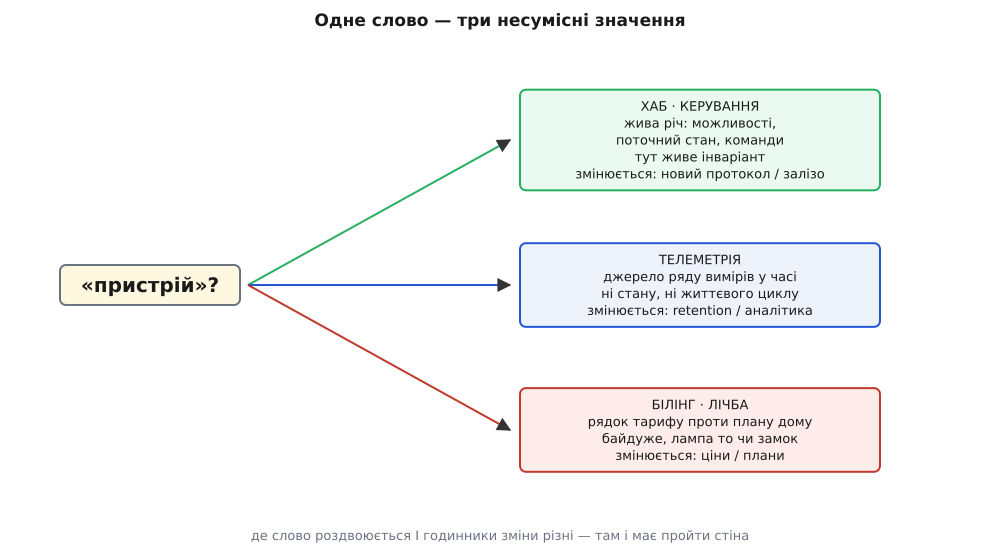

# Де провести межі контекстів DH

<preknowlist>
- [Обмежений контекст](topic:sf-apps/bounded-context) — межа, всередині якої слово має рівно одне значення й діє одна модель; кордон вимальовує мова, а не структура даних.
- [Агрегат і межа узгодженості](topic:sf-apps/aggregates-consistency) — межа інваріанта = межа однієї транзакції; усередині агрегату правила тримаються самі собою в пам'яті одного об'єкта.
- [Стратегічний розкрій](topic:sf-apps/subdomains-strategic) — сортування предмета на ядро / допоміжне / загальне за однією міркою: чи дає ця ділянка перевагу; каже, куди класти найтовщу межу.
- [Карта контекстів](topic:sf-apps/context-mapping) — відносини між межами: хто вгорі за течією, хто внизу, і словник видів зв'язку (конформіст, ACL, спільне ядро).
- [Журнал архітектурних рішень (ADR)](topic:sf-apps/architecture-decision-records) — короткий запис «чому саме так»: контекст, рішення, наслідки, відкинуті варіанти; переживає авторів.
</preknowlist>

Мапу ми вже накреслили. [Контексти Digital Homes](root:progarch/dh-contexts-map) — пристрій, хаб, твін, автоматизації, телеметрія, відео, ідентичність, білінг, сповіщення — розкладено на дошці, і між ними навіть проведено стрілки. Здавалося б, роботу зроблено. Але мапа, яка перелічує світи, ще не відповіла на найгостріше питання, і саме воно коштує найдорожче: **де рівно проходить кожна стіна — і чому тут, а не на долоню вбік?**

Бо мапу можна намалювати десятком способів, і всі виглядатимуть охайно. А з-поміж тих десяти лише один розкрій дешевий, щоб з ним жити роками; решта тихо збирають борг, який виб'є в проді через рік. Цей крок — про те, як з десятка правдоподібних розкроїв обрати той один і, головне, **записати вибір так, щоб він пережив нараду**. Це той самий [варіантний блок](root:progarch/variant-block-anatomy), що й завжди в курсі, тільки варіанти тут — не бібліотеки, а місця, куди покласти стіну.

## Одне слово, що почало брехати

Почнімо з детектора, який ми вже вивчили: **межу контексту вимальовує тертя мови**. Стіна має пройти там, де слово роздвоюється у значенні. Тож візьмімо в DH найзатертіше слово — «пристрій» — і спитаймо трьох людей із різних кутків системи, що воно означає.

Для **хаба**, що керує домом, пристрій — це жива річ: у нього є можливості (замок уміє замкнутися, лампа — засвітитися), поточний стан, яким ти командуєш, і кімната, де він стоїть. Тут-таки живуть [інваріанти](root:progarch/dh-data-model): замок не буває нічий, замок не буває ні відчинений, ні зачинений. Для **телеметрії** той самий «пристрій» — це вже не жива річ, а лише джерело ряду вимірів у часі: ідентифікатор, одиниця («°C»), скільки тижнів тримати історію. Ні стану, ні кімнати, ні життєвого циклу — телеметрії до них байдуже до нестями. А для **білінгу** пристрій — це третє поняття: рядок тарифу проти плану дому. Йому однаково, лампа то чи замок і чи відчинені двері; важливо єдине — чи рахувати цю річ у «до п'ятдесяти пристроїв на тарифі».

Троє вимовляють одне слово — і мають на увазі три різні речі, що лише випадково ділять назву. Це рівно ті самі омоніми, що й горезвісний «товар» каталогу проти складу з теми про [обмежений контекст](topic:sf-apps/bounded-context): одна вивіска, різні світи за нею. Спокуса — зробити один спільний клас `Device` на все — веде туди ж, куди й спільний `Product`: до роздутого мішка, де половина полів вічно порожня, а правило білінгу тихо суперечить правилу керування. Натомість дамо кожному контексту свій маленький, чесний `Device`:

:::tabs
```py
# КОНТЕКСТ КЕРУВАННЯ (ядро): пристрій — жива керована річ
@dataclass
class Device:                       # control.Device
    id: DeviceId
    kind: str                       # "lock" | "lamp" | "sensor"
    capabilities: frozenset[str]    # що саме вміє
    state: DeviceState              # поточний стан, яким командуємо
    room: RoomId
    # тут живуть інваріанти: замок не нічий, стан завжди визначений;
    # змінюється, коли з'являється нова радіо-можливість чи тип заліза

# КОНТЕКСТ ТЕЛЕМЕТРІЇ: пристрій — лише джерело ряду вимірів
@dataclass(frozen=True)
class Device:                       # telemetry.Device
    source_id: SourceId
    unit: str                       # "°C", "lux", ...
    retention_days: int
    # ні стану, ні життєвого циклу, ні кімнати — тут це зайве;
    # змінюється, коли міняють retention чи downsampling

# КОНТЕКСТ БІЛІНГУ (загальне): пристрій — рядок тарифу
@dataclass(frozen=True)
class Device:                       # billing.Device
    home_id: HomeId
    counts_against_plan: bool
    active_since: date
    # байдуже, лампа то чи замок — важливо лише рахувати чи ні;
    # змінюється, коли міняють ціни й плани
```
```ts
// КОНТЕКСТ КЕРУВАННЯ (ядро): пристрій — жива керована річ
namespace Control {
  export interface Device {
    readonly id: DeviceId;
    readonly kind: "lock" | "lamp" | "sensor";
    readonly capabilities: ReadonlySet<string>;   // що саме вміє
    state: DeviceState;                            // яким командуємо
    readonly room: RoomId;
    // тут живуть інваріанти; змінюється з новим протоколом чи залізом
  }
}

// КОНТЕКСТ ТЕЛЕМЕТРІЇ: пристрій — лише джерело ряду вимірів
namespace Telemetry {
  export interface Device {
    readonly sourceId: SourceId;
    readonly unit: string;              // "°C", "lux", ...
    readonly retentionDays: number;
    // ні стану, ні життєвого циклу; змінюється з retention/аналітикою
  }
}

// КОНТЕКСТ БІЛІНГУ (загальне): пристрій — рядок тарифу
namespace Billing {
  export interface Device {
    readonly homeId: HomeId;
    readonly countsAgainstPlan: boolean;
    readonly activeSince: string;       // ISO-дата
    // байдуже, лампа то чи замок; змінюється з цінами й планами
  }
}
```
:::

Придивись, що зникло в кожному: жодних чужих полів «про всяк випадок». `Telemetry.Device` не знає слова «замок»; `Billing.Device` не знає, відчинені двері чи ні. Кожна модель обіцяє рівно те, що правда в її світі, — і стіна між світами вже проступила там, де мова зламалася.

## Другий сигнал, що вказує на ту саму стіну

Тертя мови — сильний детектор, але сам по собі він суб'єктивний: комусь здасться, що «пристрій усюди один, ви просто чіпляєтесь до слів». Тому цінно, коли на ту саму межу незалежно показує **другий** сигнал. І він тут є — **різні годинники зміни**.

Спитай не «що це означає», а «від чого це міняється». Модель керування міняється, коли з'являється новий радіопротокол чи новий тип заліза — це годинник **інженерії пристроїв**, він цокає з кожним вендором. Телеметрія міняється, коли інша команда захотіла інший строк зберігання чи новий крок усереднення для графіків, — годинник **даних і аналітики**, зовсім окремий. А білінг міняється, коли маркетинг придумав новий тариф чи підняв ціну, — годинник **бізнесу**, який до заліза не має жодного стосунку. Три речі, що рухаються з різних причин і за різним розкладом.

Ось чому тримати їх в одній моделі — не просто негарно, а **небезпечно**: тоді зміна ціни тарифу редагує той самий клас, що відмикає твої вхідні двері. Не тому, що це логічно пов'язано, а тому, що колись їх зшили в один `Device`. Правка, яка мала торкнутися рядка в прайсі, тепер має ненульовий шанс зронити керування замком — і рев'юер цієї правки навіть не запідозрить, що дивиться на код безпеки дому.


*Те саме слово розходиться на три поняття, і кожне має свій годинник зміни. Коли обидва сигнали — роздвоєння значення й різний ритм змін — показують на один шов, це вже не прискіпування до слів, а справжня межа.*

> 🔧 **Навіщо це.** Два незалежні сигнали, що збіглися, — це те, що відрізняє межу від забаганки. Одного «мені здається, тут різні поняття» замало, щоб виправдати стіну (а стіна коштує). Але коли поряд лягає твердий факт «ці частини й міняються за різним розкладом з різних причин» — сумнівів нема: розділити їх дешевше, ніж возити кожну чужу зміну через спільний код. Шукай саме збіг двох сигналів, перш ніж рубати.

## Куди кладемо товсту стіну, а куди тонку

Стіни між контекстами не однакові завтовшки. Одну виточуєш ретельно, з власною багатою моделлю; іншу лишаєш тонкою обгорткою над чужим. Що визначає товщину — підказує [стратегічний розкрій](topic:sf-apps/subdomains-strategic), лінзу якого ми щойно взяли: сортуй за питанням «чи дає ця ділянка перевагу над конкурентом».

Прогнати DH крізь це сито — і картина проясниться сама. **Керування пристроями й автоматизації — це ядро.** Надійно командувати зоопарком заліза й виконувати правила дому так, щоб замок спрацював за півсекунди й ніколи не завис, — саме це робить Digital Homes кращими за сусіда. Сюди — найтовща стіна, власна виплекана модель, найкращі люди. **Телеметрія — допоміжне:** часові ряди зберігати доводиться самим, бо це частина продукту, але перевагу вона не дає й зіркової команди не варта — чиста, надійна, без вилизування. А **білінг і лічба — загальне:** подвійний запис, рахунки й тарифи однакові в перевізника, пекарні й розумного дому; писати свій гросбух — змарнований місяць, украдений у ядра. Ідентичність — так само загальне, ще й [верхове для всіх](topic:sf-apps/context-mapping): решта контекстів пристосовуються до неї, як конформісти.


*Розкрій диктує не тільки де стіна, а й яка вона завтовшки. Навколо ядра — товста межа з власною мовою; навколо загального — тонка, за якою чуже готове рішення, впущене лише крізь перекладач.*

Ось звідки на межі з білінгом і платіжним провайдером береться [антикорупційний шар](topic:sf-apps/anti-corruption-layer): готовий сервіс лічби говорить своєю мовою «підписок» і «позицій рахунку», і цю мову ми **не пускаємо** в ядро. Тонкий перекладач приймає їхні поняття й віддає ядру рівно «цей дім має активний тариф на N пристроїв», а всі бухгалтерські тонкощі лишає за дверима. Загальне беремо готовим — але його мову тримаємо за порогом.

## Де стіну ставити не можна

Ми знайшли, де різати. Не менш важливо знати, де різати **заборонено**, — бо протилежна помилка до «однієї моделі на все» не менш дорога. Якщо покришити систему надто дрібно, оживе інший біль: те, що насправді одне поняття з одним інваріантом, розірветься на шматки, і проста дія тягтиме зшивання трьох контекстів через перекладачі.

Найгостріша її форма — провести стіну **крізь інваріант**. Згадаймо [агрегат «замок»](topic:sf-apps/aggregates-consistency): межа інваріанта = межа транзакції, і всередині неї тримаються обидва правила — «замок не буває нічий» і «замок не буває в невизначеному стані». Уяви, що хтось у запалі розрізання вирішив: «володіння замком — окремий контекст, а стан замка — окремий». Тепер власник живе по один бік стіни, а стан — по інший, і **жодна одна транзакція не накриває обох**. Щоб перевірити «чи має цей замок власника, перш ніж дозволити команду», доводиться ходити через кордон; інваріант, який раніше тримався сам собою в пам'яті одного об'єкта, перетворюється на задачу розподіленої узгодженості — на порожньому місці, там, де була одна річ.

Звідси тверде правило розкрою: **стіна може пройти між агрегатами, але ніколи — крізь агрегат.** Мовна межа й транзакційна межа мусять поважати одна одну; де одна модель тримає інваріант однією транзакцією, там кордону контексту немає.


*Той самий інструмент — стіна — рятує в одному місці й нищить в іншому. Між різними світами вона гасить хвилю зміни; проведена крізь один інваріант, вона розриває те, що мусить мінятися разом.*

> 🔧 **Навіщо це.** Перш ніж провести кордон, спитай не лише «чи різні тут мови», а й «чи не розтинаю я щось, що мусить змінюватися однією транзакцією». Якщо по два боки майбутньої стіни лежать поля, які завжди правляться разом і мусять бути узгодженими щомиті, — стіну проведено не там. Найдорожчі розподілені системи народжуються саме з цього: хтось порізав по інваріанту, а потім роками латає узгодженість, яку сам і зламав.

## Записуємо межу як рішення

Ми провели стіни: телеметрія й білінг — окремі контексти від керування; ядро дістало товсту межу, загальне — тонку за перекладачем; крізь інваріант замка не ріже ніхто. Лишилося найважливіше й найчастіше проґавлене — **записати це як рішення**, а не лишити в головах.

Чому це не бюрократія? Бо межа контексту — рішення дороге до відкату: щойно код обабіч сперся на стіну, посунути її коштує як хірургія. А за рік хтось новий, не знаючи причин, гляне на дашборд «покажи пристрій і його останній вимір», побачить, що дані лежать у двох контекстах, і «спростить»: додасть `last_reading` прямо в `Control.Device`. Одним полем він проб'є стіну, що коштувала нам цілого модуля роздумів, і поверне той самий злитий `Device`, від якого ми втекли. Мапа його не спинить — вона лише показує, що є. Спинить [ADR](topic:sf-apps/architecture-decision-records): запис, що каже не тільки «як», а й «чому саме так».

Ось кістяк цього рішення — повний текст із усіма зваженими варіантами й перевіркою, що стереже межу на збірці, винесено в [окремий ADR межі контексту](root:progarch/dh-context-boundaries-choice/proj-dh-context-adr.md):

> **ADR-014. Телеметрія й білінг — окремі контексти від керування пристроєм**
> **Статус:** прийнято.
> **Контекст:** слово «пристрій» означає три різні речі (жива керована річ / джерело ряду / рядок тарифу) і міняється за трьома різними годинниками (протокол / retention / ціни).
> **Рішення:** керування + автоматизації — ядро з власною моделлю; телеметрія — окремий допоміжний контекст; білінг та ідентичність — загальні, за антикорупційним шаром і конформізмом. Спершу — усе як **модулі в одному процесі**, не сервіси.
> **Наслідки:** (+) зміна тарифу фізично не сягне коду замка; кожна модель мала й чесна. (−) дашборд «пристрій + останній вимір» тепер перетинає межу — потрібне читання-проєкція, що зшиває два контексти на боці читача.
> **Розглянуто й відкинуто:** єдиний `Device` на все — той самий роздутий монстр; розріз по кожній можливості — задрібно, розриває інваріанти.

Два рядки в цьому записі варті окремої уваги. Перший — **наслідок зі знаком мінус**: чесний ADR називає ціну, а не лише вигоду. Ми свідомо визнаємо, що зручний колись запит «пристрій і його вимір» тепер коштує дорожче, бо перетинає стіну, — і приймаємо це, бо натомість купуємо ізоляцію ядра. Другий — «спершу **модулі в одному процесі**». Межу провела мова, а не мережа; скільки процесів приютять контексти — [зовсім окреме рішення](root:progarch/context-as-service-candidate), яке ми поки не ухвалюємо. [Модульний моноліт](topic:sf-apps/modular-monolith) дає всі стіни без мережевого болю: контексти — це пакети з контрактами й забороною ходити одне в одного повз двері.

І остання деталь, без якої стіна з часом розчиниться: межу треба зробити **реальною в коді**, а не лише в документі. Найтвердіший спосіб — архітектурна перевірка, що валить збірку, якщо `billing` раптом імпортує `Control.Device`. Тоді кордон боронить не пильність рев'юера, а сам компілятор; як зібрати таку перевірку разом із повним ADR — у [винесеному розборі](root:progarch/dh-context-boundaries-choice/proj-dh-context-adr.md).

Ці шви, проведені мовою, а не дротом, лишаються орієнтиром до кінця курсу: коли згодом постане питання, різати хмару на окремі сервіси чи тримати все в одному процесі, ми вже не гадатимемо навмання — різатимемо вздовж готових стін, дешево, а не впоперек них, дорого. Наступні модулі беруть цей розкрій за даність і йдуть далі саме звідси: спершу межа живе в коді, і лише потім, коли й якщо виросте потреба, — у мережі.
