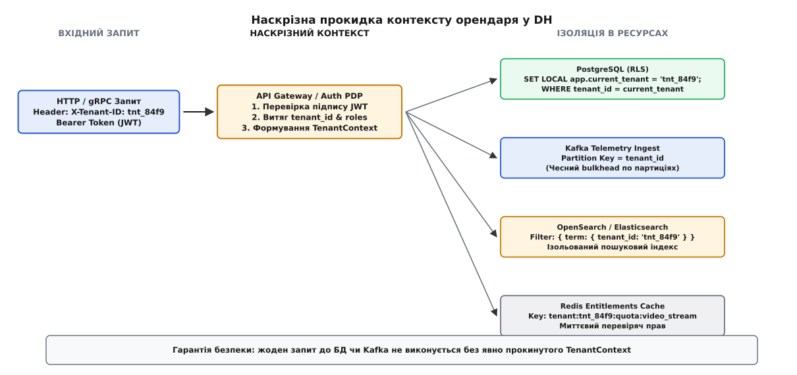
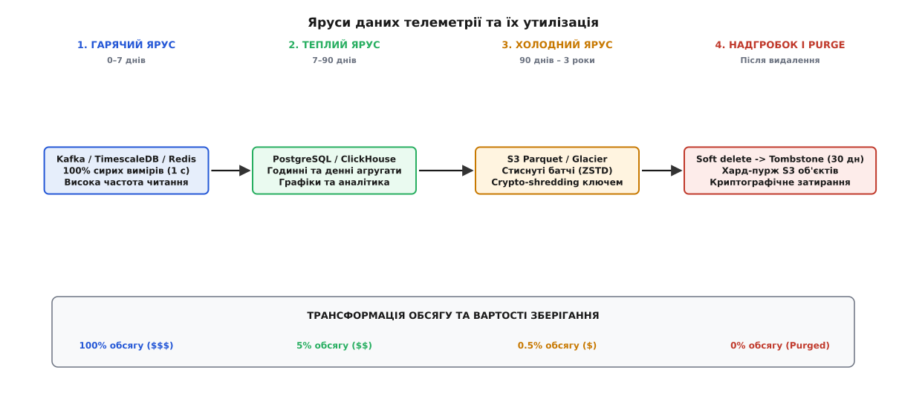
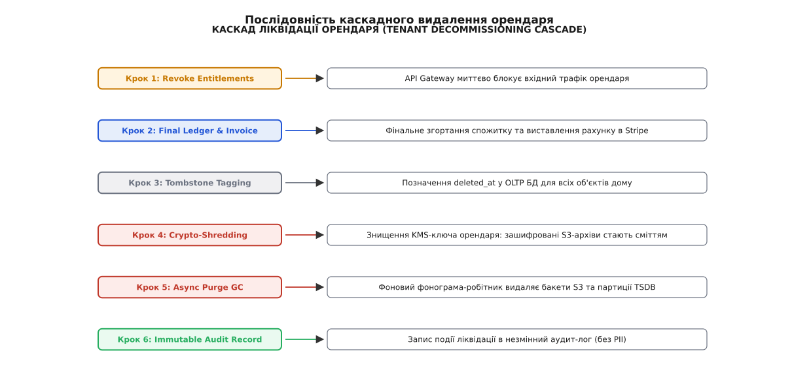

# Архітектура оренди та життєвого циклу даних DH

<preknowlist>
- [Мультиарендність](topic:distributed-systems/tenant-isolation) — концепція ізоляції орендарів: спільна БД з RLS, пули та виділені схеми.
- [Гросбух](topic:databases/double-entry-ledger) — подвійний запис, незмінні проводки, збереження цілісності грошей без floating point.
- [М'яке видалення і надгробки](topic:databases/soft-delete-tombstones) — tombstones, тривалість життя даних і безпечний purge.
- [Аудит-лог як вузол](topic:security/audit-logging) — append-only слід операцій для безпеки та відповідності регуляторним вимогам.
- [Пошук як друга правда](topic:web-backend/search-subsystem) — індексування, асинхронний розсинхрон і стратегії звуження пошукових залишків.
</preknowlist>

Забудовник житлового комплексу «SmartPark» на 4500 квартир відмовився від корпоративного контракту Digital Homes і подав вимогу про повне вилучення персональних даних усіх мешканців відповідно до регламенту GDPR. Інженерна команда виставила в головній базі даних статус `deleted_at = NOW()` для організації та відключила мобільний кабінет. Через тиждень фінансовий відділ виявив дві катастрофи: Stripe продовжував знімати щомісячну плату в \$12 000 за хмарний відеоархів, бо сервіс підписок не дізнався про видалення; водночас кластер TimescaleDB та S3-бакети продовжували приймати й зберігати петабайти телеметрії від розумних лічильників та датчиків протікання, адже IoT-брокер ігнорував м'яке видалення в OLTP-базі. Очищення «сирітських» даних вручну вимагало двох тижнів роботи DBA і коштувало понад \$35 000 позапланових витрат на хмарну інфраструктуру.

Ця аварія ілюструє головну пастку розділу: спробу розкласти ізоляцію орендарів, білінг, гросбух, аудит та життєвий цикл даних по шести ізольованих інженерних командах. У реальній системі масштабу Digital Homes це не шість незалежних підсистем. Це **єдиний наскрізний вузол оренди та життєвого циклу даних** (англ. *Tenant & Data Lifecycle Node*). Зміна стану орендаря на вході мусить миттєво й атомарно проходити крізь шість внутрішніх точок сили: від API Gateway та прав доступу (entitlements) до подвійного запису в гросбуху, індексу OpenSearch, надгробків м'якого видалення та криптографічного затирання (crypto-shredding) архівних S3-бакетів.

---

## 1. Спектр мультиарендності DH: від B2C-квартири до B2B-забудовника

У платформній архітектурі Digital Homes співіснують два протилежних типи орендарів (англ. *tenants*). З одного боку — це понад 2 мільйони B2C-власників окремих будинків чи квартир, кожен з яких генерує відносно невеликий потік подій (2–5 датчиків, 1–2 відеокамери). З іншого боку — це B2B-забудовники, готельні мережі та керовані житлові комплекси, які об'єднують 5000+ квартир в єдину організаційну структуру з власними адміністраторами, службами безпеки та суворими вимогами до ізоляції даних (SLA 99.99%).

Спроба застосувати єдину крайність — або виділену базу даних на кожного з 2 мільйонів користувачів, або єдину спільну таблицю для B2B-гіганта без засобів стримування — призводить або до банкрутства через витрати на БД, або до катастрофічного витоку даних між орендарями (англ. *cross-tenant data breach*).

Рішенням DH є **гібридна модель мультиарендності**:

```
[B2C Користувачі] ──► Спільна БД (Shared DB) + Row-Level Security (RLS)
[B2B Стандарт]    ──► Спільна схема + Окремий пул з'єднань + Квоти (Bulkhead)
[B2B Enterprise]  ──► Виділена схема / БД (Database-per-Tenant) + Власний KMS key
```

При моделі `Shared DB` фундаментальним інваріантом виступає **наскрізний контекст орендаря** (`TenantContext`). Кожен вхідний HTTP/gRPC запит на API Gateway піддається обов'язковій автентифікації, де з криптографічно підписаного JWT-токена витягуються `tenant_id` та `organization_id`. 

Цей контекст не просто передається як параметр функцій — він прикріплюється до контексту виконання (thread-local у Java/C++, Go context, AsyncLocalStorage у Node.js) і автоматично прокидається в усі вихідні мережеві виклики та репозиторії даних.


*Наскрізний контекст орендаря (TenantContext) проходить від API Gateway крізь RLS у PostgreSQL, партиції Kafka, ElasticSearch та Redis, гарантуючи ізоляцію даних і квот.*

На рівні зберігання PostgreSQL автоматично застосовує `Row-Level Security` (RLS), унеможливлюючи вибірку даних чужого орендаря навіть при наявності SQL-ін'єкції у прикладному коді:

```sql
-- Автоматичне застосування RLS у PostgreSQL для DH
ALTER TABLE telemetry_events ENABLE ROW LEVEL SECURITY;

CREATE POLICY tenant_isolation_policy ON telemetry_events
    FOR ALL
    TO application_role
    USING (tenant_id = CURRENT_SETTING('app.current_tenant', true));
```

При виконанні SQL-запитів пули з'єднань (PgBouncer чи HikariCP) перед віддачею з'єднання з пулу виконують швидку транзакційну сесійну установку: `SET LOCAL app.current_tenant = 'tnt_84f9';`. Це гарантує, що жоден потоковий виклик не отримує доступ до чужого середовища.

У брокері повідомлень Kafka `tenant_id` слугує **ключем партиціонування** (англ. *partition key*). Це забезпечує дві важливі властивості: суворий порядок обробки телеметрії від одного будинку та можливість обмежувати ресурси обробки (англ. *bulkhead*) — якщо один B2B-орендар починає штормити систему мільйонами подій, забивається лише його партиція, не впливаючи на сусідів.

### Ізоляція пулів та переповнення ресурсу (Noisy Neighbor Mitigation)

У мультиарендному середовищі головною загрозою для доступності є баг чи шторм трафіку від одного орендаря (англ. *noisy neighbor*). Якщо B2B-клієнт вмикає високочастотну діагностику 5000 термостатів, сукупний потік запитів може повністю вичерпати пул з'єднань БД (connection pool) або виїсти CPU на подальшій обробці.

Для нейтралізації цієї загрози у DH застосовується трирівнева система лімітування:
1. **Rate Limiting на API Gateway**: Token Bucket алгоритм у Redis з жорсткими стелями запитів на секунду (RPS) per-tenant.
2. **Fair Queuing / Weighted Deficit Round Robin у Kafka**: споживачі (consumers) обробляють події з партицій з урахуванням ваги орендаря.
3. **Connection Pool Bulkheading**: для великих B2B-орендарів виділяються ізольовані підпули з'єднань у PgBouncer. Вичерпання підпулу орендарем `tnt_enterprise` повертає помилку `503 Service Unavailable` тільки цьому орендареві, лишаючи основний пул B2C-користувачів повністю здоровим.

### Міграція орендарів між ярусами ізоляції (Zero-Downtime Migration)

Коли B2C-клієнт розростається до корпоративного B2B-забудовника або коли готельна мережа вимагає переходу зі спільної схеми на виділену базу даних (`Database-per-Tenant`), виникає задача міграції орендаря без зупинки платформи (англ. *zero-downtime tenant migration*).

Міграція проводиться у чотири послідовні фази:

```
Фаза 1: Подвійне читання (Read Primary, Warm Replica)
Фаза 2: Синхронізація CDC (Debezium sync даних орендаря)
Фаза 3: Подвійний запис (Dual Write: Shared Schema & Dedicated DB)
Фаза 4: Перемикання роутингу (Gateway updates Tenant Routing Table)
```

1. **Фаза підготовки схеми**: У новій виділеній БД розгортається актуальна структура таблиць.
2. **Асинхронне копіювання через CDC**: Debezium відфільтровує WAL-логи PostgreSQL за умовою `WHERE tenant_id = 'tnt_84f9'` і відправляв їх у нову БД.
3. **Dual Write & Verification**: API Gateway вмикає асинхронний дублюючий запис у нову БД. Сервіс звірки перевіряє хеш-суми закритих періодів.
4. **Атомарне перемикання роутера**: У таблиці роутингу орендарів (Tenant Routing Table) у Redis змінюється адреса підключення для `tnt_84f9`. Усі наступні запити спрямовуються у виділену БД, а записи у спільній схемі позначаються надгробками `migrated_out`.

---

## 2. Конвеєр спожитку (Metering), прав (Entitlements) та грошей (Ledger)

Грошова модель у Digital Homes розпадається на три взаємопов'язаних шари:
1. **Metering Engine**: безперервний ідемпотентний збір метрик споживання ресурсу (обсяг збереженого відео в ГБ, кількість викликів AI-аналітики, частота дискретизації телеметрії).
2. **Entitlements Engine**: миттєва перевірка дозволів та квот у реальному часі на основі поточного тарифного плану (`FREE`, `PRO`, `ENTERPRISE`).
3. **Double-Entry Ledger Engine**: незмінний журнал фінансових та метричних проводок, що гарантує цілісність грошей без розбіжностей.

### Збір спожитку (Metering) без втрат і дублів

Датчики розумного будинку генерують виміри щосекунди. Спроба писати фінансову проводку на кожну градусо-годину чи кіловат-годину увімкне недопустиме навантаження на OLTP-базу. Замість цього використовується **двостадійний метричний конвеєр**:

```
[IoT Sensors] ──► Kafka (Raw Events) ──► Flink/ClickHouse (5-min Aggregates) ──► Ledger (Idempotent Post)
```

Сирі події згортаються у 5-хвилинні або 1-годинні вікна агрегації. Кожен батч згорнутих метрик отримує **унікальний ключ ідемпотентності**:
`key = "meter:" + tenant_id + ":" + metric_type + ":" + window_timestamp`

Якщо Flink-джоб перезапускається через мережевий збій і відправляє той самий батч вдруге, `DoubleEntryLedger` бачить існуючий ключ у базі і мовчки ігнорує дублікат, повертаючи існуючий ідентифікатор проводки.

### Фінансова правда: Двозаписний гросбух (Ledger)

Головне правило фінансової безпеки DH: **гроші та спожитий ресурс ніколи не рахуються дробовими числами (float/double) і ніколи не оновлюються через `UPDATE`**. 

Усі розрахунки виконуються в найменших цілих одиницях (`bigint` — центи, копійки, байти, секунди). Детальніше про походження та 500-річний шлях цього методу від венеціанських купецьких книг до хмарних платформ описано у вставці [📜 Від купців Відродження до хмарного спожитку](root:progarch/nodes-tenancy-billing-data/dh-data-lifecycle-final/hist-double-entry-to-cloud.md).

Кожна операція — це подвійний запис двох протилежних рахунків:

```
DebitAccount  <===>  CreditAccount
```

Приклад: нарахування \$15.00 плати за місячний хмарний архів відео для будинку `home_9921`:

```
Дебет  (Debit):  tenant:tnt_84f9:unbilled_usage  = +1500 центів
Кредит (Credit): system:revenue:video_archive    = -1500 центів
```

Коли платіжний провайдер Stripe підтверджує успішне списання грошей з картки клієнта через вебхук, у гросбух додається друга проводка:

```
Дебет  (Debit):  system:stripe:clearing          = +1500 центів
Кредит (Credit): tenant:tnt_84f9:unbilled_usage  = -1500 центів
```

Залишок на рахунку `unbilled_usage` знову стає рівним нулю (1500 - 1500 = 0 центів). Якщо Stripe-вебхук запізнився або загубився в мережі, нічна **звірка (reconciliation)** бачить позитивний баланс незабезпеченого споживання і відправляє повторний запит до Stripe API за ключем ідемпотентності.

### Стійкість до порушення порядку вебхуків Stripe (Out-of-Order Webhooks)

Зовнішні платіжні системи надають гарантію доставки подій «щонайменше раз» (at-least-once delivery), але **не гарантують збереження хронологічного порядку**. 

Розглянемо небезпечну мережеву інверсію:
1. Клієнт скасовує підписку (`customer.subscription.deleted`).
2. Одночасно Stripe відправляє запізнілий вебхук успішного продовження (`invoice.payment_succeeded`).
3. Через мережеву затримку подія `invoice.payment_succeeded` приходить на вебхук-контролер **після** події `subscription.deleted`.

Якщо контролер наївно обробляє вебхуки в порядку надходження, скасований орендар раптово відновлює статус `ACTIVE`, створюючи фантомний доступ.

У DH ця проблема вирішується за допомогою **монотонно зростаючих версій подій (Event Sequence Versions)** та логічних годинників LSN/Stripe Event Timestamps:

```ts
// Обробка вебхуків із захистом від порушення порядку
async function handleStripeWebhook(event: StripeEvent) {
  const tenant = await tenantRepo.findById(event.tenantId);
  
  if (event.createdTimestamp <= tenant.lastProcessedBillingEventTime) {
    // Подія застаріла і прийшла поза порядком — мовчки ігноруємо
    logger.warn(`Out-of-order webhook ignored: ${event.id}`);
    return;
  }

  await db.transaction(async (tx) => {
    await ledger.postTransaction(event);
    await tenantRepo.updateLastBillingTime(tenant.id, event.createdTimestamp);
  });
}
```

### Обробка повернень коштів (Chargebacks) та фінансові розбіжності

У реальній експлуатації виникають випадки чарджбеків (англ. *chargebacks*) або скасування транзакцій банку. Оскільки прямий `UPDATE` чи видалення проводки в гросбуху заборонено, система здійснює **сторнування (Storno Entry)**:

```
Дебет  (Debit):  tenant:tnt_84f9:unbilled_usage  = +1500 центів
Кредит (Credit): system:stripe:chargeback        = -1500 центів
```

Після сторнування баланс `unbilled_usage` знову стає дебіторським, і Entitlements Engine при наступній перевірці прав автоматично знижує рівень доступу орендаря з `PRO` до `SUSPENDED_PAYMENT`.

### Реалізація контролера у коді

Для забезпечення цілісності між мовами backend-платформи DH (TypeScript для API/Gateway та Python для ML/Telemetry pipelines) реалізовано єдиний контракт гросбуху та контролера життєвого циклу. 

Повний приклад вихідного коду з інтегрованими класами `DoubleEntryLedger`, `MeteringEngine` та `TenantDecommissioner` винесено в окремий практичний модуль [⚙️ Реалізація контролера життєвого циклу орендаря, metering та гросбуху в DH](root:progarch/nodes-tenancy-billing-data/dh-data-lifecycle-final/proj-dh-tenancy-ledger-lifecycle.md).

---

## 3. Життєвий цикл телеметрії та відео: від гарячого TSDB до S3 Glacier і GDPR Purge

Дані телеметрії у Digital Homes проходять тривалий шлях трансформації. Головна суперечність життєвого циклу полягає у тому, що цінність даних стрімко падає з часом, тоді як вартість їх збереження зростає.

```
Час = 0 с ───────────────────► 7 днів ───────────────────► 90 днів ───────────────────► 3 роки
[Гарячий ярус]               [Теплий ярус]              [Холодний ярус]             [Надгробки & Purge]
TimescaleDB / Redis          PostgreSQL Daily           S3 Parquet (ZSTD)           Tombstone / Shredding
100% сирих вимірів           Годинні/денні підсумки    Стиснутий архів             Остаточне вилучення
```


*Життєвий цикл телеметрії: від 100% сирих вимірів у гарячому TSDB до згорнутих денних агрегатів у теплій БД, Parquet-архівів в S3 і криптографічного затирання після видалення.*

### Етапи утилізації даних

1. **Гарячий ярус (Hot Tier)**: Сирі дані телеметрії (температура, напруга, події датчиків з частотою 1 Гц) пишуться у TimescaleDB або Redis TimeSeries. Час зберігання — від 24 годин до 7 днів. Використовуються для оперативного відображення в мобільному застосунку та спрацювання автоматичних сценаріїв (наприклад, перекрити кран при протіканні).
2. **Теплий ярус (Warm Tier)**: Спеціальний background-worker згортає сирі виміри у годинні та денні підсумки (сума, максимум, мінімум, медіана) й зберігає їх у стандартних таблицях PostgreSQL. Сирі дані з гарячого ярусу авто-видаляються за TTL (англ. *Time-To-Live*).
3. **Холодний ярус (Cold Tier)**: Денні підсумки та критичні події (аудит-лог) експортуються в S3-бакети у форматі Apache Parquet зі стисненням ZSTD. Обсяг зменшується у 20–30 разів порівняно з реляційною БД.
4. **Надгробок (Tombstone) та Пурж (Purge)**: Коли користувач або B2B-орендар видаляє будинок чи пристрій, система встановлює надгробок `deleted_at`. Дані стають невидимими для API, але зберігаються протягом 30-денного **граційного періоду (grace period)** на випадок випадкового видалення або відкликання вимоги.

### Двофазний розсинхрон пошуку та аудит-логу

При видаленні об'єкта реляційна база даних PostgreSQL стає першою точкою правди. Однак у системі присутні ще дві критичні підсистеми з власними інваріантами:

* **Пошуковий індекс (OpenSearch)**: Пошуковий індекс є «другою правдою». При встановленні надгробка в БД подія видалення відправляється через CDC (Debezium / Outbox Pattern) до OpenSearch, який миттєво робить документ невидимим у пошуковій видачі. Якщо індекс тимчасово відстає (англ. *indexing lag*), API Gateway додатково фільтрує залишкові результати на основі `TenantContext`.
* **Аудит-лог (Audit Log)**: На відміну від операційних даних, аудит-лог є **незмінним журналом (append-only)**. Законодавчі вимоги (Financial Audit, SOC2) забороняють фізично видаляти записи про те, хто й коли відчиняв двері або змінював конфігурацію замків. 

Щоб виконати вимоги GDPR (англ. *Right to be Forgotten*) без порушення цілісності аудит-логу, DH застосовує **криптографічне затирання (crypto-shredding)**:

```
[Personal PII Data] ──► Encrypted with Tenant KMS Key (KMS_Tenant_42) ──► Audit Log Storage
                                                                                │
[GDPR Delete Request] ──► Destroy KMS_Tenant_42 ────────────────────────────────┘
                          (Payload becomes unreadable ciphertext forever)
```

Всі персональні дані (імена, номери телефонів, IP-адреси) в аудит-лозі шифруються унікальним ключем орендаря (`KMS_Tenant_ID`). При отриманні вимоги про видалення персональних даних система знищує відповідний KMS-ключ. Записи в аудит-лозі залишаються математично цілісними для аудиторів (збережено структуру та факти подій), але самі персональні дані перетворюються на невідновлюваний криптографічний шум.

### Людські номери, ідентифікатори та захист від Enumeration Attacks

Генерація ідентифікаторів у мультиарендній системі вимагає дотримання двох протилежних вимог:
1. **Унікальність та сортируваність за часом**: використання ULID або UUIDv7 для внутрішніх сутностей (телеметрія, події, проводки гросбуху). Це гарантує локальність даних у B-Tree індексах PostgreSQL та усуває фрагментацію диска.
2. **Людський вигляд для платіжних документів**: номери рахунків та інвойсів повинні мати послідовну нумерацію (`INV-2026-00891`). 

Однак пряме використання автоінкрементних sequence у мультиарендній системі створює вразливість **ID Enumeration Attack**: конкурент може зареєструвати акаунт, отримати рахунок `INV-0100`, а через день створити другий рахунок `INV-0145` і дізнатися, що платформа за добу виставила рівно 45 рахунків іншим клієнтам.

У DH людські номери генеруються **у межах конкретного орендаря (tenant-scoped sequences)**:
`tenant_id + ":" + sequence_name`

Номер рахунку виглядає як `SMARTPARK-INV-00042`, де число `00042` показує порядковий номер рахунку *саме для цього клієнта*, абсолютно приховуючи глобальні обсяги бізнесу платформи.

---

## 4. Каскад ліквідації орендаря (Tenant Decommissioning Cascade)

Найскладніший випробувальний тест для архітектури — це повне припинення обслуговування B2B-орендаря (англ. *Tenant Decommissioning*). Це не просто один SQL-запит `DELETE FROM tenants`. Це складна асинхронна послідовність крок-за-кроком, що гарантує фінансову розрахунковість та повну очистку ресурсів.


*Каскад видалення орендаря: блокування прав, фінальна звірка гросбуху, позначення надгробків, знищення KMS-ключа та фоновий хард-пурж.*

Послідовність каскаду ліквідації у DH:

1. **Крок 1: Відклик прав (Revoke Entitlements)**
   API Gateway отримує сигнал від сервісу оренди і миттєво інвалідує всі сесії та JWT-токени орендаря в Redis. Будь-які нові вхідні API-запити або спроби підключити IoT-датчики відхиляються з помилкою `403 Forbidden`.

2. **Крок 2: Фінальне згортання гросбуху (Final Ledger Settlement)**
   `MeteringEngine` зупиняє прийом нових вимірів, проводить підсумкову агрегацію накопиченого незабезпеченого споживання (`unbilled_usage`) та створює остаточну проводку. Проводиться асинхронна звірка зі Stripe та виставляється фінальний рахунок (англ. *final invoice*).

3. **Крок 3: Маркування надгробками (Tombstone Tagging)**
   У головній OLTP-базі даних PostgreSQL для запису орендаря та всіх пов'язаних будинків, пристроїв та користувачів виставляються надгробки `deleted_at = NOW()`. Система входить у 30-денний граційний період.

4. **Крок 4: Криптографічне затирання (Crypto-Shredding)**
   Після завершення граційного періоду сервіс безпеки надсилає команду в AWS KMS / HashiCorp Vault на остаточне вилучення master-ключа шифрування даного орендаря (`kms_key_tenant_id`). Усі холодні архіви відеофайлів та телеметрії в S3 автоматично стають недоступними для читання.

5. **Крок 5: Асинхронне очищення (Async Purge Garbage Collection)**
   Фоновий робітник очищення (англ. *Garbage Collector*) у батчевому режимі сканує надгробки, віком понад 30 днів:
   - Видаляє партиції у TimescaleDB (`DROP TABLE telemetry_p_tenant_42`);
   - Посилає DELETE-запити в S3-бакети для вилучення фізичних об'єктів Parquet;
   - Видаляє відповідні документальні індекси в OpenSearch.

6. **Крок 6: Фіксація аудит-запису (Immutable Audit Record)**
   У глобальний системний аудит-лог пишеться фінальний незмінний запис про успішну ліквідацію орендаря із зазначенням обсягу вилучених ресурсів та ідентифікаторів знищених KMS-ключів.

---

## 5. Спостережуваність, метрики та простеження (Observability & Tracing)

Оскільки вузол оренди та життєвого циклу даних пронизує весь стек платформи, його здоров'я оцінюється трьома специфічними групами метрик OpenTelemetry:

1. **Ізоляційні метрики (Tenant Isolation Metrics)**:
   * `tenant_cross_access_attempts_total`: кількість відхилених запитів, де `TenantContext` не збігся з власником ресурсу (мусить дорівнювати 0).
   * `tenant_connection_pool_saturation_ratio`: коефіцієнт заповнення пулу з'єднань конкретного B2B-орендаря (сигнал про noisy neighbor).

2. **Фінансово-метричні метрики (Ledger & Metering Metrics)**:
   * `ledger_imbalance_cents_total`: різниця між дебетом і кредитом у гросбуху (тригер тривоги при значеннях != 0).
   * `metering_ingest_lag_seconds`: затримка між надходженням сирої події датчика та появою проводки в гросбуху.

3. **Метрики життєвого циклу (Data Lifecycle Metrics)**:
   * `tombstone_active_count`: кількість сутностей у граційному періоді м'якого видалення.
   * `crypto_shredding_pending_jobs`: кількість орендарів, що очікують видалення KMS-ключів.

Приклад OpenTelemetry трейсу, що пронизує весь конвеєр:

```
[Trace ID: 4f8a9b2c]
 ├── gRPC API Gateway: authenticate_tenant (tenant_id: tnt_84f9) [2ms]
 ├── PostgreSQL Repos: SET LOCAL app.current_tenant = 'tnt_84f9' [1ms]
 ├── Metering Engine: process_telemetry_batch [5ms]
 │    └── DoubleEntryLedger: post_transaction (idempotency: meter_tnt_84f9_9921) [3ms]
 └── Kafka Producer: publish_event (partition_key: tnt_84f9) [4ms]
```

---

> 🔧 **Навіщо це.**
> Об'єднання мультиарендності, білінгу, гросбуху та життєвого циклу даних у **єдину архітектурну модель** рятує розробників від трьох найдорожчих хвороб хмарних систем:
> 1. **Витік даних між орендарями (Cross-Tenant Leak)**: завдяки автоматичній прокидці `TenantContext` на рівень RLS у PostgreSQL та партиціюванню в Kafka жоден розробник не зможе випадково віддати дані чужого дому.
> 2. **Фінансові розбіжності та фантомні списання**: подвійний запис у гросбуху й ключі ідемпотентності гарантують, що платформа не втратить ані цента при мережевих збоях і не зніме з клієнта зайві гроші.
> 3. **Штрафи GDPR та хмарне марнотратство**: чітко визначений каскад ліквідації гарантує, що при відмові клієнта його петабайтні архіви не залишаться «висіти» в S3, а персональні дані будуть гарантовано знищені через crypto-shredding без порушення аудит-логу.

---

## Підсумок вузла: Шість точок сили в єдиній нитці

Пройшовши шлях через увесь розділ, ми бачимо, як фрагменти склалися у цілісну картину:

| Компонент вузла | Роль у схемі DH | Архітектурний інваріант |
|---|---|---|
| **Мультиарендність** | Прокидка `TenantContext` крізь усі шари | Жодного SQL/gRPC запиту без `tenant_id` + RLS |
| **Metering & Entitlements** | Збір спожитку та контроль квот | 5-хвилинні вікна агрегації + Redis rate-limiting |
| **Double-Entry Ledger** | Незмінний журнал грошей і спожитку | Сума Дебетів = Сума Кредитів, тільки цілі `bigint` |
| **Search Subsystem** | Друга правда для швидкого пошуку | Миттєвий фільтр за `tenant_id` + CDC розсинхрон |
| **Audit Log & Shredding** | Доказ дій + захист PII за GDPR | Append-only слід + crypto-shredding через KMS |
| **Data Lifecycle & Purge** | Еволюція даних від TSDB до S3 | TTL -> Tombstone (30 дн) -> Async Purge / Shred |

Архітектура оренди та життєвого циклу даних — це не просто набір красивих паттернів. Це **каркас життєздатності платформи Digital Homes**, який дає змогу системі зростати до мільйонів домів, заробляти гроші без розбіжностей і зберігати повну керованість під будь-яким навантаженням.
