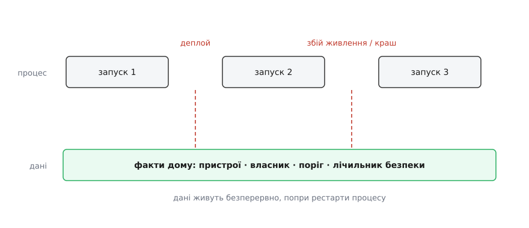

# Дані переживають процес

<preknowlist>
- [Ієрархія памʼяті](topic:hw-arch/memory-hierarchy) — оперативна памʼять летюча (без живлення губить усе за мить), а диск і флеш тривкі (тримають записане й без струму); на цій різниці стоїть увесь крок.
</preknowlist>

Наприкінці розділу про стан ми склали [мапу памʼяті](root:progarch/state-inventory) й чесно позначили її найдальший, найнебезпечніший кут: зовнішнє сховище — база, файл — те єдине, що «переживає сам процес». Позначили й відсунули на потім. Потім настало. Цілий модуль ми вчилися стан **виганяти** з програми — заморожувати, виводити, зводити в одне місце. А тепер беремося за той різновид, який вигнати нікуди, бо він і є причина, з якої система взагалі існує: **факти, що мусять лишитися, коли процес зникне.**

І ось у чому підступ, з якого росте цілий модуль. Досі весь наш дім жив в **оперативній памʼяті**. Реєстр пристроїв, поріг опалення, лічильник безпеки — усе це трималося в полях живих обʼєктів усередині запущеного процесу. Поки процес живий, усе гаразд. Але процес — це свічка: горить і гасне. А факти, за які дім відповідає, гаснути разом із ним **не мають права**.

## Процес — свічка, і гасне він часто

Спокуса думати, що «процес падає» — це рідкісна аварія, до якої готуються окремо. Насправді зникнення процесу — це буденний ритм будь-якої живої системи, і трапляється воно з десятка звичайних причин. Викотили нову версію хаба — стару вбили, нову підняли. Необроблений виняток поклав процес. Скінчилась памʼять, і система його прибила. На хабі кліпнуло живлення. Операційна система пішла на перезавантаження заради оновлення. Кожна з цих подій робить одне й те саме: **стирає всю оперативну памʼять дощенту** й запускає процес із чистого аркуша.

Погляньмо, що це означає для [реєстру пристроїв, який ми у v2 тримали в памʼяті](root:progarch/dh-v2-hexagon). Ось він у всій красі:

:::tabs
```py
class InMemoryDeviceRepository:              # за портом DeviceRepository з v2
    def __init__(self):
        self._devices: dict[str, Device] = {}

    def save(self, d: Device) -> None:
        self._devices[d.id] = d              # ← усе життя цього словника = життя процесу

    def all(self) -> list[Device]:
        return list(self._devices.values())
```
```ts
class InMemoryDeviceRepository {             // за портом DeviceRepository з v2
  private devices = new Map<string, Device>();

  save(d: Device): void {
    this.devices.set(d.id, d);              // ← усе життя цієї мапи = життя процесу
  }
  all(): Device[] {
    return [...this.devices.values()];
  }
}
```
:::

Родина заводить дім: додає замок на вхідні двері, термостат у спальню, розетку в кухню. Усе працює — сервіс справно кладе пристрої в словник і віддає їх на запит. А тоді, серед ночі, хаб отримує оновлення й перезапускається:

```
$ dh add lock       "вхідні двері"
$ dh add thermostat "спальня"
$ dh add plug       "кухня"
$ dh state
3 пристрої: lock(вхідні двері), thermostat(спальня), plug(кухня)

# … хаб перезапустили (звичайний нічний деплой) …

$ dh state
0 пристроїв
```

Дім прокинувся **порожнім**. Він забув кожен пристрій, який родина додала, забув поставлений поріг, забув усе. Словник у памʼяті помер разом із процесом — і забрав із собою всю правду системи. Це не баг у `save`; `save` бездоганний. Це наслідок глибшого факту: ми привʼязали **час життя даних** до **часу життя процесу**, а це дві геть різні тривалості, які не мають збігатися.


*Процес живе короткими запусками, розірваними рестартами, і кожен рестарт стирає його оперативну памʼять. Дані ж мусять текти однією безперервною ниткою попід усіма цими розривами. Завдання сховища — саме звести ці дві різні тривалості: відчепити життя фактів від життя процесу.*

## Тривкість: винести факти туди, де їх не зжере рестарт

Ліки називають себе самі: факти, що мусять пережити процес, треба покласти в памʼять, яка сама переживає і процес, і зникнення живлення. Це і є **тривкість** (від лат. *persistere* — стояти твердо, триматися далі: *per-* «наскрізь» + *sistere* «стояти»): здатність даних лишатися, коли того, хто їх створив, уже немає. Сама ідея, що тривалість життя даних варто відчепити від того, як і ким вони породжені, — стара й глибока; її [відточили ще на світанку 1980-х під назвою «ортогональна тривкість»](root:progarch/dh-data-persistence/hist-orthogonal-persistence.md), і вона рівно про наш розрив двох тривалостей.

Фізична підстава проста. Оперативна памʼять **летюча** (лат. *volatilis* — летюча, крилата, від *volare* — літати): зникло живлення — за частку секунди зникло все. Диск і флеш **нелетючі**: вони тримають записане й без струму. Тож «зробити факт тривким» означає буквально одне — перегнати його байти з летючої RAM на нелетючий носій.

Але тут ховається пастка, за яку тримається половина цього модуля, і Фейнманове питання до неї — «а коли саме запис справді стався?». Наївна відповідь: «коли мій код повернувся з виклику запису». Хибна. Коли програма викликає запис, байти не летять одразу на пластину диска — вони осідають у **кеші операційної системи**, а це знову та сама летюча RAM. ОС злиє їх на носій згодом, коли їй зручно. Якщо живлення зникне в цю мить — ти «записав», а на диску нічого немає. Справжня тривкість вимагає окремого кроку — **`fsync`**, наказу «злий на носій і не повертайся, поки він не підтвердить». Ось де межа між «мій код гадає, що записав» і «носій підтвердив, що воно там»:

:::tabs
```py
with open(path, "w") as f:
    f.write(data)
    f.flush()           # віддали з буфера мови в кеш ОС — усе ще летюче!
    os.fsync(f.fileno())  # ← лише тепер ОС злила на носій і підтвердила
```
```ts
const fd = fs.openSync(path, "w");
fs.writeSync(fd, data);
fs.fsyncSync(fd);       // ← лише після цього байти справді на носії
fs.closeSync(fd);
```
:::


*Між застосунком і тривким носієм лежить летючий кеш ОС. Поки байти в ньому, вони «нібито записані» — і саме там краш їх зжирає. Тривкість настає лише тоді, коли носій підтвердив запис назад. Оце підтвердження і є справжнє «збережено».*

> 🔧 **Навіщо це.** «Мій код записав» і «дані в безпеці» — це два різні твердження, і плутати їх дорого. Система, що звітує «збережено» до підтвердження з носія, обіцяє те, чого не гарантує: перший же збій живлення в невдалу мілісекунду зробить її брехухою про дані, за які вона відповідає. Тому гарантію «підтверджений запис переживе будь-що» винесли в окрему літеру — це **D** (durability) в [ACID](topic:sf-data/transactions-acid), а те, як база дає її, не втрачаючи даних навіть на краху посеред запису, — це [журнал попереднього запису (WAL)](topic:sf-data/write-ahead-log). Обидва кроки попереду; тут досить засвоїти, що тривкість — це підтвердження, а не сподівання.

## Найдешевша відповідь — файл — і де вона ламається

Гаразд, треба на диск. Найдешевше, що спадає на думку, — на кожну зміну скидати весь реєстр у файл, а на старті його читати:

:::tabs
```py
def save_all(devices, path="devices.json"):
    with open(path, "w") as f:              # ← "w" МИТТЄВО обрізає файл до нуля
        json.dump([d.to_dict() for d in devices], f)   # а тоді пишемо заново
```
```ts
function saveAll(devices: Device[], path = "devices.json"): void {
  // openSync(..., "w") миттєво обрізає файл до нуля, а тоді пишемо заново
  fs.writeFileSync(path, JSON.stringify(devices.map(d => d.toDict())));
}
```
:::

Воно навіть працює — рівно доти, доки не спіткнеться об один із чотирьох камінців, і кожен випливає з попереднього.

Перший — **розірваний запис**. Режим `"w"` обрізає файл до нуля **вмить**, а наповнює його заново вже потім. Впади процес між цими двома митями (а ми щойно бачили, як часто він падає) — і на диску лишається порожній або напівдописаний, зіпсований файл. Уся правда системи втрачена не за останню зміну, а **цілком**. Наївний запис не просто ненадійний — він робить сховище **менш** живучим за памʼять, бо тепер краху боїться навіть те, що вже було збережене. Класичні ліки — писати в тимчасовий файл, зробити йому `fsync`, а тоді **атомарно перейменувати** поверх старого:

:::tabs
```py
def save_all(devices, path="devices.json"):
    tmp = path + ".tmp"
    with open(tmp, "w") as f:
        json.dump([d.to_dict() for d in devices], f)
        f.flush(); os.fsync(f.fileno())     # новий файл справді на диску
    os.replace(tmp, path)                    # атомарна заміна: або старий, або новий
```
```ts
function saveAll(devices: Device[], path = "devices.json"): void {
  const tmp = path + ".tmp";
  const fd = fs.openSync(tmp, "w");
  fs.writeSync(fd, JSON.stringify(devices.map(d => d.toDict())));
  fs.fsyncSync(fd); fs.closeSync(fd);        // новий файл справді на диску
  fs.renameSync(tmp, path);                  // атомарна заміна: або старий, або новий
}
```
:::

Придивись: ми написали пʼять рядків замість одного, щоб просто **не втратити** дані на краху. І це лише перший камінець.

Другий — **двоє писарів**. Згадаймо, що в дім v2 ведуть [двоє дверей](root:progarch/dh-v2-hexagon): автономний цикл і зовнішній запит. Хай обоє захочуть записати файл одночасно — і їхні записи переплетуться в кашу або один тихо затре зміну іншого. Файл сам собою не вміє впускати писарів по черзі; цю чергу довелося б будувати руками.

Третій — **жодного часткового читання**. Щоб відповісти на просте питання «які пристрої в кухні?», доводиться щоразу підняти й розібрати **весь** файл. Поки пристроїв три — байдуже. Коли їх у хмарі сотні тисяч на багато домів — кожне питання коштує «прочитати все», і система задихається.

Четвертий — **немає поняття «як ціле»**. Ми ж [домовилися зберігати кожен агрегат неподільно](root:progarch/dh-data-model): або дім із його змінами лягає весь, або ніяк. Файл такої обіцянки не дає — краш між записом пристрою A і пристрою B лишає сховище в стані, якого в правилах дому **ніколи не існувало**.

І ось головне прозріння цього кроку. Кожен із цих чотирьох каменів — не примха нашого файлу, а фундаментальна вимога до будь-якого чесного сховища: атомарний тривкий запис, впускання писарів по черзі, швидкий пошук за частиною, групування змін «усе або нічого». А річ, яка вже вирішує всі чотири — правильно, роками виточено, — має імʼя: це **база даних**. База — не магія; це нагромаджена й вивірена відповідь рівно на ті задачі, які інакше довелося б винаходити самотужки й неминуче гірше. Повний чесний тривкий репозиторій — з атомарним записом, тестом на переживання рестарту й версією на SQLite за тим самим портом — зібрано в [окремому розборі-проєкті](root:progarch/dh-data-persistence/proj-durable-repository.md); тут нам досить було побачити, **чому** одного файлу мало.

## Тривкість — рішення, а не рефлекс

Спокуса після такого — кинутися все підряд писати в базу. Але це рівно та помилка, від якої застерігав увесь курс: сховище коштує — швидкодією, складністю, ще одним місцем, що може розійтися з правдою. Тож питання не «чи потрібна база?», а тверезіше: **які саме факти мусять пережити процес, і яких гарантій вони потребують?**

Тут стає в пригоді дисципліна, яку ми вже маємо, — [джерело правди проти похідного](root:progarch/state-inventory). Про кожен шматок стану став два питання по черзі: *це джерело правди, чи його можна вивести?* і *що станеться, якщо ми його втратимо на рестарті?* Тривкого дому на диску заслуговують лише **справжні джерела, які втратити не можна**. Похідне (кеш, підсумок) — не зберігай, а виводь наново. А дещо не варто зберігати, бо його правду вже тримає **сам світ**.

Найкращий приклад — наш власний [v0](root:progarch/dh-v0-one-sensor). Його серце було чесно без стану: цикл щоразу читав давач наново, а факт «обігрівач увімкнено» жив не в програмі, а в **реле**. І це геніально просто: перезапусти скрипт коли завгодно — губити нема чого, бо джерело правди — фізичний світ, і його питають наживо. Ту саму лінзу прикладаємо до підрослого дому:


*Той самий інвентар стану, але тепер як рішення про тривкість. Ліворуч — справжні джерела, які втратити не можна: їх кладемо на диск. Праворуч — те, чию правду тримає світ: температуру перечитаємо з давача, стан обігрівача — з реле. Тривке сховище дістає лише те, що його заслужило.*

> 🔧 **Навіщо це.** Це рішення визначає не тільки обсяг бази, а й **живучість** системи. Клади на диск усе підряд — і кожен зайвий тривкий шматок стає другим джерелом правди, яке рано чи пізно розійдеться зі світом: у базі «увімкнено», а реле вимкнене. Клади надто мало — і втратиш на рестарті те, чого світ за тебе не памʼятає: скільки вже гріємо, які пристрої взагалі є. Правильний розкрій — не «зберігати чи ні за звичкою», а «хто справжній господар цієї правди»: якщо світ — питай світ; якщо ніхто, крім нас, — тоді на диск, надійно.

## DH: даємо реєстру дім, що переживе рестарт

Тепер найприємніше — скільки коштує це полагодити. Виявляється, майже нічого, і саме тому, що [форму ми заклали заздалегідь](root:progarch/dh-v2-hexagon). Реєстр пристроїв ще у v2 сховано за портом `DeviceRepository`, а `InMemoryDeviceRepository` стояв за ним лише як чесна тимчасова затичка — памʼятаєте коментар «SQLite стане сюди в модулі про сховище»? Модуль настав. Уся заміна — один рядок у точці збірки:

:::tabs
```py
def build(env: str) -> HubService:
    ...
    # було:  devices = InMemoryDeviceRepository()
    devices = SqliteDeviceRepository("dh.db")   # тепер реєстр переживає рестарт
    return HubService(sensor, heater, devices, cfg)
```
```ts
function build(env: string): HubService {
  // було:  const devices = new InMemoryDeviceRepository();
  const devices = new SqliteDeviceRepository("dh.db");  // тепер переживає рестарт
  return new HubService(sensor, heater, devices, cfg);
}
```
:::

І все. `HubService` не помітив нічого — він як бачив у руках обіцянку порту, так і бачить; жоден рядок ядра чи сценаріїв не змінився. Оце й був сенс тримати сховище за портом: у мить, коли тимчасова затичка поступається тривкій реалізації, решта застосунку навіть не прокидається. Тепер той самий сеанс закінчується інакше:

```
$ dh add lock "вхідні двері"
$ dh add plug "кухня"

# … хаб перезапустили …

$ dh state
2 пристрої: lock(вхідні двері), plug(кухня)     # ← пережили рестарт
```

Дім прокинувся, **памʼятаючи себе**. Розрив між двома тривалостями зведено: процес так само гасне й спалахує, а факти течуть попід тими розривами безперервно.

Ми не додали дому жодної нової можливості — ані пристрою, ані кнопки. Ми зробили тихіше й важливіше: **відчепили життя даних від життя процесу**. Це маленьке усвідомлення — що дані й процес мають різні тривалості й одну не можна привʼязувати до іншої — і є той ґрунт, на якому росте весь модуль про сховище.

Лишилося головне питання, яке ми досі обходили: **якої форми** має бути та тривка памʼять? Кинути все в один файл ми щойно спробували — вийшло погано. Наступний крок дає першу серйозну відповідь — [реляційну модель](topic:sf-data/relational-model): дані як рядки в таблицях, звʼязані між собою за змістом. І, як усе в цьому курсі, ми обиратимемо її не за звичкою, а тому, що для більшості домашніх фактів вона виявиться напрочуд слушним — і чесно «нудним» — стандартом за замовчуванням.
