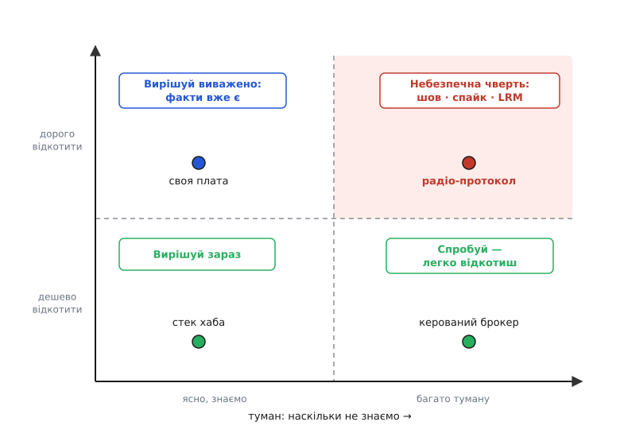
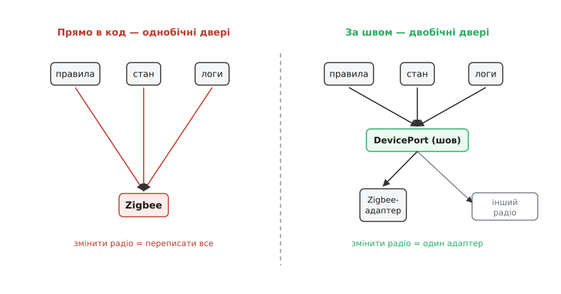

# DH під невизначеністю

<preknowlist>
- [Рішення під невизначеністю](topic:programming/deciding-under-uncertainty) — метод, який тут застосуємо до DH: збивати туман дешевим дослідом, робити рішення зворотним, відкладати до кращих фактів.
- [Зворотні й незворотні рішення](topic:programming/reversible-irreversible-decisions) — однобічні й двобічні двері; незворотність частіше властивість того, ЯК вибір вплетено, а не самого вибору.
- [Останній відповідальний момент](topic:programming/last-responsible-moment) — відкладай важкий вибір рівно доти, доки зволікання не почне коштувати більше за саме рішення; назви подію-тригер.
</preknowlist>

Пригадаймо, де ми лишили [Digital Homes](root:progarch/dh-v0-one-sensor). Це був один дім, один давач температури й однофайловий скрипт на маленькому хабі, що вмикав обігрівач за зашитим порогом. Воно працює; кілька знайомих уже просять «поставте й мені». Настає день, коли трьох засновників саджає за стіл фраза «зробімо з цього продукт» — і на стіл разом із нею лягає купа рішень. На яку радіотехнологію ставити, щоб говорити з лампочками й замками. Робити власний хаб-залізяку чи лишитися на готовій платі. Чи потрібна вже хмара. Якою мовою писати. Де зберігати стан дому. Писати синхронізацію самим чи взяти готовий брокер.

І кожне з цих питань здається однаково велетенським і однаково туманним. Інстинкт — вихопити по одній відповіді на кожне й кинутися кодити, бо невизначеність тисне, а закрите питання приємно гріє. Весь цей модуль був про те, чому саме такий інстинкт найдорожчий: рішення, ухвалене найраніше, стоїть на найгірших фактах, які ти взагалі матимеш за проєкт. Тут ми не шукатимемо «правильних» відповідей на купу — їх ще немає. Ми зробимо те, заради чого весь інструментарій і збирали, і що [пообіцяли наприкінці минулого кроку](root:progarch/assumptions-vs-facts) — прогнати крізь зібрану дисципліну всю платформу DH: **розберемо купу** так, щоб кожне рішення дістало те поводження, на яке заслуговує, — і жодне не з'їло тижнів, яких не варте.

## Не одна купа, а два питання до кожного

Головний хід — перестати бачити купу як одну велику страшну грудку. Купа паралізує саме тому, що змішує в одне різні за природою рішення. Розчепимо їх двома питаннями, які ми вже вміємо ставити. Перше: **скільки коштуватиме це відкотити**, коли з'ясується, що ми помилилися, — однобічні це двері чи двобічні? Друге: **чи справді тут туман** — ми дійсно не знаємо відповіді, чи просто нервуємо перед великим на вигляд рішенням?

Дві осі — і купа розкладається на мапу.


*Кожне рішення сідає на дві осі: скільки коштує відкотити (вертикаль) і скільки насправді туману (горизонталь). Місце на мапі диктує хід — і воно не збігається з тим, яке рішення «страшніше на вигляд». Небезпечна лише одна чверть: дорого відкотити й густий туман водночас.*

Прочитаймо чверті, бо кожна вимагає іншого. Де **дешево відкотити й усе ясно** — вирішуй одразу й іди далі; сперечатися тут — марнувати життя. Де **дешево, зате туманно** — не гадай, а спробуй: вибір двобічний, помилку відкотиш за годину, тож найдешевший спосіб дізнатися — просто зробити. Де **дорого, зате ясно** — факти в тебе вже є, лишається вирішити виважено, без поспіху, але й без зволікання: туману, який варто перечікувати, тут немає. І лише одна чверть по-справжньому небезпечна — **дорого відкотити й густо туману разом**. Оце те місце, де увесь модульний інструмент — зробити зворотним, збити спайком, відкласти до останнього відповідального моменту — заробляє свій хліб.

> 🔧 **Навіщо це.** Перед плануванням винеси кожне назріле рішення на цю мапу, ще не обговорюючи його по суті. Мапа за п'ять хвилин скаже, куди піде тиждень команди, а куди — знизування плечима. Найчастіша помилка команд — витрачати однакову увагу на всі рішення підряд; мапа розводить «страшне на вигляд» і «справді дороге до відкату», а це майже завжди різні речі.

## Купа DH на мапі

Половину цієї купи ми, власне, вже розібрали в попередніх кроках — просто не бачили всі рішення разом на одному полотні. Посадімо їх на мапу (осі тут інші, ніж коли ми ділили світ на ядро й контекст) — і однаковий на вигляд страх розкладеться на дуже різні ходи, а метод, що стояв за ними, проступить сам.

**Мова й стек хаба.** Здається важливим — а туману нема майже жодного: для хаба-прототипа на маленькому комп'ютері чудово лягає звичайна високорівнева мова, і десятки живих проєктів розумного дому це вже довели. Відкотити теж не смертельно: переписати молодий хаб іншою мовою болісно, але це не однобічні двері. Ясно й недорого → нижня-ліва чверть, **вирішуй зараз**. Витратити на це нараду — вже помилка; тут працює [YAGNI](topic:programming/dry-kiss-yagni): не вибудовуй мультимовної збірки, якої ще ніхто не потребує.

**Власний хаб-залізо.** Оце відчувається найбільшим рішенням — і саме тут пастка «велике = туманне» ловить найлегше. Насправді туману обмаль: **відповідь ясна — не зараз**. Своя плата означає замовлення, сертифікацію, склад, партії — [вартість](topic:programming/cost-as-attribute), яку молодий продукт не потягне й яка нічого не додасть першим клієнтам. Дорого відкотити (залізо не перепишеш нічним патчем), але фактів для «так» ще немає й довго не буде. Верхня-ліва чверть: **вирішуй виважено — і виважене рішення тут «ще ні»**; став продукт на готову плату, а власне залізо лишай на день, коли обсяг його виправдає. Це те саме «[коли НЕ будувати](root:progarch/dh-not-building)», з якого ми починали розділ.

**Хмара.** Так само велика на вигляд — і так само не на часі. v0 працював цілком локально, і перший продукт хмари не потребує: він потребує кількох задоволених домів. Дорого й туманно, але хід — **відкласти з названим тригером**: беремося за хмару, коли з'явиться перший клієнт, якому потрібен доступ до дому іззовні. Без тригера відкладання перетворюється на прокрастинацію — а її ціну ми вже зважували, [зволікання проти помилки](root:progarch/cost-of-delay).

**Готовий брокер.** Це рішення ми вже ухвалили — [не будувати свій, а взяти куплений](root:progarch/dh-not-building), сховавши його за власним портом. На мапі видно, чому воно було легким: [будувати чи купувати](topic:programming/build-vs-buy) під туманом, але за портом брокер **зворотний**, а сам вибір недорогий і швидкий. Нижня-права чверть: **спробуй**; забажаєш пізніше писати своє — замінюватимеш адаптер, а не півсистеми.

**Радіо-протокол.** А ось і єдиний мешканець небезпечної чверті. Дорого відкотити: щойно хаб заговорить конкретним радіо, ним просякне все — правила, моделі пристроїв, логи. І густо туману: якому зі стандартів судилося виграти, чесно не знав ніхто. Це рішення й розберемо до дна — на ньому весь модуль складається в один рух.

## Одне рішення до дна: на яке радіо ставити

Уявімо стіл переговорів десь на порозі 2022 року. Кандидатів на те, як хаб фізично говоритиме з лампочками, замками й давачами, кілька, і кожен зі своїм табором. Zigbee — сітка на 2.4 ГГц. Z-Wave — на суб-гігагерцовій частоті, менше завад, більший радіус. Звичайний Wi-Fi. І щойно народжений Matter — спільний стандарт, який великі гравці аж тоді пообіцяли як «мир у домі». Історія цієї війни стандартів — [окрема й повчальна](root:progarch/dh-decisions-under-uncertainty/hist-smart-home-standards-war.md): вона показує, що навіть найбільші компанії галузі не змогли вгадати переможця наперед, тож ставити на нього було грою наосліп.

Наївний хід — обрати табір і почати кодити просто на його бібліотеці. Тоді вибір радіо стає **однобічними дверима** в найгіршому сенсі: кожне правило смикає Zigbee-виклик напряму, модель пристрою повторює Zigbee-поняття, логи пахнуть Zigbee. Помилишся — і «змінити радіо» означатиме «переписати хаб».

**Перший важіль: зробити двері двобічними.** Ми вже знаємо головну правду про незворотність — вона рідко сидить у самому виборі, частіше в тому, **як** його вплетено. Небезпечний не Zigbee; небезпечно, що на нього спирається все. Розв'язка — той самий тонкий **шов**, яким ми вже зробили зворотним куплений брокер: хаб говорить не з радіо, а з невеликим власним поняттям «порт пристрою», а конкретне радіо живе за адаптером (лат. *adaptare* — прилаштувати) по той бік шва.


*Ліворуч: логіка хаба смикає радіо звідусіль — вибір став однобічними дверима, зміна радіо тягне переписати все. Праворуч: уся логіка говорить із швом DevicePort, а радіо сидить за адаптером — вибір знову двобічний, зміна коштує один адаптер, і поруч уже є місце під наступний.*

У коді шов виглядає скромно — і в цій скромності вся сила:

```python
from typing import Protocol

class DevicePort(Protocol):          # шов: мовою хаба, не мовою радіо
    def set_state(self, device_id: str, on: bool) -> None: ...
    def read(self, device_id: str) -> dict: ...

class ZigbeeAdapter:                 # усе знання про Zigbee замкнене ТУТ
    def __init__(self, radio):
        self._radio = radio          # клієнт конкретного радіо
    def set_state(self, device_id, on):
        self._radio.send(device_id, {"onoff": 1 if on else 0})
    def read(self, device_id):
        return self._radio.query(device_id)

# Правила, стан, логи знають лише DevicePort — і жодного разу «Zigbee».
def run_rule(port: DevicePort):
    if port.read("temp-1")["value"] < 20:
        port.set_state("heater-1", on=True)
```

Уся логіка хаба тепер залежить від `DevicePort`, а слово «Zigbee» живе рівно в одному файлі. Поставити натомість Z-Wave чи Matter — написати ще один адаптер під той самий шов; правила й стан не змінюються ні на рядок. Один цей рух перетворив рішення Типу 1 на рішення Типу 2 — і зробив це **до** того, як ми взагалі обрали радіо.

> 🔧 **Навіщо це.** Коли рішення лякає незворотністю, не борися з самим вибором — спитай, що доведеться зачепити, щоб його змінити, і чи можна звузити це до одного шва. Дешевий інтерфейс між твоєю логікою й чужою технологією майже завжди перетворює однобічні двері на двобічні — і коштує це кілька годин тепер проти кварталу переписування потім.

**Другий важіль: купити факт дешево.** Шов зняв ціну помилки, але вирішити, з якого радіо стартувати **першим**, усе одно треба — не писати ж усі адаптери відразу (це було б те саме [передчасне узагальнення](topic:programming/dry-kiss-yagni), від якого застерігає модуль). Не сперечаймося за столом — збиймо туман дослідом. Найдешевший спосіб — тонкий наскрізний зріз, [ходячий кістяк](topic:programming/walking-skeleton): справжній давач → хаб через шов → одне правило → справжній актуатор, на одному-єдиному радіо. Він не піде в продукт; його завдання — виміряти те, чого не видно з жодної білої дошки: як насправді паруються пристрої, чи не бреше драйвер, чи є те залізо в магазинах. Як зібрати такий кістяк-спайк саме для DH і що з нього зчитувати — [у проєкті-вставці](root:progarch/dh-decisions-under-uncertainty/proj-dh-radio-spike.md).

**Третій важіль: відкласти велику ставку до останнього моменту.** Шов дозволяє стартувати, скажімо, на Zigbee — і водночас **не одружувати компанію** з ним. Одне діло — на чому працює перший наскрізний зріз; зовсім інше — на що поставити маркетинг, партнерства й обіцянку сумісності. Це друге рішення не мусить бути ухвалене сьогодні; його [останній відповідальний момент](topic:programming/last-responsible-moment) — далі, коли проступлять справжні числа: скільки Matter-пристроїв реально в продажу в наших категоріях, чи вимагає його великий партнер. Назвемо тригер — і відкладене рішення перестане бути прокрастинацією.

І остання дисципліна, яку модуль ставив окремо: те, на чому все це стоїть, — **припущення, а не факт**. «Matter переможе до 2024-го» — гарна гіпотеза, але не істина; сплутати їх тут коштувало б дорого. Тож заносимо її в [журнал припущень із сигнальним знаком](root:progarch/assumptions-vs-facts) — «переглянути вибір радіо, коли Matter-пристроїв у наших категоріях перевалить за поріг» — поряд з іншими несучими ставками DH, як ми вже вели [ризик-реєстр Digital Homes](root:progarch/dh-risk-register).

І чесний епілог, який найкраще доводить сенс усієї обережності. Минали роки, а ставка так і не розв'язалася чисто: навіть у 2026-му Matter розкочувався туго — виробники вагалися, дехто повертався до власних протоколів. *(Хронологія Matter — усталений факт; «чи переміг він» — станом на 2026-й радше відкрите, ніж вирішене.)* Ось у цьому вся суть. Вгадати було **неможливо** — і команди, що в 2022-му зашили одне радіо в кістки хаба, за це платили; а ті, хто сховав його за швом, лише знизували плечима й далі відвантажували продукт.

## Де це ламається

Найперша пастка — зробити зі шва фетиш. YAGNI ріже в обидва боки: шов, що робить **одну** ставку зворотною, — дешевий і правильний; а універсальний каркас драйверів під п'ять радіо «про всяк випадок» — це вже те саме передчасне узагальнення, лише під прапором гнучкості. Тримай шов **тонким**: рівно стільки, щоб замінити адаптер, і ні краплі ширше; розширюй його тоді, коли другий протокол справді прийде, а не коли його уявили.

Друга межа — не кожне рішення варте шва чи спайка. Мапа для того й потрібна, щоб не будувати обхідних шляхів там, де їх не треба: сховати за швом мову хаба чи взяти спайк на очевидне — це той самий параліч, лише в масці ретельності. Зусилля йдуть у небезпечну чверть, а решту рішень просто ухвалюють і живуть далі.

І третя, найтихіша: відкладене рішення без названого тригера — не обережність, а страх у гарному костюмі. Кожне «вирішимо пізніше» мусить нести дві речі — **яку саме невизначеність** ми чекаємо зняти й **яка подія** скаже, що момент настав. Немає їх — ти не відкладаєш, ти зволікаєш.

## Зведімо докупи

На найважчій ставці DH — радіо — всі три важелі лягли шаром на шар, і сила саме в цьому нашаруванні: шов зробив вибір зворотним, ходячий кістяк купив факт про реальну інтеграцію, а названий тригер відсунув рішення рівня компанії до кращих фактів. Поодинці кожен лише пом'якшував би удар; разом вони збивають ціну хибної ставки майже до нуля. І ця ціна — вся різниця: DH відвантажує продукт, поки війна стандартів іще гуде, а коли ставка виявляється хибною, платить один адаптер, а не одне переписування.
