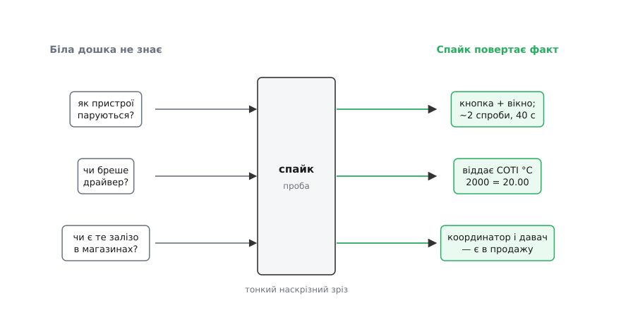
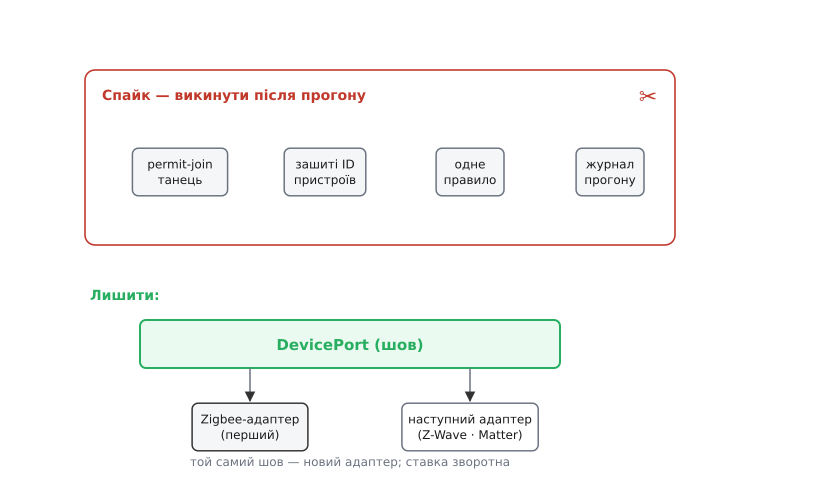

# ⚙️ Спайк на одне радіо: кістяк, що купує факт

Шов `DevicePort` зробив вибір радіо зворотним — але не сказав ані слова про те, з якого радіо стартувати **першим**. І це рішення не виграється за столом: скільки не малюй на дошці Zigbee проти Z-Wave, дошка мовчить про єдине, що справді коштує крові, — про **інтеграцію**. Списки характеристик, порівняльні таблички, обіцянки виробників — усе це можна годинами перекладати з місця на місце, а перший увімкнений давач за п'ять хвилин скаже більше, ніж тиждень таких таблиць.

Тож не сперечаймося — зробімо найдешевший дослід, який перетворює здогад на факт. Тонкий наскрізний зріз, [ходячий кістяк](book:programming/walking-skeleton), на одному-єдиному радіо: справжній давач температури → хаб через шов → одне правило → справжнє реле. Не повний продукт — сміховинно вбогий шлях, який проте **йде** сам від першого краю до останнього на живому залізі. У методі така проба зветься **спайк** (англ. *spike solution* — устромити пробу; термін з екстремального програмування, який увів Kent Beck наприкінці 1990-х на проєкті Chrysler C3). Метафора точна до букви: спайк — це цвях, увігнаний крізь колоду, **тонко, але наскрізь**; його завдання — пройти всю товщу в одному місці й одразу викинутися, лишивши знання. *(Походження терміна — усталений факт.)*

## Що саме ми купуємо

Спайк недарма коштує кількох годин — він купує рівно те, чого не видно з жодної білої дошки. Три невідомих, кожне з яких на дошці має вигляд «ну це ж очевидно», а на залізі виявляється зовсім іншим.


*Спайк — це проба, вбита крізь усю систему в одному місці. На вході — питання, на які дошка знизує плечима; на виході — числа, які можна записати й на які можна спертися.*

**Як пристрої насправді паруються.** На дошці «додати давач» — стрілочка. Наживо це танець: координатор треба ввести в режим, що приймає нових (permit-join), а сам давач — у режим приєднання, і зробити це часто означає затиснути кнопку на пів хвилини або п'ять разів вимкнути-ввімкнути живлення за схемою, яку вгадаєш не з першого разу. Далі йде **інтерв'ю** — координатор випитує в пристрою його endpoint'и й кластери, і воно то проходить з першого разу, то зривається, і пристрій «майже приєднався», але нічого не віддає. Скільки спроб, скільки секунд, чи взагалі приєднується та конкретна модель — жодна табличка цього не скаже.

**Чи не бреше драйвер.** Ось де спайк заробляє найбільше. Стандарт Zigbee віддає температуру не градусами, а атрибутом `measured_value` кластера Temperature Measurement — це знаковий `int16` у **сотих** частках градуса: `2000` означає 20.00 °C, а `−520` — мінус 5.2 °C. *(Одиниці кластера — стала специфікація ZCL: `int16`, крок 0.01 °C.)* Наївний драйвер, що віддасть сире `2000` як «двадцять тисяч градусів», не впаде й не поскаржиться — він просто тихо бреше на два порядки, і правило «холодно, якщо нижче 20» ніколи не спрацює. Такого мок не покаже **ніколи**: [підроблений драйвер v0 повертав чемне гладке число](root:progarch/dh-v0-one-sensor), бо ми самі його таким написали. Тільки справжній кремній видає справжні одиниці — і справжні пастки одиниць.

**Чи є те залізо в магазинах.** Найтихіше невідоме. Красивий стандарт на папері нічого не варт, якщо координатор під нього доводиться везти три тижні з-за океану, а давач знято з виробництва. Спайк змушує **купити конкретну коробку**, встромити її в USB і побачити ціну, наявність і те, чи взагалі воно живе. Це купівельне рішення, замасковане під технічне, — і зробити його дошкою неможливо.

> 🔧 **Навіщо це.** Перш ніж сперечатися, «яке радіо краще», спитай себе, які з твоїх аргументів ти взяв із живого прогону, а які — з чужого маркетингу. Майже завжди виявиться, що найгарячіші суперечки точаться саме навколо того, чого ніхто в кімнаті не міряв. Спайк — це спосіб замінити один такий аргумент фактом, і коштує він дешевше за саму нараду, на якій його немає чим підперти.

## Умова спайка

Тримаймо зріз безжально вузьким — уся його цінність у тому, щоб пройти наскрізь, а не щоб бути повним.

**Провести одне значення температури від справжнього Zigbee-давача крізь шов `DevicePort` до одного правила й далі на справжнє реле — на реальному координаторі, з реальним паруванням. Без бази, без черги, без другого протоколу, без інтерфейсу. Одне радіо, один давач, одне правило, одне реле.**

Мова тут — за доменом. Хаб-прототип розумного дому — це звичайне прикладне ПЗ на маленькому комп'ютері, і для нього чудово лягає високорівнева мова: не випадково [Home Assistant](https://www.home-assistant.io/integrations/zha/) — один із найпоширеніших відкритих хабів — написаний на Python, а його інтеграція з Zigbee (ZHA) стоїть на бібліотеці [zigpy](https://github.com/zigpy/zigpy). Тож основну пробу пишемо на Python: під нею жива, зріла бібліотека й прямий прецедент. Другою вкладкою — Go: якщо метиш не в прототип-хаб, а в компактний **edge-демон**, який окремим статичним бінарником поїде на саму залізяку, Go тут доречний. Побачимо заразом, що на краю ця дорога наразі значно горбкуватіша — і це теж факт, який купує спайк.

## Робочий код

Почнімо зі шва, який у нас уже є, — заради повноти проби повторимо його стисло. Далі — адаптер, у якому замкнене **все** знання про Zigbee, і сам прогін, що парує залізо й **міряє**. Дивіться, що тут справжнє: координатор — реальний USB-донгл, парування — реальне, драйвер — реальний. Вигадана лише відсутність усього іншого.

:::tabs
```python
import asyncio
from time import monotonic
from typing import Protocol

# ── Шов, який ми вже маємо: хаб говорить мовою DevicePort, а не мовою радіо. ──
class DevicePort(Protocol):
    async def read_temp(self, dev: str) -> float: ...          # °C
    async def set_relay(self, dev: str, on: bool) -> None: ...

# ── Усе правило хаба. Знає ЛИШЕ шов — жодного слова «Zigbee». Переживе спайк. ──
async def one_rule(port: DevicePort) -> None:
    if await port.read_temp("temp-1") < 20.0:
        await port.set_relay("heater-1", on=True)

# ── Адаптер: усе про Zigbee — ТІЛЬКИ тут. Помре спайк — а це зостанеться за швом. ──
# zigpy — той самий стек, що несе інтеграцію ZHA в Home Assistant (теж Python).
from bellows.zigbee.application import ControllerApplication   # bellows = Silicon Labs
import zigpy.types as t

ONOFF, TEMP, MEASURED = 0x0006, 0x0402, "measured_value"       # кластери/атрибут ZCL

class ZigbeeAdapter:
    def __init__(self, app: ControllerApplication):
        self._app = app
        self._ieee: dict[str, t.EUI64] = {}          # ім'я хаба → IEEE-адреса радіо

    def bind(self, name: str, ieee: str) -> None:    # шов ховає адресацію радіо
        self._ieee[name] = t.EUI64.convert(ieee)

    def _cluster(self, dev: str, cluster: int):
        node = self._app.devices[self._ieee[dev]]
        for ep_id, ep in node.endpoints.items():
            if ep_id != 0 and cluster in ep.in_clusters:   # ep 0 — ZDO, не прикладний
                return ep.in_clusters[cluster]
        raise LookupError(f"{dev}: кластер {cluster:#06x} не знайдено")

    async def read_temp(self, dev: str) -> float:
        ok, _ = await self._cluster(dev, TEMP).read_attributes([MEASURED])
        raw = ok[MEASURED]                           # напр. 1975 — а НЕ 19.75
        print(f"[драйвер] {dev}: сире={raw} → {raw / 100:.2f} °C")   # міряємо чесність
        return raw / 100.0                           # СОТІ °C → °C: робота адаптера

    async def set_relay(self, dev: str, on: bool) -> None:
        await self._cluster(dev, ONOFF).command(0x01 if on else 0x00)   # on / off


async def spike() -> None:
    # 1. Реальний координатор (USB-донгл). auto_form — сформувати мережу, як ще нема.
    app = ControllerApplication({"device": {"path": "/dev/ttyUSB0"},
                                 "database_path": "spike.db"})
    await app.startup(auto_form=True)
    port = ZigbeeAdapter(app)

    # 2. Парування — головне, чого не видно з дошки. Відчиняємо вікно, ЧЕКАЄМО ЗАЛІЗО.
    class OnJoin:
        def device_initialized(self, node):          # спрацьовує ПІСЛЯ інтерв'ю
            print(f"[парування] приєднався {node.ieee}, endpoint'ів: {len(node.endpoints) - 1}")
    app.add_listener(OnJoin())

    print("[спайк] вікно 60 с — тепер тисни кнопку парування НА ДАВАЧІ")
    t0 = monotonic()
    await app.permit(60)
    await asyncio.sleep(60)                           # даємо залізу час приєднатися
    print(f"[парування] у мережі {len(app.devices)} пристроїв за {monotonic() - t0:.0f} с")

    # 3. Людина звіряє, ЩО саме приєдналося, і в'яже дружні імена до IEEE-адрес.
    port.bind("temp-1",   "00:0d:6f:00:11:22:33:44")
    port.bind("heater-1", "00:0d:6f:00:aa:bb:cc:dd")

    # 4. Одне правило крізь шов — і заміряти актуатор: чи справді клацнуло реле.
    t1 = monotonic()
    await one_rule(port)
    print(f"[актуатор] команда on крізь шов за {(monotonic() - t1) * 1000:.0f} мс")

    # 5. Чи реле САМО звітує новий стан? Багато дешевих — мовчать; це теж факт.
    await asyncio.sleep(1)
    try:
        back, _ = await port._cluster("heater-1", ONOFF).read_attributes(["on_off"])
        print(f"[актуатор] реле звітує стан: {back['on_off']}")
    except Exception:
        print("[актуатор] реле НЕ звітує стан (дешеве реле) — правило працює всліпу")

    await app.shutdown()

asyncio.run(spike())
```
```go
package main

import (
	"context"
	"encoding/binary"
	"log"
	"time"

	"github.com/shimmeringbee/zigbee"
	"github.com/shimmeringbee/zstack"
)

// Той самий шов — але Go-демон на краю живе ПОДІЯМИ, не await'ами.
type DevicePort interface {
	SetRelay(ctx context.Context, dev string, on bool) error
	// читання температури приходить асинхронно, окремою подією — див. цикл нижче
}

const (
	clusterOnOff = 0x0006 // on=0x01, off=0x00
	clusterTemp  = 0x0402 // measured_value: int16, СОТІ °C (2000 = 20.00)
)

// Адаптер тримає стек і мапу «ім'я хаба → IEEE-адреса радіо». Усе про Zigbee — тут.
type ZigbeeAdapter struct {
	z    *zstack.ZStack
	ieee map[string]zigbee.IEEEAddress
	seq  byte
}

func (a *ZigbeeAdapter) SetRelay(ctx context.Context, dev string, on bool) error {
	cmd := byte(0x00) // off
	if on {
		cmd = 0x01 // on
	}
	a.seq++
	// ZCL-кадр складаємо майже вручну: [frame control 0x01 = cluster-specific | seq | cmd].
	// У молодого Go-стека ти ближче до дроту, ніж у zigpy — і це теж факт про край.
	frame := []byte{0x01, a.seq, cmd}
	return a.z.SendNodeMessage(ctx, a.ieee[dev], clusterOnOff, 1 /*src ep*/, 1 /*dst ep*/, frame)
}

func main() {
	ctx := context.Background()

	// 1. Реальний координатор (TI Z-Stack через shimmeringbee/zstack; API молодий).
	//    serialPort — відкритий /dev/ttyUSB0 (напр. github.com/tarm/serial).
	z := zstack.New(serialPort, nil)
	if err := z.Initialise(ctx, &zigbee.NetworkConfiguration{ /* канал, PAN ID, ключ */ }); err != nil {
		log.Fatal(err)
	}
	port := &ZigbeeAdapter{z: z, ieee: map[string]zigbee.IEEEAddress{}}

	// 2. Парування — відчиняємо вікно й КРУТИМО ЦИКЛ ПОДІЙ, чекаючи залізо.
	if err := z.PermitJoin(ctx, true); err != nil {
		log.Fatal(err)
	}
	log.Println("[спайк] вікно відчинено — тисни кнопку парування НА ДАВАЧІ")

	deadline := time.Now().Add(90 * time.Second)
	for time.Now().Before(deadline) {
		event, err := z.ReadEvent(ctx)
		if err != nil {
			log.Fatal(err)
		}
		switch e := event.(type) {

		case zigbee.NodeJoinEvent: // залізо приєдналося — те, чого дошка не покаже
			log.Printf("[парування] приєднався %v", e.Node.IEEEAddress)
			eps, _ := z.QueryNodeEndpoints(ctx, e.Node.IEEEAddress)
			log.Printf("[парування] endpoint'ів: %d", len(eps))
			port.ieee["temp-1"] = e.Node.IEEEAddress // (у спайку — руками)

		case zigbee.NodeIncomingMessageEvent: // звіт давача приходить СЮДИ
			m := e.IncomingMessage.ApplicationMessage
			if m.ClusterID == clusterTemp && len(m.Data) >= 2 {
				// zcl-пакет дав би measured_value як int16; тут — читаємо СИРІ 2 байти LE.
				raw := int16(binary.LittleEndian.Uint16(m.Data[len(m.Data)-2:]))
				log.Printf("[драйвер] сире=%d → %.2f °C", raw, float64(raw)/100) // чесність драйвера
				if float64(raw)/100 < 20.0 {          // одне правило — теж за швом
					_ = port.SetRelay(ctx, "temp-1", true)
				}
			}
		}
	}
	log.Println("[спайк] вікно 90 с вийшло — рахуємо, скільки приєдналось")
}
```
:::

Придивіться, де тут проходить межа справжнього. Правило `one_rule` — три рядки, і воно **ніколи не бачить Zigbee**: лише `read_temp` і `set_relay` крізь шов. Усе радіо замкнене в адаптері, і саме адаптер робить найважливіше — перекладає сирі соті градуса на °C (`raw / 100`). Це той рядок, у якому справжній драйвер міг би збрехати, і спайк його **друкує вголос**, щоб брехню було видно з першого прогону. Прогін `spike()` — навпаки, суцільна одноразова глина: він відчиняє permit-join, чекає живе залізо, руками вписує IEEE-адреси того, що приєдналося, і засипає консоль замірами. Ніщо з цього в продукт не поїде.

Go-вкладка показує ту саму нитку на краю — і одразу видно ціну вибору. Замість затишного `await cluster.read_attributes(...)` тут цикл подій: сам крутиш `ReadEvent`, сам ловиш `NodeJoinEvent` і `NodeIncomingMessageEvent`, сам вибираєш `int16` із сирих байтів. Стек [shimmeringbee/zstack](https://github.com/shimmeringbee/zstack) справжній і робочий, але його автори прямо позначають API як **нестабільний, на який ще не варто спиратися**. Оце вже не абстрактне «Go молодший за Python у розумному домі», а конкретний, заміряний факт — саме те, по що спайк і йшов.

## Що заміряти й записати

Спайк без записника — це не дослід, а просто програма, яку запустили. Уся цінність — у тому, що з прогону лишається **на папері**. Ось якою виходить консоль вдалого прогону на Python:

```
[спайк] вікно 60 с — тепер тисни кнопку парування НА ДАВАЧІ
[парування] приєднався 00:0d:6f:00:11:22:33:44, endpoint'ів: 1
[парування] приєднався 00:0d:6f:00:aa:bb:cc:dd, endpoint'ів: 1
[парування] у мережі 2 пристроїв за 41 с
[драйвер] temp-1: сире=1975 → 19.75 °C
[актуатор] команда on крізь шов за 214 мс
[актуатор] реле НЕ звітує стан (дешеве реле) — правило працює всліпу
```

Кожен рядок — це факт, якого вчора не було. Перепишімо їх у записник спайка — коротку табличку, що переживе сам код:

```
парування:   давач приєднався з 2-ї спроби, ~41 с у вікні; координатор — з першої
драйвер:     temp-1 віддав 1975 = 19.75 °C — одиниці СОТІ, конверсія в адаптері обов'язкова
актуатор:    реле клацає; затримка команди ~200 мс — для термостата з запасом
зворотний зв'язок: реле стан НЕ звітує — правило гріє всліпу, знадобиться опитування
залізо:      координатор ~$30, давач ~$12, реле ~$15 — усе було в наявності, приїхало за дні
```

Мірок рівно стільки, скільки треба, щоб рішення про радіо перестало бути суперечкою смаків. **Парування**: приєднується та модель узагалі, з якої спроби, скільки секунд у вікні. **Драйвер**: у яких одиницях віддає, чи збігається з очікуваним — і чи не доведеться під кожну модель писати окрему поправку. **Актуатор**: чи справді клацає реле, яка затримка команди. **Зворотний зв'язок**: чи звітує пристрій свій новий стан сам, чи правило працює наосліп. **Залізо**: ціна, наявність, строк доставки. П'ять рядків, і жоден із них не дістати з дошки.

> 🔧 **Навіщо це.** Найдорожча помилка спайка — прогнати його й не записати нічого, крім «ну, начебто працює». За тиждень ти вже не пам'ятаєш, чи давач приєднався з першої спроби, чи з десятої; чи затримка була 200 мс, чи дві секунди. Факт, який не записали, не куплений — гроші за нього заплачені, а знання випарувалося. Записник спайка — це і є та рента, заради якої весь дослід затівався.

## Викинути проти лишити

Тепер найтонший момент, у якому весь сенс. Спайк — **одноразовий**, і в цьому не поразка, а вся суть цвяха, увігнаного крізь колоду: пройшов товщу, лишив дірку-знання, витягнувся. Але «викинути спайк» не означає «викинути роботу». Викидається глина прогону; **шов лишається живим**.


*Помирає не робота, а ліси. Танець парування, зашиті IEEE-адреси, єдине правило, журнал прогону — усе це одноразове. А шов `DevicePort`, у який спайк заглянув першим клієнтом, лишається несучою балкою, і наступний адаптер стає в той самий слот.*

Розділімо по живому, що куди йде. **Викидається:** увесь `spike()` з його permit-join і `sleep(60)`; руками вписані IEEE-адреси; те, що правило смикає конкретно `heater-1`; друк замірів. Це ліси — вони тримали робітника, поки той клав цеглу, і зникають разом із його зміною. **Лишається:** інтерфейс `DevicePort` і сам `ZigbeeAdapter`, тепер уже перевірений на живому залізі. Перший стає першою робочою реалізацією шва в продукті; другий доводить, що шов правильної форми — крізь нього пройшла справжня температура й справжня команда, а не мок.

Ось чому спайк за швом безпечний, а спайк напряму — ні. Якби ми, женучи одне значення до реле, смикали Zigbee з самого правила, то, «щоб не переписувати двічі», лишили б цей код у продукті — і вибір радіо знову став би [однобічними дверима](book:programming/reversible-irreversible-decisions), тільки протягнутими крізь чорновий поспіх. Шов розриває цей шантаж: пробу можна писати як завгодно брудно, бо вона по свій бік межі й помре чистою смертю, а по інший бік лишається рівно те, що ти й хотів лишити, — тонкий інтерфейс, за яким сидить один перевірений адаптер і чекає слот під наступний.

## Де це ламається

Найгостріша пастка ховається в слові «працює». Спайк збирається, запускається, консоль не червона — і виникає спокуса поставити галочку «радіо перевірено». Але **зелена збірка — це не факт про інтеграцію**. Скомпілювалося — доводить, що ти правильно назвав функції; про те, чи паруються пристрої, чи не бреше драйвер, чи є залізо в магазинах, воно не каже нічого. Спайк, який виміряв лише сам себе, — змарновані години: усі важкі невідомі так і лишилися невідомими, тільки тепер під оманливою галочкою. Мірка вдалості спайка — не «запустилося», а **скільки рядків з'явилося в записнику**. Якщо жодного — проби не було, хоч би як гарно все компілювалося.

Друга пастка — протилежна за напрямком і однаково згубна: роздути шов, поки він ще й одного протоколу не довіз. Спайк на Zigbee спокушає «раз уже тут» відразу підкласти `ZWaveAdapter`, винести спільну фабрику драйверів, завести реєстр протоколів — збудувати мультипротокольний каркас під п'ять радіо «про всяк випадок». Це те саме [передчасне узагальнення](book:programming/dry-kiss-yagni), лише під прапором завбачливості. Шов має робити зворотною **одну** ставку, і рівно стільки коду, щоб замінити один адаптер, — ні краплі ширше. Другий адаптер пишуть тоді, коли другий протокол справді приходить, а не коли його уявили за столом. Абстракція, збудована на одному прикладі, майже завжди вгадує межу неправильно — і потім її дорожче виправляти, ніж було б написати з нуля під реальний другий випадок.

І третя, найтихіша: спайк, що не схотів помирати. Проба працює, шкода ж викидати — і одноразова глина непомітно вростає в продукт. Той `sleep(60)`, ті зашиті адреси, той друк у консоль лишаються «на часинку», а потім хтось будує на них наступну фічу, і ліси стають несучою стіною, якою вони ніколи не мали бути. Дисципліна тут проста, хоч і вимагає волі: щойно записник заповнено — прогін видаляють, лишаючи по свій бік шва тільки перевірений адаптер. Спайк цінний рівно доти, доки готовий померти; переживши свій дослід, він з інструмента пізнання перетворюється на борг.

Зведімо. Одне значення, проведене крізь усю товщу на живому залізі, купує три факти, недосяжні з дошки, — як паруються пристрої, чи чесний драйвер, чи є те залізо, — і робить це коштом кількох годин та кількох рядків у записнику. А що вся проба живе по один бік шва, ставка лишається зворотною: спайк помирає чистою смертю, `DevicePort` лишається несучою балкою, і наступний адаптер стає в готовий слот. Ось як «зібрати кістяк, щоб купити факт» виглядає на найтуманнішій ставці DH — не суперечкою за столом, а одним увімкненим давачем.
