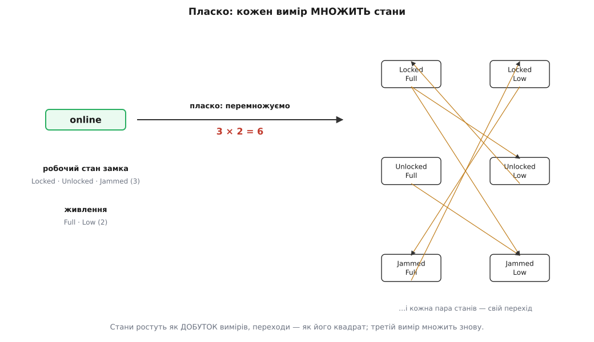

# 📜 Як приборкали вибух станів

У кроці-власнику ми змалювали життя пристрою пласким автоматом: чотири стани, жменя стрілок, усе вміщається на одній схемі. Поки станів чотири, кращого й не треба — око охоплює всю картину за секунду. Але погляньмо, що коїться, коли `online` перестає бути однією крапкою. Усередині нього замок замикається, відмикається й заклинює; поряд сідає батарея; радіозв'язок то зникає, то вертається. Під одним словом `online` вирує ціле окреме життя. І якщо вперто малювати його все тим самим пласким способом — виписувати кожну внутрішню комбінацію окремим станом, — схема набрякає, а стрілки сплітаються в клубок, крізь який уже нічого не видно.

Об цю саму стіну хтось колись ударився головою всерйоз — і не в розумному домі, а в кабіні бойового літака, восени 1982-го. Історія того, як стіну пробили, варта того, щоб її знати: ліки, знайдені для авіоніки винищувача, — це рівно ті ліки, яких потребує наш замок.

## Дві шафи специфікацій, яких ніхто не міг прочитати

Ізраїльський математик Девід Гарел (David Harel; нар. 1950 в Лондоні, з дитинства в Ізраїлі) 1979-го опублікував працю про мову з деревовидною логікою — «And/Or Programs». Її прочитав Йона Лаві (Jonah Lavi) — методолог з «Авіаційної промисловості Ізраїлю» (Israel Aircraft Industries, IAI), людина, чиїм фахом було вишукувати й приносити в компанію гідні інженерні методи та інструменти. Наприкінці 1982-го вони зустрілися. Гарел на той час уже два роки викладав в Інституті Вейцмана, а в авіоніці, за власним зізнанням, не тямив тоді нічого.

Лаві розповів про халепу, у якій загрузла команда, що будувала винищувач «Лаві» (Lavi; івритом לביא — «молодий лев»). Збіг імен чистий: літак назвали так само, як звався методолог, і Гарел окремо зауважує, що назва машини має «no connection with Jonah's surname» — жодного зв'язку з прізвищем Йони.

Щоб розібратися в пристрої системи, Гарел щочетверга приїздив до IAI: спершу до асистента Лаві, Іцхака Шая (Yitzhak Shai), потім до провідних інженерів авіоніки, серед яких були Аківа Каспі (Akiva Kaspi) та Їгаль Лівне (Yigal Livne). І ось що він побачив. Поведінка літака була записана у двотомній специфікації. На питання «що станеться, коли натиснути оцю кнопку?» хтось розгортав том А на сторінці 389, пункт 6.11.6.10, і зачитував відповідь. «А якщо тим часом інфрачервона ракета захопила наземну ціль?» — і вже хтось інший гортав том Б до сторінки 895, пункту 19.12.3.7. На п'ятому-шостому уточненні інженери переставали бути певні відповіді й дзвонили замовникові — військовим льотчикам. На восьмому-дев'ятому відповіді не мав уже й замовник.

Хто ж зрештою вирішував, що робить літак у складному збігу обставин? Часто — випадковий програміст десь у глибині коду, який, не відаючи того, ухвалював рішення про поведінку найвищої ваги. Спеціалісти назубок знали формулу, якою міряють відстань до цілі, — і не знали, як машина відповість на просту подію. Той самий хаос Гарел любить показувати на трьох рядках з іншої, цивільної специфікації хімічного заводу, де одну дрібку поведінки тричі описали в трьох далеких місцях троє різних людей. Третій припис — показати повідомлення, коли температура максимальна, хіба що на майданчику немає оператора, окрім випадків, коли T < 60° — сам Гарел, за його зізнанням, при всій освіті в математичній логіці так і не зумів зрозуміти. Специфікації «Лаві» були не кращі: довші, заплутаніші; деякі субпідрядники просто відмовлялися за ними працювати, називаючи їх незрозумілими, суперечливими й неповними.

Питання, що з цього постало, було не про кнопку й не про ракету. Воно було таке: як команді описати поведінку складної реактивної системи — інтуїтивно ясно й водночас математично строго? На нього Гарел і взявся відповісти.

## Чому одна велика машина станів не рятує

Одну річ він побачив одразу: інженери мислять станами й режимами. (Те саме кількома роками раніше помітив Девід Парнас (David Parnas), розбираючи авіоніку штурмовика A-7.) Вони раз у раз казали: «коли літак у режимі повітря–земля й натиснути оцю кнопку, він переходить у повітря–повітря — але тільки якщо радар не захопив наземну ціль». Будь-хто з інформатики впізнає тут [скінченний автомат](topic:math/finite-automata) — машину, що завжди сидить в одному зі скінченного набору станів і стрибає між ними лише дозволеними переходами за подіями.

Спокуса очевидна — намалювати один великий автомат на всю поведінку літака. Гарел спробував і побачив, чому це глухий кут. Причин дві, і друга важливіша за першу.

Перша: кількість станів росте вибухово. Кожен новий незалежний вимір поведінки не додається до наявних станів, а множить їх. Це той самий добуток, що чигав і на наш `online`:

```
робочий стан замка:   3   (Locked, Unlocked, Jammed)
живлення:             2   (Full, Low)
──────────────────────────────────────────
пласко, добутком:  3 × 2 = 6 станів
+ вимір на m значень:  × m  →  3 × 2 × m
```


*Поки виміри незалежні, пласкому автоматові доводиться тримати їхній добуток: шість станів там, де по суті три і два. Додайте радіоканал, тривоги, режим калібрування — і станів стає ще в кілька разів більше, а переходів між ними — як їхній квадрат.*

Друга причина глибша. Навіть якби станів було стерпно небагато, простий перелік їх усіх «пласко» — це купа без будови. Нема куди сховати подробицю, нема як згорнути споріднене докупи, нема поділу турбот. Велика пласка діаграма нічого не приховує й нічого не групує — і саме тому стає такою, що її годі прочитати. Гарел швидко переконався: потрібне не просто менше станів, а спосіб надати їм структуру — ієрархію.

## Три речі, дороблені до діаграми станів

Розв'язок Гарел виклав 1987-го у праці «Statecharts: A Visual Formalism for Complex Systems» (Science of Computer Programming, том 8, випуск 3, червень 1987, с. 231–274) — одній із найвпливовіших у програмній інженерії. Він не викинув скінченний автомат, а дороблив до звичайної діаграми станів рівно три речі.

**Ієрархія — вкладені стани.** Стан може містити інші стани. `online` тоді — не крапка, а оболонка, всередині якої живе свій маленький автомат робочого стану. Головна вигода — у стрілках: перехід, намальований від межі оболонки, спрацьовує з будь-якого внутрішнього стану. Одна стрілка `retire` веде з усього `online` назовні — і не треба тягти окрему стрілку від кожного під-стану. Гарел назвав це «покинь-будь-який-стан». Вкладеність — це логічне АБО, ще точніше виключне: у кожну мить активний рівно один із під-станів.

**Ортогональність — паралельні незалежні регіони.** Один стан можна поділити пунктирною рискою на кілька незалежних частин, кожна зі своїм автоматом, і всі вони живі водночас. Це — логічне І: система перебуває і тут, і там одночасно. Ось точні ліки від вибуху. Два незалежні виміри більше не перемножуються в один добуток станів, а лежать поряд двома нитками: замість 3 × 2 = 6 — 3 + 2 = 5, замість добутку — сума. Це рівно наші дві осі стану, покладені поряд і розділені однією рискою.

**Зв'язок через широкомовлення.** Регіони — не німі сусіди, вони чують одне одного. Подія, що сталася в одному регіоні, розноситься широко, і на неї може зреагувати перехід в іншому. Саме так одна подія «хаб утратив пристрій» водночас зрушує нитку життєвого циклу в `offline` і змушує нитку робочого стану позначити своє значення застарілим.

Цікаво, що корінь усіх трьох — та сама праця 1979 року про «And/Or Programs», з якої й почалося знайомство з Лаві: вкладеність — це «or», ортогональність — це «and». А саме слово «statecharts» Гарел просто скував: на той час це була єдина ще нічия сполука зі «state» чи «flow» та «chart» чи «diagram».

## Коли малюнок став самою специфікацією

Спершу ці картинки були лише милицею. Гарел писав поведінку текстом — таким собі структурованим діалектом «протоколів станів», що народжувався просто за столом, — а на берегах сторінки домальовував рамки й стрілки, щоб пояснити інженерам, що той текст означає. Текст був «справжньою» специфікацією, малюнок — підпоркою до нього.

Та за кілька тижнів сталося дивне: усі за столом почали розуміти саме ці серветкові діаграми, і суперечки про поведінку літака точилися вже над картинками, а не над текстом. Математик у Гарелі опирався — не може ж дряпанина бути кращою за строгий формальний запис. Але одного разу він таки зважився подумати: а що, як обернути картинки на саму мову — не доповнення до тексту, а заміну йому? Відтоді діаграми й стали специфікацією, а текст лишився хіба для дрібних приписів усередині станів. Перетворювати картинки на строгу мову довелося з дисципліною: жодної рисочки «бо гарно» — доки не задано її точний математичний зміст у будь-якому контексті, її просто не існує.

Що діаграма справді стала мовою, показав один випадок. До дошки, всуціль укритої станами й стрілками, підійшов льотчик-випробувач і спитав, що це. Йому пояснили: заокруглені прямокутники — стани, стрілки — переходи. Льотчик кілька хвилин мовчки вдивлявся, а тоді сказав: тут помилка, оця стрілка має вести не сюди, а туди. І мав рацію. Стороння людина, ніколи не бачивши формалізму, за дві хвилини вичитала з діаграми справжню ваду поведінки — краще годі й підтвердити, що спосіб знайдено правильний.

## Рівно наші дві осі

Тепер повернімося до нашого замка й побачмо, що біль, від якого ми потерпали, знімають рівно ці три речі.


*Той самий пристрій мовою Гареля: `online` — над-стан (ієрархія), усередині — дві незалежні нитки за пунктиром (ортогональність). Робочий стан і живлення описані окремо, 3 + 2, а не 3 × 2; вхід `commission()` і вихід `retire()` — одні на весь блок, бо ведуть від його межі.*

Коли `online` почне розпадатися на під-стани — а він почне, щойно всередині заведеться справжня робота, — ієрархія дає йому стати над-станом, не чіпаючи зовнішнього життєвого циклу. Стрілки `commission`, `markOffline`, `retire` й далі ведуть від межі `online`, байдуже, що діється всередині: над-стан ховає свою кухню, як ми й хотіли.

Дві осі, що ми насилу розводили руками, — життєвий цикл і робочий стан — це в точності ортогональні регіони Гареля. Ми казали «осі незалежні, тому їх не можна мішати в один перелік»; він дав цьому формалізм і риску на діаграмі. І там, де ми боялися перемноження, ортогональність рятує сумою: додати замкові третій вимір (скажімо, стан радіоканалу) — це ще одна нитка поряд, +1 регіон, а не помножений на все добуток.

А широкомовлення — це наше давнє питання про `offline` й «останнє відоме значення». Подія «хаб замовк» розноситься по обох нитках одразу: вісь життя йде в `offline`, а робочий стан тим часом чесно позначає, що його число, може, вже несвіже. Те саме `Unknown`, що ми лишили в `LockState`, — це реакція однієї нитки на подію в сусідній. Виходить, наш скромний автомат уже був крихітним статечартом; ми просто не знали цього імені.

## Що з цього виросло

Гарел не спинився на теорії. Ще у квітні 1984-го він разом із братами Ідо та Хагі Лаховерами (Ido, Hagi Lachover) і Аміром Пнуелі (Amir Pnueli; згодом лауреат премії Тюрінга) заснував фірму, згодом (1987) названу i-Logix, і до 1986-го вони збудували Statemate — інструмент, що не просто малював статечарти, а виконував їх. Ідея, що діаграма сама є програмою, яку можна прогнати, народилася вже тоді.

Далі статечарти розійшлися по всій царині. Вони ввійшли до стандарту UML як мова машин станів — і досі це найпоширеніший спосіб малювати поведінку об'єкта. W3C 2015-го затвердив SCXML (State Chart XML) — переносний, машинний запис тих самих статечартів. А у світі фронтенду бібліотека XState Девіда Хуршида (David Khourshid) принесла ті самі вкладені й ортогональні стани в TypeScript, майже слово в слово за Гарелем. Усе це — прямі нащадки тих серветкових діаграм 1982 року.

Історія має гіркий і промовистий епілог. Сам винищувач «Лаві» так і не став у стрій: перший прототип піднявся в повітря 31 грудня 1986-го, а вже 30 серпня 1987-го уряд Ізраїлю голосуванням 12 проти 11 закрив програму — надто дорого. Того самого 1987-го вийшла Гарелева стаття. Літак, задля якого народився формалізм, списали — а формалізм пережив його на десятиліття й нині стоїть за машинами станів по всьому софті. Це вже не легенда й не переказ: увесь тут перебіг — усталений і задокументований самим Гарелем. І фундамент його той самий, що ми заклали своїм чотиристановим автоматом: статечарт лише дає йому будову, щоб він витримав справжню складність, не розсипавшись на клубок.
