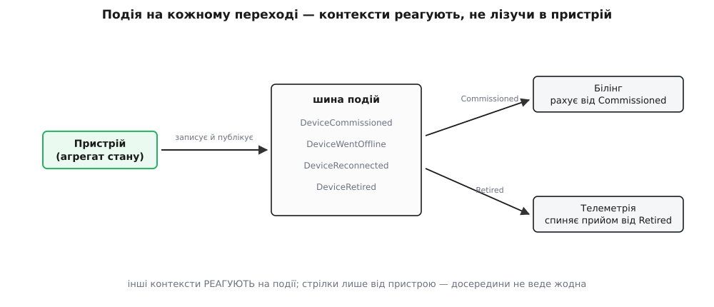
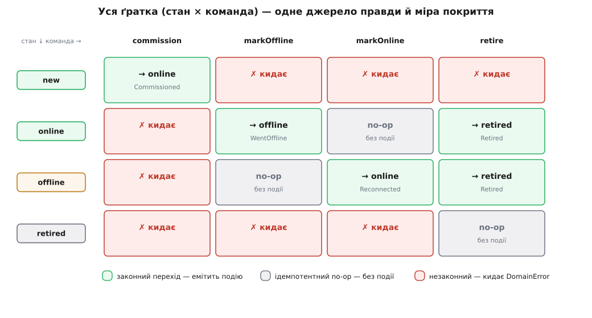

# ⚙️ Робочий автомат життєвого циклу: таблиця, події, повне покриття

Ми вже маємо чотири стани пристрою — `new → online → offline → retired` — і вартових, зашитих у методи `commission`/`markOffline`/`markOnline`/`retire`. Цього досить, щоб некоректну стадію стало нема як записати. Але від «досить» до «робоче» лишилося три речі, і кожна з них — не окраса, а те, без чого автомат не житиме в справжній системі.

Перша: правило переходу знову розтеклося — тепер по тілах чотирьох методів, і додати п'ятий стан означає обійти всі чотири. Ми піднімемо всю карту дозволеного в **одну таблицю** й змусимо кожну команду бути тонкою обгорткою над нею. Друга: пристрій живе не сам. Коли його вводять у дім, білінг має почати рахунок; коли списують — телеметрія мусить спинити прийом показів. Найгірше, що можна тут зробити, — дозволити білінгу й телеметрії **лізти в пристрій** і питати його стан. Натомість на **кожному переході** пристрій емітить доменну подію, і сусіди реагують на неї, не торкаючись пристрою. Третя: ми пообіцяли, що незаконний перехід кидає. Обіцянку треба **довести** — тестом, що параметрично пробіжить **усі** пари (стан × команда) й перевірить кожну клітину ґратки. Зберімо все це в один робочий агрегат.

## Ідея: таблиця жене вартових, вартові емітять події

Три рухи складаються в один механізм. Таблиця `TRANSITIONS` — єдине джерело правди: `(стан, команда) → новий стан`, і чого в ній нема, те заборонено. Кожна команда-метод не повторює правил — вона кличе одне спільне ядро `apply`, яке дивиться в таблицю, кидає на незаконному й **на кожному реальному переході** дописує доменну подію у внутрішній список. А тест бере ту саму таблицю за оракула й проходить нею всю ґратку 4 × 4, доводячи, що пристрій поводиться рівно так, як таблиця обіцяє. Одне джерело правди живить і поведінку, і подію, і перевірку — тож розійтися їм нема де.

## Агрегат: одна таблиця, команди над нею, подія на кожному переході

Ось повний [агрегат](book:programming/aggregates-consistency) — корінь, що тримає власний інваріант життєвого циклу. Придивіться, як мало важать самі команди: уся їхня робота — назвати команду й спорядити подію; закон переходу лежить у таблиці, а механіка «перевір → перейди → запиши подію» — в одному `apply`.

:::tabs
```ts
// device-lifecycle.ts — АГРЕГАТ життєвого циклу. Стан, таблиця й події — в одному місці.
export type DeviceStatus = "new" | "online" | "offline" | "retired";
export type Command = "commission" | "markOffline" | "markOnline" | "retire";

// ── Єдине джерело правди: (стан, команда) → новий стан. Лише переходи, що МІНЯЮТЬ стан.
const TRANSITIONS: ReadonlyMap<string, DeviceStatus> = new Map([
  ["new|commission",     "online"],
  ["online|markOffline", "offline"],
  ["offline|markOnline", "online"],
  ["online|retire",      "retired"],
  ["offline|retire",     "retired"],
]);

// «Уже в цільовому стані» → тихий no-op (без переходу й БЕЗ події).
// commission СЮДИ не входить: другий commission — це помилка, а не повтор.
const IDEMPOTENT: ReadonlyMap<Command, DeviceStatus> = new Map([
  ["markOffline", "offline"],
  ["markOnline",  "online"],
  ["retire",      "retired"],
]);
const key = (s: DeviceStatus, c: Command) => `${s}|${c}`;

// ── Доменні події — незмінні факти «щось СТАЛОСЯ», сформульовані мовою дому.
export type DomainEvent =
  | { kind: "DeviceCommissioned"; deviceId: string; homeId: string; at: number }
  | { kind: "DeviceWentOffline";  deviceId: string; at: number }
  | { kind: "DeviceReconnected";  deviceId: string; at: number }
  | { kind: "DeviceRetired";      deviceId: string; at: number };

export class DomainError extends Error {}

export class Device {
  private status: DeviceStatus = "new";
  private homeId: string | null = null;
  private readonly events: DomainEvent[] = [];      // зібрані, ще не опубліковані

  constructor(readonly id: string) {}

  // Ядро: єдиний прохід крізь таблицю. Тут і вартовий, і запис події.
  // make() будує подію ЛИШЕ при реальному переході — для no-op не викликається.
  private apply(cmd: Command, make: () => DomainEvent): void {
    if (IDEMPOTENT.get(cmd) === this.status) return;          // уже там — тихо, без події
    const next = TRANSITIONS.get(key(this.status, cmd));
    if (next === undefined)
      throw new DomainError(`з «${this.status}» команда «${cmd}» неможлива`);
    this.status = next;
    this.events.push(make());                                 // подія на КОЖНОМУ переході
  }

  commission(homeId: string, at = Date.now()): void {
    this.apply("commission",
      () => ({ kind: "DeviceCommissioned", deviceId: this.id, homeId, at }));
    this.homeId = homeId;                             // досяжне лише при реальному переході
  }
  markOffline(at = Date.now()): void {
    this.apply("markOffline", () => ({ kind: "DeviceWentOffline", deviceId: this.id, at }));
  }
  markOnline(at = Date.now()): void {
    this.apply("markOnline", () => ({ kind: "DeviceReconnected", deviceId: this.id, at }));
  }
  retire(at = Date.now()): void {
    this.apply("retire", () => ({ kind: "DeviceRetired", deviceId: this.id, at }));
  }

  get state(): DeviceStatus { return this.status; }
  pullEvents(): DomainEvent[] { return this.events.splice(0); }  // забрати й спорожнити
}
```
```py
# device_lifecycle.py — АГРЕГАТ життєвого циклу. Стан, таблиця й події — в одному місці.
from dataclasses import dataclass
from enum import Enum
import time

class Status(str, Enum):
    NEW = "new"; ONLINE = "online"; OFFLINE = "offline"; RETIRED = "retired"

COMMANDS = ("commission", "markOffline", "markOnline", "retire")

# Єдине джерело правди: (стан, команда) → новий стан. Лише переходи, що МІНЯЮТЬ стан.
TRANSITIONS = {
    (Status.NEW,     "commission"):  Status.ONLINE,
    (Status.ONLINE,  "markOffline"): Status.OFFLINE,
    (Status.OFFLINE, "markOnline"):  Status.ONLINE,
    (Status.ONLINE,  "retire"):      Status.RETIRED,
    (Status.OFFLINE, "retire"):      Status.RETIRED,
}
# «Уже в цільовому стані» → тихий no-op. commission сюди НЕ входить.
IDEMPOTENT = {
    "markOffline": Status.OFFLINE,
    "markOnline":  Status.ONLINE,
    "retire":      Status.RETIRED,
}

class DomainError(Exception): ...

# Доменні події — незмінні факти «щось СТАЛОСЯ».
@dataclass(frozen=True)
class DeviceCommissioned: device_id: str; home_id: str; at: float
@dataclass(frozen=True)
class DeviceWentOffline:  device_id: str; at: float
@dataclass(frozen=True)
class DeviceReconnected:  device_id: str; at: float
@dataclass(frozen=True)
class DeviceRetired:      device_id: str; at: float

class Device:
    def __init__(self, device_id: str):
        self.id = device_id
        self._status = Status.NEW
        self._home_id = None
        self._events = []                            # зібрані, ще не опубліковані

    # Ядро: єдиний прохід крізь таблицю. Вартовий + запис події.
    def _apply(self, cmd, make):
        if IDEMPOTENT.get(cmd) == self._status:      # уже там — тихо, без події
            return
        nxt = TRANSITIONS.get((self._status, cmd))
        if nxt is None:
            raise DomainError(f"з «{self._status.value}» команда «{cmd}» неможлива")
        self._status = nxt
        self._events.append(make())                  # подія на КОЖНОМУ переході

    def commission(self, home_id, at=None):
        at = time.time() if at is None else at
        self._apply("commission", lambda: DeviceCommissioned(self.id, home_id, at))
        self._home_id = home_id                      # досяжне лише при реальному переході

    def mark_offline(self, at=None):
        at = time.time() if at is None else at
        self._apply("markOffline", lambda: DeviceWentOffline(self.id, at))

    def mark_online(self, at=None):
        at = time.time() if at is None else at
        self._apply("markOnline", lambda: DeviceReconnected(self.id, at))

    def retire(self, at=None):
        at = time.time() if at is None else at
        self._apply("retire", lambda: DeviceRetired(self.id, at))

    @property
    def state(self): return self._status
    def pull_events(self):
        out, self._events = self._events, []         # забрати й спорожнити
        return out
```
:::

Спинімося на найтоншій деталі — на порядку двох перевірок усередині `apply`. Ідемпотентний no-op звірено **першим**, ще до таблиці: якщо команда з тих, що «уже в цільовому стані нічого не роблять», і пристрій саме там, ми мовчки виходимо — не міняючи стану й **не пишучи події**. Лише коли це не no-op, дивимося в таблицю: є рядок — переходимо й дописуємо подію, немає — кидаємо. Чому `commission` навмисно **не** серед ідемпотентних? Бо повторно ввести в дім уже введений пристрій — не безневинний повтор, а помилка, яку варто побачити; тож для нього no-op-гілки нема, і другий `commission` чесно кидає. Ця асиметрія — не недогляд, а рішення дому, записане одним рядком таблиці `IDEMPOTENT`.

І зверніть увагу, чого пристрій **не** робить: він нікого не викликає. Він лише **записує** подію в свій список — `events`/`_events` — і віддає її назовні через `pullEvents`. Це не дрібниця стилю, а вимога коректності, до якої ми ще повернемося в пастках: агрегат породжує факт, а розсилає його вже інфраструктура — після того, як стан надійно збережено.

## Події летять назовні — контексти реагують, не лізучи в пристрій

Тепер друга обіцянка з початку. Пристрій виклав події; хтось має рознести їх [іншим контекстам](root:progarch/dh-contexts-map) — білінгу й телеметрії. Робить це тонкий шар застосунку: після кожної операції він зливає події з пристрою й публікує на шину, а контексти-передплатники реагують. Пристрій про них не знає — і в цьому вся сила.

:::tabs
```ts
// app: після операції злити події й розіслати. Пристрій НЕ знає про підписників.
type Handler = (e: DomainEvent) => void;

class EventBus {
  private handlers: Handler[] = [];
  subscribe(h: Handler) { this.handlers.push(h); }
  publish(events: DomainEvent[]) {
    for (const e of events) for (const h of this.handlers) h(e);
  }
}

// Контекст білінгу: пристрій «активний» від commission до retire — за це й рахунок.
class Billing {
  active = new Set<string>();
  on = (e: DomainEvent) => {
    if (e.kind === "DeviceCommissioned") this.active.add(e.deviceId);
    if (e.kind === "DeviceRetired")      this.active.delete(e.deviceId);
  };
}
// Контекст телеметрії: приймає покази, поки пристрій не списаний.
class Telemetry {
  accepting = new Set<string>();
  on = (e: DomainEvent) => {
    if (e.kind === "DeviceCommissioned") this.accepting.add(e.deviceId);
    if (e.kind === "DeviceRetired")      this.accepting.delete(e.deviceId);
  };
}

const bus = new EventBus();
const billing = new Billing(), telemetry = new Telemetry();
bus.subscribe(billing.on); bus.subscribe(telemetry.on);

const d = new Device("lock-42");
d.commission("home-7"); bus.publish(d.pullEvents());  // білінг +1, телеметрія приймає
d.markOffline();        bus.publish(d.pullEvents());  // телеметрія ДОСІ приймає: offline ≠ retired
d.retire();             bus.publish(d.pullEvents());  // білінг −1, телеметрія глушить прийом
```
```py
# app: після операції злити події й розіслати. Пристрій НЕ знає про підписників.
class EventBus:
    def __init__(self): self._handlers = []
    def subscribe(self, h): self._handlers.append(h)
    def publish(self, events):
        for e in events:
            for h in self._handlers:
                h(e)

class Billing:                                  # активний від commission до retire
    def __init__(self): self.active = set()
    def on(self, e):
        if isinstance(e, DeviceCommissioned): self.active.add(e.device_id)
        elif isinstance(e, DeviceRetired):    self.active.discard(e.device_id)

class Telemetry:                                # приймає покази, поки не списаний
    def __init__(self): self.accepting = set()
    def on(self, e):
        if isinstance(e, DeviceCommissioned): self.accepting.add(e.device_id)
        elif isinstance(e, DeviceRetired):    self.accepting.discard(e.device_id)

bus = EventBus()
billing, telemetry = Billing(), Telemetry()
bus.subscribe(billing.on); bus.subscribe(telemetry.on)

d = Device("lock-42")
d.commission("home-7"); bus.publish(d.pull_events())  # білінг +1, телеметрія приймає
d.mark_offline();       bus.publish(d.pull_events())  # телеметрія ДОСІ приймає: offline ≠ retired
d.retire();             bus.publish(d.pull_events())  # білінг −1, телеметрія глушить прийом
```
:::


*Подія на кожному переході — і сусідні контексти реагують, не торкаючись пристрою. Білінг рахує активні від `DeviceCommissioned` до `DeviceRetired`, телеметрія глушить прийом на `DeviceRetired`. Стрілки йдуть лише назовні: пристрій нікого не кличе, його ніхто не смикає.*

Придивіться до середнього рядка прикладу — він тихо доводить, що ми правильно розвели дві осі стану. `markOffline` шле `DeviceWentOffline`, але **не** `DeviceRetired`, і телеметрія далі приймає покази: `offline` — це «мовчить, але наш», а не «нема назавжди». Якби ці два стани зшити в один, розрядкою батарейки телеметрія б назавжди відвернулася від живого замка. Автомат не дає їх сплутати, і подія несе саме той факт, що стався, — ні на йоту більший.

> 🔧 **Навіщо це.** Спокуса зробити «простіше» звучить так: хай білінг сам питає в пристрою `device.status === "online"`, коли треба. Але тоді білінг **знає** внутрішній устрій пристрою, телеметрія знає його теж, і кожен новий контекст додає ще одну нитку, що тягнеться пристроєві в нутро. Змінив стани — полагодь усіх, хто в них зазирав. Подія розвертає залежність: пристрій оголошує **факт** мовою дому («пристрій списано»), а хто і як на нього реагує — клопіт слухачів, пристрій про них не чув. Саме тому доменну подію [винесли в окремий тактичний прийом DDD](book:programming/domain-driven-design) — щоправда, не одразу: у синій книзі Еванса (2003) її як патерна ще нема; розробив і вписав її у щоденний набір Вон Вернон у «Implementing Domain-Driven Design» (2013), а сам Еванс дописав патерн згодом. Це задокументована, узгоджена історія.

## Уся ґратка як тест: покриття всіх переходів

Ми пообіцяли доказ. Ось він — тест, що не вибирає кілька «цікавих» випадків, а бере **всю** ґратку: чотири стани на чотири команди, шістнадцять клітин, жодної повз. Кожну клітину заздалегідь видно на карті.


*Уся ґратка (стан × команда) — водночас джерело правди й міра покриття. Зелених клітин п'ять (законні переходи, кожен з подією), сірих три (ідемпотентні no-op, без події), червоних вісім (кидають). Тест мусить торкнутися кожної.*

Порахуймо, щоб знати, скільки саме перевірок винні:

```
стани × команди = 4 × 4 = 16 пар — уся ґратка
  законних переходів (є в таблиці):        5   → рівно одна подія кожен
  ідемпотентних no-op (уже в цілі):        3   online·markOnline, offline·markOffline, retired·retire
  незаконних (кидають DomainError):        8   → жодної події, стан незмінний
                                          ──
                                          16   — жодної не пропущено
```

У теорії тестування автоматів це зветься **покриттям усіх переходів** (англ. *all-transitions*, воно ж *0-switch coverage* у сходинці switch-покриття, що виросла з праці Цуна Чоу про тестування скінченних автоматів, 1978) — settled-термінологія, не наша вигадка. Ось цей обхід у коді; параметр — сама пара, а очікування на кожну пару виводимо з тих самих двох таблиць:

:::tabs
```ts
// all-transitions.test.ts — пробігає ВСІ 4×4 пари й доводить: незаконна кидає,
// законна веде РІВНО в очікуваний стан з однією подією, no-op — тихий і без події.
import assert from "node:assert/strict";

const STATES: DeviceStatus[] = ["new", "online", "offline", "retired"];
const CMDS: Command[] = ["commission", "markOffline", "markOnline", "retire"];

// Привести свіжий пристрій у заданий стан ЛИШЕ законними командами.
function deviceIn(s: DeviceStatus): Device {
  const d = new Device("dut");                              // dut — device under test
  if (s !== "new") d.commission("home-1");
  if (s === "offline" || s === "retired") d.markOffline();
  if (s === "retired") d.retire();
  return d;
}
function invoke(d: Device, c: Command): void {
  switch (c) {
    case "commission":  return d.commission("home-9");
    case "markOffline": return d.markOffline();
    case "markOnline":  return d.markOnline();
    case "retire":      return d.retire();
  }
}

for (const s of STATES) for (const c of CMDS) {
  const legal = TRANSITIONS.get(key(s, c));                 // очікуваний перехід або undefined
  const noop  = IDEMPOTENT.get(c) === s;                    // ідемпотентний повтор?
  const d = deviceIn(s);
  d.pullEvents();                                           // відкинути події налаштування

  if (legal !== undefined) {
    invoke(d, c);
    assert.equal(d.state, legal, `${s}×${c}: мав перейти в ${legal}`);
    assert.equal(d.pullEvents().length, 1, `${s}×${c}: рівно одна подія на перехід`);
  } else if (noop) {
    invoke(d, c);
    assert.equal(d.state, s, `${s}×${c}: no-op не міняє стан`);
    assert.equal(d.pullEvents().length, 0, `${s}×${c}: no-op не емітить події`);
  } else {
    assert.throws(() => invoke(d, c), DomainError, `${s}×${c}: мав кинути`);
    assert.equal(d.state, s, `${s}×${c}: після кидка стан незмінний`);
    assert.equal(d.pullEvents().length, 0, `${s}×${c}: збій не лишає події`);
  }
}
console.log(`покрито ${STATES.length * CMDS.length} пар (стан × команда) ✓`);

// ── Золоті випадки: намір дому, записаний НЕЗАЛЕЖНО від таблиці (див. пастки).
assert.throws(() => new Device("x").retire(), DomainError);         // невведений не списують
{ const d = deviceIn("retired"); assert.throws(() => d.markOnline(), DomainError); }  // мертвий не оживе
{ const d = deviceIn("online"); d.pullEvents(); d.markOnline();      // повтор online
  assert.equal(d.pullEvents().length, 0); }                         // no-op не спамить Reconnected
```
```py
# all_transitions_test.py — пробігає ВСІ 4×4 пари й доводить те саме, що TS-версія.
STATES = [Status.NEW, Status.ONLINE, Status.OFFLINE, Status.RETIRED]

def device_in(s):                                # привести у стан лише законним шляхом
    d = Device("dut")
    if s is not Status.NEW:                     d.commission("home-1")
    if s in (Status.OFFLINE, Status.RETIRED):   d.mark_offline()
    if s is Status.RETIRED:                     d.retire()
    return d

INVOKE = {
    "commission":  lambda d: d.commission("home-9"),
    "markOffline": lambda d: d.mark_offline(),
    "markOnline":  lambda d: d.mark_online(),
    "retire":      lambda d: d.retire(),
}

def test_all_transitions():
    for s in STATES:
        for c in COMMANDS:
            legal = TRANSITIONS.get((s, c))       # очікуваний перехід або None
            noop = IDEMPOTENT.get(c) == s         # ідемпотентний повтор?
            d = device_in(s); d.pull_events()     # відкинути події налаштування
            if legal is not None:
                INVOKE[c](d)
                assert d.state is legal, f"{s.value}×{c}: мав перейти в {legal.value}"
                assert len(d.pull_events()) == 1, f"{s.value}×{c}: рівно одна подія"
            elif noop:
                INVOKE[c](d)
                assert d.state is s, f"{s.value}×{c}: no-op не міняє стан"
                assert d.pull_events() == [], f"{s.value}×{c}: no-op без події"
            else:
                try:
                    INVOKE[c](d); assert False, f"{s.value}×{c}: мав кинути"
                except DomainError:
                    pass
                assert d.state is s, f"{s.value}×{c}: стан незмінний після кидка"
                assert d.pull_events() == [], f"{s.value}×{c}: збій без події"

def test_golden_intent():                         # намір дому — НЕЗАЛЕЖНО від таблиці
    try: Device("x").retire(); assert False
    except DomainError: pass                      # невведений не списують
    r = device_in(Status.RETIRED)
    try: r.mark_online(); assert False
    except DomainError: pass                      # мертвий не оживе
    o = device_in(Status.ONLINE); o.pull_events()
    o.mark_online()
    assert o.pull_events() == []                  # повтор online — no-op, без Reconnected

if __name__ == "__main__":
    test_all_transitions(); test_golden_intent()
    print(f"покрито {len(STATES) * len(COMMANDS)} пар (стан × команда) ✓")
```
:::

Один цикл із подвійним `for` замінив шістнадцять окремих тестів — і, що важливіше, **не дасть забути** жодної клітини: додаси стан `quarantined` — ґратка сама роздується до 5 × 4, і кожна нова пара мусить лягти в одну з трьох гілок. Тест доводить три речі за раз: законний перехід веде рівно куди слід і лишає **рівно одну** подію; ідемпотентний повтор мовчить і події не породжує; незаконна пара кидає, а стан по кидку **не зрушив** ні на крок. Остання перевірка — не зайва причепа: команда, що кидає вже **після** того, як зіпсувала стан, — гірша за ту, що просто забороняє.

> 🔧 **Навіщо це.** Свіп по всій ґратці ловить не той баг, що ти передбачив, а той, що проґавив. Руками пишуть тести на переходи, які **спали на думку**; забута пара — саме та, про яку ніхто не подумав, бо вона «очевидно неможлива». Параметричний обхід не має упереджень: він однаково суворо питає в кожної з шістнадцяти клітин, і `retired × markOnline`, про яку легко забути, отримує ту саму перевірку, що й щоденний `online × markOffline`.

## Ендшпіль: незаконний перехід, що не компілюється

Усе дотепер ловить незаконний перехід у **рантаймі** — `apply` кидає, коли пара не з таблиці. Можна піти на крок далі й зробити так, щоб незаконну послідовність не можна було навіть **зібрати**: закодувати стан у самому типі хендла — і тоді `mark_online` на списаному пристрої не «кине», а не існуватиме як виклик. Прийом зветься **типостан**; його механіку — фантомні типи, афінне переміщення, чому в Rust гарантія повна, а в мовах без власності слабша — розібрано [окремо, до дна](book:programming/type-driven-design/proj-typestate-machine.md), і переказувати її тут не будемо. Покажемо лише, як лягає наш власний автомат дому.

```rust
// Стани — типи-маркери; хендл параметризований станом. Даних стану тут не тримаємо.
use std::marker::PhantomData;
struct New; struct Online; struct Offline; struct Retired;

struct Device<S> { id: String, home: Option<String>, _s: PhantomData<S> }

impl Device<New> {
    fn unpack(id: &str) -> Device<New> {
        Device { id: id.into(), home: None, _s: PhantomData }
    }
    fn commission(self, home: &str) -> Device<Online> {         // new → online
        Device { id: self.id, home: Some(home.into()), _s: PhantomData }
    }
}
impl Device<Online> {
    fn mark_offline(self) -> Device<Offline> { self.retag() }   // online → offline
    fn retire(self)       -> Device<Retired> { self.retag() }   // online → retired
}
impl Device<Offline> {
    fn mark_online(self) -> Device<Online>  { self.retag() }    // offline → online
    fn retire(self)      -> Device<Retired> { self.retag() }    // offline → retired
}
// Device<Retired> не має ЖОДНОГО методу — кінець, забезпечений компілятором.

impl<S> Device<S> {                          // приватний помічник; НЕ pub — це замок
    fn retag<T>(self) -> Device<T> {
        Device { id: self.id, home: self.home, _s: PhantomData }
    }
}
```

Тепер спроби зламати автомат ловить не наш `if`, а `rustc`, і двома різними помилками:

```rust
let d = Device::<New>::unpack("lock-42");
let online = d.commission("home-7");   // New → Online; d ПЕРЕМІЩЕНО в online
// d.commission("home-7");             // E0382: use of moved value `d` — старий хендл спожито
let off = online.mark_offline();       // Online → Offline
// online.retire();                    // E0382: online уже спожито mark_offline
let dead = off.retire();               // Offline → Retired
// dead.mark_online();                 // E0599: у Device<Retired> НЕМАЄ методу mark_online
// Device::<New>::unpack("z").retire();// E0599: у Device<New> НЕМАЄ retire (новий не списують)
```

Дві помилки стережуть автомат із різних боків. `E0599` (*no method*) — це «команда **не існує** в цьому стані»: `retire` на `New`, `mark_online` на `Retired`. Кінцевий стан `Retired` не має жодного методу — тому з нього фізично нема куди піти, незворотність вбудована в тип. `E0382` (*use of moved value*) — це «старий хендл **спожито** переходом»: кожен перехід бере `self` за значенням, тож повернутися до попереднього стану нема чим. Рантайм-таблиця ловила ту саму заборону пізніше й м'якше — винятком; типостан ловить її **раніше й жорсткіше** — відмовою зібратися. Ціну й межу цього вибору (вибух підписів, стан лише статичний, слабша гарантія без афінних типів) винесено в той-таки [розбір типостану](book:programming/type-driven-design/proj-typestate-machine.md); тут головне побачити, що наш чотиристановий автомат дому вкладається в типи один в один.

## Складність і пастки

Механізм зібрано й доведено — але кожен його шов має гострий край, і три з них ранять глибше за інші.

**Забути ідемпотентний no-op — і система захлинеться на власному серцебитті.** Найспокусливіше «спрощення» — пустити **всі** команди однаково крізь таблицю, без окремої гілки no-op: нема рядка `(online, markOnline)` → кидай. І воно навіть здається чистішим. Аж поки в дім не прийде реальність: хаб чує пристрій щосекунди й на кожен «пульс» кличе `markOnline`, підтверджуючи зв'язок. Пристрій уже `online` — і кожен пульс тепер **кидає** `DomainError`, лог тоне в помилках, а якийсь нещасний `try` десь нагорі, злякавшись, переводить пристрій у `offline`. No-op — не поблажливість, а визнання, що в житті команда «лишайся як є» приходить постійно й мусить бути тихою. І дзеркальна половина тієї ж пастки: якщо no-op таки пропустити крізь `apply` **з** емісією події, кожен пульс породить `DeviceReconnected`, шина захлинеться, а білінг із телеметрією діятимуть на сотні фальшивих «повернень». Тому перевірка no-op стоїть **першою** й виходить **без** події: повтор у той самий стан — не подія, бо нічого не сталося.

**Емітувати подію до того, як стан збережено, — брехня, яку вже не відкликати.** Наш пристрій навмисно **записує** події в список, а не шле їх на шину зсередини `retire`. Спокуса зробити навпаки — «хай `retire` одразу публікує `DeviceRetired`» — руйнівна там, де є база. Уяви: `retire` синхронно шле подію, телеметрія на неї глушить прийом, — а транзакція, що мала зберегти новий стан, відкочується (конфлікт, збій диска). Тепер телеметрія відвернулася від пристрою, який у базі досі `online`: подія розійшлася про факт, якого не сталося. Правило тверде: **агрегат породжує подію, інфраструктура публікує її після того, як стан надійно зафіксовано** — а не в мить зміни в пам'яті. Саме тому події збираються в `pullEvents`, а `bus.publish` кличе шар застосунку **після** збереження; надійний спосіб зшити «зберегти стан» і «розіслати подію» в одне ціле — вивідна скринька (англ. *transactional outbox*), де подія лягає в ту саму транзакцію, що й стан. Список подій у пристрої — це перша, найдешевша сходинка до цієї дисципліни.

**Тест, що звіряється сам із собою, доводить менше, ніж здається.** Наш свіп бере очікування з тих самих `TRANSITIONS` і `IDEMPOTENT`, які й перевіряє. Це чесно рівно доти, доки таблиця **правильна**. Впиши хтось помилково `(NEW, "retire"): RETIRED` — і параметричний обхід слухняно перевірить, що `new × retire` веде в `retired`, і **зрадіє**: пристрій робить те, що каже таблиця, а тест звіряється з тією ж таблицею. Повне покриття переходів доводить **внутрішню несуперечність** машини зі своїм описом — але не те, що опис відповідає **наміру дому**. Тому поряд зі свіпом стоять **золоті випадки** — жменька тверджень, що записують намір **незалежно**, словами домену: «невведений не списують», «мертвий не оживе», «повтор online не спамить подію». Якщо хтось зіпсує таблицю, свіп змовчить, а золотий рядок `new.retire()` мусить кинути — і впаде. Свіп ловить пропущені клітини; золоті випадки ловлять **неправильну карту**. Потрібні обидва.

**Зшити дві осі стану в один enum — і таблиця вибухне добутком.** Остання й найпідступніша, бо на око «економна». Раз уже є один автомат — чом не всипати в той самий `status` і робочий стан замка: `new | online | offline | retired | locked | unlocked | jammed`? Бо ці слова — з **двох різних осей**: перші чотири кажуть, **де в житті** пристрій, останні три — **що він робить зараз**, поки живий. Змішавши їх, ти негайно ловиш неможливі питання: що таке перехід `locked → offline`? а `retired → jammed`? Щоб таблиця лишилась чесною, довелося б завести рядок на **кожну** пару (життєвий-стан × робочий-стан) — тобто |життя| × |робота| клітин там, де були дві незалежні машинки на |життя| + |робота|. Ознака, що ти вже в цій пастці: enum, де впереміш живуть `active`, `locked`, `paused`, `deleted`; переходи в ньому плутаються в клубок, бо ти сплів дві історії в одну нитку. Ліки — розчепити назад: життєвий цикл окремим автоматом (оцим), робочий стан — своїм, і робочий має сенс лише поки життєвий у `online`. Два малі автомати завжди простіші за один добуток.

І ось у чому підсумок усієї вправи. Ми взяли розсип вартових по методах і звели його до **однієї таблиці**, з якої тепер живе все: поведінка команд, подія на кожному переході, оракул тесту. Таблиця стала настільки явною, що її читають мовою дому, малюють однією ґраткою й покривають одним циклом. Події розвернули залежність — сусідні контексти реагують на факти, не сягаючи пристроєві в нутро. А хто хоче найтвердішої гарантії, підіймає стан у типи, і незаконний перехід перестає бути тим, що ми ловимо, стаючи тим, чого нема як **зібрати**. Один автомат, виписаний до дна, — і життєвий цикл, що досі жив неписаним договором у головах, став річчю, яку видно, читають і доводять.
