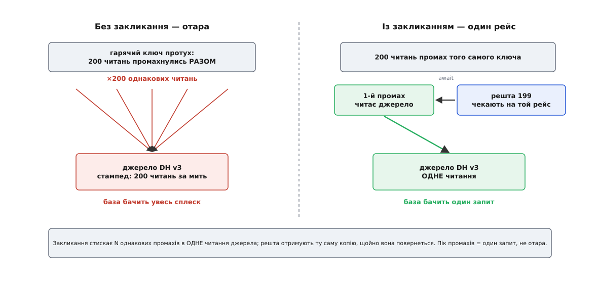
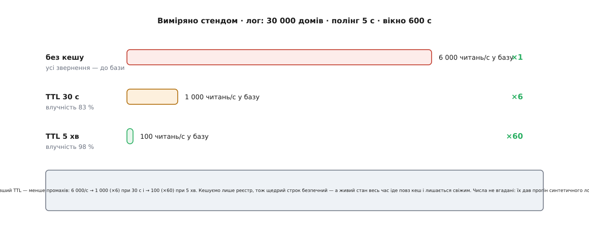

# ⚙️ Збираємо перший кеш: закликання, скид-на-запис і виміряне розвантаження

Рішення вже ухвалене, і переказувати його ми не будемо. Кешуємо **лише реєстр**; кеш — у процесі; патерн — [cache-aside](topic:programming/caching-strategies); строк — щедрий; на запис — скид; живий стан лишаємо читатися повз кеш. Рамка обвела межі, [прогін логу крізь ворота](root:progarch/cache-decision-framework/proj-cache-decision-run.md) дав числа. Лишилося те, чого жодна діаграма не робить за нас: узяти порт DH v3 і написати копію, яка справді стоїть на гарячому шляху — гріється порожньою, тримає отару й на запис проступає негайно. А тоді не повірити їй на слово, а прогнати синтетичним логом і побачити ті ×6 і ×60 не на серветці, а на виході програми.

## Задача: від ухваленого рішення до копії, що стоїть на шляху

Будуємо один клас — `CachedRegistry` — і чіпляємо його поверх наявного порту. Він мусить зробити рівно чотири речі, і кожну з них рішення вже назвало:

- **читати реєстр із копії**, а на промах — сходити в джерело й покласти копію назад (cache-aside);
- **живий стан пускати повз себе** — `on/off` і °C читаються прямо з джерела, бо їхній бюджет несвіжості нульовий;
- **скидати копію на запис** — перейменували пристрій чи спарували новий, і наступне читання бачить свіже, не чекаючи, поки строк доживе;
- **пережити порожнечу** — після рестарту, коли копій нема, читання йде в базу: повільніше, зате правильно.

І ще дві речі, які рішення позначило як «закласти одразу, поки масштаб не прийшов сам»: **захист від гримучої отари** (щоб протухання гарячого ключа не оберталося залпом однакових читань у базу) і **вставний годинник** (щоб копію можна було зміряти й перевірити, не чекаючи по п'ять хвилин живого часу).

Порт, який кеш прикрашає, — це [`DeviceRepository` з DH v3](root:progarch/dh-v3-storage), звужений до того зрізу, який нам тут потрібен: читання реєстру, читання живого стану й два записи-мутатори. Кеш реалізує **той самий інтерфейс**, тож у [точці збірки](root:progarch/dh-v2-hexagon) міняється один рядок — `new CachedRegistry(sqliteRepo, TTL)` замість сирого репозиторію, — і `HubService` цього не помічає, як не помітив колись підміну реєстру в пам'яті на SQLite. Кеш стає ще одним адаптером за тим самим швом, а не новим поверхом у системі.

## Ідея: cache-aside, і дві речі, що роблять його бойовим

Серце патерна вміщається в одне речення. **Читання:** глянь у копію; влучив — віддай і не турбуй джерело; промахнувся — сходи в джерело, поклади копію, віддай. **Запис:** зміни джерело, тоді викинь копію, щоб її ніхто не читав протухлою. Звідси одразу випливає, чому система переживає порожній кеш: у промаху **завжди є дорога до джерела**, тож кеш — це прискорювач, а не єдині двері. Спорожни його дощенту — читання стане повільнішим, але не неправильним. Копія, без якої код не вміє відповісти, — то вже приховане єдине джерело правди, а не кеш.

Наївний cache-aside на цьому й закінчився б. Але дві тріщини перетворюють його з іграшки на бойовий шар, і обидві варто закласти зразу, а не латати вночі під навантаженням.

Перша — **гримуча отара** ([cache stampede](topic:programming/cache-stampede), англ. *thundering herd*, вона ж *dogpile*). Уяви, що популярний дім протух, і тієї ж миті двісті паралельних читань промахнулись **разом**: копії ще нема, тож усі двісті чесно, за буквою cache-aside, ринуть у джерело по одне й те саме. Кеш, що мав берегти базу, власноруч скидає на неї залп саме тоді, коли ключ гарячий. Ліки звуться **закликання** (англ. *single-flight*, або *request coalescing* — те, що в Go дає пакет `golang.org/x/sync/singleflight`, яким користуються від Cloudflare й далі). Ідея буквальна: тримай столик «рейсів у польоті» за ключем; **перший** промах заводить рейс — іде по свіже й лишає в столику свою обіцянку; **решта**, хто промахнувся, поки він у дорозі, не біжать у базу собі, а чекають на **ту саму** обіцянку. Двісті промахів стискаються в одне читання джерела, і двісті читачів дістають ту саму копію, щойно вона повернеться.


*Без закликання кожне протухання популярного ключа коштує стільки читань бази, скільки читачів застали порожнечу тієї ж миті. Закликання лишає в польоті **один** рейс на ключ: перший везе, решта чекають на його результат. Пік промахів у джерело стає одним запитом, а не отарою, — і що популярніший ключ, то більше це рятує.*

Чому це безпечно від гонки? Бо і подієвий цикл Node, і `asyncio` — **однониткові**: перевірка «чи є рейс?» і його запис у столик відбуваються **без жодного `await` між ними**, тож двоє читачів фізично не можуть обидва завести рейс на один ключ — цикл добіжить цю ділянку до кінця, перш ніж пустити наступну корутину. Уся коректність тримається саме на цій відсутності проміжку.

Друга тріщина дрібніша, але без неї кеш **не зміряти**. TTL живе годинником; якби кеш дивився лише на справжній `Date.now()`, то щоб побачити протухання за п'ять хвилин, треба було б чекати п'ять хвилин. Тому годинник робимо **вставним** — параметром, а не глобальним викликом. У бою туди йде монотонний час (щоб стрибок системного годинника не збив строк); у стенді й тестах — фальшивий, яким ми крутимо час уперед миттєво й точно. Дрібний шов, а купує і швидкий детермінований тест, і чесний вимір.

## Робочий код: кеш реєстру поверх порту

Ось усе разом — порт, TTL-кеш зі вставним годинником і сам `CachedRegistry` із закликанням та скидом. Той самий приклад двома мовами; обидві однаково рідні для застосункового шару, що диригує портами:

:::tabs
```ts
// ── Порт: звужений зріз DeviceRepository з DH v3 (реєстр + живий стан) ──
interface Device { id: string; name: string; room: string; kind: string; }
interface HomeRegistry { homeId: string; plan: string; threshold: number; devices: Device[]; }
interface LiveState { deviceId: string; on: boolean; celsius: number; }

interface DeviceRepository {
  loadRegistry(homeId: string): Promise<HomeRegistry>;                 // повільний зріз — кешуємо
  loadState(deviceId: string): Promise<LiveState>;                     // живий зріз — повз кеш
  renameDevice(homeId: string, deviceId: string, name: string): Promise<void>;
  pairDevice(homeId: string, d: Device): Promise<void>;
}

// ── TTL-кеш зі ВСТАВНИМ годинником (щоб тести й стенд кермували часом) ──
class TtlCache<V> {
  private store = new Map<string, { value: V; expires: number }>();
  constructor(private ttlMs: number, private now: () => number = Date.now) {}
  get(key: string): V | undefined {
    const e = this.store.get(key);
    if (!e) return undefined;
    if (this.now() >= e.expires) { this.store.delete(key); return undefined; }   // протухла → промах
    return e.value;
  }
  set(key: string, value: V): void { this.store.set(key, { value, expires: this.now() + this.ttlMs }); }
  invalidate(key: string): void { this.store.delete(key); }
  get size(): number { return this.store.size; }
}

// ── Кеш реєстру: cache-aside + закликання + скид-на-запис, ПОВЕРХ того самого порту ──
class CachedRegistry implements DeviceRepository {
  private cache: TtlCache<HomeRegistry>;
  private inflight = new Map<string, Promise<HomeRegistry>>();   // рейси в польоті (один на ключ)
  loads = 0;                                                     // скільки читань дійшло до джерела

  constructor(private inner: DeviceRepository, ttlMs: number, now: () => number = Date.now) {
    this.cache = new TtlCache(ttlMs, now);
  }

  loadRegistry(homeId: string): Promise<HomeRegistry> {
    const hit = this.cache.get(homeId);
    if (hit) return Promise.resolve(hit);            // влучили — джерело не турбуємо
    const racing = this.inflight.get(homeId);
    if (racing) return racing;                        // хтось уже везе те саме — чекаємо на нього
    const flight = this.fill(homeId);                 // ПЕРШИЙ промах — єдиний похід у джерело
    this.inflight.set(homeId, flight);                // синхронно, без await між get і set → гонки нема
    return flight;
  }

  private async fill(homeId: string): Promise<HomeRegistry> {
    this.loads++;
    try {
      const fresh = await this.inner.loadRegistry(homeId);   // промах → джерело (переживаємо порожнечу)
      this.cache.set(homeId, fresh);
      return fresh;
    } finally {
      this.inflight.delete(homeId);                          // рейс завершено — прибрати слот
    }
  }

  loadState(deviceId: string): Promise<LiveState> {          // повз кеш: on/off і °C мусять бути свіжі
    return this.inner.loadState(deviceId);
  }

  async renameDevice(homeId: string, deviceId: string, name: string): Promise<void> {
    await this.inner.renameDevice(homeId, deviceId, name);   // спершу джерело правди — база…
    this.cache.invalidate(homeId);                           // …тоді скид: наступне читання перечитає свіже
  }
  async pairDevice(homeId: string, d: Device): Promise<void> {
    await this.inner.pairDevice(homeId, d);                  // спарювання додало пристрій…
    this.cache.invalidate(homeId);                           // …тож стара копія реєстру протухла
  }
}
```
```py
import asyncio, time
from dataclasses import dataclass
from typing import Protocol, Callable

# ── Порт: звужений зріз DeviceRepository з DH v3 (реєстр + живий стан) ──
@dataclass(frozen=True)
class Device:
    id: str; name: str; room: str; kind: str

@dataclass(frozen=True)
class HomeRegistry:
    home_id: str; plan: str; threshold: float; devices: list[Device]

@dataclass(frozen=True)
class LiveState:
    device_id: str; on: bool; celsius: float

class DeviceRepository(Protocol):
    async def load_registry(self, home_id: str) -> HomeRegistry: ...   # повільний зріз — кешуємо
    async def load_state(self, device_id: str) -> LiveState: ...       # живий зріз — повз кеш
    async def rename_device(self, home_id: str, device_id: str, name: str) -> None: ...
    async def pair_device(self, home_id: str, d: Device) -> None: ...

# ── TTL-кеш зі ВСТАВНИМ годинником (щоб тести й стенд кермували часом) ──
class TtlCache:
    def __init__(self, ttl_s: float, now: Callable[[], float] = time.monotonic):
        self._ttl, self._now, self._store = ttl_s, now, {}
    def get(self, key: str):
        e = self._store.get(key)
        if e is None:
            return None
        if self._now() >= e[1]:                 # протухла → прибрати й повідомити про промах
            self._store.pop(key, None); return None
        return e[0]
    def set(self, key: str, value) -> None:
        self._store[key] = (value, self._now() + self._ttl)
    def invalidate(self, key: str) -> None:
        self._store.pop(key, None)
    def __len__(self) -> int:
        return len(self._store)

# ── Кеш реєстру: cache-aside + закликання + скид-на-запис, ПОВЕРХ того самого порту ──
class CachedRegistry:
    def __init__(self, inner: DeviceRepository, ttl_s: float, now=time.monotonic):
        self._inner = inner
        self._cache = TtlCache(ttl_s, now)
        self._inflight: dict[str, asyncio.Task] = {}   # рейси в польоті (один на ключ)
        self.loads = 0                                  # скільки читань дійшло до джерела

    async def load_registry(self, home_id: str) -> HomeRegistry:
        hit = self._cache.get(home_id)
        if hit is not None:
            return hit                            # влучили — джерело не турбуємо
        task = self._inflight.get(home_id)
        if task is None:                          # ПЕРШИЙ промах заводить рейс…
            task = asyncio.create_task(self._fill(home_id))
            self._inflight[home_id] = task        # синхронно, до першого await → гонки нема
        return await task                         # …решта чекають на той самий рейс

    async def _fill(self, home_id: str) -> HomeRegistry:
        try:
            self.loads += 1
            fresh = await self._inner.load_registry(home_id)   # промах → джерело (переживаємо порожнечу)
            self._cache.set(home_id, fresh)
            return fresh
        finally:
            self._inflight.pop(home_id, None)                  # рейс завершено — прибрати слот

    async def load_state(self, device_id: str) -> LiveState:   # повз кеш: on/off і °C мусять бути свіжі
        return await self._inner.load_state(device_id)

    async def rename_device(self, home_id, device_id, name) -> None:
        await self._inner.rename_device(home_id, device_id, name)  # спершу джерело правди — база…
        self._cache.invalidate(home_id)                           # …тоді скид: наступне читання свіже

    async def pair_device(self, home_id, d: Device) -> None:
        await self._inner.pair_device(home_id, d)                 # спарювання додало пристрій…
        self._cache.invalidate(home_id)                           # …стара копія реєстру протухла
```
:::

Порівняй дві мутації з двома читаннями — у цьому контрасті вся дисципліна зрізів. `loadRegistry` проходить крізь кеш і закликання; `loadState` **навіть не заглядає** в кеш — просто делегує порту, бо живий стан не має права бути ні на секунду старим. А обидва записи однакові за формою: **спершу джерело, тоді скид**. Порядок тут не косметичний, і чому саме такий — розберемо в пастках.

> 🔧 **Навіщо це.** Закликання виглядає як дрібна оптимізація, а насправді це межа між кешем, що береже базу, і кешем, що її вбиває. Без нього кожне протухання гарячого ключа — не один похід у джерело, а стільки, скільки читачів застали порожнечу тієї ж миті; і що ключ популярніший, то більший залп лягає саме туди, куди кеш і мав не пускати. Один словник рейсів у польоті перетворює залп на постріл — а коштує це десяток рядків.

## Три тести і проба на отару

Кеш, який не переживає власної порожнечі й не проступає на запис, — не кеш, а прихована єдина правда з несподіванками. Тому обіцянки рішення ми не декларуємо, а замикаємо в тестах. Мова тут — Python: це перевірний скрипт над тим самим портом, і вибір той самий, що й у [прогоні логу](root:progarch/cache-decision-framework/proj-cache-decision-run.md), — де мова служить вимірові, беремо ту, якою вимір коротший.

Спершу заступник бази — словник у пам'яті, що навмисне **рахує**, скільки читань реєстру до нього справді дійшло (це число й ловитиме кожен тест), і дрібно спить на читанні, щоб під конкурентністю проступило закликання:

```py
class FakeRepo:                              # заступник бази: реєстр у пам'яті + лічильник читань
    def __init__(self):
        self._reg, self._state, self.reads = {}, {}, 0
    def seed(self, reg: HomeRegistry):
        self._reg[reg.home_id] = reg
    async def load_registry(self, home_id):
        self.reads += 1                       # ← скільки читань дійшло до «бази»
        await asyncio.sleep(0)                # вдаємо мережеву затримку, щоб закликання мало що стискати
        return self._reg[home_id]
    async def load_state(self, device_id):
        return self._state.get(device_id, LiveState(device_id, False, 0.0))
    async def rename_device(self, home_id, device_id, name):
        r = self._reg[home_id]
        self._reg[home_id] = HomeRegistry(home_id, r.plan, r.threshold,
            [Device(d.id, name if d.id == device_id else d.name, d.room, d.kind) for d in r.devices])
    async def pair_device(self, home_id, d):
        r = self._reg[home_id]
        self._reg[home_id] = HomeRegistry(home_id, r.plan, r.threshold, [*r.devices, d])

def sample():
    return HomeRegistry("home-42", "free", 20.0,
                        [Device("lock-1", "двері", "передпокій", "lock"),
                         Device("therm-7", "термостат", "вітальня", "thermostat")])
```

**Тест перший — порожній кеш читає з бази.** Найголовніша обіцянка: система, що прокинулась із порожньою мапою, не падає, а йде в джерело. Перевіряємо і правильність відповіді, і те, що влучання далі базу вже не турбує:

```py
async def test_empty_cache_reads_source():
    repo = FakeRepo(); repo.seed(sample())
    cache = CachedRegistry(repo, ttl_s=300)
    reg = await cache.load_registry("home-42")     # кеш порожній — промах
    assert reg.devices[0].name == "двері"          # відповідь правильна — узята з бази
    assert repo.reads == 1                          # рівно одне читання джерела
    await cache.load_registry("home-42")            # тепер копія є — влучання
    assert repo.reads == 1                          # база вдруге НЕ потурбована
```

**Тест другий — скид-на-запис прибирає протухле.** TTL тут навмисне довгий (5 хв), щоб копія сама не протухла й доводила саме скид, а не годинник: перейменували пристрій через DH — і наступне читання мусить показати нове ім'я негайно.

```py
async def test_write_busts_stale():
    repo = FakeRepo(); repo.seed(sample())
    cache = CachedRegistry(repo, ttl_s=300)                         # довгий TTL — сам не протухне
    assert (await cache.load_registry("home-42")).devices[0].name == "двері"
    await cache.rename_device("home-42", "lock-1", "вхідні двері")  # запис через DH → скид копії
    fresh = await cache.load_registry("home-42")                   # промах після скиду → перечитали
    assert fresh.devices[0].name == "вхідні двері"                 # свіже, не чекаючи TTL
    assert repo.reads == 2                                          # друге читання — саме після скиду
```

**Проба на отару — двісті промахів разом стають одним читанням.** Це те, заради чого й заводили закликання: пускаємо двісті одночасних читань у порожній кеш і дивимось на лічильник бази.

```py
async def test_single_flight_collapses():
    repo = FakeRepo(); repo.seed(sample())
    cache = CachedRegistry(repo, ttl_s=300)
    regs = await asyncio.gather(*(cache.load_registry("home-42") for _ in range(200)))
    assert all(r.devices[0].name == "двері" for r in regs)  # усі 200 отримали копію…
    assert repo.reads == 1                                   # …а база бачила рівно ОДНЕ читання
```

**Тест третій — два процеси за балансувальником розходяться.** А ось де названу межу видно на дотик. Два `CachedRegistry` над **однією** базою — це два процеси DH за балансувальником. Обидва прогріли копію; запис прилетів лише в A; A скинув **свою** копію, а до B той скид не долетів:

```py
async def test_two_processes_diverge():
    repo = FakeRepo(); repo.seed(sample())          # СПІЛЬНА база
    a = CachedRegistry(repo, ttl_s=300)             # процес A
    b = CachedRegistry(repo, ttl_s=300)             # процес B
    await a.load_registry("home-42")                # обидва прогріли власну копію
    await b.load_registry("home-42")
    await a.rename_device("home-42", "lock-1", "вхідні двері")   # запис прийшов у процес A
    seen_a = (await a.load_registry("home-42")).devices[0].name
    seen_b = (await b.load_registry("home-42")).devices[0].name
    assert seen_a == "вхідні двері"                 # A скинув свою копію — бачить свіже
    assert seen_b == "двері"                        # B про запис не знає — віддає стару назву
    assert seen_a != seen_b                         # копії РОЗІЙШЛИСЯ
```

Цей останній тест — не помилка, яку треба виправити, а **доказ**: він ловить у код те приховане припущення про один процес, з якого росте наступний сюжет курсу. Запусти всі чотири — і кожен зелений; надрукований прогін підтверджує рядком:

```text
тест 1 (порожній кеш → з бази): OK
тест 2 (скид-на-запис прибирає протухле): OK
проба на отару (закликання 200 → 1 читання): OK
тест 3 (два процеси розходяться без спільної інвалідації): OK
```

## Стенд: синтетичний лог і виміряне ×6 / ×60

Тести довели, що кеш **правильний**. Лишилось довести, що він **вигідний**, — і не серветкою, а числом із прогону. Стенд робить дві речі: синтезує представницький лог доступу DH і жене його крізь **той самий** `TtlCache`, тільки з фальшивим годинником, — тож міряємо збудований шар, а не паралельну модель.

Лог — рівно той профіль, що описала рамка: тридцять тисяч гарячих домів, кожен полить свій `home_id` кожні п'ять секунд; старти розмазані по вікну, щоб вийшов рівний струмінь, а не синхронний сплеск. Вікно — десять хвилин:

```py
def synth_log(n_homes=30_000, poll_s=5, window_s=600):
    """Гарячий профіль DH: n_homes домів, кожен полить свій ключ кожні poll_s с.
    Старти розмазані по вікну → рівні ~6000 читань/с, як на живому піку."""
    events = []
    for home in range(n_homes):
        t = (home / n_homes) * poll_s          # зсув першого полінгу в межах [0, poll_s)
        while t < window_s:
            events.append((t, f"home-{home}"))
            t += poll_s
    events.sort()                              # лог іде в часовому порядку
    return events

def bench(events, ttl_s, window_s=600):
    """Прогнати лог крізь РЕАЛЬНИЙ TtlCache з фальшивим годинником.
    Повертає (влучність, QPS на джерело, загальний QPS)."""
    clock = [0.0]
    cache = TtlCache(ttl_s, now=lambda: clock[0])   # той самий кеш, лише час — наш
    hits = misses = 0
    for t, home in events:
        clock[0] = t                                 # крутимо годинник за міткою події
        if cache.get(home) is not None:
            hits += 1                                # копія свіжа — джерело не турбуємо
        else:
            misses += 1                              # промах → джерело, кладемо копію
            cache.set(home, home)
    n = hits + misses
    return hits / n, misses / window_s, n / window_s
```

Одна тонкість, у якій легко схибити: годинник рухається **мітками подій**, а не справжнім часом, тож десять хвилин трафіку прокручуються за секунди. І прогін навмисне однонитковий — послідовний, тож закликання тут **не спрацьовує** (йому нема кого стискати без конкурентності). Це саме те, що треба для влучності: ми міряємо чисту арифметику TTL cache-aside, а закликання — то запобіжник на пік, не на середнє. Женемо два строки — короткий і щедрий:

```text
без кешу: 6 000 читань/с у базу
TTL   30 с  влучність  83.3%  база  1000.0/с  розвантаження ×6
TTL  300 с  влучність  98.3%  база   100.0/с  розвантаження ×60
```

Ось воно, чорним по білому. При TTL 30 с кожен дім промахується раз на тридцять секунд, решта п'ять читань влучають — влучність п'ять шостих, і база замість шести тисяч бачить тисячу: **розвантаження ×6**. Розтягни строк до п'яти хвилин — і промах лишається один на триста секунд: влучність дев'яносто вісім із чимось, база бачить сотню, **розвантаження ×60**. Серветка з рамки справдилась до цифри; ті числа були не оптимізмом, а прикидкою, і прогін це підтвердив.


*Довший TTL прямо ріже потік промахів у базу: з шести тисяч на секунду до тисячі при тридцяти секундах і до сотні при п'яти хвилинах. Оскільки кешуємо лише реєстр, щедрий строк безпечний — а живий стан весь час іде повз кеш і лишається свіжим. Це не діаграма наміру, а два рядки виводу програми: числа виміряні, не вгадані.*

І тепер видно, чому зріз із воріт 3 був такий важливий саме тут: довгий TTL безкарний **лише тому**, що під ним — повільний реєстр, а не живий стан. Кешуй ми весь відгук — і ×60 обернулося б показом «обігрівач увімкнено» через пів хвилини після того, як його вимкнули. Розвантаження й свіжість не суперечать одне одному лише доти, доки ми ділимо відповідь за бюджетом несвіжості.

## Складність і пастки

Кеш зелений на тестах і швидкий на стенді — і саме тому час назвати п'ять місць, де він кусає, коли про них забути.

**Закликання спаює долі — не лише латентністю, а й збоєм.** Зачинивши отару, ми посадили сто дев'яносто дев'ять читачів на **один** рейс: його повільність стає їхньою повільністю, а його падіння — їхнім падінням. Джерело гикнуло на тому єдиному читанні — і всі двісті запитів падають разом, а наступним тіком полінгу знову ринуть отарою, тепер уже в повторну спробу. Тобто закликання **гасить** отару на успіху й **концентрує** її на збої. Тому рейс варто обмежувати строком (timeout), а на промах джерела — думати про коротке кешування самої невдачі чи розсіяну (jittered) повторну спробу, щоб блимання бази не оберталося синхронним штормом ретраїв.

**Скид — ПІСЛЯ запису, і навіть тоді лишається щілина.** Порядок у мутаторах не випадковий: спершу база, тоді `invalidate`. Зроби навпаки — скинь копію, а тоді пиши — і між цими двома кроками встигне протиснутися паралельне читання, що промахнеться й **перезаллє** кеш старим значенням, якого запис іще не замінив. Але й правильний порядок лишає тонку щілину: читання, що промахнулось і взяло **старі** дані за мить до коміту, може покласти свою протухлу копію вже **після** нашого скиду — і отруїти кеш аж до TTL. У процесі з закликанням ця щілина мізерна — лічені мікросекунди між читанням старого й кладкою копії, — та вона не нульова; знай, що вона є, і став їй стелею той самий TTL. Це класична гонка «читання-після-запису» в мініатюрі.

**Стенд однонитковий — він ХОВАЄ отару.** Прогін лічить **один** промах там, де бойова система під навантаженням побачила б залп, — рівно та сліпа пляма, яку назвав [сусідній прогін](root:progarch/cache-decision-framework/proj-cache-decision-run.md). Тож ×6 і ×60 — це середнє й **нижня межа** навантаження на джерело, а не пік. І це прямо пояснює, навіщо ми взагалі писали закликання: воно — те, що складає живий пік назад до того середнього, яке показав стенд. Читай таблицю як «чого досягає кеш, захищений від отари», а не «чого досягне будь-який TTL-кеш».

**Розходження двох процесів — доведене, не полагоджене.** Останній тест — характеризація обриву, а не баг на сьогодні. Латка (спільний [розподілений кеш](topic:programming/distributed-cache) чи шина інвалідації) належить дню, коли DH піде в горизонталь; будувати її зараз — це та сама передчасна складність, від якої курс відмовляється раз за разом. Але тест показує й пом'якшення: процес B **самоодужує**, щойно протухне його власна копія, — тобто розходження обмежене одним TTL, «несвіже в межах строку». Для реєстру, що міняється раз на день, це часто прийнятно; головне — назвати межу й обрати свідомо, а не виявити її як нічну загадку «чому два користувачі бачать різні назви».

**Кеш без стелі — це повільний витік.** Наша мапа нічого не витісняє: вона росте не з гарячим набором, а з числом **усіх** домів, що їх коли-небудь читали. Тридцять тисяч гарячих по кілобайту — десятки мегабайтів, дрібниця; але без стелі це витік у мить, коли ключі починають плинути (кожен дім, що бодай раз відкрив застосунок, — навіки в пам'яті). Стелю ставлять витісненням найдавнішого (LRU) на **коліні** робочого набору — тій точці, за якою зайва пам'ять не додає влучності, і яку [той самий прогін і зміряв](root:progarch/cache-decision-framework/proj-cache-decision-run.md). Коліно — а не «усе про запас».

Ось що ми зібрали: не діаграму кешу, а кеш. Він переживає порожнечу, бо в промаху завжди є дорога до бази; тримає отару одним рейсом на ключ; проступає на запис негайно й лишає живий стан свіжим; і знімає з бази шість чи шістдесят разів навантаження — числом, яке кожен відтворить одним прогоном. А той єдиний тест, де дві копії розійшлися, лишається світити межею: усе це правда рівно доти, доки процес один. День, коли їх стане два, — уже поріг у наступний світ, і кеш ми туди понесемо не наосліп, а знаючи точно, що саме в ньому тоді треба буде перепаяти.
