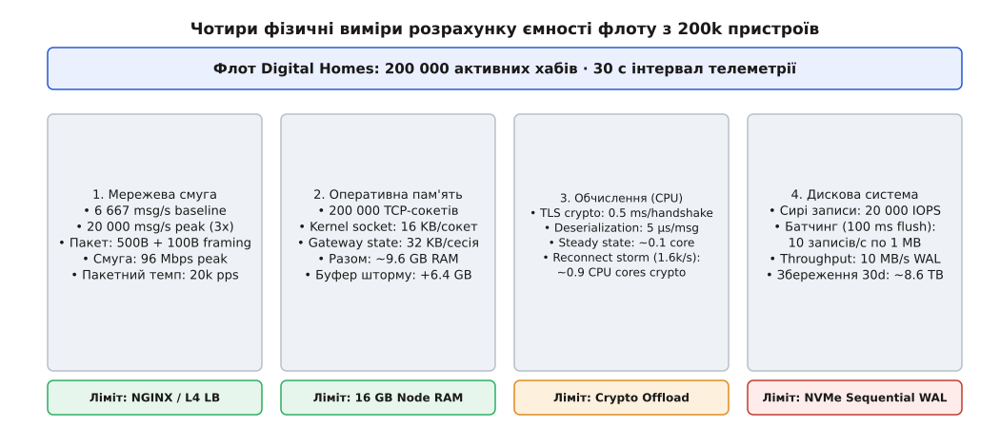
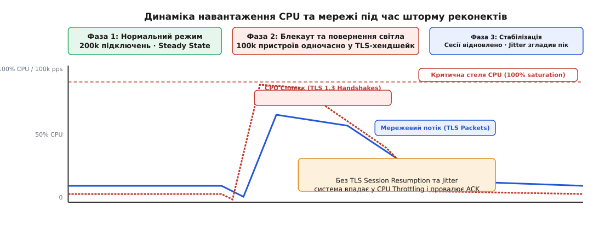
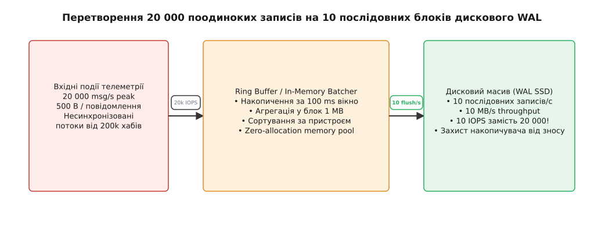

# Прикидка на серветці: оцінка ємності флоту DH

<preknowlist>
- [Закон Літтла](root:math-probability/littles-law) — зв'язок між кількістю елементів у системі, пропускною здатністю та часом перебування.
- [Перцентилі й хвости](root:math-probability/percentiles-quantiles) — чому середні значення приховують реальне навантаження на систему.
- [Гримуча отара на масштабі](root:sf-distributed/thundering-herd) — каскадні сплески при масових реконектах та розведення навантаження (jitter).
</preknowlist>

О 18:30 у вівторок, під час вечірнього піку повернення мешканців додому, хмарна платформа Digital Homes зазнала раптової деградації. Понад 200 000 домашніх хабів одночасно відправляли телеметрію станції датчиків, камери фіксували відкриття воріт і дверей, а мобільні застосунки намагалися відкрити live-відеопотоки. Протягом кількох хвилин індикатори системи зауваження спалахнули червоним: затримка обробки повідомлень зросла від 10 мілісекунд до 45 секунд, сервіси Gateway впали за помилкою Out-Of-Memory (OOM), а дисковий масив баз даних заблокувався під навантаженням у 20 000 випадкових операцій запису на секунду (IOPS).

Найбільша трагедія цього інциденту полягала в тому, що він не був наслідком складної архітектурної помилки або прихованого багу в коді. Катастрофа була повністю передбачуваною і її можна було відвернути за допомогою п'яти хвилин математичних розрахунків на звичайній паперовій серветці ще до виділення серверів у хмарі.

Розслідування інциденту показало ланцюгову реакцію: під час вечірнього піку затримка підтвердження запису у дискову базу даних зросла всього на 50 мілісекунд через спонтанний запуск фонового процесу вакуумації (VACUUM). Воркери шлюзу, очікуючи на відповідь бази даних, сповільнили обробку сокетів. Оскільки вхідний потік 20 000 повідомлень на секунду від хабів продовжував надходити безупинно, ядро Linux почало накопичувати неопрацьовані TCP-сегменти у буферах прийому сокетів (`sk_rcvbuf`). Витрати оперативної пам'яті ядра на кожен сокет автоматично розширилися від 8 KB до 128 KB. Сумарний обсяг пам'яті сокетів перетнув позначку у 25 Гігабайтів, що миттєво активувало системний механізм Linux Kernel OOM Killer (`oom_score_adj`). Ядро примусово завершило процес Gateway, скинувши 200 000 активних TCP-з'єднань і викликавши каскадний шторм повторних підключень по всій мережі.

Багато технологічних команд припускаються критичної помилки, покладаючись виключно на синтетичне нагрузочне тестування (Locust, JMeter або k6). Синтетичні тести часто проводяться на спрощених середовищах, де TLS-сесії не застарівають, затримки мобільної мережі дорівнюють нулю, а кеші баз даних знаходяться у прогрітому стані. Метод **оцінки ємності на серветці** (Envelope Calculation або Back-of-the-Envelope Estimation) є базовою дисципліною архітектора розподілених систем, яка дозволяє побачити справжні фізичні межі платформи у найгірших крайових умовах. Вона дозволяє звести складну фізику взаємодії сокетів, криптографії, черг та накопичувачів до чотирьох простих арифметика-обчислень: мережевої смуги, оперативної пам'яті, обчислень CPU та дискових IOPS. Як показано у вставці [Історія оцінок на серветці: від теорії Фермі до чисел Джеффа Діна](root:progarch/dh-fleet-envelope/hist-envelope-calculation-lineage.md), вміння швидкого розрахунку порядків величин є першим фільтром проти катастрофічних інфраструктурних помилок.

## Анатомія архітектурних меж: чотири стовпи системи

Жодна розподілена система не існує в абстрактному математичному просторі. Вона завжди обмежена фізичними ресурсами обладнання. Коли флот з 200 000 пристроїв підключається до хмари Digital Homes, кожне з'єднання та кожне повідомлення споживає строго визначену кількість квантів ресурсу.


*Чотири фізичні стовпи оцінки ємності системи: пропускна здатність мережі, оперативна пам'ять сокетів, обчислення CPU під TLS та дисковий пропускний спроможність WAL.*

Прикидка на серветці базується на перевірці системи за чотирма вектором-границями:

1. **Мережева смуга та темп пакетів (Network Throughput & Packet Rate):** Скільки біт на секунду та скільки мережевих кадрів за секунду вимагає потік телеметрії з урахуванням усіх протокольних заголовков.
2. **Оперативна пам'ять сесій (RAM & Socket Memory):** Скільки гігабайт пам'яті утилізують буфери ядра Linux, контексти TLS та доменні стани активних з'єднань.
3. **Обчислювальна потужність процесора (CPU & Crypto Saturation):** Скільки ядер процесора необхідно для десеріалізації повідомлень у штатному режимі та виконання асиметричної криптографії TLS під час масових реконектів.
4. **Пропускна здатність диска (Disk IOPS & Write Throughput):** Скільки операцій запису та гігабайт на добу генерує потік подій і як буферизація змінює характер дискового навантаження.

Якщо бодай один із цих чотирьох ресурсів досягає межі насичення (Saturation > 90%), у системі починає діяти [Закон Літтла](root:math-probability/littles-law). Черги на вході вибухають експоненційно, затримки зростають у сотні разів, і система впадає у стан каскадного колапсу.

## Вимір 1: Мережева смуга та темп мережевих пакетів

Розглянемо флот з `N = 200 000` активних домашніх хабів Digital Homes. Кожен хаб підтримує постійне TCP/TLS-з'єднання з мережевим шлюзом і відправляє періодичний пакет телеметрії (стан датчиків, температура, енергоспоживання) кожні 30 секунд.

Розрахуємо базову інтенсивність повідомлень у штатному режимі (Steady State):

```
R_steady
= N / T_telemetry        [формула темпу вхідних повідомлень]
= 200 000 / 30 s
= 6 666.67 msg/s         (~6.67 тисяч повідомлень на секунду)
```

У вечірній пік (Evening Peak), коли мешканці повертаються додому і датчики руху та відкриття дверей працюють частіше, інтенсивність трафіку зростає у 3 рази:

```
R_peak
= R_steady · 3
= 6 666.67 · 3
= 20 000 msg/s           (20 тисяч повідомлень на секунду)
```

Тепер обчислимо реальний розмір мережевого кадру. Наївний розробник вважає, що якщо корисне повідомлення Protobuf займає 500 байтів, то пропускна здатність дорівнює `20 000 · 500 B = 10 MB/s`. Це небезпечна оману.

У реальній мережі до кожного повідомлення додається каскад протокольних заголовків:
- **Payload (Protobuf delta):** 500 bytes
- **TLS 1.3 Record Header & Auth Tag:** 29 bytes
- **TCP Header (з опціями timestamps):** 32 bytes
- **IPv4 Header:** 20 bytes
- **Ethernet II Frame Overhead (заголовок, CRC, inter-frame gap):** 26 bytes

Повний розмір кадру становить:

```
Frame_size = 500 + 29 + 32 + 20 + 26 = 607 bytes
```

Обчислими необхідну мережеву смугу для пікового режиму:

```
Throughput_bytes = 20 000 msg/s · 607 bytes/msg = 12 140 000 bytes/s (12.14 MB/s)

Throughput_bits  = 12.14 MB/s · 8 bits/byte    = 97.12 Mbps
```

Обсяг трафіку 97.12 Mbps здається невеликим — його легко пропускає звичайний мережевий інтерфейс 1 Gbps. Однак тут прихована друга фізична пастка: **темп пакетів (Packet Rate)**. Шлюз мусить прийняти й обробити 20 000 окремих Ethernet-кадрів на секунду.

Глибинна фізика обробки пакетів у ядрі Linux влаштована наступним чином: коли мережева карта (NIC) отримує пакет, вона копіює його у кільцевий буфер прийому DMA `rx_ring` і генерує апаратне переривання (Hardware IRQ). Процесор зупиняє виконання поточного коду і перемикається на обробник переривання. Ядро Linux за допомогою підсистеми NAPI (New API) вимикає апаратні переривання і переходить у режим опитування (`softirq`), витягуючи кадри з кільцевого буфера.

Якщо мережева карта не налаштована на підтримку багаточергового виклику (Receive Side Scaling, RSS) та об'єднання переривань (Interrupt Coalescing), усі 20 000 переривань на секунду потрапляють на перше ядро процесора (CPU 0). У результаті CPU 0 витрачає 100% часу на обробку `NET_RX_SOFTIRQ`, що призводить до відкидання пакетів на рівні NIC, навіть якщо загальна смуга завантажена лише на 10%.

Крім того, при використанні мереж IPv6 заголовок IP зростає з 20 до 40 байтів, а при використанні тунелювання IPSec додається ще 50–70 байтів оверхеду. Якщо розмір кадру перевищує стандартний розмір MTU (1500 байтів), відбувається фрагментація пакетів на IP-рівні, що подвоює темп пакетів і дає додаткове навантаження на систему.

Детальні математичні формули мережевого оверхеду та Закону Літтла наведено у вставці [Математика оцінки ємності: від Закону Літтла до буферів IOPS](root:progarch/dh-fleet-envelope/math-fleet-envelope-formulas.md).

## Вимір 2: Оперативна пам'ять шлюзу та сокетні буфери

Для забезпечення миттєвої доставки команд та прийому подій кожен із 200 000 хабів підтримує постійне довготривале TCP-з'єднання (Long-lived TCP connection). Головне питання прикидки пам'яті: скільки гігабайт оперативної пам'яті (RAM) необхідно лише для утримання цих з'єднань у відкритому стані?

Оперативна пам'ять під одне з'єднання складається з чотирьох частин:

1. **Буфер прийому ядра Linux (Kernel RX Buffer):** Пам'ять, яку ядро виділяє під чергу вхідних TCP-сегментів. При налаштуванні `sysctl net.ipv4.tcp_rmem` мінімальний розмір становить 8 KB.
2. **Буфер передачі ядра Linux (Kernel TX Buffer):** Пам'ять під вихідні підтвердження та команди. Мінімальний розмір `sysctl net.ipv4.tcp_wmem` становить 8 KB.
3. **Контекст стану TLS 1.3 (OpenSSL / BoringSSL):** Структури даних криптографічного сеансу, симетричні ключі шифрування та внутрішні буфери шифрування (16 KB).
4. **Контекст сесії застосунку (Gateway Session State):** Об'єкт сесії в пам'яті сервісу (ідентифікатор пристрою, токен авторизації, маршрутизаційні таблиці та кеш твіна пристрою) — близько 16 KB.

Підсумуємо витрати пам'яті на одне з'єднання:

```
RAM_per_connection = 8 KB (RX) + 8 KB (TX) + 16 KB (TLS) + 16 KB (App) = 48 KB
```

Тепер обчислими загальний обсяг оперативної пам'яті для всього флоту з 200 000 пристроїв:

```
RAM_total
= 200 000 · 48 KB
= 9 600 000 KB
= 9.155 GB               (~9.16 Гігабайт RAM)
```

Отже, лише для того, щоб 200 000 хабів тримали з'єднання з хмарою без виконання жодної бізнес-логіки, мережевому ярусу потрібно 9.16 GB RAM.

На практиці ядро Linux використовує системний параметр `net.ipv4.tcp_mem`, який вимірюється в системних сторінках пам'яті (Page Size = 4096 bytes). Якщо сумарне споживання пам'яті сокетами перевищує другий поріг `tcp_mem` (pressure mode), ядро починає примусово зрізати розміри буферів `sk_rcvbuf` для всіх сокетів, що призводить до падіння пропускної здатності TCP-вікна.

Для запобігання цього шлюз повинен використовувати високоефективний механізм опитування файлових дескрипторів `epoll` у режимі Edge-Triggered (EPOLLET), який мінімізує системні виклики і виділяє пам'ять під подію лише тоді, коли сокет реально готовий до читання даних.

Якщо розгортати Gateway на серверах з 16 GB RAM, один сервер зможе впевнено утримувати весь флот з урахуванням 40% запасу під сплески буферів під час мережевих затримок. Для забезпечення відмовостійкості (HA) цей флот зазвичай ділять між трьома вузлами Gateway по 8 GB або 16 GB RAM (по ~67 000 з'єднань на вузол), що знижує навантаження до 3.05 GB RAM на сервер.

Детальні нормативи налаштування параметрів ядра та буферів пам'яті зібрано у вставці [Контракт та параметри обчислення ємності флоту DH](root:progarch/dh-fleet-envelope/api-fleet-telemetry-contract.md).

## Вимір 3: Обчислення CPU та драма TLS-хендшейків

Обчислювальне навантаження на процесор (CPU) у розподіленій системі збору телеметрії ділиться на дві абсолютно різні категорії:

1. **Десеріалізація та маршрутизація (Steady State):** Легка операція декодування Protobuf-пакетів та відправки їх у чергу повідомлень (Kafka/NATS). Одно декодування займає близько 5 мікросекунд (0.000005 s). Для пікового потоку 20 000 msg/s це вимагає:

```
CPU_parse = 20 000 msg/s · 0.000005 s = 0.10 CPU cores (10% одного ядра)
```

2. **Встановлення нових TLS-з'єднань (Handshake Storm):** Найважча криптографічна операція, яка вимагає асиметричної криптографії (обмін ключами ECDHE та перевірка підпису RSA/ECDSA).

Розглянемо найнебезпечніший сценарій: **Блекаут та відновлення живлення у міському районі**.

Унаслідок відключення та наступного ввімкнення електроенергії 100 000 домашніх хабів одночасно перезавантажуються і намагаються відновити зв'язок із хмарою протягом 60 секунд.


*Сплеск обчислювального навантаження CPU під час масового відновлення TLS-сесій після блекауту.*

Обчислимо темп повторних підключень під час шторму:

```
R_reconnect = 100 000 handshakes / 60 s = 1 666.67 handshakes/s
```

Одно повне встановлення TLS 1.3 з'єднання (Full Handshake з перевіркою сертифіката) займає близько 0.6 мілісекунд обчислювального часу одного ядра CPU. Розрахуємо необхідну кількість ядер CPU суто для криптографії:

```
CPU_crypto_full = (1 666.67 handshakes/s · 0.6 ms) / 1000 = 1.00 CPU core
```

Якщо шлюз не підтримує механізм сесійних квитків (TLS Session Resumption / Pre-Shared Key), 1 667 хендшейків на секунду повністю утилізують ціле процесорне ядро лише на розшифрування ключів. Якщо ж реконект відбудеться за 10 секунд замість 60 (темп 10 000 handshakes/s), системі знадобиться **6 повних ядер CPU** суто під криптографію.

Криптографічний вибір алгоритмів симетричного шифрування також має величезний вплив на CPU. На серверах архітектури x86_64 з підтримкою аппаратних інструкцій AES-NI шифросьюта `TLS_AES_128_GCM_SHA256` обробляється зі швидкістю понад 3 Гбайт/с на ядро. Проте якщо частина недорогих IoT-хабів побудована на процесорах ARM без аппаратних інструкцій AES, використання ChaCha20-Poly1305 (`TLS_CHACHA20_POLY1305_SHA256`) дозволяє зменшить навантаження на процесор хаба у 4 рази.

Використання TLS 1.3 Session Resumption скорочує час обчислення хендшейку з 0.6 ms до 0.05 ms (у 12 разів!), оскільки асиметрична криптографія замінюється швидким перевірочним HMAC-хешем. Завдяки цьому потреба у CPU під час шторму падає з 1.0 ядра до всього 0.083 ядра.

УTLS 1.3 також існує режим 0-RTT Early Data, який дозволяє відправляти першу телеметрію у першому ж пакеті хендшейку. Проте цей режим вимагає обережності: через вразливість до атак повторного відтворення (Replay Attacks) у режимі 0-RTT дозволяється відправляти лише ідемпотентні прочитати-події (наприклад, актуальну температуру), забороняючи керуючі команди (відкриття замка дверей).

## Вимір 4: Дискова підсистема та трансформація IOPS

Останнім і найчастіше смертельним вузьким місцем системи є дисковий накопичувач баз даних.

Уявімо наївну архітектуру: кожна вхідна подія телеметрії від 200 000 пристроїв під час пікового навантаження (20 000 msg/s) одразу записується в базу даних (PostgreSQL або Cassandra) окремою транзакцією з викликом синхронізації диска `fsync()`.

У цьому випадку дискова підсистема отримує **20 000 випадкових операцій запису на секунду (Random Write IOPS)**. Жоден стандартний хмарний дисковий том (наприклад, AWS EBS gp3 із базовим лімітом 3 000 IOPS) не здатний витримати таке навантаження. Дискова черга миттєво переповнюється, транзакції блокуються, а операції запису падають за таймаутом.

Причиною цього є фізика дискових накопичувачів. Для реляційних баз даних із традиційними B-Tree індексами оновлення індексу при кожному записі викликає так званий роздув запису (Write Amplification Factor, WAF). Один записаний байт корисної телеметрії може призвести до 10–30 байтів фізичного запису на диск через модифікацію дискових сторінок індексу B-Tree та файлу журнал зацікавлення.

Розв'язанням цієї проблеми є використання архітектури Log-Structured Merge-tree (LSM-tree), яка застосовується у Time-Series базах даних (ClickHouse, TimescaleDB, Cassandra), у поєднанні з **агрегацією та батчингом у пам'яті через кільцевий буфер (Ring Buffer)**.


*Буферизація в оперативній пам'яті конвертує руйнівний хаотичний потік 20 000 IOPS на 10 впорядкованих послідовних записів.*

Шлюз накопичує вхідні події в оперативній пам'яті протягом часового вікна `T_flush = 100 ms` (10 разів на секунду) і скидає їх на диск єдиним послідовним блоком у Write-Ahead Log (WAL).

Розрахуємо нові дискові параметри після батчингу:

```
IOPS_batched = 1 / T_flush = 1 / 0.1 s = 10 IOPS

Flush_size   = 20 000 msg/s · 0.1 s · 500 bytes = 1 000 000 bytes (1.0 MB на один flush)

Write_throughput = 10 IOPS · 1.0 MB = 10 MB/s
```

Завдяки прикидці на серветці ми змінили вимоги до дискової системи: замість недосяжних 20 000 random IOPS система вимагає лише **10 sequential IOPS** із лінійною пропускною здатністю **10 MB/s**, що легко забезпечує навіть найдешевший SSD-накопичувач.

Нарешті, обчислимо добовий обсяг даних для зберігання історії телеметрії (Storage Capacity Retention):

```
Data_per_day
= R_steady · 86 400 s/day · 500 bytes
= 6 666.67 · 86 400 · 500
= 288 000 000 000 bytes
= 268.2 GB/day            (~268 Гігабайт на добу)
```

Для зберігання глибини історії у 30 днів системі знадобиться:

```
Storage_30d = 268.2 GB/day · 30 days = 8 046 GB (~8.05 Терабайт)
```

Використання алгоритмів стиснення для колоночних Time-Series баз даних (Zstandard або алгоритм Gorilla під стиснення часових міток і плаваючих точок) дозволяє стиснути сирі 268 ГБ/добу приблизно у 6–7 разів, знижуючи реальний добовий інфікс на диск до 40 ГБ/добу, а 30-денний архів — до 1.2 Терабайтів.

Звідси архітектор робить чіткий висновок: гарячі дані телеметрії не можна зберігати в дорогій реляційній БД. Їх слід відправляти у колонкову Time-Series БД (TimescaleDB / ClickHouse) або агрегувати на самому хабі, відправляючи у хмару лише усереднені дельти.

## Простеження шляху пакета: від фізичного давача до дискового WAL

Щоб глибше зрозуміти, де саме виникають ресурсно-ємні бар'єри, простежимо повний життєвий цикл одного пакета телеметрії від моменту спрацювання датчика до запису у дисковий масив:

1. **Фізичний рівень (IoT Microcontroller):** Давач температури фіксує зміну показників на 0.5°C. Мікроконтролер хаба створює Protobuf-структуру `DHTelemetryEvent` (500 байтів), загортає її в TLS 1.3 рекорд та передає в TCP-стек Wi-Fi модуля.
2. **Мережевий інґрес (NIC & Linux SoftIRQ):** Мережева карта (NIC) сервера Gateway приймає Ethernet-кадр і відправляє його у кільцевий буфер прийому DMA `rx_ring`. Мережевий адаптер виставляє аппаратне переривання IRQ. Ядро Linux перехоплює його та запускає `NET_RX_SOFTIRQ` для обробки пакета у кільці NAPI.
3. **Прийом у просторі ядра (Kernel Socket Buffer):** Ядро перевіряє TCP Sequence Number та вміщує вміст пакета у буфер прийому сокета `sk_buff`. Процес шлюзу, який очікував подій через системний виклик `epoll_wait()`, отримує сповіщення про готовність сокета до читання.
4. **Розшифрування у просторі користувача (User-space TLS & Protobuf):** Сервіс шлюзу зчитує зашифровані байти через OpenSSL BIO, виконує перевірку симетричного AES-128-GCM тегу та передає розшифрований Protobuf-буфер до парсера. Парсер виділяє пам'ять під DTO і передає об'єкт воркеру обробки.
5. **Агрегація в Ring Buffer та скидання на диск:** Воркер розміщує подію у беззабуферному кільцевому буфері (Ring Buffer) у пам'яті. Кожні 100 мілісекунд фоновий потік `FlushThread` витягує накопичені 2000 повідомлень, згортає їх у монолітний блок 1.0 MB та робить єдиний системний виклик `write()` у файл WAL з послідуючим `fdatasync()`.

## Діагностика та спостережуваність через sysfs, procfs та tracepoints

Коли реальне навантаження на платформу наближається до розрахованої стелі ємності, інженер утиліти спостережуваності Linux може швидко локалізувати вузьке місце за допомогою системних файлових систем `/proc` та `/sys`.

### 1. Моніторинг оперативної пам'яті сокетів через `/proc/net/sockstat`

Команда перегляду загального стану сокетного стеку:

```bash
cat /proc/net/sockstat
```

Приклад виводу на навантаженому шлюзі:
```
sockets: used 200450
TCP: inuse 200012 alloc 200040 orphan 12 tw 35 alloc 200040 mem 244140
RAW: inuse 0
FRAG: inuse 0 memory 0
```

Поле `mem 244140` вказує на кількість сторінок пам'яті (PAGE_SIZE = 4096 bytes), виділених під TCP-буфери. Множимо 244 140 · 4096 = 999 997 440 bytes (~1.0 GB пам'яті ядра під буфери сокетів).

### 2. Діагностика пропускної здатності та скидань через `/proc/net/snmp`

Перевірка втрат пакетів на рівні TCP/IP:

```bash
netstat -s | grep -i "buffer errors"
```

Якщо лічильник `TCPRcvbufDrop` або `ListenDrops` зростає, це прямо свідчить про те, що реальний потік перевищив розраховану смугу буфера прийому сокета і ядро скидає вхідні кадри.

### 3. Діагностика криптографічного CPU через `perf top`

При виникненні шторму реконектів інженер запускає системний профайлер:

```bash
perf top --sort comm,dso,symbol
```

Якщо перші рядки зайняті функціями `ecp_nistz256_ord_sqr`, `aesni_cbc_encrypt` або `RSA_verify`, це беззаперечне empirical підтвердження CPU Saturation на криптографічному рівні TLS.

### 4. Діагностика насичення дискових IOPS через `iostat`

Перевірка дискової підсистеми:

```bash
iostat -x 1 10
```

Якщо поле `%util` наближається до 100%, а середній час очікування `w_await` перевищує 50 ms, це означає, що батчинг скидань на диск недостатній і накопичувач не встигає обробляти потік WAL.

## Налаштування конфігурації проксі-шлюзу (NGINX / Envoy)

Для впровадження розрахованих параметрів ємності у продакшн нижче наведено реальний фрагмент конфігурації NGINX L4 Reverse Proxy (`/etc/nginx/nginx.conf`):

```nginx
user www-data;
worker_processes auto;
worker_rlimit_nofile 262144; # Підтримка 200k+ відкритих файлових дескрипторів

events {
    worker_connections 65535; # Кількість сокетів на один воркер
    use epoll;
    multi_accept on;
}

stream {
    # Спільний кеш TLS-сесій для зменшення навантаження на CPU (Session Resumption)
    ssl_session_cache shared:SSL:500m; # 500 MB кешу під утримання ~200k сесій
    ssl_session_timeout 1h;            # Тривалість життя TLS Session Ticket
    ssl_session_tickets on;

    upstream dh_telemetry_backend {
        least_conn;
        server 10.0.1.10:8443 max_fails=3 fail_timeout=10s;
        server 10.0.1.11:8443 max_fails=3 fail_timeout=10s;
        server 10.0.1.12:8443 max_fails=3 fail_timeout=10s;
    }

    server {
        listen 8443 ssl;
        proxy_pass dh_telemetry_backend;

        # TLS налаштування під високу пропускну здатність
        ssl_certificate /etc/ssl/certs/dh_gateway.crt;
        ssl_certificate_key /etc/ssl/private/dh_gateway.key;
        ssl_protocols TLSv1.3;
        ssl_ciphers TLS_AES_128_GCM_SHA256:TLS_CHACHA20_POLY1305_SHA256;

        # Таймаути утримання довготривалих з'єднань
        proxy_timeout 90s;
        proxy_connect_timeout 5s;
    }
}
```

## Шторм відновлення після блекауту: Thundering Herd та розведення навантаження (Jitter)

Навіть якщо апаратні ресурси заздалегідь розраховані під пікове навантаження, у розподілених системах існує явище резонансного сплеску — **Гримуча отара (Thundering Herd)**.

Коли після відновлення живлення 100 000 хабів намагаються підключитися до хмари, вони роблять це одночасно. Якщо шлюз тимчасово відхиляє частину запитів через короткочасне перевищення черги, наївна прошивка пристрою робить повторну спробу через фіксований інтервал (наприклад, суворо кожні 5 секунд).

Крім того, під час масового перепідключення виникає вторинний шторм — **DNS Thundering Herd**. Одночасне виконання 100 000 DNS-запитів на домен `gateway.dh.example` перевантажує локальні DNS-резолвери (CoreDNS / BIND), що призводить до таймаутів визначення IP-адреси шлюзу ще до початку TLS-хендшейку.

У результаті 100 000 пристроїв починають синхронно «штурмувати» шлюз кожні 5 секунд, утворюючи згустки навантаження амплітудою у 100 000 pps, за якими йдуть 4 секунди повної тиші. Це явище руйнує будь-які розрахунки ємності.

Для нейтралізації шторму реконектів застосовується алгоритм **Експоненційного запізнення з повним рандомізуванням (Exponential Backoff with Full Jitter)**:

```
T_wait = random(0, min(T_max, T_base · 2^attempt))
```

Додавання випадкового запізнення (Jitter) «розмазує» 100 000 підключень по часовому інтервалу в 60 секунд. Замість короткого смертельного піку 100 000 handshakes/s система отримує рівномірний, передбачуваний потік 1 667 handshakes/s, який легко обробляється розрахованим запасом CPU та пам'яті.

## Управління відхиленнями ємності (Capacity Drift Governance) та рев'ю бюджету

Розрахунок на серветці не є разовою процедурою, виконаною під час старт-апу проєкту. У реальних продуктових командах існує явище **дрейфу ємності (Capacity Drift)**.

Дрейф ємності виникає тоді, коли продуктова команда поступово розширює схему Protobuf (додаючи нові метрики датчиків), скорочує інтервал відправки Heartbeat-пакетів або змінює протоколи шифрування. Кожна окрема зміна здається незначною (наприклад, додавання 50 байтів до телеметрії), але сумарно протягом року ці зміни подвоюють вимоги до оперативної пам'яті сокетів та дискового масиву.

Для запобігання збоям у продакшні команда Digital Homes впроваджує регламент **Quarterly Capacity Review (Щоквартальне рев'ю ємності)**:

1. **Ревізія вихідних констант:** Щокварталу архітектурна команда оновлює фактичну кількість пристроїв у флоті, розміри пакетів телеметрії за даними Prometheus та актуальні ціни хмарних ресурсів.
2. **Контроль розсуву параметрів:** Калькулятор ємності порівнює поточні показники з попередніми розрахунками. При виявленні відхилення понад 15% від базового envelope-бюджету відкривається задача на оптимізацію схем або масштабування кластера.
3. **Фінансовий аудит (FinOps Alignment):** Розрахований envelope-бюджет зіставляється з місячним рахунком від хмарного провайдера (AWS / GCP). Якщо витрати зростають швидше за кількість пристроїв у флоті, це є сигнали про виникнення інфраструктурних втрат (наприклад, надлишковий крос-авл трафік чи неефективні дискові томи).

## Практичний підсумок: калькулятор та інваріанти ємності

Для автоматизації обчислень на серветці розроблено консольний інструмент, наведений у вставці [Калькулятор оцінки ємності флоту DH](root:progarch/dh-fleet-envelope/proj-envelope-calculator.md). Він дозволяє варіювати параметри флоту (кількість пристроїв від 10 тисяч до 5 мільйонів) і миттєво отримувати підсумковий бюджет заліза.

Зведемо підсумковий результат прикидки ємності для флоту з 200 000 пристроїв Digital Homes у таблицю інфраструктурних вимог:

| Ресурс / Вимір | Обчислена потреба (Baseline + Peak) | Рекомендована конфігурація інфраструктури |
| :--- | :--- | :--- |
| **Мережева смуга (Network)** | 97.12 Mbps peak (20k pps) | 1 Gbps мережевий адаптер, RSS enabled |
| **Оперативна пам'ять (RAM)** | 9.16 GB (під 200k TCP/TLS сесій) | Кластер із 3 вузлів Gateway по 8 GB RAM |
| **Обчислення CPU (Crypto)** | 1.0 CPU core (TLS 1.3 Resumption) | 4 vCPU на вузол Gateway (запас 4x) |
| **Дискові IOPS (WAL)** | 10 Sequential IOPS (після батчингу) | SSD з пропускною здатністю WAL ≥ 20 MB/s |
| **Зберігання даних (Storage)** | 268.2 GB / доба (8.05 TB / місяць) | Time-series сховище (ClickHouse) з TTL 30d |

> 🔧 **Навіщо це.**
> Проведення розрахунку на серветці ДО написання коду дає архітектору три головні переваги. По-перше, ви захищаєте проєкт від закупівлі надлишкового заліза або раптового вичерпання бюджету у хмарі. По-друге, ви заздалегідь впроваджуєте критичні архітектурні патерни (батчинг записів на диск, TLS Session Resumption, Jitter для реконектів), без яких система провалиться під навантаженням. По-третє, під час інцидентів у продакшні ви миттєво відрізняєте нормальну утилізацію від фізичного виснаження ресурсів.
