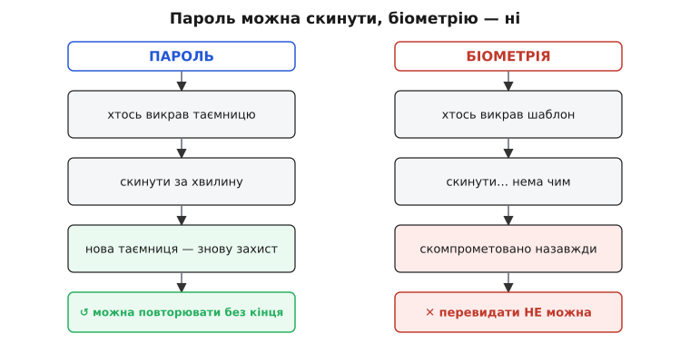
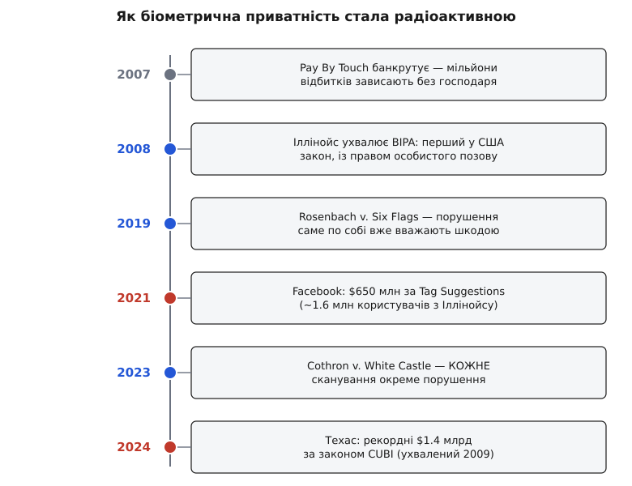

# 📜 Чому власна біометрія — юридично радіоактивна

Уявімо майже побутову картину. Компанія поставила в супермаркетах сканери пальця: приклав палець — заплатив, без карток і гаманця. Мільйони людей погодилися, приклали, пішли додому. А потім компанія збанкрутувала. І тут виринає питання, від якого холоне спина юриста: **куди тепер подінуться мільйони відбитків?** Їх зібрали як актив — а активи в банкрутстві продають з молотка тому, хто дасть більше. Тільки вкрадену картку перевипускають за хвилину, а палець людині вже не поміняти — він у неї один на все життя.

Ця картина не вигадана. Це реальна історія, з якої народився перший у світі закон про біометричну приватність. І саме вона пояснює, чому «зробити свій біометричний вхід» — рішення, від якого досвідчений архітектор задкує. Розберімо, як людство поступово усвідомило, що біометрія — це не просто ще один пароль, а річ зовсім іншої природи, і як це усвідомлення закам'яніло в законах зі штрафами на мільярди.

## Банкрутство, що налякало законодавця

На початку 2000-х по Іллінойсу прокотилася хвиля експериментів: великі мережі ставили сканери пальця в бакалійних крамницях, на заправках, навіть у шкільних їдальнях. Найгучнішим гравцем була компанія Pay By Touch — вона роздала рітейлерам сканери, якими покупець підтверджував оплату дотиком, і зібрала відбитки в мереж на кшталт Jewel-Osco, Cub Foods, Albertsons, на заправках Shell. Компанія продавала себе саме як безпечне сховище: «ваші відбитки в надійних руках».

А наприкінці 2007 року Pay By Touch подала на банкрутство і до березня 2008-го зовсім припинила обслуговування. Люди, що довірили їй палець, залишилися без жодної відповіді, що станеться з їхніми даними. І тут законодавця Іллінойсу пройняв холод: у процедурі банкрутства майно продають, щоб розрахуватися з кредиторами, — а мільйони відбитків тепер лежать саме як майно. Немає закону, який змусив би їх знищити; є натомість стимул їх продати. Це усталений факт — саме цю тривогу Генеральна асамблея Іллінойсу прямо вписала у мотиви закону, який ухвалила того ж 2008 року.

Зверни увагу, що злякало їх не якесь конкретне зловживання, а сама **можливість** — і незворотність. Якби витекли номери кредиток, банки просто перевипустили б картки, і за тиждень проблема розчинилася б. Але відбиток не перевипустиш. Раз він пішов гуляти світом — він пішов назавжди. Банкрутство однієї компанії висвітлило властивість, яку доти мало хто промовляв уголос: біометрія накопичує ризик, що не гасне.

## Річ, яку не можна перевидати

Спинімося на цій властивості, бо вона — корінь усього подальшого. Чим біометрія відрізняється від пароля? Не тим, що її важче вкрасти, — а тим, що після крадіжки з нею **нічого не вдієш**.

Пароль живе у величезному, практично нескінченному просторі: варіантів стільки, що новий можна вигадувати щоразу, і скидання коштує хвилину. Твій запас біометричних таємниць, навпаки, крихітний і незмінний на все життя:

```
пароль:    простір ~ нескінченний, скинути можна коли завгодно
відбитки:  10 пальців
обличчя:   1 геометрія
райдужки:  2 ока
```

Десять пальців, одне обличчя, дві райдужки — оце й весь бюджет, і поповнити його нізвідки. Кожен витік безповоротно вигризає з нього шматок. Тому крадіжка біометричного шаблона (англ. *template* — зразок-відбиток ознак, за яким система впізнає людину) — це не тимчасова халепа, а довічна: зловмисник, який має твою геометрію обличчя, лишається з нею й через двадцять років, коли пароль ти вже двісті разів поміняєш.



*Пароль — зворотний: витік, скидання, нова таємниця, і так по колу без кінця. Біометрія — незворотна: скинути обличчя чи відбиток нема чим, тож витік означає «скомпрометовано назавжди».*

Інженери усвідомили цю прірву настільки гостро, що вигадали окрему галузь — «відкличну біометрію» (англ. *cancelable biometrics*). Її запропонували дослідники IBM — Рата, Коннелл і Болле (Nalini Ratha, Jonathan Connell, Ruud Bolle) — у статті 2001 року: зберігати не сам відбиток, а його спотворення односторонньою функцією, щоб скомпрометований шаблон можна було «відкликати», замінивши спотворення на інше. Показова деталь: сама поява цієї галузі — визнання проблеми. Відкликаєш ти при цьому не палець, а перетворення над ним; сама ознака лишається невідкличною. Тобто найкращі уми в темі не «полагодили» незворотність біометрії — вони лише навчилися ховати сирий зразок, щоб не тримати в руках того, що не можна перевидати.

> 🔧 **Навіщо це.** Ось звідки береться головне архітектурне правило біометрії: **не торкайся сирого зразка**. Якщо в твоєму сховищі ніколи не лежить сама геометрія обличчя — лежить хіба одностороннє її спотворення або взагалі нічого, — то й красти з тебе незворотне нема чого. Уся подальша юридична гроза б'є саме по тих, хто збирав і зберігав сирі шаблони.

## BIPA: перший закон і його важіль

Отже, восени 2008-го Іллінойс ухвалив Biometric Information Privacy Act (BIPA — Закон про приватність біометричної інформації), чинний з 3 жовтня. Це був **перший** такий закон у США — усталений факт. Він вимагає небагато на позір очевидного: перш ніж узяти чиюсь біометрію, компанія мусить письмово попередити людину й дістати її згоду; мусить мати й оприлюднити графік зберігання та знищення даних; і не має права ними торгувати чи на них наживатися.

Але сам по собі перелік обов'язків мало що важить — важить те, що станеться з порушником. І тут BIPA заклав важіль, якого доти в подібних законах не було. Два його гвинтики, скручені разом, і роблять свою біометрію юридично радіоактивною.

Перший гвинтик — **право особистого позову** (англ. *private right of action*): скривджена людина позивається сама, не чекаючи, поки за неї візьметься держава. Другий — **фіксований штраф за законом**: $1 000 за кожне недбале порушення і $5 000 за кожне умисне чи безрозсудне, і то незалежно від того, чи довела людина бодай цент реальних збитків. Ось як це записано в самому законі:

```
за недбале порушення:            $1 000  за кожне
за умисне / безрозсудне:         $5 000  за кожне
+ витрати на адвоката, судові витрати, судова заборона
```

Порівняй із сусідами — і побачиш, чому епіцентром став саме Іллінойс. Техас ухвалив свій біометричний закон CUBI роком пізніше, 2009-го, а штат Вашингтон — 2017-го, але в обох право позиватися лишили тільки за державою. Приватного важеля там немає, тож роками ці закони майже дрімали: людина, чию біометрію взяли без спитку, сама вдіяти нічого не могла. В Іллінойсі ж кожен зачеплений — потенційний позивач із заготованим прайсом на порушення. Різниця не в суворості слів, а в тому, хто і за скільки може потягти тебе до суду.

## Сплячий закон прокидається

І все ж перше десятиліття BIPA пролежав майже без діла. Компанії ставили біометричні турнікети, табельні сканери пальця, фотомітки — і на закон озиралися мляво. Бракувало впевненості в одному: а що, як притягти до відповіді можна лише того, хто завдав **реальної** шкоди? Якщо в мене взяли відбиток без письмової згоди, але грошей я не втратив і ніхто моїм пальцем не скористався — чи я взагалі «скривджений» у сенсі закону?

Крапку поставив Верховний суд Іллінойсу 25 січня 2019 року у справі **Rosenbach проти Six Flags**. Історія майже дитяча в прямому сенсі: Стейсі Розенбах (Stacy Rosenbach) обурилася, що парк розваг Six Flags узяв відбиток пальця в її сина-підлітка, коли той купував сезонний абонемент, — без письмової згоди, як велить BIPA. Ніякого пограбування, ніякого «зловмисника з пальцем»; просто взяли відбиток не за приписом. Суд одностайно вирішив: цього досить. Людина «скривджена» вже тим, що порушено її законне право контролювати власну біометрію, — доводити окрему шкоду понад це не треба.

Зваж, що це зробило з рахунком ризику. Найважчу перешкоду будь-якого позову — довести, що тобі стало гірше, — прибрали геть. Тепер позивачеві досить показати, що згоди не спитали. Для біометрії, де сама шкода часто невидима (нічого ще не сталося — але відбиток уже назавжди в чужих руках), це відчинило шлюзи: судові позови за BIPA пішли лавиною. Закон, що дрімав десять років, прокинувся.

## Множник, від якого суми стають астрономічними

Прокинувшись, закон показав друге ікло — і воно перетворює навіть дрібну недбалість на прірву. Питання просте: **скільки саме порушень** сталося? Якщо компанія роками щодня сканувала той самий палець — це одне порушення (перший раз узяли) чи багато (щоразу)?

17 лютого 2023 року Верховний суд Іллінойсу відповів у справі **Cothron проти White Castle**, і відповів жорстко (голоси розділилися 4 проти 3, більшість писала суддя Елізабет Рочфорд, Elizabeth Rochford): **кожне сканування — окреме порушення**. Латріна Котрон працювала в мережі бургерних White Castle, де співробітники прикладали палець, щоб відкрити зміну й дістатися розрахункового листка, — і робили це знову і знову, зміна за зміною, рік за роком. Суд відкинув аргумент компанії, що «взяти» біометрію можна лише раз: узяли — стільки разів, скільки приклали палець.

А тепер помнож фіксований штраф на кількість дотиків.

**Прикидка: чому «за кожне сканування» перетворює дрібницю на прірву.**
```
Один працівник прикладає палець, щоб відкрити зміну й розрахунок:
  4 сканування/день × 250 робочих днів × 3 роки ≈ 3 000 сканувань
  × $1 000 за недбале порушення = $3 000 000  на ОДНУ людину
Невеликий заклад на 20 працівників:
  20 × $3 000 000 = $60 000 000  за один магазин
```
Шістдесят мільйонів — за один магазинчик, де нікого не пограбували, а лише брали відбиток без належної згоди. Помнож на всю мережу — і цифра стає нереальною: сам White Castle у суді визнав, що за такого підрахунку його можлива відповідальність сягає **до $17 млрд**. Ось де складаються обидва ікла закону: Rosenbach прибрав вимогу доводити шкоду, Cothron помножив штраф на кожен дотик. Разом вони роблять біометричний журнал схожим на лічильник, що з кожним скануванням доклацує компанії тисячу-п'ять тисяч доларів потенційного позову.

## Рахунки на сотні мільйонів і мільярди

Абстрактні мільярди легко відмахнути як «страшилку юристів» — тож подивімося на вже виплачені гроші.

**$650 млн — Facebook, за фотомітки.** Функція Tag Suggestions сама пропонувала, кого відмітити на світлині: для цього Facebook (нині Meta) будував і зберігав геометрію облич користувачів. Іллінойські користувачі позвали компанію за BIPA — за розпізнавання без письмової згоди. 26 лютого 2021 року суддя Джеймс Донато (James Donato) у федеральному суді Північного округу Каліфорнії (N.D. Cal.) затвердив мирову на **$650 млн** для приблизно **1.6 млн** іллінойців — щонайменше по $345 кожному. Показова деталь про масштаб: спершу сторони принесли судді $550 млн, і він їх **відхилив** як надто малу поступку проти того, що передбачає BIPA, — довелося додати ще сто мільйонів. Це був найбільший на той час розрахунок за приватність у США.

**$1.4 млрд — Meta, за той самий механізм, уже в Техасі.** Пригадай, що техаський CUBI (2009) лишили без приватного важеля — позиватися міг лише штат. І штат позвав. 30 липня 2024 року генеральний прокурор Техасу Кен Пекстон (Ken Paxton) оголосив мирову на **$1.4 млрд** із Meta — знову за геометрію облич із тих самих фотоміток, зібрану без згоди техасців. Це була **перша** справа й перша мирова за CUBI взагалі — і водночас найбільший розрахунок, який будь-коли здобув окремий штат США за приватність (усталений факт: так подала його канцелярія генпрокурора). Meta мала внести перші $500 млн упродовж місяця, решту — щороку протягом наступних чотирьох років.

Склади ці числа поряд — $650 млн, $1.4 млрд, тінь $17-мільярдної відповідальності над White Castle — і побачиш не випадкові вироки, а закономірність. Обидві гучні виплати виросли з однієї й тієї ж дрібної на позір речі: компанія сама будувала й тримала геометрію облич. Не крала, не зливала — просто зберігала в себе те, чого не мала права зберігати без згоди, і в кількостях, помножених на мільйони людей і мільйони дотиків.

## Що з цього випливає для архітектури

Тепер збери докупи всі властивості, які ми проявили одну за одною, — бо саме їхнє **поєднання** робить власну біометрію тим, чим вона є.

```
незворотність:   вкрадений відбиток / обличчя не перевидати
+ штраф за законом:   $1 000–5 000 за КОЖНЕ порушення
+ множник Cothron:    кожне сканування рахують окремо
+ право особистого позову:  позиватися може кожен зачеплений
= відповідальність незворотна, безмежна й самозростальна
```

Кожен доданок сам по собі стерпний. Разом вони означають, що щойно ти почав сам збирати, зберігати й звіряти сирі біометричні зразки — ти взяв на себе зобов'язання, яке не має ні стелі (штраф множиться на людей і на дотики), ні кнопки скидання (витік незворотний), ні запобіжника (позиватися може будь-хто). Це і є та сама незворотна двобічність рішення — двері, крізь які легко ввійти й нема як вийти: [зворотні рішення проти незворотних](root:sf-apps/reversible-irreversible-decisions) саме розрізняють дешевий відкат від того, з якого назад дороги немає. Своя біометрія — з другого роду, ще й із катастрофічним радіусом.

Звідси — не заборона фічі, а дисципліна, як її будувати. Правильний хід один: **ніколи не тримати в руках сирий зразок**. На практиці це два перевірені шляхи. Перший — анклав операційної системи (англ. *enclave* — замкнена, ізольована ділянка): коли користувач відмикає застосунок обличчям чи пальцем через Face ID або сканер телефона, сам зразок нікуди з захищеного анклава пристрою не виходить, а твій код отримує лише сухе «так» або «ні». Ти впізнав людину — і жодного відбитка не торкнувся. Другий шлях — сертифікований постачальник біометрії (наприклад, у самому замку), який бере на себе і зберігання, і відповідність законам, і всю цю радіоактивність разом зі своєю ліцензією.

В обох випадках фіча лишається — вхід обличчям працює, — а незворотне зобов'язання ти не успадковуєш. І це, зрештою, головний урок усієї цієї історії: біометрія стала юридично радіоактивною не тому, що лихі законодавці вигадали драконівські штрафи, а тому, що фізика самої речі — її незворотність — не пробачає помилок. Закон лише поставив цінник на те, що й без нього не можна було скасувати.



*Ескалація за сімнадцять років: банкрутство висвітлило незворотність (сіре), закон і суди наростили важіль (синє), а рахунки за зібрані обличчя дійшли до мільярдів (червоне). Кожна ланка виростає з попередньої — саме тому власне сховище біометрії сьогодні беруть в останню чергу.*
