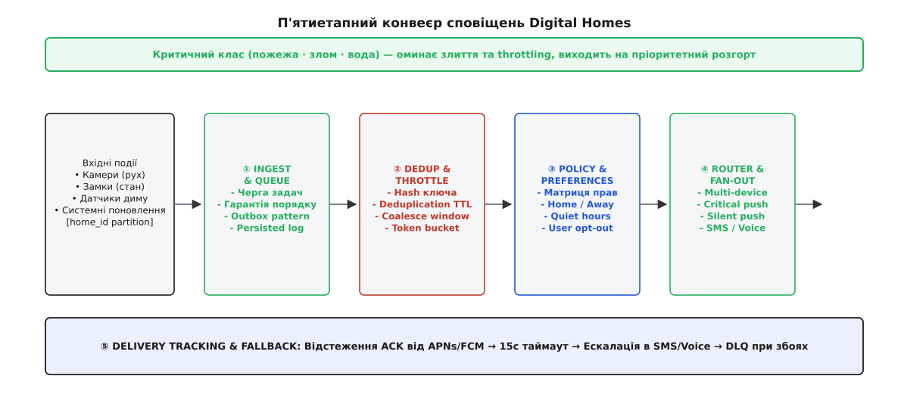
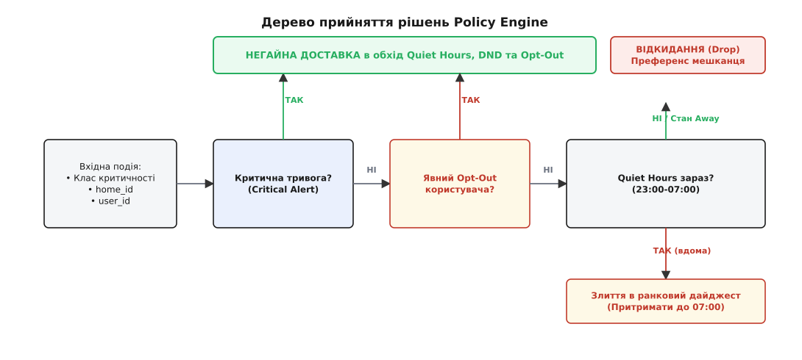
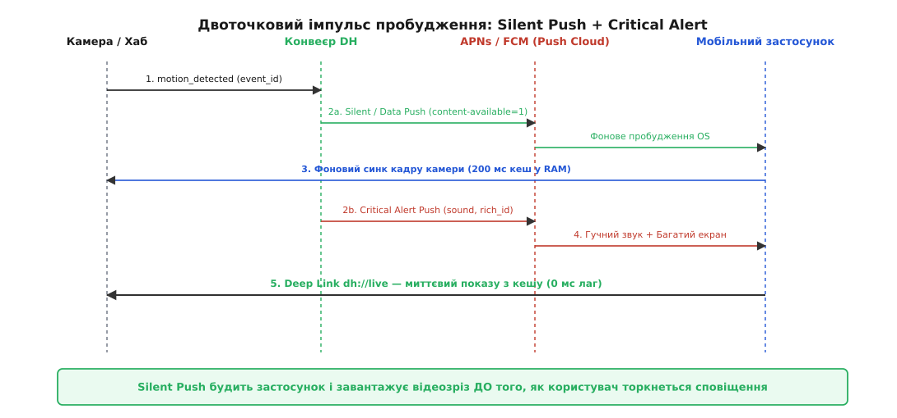
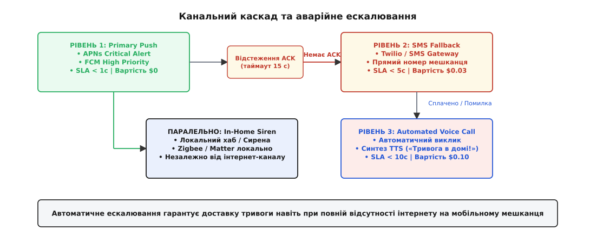

# Конвеєр сповіщень Digital Homes: від сирої події до вчасного виклику

<preknowlist>
- [Дедуп, злиття й throttling сповіщень](root:progarch/nodes-webhooks-notifications/notification-dedup-throttle) — три шари фільтрації шумів: дедуплікація повторів, злиття у дайджести та throttling через відро жетонів.
- [DH як приймач-замовник вебхуків](root:progarch/nodes-webhooks-notifications/dh-webhook-consumer) — розчеплення прийому та обробки, підпис HMAC та асинхронні черги задач.
- [Черга задач](book:programming/background-jobs) — фонове виконання тривалих операцій та відокремлення транзакцій.
- [Гарантії доставки](book:programming/delivery-guarantees) — семантика at-least-once, ретраї з експоненційним backoff та dead-letter queues.
</preknowlist>

О 02:14 ночі зовнішня Wi-Fi-камера на задньому дворі родини Коваленків зафіксувала рух біля гаражних воріт і згенерувала подію `motion_detected`. Модуль комп'ютерного бачення на хабі розпізнав силует людини й надіслав хмарі Digital Homes тривожний сигнал. У цей момент система опинилася перед важким випробуванням. Обидва батьки сплять, їхні телефони перебувають у режимі «Не турбувати» (Do Not Disturb), домашній Wi-Fi працює з перебоями, а на смартфоні батька застосунок DH перебуває у глибокому сні й не бере участі в синхронізації з вечора. Якщо хмара просто відправить стандартне push-сповіщення, операційні системи iOS і Android мовчки заглушать його через нічний режим. Якщо ж користувач прокинеться від сирени й натисне на сповіщення, але застосунок витратить 5 секунд на відкриття сокета й передзавантаження відеокадру з камери — дорогоцінний час буде втрачено на споглядання порожнього індикатора завантаження.

Правильно збудована система сповіщень повинна розв'язувати не лише задачу відправки банерів. Вона має перетворити сирий потік системних евентів на **конвеєр сповіщень** (Notification Pipeline), який гарантує доставку відповідно до рівня критичності (severity), враховує преференси мешканців (user preferences & quiet hours), виконує fan-out на членів родини, будить фоновий синк пристрою ще до звукового сигналу та гарантує миттєвий перехід у live-потік.


*Конвеєр розділяє обробку на п'ять послідовних етапів. Верхня пріоритетна смуга гарантує, що пожежні та охоронні тривоги оминають накопичувальні буфери й виходять на негайний розгорт.*

## Анатомія нічного інциденту: чому наївний push руйнує довіру

Розберімо докладніше, що саме ламається при наївному підході, коли розробники намагаються відправляти push-сповіщення синхронно з коду обробки події.

Коли камера чи датчик фіксує евент, наївний сервіс робить прямий HTTP-запит до API зовнішнього провайдера (APNs або FCM). У цей момент виникають чотири послідовні бар'єри:

1. **Мережева латентність та виснаження потоків:** Зовнішні push-провайдери не надають розрахункових гарантій часу відповіді у реальному часі. У пікові години latency відповіді FCM або APNs може зростати від 50 мілісекунд до 15 секунд. Якщо сервіс обробки евентів робить цей виклик у синхронному потоці, веб-воркери виснажуються, а черга вхідних повідомлень від інших пристроїв дому починає швидко зростати.
2. **Мертве заглушення системними режимами (DND / Focus Modes):** Усі сучасні смартфони мають режими збереження сну. Якщо сповіщення надіслано зі стандартним пріоритетом, iOS та Android не виводять його на екран і не відтворюють звук. Сповіщення мовчки лягає у центр сповіщень, де користувач побачить його лише вранці — коли лік загрози йде на секунди.
3. **Розсинхронізація стану та «Spinning Loader»:** Навіть якщо користувач прокинувся й натиснув на банер, застосунок відкривається на холодну. Йому потрібно підняти мережевий stack, авторизуватися у хмарі, запитати актуальний стан твіна дому й отримати ключ до відеопотоку камери. Поки ці мережеві запити виконуються, користувач бачить білий екран із колесом завантаження. Для систем безпеки це неприпустимо: людина повинна бачити кадр події негайно.
4. **Буря подій (Alert Storm) та ефект «вовк!»:** Якщо 5 зовнішніх камер фіксують гілку дерева, що гойдається від вітру, наївна система генерує 50 пушів за дві хвилини. Телефон користувача дзижчить без зупину. Виснажений користувач відключає сповіщення DH у налаштуваннях операційної системи — і наступного тижня, коли спрацьовує справжній датчик протікання води, ніхто не дізнається про аварію.

Щоб запобігти цьому руйнуванню довіри, сервіс виходу назовні мусить мати чітку п'ятиетапну архітектурну структуру.

## Архітектурний хребет конвеєра: п'ять етапів обробки

Конвеєр сповіщень Digital Homes будується як асинхронна п'ятиетапна система, де кожен етап вирішує власну задачу й відокремлений від сусідніх асинхронними межами.

### Етап 1: Ingest & Partitioning (Прийом та партиціонування)

Сира подія через [outbox pattern](root:progarch/nodes-webhooks-notifications/dh-webhook-consumer) потрапляє у фонову чергу (Redis Streams або Kafka). Події обов'язково партиціонуються за ідентифікатором дому (`home_id`).

Формат вхідного пакета `HomeEvent` має чітку структуру:
```json
{
  "event_id": "evt-89762410-42ab",
  "home_id": "home-42",
  "severity": "CRITICAL",
  "event_type": "motion_detected",
  "title": "Тривога! Рух біля гаража",
  "body": "Камера двору зафіксувала контур людини",
  "timestamp": 1786968854,
  "payload": {
    "camera_id": "cam-yard",
    "snapshot_url": "https://media.dh.example/snapshots/s-89762.jpg",
    "stream_uri": "dh://homes/home-42/cameras/cam-yard/live"
  }
}
```

Партиціонування за `home_id` є ключовим інваріантом масштабування:
- Події в межах одного дому обробляються суворо послідовно (Strict FIFO), зберігаючи хронологічний порядок.
- Події різних домів обробляються паралельно різними воркерами, забезпечуючи високу пропускну здатність платформи без ризику взаємного блокування (Inter-tenant Head-of-Line Blocking).

### Етап 2: Filtering, Deduplication & Throttling (Фільтрація та обмеження темпу)

Спираючись на механіку [notification-dedup-throttle](root:progarch/nodes-webhooks-notifications/notification-dedup-throttle), конвеєр розділяє трафік на два класи. Критичні тривоги (`CRITICAL`) оминають фільтри й переходять на етап маршрутизації негайно. Інформаційні та рутинні події (`LOW`, `DEFAULT`) проходять через хешування ключів дедуплікації, вікна злиття у дайджести (coalescing windows) та відра жетонів (token bucket).

Для некритичних евентів перевіряються три рівні фільтрації:
- **Дедуплікація повторів:** Очищення від однакових подій протягом TTL-вікна за ключем `hash(home_id + event_type + location)`.
- **Злиття у дайджест (Coalescing):** Якщо 40 датчиків зв'язку репортують `offline` через перезавантаження роутера, вони згортаються у єдине сповіщення «40 пристроїв втратили зв'язок».
- **Throttling через Token Bucket:** Накладається стеля на максимальну кількість переривань користувача за годину для запобігання вторам від сумнівних евентів.

### Етап 3: Preferences & Policy Engine (Оцінка преференсій мешканців)

Конвеєр зчитує матрицю налаштувань кожного мешканця дому. На цьому етапі вираховується контекст: чи перебуває родина вдома чи в режимі `Away` (поїздка), чи діють персональні тихі години (`quiet_hours`), і чи не встановив користувач explicit opt-out на конкретну категорію евентів.

### Етап 4: Channel Router & Fan-out (Маршрутизація каналів та розгортання)

Подія для одного `home_id` розгортається (fan-out) на список усіх зареєстрованих мешканців та їхніх мобільних пристроїв. Для кожного пристрою обирається оптимальний комбінований канал: Silent Push, Critical Alert Push, SMS або автоматичний голос.

### Етап 5: Delivery Tracking & Fallback (Відстеження квитанцій та аварійні ретраї)

Шлюз доставки відстежує підтвердження (ACK) від мобільних ОС. Якщо протягом заданого таймауту (наприклад, 15 секунд) підтвердження доставки критичної тривоги не надійшло, конвеєр автоматично ескалює доставку на альтернативний канальний рівень (SMS або Voice Call).

## Преференси мешканця проти системних кампаній: модель даних та інваріанти

Найпоширеніша помилка при проєктуванні сповіщень — вважати преференси користувача простим прапорцем `notifications_enabled: true / false` у таблиці профілю. У реальному житті цифрового дому в одному приміщенні мешкає родина з кількох осіб із різними ролями (власник, член сім'ї, гість), різними графіками сну та різними типами пристроїв.

Модель преференсій Digital Homes вираховується через трійку: **(Користувач, Контекст дому, Категорія події)**.

```
       [Вхідна подія (Severity + EventType)]
                        │
                        ▼
       ┌─────────────────────────────────┐
       │   Критична тривога (CRITICAL)?  │
       └────────────────┬────────────────┘
               ТАК      │      НІ
        ┌───────────────┴───────────────┐
        ▼                               ▼
┌──────────────┐               ┌──────────────────┐
│   НЕГАЙНА    │               │ Явний Opt-Out    │
│  ДОСТАВКА    │               │  користувача?    │
└──────────────┘               └────────┬─────────┘
                                ТАК     │     НІ
                         ┌──────────────┴──────────────┐
                         ▼                             ▼
                 ┌──────────────┐             ┌─────────────────┐
                 │  ВІДКИДАННЯ  │             │ Quiet Hours та  │
                 │   (Drop)     │             │  стан Вдома?    │
                 └──────────────┘             └────────┬────────┘
                                               ТАК     │     НІ
                                        ┌──────────────┴──────────────┐
                                        ▼                             ▼
                                ┌──────────────┐             ┌────────────────┐
                                │   ЗЛИТТЯ У   │             │    ЗВИЧАЙНА    │
                                │  ДАЙДЖЕСТ    │             │    ДОСТАВКА    │
                                └──────────────┘             └────────────────┘
```


*Policy Engine вираховує підсумкове рішення для кожного мешканця. Критичні тривоги йдуть на негайну доставку в обхід будь-яких налаштувань тиші та прапорців Opt-Out.*

При оцінці преференсій конвеєр дотримується двох залізних архітектурних інваріантів:

- **Інваріант 1 (Преференси мешканця вищі за системні кампанії):** Якщо користувач явно вимкнув сповіщення категорії «Статистика енергоспоживання» або «Поради з економії», жодна маркетинг- або продуктова кампанія хмари не має права перебити цей прапорець.
- **Інваріант 2 (Життя та безпека вищі за преференси мешканця):** Події класу `CRITICAL` (пожежна тривога, протікання води, виявлення злому) оминають будь-які налаштування quiet hours, режим DND та прапорці Opt-Out. Системний обов'язок платформи — доставити сигнал тривоги мешканцю за будь-яких умов.

Розглянемо матрицю прийняття рішень для різних комбінацій параметрів:

| Клас події | Контекст дому | Quiet Hours зараз? | Opt-Out користувача? | Підсумкова дія конвеєра |
|---|---|---|---|---|
| `CRITICAL` (Дим/Вода) | Будь-який | Так / Ні | Ігнорується | **Негайна доставка (Critical Push + Mute Bypass)** |
| `HIGH` (Рух у дворі) | `Away` (Відпустка) | Так | Ні | **Негайна доставка** (режим Away скасовує тихі години) |
| `HIGH` (Рух у дворі) | `Home` (Вдома) | Так (02:00) | Ні | **Злиття в ранковий дайджест** (до 07:00) |
| `DEFAULT` (Двері) | `Home` (Вдома) | Ні | Так | **Відкидання (Drop)** на вимогу мешканця |
| `LOW` (Прошивка) | Будь-який | Так | Ні | **Притримання у фоновому буфері** |

> 🔧 **Навіщо це.** Спроба об'єднати системні сповіщення безпеки та маркетинг-розсилки в один уніфікований роутер без чіткого розмежування пріоритетів закінчується тим, що користувачі вимикають сповіщення застосунку на рівні операційної системи. Коли це відбувається, платформа втрачає єдиний прямий канал швидкого зв'язку з людиною в екстреній ситуації.

## Механіка пробудження: від Silent Push до Live-потоку

Коли на телефон надходить звичайне сповіщення «Виявлено рух у дворі», користувач натискає на банер, відкриваючи застосунок. Якщо застосунок перебував у холодному стані (закритий операційною системою для економії пам'яті), йому потрібно пройти повний цикл ініціалізації:

1. Завантажити базовий UI та ініціалізувати контейнер залежностей (300–800 мс).
2. Встановити TLS/QUIC з'єднання з хмарою Digital Homes (200–500 мс).
3. Зробити HTTP-запит на отримання детальної інформації про подію `event_id` (150–300 мс).
4. Запитати у камери або медіа-сервера кадр попереднього перегляду (Snapshot) або ключ для RTSP/WebRTC потоку (500–1500 мс).

Сукупна затримка складає від 2 до 4 секунд. У ситуації тривоги це створює у користувача відчуття гальмування та неконтрольованості.

Щоб усунути цю затримку, конвеєр сповіщень Digital Homes використовує архітектурний шаблон **двоточкового імпульсу пробудження (Dual-Payload Delivery)**.


*Конвеєр одночасно відправляє два пуш-пакети. Silent Push ініціює фоновий синк і кешування кадрів камери у оперативній пам'яті смартфона, тому при натисканні на банер Critical Alert екран Live відкривається з затримкою 0 мілісекунд.*

Механіка двох імпульсів працює наступним чином:

1. **Імпульс A — Silent / Data Push (`content-available: 1` / FCM High Priority Data):** Конвеєр відправляє прихований пуш-пакет, який не створює візуальних банерів чи звуків. Операційна система мобільного пристрою отримує цей пакет і надає застосунку короткий квант фонового часу (up to 30 seconds).
2. **Фонова синхронізація:** Отримавши Silent Push, фоновий модуль застосунку DH негайно відкриває двосторонній легкий з'єднувальний сокет до локального хаба або медіа-проксі та викачує 2-секундний анімований зріз події (Keyframe Snapshot), а також актуальний [твін стану дому](root:progarch/nodes-webhooks-notifications/dh-webhook-consumer). Завантажені байти кладуться в оперативний кеш пристрою.
3. **Імпульс B — Visible / Critical Alert Push:** З невеликим зсувом (або паралельно) конвеєр надсилає видиме критичне сповіщення із заголовком `Rich Notification`. Отримавши цей пакет, ОС рендерить банер і додає до нього зображення з вже готового локального кешу.
4. **Миттєве відкриття (Deep Link):** Користувач чує звук, дивиться на екран і натискає на банер. Застосунок відкривається і миттєво рендерить готовий відеозріз за URI-схемою `dh://homes/home-42/cameras/cam-yard/live?event_id=evt-987` з затримкою **0 мілісекунд**, бо всі дані вже завантажені у пам'ять.

Як показано в [історичному огляді Critical Alerts](root:progarch/nodes-webhooks-notifications/dh-notification-pipeline/hist-critical-alerts.md), операційні системи суворо контролюють часте використання Silent Push. Тому конвеєр генерує фонові пуші виключно для подій високої та критичної важливості, щоб не вичерпати добовий ліміт фонового часу iOS та Android.

## Fan-out на родину та канальна маршрутизація: вартість, SLA та аварійний fallback

Коли подія `CRITICAL` проходить перевірку Policy Engine, конвеєр мусить доставити її всім мешканцям дому. Процес розмноження одного сповіщення на множину адресатів називається **Fan-out**.

У Digital Homes застосовується **Fan-out on-write**: подія записується в чергу доставки для кожного мешканця та кожного його пристрою у момент обробки. Якщо у домі мешкає 4 осіб, і кожен має смартфон та планшет, одна вхідна подія перетворюється на 8 окремих завдань доставки (`DeliveryTask`).

```
                              [Вхідна подія: home-42]
                                         │
                                         ▼
                             ┌──────────────────────┐
                             │ Fan-out on-write     │
                             └───────────┬──────────┘
                                         │
                 ┌───────────────────────┼───────────────────────┐
                 ▼                       ▼                       ▼
          ┌──────────────┐        ┌──────────────┐        ┌──────────────┐
          │ Мешканець 1  │        │ Мешканець 2  │        │ Мешканець 3  │
          └──────┬───────┘        └──────┬───────┘        └──────┬───────┘
                 │                       │                       │
           ┌─────┴─────┐           ┌─────┴─────┐           ┌─────┴─────┐
           ▼           ▼           ▼           ▼           ▼           ▼
        [Phone]     [Tablet]    [Phone]     [Phone]     [Phone]     [Watch]
```

Для кожного пристрою конвеєр вибудовує **канальний каскад (Fallback Ladder)**. Канали сповіщень мають кардинально різну вартість, латентність та рівень гарантії доставки:


*Якщо первинний безкоштовний канал Push не підтверджує доставку за 15 секунд, система автоматично ескалює тривогу до платного SMS-шлюзу або дзвінка.*

1. **Рівень 1 (Primary Push — APNs / FCM):** Безкоштовний канал із низькою латентністю (< 1 секунди). Використовує Critical Alerts для звукового пробиття тиші.
2. **Рівень 2 (SMS Fallback Gateway):** Платний канал ($0.03 за SMS), який використовується, якщо мобільний пристрій мешканця перебуває поза зоною 4G/Wi-Fi покриття (наприклад, у підземному паркінгу або за містом), але зберігає базовий GSM-зв'язок.
3. **Рівень 3 (Automated Voice Call):** Роботизований телефонний дзвінок із текстовим синтаксисом (Text-to-Speech), який телефонує на прямий номер мешканця у випадку невизначеності критичних тривог.
4. **Паралельний рівень (In-Home Intercom / Siren):** Повідомлення надсилається напряму на локальний хаб дому через MQTT/Zigbee для вмикання фізичної сирени, незалежно від наявності зовнішнього інтернету.

Порівняльний аналіз характеристик каналів доставки:

| Канал доставки | Латентність (SLA) | Орієнтовна вартість | Гарантія доставки | Пробудження пристрою |
|---|---|---|---|---|
| **Critical Push (APNs/FCM)** | < 1 сек | $0.00 | Best-effort (потрібен інет) | Пробиває DND та Silent |
| **Silent Push (FCM Data)** | 1–3 сек | $0.00 | Низька (квотується ОС) | Фонове пробудження коду |
| **SMS Gateway (Twilio/Infobip)** | 2–5 сек | ~$0.03 / повідомлення | Висока (GSM мережа) | Стандартний SMS-звук |
| **Voice Call (TTS)** | 5–10 сек | ~$0.10 / виклик | Максимальна (дзвінок) | Фізичний вхідний виклик |
| **In-App Notification Center** | 0 мс (при відкритті) | $0.00 | 100% (у базі даних) | Внутрішньосистемний лог |

## Поведінка під час масових аномалій (Blackout Event Storms)

Особливий випробувальний сценарій для конвеєра сповіщень — це масове вимкнення електроенергії (Blackout). Коли у цілому мікрорайоні зникає світло, 10,000 хабів Digital Homes одночасно переходять на резервні акумулятори й генерують події `power_lost`.

Якщо конвеєр спробує випустити 10,000 індивідуальних push-сповіщень протягом однієї секунди, виникають три загрози:
1. **Вичерпання лімітів SMS-шлюзу:** Якщо пуш-канал затримується, ескаляція створить масовий сплеск SMS-запитів, що призведе до величезних фінансових витрат.
2. **Блокування провайдерами (IP Rate Limiting):** Мережеві сервери FCM сприймуть такий сплеск як DDoS-атаку й тимчасово заблокують IP-адреси воркерів DH.

Для захисту від масових аномалій конвеєр застосовує **географічне злиття евентів (Geo-Coalescing Engine)**. Якщо воркери фіксують понад 100 подій `power_lost` з одного поштового індексу чи підмережі протягом 5 секунд, конвеєр переключається у режим **районного сповіщення**: замість тисяч індивідуальних евентів створюється єдине регіональне сповіщення «Масове знеструмлення у районі Позняки», яке доставляється мешканцям один раз.

## Обробка збоїв, Retry з Backoff та Dead-Letter Queues (DLQ)

Зовнішній світ сповіщень сповнений непередбачуваних помилок. APNs може повернути статус `410 Gone` (це означає, що користувач видалив застосунок і пуш-токен більше не дійсний), SMS-провайдер може відповісти статусом `429 Too Many Requests` через вичерпання лімітів, а мережевий шлюз може розірвати TCP-з'єднання посеред відправки батча.

Для забезпечення стійкості конвеєр реалізує чітку класифікацію помилок та стратегію їх ліквідації:

- **Фатальні помилки пристрою (`410 Gone`, `400 BadDeviceToken`):** Конвеєр не робить повторних спроб відправки. Завдання відкидається, а токен пристрою негайно маркується як недійсний у базі даних користувача. Це запобігає марному витрачанню ресурсів при наступних розсилочних циклах.
- **Тимчасові мережеві помилки (`500 Internal Error`, `503 Service Unavailable`, `429 Rate Limit`):** Конвеєр виконує повторні спроби (Retries) за схемою **Exponential Backoff із Full Jitter**. Використання випадкового шуму (Jitter) є обов'язковим: якщо тисяча завдань одночасно отримає відмову від FCM, без джиттера вони повернуться з повторною атакою точно через 2, 4 та 8 секунд, створюючи ефект [thundering herd](root:progarch/nodes-webhooks-notifications/notification-dedup-throttle).
- **Захист від подвійного надсилання (Outbound Idempotency Key):** При повторній спробі відправки через платіжні чи SMS-шлюзи конвеєр передає унікальний `idempotency_key = hash(event_id + user_id + channel + attempt_window)`. Якщо провайдер вже прийняв та обробив SMS, але відповідь втратилася у мережі, повторний запит із цим ключем не призведе до списування коштів та надсилання другого SMS користувачеві.
- **Dead-Letter Queue (DLQ):** Якщо після `N` спроб (наприклад, 5 повторів протягом 10 хвилин) сповіщення так і не вдалося доставити жодним із каналів, завдання переміщується у Dead-Letter Queue. Супроводжувальні метадані DLQ містять повну історію спроб, коди помилок провайдерів та стан пристрою. Інженери експлуатації (SRE) та системи спостережуваності моніторять розмір DLQ: сплеск у черзі незатребуваних листів є головним індикатором аварії на боці зовнішніх пуш-провайдерів.

Практичний приклад алгоритму маршрутизації, перевірки преференсій та відстеження фатальних і тимчасових помилок наведено у [реалізації конвеєра сповіщень](root:progarch/nodes-webhooks-notifications/dh-notification-pipeline/proj-dh-notification-pipeline.md).

## Підсумкова архітектура та рекап вузла

Конвеєр сповіщень Digital Homes показує, що вихід назовні до людини — це складний архітектурний вузол, який поєднує гарантії асинхронної обробки, управління увагою користувача та аварійну стійкість.

Головні уроки побудови конвеєра:

1. **Не відправляйте пуші синхронно:** Публікація події у фонову чергу з партиціонуванням за `home_id` захищає бізнес-транзакції від затримок зовнішніх мережевих шлюзів.
2. **Розділяйте трафік за критичністю:** Системи безпеки та пожежні тривоги повинні мати пріоритетну смугу, яка оминає злиття, throttling та користувацькі quiet hours.
3. **Використовуйте двохточковий імпульс пробудження:** Silent Push готує мобільний застосунок і кешує медіа-кадри до того, як користувач торкнеться банера сповіщення.
4. **Будуйте канальний каскад із fallback:** Якщо безкоштовний Push не підтверджено протягом 15 секунд, система має автоматично ескалювати сповіщення на SMS або роботизований виклик.
