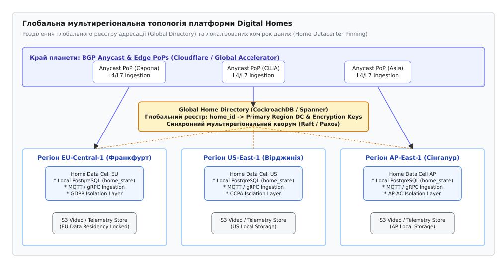
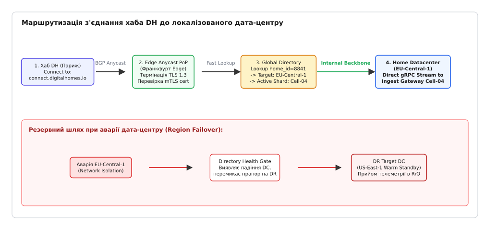
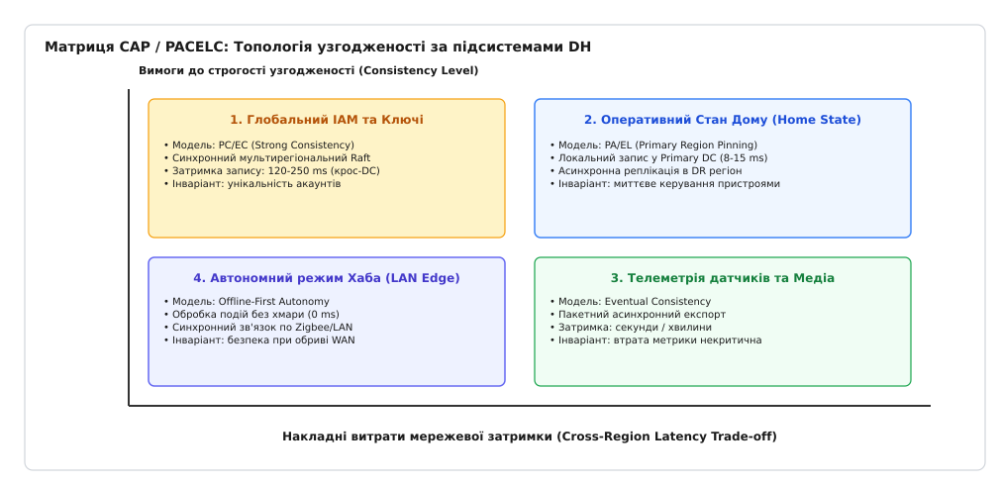
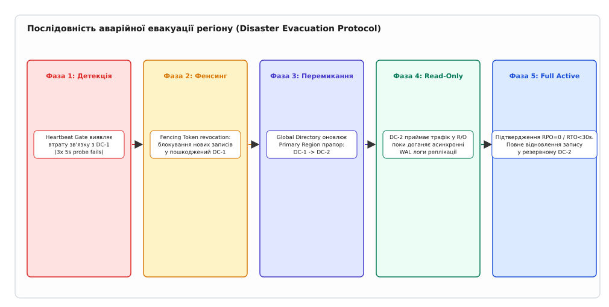

# Компакт-вибір «планета DH»

<preknowlist>
- [Закон Літтла](root:math-probability/littles-law) — зв'язок між кількістю елементів у системі, пропускною здатністю та часом перебування.
- [Теорема CAP](root:sf-distributed/cap-theorem) — фундаментальний компроміс між узгодженістю, доступністю та стійкістю до розщеплення мережі.
- [Багаторівневий розподіл навантаження DH](root:progarch/load-distribution-dh) — балансування вхідного трафіку на краю мережі та L4/L7 термінація.
</preknowlist>

О 04:12 за берлінським часом підводний будівельний драгер під час поглиблення судноплавного каналу у Північному морі перерізав трансатлантичний оптоволоконний кабель. За декілька мілісекунд основний дата-центр хмарної платформи Digital Homes у Франкфурті втратив зв'язок із резервними дата-центрами у Вірджинії та Сінгапурі. У той самий момент понад 400 000 домашніх хабів та мобільних застосунків у Європі спробували синхронізувати стан датчиків. Для команд розробки, які покладалися на синхронну міжрегіональну реплікацію баз даних, цей обрив ознаменував катастрофу: сервіси відкриття дверей заблокувалися в очікуванні відповіді через океан, а бази даних увійшли в стан Split-Brain, знищивши цілісність записів.

Цей інцидент продемонстрував фундаментальну проблему проектування розподілених систем: спроба побудувати єдину глобальну хмару з повністю синхронною узгодженістю даних натрапляє на нездоланні фізичні межі швидкості світла та юридичні бар'єри регулювання даних. Коли флот Digital Homes розростається до мільйонів пристроїв по всій планеті, інженер має зробити свідомий вибір між трьома топологічними моделями: один регіон із гарячим резервом (Active-Passive), розподілений активний масив (Active-Active) чи коміркова архітектура з локалізацією даних хаба (Home Datacenter Pinning).

Історія того, як індустрія проходила цей болючий перехід від складних монолітів до коміркових платформ, описана в історично-технічному екскурсі [📜 Еволюція мультирегіональних архітектур: від Active-Passive до коміркових Active-Active](root:progarch/dh-region-choice/hist-multi-region-evolution.md).

## Фізика швидкості світла, системний стек Linux та регуляторні кордони

Будь-яке проектирування мультирегіональної архітектури починається не з вибору технологій чи баз даних, а з вимірювання географічної відстані між дата-центрами та фізики поширення оптичного сигналу. Мережевий пакет у волоконно-оптичному кабелі рухається зі швидкістю, що становить приблизно `204 218 км/с` (через коефіціент заломлення кварцового скла `n ≈ 1.468`).

З урахуванням реальних вигинів оптичних трас, зварювань на підводних магістралях та затримками L3-маршрутизаторів, мінімальний час кругового обороту пакету (Round Trip Time, RTT) між Франкфуртом (EU-Central) та Вірджинією (US-East) складає `87.1 ms`, а між Вірджинією та Сінгапуром (AP-East) перевищує `212.8 ms`.

Якщо платформа Digital Homes намагається виконати синхронну транзакцію запису з підтвердженням від трьох гео-розподілених дата-центрів (наприклад, через двофазний комміт 2PC), загальний час обробки одного запиту зростає до `400...500 ms`. Для мешканця будинку це означає неприйнятну затримку: після натискання кнопки у застосунку розумний замок відчиняється лише через пів секунди, а відеопотік з камери дверей починає завантажуватися з відчутним запізненням.

Математичне виведення швидкості світла у волокні, оцінка RTT для трансокеанських магістралей та обчислення втрат доступності наведені у математичній вставці [🧮 Математика мультирегіональної доступності, затримок та RPO/RTO](root:progarch/dh-region-choice/math-region-latency-availability.md).

### Мережева фізика Linux ядра для довгих міжрегіональних каналів (LFN)

У розподілених мережах із високим продуктом затримки на смугу (Bandwidth-Delay Product, BDP) стандартні налаштування мережевого стека Linux ядра викликають суттєве падіння пропускної здатності. Для трасувальних міжрегіональних каналів між Франкфуртом та Вірджинією із затримкою RTT `87.1 ms` та каналом `10 Gbps` обсяг BDP становить:

```
BDP = Bandwidth · RTT = (10 · 10^9 bit/s) · 0.0871 s = 871 000 000 bits ≈ 108.87 MB
```

Якщо буфери прийому та передачі сокета ядра Linux (`net.ipv4.tcp_rmem` та `net.ipv4.tcp_wmem`) обмежені стандартними 4 Мбайтами, TCP-вікно (TCP Window Size) закривається, і реальна швидкість реплікації падає з 10 Гбіт/с до всього `36 Мбіт/с`. 

Системні параметри ядра Linux для обслуговування міжрегіональних магістралей вимагають явного налаштування алгоритму конгестійного контролю TCP BBR та розширення вікон:

```ini
# Налаштування буферів для Long Fat Networks (LFN) у /etc/sysctl.conf
net.core.rmem_max = 134217728
net.core.wmem_max = 134217728
net.ipv4.tcp_rmem = 4096 87380 134217728
net.ipv4.tcp_wmem = 4096 65536 134217728
net.ipv4.tcp_congestion_control = bbr
net.ipv4.tcp_window_scaling = 1
```

Простеження стану буферів міжрегіональних сокетів на шлюзах виконується через утиліту `ss` та інспекцію уProcFS:

```bash
# Перевірка розміру буферів та затримки RTT активного сокета реплікації
ss -i -t -m state established '( dport = :5432 or sport = :5432 )'
```

### Юридичні та регуляторні кордони

Поруч із фізичними обмеженнями стоять суворі юридичні рамки регуляторів:

1. **GDPR (Європейський Союз, Статті 44–49):** Категорично забороняє передачу та зберігання персональних даних громадян ЄС (імена, адреси, графіки перебування вдома, відеозаписи з камер спостереження, ідентифікатори BLE-міток) на серверах поза межами Європейського економічного простору (EEA) без спеціальних угод про суверенітет.
2. **CCPA (Каліфорнія, США):** Вимагає надання мешканцям права на повне видалення локальних даних та сувору локалізацію фінансових транзакцій.
3. **Локальні закони про суверенітет даних (AP-Pacific):** Вимагають розміщення інфраструктури обробки телеметрії у межах відповідної держави.

Ці два фактори — фізична затримка світла та юридична резидентність даних — роблять побудову «єдиного глобального басейну даних» не лише недоцільною, а й протизаконною.

> 🔧 **Навіщо це.**
> Розуміння фізичних меж затримки, налаштувань TCP BDP у ядрі Linux та юридичних кордонів дозволяє архітектору Digital Homes розділити систему на два шари: глобальний координатор з низькою інтенсивністю записів (Global Directory) та незалежні регіональні комірки (Home Data Cells), що виконують 99.9% усіх обчислень локально біля користувача.

## Глобальна топологія «Планета DH»: Anycast, Global Directory та Home Data Cells

Для вирішення конфлікту між затримкою, регуляторикою та масштабованістю платформа Digital Homes будується за трирівневою гібридною топологією.


*Глобальна мультирегіональна топологія платформи Digital Homes: розділення глобального реєстру адресації (Global Directory) та локалізованих комірок даних (Home Datacenter Pinning).*

Архітектура «Планета DH» складається з трьох критичних шарів:

### 1. Край планети: BGP Anycast & Edge PoPs
Мережевий край (Edge) використовує BGP Anycast для оголошення єдиного глобального IP-адресу `connect.digitalhomes.io`. Коли хаб або мобільний пристрій ініціює з'єднання, BGP-маршрутизація спрямовує пакети до найближчого точка входу (Edge PoP) у Франкфурті, Ашберні або Сінгапурі.

На краю відбувається термінація TLS 1.3, перевірка mTLS-сертифіката хаба та швидке обчислення цільового регіону (Home Datacenter Pinning). Для прискорення маршрутизації на краю використовуються eBPF-програми (типу `BPF_PROG_TYPE_SK_SKB`), які розпаковують заголовки протоколу без підйому пакету в користувацький простір (User Space).

### 2. Центральний координатор: Global Home Directory
Центральним елементом глобальної адресації є `Global Home Directory` — гео-розподілений кластер баз даних (на базі CockroachDB або Google Spanner) з синхронним консенсусом Raft/Paxos між трьома основними дата-центрами.

Global Directory зберігає строго мінімальний набір даних:
- Мапінг `home_id -> Primary Region DC` (наприклад, `home_8841 -> eu-central-1`).
- Мапінг `home_id -> Failover Region DC` (наприклад, `home_8841 -> us-east-1`).
- Публічні криптографічні ключі автентифікації хаба.
- Лічильник епохи фенсингу (`fencing_epoch`).

Обсяг даних у Global Directory не перевищує кількох гігабайтів, а інтенсивність операцій запису надзвичайно мала (виконується лише при реєстрації нового будинку або продажу хаба іншому господарю). Це дозволяє витримати синхронну кворумну затримку в `90 ms` без деградації системи.

### 3. Локалізовані комірки даних: Home Data Cells та ізоляція штампів
Кожен регіональний дата-центр містить автономні комірки обробки даних (Home Data Cells). Для обмеження радіусу вибуху (Blast Radius) комірки розбиваються на штампи (Stamps) ємністю не більше 50 000 домашніх хабів на штамп.

Коли будинок закріплюється за дата-центром (наприклад, `EU-Central-1`, Stamp-04), усі його операційні дані — оперативний стан пристроїв `home_state`, історія сенсорів, розклад автоматизацій та відеоархіви — зберігаються **виключно у цій комірці**.

Локальна база даних (кластер PostgreSQL із патиціонуванням за `home_id`) обробляє операції запису з затримкою всього `8...15 ms`. Дані європейських будинків ніколи не залишають межі Франкфурта у штатному режимі роботи.

Процес маршрутизації клієнтського з'єднання від Edge PoP до локалізованого дата-центру показано на діаграмі:


*Маршрутизація з'єднання хаба DH: від BGP Anycast термінації на краю через швидкий lookup у Global Directory до прямого gRPC-стриму в локалізовану комірку даних.*

Детальна специфікація продуктового геомаршрутизатора з кодовими прикладами на мовах Go та C++ представлена у практичній вставці [⚙️ Практична реалізація георутера та диспетчера Home Datacenter Pinning](root:progarch/dh-region-choice/proj-dh-georouter.md).

## Матриця компенсацій CAP/PACELC за доменами Digital Homes

Різні бізнес-домени платформи Digital Homes мають кардинально різні вимоги до узгодженості даних та допустимої затримки. Спроба застосувати єдину модель узгодженості для всієї системи є типовою архітектурною помилкою.

Для збалансування системних вимог використовується теорема PACELC, яка розділяє компенсації на чотири домени:


*Матриця CAP / PACELC: топологія узгодженості та розподіл вимог до затримки за підсистемами платформи Digital Homes.*

Розглянемо чотири квадрати узгодженості платформи:

### 1. Глобальний IAM та облікові записи (Модель PC/EC — Strong Consistency)
- **Бізнес-домен:** Реєстрація користувачів, ротація паролів, відкликання API-ключів.
- **Вимога:** Абсолютна унікальність email/login по всьому світу та миттєве блокування вкрадених токенів.
- **Реалізація:** Синхронна реплікація через Global Directory. Запис вимагає підтвердження кворуму Raft у 2 з 3 регіонах (`RTT ~ 90 ms`). Висока затримка запису є цілком прийнятною, оскільки користувач змінює пароль вкрай рідко.

### 2. Оперативний стан дому (Модель PA/EL — Primary Region Pinning)
- **Бізнес-домен:** Перемикання вимикачів, відкриття замків, зміна уставок термостатів.
- **Вимога:** Низька затримка (`< 50 ms`) та відсутність конфліктів редагування.
- **Реалізація:** Усі операції запису спрямовуються строго до Primary Home Datacenter. Локальний транзакційний PostgreSQL гарантує ACID-властивості. У резервний DR-регіон логи WAL передаються асинхронно через слот реплікації (`pg_logical` / `pg_receivewal`) з лагом `< 2.5 s`.

### 3. Телеметрія датчиків та Медіа (Модель Eventual Consistency)
- **Бізнес-домен:** Графіки температури, рівень вологості, енергоспоживання за місяць, прев'ю відеокамер.
- **Вимога:** Величезна пропускна здатність запису (сотні тисяч подій на секунду) при допустимості тимчасової затримки відображення.
- **Реалізація:** Асинхронний пакетний експорт (Batch Export) через розподілений брокер Kafka / NATS JetStream у часові бази даних (ClickHouse) та об'єктні сховища S3 з кінцевою узгодженістю (Eventual Consistency).

### 4. Автономний режим Хаба (Offline-First Autonomy)
- **Бізнес-домен:** Локальні сценарії автоматизації (наприклад: «якщо датчик руху виявив присутність о 23:00 — увімкнути світло в коридорі»).
- **Вимога:** Повна працездатність будинку при використанні локальної мережі LAN, навіть при повному зникненні зовнішнього інтернету.
- **Реалізація:** Локальна база даних SQLite на фізичному хабі. Події обробляються прямо на пристрої з затримкою `0 ms` без участі хмари.

> 🔧 **Навіщо це.**
> Матриця PACELC знімає з архітектора обов'язок «вибирати одну базу даних для всього проєкту». Вона дозволяє комбінувати суворий міжрегіональний консенсус для IAM із низькозатримковим локальним записом для стану будинку та асинхронним потоком для аналітики.

## Механізми міжрегіональної синхронізації баз даних та PostgreSQL WAL Shipping

Для підтримки гарячого резерву (Warm Standby) у резервному дата-центрі без жертвування затримкою первинного запису використовується асинхронний механізм передавання логів передзапису (Write-Ahead Logging, WAL Shipping).

У локальній комірці PostgreSQL дата-центру `EU-Central-1` кожна транзакція записується у локальний журнал WAL на NVMe-накопичувач. Процес `walwriter` підтверджує транзакцію клієнту одразу після запису на локальний диск (затримка `8...12 ms`).

У фоновому режимі процес `walsender` через фізичний слот реплікації передає блоки WAL-логів до потокового приймача `walreceiver` у дата-центрі `US-East-1`:

```sql
-- Перевірка стану міжрегіонального слота реплікації у PostgreSQL
SELECT 
    slot_name,
    plugin,
    active,
    active_pid,
    pg_size_bytes(pg_wal_lsn_diff(pg_current_wal_lsn(), restart_lsn)) AS replication_lag_bytes
FROM pg_replication_slots
WHERE slot_name = 'dr_us_east_1_slot';
```

Налаштування слота реплікації вимагає суворого обмеження максимального накопичення WAL-файлів (`max_slot_wal_keep_size = 64GB`). Якщо міжрегіональний канал зв'язку переривається більше ніж на 2 години і обсяг накопичених логів перевищує 64 ГБ, слот автоматично інвалідується, щоб запобігти вичерпанню дискового простору на первинному дата-центрі.

У разі інвалідації слота після відновлення мережі резервний дата-центр виконує повне базове копіювання (`pg_basebackup`) у фоновому режимі без зупинки роботи основного DC.

## Протокол аварійної евакуації регіону, репатріація та запобігання Split-Brain

Катастрофічні події у дата-центрах — знеструмлення стойок, пожежі, аварії магістральних провайдерів або помилки фонового вакуумування баз даних — вимагають наявності чіткого алгоритму **аварійної евакуації регіону** (Region Evacuation).

Головна небезпека під час евакуації — виникнення аномалії **Split-Brain** (розщеплення мозку). Якщо первинний дата-центр DC-1 зазнав неповного обриву мережі (Asymmetric Partition) і продовжує приймати локальні операції запису, а георутер уже перенаправив новий трафік на резервний DC-2 і дозволив там запис, дані двох дата-центрів незворотно розійдуться.

Щоб повністю усунути ризик Split-Brain, протокол евакуації Digital Homes виконується у п'ять суворо послідовних фаз:


*П'ять фаз протоколу евакуації регіону: від детекції аварії та відкликання Fencing токенів до перемикання прапора в Global Directory та виходу в режим Full Active.*

Детальний розбір кожної фази евакуаційного протоколу:

### Фаза 1: Детекція аварії (Detection Phase)
Глобальні сервіси Health Gate виконують глибоку перевірку (Deep Health Check) кожного дата-центру кожні 5 секунд. Перевіряється не лише мережевий ping, а й можливість виконання прочитання/запису у локальний дисковий масив. Якщо 3 послідовні проби по 5 секунд завершуються помилкою (`503 Service Unavailable` або `Timeout`), регіон оголошується деградованим.

### Фаза 2: Примусова ізоляція (Fencing Phase)
Перш ніж дозволити операції запису у резервному дата-центрі, евакуаційний контролер викликає `Fencing Protocol API`. Контролер інкрементує лічильник епохи фенсингу `fencing_epoch = N + 1` у Global Directory та надсилає команду ізоляції у пошкоджений DC-1.

Усі шлюзи та бази даних пошкодженого DC-1 миттєво відкликають ключі запису та відхиляють будь-які нові транзакції з кодом помилки `FENCING_EPOCH_STALE`. На мережевому рівні eBPF/XDP фільтр скидає вхідні TCP-пакети на порт 5432 та 443.

### Фаза 3: Оновлення глобального реєстру (Directory Switch Phase)
Після підтвердження виконання фенсингу контролер виконує кворумну транзакцію в Global Directory, змінюючи прапор первинного дата-центру для всіх постраждалих будинків: `Primary Region: DC-1 -> DC-2`.

### Фаза 4: Прийом трафіку в режимі Read-Only (Catch-up Phase)
Edge Anycast PoP починає спрямовувати трафік хабів до резервного DC-2. Проте протягом перших 10–30 секунд DC-2 приймає запити **виключно в режимі Read-Only**. Цей час необхідний для того, щоб асинхронний реплікаційний ресівер догнав незавершені логи WAL з буфера передачі.

### Фаза 5: Повне відновлення (Full Active Phase)
Після підтвердження того, що лаг реплікації дорівнює нулю (`RPO = 0`), контролер знімає прапор обмеження запису. Резервний DC-2 переходить у стан `Full Active`, забезпечуючи повне обслуговування будинків. Загальний час відновлення становить `RTO ≤ 60 секунд`.

### Фаза 6: Повернення додому — репатріація регіону (Repatriation Phase)
Коли пошкоджений дата-центр DC-1 відновлює живлення та мережевий зв'язок, він **не має права** одразу приймати трафік. Контролер ініціює зворотну реплікацію: змінений стан будинків з DC-2 синхронізується назад у DC-1. Лише після вирівнювання WAL-логів контролер знижує ролі й повертає первинний прапор `Primary Region: DC-1`.

Опис REST/gRPC контрактів Health Gate, JSON-схем токенів та правил Fencing API наведено у довідниковій вставці [📋 Декларативна специфікація топології регіонів та інтерфейси евакуації DH](root:progarch/dh-region-choice/api-region-topology-contract.md).

## Захист від шторму реконектів та джиттер на краю

Під час аварійної евакуації регіону або масового відновлення мережі сотні тисяч хабів одночасно намагаються встановити нові TCP/TLS-з'єднання з резервним дата-центром. Цей феномен називається **штормом реконектів** (Reconnect Storm / Thundering Herd).

Якщо 500 000 хабів одночасно виконують асиметричні криптографічні обчислення TLS 1.3 (ECDHE-RSA рукостискання), навантаження на процесори мережевих шлюзів у резервному DC зростає у десятки разів. Це викликає вичерпання CPU, ріст затримки обробки та активацію Linux Kernel OOM Killer.

Для захисту резервного дата-центру клієнтський SDK хаба Digital Homes реалізує алгоритм експоненційного відступу з повним джиттером (Exponential Backoff with Full Jitter):

```python
# Алгоритм обчислення затримки повторного підключення хаба з джиттером
import random, math

def calculate_reconnect_delay(attempt: int, base_delay: float = 1.0, max_delay: float = 60.0) -> float:
    temp = min(max_delay, base_delay * (2 ** attempt))
    sleep_seconds = random.uniform(0, temp)
    return sleep_seconds
```

Завдяки додаванню випадкового джиттеру `random.uniform(0, temp)` сплеск 500 000 одночасних підключень рівномірно розтягується у часі протягом 60 секунд. Це знижує пікову інтенсивність TLS-рукостискань від 500 000 RPS до безпечних 8 300 RPS, дозволяючи резервному дата-центру плавно прийняти навантаження.

### Безперервні навчання катастрофостійкості (Chaos Engineering)

Для того щоб перевірити реальну дієвість алгоритмів джиттеру та Fencing API, інфраструктурна команда Digital Homes проводить щотижневі автоматичні навчання з імітації падіння регіонів.

Спеціалізований інструмент Chaos Engine без попередження команди розробки відключає мережевий інтерфейс основного дата-центру у робочий час. Це дозволяє переконатися, що RTO у реальних умовах не перевищує 60 секунд, а відсоток помилок на краю мережі залишається у межах SLA.

Оновлення конфігураційних схем у Global Directory виконується беззупинно (Zero-Downtime Rolling Update) за допомогою двофазного розширення контрактів. Це гарантує збереження сумісності між старими й новими версіями геомаршрутизаторів під час оновлення інфраструктури.

Управління ланцюжками довіри міжрегіональних TLS-сертифікатів здійснюється за допомогою автоматичного протоколу ACME/Vault. Кожен регіон володіє власним локальним Intermediate CA, підпорядкованим глобальному Root CA. Це дозволяє резервному дата-центру випускати валідні сертифікати доступу навіть при виконанні дій у стані повної мережевої ізоляції від основної інфраструктури компанії.

### Контроль ланцюжків PKI та автономна ротація сертифікатів

У мультирегіональній системі з автономними шлюзами ротація криптографічних сертифікатів є критичним компонентом високої доступності. Кожен регіональний дата-центр володіє власним локальним Intermediate CA, який випускає та продовжує mTLS-сертифікати доступу для домашніх хабів.

Під час можливої ізоляції дата-центру від центральної інфраструктури локальний Intermediate CA продовжує функціонувати повністю автономно. Він продовжує термін дії клієнтських сертифікатів хабів без звернення до глобального Root CA. Такий підхід виключає блокування нових пристроїв та втрату доступу користувачів під час тривалих обривів міжрегіональних магістралей.

## Практичний інспекційний гайд для SRE-інженерів під час евакуації

Під час виникнення критичного інциденту інженери чергової зміни (SRE/Infrastructure Team) виконують діагностику та ручне виклики евакуаційного інструментарію через консольну утиліту `dh-ctl`.

Послідовність дій чергового інженера:

1. **Перевірка поточного стану регіональних слотів:**
```bash
dh-ctl region status --cluster=planet-dh-global
```
Вивід показує поточну активність дата-центрів, інтенсивність помилок HTTP 5xx та лаг міжрегіональної реплікації у секундах.

2. **Ручна ініціація евакуації деградованого регіону:**
```bash
dh-ctl region evacuate --region=eu-central-1 --target-dr=us-east-1 --reason="Subsea cable physical cut"
```
Команда запускає Fencing Protocol, інкрементує `fencing_epoch` у Global Directory та переключає Anycast-маршрути на резервний DC.

3. **Моніторинг стану репатріації після відновлення:**
```bash
dh-ctl region sync-status --src=us-east-1 --dst=eu-central-1
```
Утиліта відображає прогрес зворотного вирівнювання WAL-логів перед поверненням первинної ролі дата-центру.

## Живий сценарій міграції дому між регіонами (Online Tenant Migration)

Розглянемо практичну інженерну задачу, яка виникає під час життя платформи: мешканець будинку `home_8841` переїхав із Берліна до Нью-Йорка і перевіз із собою домашній хаб Digital Homes. 

Потрібно виконати онлайн-міграцію закріплення дому з дата-центру `EU-Central-1` (Франкфурт) до дата-центру `US-East-1` (Вірджинія) без зупинки роботи локальних датчиків та з дотриманням законодавства.

Процедура міграції виконується за вісім кроків:

1. **Ініціалізація сесії міграції:** Оркестратор видає команду `CreateMigrationSession(home_id=8841, src=EU, dst=US)`.
2. **Створення знімка стану (Snapshot Creation):** У Франкфурті створюється узгоджений знімок бази даних `home_state` для даного `home_id` на фіксованій позиції логу `LSN_1048200`.
3. **Фонове копіювання дампів (Bulk Data Transfer):** Знімок передається по шифрованому внутрішньому каналу AWS DirectConnect до дата-центру Вірджинії та розпаковується у цільову комірку.
4. **Асинхронний дельта-синхронізм (Delta Catch-up):** Поки йде копіювання знімка (тривалість ~ 4 секунди), хаб продовжує надсилати нові телеметричні події до Франкфурта. Ці події накопичуються у дельта-буфері й передаються до Вірджинії через дельта-стрим.
5. **Встановлення паузи на запис (Short Write Lock):** Оркестратор надсилає точковий прапор `WriteLock(home_id=8841, ttl=2s)` на шлюз у Франкфурті. Запити від даного хаба тимчасово затримуються на 300 мілісекунд у буфері ingress-проксі.
6. **Остаточний догон дельти (Final Sync):** Решта незастосованих WAL-записів застосовується у Вірджинії.
7. **Перемикання покажчика у Global Directory:** Виконується синхронна Raft-транзакція у Global Directory: `home_8841.primary_region = US-East-1`.
8. **Зняття блокування та відправка кадру GOAWAY:** Франкфурт відправляє хабу кадр `HTTP/2 GOAWAY`, примушуючи хаб перепідключитися. Наступний запит георутера спрямовує хаб до Вірджинії. Загальний час блокування запису для користувача становить менше 400 мілісекунд.

## Економічний розрахунок вартості міжрегіонального трафіку (Multi-Region TCO)

Окрім латентності та регуляторних правил, важливим фактором вибору топології є вартість міжрегіонального передавання даних (Cross-Region Data Egress). У публічних хмарах (AWS, GCP, Azure) трафік усередині одного дата-центру є безкоштовним, але вихідний міжрегіональний трафік корисних даних або WAL-реплікації тарифікується за ціною від `$0.02` до `$0.09` за кожен Гігабайт.

Обчислимо щомісячні витрати на мережевий трафік для флоту з `N = 2 000 000` хабів Digital Homes при двох архітектурних підходах:

### Варіант А: Суцільна симетрична Active-Active реплікація (Усі телеметричні події реплікуються в 3 DC)
Кожен хаб генерує 500 байтів телеметрії кожні 30 секунд. Сумарний обсяг даних від одного хаба за місяць становить:

```
V_hub = (500 B / 30 s) · 3600 s · 24 h · 30 days ≈ 1.296 GB / місяць
```

Загальний обсяг первинної телеметрії для 2 мільйонів хабів:

```
V_total = 2 000 000 · 1.296 GB ≈ 2 592 000 GB ≈ 2.59 PB / місяць
```

При суцільній Active-Active реплікації у 2 віддалені дата-центри міжрегіональний трафік множиться на 2:

```
V_egress = 2.59 PB · 2 = 5.18 PB / місяць
```

Щомісячний рахунок виключно за міжрегіональний трафік при тарифі `$0.05 / GB`:

```
Cost_Active_Active = 5 180 000 GB · $0.05 = $259,000 / місяць
```

### Варіант Б: Коміркова архітектура «Планета DH» (Home Datacenter Pinning)
Телеметрія обробляється локально і не виходить за межі первинного DC. У резервний DC реплікується лише дельта оперативного стану `home_state` (обсяг трафіку у 20 разів менший, ~250 TB/місяць).

```
Cost_Planet_DH = 250 000 GB · $0.05 = $12,500 / місяць
```

**Економічний висновок:** Коміркова архітектура Home Datacenter Pinning заощаджує понад **$246,500 на місяць** (понад $2.95 мільйонів на рік) лише на вихідному міжрегіональному трафіку порівняно з симетричним Active-Active.

## Компакт-матриця прийняття рішень та ADR за схемою «Планета DH»

Під час проектирування нової лінії продуктів або виходу на нові континентальні ринки інженерна команда Digital Homes використовує компактну матрицю архітектурних рішень (Architectural Decision Framework).

Матриця дозволяє вибрати оптимальну топологію мультирегіональності на основі трьох вхідних параметрів: бюджету інфраструктури, вимог RTO/RPO та специфіки бізнес-домену.

### Матриця вибору топології мультирегіону

| Критерій оцінки | Модель 1: Single Region + DR (Cold/Warm Standby) | Модель 2: Multi-Region Active-Active (Symmetric) | Модель 3: Cell-Based Home Pinning (Планета DH) |
| :--- | :--- | :--- | :--- |
| **Цільовий RTO (Час простою)** | 1 — 4 години | < 5 секунд | < 60 секунд (автоматично) |
| **Цільовий RPO (Втрата даних)** | 15 хвилин — 1 година | 0 (Синхронний кворум) | < 2.5 с (або 0 для LAN) |
| **Затримка керування (Latency SLA)** | 15 — 30 ms (у межах регіону) | 120 — 250 ms (крос-DC затримка) | 8 — 15 ms (локальна комірка) |
| **Відповідність GDPR/CCPA** | Низька (усі дані в одному DC) | Важка (потрібен складний шардинг) | Ідеальна (Data Residency Lock) |
| **Складність інфраструктури** | Низька (один стек + бекапи) | Екстремально висока (2PC / Spanner) | Поміркована (Edge Router + Cell) |
| **Відносний бюджет ($/місяць)** | 1.0x (базовий вартісний рівень) | 2.8x (дублювання + крос-DC трафік) | 1.35x (локальні комірки + Edge) |

### Підсумковий алгоритм прийняття рішення (Decision Flowchart)

Дерево прийняття рішень для архітектора платформи:

1. **Чи вимагає бізнес-домен затримки обробки запису `SLA < 50 ms`?**
   - **НІ:** Використовувати *Модель 2 (Multi-Region Active-Active)* із синхронним Raft-консенсусом (ідеально для глобального IAM, авторизації та білінгу).
   - **ТАК:** Перейти до кроку 2.

2. **Чи підпадають дані користувачів під дії законів про суверенітет (GDPR / CCPA)?**
   - **ТАК:** Використовувати *Модель 3 (Cell-Based Home Pinning)* із прапором `dataResidencyLocked = true`. Оперативні дані замикаються у регіоні реєстрації.
   - **НІ:** Перейти до кроку 3.

3. **Чи перевищує допустима вартість простою (Downtime Cost) $50,000 на годину?**
   - **НІ:** Використовувати *Модель 1 (Single Region + Warm Standby)*. Це заощаджує 35% бюджету інфраструктури при збереженні прийнятного RTO ~ 1 години.
   - **ТАК:** Використовувати *Модель 3 (Cell-Based Home Pinning)* з автоматичним контролером евакуації та резервуванням у сусідньому DC.

### Шаблон документу архітектурного рішення (ADR-027: Multi-Region Topology)

При фіксації рішення у проєкті використовується стандартний формат ADR (Architecture Decision Record):

```text
ADR-027: Вибір мультирегіональної топології для платформи Digital Homes

Статус: ПРИЙНЯТО
Контекст:
Флот пристроїв DH досяг 2 000 000 хабів у Європі та Північній Америці.
Синхронна міжрегіональна реплікація створює затримки > 200 ms, що порушує SLA керування замками (< 50 ms).
Вимоги GDPR забороняють вихід персональних даних громадян ЄС за межі дата-центру у Франкфурті.

Рішення:
Впровадити гібридну коміркову топологію "Планета DH" (Cell-Based Home Pinning):
1. Глобальний IAM та адресація: CockroachDB (Raft consensus між EU, US, AP).
2. Оперативний стан будинку: PostgreSQL local cell у Primary DC з асинхронним WAL-резервуванням у DR регіон.
3. Евакуація: Автоматичний Fencing Protocol з RTO < 60s та RPO < 2.5s.

Наслідки:
+ Затримка запису для локального дому знизилася до 12 ms.
+ Повна відповідність вимогам GDPR Article 44.
- Необхідність підтримки контролера Fencing API та георутера на краю мережі.
```

Дотримання цієї архітектурної дисципліни дозволяє платформі Digital Homes поєднувати високу швидкість відгуку розумного будинку на краї мережі, сувору відповідність законодавству та виняткову катастрофостійкість під час глобальних мережевих катаклізмів.
