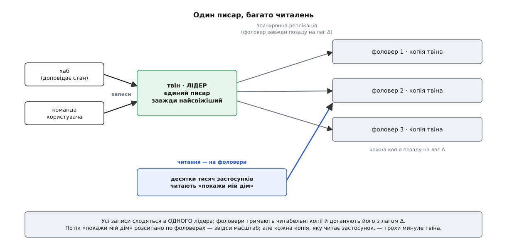
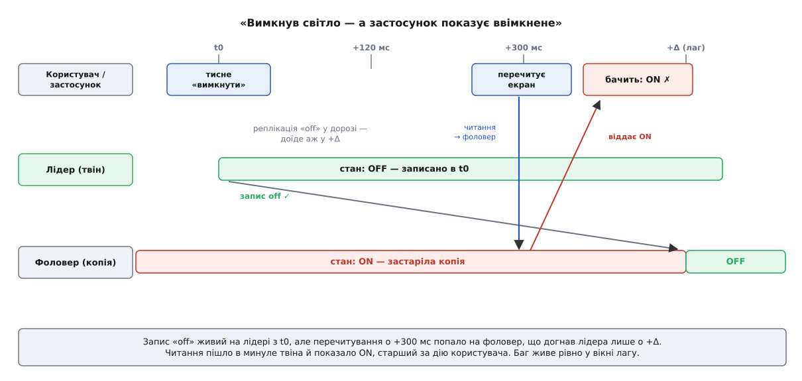

# Твін дому на репліках

<preknowlist>
- [Лідер-фоловер](topic:sf-distributed/replication-leader-follower) — записи йдуть в одну копію-лідера, а фоловери тримають її читабельні копії; це той механізм, над яким ми тут маршрутизуємо.
- [Реплікаційний лаг](topic:sf-distributed/replication-lag) — фоловер відстає від лідера на якийсь час; read-your-writes і монотонні читання — сесійні гарантії, що тут на кону.
</preknowlist>

Наприкінці модуля про кеш ми лишили на порозі одну мовчазну умову: перший кеш DH працював, **бо процес був один**. Відтоді дім переріс і цю умову, і саму одну машину. Тепер Digital Homes обслуговує близько пів мільйона домів, і та єдина база, що тримала правду в [v3](root:progarch/dh-v3-storage), стала двома різними проблемами водночас. По-перше, вона — одна точка відмови: помер вузол, і разом із ним зникла вся правда про всі доми. По-друге, навіть жива, вона більше не встигає: «покажи мій дім» летить у неї десятки тисяч разів на секунду, і кеш перед нею гасить далеко не все.

Відповідь, яку ми щойно розібрали, — **копії даних на різних вузлах** (репліки; лат. *replica* — точна копія, повторення). Один вузол призначаємо [лідером](topic:sf-distributed/replication-leader-follower): усі записи йдуть тільки в нього. Решта — фоловери, кожен тримає власну копію й безперервно доганяє лідера. Помер лідер — його місце заступає фоловер, і правда не гине разом із залізом. А заразом ці читабельні копії можна поставити під потік читань: хай застосунки читають із фоловерів, а лідер зайнятий лише записом. Виглядає як подарунок: і витривалість, і розвантаження, і майже задарма.

Цей крок — про те, що задарма не буває. Копія, яка доганяє, за визначенням **позаду**. І щойно ми пустимо читання по копіях, у DH проступить баг, якого на одній машині не існувало в принципі: **вимкнув світло, а застосунок показує ввімкнене**. Розберімо, звідки він береться, чому «зробити скрізь суворо» — хибний рефлекс, і як натомість розкласти читання дому на класи так, щоб замок був завжди чесний, а телеметрія — дешева.

## Твін: копія дому, яку читає застосунок

Спершу назвімо річ, яку ми збираємося копіювати, бо без імені далі буде плутанина. Застосунок ніколи не тягнеться в саму кімнату по дріт. Коли ти відкриваєш екран дому, ти дивишся не на реле й не на давач — ти дивишся на **серверну модель** свого дому: які пристрої є, у якому вони стані, скільки зараз °C. Фізичний [хаб](root:progarch/dh-v0-one-sensor) під стелею доповідає серверу про кожну зміну, сервер її записує, а застосунок читає вже цей серверний відбиток. Оцей відбиток — дзеркало живого дому на боці хмари — і є **твін** (англ. *twin* — близнюк).

Слово не наше й не випадкове: у промисловості цифровим твіном (digital twin) називають саме таку живу серверну копію фізичного об'єкта, а хмарні IoT-платформи возять цей патерн під назвою «тінь пристрою» (device shadow) вже понад десятиліття. [Звідки взявся сам термін — від фізичних дублів кораблів Apollo до хмарних тіней пристроїв](root:progarch/dh-replicas/hist-digital-twin.md) — коротка історія варта окремої зупинки; тут досить втримати суть. Твін дає застосунку читати стан дому, **не турбуючи щоразу залізо**: швидко, з одного місця, навіть коли сам хаб на мить відвалився. У DH твін живе рядком у таблиці `device.state` нашого v3-сховища — саме тим стовпчиком, що «міняється щосекунди», який ми свідомо [лишили читатися наживо, не кешуючи](root:progarch/dh-first-cache).

Ключове тепер таке: доки твін жив в одній базі, читати його було те саме, що читати правду. Щойно ми розмножили базу на лідера й фоловерів, твін теж розмножився — і кожна його копія стала окремою відповіддю на питання «а який стан насправді?».


*Один писар, багато читалень. Хаб і команди пишуть у твін **лише через лідера**; лідер безперервно доганяється фоловерами. Потік читань «покажи мій дім» розсипається по фоловерах — так база тримає масштаб. Але кожен фоловер відстає від лідера на лаг реплікації, тож копії, які читає застосунок, — це завжди трохи **минуле** твіна.*

## «Розведімо читання» — і що з цього ламається

Ідея розвести читання проста й правильна: писати мало, читати багато, тож хай численні читання обслуговують численні копії. Застосунок б'є «покажи мій дім» кожні кілька секунд, таких застосунків — десятки тисяч одночасно; лідер один і зайнятий записами, а фоловерів можна доставити скільки треба, і кожен зніме на себе частку читань. Балансувальник перед фоловерами розкидає запити, і раптом читальна стеля системи більше не впирається в одну машину.

І ось у цю злагоджену картину входить звичайнісінький сценарій. Хтось у застосунку тисне «вимкнути обігрівач». Команда долітає до хаба, реле клацає, а на сервері новий стан лягає записом у твін — **на лідері**, бо всі записи тільки туди. Лідер тепер чесно каже: `off`. За частку секунди застосунок робить те, що робить завжди після дії, — перечитує екран, щоб показати результат. І це читання балансувальник відправляє на **фоловер** — той, що читань обслуговує багато, а лідера догнати ще не встиг. Фоловер віддає копію, у якій запис «off» ще не доїхав. На екрані — `on`.

Користувач щойно власноруч вимкнув обігрівач і за пів секунди бачить, що той начебто ввімкнений. Він не помилився, система не загубила його команду — запис живий-живісінький на лідері. Просто читання пішло в **минуле твіна**, у копію, старшу за його власну дію. Це і є [реплікаційний лаг](topic:sf-distributed/replication-lag) на дотик, і конкретно тут він порушує найінтуїтивнішу гарантію, яку користувач взагалі має від системи: **read-your-writes** — «свою власну зміну я мушу бачити одразу». Порушили саме її, і жоден лог помилок про це не крикне, бо помилки й немає: усе спрацювало «за фізикою копій».


*Той самий запис, дві копії, різний час. У t0 «off» лягає на лідера. Реплікація доїде до фоловера за Δ — під навантаженням це від десятків мілісекунд до секунд. Якщо перечитування екрана трапилось усередині цього Δ і попало на ще-не-догнаний фоловер, застосунок показує `on` — стан, старший за дію користувача. Баг живе рівно у вікні лагу.*

> 🔧 **Навіщо це.** Читання застарілої копії з фоловера підступніше за звичайний промах кеша, і не через технічну складність, а через те, чию довіру воно ламає. Промах кеша — це «трохи повільніше»; а тут користувач бачить, що **його власна щойно-дія наче не відбулася**. Для лампи це дратує; для дверного замка це вже не косметика: застосунок каже «замкнено», а двері насправді ще відчинені, або навпаки. Тому перше питання рев'ю до будь-якого читання на репліках — не «швидко чи ні», а «а чи може сюди прилетіти власний свіжий запис користувача, якого він мусить побачити?». Де може — лаг стає багом, не дрібницею.

## Хибний рефлекс: «зробімо скрізь суворо»

Побачивши цей баг, легко смикнутися в один із двох простих порятунків — і обидва хибні, кожен по-своєму.

Перший: «нехай усі читання йдуть на лідера — тоді ніхто ніколи не побачить минулого». Так, побачить завжди свіже. Але цим ми викидаємо саме те, заради чого заводили фоловерів: увесь потік «покажи мій дім» знову валиться на одну машину, читальна стеля повертається туди, звідки ми тікали, і лідер плавиться під навантаженням, від якого його мали захистити копії. Ми полагодили свіжість ціною масштабу — тобто скасували весь крок.

Другий: «зробімо реплікацію синхронною — хай запис не вважається завершеним, поки його не підтвердили всі фоловери». Тоді будь-яке читання з будь-якого фоловера гарантовано свіже. Але ціна — у кожен запис зашито очікування **найповільнішого** фоловера: одна кругова затримка до кожної копії, помножена на кожен клац реле в кожному домі. Гірше: відвалився чи затнувся один фоловер — і записи по всій системі спиняються, бо їм нема від кого дочекатися підтвердження. Ми проміняли масштаб читань і живучість записів на гарантію, потрібну далеко не всюди. Це той самий надмір, від якого курс застерігав щоразу: платити повну ціну «сильно скрізь», коли сувора свіжість потрібна лише подекуди.

Обидва рефлекси спільні одним: вони чіпляють **одну** ручку на **всю** систему. А правильний хід — той самий, що врятував [перший кеш](root:progarch/dh-first-cache): не крутити одну ручку на все, а **розчепити читання на класи** й дати кожному класу свою відповідь. Там ми ділили дані за бюджетом несвіжості на «реєстр, що терпить хвилини» й «живий стан, що не терпить секунд». Тут ділимо за іншим питанням, гострішим: **чи мусить це читання побачити свій власний свіжий запис?**

## Класифікуємо читання дому

Проженімо крізь це питання все, що застосунок читає про дім, — і воно само розпадеться на дві купи з протилежною відповіддю.

**Мусить бачити свіже (read-your-writes обов'язковий).** Сюди потрапляє живий стан пристрою одразу після того, як користувач його змінив: «я щойно вимкнув — покажи вимкнене». І, окремим важким випадком, — **стан замка**. Замок не терпить лагу навіть від чужої дії: якщо застосунок показує «відчинено», коли двері замкнені (чи навпаки), це вже питання безпеки, а не зручності. Ці читання ми ведемо на джерело, яке ніколи не позаду, — на **лідера**.

**Терпить лаг (кілька секунд минулого нікому не шкодять).** Сюди — уся інша, набагато об'ємніша, половина. Історія температури й графіки — це вже минуле за визначенням, зайві пів секунди лагу в ньому непомітні. Лічильники й агрегати на кшталт «скільки енергії за тиждень» від секундного відставання не стають брехнею. Реєстр — назви, кімнати, тариф — міняється раз на день, і його ми [взагалі кешуємо](root:progarch/dh-first-cache). Стан пристроїв у **чужому** домі, який ти маєш право бачити, але не ти ним щойно клацав, — теж терпить. Усе це сміливо читаємо з **фоловерів**: саме на них тримається масштаб, і саме сюди має литися левова частка трафіку.


*Не «сильно скрізь» і не «як вийде», а поіменний розкол. Ліва купа — вузька й дорога: тільки те, де власний свіжий запис або безпека вимагають лідера. Права купа — широка й дешева: усе, що терпить кілька секунд минулого, і саме вона розвантажує лідера. Класифікувати читання — і є вся робота цього кроку.*

Помітьте, наскільки ліва купа **вужча**, ніж здається спершу. Свіже з лідера потрібне не завжди, коли читаєш живий стан, а лише коли читаєш **свій власний щойно-запис**. Стан того самого обігрівача, якого ти не чіпав останні пів хвилини, чудово читається з фоловера — лаг у пів секунди на тлі того, що ти взагалі не діяв, невидимий. Ось звідки дешевий трюк, який тримає read-your-writes, майже не відбираючи розвантаження.

## Як тримати read-your-writes дешево

Замість «живий стан — завжди з лідера» варто зробити тонше: **липке-після-запису** (sticky-after-write). Запам'ятовуємо мить, коли користувач востаннє щось записав у свій дім. Поки від неї не минуло консервативне «вікно лагу» (скажімо, кілька секунд — зі стелею на найгіршого фоловера), читання живого стану **цього дому цією сесією** ведемо на лідера — щоб людина побачила свою зміну. Вікно збігло — повертаємо читання на фоловери, бо власний запис уже точно розтікся по копіях і його безпечно читати звідусіль. Read-your-writes мусить триматися лише для того, **хто писав**, і лише **коротко** — рівно це вікно й купує.

Ось маршрутизатор читань у цьому вигляді:

:::tabs
```py
import time

LAG_WINDOW = 3.0   # с: консервативна стеля очікуваного лагу реплік

class ReadRouter:
    def __init__(self, leader, followers):
        self.leader = leader
        self.followers = followers
        self.last_write = {}                 # home_id → монотонний час останнього запису сесії

    def note_write(self, home_id: str) -> None:
        # застосунок щойно записав у твін цього дому на лідері
        self.last_write[home_id] = time.monotonic()

    def route(self, home_id: str, kind: str):
        # kind: "lock" | "device_state" | "registry" | "telemetry"
        if kind == "lock":
            return self.leader               # безпека: стан замка завжди з лідера
        if kind == "device_state":
            wrote = self.last_write.get(home_id, -1e9)
            if time.monotonic() - wrote < LAG_WINDOW:
                return self.leader           # read-your-writes: свій свіжий запис — з лідера
            return self._follower(home_id)   # давній/чужий стан — лаг стерпний
        return self._follower(home_id)       # реєстр, телеметрія, історія — лаг нікого не ранить

    def _follower(self, home_id: str):
        # монотонні читання: та сама сесія завжди на ТУ САМУ репліку, щоб час не йшов назад
        return self.followers[hash(home_id) % len(self.followers)]
```
```ts
const LAG_WINDOW_MS = 3000;   // консервативна стеля очікуваного лагу реплік

type ReadKind = "lock" | "device_state" | "registry" | "telemetry";

class ReadRouter {
  private lastWrite = new Map<string, number>();      // home_id → час останнього запису сесії
  constructor(private leader: Node, private followers: Node[]) {}

  noteWrite(homeId: string): void {                   // застосунок щойно записав у твін на лідері
    this.lastWrite.set(homeId, performance.now());
  }

  route(homeId: string, kind: ReadKind): Node {
    if (kind === "lock") return this.leader;          // безпека: стан замка завжди з лідера
    if (kind === "device_state") {
      const wrote = this.lastWrite.get(homeId) ?? -Infinity;
      if (performance.now() - wrote < LAG_WINDOW_MS)
        return this.leader;                            // read-your-writes: свій свіжий запис
      return this.pickFollower(homeId);                // давній/чужий стан — лаг стерпний
    }
    return this.pickFollower(homeId);                  // реєстр, телеметрія — лаг ок
  }

  private pickFollower(homeId: string): Node {         // монотонні читання: сесія → та сама репліка
    return this.followers[hashString(homeId) % this.followers.length];
  }
}
```
:::

Тут працюють два тонкі рішення, і обидва варто назвати. Перше — `note_write` разом із вікном: read-your-writes ми тримаємо адресно, лише для дому, у який щойно писали, і лише на секунди, а не жертвуємо всім потоком читань. Друге ховається в `_follower`: одну й ту саму сесію ми щоразу садимо на **ту саму** репліку (тому й `hash(home_id)`, а не «будь-який вільний фоловер»). Це друга сесійна гарантія — **монотонні читання**: без неї два послідовні читання могли б скакнути з догнанішого фоловера на відсталіший, і користувач побачив би, як стан **іде назад у часі** — щойно `off`, а тепер знову `on`. Прив'язавши сесію до однієї копії, ми забороняємо читанню задкувати. [Повний робочий маршрутизатор — з лідером і фоловерами, штучним лагом, відтвореним багом читання застарілої копії й виміром, скільки read-your-writes порушується без маршрутизації та як фоловери знімають навантаження з лідера](root:progarch/dh-replicas/proj-dh-replica-reads.md) — винесено в окремий розбір; тут досить кістяка, на якому видно все рішення.

Зверни увагу, чого тут **немає**. Немає глобального «зробити консистентно», немає синхронної реплікації, немає жодного розподіленого замка. Є дешевий локальний факт «коли ця сесія востаннє писала» і статична табличка «який клас даних куди». Цим ми купили і масштаб читань (майже все — з фоловерів), і чесну свіжість там, де вона потрібна (свій запис і замок — з лідера).

## Один писар на твін — і чому це окрема турбота

Лишається тонке місце, яке ми досі мовчки припускали: писар у твіна **рівно один**. Уся конструкція read-your-writes спирається на те, що є єдиний лідер, чий стан завжди найсвіжіший. А що, як лідер помре?

Тоді хтось із фоловерів має стати новим лідером — це **failover** (англ. — «перекладання на запасного»). І тут чигає найгірший сценарій розподілених копій: старий лідер насправді не помер, а лише на мить зник із мережі, тим часом підвищили нового, — і ось уже **двоє** приймають записи у твін того самого дому. Один хаб доповідає одному лідеру, застосунок пише в іншого, стани дому розходяться, і незрозуміло, чий правдивий. Це [розщеплення мозку](topic:sf-distributed/split-brain), яке ми щойно розбирали: два лідери гірше, ніж жоден. Оборона від нього — **фенсинг** (англ. *fencing* — відгороджування): кожному новому лідерові видають більший номер покоління, і записи від старого, з меншим номером, система відхиляє — відгороджує. Для нашого твіна це означає просте правило: read-your-writes чесний рівно доти, доки писар справді один; забезпечити цю одність під час failover — окрема, не менш важлива робота, і робить її не маршрутизатор читань, а сам механізм реплікації.

Глибше в цей бік ми зараз не підемо — вибори єдиного лідера впираються в консенсус, а це вже територія дальших модулів. Тут важливо втримати межу: розводячи читання по фоловерах, ми мусимо пам'ятати, що вся дешевизна тримається на єдиному писарі, і що failover — це момент, коли ця опора хитається найдужче.

## Що купили репліки — і яку правду вони змінили

Отже, третя версія дому [дала пам'ять](root:progarch/dh-v3-storage), кеш дав дихання базі, а репліки дали дві речі, яких одна машина дати не могла: **витривалість** (помер вузол — правда живе на копіях, фоловер заступає лідера) і **масштаб читань** (потік «покажи мій дім» розсипано по фоловерах, а не звалено на одного). Заплатили ми за це новою правдою, простою й незворотною: щойно в системі більше однієї копії даних, **«прочитати» більше не означає «прочитати правду»** — означає «прочитати якусь копію, можливо, трохи з минулого».

І дисципліна проти цієї нової правди — не «зробити скрізь суворо», а те, що ми щойно зробили руками: **назвати баг** (власний запис у минулому фоловера), **розкласти читання на класи** за питанням «чи мусить це побачити свій свіжий запис», і **маршрутизувати** кожен клас туди, куди йому чесно, — замок і власний щойно-запис на лідера, усе інше на фоловери. Це той самий кут зору, що й у кеші: не одна ручка на все, а поіменне рішення на кожен клас даних.

Але ми зробили це рішення **точково**, під один сценарій. А курс далі поставить його **системно**: які саме дані в DH мусять бути строго узгоджені, а яким чесно достатньо «зрештою»; скільки коштує кожен вибір у латентності; і чому «сильно скрізь» — це не безпечний дефолт, а найдорожчий із варіантів. Саме туди — до [явного вибору рівня консистентності на кожен клас даних](root:progarch/dh-consistency-choice) — веде цей модуль далі.
