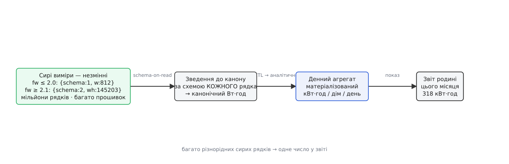

# Звідки береться число у звіті DH

<preknowlist>
- [Schema-on-write проти schema-on-read](book:programming/schema-on-read-write) — де перевіряють форму даних: у мить запису чи в мить читання; телеметрія DH — класичний schema-on-read.
- [Матеріалізований вигляд](book:programming/materialized-views) — похідні дані, порахувані наперед і збережені, щоб не рахувати щоразу; не джерело правди, а його тінь.
- [Родовід даних](book:programming/data-lineage) — здатність простежити число назад до рядків, з яких воно народилося.
- [Ідемпотентний перерахунок](book:programming/idempotent-reprocessing) — переобчислити історію так, щоб повтор не подвоював і не псував уже правильне.
</preknowlist>

Родина відкриває застосунок і бачить рядок: **цього місяця — 318 кВт·год**. Просте число, дрібний шрифт унизу екрана. Спитаймо лиш одне: **де воно живе?** У [сховищі v3](root:progarch/dh-v3-storage) ми клали на диск факти дому — власника, тариф, поріг опалення, реєстр пристроїв. Там кожне число — джерело правди: його ніхто не рахує, воно просто є. А `318` немає ніде. Його не записав жоден давач; його не існувало, доки хтось не відкрив звіт. Це **найпохідніша** річ у всьому домі — сума, витиснута з мільйонів сирих вимірів потужності, знятих розетками щокілька секунд протягом місяця.

І саме тому весь цей модуль — про життя цього числа. Ми окремо розбирали, як [схема змінюється](book:programming/schema-registry), як [дані течуть між системами](book:programming/change-data-capture), як їх [матеріалізують](book:programming/materialized-views). Тепер зберемо це докупи на одному числі: як воно **народжується** попри схему, що росла роками, як **подорожує**, як його **захищають**, коли родина каже «не вірю», і як його **лікують**, коли воно виявилось хибним. Простежмо весь шлях.


*Число у звіті — не факт, а висновок довгого конвеєра. Різнорідні сирі рядки зводяться до спільної одиниці, згортаються в денний агрегат, а той — у місячну суму. Кожна стрілка — місце, де щось може змінитися, загубитися чи збрехати. Далі пройдемо цей конвеєр справа наліво: від готового числа до сирих вимірів, з яких воно постало.*

## Схема, що росла під числом

Почнімо з сирого краю — з вимірів, що лежать у телеметрії. У [v3](root:progarch/dh-v3-storage) ми спростили рядок телеметрії до `(device_id, ts, value)`, одного числа. Час розкрити правду: те, що надсилає розетка, — не гола цифра, а **пакет із формою**, і форма ця роками **змінювалась**.

Перші розетки (прошивка до 2.0) звітували миттєву потужність у ватах цілим числом: `{schema:1, w:812}` — «прямо зараз тягну 812 Вт». Пізніша прошивка (2.1 і новіші) стала слати натомість **накопичувальний лічильник** енергії: `{schema:2, wh:145203}` — «від народження намотав 145203 Вт·год», рівно як лічить домашній електролічильник. Це та сама фізична величина — витрачена енергія, — але **два цілком різні способи** її дістати. Для `schema:1` енергію за годину треба зінтегрувати: скласти потужності на кожному відліку, помножені на крок часу. Для `schema:2` — навпаки, відняти показ лічильника на кінець години від показу на її початок. Один спосіб додає, другий віднімає.

А тепер сіль: телеметрія **дописувальна** й лежить роками. Ми не переписуємо старі рядки — їх мільйони, і вони незмінні, як [і належить сирому запису](book:programming/immutability). Тож у сховищі **одночасно** живуть обидві форми: рядки `schema:1` за позаторік і `schema:2` за цей тиждень. Читач, що рахує звіт, зустрічає **кожну форму, яку колись писали**. Виправити це «міграцією схеми», як ми правили реєстр, не вийде: історію не переписати. Отже, форму доводиться зв'язувати **на читанні** — це і є [schema-on-read](book:programming/schema-on-read-write): сховище прийняло будь-що, а сенс йому надає той, хто читає, дивлячись на тег `schema` кожного рядка.

Щоб це не перетворилось на здогади, кожну версію форми **реєструють** — у [реєстрі схем](book:programming/schema-registry) записано, що означає `schema:1`, що `schema:2`, і як одне звести до канонічного виміру у Вт·год. А поруч стоїть річ, без якої весь конвеєр — картковий будиночок: **контракт даних** ([data-contract](book:programming/data-contracts)) між командою прошивки й платформою. Він каже прямо: поле `wh` — це **накопичувальний** лічильник, а не миттєве значення, і команда прошивки **не має права** тихо змінити цей сенс, не піднявши номер схеми. Бо `w` і `wh` — майже те саме слово, а рахуються протилежно; сплутати їх — це і є найдорожча помилка, до якої ми ще повернемось.

Ось зведення двох форм до спільного канону — одна функція, що дивиться на схему й повертає Вт·год за годину:

:::tabs
```ts
type Raw =
  | { schema: 1; w: number }        // миттєва потужність, Вт
  | { schema: 2; wh: number };      // накопичений лічильник, Вт·год

// Звести будь-яку версію до канону: скільки Вт·год спожито за годину.
// samples — відліки години по порядку; prevMeter — показ лічильника на її початок.
function hourlyWh(samples: Raw[], stepSec: number, prevMeter: number): number {
  const first = samples[0];
  if (first.schema === 1)                               // інтегруємо потужність
    return samples.reduce((s, r) => s + (r as {w:number}).w, 0) * stepSec / 3600;
  const last = samples[samples.length - 1] as { wh: number };
  return last.wh - prevMeter;                            // різниця показів лічильника
}
```
```py
def hourly_wh(samples: list[dict], step_sec: float, prev_meter: float) -> float:
    """Звести будь-яку версію форми до канону: спожиті Вт·год за годину."""
    if samples[0]["schema"] == 1:                        # інтегруємо потужність
        return sum(r["w"] for r in samples) * step_sec / 3600
    return samples[-1]["wh"] - prev_meter                # різниця показів лічильника
```
:::

> 🔧 **Навіщо це.** Найдорожча помилка тут не гучна, а тиха. Якщо прошивка перейде з миттєвого `w` на накопичувальний `wh`, а тег схеми **не** підніме — читач інтегруватиме показ лічильника, як потужність, і намотає астрономічну нісенітницю, яку ніхто не помітить, доки родина не гляне на рахунок. Тому тег схеми в кожному рядку й контракт про сенс полів — не бюрократія, а єдине, що стоїть між вами й мовчазним псуванням числа. Реєстр схем відповідає на питання «яку форму я читаю», контракт — на «що ця форма означає»; без обох schema-on-read перетворюється на ворожбу.

## Число не рахують щоразу: матеріалізація

Припустімо, форму ми звели. Лишається згорнути мільйони канонічних вимірів у `318`. Робити це **на кожне відкриття застосунку** — божевілля: той самий урок, що й з [першим кешем](root:progarch/dh-first-cache), — читання мусить бути швидким, а перебирати мільйони рядків на запит ніяк не швидко. Тож число рахують **наперед** і зберігають: денний агрегат «скільки Вт·год намотав кожен дім кожного дня», а місяць — просто сума тридцяти денних рядків. Це [матеріалізований вигляд](book:programming/materialized-views) (лат. *materia* — речовина): похідне обчислення, зроблене «речовинним», покладене на диск, щоб брати готовим.

Але тут дзвенить знайомий дзвінок. Матеріалізований агрегат — це **друге місце, де живе правда** про спожиту енергію: сирі виміри кажуть одне, денний рядок — своє, і вони можуть **розійтися**. Рівно ту саму напругу вводив кеш у [минулому модулі](root:progarch/dh-first-cache): прискорення ціною другого джерела, що дрейфує. Різниця — в одному свідомому рішенні. Денний агрегат ми робимо **суто похідним і перебудовним**: його завжди рахують із сирих вимірів, його **ніколи не правлять руками**, і його будь-коли можна **викинути й зібрати наново**. Сире лишається [єдиним джерелом правди](root:progarch/state-inventory); агрегат — його тінь, яку не шкода стерти.


*Кеш давав друге джерело правди, що тихо дрейфує й не має шляху назад. Матеріалізований агрегат теж може розійтися з сирим — але сире незмінне, тож розбіжність не страшна: похідне завжди відкидають і перебудовують з нуля. Одне джерело правди лишається одним; усе інше — відтворювана копія.*

> 🔧 **Навіщо це.** Правило, що рятує від цілого класу нічних викликів: **похідні дані мусять бути перебудовними, а не єдиною копією**. Щойно денний агрегат стане місцем, куди щось дописують руками або звідки нема вороття до сирого, — він перетвориться на друге джерело правди, і будь-яка розбіжність стане слідством, а не задачею. Поки ж агрегат — чиста функція від незмінного сирого, найгірше, що з ним може статися, лікується однією командою: «порахуй цей шматок наново».

## Число подорожує між системами

Є ще тонкість, яку легко проґавити. Важку місячну згортку **не можна** ганяти на тій самій базі, що обслуговує живий застосунок. База v3 відповідає на «покажи стан хаба» тисячі разів на секунду; пусти по ній запит, що перемелює мільйони рядків телеметрії, — і живі читання захлинуться. Тож сирі виміри **переливають** у окреме аналітичне сховище, і вся згортка живе там. Це свідома [поліглот-персистентність](book:programming/polyglot-persistence): два сховища замість одного, з усією її ціною, — але цього разу профіль справді того вартий.

Як дані туди потрапляють? Двома шляхами, які ми вже назвали. Можна **тягнути пакетом** — щоночі забирати нові виміри за минулу добу ([ETL](book:programming/etl-elt)); можна **ловити зміни потоком**, щойно вони лягли ([CDC](book:programming/change-data-capture)). Для DH вибір легкий і випливає з природи даних: телеметрія **дописувальна й мічена часом**, тож найдешевше — інкрементний ETL за часовим вікном: «дай усе, чиє `ts` між учора-00:00 і сьогодні-00:00». CDC лишаємо на потім, для **змінного** реєстру, якщо аналітиці колись знадобляться живі правки дому. Кожен такий переїзд — ще одна стрілка на нашому конвеєрі, ще одне місце, де рядок може загубитися, здвоїтися чи прийти не в тому порядку; тому [консистентність конвеєра з кінця в кінець](root:progarch/pipeline-consistency), про яку ми щойно говорили, — не абстракція, а вимога до кожного стику.

## Число доводиться захищати

Тепер найгостріше. Родина дивиться на `318 кВт·год` і пише в підтримку: «Не може бути. Нас цілий тиждень не було вдома». Оператор мусить відповісти на одне питання — **звідки взялося це число?** І якщо єдина його відповідь «так порахувала система», довіру втрачено, а баг не знайти.

Ось для чого весь час поруч ішов [родовід даних](book:programming/data-lineage) (англ. *lineage* — родовід): здатність розмотати число назад до його витоків. `318` розкладається на тридцять денних рядків; кожен денний рядок пам'ятає, **з якого вікна сирих вимірів** його зібрано, **якою версією конвеєра** і **які схеми** в тому вікні траплялись. Тож оператор іде вниз по нитці: місяць → дні → аномальний день → сирі виміри тієї доби → **ось цей давач, ось ці рядки `schema:2`**. Число, яке годину тому було безликим, тепер має повний родовід — і його або підтверджено, або спіймано на брехні.

> 🔧 **Навіщо це.** Число, яке годі простежити, — це число, яке годі і захистити, і виправити. Без родоводу суперечка з родиною впирається в «повірте нам», а пошук бага — у читання всього коду конвеєра навмання. З родоводом обидва зводяться до однієї дії: взяти підозріле число й спуститися по його нитці до сирих рядків, де правда або є, або її вже нема. Це різниця між «десь у пайплайні помилка» і «ось цих чотириста рядків за ці дві доби».

## Число виявилось хибним: перерахунок

Родина мала рацію. Спустившись по родоводу, знаходимо винного: два тижні тому одна розетка перейшла на прошивку 2.1 і стала слати накопичувальний `wh` — але через збій викладки її рядки якийсь час носили старий тег `schema:1`. Контракт даних мовчки поламався. Читач сумлінно **інтегрував показ лічильника, як потужність**, і намотав домові зайві сотні кіловат-годин. `318` мало бути `291`. Треба переобчислити ці два тижні.

І ось де окупається все, що ми будували. Сире — незмінне й ціле; денний агрегат — суто похідний і перебудовний. Тому «полагодити два тижні» — не хірургія, а **точкова перезбірка вікна**: взяти сирі виміри за уражені дні, порахувати наново (тепер декодер знає правду про ці рядки) і **замінити** денні рядки. Не додати, а замінити — впис іде як `upsert` за ключем `(дім, день)`. Це робить операцію [ідемпотентною](book:programming/idempotent-reprocessing) (лат. *idem* — той самий): те саме вікно на вході дає ті самі рядки на виході, а повторний впис лягає поверх, не подвоюючи. Прогнати перерахунок один раз, тричі, чи двічі після падіння посеред роботи — результат той самий. І правильних днів він не чіпає: їх у вікно не бере.


*Перерахунок не чіпає правильних днів і не додає нічого поверх — він переобчислює уражене вікно з незмінного сирого й заміщає денні рядки за ключем. Тому його можна пускати скільки завгодно разів: те саме сире на вході дає те саме число на виході. «Було хибним два тижні» стає обмеженою, безпечною операцією, а не катастрофою.*

Дисципліна «тримай сире незмінним, а похідне — переобчислюй, щоб виправити» — не наш винахід; вона має [свій родовід у великих даних](root:progarch/dh-schema-flow/hist-reprocessing-lineage.md), де саме перерахунок незмінного журналу став опорою цілих архітектур. [Повний робочий конвеєр DH — версійні декодери й зведення до канону, збірка денного матеріалізованого агрегату, інкрементний ETL за вікном, запис родоводу й ідемпотентний перерахунок з тестом, що доводить: два прогони дають те саме число](root:progarch/dh-schema-flow/proj-dh-pipeline.md) — винесено в окремий розбір; тут нам досить було пройти шлях числа й побачити, де на ньому стоїть кожне рішення.

## Що тепер у руках

Ми не додали дому жодної нової кнопки. Ми зробили інше — розібрали на одному числі, як у зрілій системі живуть **похідні дані**. `318` народжується попри схему, що росла роками: форму зв'язують на читанні, за реєстром версій і контрактом про сенс полів. Його рахують наперед — але матеріалізований агрегат лишається перебудовною тінню, а не другим джерелом правди. Воно подорожує в аналітичне сховище дешевим інкрементним переливом. Його можна простежити до сирих рядків — і тому захистити перед родиною. А коли контракт мовчки ламається й число псується, незмінне сире плюс ідемпотентний перерахунок роблять із «було хибним два тижні» обмежену, безпечну правку однієї команди.

Наскрізна думка проста: **єдине джерело правди лишилось єдиним** — це сирі виміри, незмінні й дописувані. Усе інше — схема, агрегат, звіт — це відтворювані тіні, кожну з яких будь-коли можна відкинути й зібрати з того самого сирого. Ми пройшли шлях числа з кінця в кінець і побачили всі його розвилки живцем. Тепер, коли вони перед очима, наступні два кроки зроблять їх свідомим вибором: яку саме стратегію еволюції даних узяти й де провести межу між матеріалізацією, кешем і читанням наживо.
