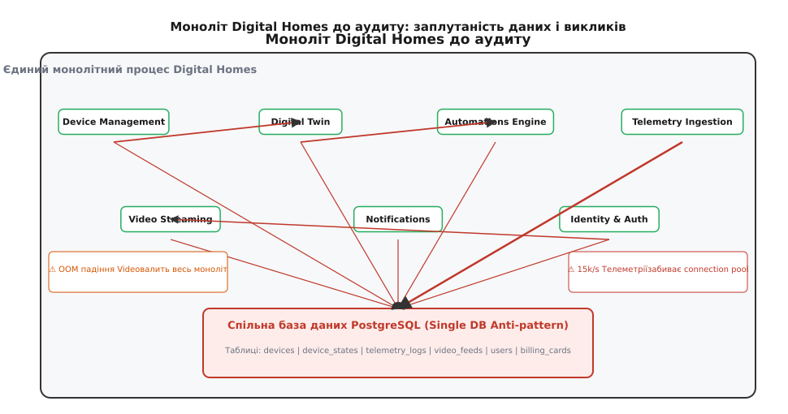
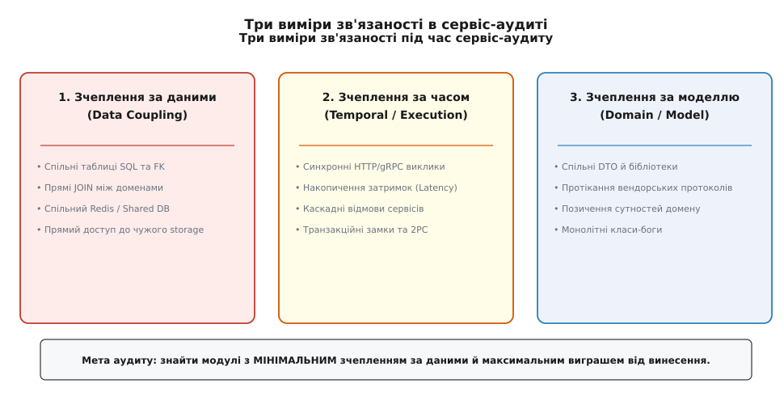
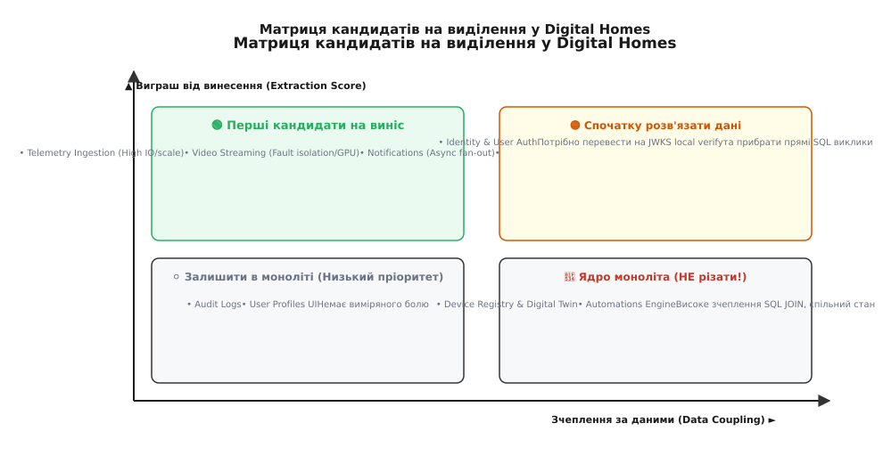
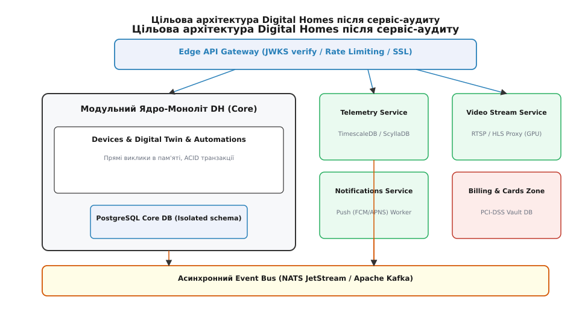

# Перший сервіс-аудит DH

<preknowlist>
- [Коли виділяти сервіс](root:progarch/monolith-vs-microservices/when-to-extract-service) — чотири обґрунтовані критерії виділення мережевої межі проти п'яти хибних приводів.
- [Від модульного моноліта до сервісів](root:progarch/monolith-vs-microservices/modular-monolith-to-services) — покрокова стратегія виділення швів та використання патерну Strangler Fig.
- [Обмежений контекст](book:programming/software-design/bounded-context) — DDD-поняття автономної моделі та її мовних меж.
- [Зчеплення та зв'язність](book:programming/coupling-and-cohesion) — фундаментальні метрики якості модульної архітектури.
</preknowlist>

Платформа розумного дому Digital Homes обслуговує 100 000 активних домогосподарств, до яких підключено понад 2.5 мільйона фізичних датчиків, смарт-замків, термостатів та IP-камер. Уся система працює у вигляді єдиного монолітного бекенд-процесу, збудованого на базі модульної архітектури з єдиною реляційною базою даних PostgreSQL та спільним інстансом Redis для оперативних кешів. У звичайний день моноліт обробляє близько 15 000 асинхронних подій телеметрії за секунду та 1 200 HTTP/gRPC запитів користувачів на секунду.

Під час вечірнього піку споживання (з 18:00 до 21:00) потік повідомлень від датчиків руху, відкриття дверей та лічильників електроенергії зростає у три рази. Масований потік записів у таблицю `telemetry_events` повністю вичерпує пул з'єднань PostgreSQL (Connection Pool), викликаючи сильні затримки запису у Write-Ahead Log (WAL) та витіснення гарячих сторінок із системного буферного пулу (Buffer Pool). У результаті звичайний HTTP-запит користувача на відчинення смарт-замка чекає вільного сокета бази даних понад 12 секунд і завершується помилкою `504 Gateway Timeout`.

У ту саму мить демон обробки RTSP-відеопотоків із дверного вічка зазнає витоку пам'яті через баг у C-бібліотеці кодеків FFmpeg. Операційна система надсилає сигнал `SIGKILL` через перевищення ліміту оперативної пам'яті (Out-Of-Memory, OOM) і валить весь монолітний процес. Разом із відео вимикаються модуль ідентичності користувачів, двигун автоматизацій та служба аварійних сповіщень про пожежу.

Команда розробників із 28 інженерів, розділена на чотири продуктові триби, вимагає негайно «порізати моноліт на 8 окремих мікросервісів під кожен обмежений контекст». Проте сліпе винесення модулів у мережу без аналізу зв'язків створить проблему, суттєво важчу за вихідний моноліт — розподілений моноліт із високою затримкою, каскадними відмовами та непомірним інфраструктурним чеком. Перш ніж розривати процес, архітектор проводить **перший сервіс-аудит DH**, щоб на основі виміряних чисел виявити справжні кандидати на виділення та зберегти стійке монолітне ядро.

---

## 1. Анатомія заплутаності: чому наївний розпил Digital Homes створить катастрофу

Спроба перетворити кожну теку моноліта Digital Homes на окремий мікросервіс виглядає привабливо лише на слайдах презентацій. На практиці монолітну кодову базу DH будували три роки, і її модулі просочені сотнями неявних зчеплень на рівні SQL-схем, транзакцій та пам'яті.



*Моноліт Digital Homes до аудиту: спільна база даних PostgreSQL створює зчеплення за даними, а прямі виклики методів забивають пули з'єднань і поширюють краші.*

Заплутаність моноліта DH перед аудитом проявляється у трьох системних аномаліях, які миттєво зруйнують продуктивність у разі появи мережевих сокетів:

1. **Спільні SQL-таблиці та прямі `JOIN` між доменами (Single DB Anti-pattern):** Модуль керування пристроями (`Device Management`) та модуль цифрового двійника (`Digital Twin`) виконують 1 400 SQL-запитів на хвилину з прямим `JOIN` між таблицями `devices` та `device_states`. Якщо винести `Digital Twin` у мережевий сервіс із власним HTTP API, кожен такий запит перетвориться на N+1 мережевих стрибків або вимагатиме впровадження важкого узгодження даних.
2. **Незрілі транзакційні межі (Broken ACID Boundaries):** Збереження конфігурації автоматизації та перевірка прав користувача відбуваються в єдиній SQL-транзакції `BEGIN ... COMMIT`. Мережева межа між ними зруйнує ACID-гарантії бази даних, змушуючи розробників писати компенсуючі транзакції та паттерни Saga для обробки часткових відмов.
3. **Ланцюжки синхронних викликів (Transitive Sync Call Chains):** Кожен запит користувача на перегляд стану будинку проходить послідовний ланцюжок викликів: `API Gateway → Auth → Device Mgmt → Digital Twin → Notifications`. Якщо кожен міжсервісний стрибок додає 4 мілісекунди транспорту та JSON-серіалізації, підсумкова затримка зростає на +16 мс лише на мережевих накладних витратах. При цьому затримка P99 зростає експоненційно через джитер.

Історія боротьби з подібними викликами показує, що передчасний розпил без суворого аудиту даних завжди закінчується фінансовими та інфраструктурними втратами. Детальний аналіз 25-річної еволюції методологій роздеплоювання систем, включаючи публічний досвід Amazon Prime Video та Segment з повернення до монолітних ядер, наведено у 📜 [Еволюції методологій аудіювання сервісних меж: від монолітів 2000-х до досвіду Amazon Prime Video та Segment](root:progarch/monolith-vs-microservices/dh-services-audit/hist-service-audit-lineage.md).

---

## 2. Методологія сервіс-аудиту: три виміри зчеплення

Щоб проведення аудиту не перетворилося на суб'єктивні суперечки між командами розробників, архітектор оцінює кожен модуль Digital Homes за **трьома фундаментальними вимірами зчеплення** (Coupling Axes).



*Три виміри зчеплення під час сервіс-аудиту: лише повна оцінка даних, часу та моделі дає об'єктивний вердикт.*

### Вимір 1: Зчеплення за даними (Data Coupling)

Це найважчий і найдорожчий вид зчеплення, який практично неможливо обійти інфраструктурними засобами. Аналізатор перевіряє:
- Чи є у двох модулів спільні таблиці SQL або прямі зовнішні ключі (Foreign Keys);
- Чи виконуються прямі SQL `JOIN` між таблицями різних обмежених контекстів у коді моноліта;
- Чи використовують модулі спільні ключі у локальному Redis або спільні файлові директорії.

Якщо модуль А робить `JOIN` з таблицею модуля Б понад 50 разів на секунду, виносити модуль Б у мережу **суворо заборонено** до моменту повного рефакторингу логічного шару даних та розділення таблиць на окремі схеми.

### Вимір 2: Зчеплення за часом виконання (Execution / Temporal Coupling)

Цей вимір вимірює ступені синхронної залежності під час виконання бізнес-операцій:
- Чи вимагає обробка запиту в модулі А негайного блокуючого відповіді від модуля Б через HTTP/gRPC;
- Як поводиться модуль А, якщо модуль Б недоступний (чи є fallback, локальний кеш або асинхронна черга);
- Яка глибина ланцюжка синхронних викликів генерується під час виконання бізнес-операції.

Синхронне зчеплення множить ризики відмов: якщо сервіс А залежить від Б, а Б залежить від В, підсумкова доступність системи `A_chain` обчислюється як добуток індивідуальних доступностей:

```
A_chain = A_1 · A_2 · A_3
```

Якщо кожен із трьох сервісів має доступність 99.9% (3 дев'ятки), підсумкова доступність ланцюжка падає до `0.999³ ≈ 99.7%`, що означає додаткові 17.5 годин незапланованого простою на рік.

### Вимір 3: Зчеплення за моделлю та мовою (Domain / Model Coupling)

Цей вимір оцінює протікання концепцій домену:
- Чи імпортує модуль А внутрішні DTO та сутності ORM модуля Б;
- Чи протікають прихильності вендорських протоколів радіозв'язку (Zigbee/Z-Wave cluster attributes) у загальні публічні моделі API;
- Наскільки важкою є зміна структури полів у коді одного модуля для суміжних команд.

Здоровий модуль має високу внутрішню зв'язність (High Cohesion) і низьке зовнішнє зчеплення (Low Coupling).

---

## 3. Глибокий аудит 8 обмежених контекстів Digital Homes

Для проведення першого сервіс-аудиту архітектурна група DH зібрала статдані аналізу SQL-запитів PostgreSQL, трейси OpenTelemetry та метрики прогону CI/CD конвеєрів за останні 30 днів. Розглянемо детальні результати аудиту для кожного з 8 контекстів платформи.

### 1. Телеметрія (Telemetry Ingestion)
- **Профіль навантаження:** High Write / Append-Only. 15 000 записів/сек подій термостатів, сенсорів протечки та електролічильників.
- **Аудит даних:** 0 міждоменних SQL `JOIN`. Таблиця `telemetry_events_raw` є повністю автономною часовою серією (Time-Series).
- **Аудит викликів:** Бізнес-логіка керування замками та пристроями не робить синхронних запитів у телеметрію. Читання відбувається асинхронно для побудови графіків в аналітичному UI.
- **Ресурсна асиметрія:** Генерує 95% усього WAL-трафіку PostgreSQL бази даних моноліта та займає 80% дискового простору.
- **Вердикт аудиту:** 🟢 **Першочерговий кандидат на виділення.** Винесення телеметрії в окремий сервіс на базі TimescaleDB або ScyllaDB миттєво зніме 95% навантаження на диск із головної бази PostgreSQL та розблокує connection pool.

### 2. Відеопотоки (Video Streaming)
- **Профіль навантаження:** High CPU/GPU & High Bandwidth. Транскодування RTSP-потоків з IP-камер у HLS/WebRTC.
- **Аудит даних:** Автономна таблиця `video_feeds` із налаштуваннями камер. Немає Foreign Keys до бізнес-таблиць користувачів.
- **Аудит відмов:** Високий ризик падіння C-бібліотек (FFmpeg) з OOM та SEGFAULT під час витоків пам'яті.
- **Вердикт аудиту:** 🟢 **Першочерговий кандидат на виділення (Ізоляція відмов).** Перенесення обробки відео в окремі Docker-контейнери із GPU-прискоренням гарантує, що краш відеодемона більше ніколи не звалить систему відкриття замків чи сповіщень.

### 3. Сповіщення та тривоги (Notifications & Alerts)
- **Профіль навантаження:** High Async Fan-Out. Сплески надсилання до 50 000 Push-повідомлень (FCM / APNS) при спрацюванні охоронних датчиків.
- **Аудит викликів:** Взаємодія з іншими модулями виключно асинхронна (через фонові джоби).
- **Комплаєнс:** Вимоги GDPR щодо видалення історії сповіщень за запитом користувача.
- **Вердикт аудиту:** 🟢 **Кандидат на виділення.** Асинхронний воркер сповіщень легко відокремлюється через чергу повідомлень.

### 4. Білінг та платіжні картки (Billing & Subscriptions)
- **Профіль навантаження:** Low TPS, високі вимоги до надійності та аудиту.
- **Комплаєнс:** Суворі вимоги стандарту **PCI-DSS Level 1** щодо обробки даних платіжних карток.
- **Аудит даних:** Таблиці карток та інвойсів закриті у власному ізольованому контурі.
- **Вердикт аудиту:** 🟢 **Кандидат на виділення (Security & Compliance Wall).** Ізоляція білінгу в крихітний сервіс звужує контур аудиту PCI-DSS з 28 інженерів компанії до 2 спеціалістів фінансової команди.

### 5. Ідентичність та доступ (Identity & Access)
- **Профіль навантаження:** High Read (100% запитів вимагають перевірки авторизаційного токена).
- **Аудит даних:** Таблиця `users` має зовніші ключі (FK) практично від усіх таблиць моноліта (`devices.user_id`, `automation_rules.user_id`).
- **Аудит викликів:** Прямий синхронний виклик Auth-сервісу на кожен HTTP-запит створив би додаткові +8 мс затримки.
- **Вердикт аудиту:** 🟡 **Спочатку рефакторинг даних та перехід на JWKS.** Виносити Auth у мережевий сервіс зараз заборонено. Спочатку необхідно перевести API Gateway на локальну перевірку асиметричних JWT-підписів (JWKS) без мережевих викликів до Auth-бази, та прибрати прямо зв'язані Foreign Keys.

### 6. Автоматизації (Automations Engine)
- **Профіль навантаження:** CPU-bound обчислення правил «якщо датчик А спрацював -> увімкнути світло Б».
- **Аудит даних:** Читає свіжий стан із цифрового двійника. Залежить від таблиць `automation_rules` та `device_states`.
- **Вердикт аудиту:** 🔴 **Заставити у моноліті (до підготовки Event Bus).** Обчислення правил вимагає миттєвого доступу до стану в пам'яті.

### 7. Керування пристроями (Device Management) та 8. Цифровий двійник (Digital Twin)
- **Профіль навантаження:** Medium TPS, стійкий потік оновлення станів пристроїв.
- **Аудит даних:** **Критично високе зчеплення!** 1 400 SQL `JOIN`/хв між `devices` та `device_states`. Нерозривна транзакційна цілісність під час парування нового пристрою.
- **Вердикт аудиту:** 🔴 **Ядро моноліта (Monolith Core). НЕ РІЗАТИ!** Спроба винести `Digital Twin` в окремий мікросервіс призведе до створення розподіленого моноліта, зруйнує ACID-транзакції та додасть величезні затримки примирення стану.

---

## 4. Кількісна матриця оцінки та розрахунок Extraction Score

Для точної пріоритезації робіт архітектор використовує математичну модель розрахунку підсумкового бала виділення `S_ext` для кожного модуля:

```
S_ext = (2.5 · ResourceAsymmetry) + (2.0 · DeployAutonomy) + (3.0 · FaultIsolation) + (3.5 · Compliance)
        - (3.0 · DataCouplingScore) - (2.5 · SyncRPCDepth) - (4.0 · DistributedTxCost)
```

У цій формулі позитивні коефіцієнти відточують виграш від винесення:
- `ResourceAsymmetry` (вага `2.5`): захищає від розмноження важких інстансів моноліта заради одного специфічного модуля;
- `DeployAutonomy` (вага `2.0`): оцінює виграш DORA-метрики частоти деплоїв при розщепленні релізних гілок;
- `FaultIsolation` (вага `3.0`): оцінює ступінь небезпеки падіння процесу через нестабільні native-залежності;
- `Compliance` (вага `3.5`): враховує юридичну ціну звуження контуру PCI-DSS або GDPR аудиту.

Негативні коефіцієнти формули жорстко карають за спроби передчасного розпилу:
- `DataCouplingScore` (штраф `-3.0`): карає за кількість міждоменних SQL `JOIN` та спільних таблиць;
- `SyncRPCDepth` (штраф `-2.5`): карає за прокладання нових міжсервісних HTTP/gRPC викликів;
- `DistributedTxCost` (штраф `-4.0`): карає за необхідність розробки компенсуючих транзакцій та саг.

Повний опис JSON-схеми конфігурації аналізатора, специфікації метрик та правил формування звіту наведено у 📋 [Специфікації інструменту та матриці даних сервіс-аудиту Digital Homes](root:progarch/monolith-vs-microservices/dh-services-audit/api-services-audit-matrix.md).



*Квадрантна матриця кандидатів на виділення у Digital Homes: Телеметрія, Відео, Сповіщення та Білінг потрапляють у зелену зону винесення, тоді як Двійник та Пристрої залишаються в ядрах моноліта.*

Розподіл кандидатів на квадрантній матриці чітко показує межу між розумною сервісною архітектурою та передчасним розпилом:

1. **Зелений квадрант (Prime Candidates):** `Telemetry Ingestion` (`S_ext = +38.5`), `Video Streaming` (`+44.5`), `Notifications` (`+28.0`), `Billing` (`+25.0`). Високий виграш від ізоляції при мінімальному зчепленні за даними.
2. **Жовтий квадрант (Data Refactoring Required):** `Identity & Access` (`S_ext = -6.5`). Потребує усунення SQL `JOIN` та переходу на локальну верифікацію токенів у Gateway перш ніж проводити мережеву межу.
3. **Червоний квадрант (Monolith Core):** `Device Management` (`S_ext = -18.0`) та `Digital Twin` (`S_ext = -22.5`). Високе зчеплення за даними та транзакційні вимоги роблять їхній виніс шкідливим. Вони залишаються у **модульному монолітному ядрі**.

---

## 5. Практичний інструмент аудиту: аналізатор SQL `JOIN` та викликів

Щоб аудит меж не залишався одноразовою паперовою акцією, у CI/CD конвеєр Digital Homes впроваджується автоматичний інструмент аналізу кодової бази та логів `dh-coupling-analyzer`.

Інструмент у режимі реального часу парсить журнали виконаних SQL-запитів PostgreSQL, виявляє несанкціоновані міждоменні `JOIN`-операції, будує матрицю зчеплення та автоматично блокує Pull Request, якщо розробник випадково додав прямий SQL `JOIN` між таблицями двох різних обмежених контекстів. Парсер будує абстрактне синтаксичне дерево (AST) запитів, аналізує вкладені підзапити та підраховує частоту звернень до суміжних схем даних.

Повний робочий код аналізатора з реалізаціями мовами C, C++20 (з використанням `std::string_view` та `std::unordered_map`) та Python наведено у проєктній вставці ⚙️ [Практичний аналізатор зчеплення за даними та викликами для моноліта Digital Homes](root:progarch/monolith-vs-microservices/dh-services-audit/proj-dh-coupling-analyzer.md).

---

## 6. Цільова архітектура Digital Homes після першого сервіс-аудиту

За результатами першого сервіс-аудиту архітектурна команда Digital Homes відхиляє пропозицію сліпого розпилу на 8 мікросервісів і затверджує прагматичний план еволюційного переходу.



*Цільова архітектура Digital Homes після першого аудиту: збереження монолітного ядра для доменів високого зчеплення та винесення 4 автономних сервісів навколо асинхронної шини подій.*

План міграції виконується за чотири послідовні кроки:

### Крок 1: Ізоляція Телеметрії (Telemetry Service Extraction)
Телеметрія виноситься першою. Їй створюється окрема база даних TimescaleDB. Запис подій із хабів перенаправляється на новий сервіс телеметрії. Навантаження на головну базу PostgreSQL падає на 95%, а затримка відповіді на запити відкриття замків повертається до нормальних 40 мілісекунд.

### Крок 2: Контейнеризація та виніс Відеопотоків (Video Service Extraction)
Модуль транскодування RTSP/HLS відокремлюється в окремий сервісний кластер із GPU-прискорювачами. Витоки пам'яті у FFmpeg більше не загрожують стабільності бізнес-доменів. Головний моноліт отримує 100% ізоляцію від системних крашів відеомодуля.

### Крок 3: Впровадження Edge API Gateway та асинхронної шини подій
Перед системою ставиться Edge API Gateway (Envoy / Kong). Аутентифікація користувачів переводиться на верифікацію безстатусних JWT-токенів через JWKS-ключі безпосередньо на Gateway. Для зв'язку між монолітним ядром та винесеними сервісами підключається кластер NATS JetStream із підтримкою паттерну Transactional Outbox.

### Крок 4: Закріплення Модульного Ядра-Моноліта (Core Monolith Retention)
Модулі `Device Management`, `Digital Twin` та `Automations Engine` **залишаються працювати всередині єдиного процесу**. Межі між ними строго закріплюються на рівні коду за допомогою мовних інтерфейсів та автоматичних ArchUnit-тестів у CI/CD. Вони продовжують використовувати швидкі виклики методів у пам'яті та атомарні ACID-транзакції бази даних PostgreSQL, забезпечуючи максимальну продуктивність та надійність керування будинком.

> 🔧 **Підсумковий висновок архітектора:**
> Сервіс-аудит — це не одноразова дія, а неперервний архітектурний контроль продуктивності та меж даних. Головна мудрість інженера полягає не у вмінні розрізати систему на максимальну кількість мікросервісів, а у здатності обґрунтовано виміряти та визначити, які модулі повинні жити разом у моноліті заради швидкості та цілісності даних, а які справді заслужили власну мережеву межу. Автоматичний аналіз зчеплення за даними захищає систему від ерозії меж та гарантує стабільний розвиток платформи протягом багатьох років.
