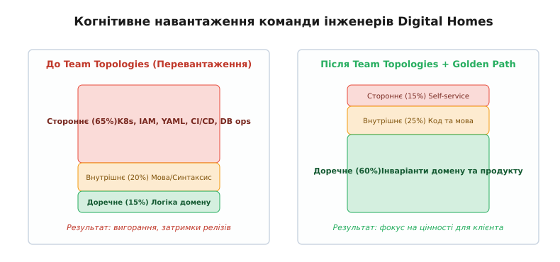
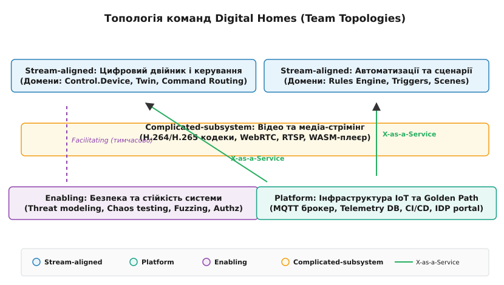
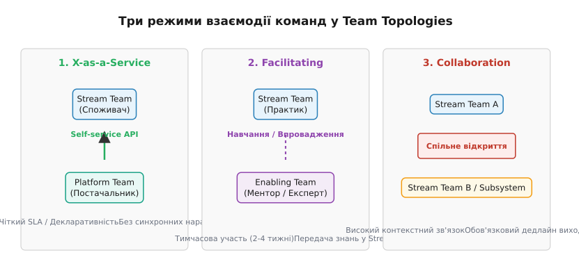

# Топологія команд DH

<preknowlist>
- [Закон Конвея](topic:sf-apps/conways-law) — структура системи копіює структуру комунікацій організацій; межі сервісів визначаються межами команд.
- [Зворотний маневр Конвея](topic:sf-apps/inverse-conway) — проєктування топології команд під бажану цільову архітектуру системи.
- [Фасетний патерн Team Topologies](topic:sf-apps/team-topologies) — чотири типи команд (Stream-aligned, Platform, Enabling, Complicated-subsystem) та три режими взаємодії (Collaboration, X-as-a-Service, Facilitating).
- [Когнітивне навантаження команди](topic:sf-apps/cognitive-load-teams) — межа складності системи, яку одна команда спроможна утримувати в голові без вигорання та помилок.
- [Платформна інженерія](topic:sf-apps/platform-engineering) — створення внутрішньої платформи як продукту з «золотим шляхом» (Golden Path) та самообслуговуванням.
</preknowlist>

П'ятничний реліз о 17:00 в інженерії Digital Homes зупинив 85 тисяч розумних будинків по всій країні. Проблема не крилася у синтаксичній помилці чи збої алгоритму: розробник із команди бекенду вніс абсолютно правильну зміну в розрахунок стану цифрового двійника [Control.Device](root:progarch/dh-context-boundaries-choice). Проте для розгортання цієї зміни знадобилися чотири послідовні передачі (handoffs): бекенд-інженер чекав на конфігурацію топіка від команди експлуатації, команда адміністрування баз даних вручну накочувала міграцію в PostgreSQL, команда мобільної розробки додавала нове поле у свій DTO, а команда QA протягом трьох днів проганяла ручний наскрізний регресійний тест у тестовому середовищі. Один недорозумілий параметр у Slack-чаті між двома інженерами призвів до заклинювання пулу з'єднань баз даних та втрати хмарного зв'язку хабів на три години.

Система вже мала формальний розпір на мікросервіси та [межі обмежених контекстів](root:progarch/dh-context-boundaries-choice), проте інженерні команди залишалися порізаними за технологічними «цехами» (backend, mobile, infra, QA). Будь-яка нова функція вимагала синхронного маршу чотирьох груп, міжкомандних засідань та нічних релізних поїздів. Цей розрив між архітектурою коду та організаційною структурою — прямокутний доказ того, як зламаний комунікаційний граф блокує розробку й руйнує надійність системи.

---

## 1. Звуження розуму: три види когнітивного навантаження

Чому традиційний розподіл інженерів за технологічними колодязями провалюється на масштабі? Відповідь лежить у площині людської психології та обмеженого обсягу оперативної пам'яті: **когнітивному навантаженні команди**. 

Коли інженерна група відповідає за «весь бекенд» або за «всі бази даних платформи», обсяг знань, необхідний для виконання щоденної роботи, перевищує будь-які розумні межі. Психолог Джон Свеллер у теорії когнітивного навантаження виділяє три його компоненти, які повністю застосовні до інженерії програмного забезпечення:

1. **Внутрішнє (Intrinsic Load):** базові знання, необхідні для виконання завдання (синтаксис мови Python чи TypeScript, структура класів, розуміння оператора `async/await`, правила побудови REST API). Це неминучий фундамент професії.
2. **Стороннє (Extraneous Load):** накладні витрати середовища та інструментарію. Сюди належать ручне руління маніфестами Kubernetes, налаштування правок AWS IAM, боротьба зі зламаними скриптами розгортання staging-серверів, виправлення Helm-чартів та з'ясування в Jira, у кого попросити доступи до бази даних.
3. **Доречне (Germane Load):** корисне розумові зусилля, спрямоване безпосередньо на бізнес-домен (інваріанти керування замком, алгоритми сценаріїв «ніч, рух у вітальні», обчислення конфліктів правил, бізнес-логіка підписок).

У Digital Homes до реорганізації до 65% розумової енергії інженерів ішло на стороннє навантаження. Інженер, замість думати про надійність замка чи конвергенцію стану двійника, годинами дебажив Helm-чарти й чекав на схвалення тікетів у Jira. На доречне когнітивне навантаження лишалося заледве 15% ємності.


*Наліво — розмита відповідальність та перевантаження сторонніми інфраструктурними деталями; направо — звільнення когнітивної ємності під логіку домену завдяки платформній забрукованій дорозі.*

Як детально показує [історичний контекст закону Конвея та виникнення Team Topologies](root:progarch/conway-and-teams/dh-team-topology-choice/hist-conway-to-team-topologies.md), розріз систем на сервіси без урахування когнітивних меж команд породжує «розподілений моноліт». Межа сервісу має визначатися не абстрактними міркуваннями про «мікро», а тим, чи спроможна одна автономна команда володіти цим сервісом без вигорання та постійного зазирнення в чужі репозиторії.

---

## 2. Чотири типи команд у Digital Homes

Щоб усунути соціотехнічний конфлікт, Digital Homes переходить на фасетну топологію з чотирьох спеціалізованих типів команд. Кожна команда отримує чіткі межі володіння, обмежені контексти та фіксовану мету.


*Розподіл відповідальності в Digital Homes: дві команди потоку цінності спираються на платформу та ізольовану складну підсистему відео, отримуючи фасилітаційну підтримку безпеки.*

### 2.1. Stream-aligned Teams (Команди потоку цінності)

Це основні продуктові двигуни компанії. Команда потоку цінності прив'язана до конкретного бізнес-домену й володіє ним від початку до кінця (cross-functional end-to-end). Вона включає бекенд-, фронтенд- та мобільних розробників, а також відповідає за якість і спостережність у проді («ти будуєш — ти й запускаєш»).

У Digital Homes виділяються дві ключові Stream-команди:
- **Team Smart Home Twin & Control (Цифровий двійник і керування):** володіє обмеженими контекстами `control.device`, `twin.state` та `command.routing`. Вона відповідає за миттєвий стан пристроїв, маршрутизацію команд до хабів та інваріанти безпеки замків і датчиків.
- **Team Automation & Intelligence (Автоматизації та сценарії):** володіє контекстами `rules.engine`, `triggers.processing` та `scene.execution`. Її межа — виконання користувацьких правил («якщо датчик руху спрацював після 23:00 — увімкнути світло на 20%»).

Головне правило Stream-команди: **одна команда володіє максимум 2–3 невеликими контекстами**. Якщо домен розростається так, що команда більше не тримає його в голові, це сигнал не додавати інженерів (що лише збільшить внутрішні комунікаційні шляхи), а ділити сам домен на два окремі Stream-острівці.

### 2.2. Platform Team (Платформна команда)

Платформна команда **Team Core Platform & Infrastructure** існує для однієї мети: зменшити стороннє когнітивне навантаження Stream-команд майже до нуля. 

Вона не виконує тікети на замовлення і не пише бізнес-код. Замість цього вона розробляє **внутрішню платформу як продукт** («Golden Path» / «Paved Road»). Вона надає Stream-командам самообслуговування (Self-Service API) для:
- Декларативного створення брокерів MQTT та топіків з готовою автентифікацією.
- Автоматичного розгортання високонадійних баз даних PostgreSQL / TimescaleDB.
- Наданих шаблонів CI/CD-пайплайнів із вбудованими перевірками безпеки.
- Автоматичного конфігурування мережевих політик та доменних імен.

Технічні деталі взаємодії та гарантії платформи визначені у [специфікації та контракті внутрішньої платформи self-service](root:progarch/conway-and-teams/dh-team-topology-choice/api-internal-platform-contract.md). Stream-команди споживають платформу без єдиного синхронного дзвінка чи тікета в Jira.

### 2.3. Enabling Team (Команда підтримки / фасилітації)

Команда **Team Security & Resilience Enabling** складається з 3–4 висококласних експертів із соціотехнічної безпеки, хаос-інженерії та криптографії. 

Ця команда має унікальний режим роботи:
- Вона **не володіє прод-сервісами** й не чергує на on-call.
- Вона не бере на себе завдання «напишіть нам модуль авторизації».
- Вона тимчасово інтегрується в Stream-команду (на 2–4 тижні), провівши воркшопи з Threat Modeling, впровадивши фузинг протоколів або навчивши бекапитися під навантаженням, а потім **залишає команду**, підвищивши її автономію.

### 2.4. Complicated-subsystem Team (Команда складної підсистеми)

Створення такої команди виправдане лише тоді, коли ділянка системи вимагає настільки глибокої й специфічної математичної або залізобетонної експертизи, що її присутність у Stream-команді загарбає все когнітивне навантаження.

У Digital Homes це **Team Video & Media Engine**. Вона володіє контекстами транскодування H.264/H.265, сигналізації WebRTC (ICE/STUN/TURN), депакетизації RTSP-потоків з камер та WASM-плеєром у браузері. Stream-команда автоматизацій не повинна знати, як влаштовані NAL-юніти чи RTP-пакети; вона споживає відеопотік як готовий сервісний API.

---

## 3. Три режими взаємодії та ціна комунікаційних шовків

Закон Конвея стверджує: *вартість комунікації між командами визначає межі сервісів*. Якщо дві команди постійно сидять на спільних міжкомандних нарадах, їхні сервіси неминуче злиються у зв'язаний клубок. 

Team Topologies вимагає жорсткої дисципліни взаємодії та призначає один із трьох режимів для кожної пари команд.


*Три стандартизовані типи взаємодії між командами: від автономного споживання сервісу до тимчасової фасилітації та суворо обмеженої за часом спільної розробки.*

### 3.1. X-as-a-Service (Сервісний режим)

Це дефолтний та найбажаніший режим. Одна команда надає код, API або інфраструктуру як продукт, а інша команда споживає його без спілкування з авторами.

Ознаки чіткого X-as-a-Service:
- Відсутність спільних Slack-каналів для обговорення «як нам деплоїти».
- Наявність зрозумілої документації, OpenAPI/gRPC специфікацій та версіонування.
- Суворий SLA/SLO (наприклад, Platform Team гарантує 99.9% доступності брокера MQTT).

### 3.2. Facilitating (Фасилітація)

Характерний для взаємодії Enabling-команди зі Stream-командами. Команда-ментор допомагає усунути прогалини в знаннях. Наприклад, Enabling-команда з безпеки сідає поруч із командою **Smart Home Twin** і разом із нею будує модель загроз (STRIDE) для нового радіопротоколу. Мета фасилітації — зробити Stream-команду самодостатньою у цій дисципліні.

### 3.3. Collaboration (Спільна розробка)

Дві команди працюють разом над невизначеною межею або новим міжсервісним контрактом. Вони спільно пишуть код, беруть участь у Daily Standup та ділять відповідальність.

**Увага: Collaboration — це найдорожчий режим.** Він вимагає високих комунікаційних накладних витрат і знижує автономію обох команд. 

Траєкторія руху розробки вимагає дотримання правила: **Collaboration обов'язково має термін придатності (expiration date)**. Наприклад, Stream-команда автоматизацій та Complicated-команда відео оголошують Collaboration на **3 тижні**, щоб придумати новий API детекції руху з відеокамер. Після закінчення 3 тижнів контракт фіксується, а взаємодія переходить у суворий режим **X-as-a-Service**. Якщо Collaboration триває місяцями — це ознака неправильно проведеної межі контексту, і команди слід об'єднати або перерізати сервіси.

---

## 4. Математика черг та простеження шляху команди

Чому передача завдання між командами (handoff) розрушає продуктивність? Теорія масового обслуговування (закон Літтла та формули черг) визначає середній час очікування завдання в черзі:

```
T_wait = (ρ / (1 - ρ)) · T_service
```

де `ρ` — рівень завантаженості команди-виконавця (utilization), а `T_service` — час виконання завдання. 

Якщо Платформна команда завантажена тікетами на 90% (`ρ = 0.9`), коефіцієнт черги становить `0.9 / (1 - 0.9) = 9`. Це означає, що завдання, яке потребує 2 годин чистої роботи адміна (`T_service = 2 год`), висить у черзі очікування **18 годин**. Якщо для випуску фичі потрібно чотири послідовні передачі між командами із завантаженням 85–90%, загальний Lead Time розтягується з кількох годин до місяця.

Ось чому усунення міжкомандних черг через Self-Service платформу дає кращий приріст швидкості, ніж будь-яка оптимізація алгоритмів у коді.

### 4.1. Простеження виклику: від натискання кнопки до спрацювання реле

Щоб побачити нову топологію в дії, простежимо виконання команди користувача «Відчинити вхідний замок»:

1. **Клієнтський додаток:** відправляє gRPC-запит на API Gateway, що обслуговується Платформою.
2. **Stream-команда Twin & Control:** сервіс `control.device` приймає виклик, валідує авторизацію користувача й публікує команду в брокер MQTT. База даних та брокер створені через Golden Path Платформи без людських черг.
3. **IoT-хаб вдома:** отримує команду по MQTT, відмикає реле замка й повертає підтвердження стану.
4. **Stream-команда Automation & Intelligence:** приймає подія відчинення замка через асинхронну чергу подій і запускає правило «увімкнути світло передпокою».
5. **Enabling-команда:** раніше провела аудит шифрування цієї послідовності викликів, переконавшись, що ключ ідемпотентності унеможливлює повторну атаку.

Усі п'ять ланок працюють **без єдиного синхронного виклику між людьми**. Кожна команда володіє своєю ділянкою, а зв'язок здійснюється через чіткі контракти.

---

## 5. Організаційний ADR та захист меж від соціотехнічної ерозії

Архітектура організаційної структури є настільки ж важливим і дороговартісним рішенням, як і вибір бази даних чи стилю мікросервісів. Тому реорганізація інженерії Digital Homes фіксується як офіційний документ.

Повний текст та детальний аналіз усіх варіантів містить [ADR оновлення топології команд Digital Homes](root:progarch/conway-and-teams/dh-team-topology-choice/proj-dh-org-adr.md).

Зміна топології команд не є одноразовим актом. Соціотехнічна система схильна до ерозії: з часом розробники починають ходити в чужі бази даних повз API, створювати закриті чати «для швидких правках» та обходити платформні стандарти.

Щоб запобігти ерозії, Digital Homes впроваджує **архітектурні та соціотехнічні тестування в CI/CD**:
- **Автоматичний аналіз графа залежностей:** статичний аналізатор репозиторіїв валить збірку, якщо код Stream-команди автоматизацій містить прямий SQL-запит або імпорт приватних модулів з контексту `control.device`.
- **Моніторинг тривалості Collaboration:** скрипт перевіряє життєвий цикл спільних епіків у Jira/GitHub, сповіщаючи техліда, якщо взаємодія в режимі Collaboration перевищує 21 день.
- **Опитування когнітивного навантаження:** щоквартальний моніторинг індексу суб'єктивного сприйняття складності інструментів (Extraneous Load Index). Якщо понад 30% інженерів Stream-команди скаржаться на складність розгортання — Платформна команда отримує сигнал про провал «забрукованої дороги» в цьому сегменті.

---

## 6. Соціотехнічний синтез і стратегічний висновок

Досвід Digital Homes демонструє: спроба побудувати гнучку мікросервісну архітектуру поверх застарілих технологічних колодязів неминуче завершується створенням розподіленого моноліту. Закон Конвея залишається непереборною силою: структура комунікацій інженерів завжди стає формою викликів у коді та мережі.

Застосування патернів Team Topologies перетворює цей закон на керований архітектурний важіль. Шляхом виділення автономних команд потоку цінності (Stream-aligned), зменшення їхнього стороннього когнітивного навантаження через платформну «забруковану дорогу» (Platform Golden Path), ізоляції вузькоспеціалізованих складних підсистем (Complicated-subsystem) та цільової підтяжки компетенцій через менторство (Enabling) організація отримує високу швидкість релізів без втрати надійності.

Соціотехнічне проєктування стає повноправною дисциплітиною програмного архітектора: проєкт системи є повним лише тоді, коли визначено не лише які модулі як викликаються, а й які команди ними володіють, у яких режимах взаємодіють і як захищають свої межі у часі.
