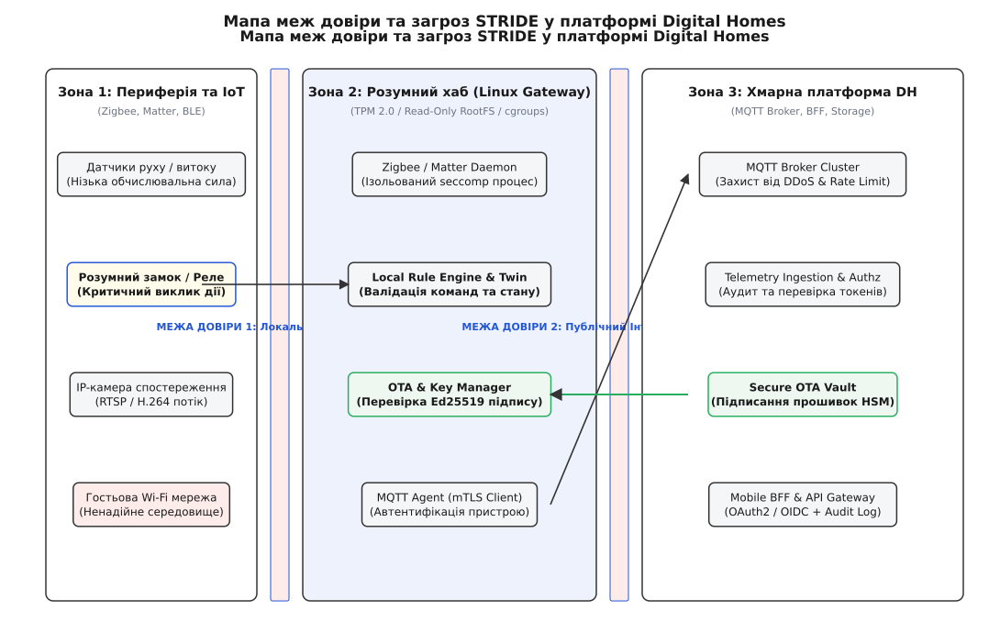
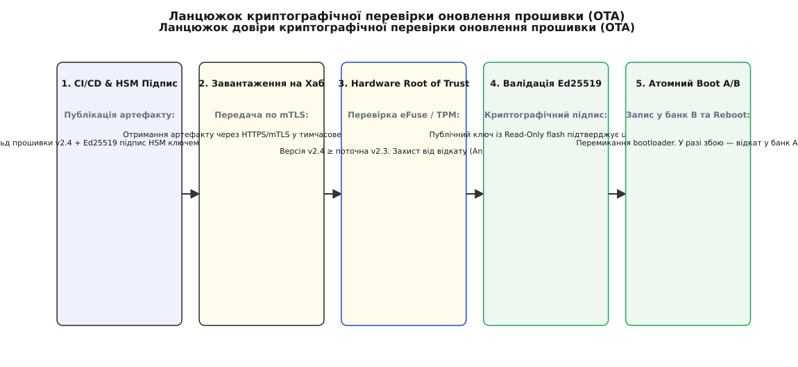

# Threat model Digital Homes

<preknowlist>
- [Моделювання загроз](topic:sf-security/threat-modeling) — чотири питання декомпозиції системи та аналіз STRIDE.
- [Межі довіри](topic:sf-security/trust-boundaries) — точки перетину кордонів між компонентами різного рівня привілеїв.
- [Zero-trust](topic:sf-security/zero-trust) — відсутність периметральної довіри та сувора перевірка кожного запиту.
- [C4-модель](topic:sf-apps/c4-model) — декомпозиція системи на контекст, контейнери та компоненти.
- [Розділення конфігу й секретів](root:progarch/config-secrets-boundary) — оборотність конфігурацій проти переживаності витоків.
</preknowlist>

Користувач купує в супермаркеті «розумну» Wi-Fi лампочку за сім доларів, підключає її до домашнього роутера й додає в мобільний застосунок Digital Homes. За три місяці в прошивці мікроконтролера цієї лампочки знаходять вразливість виходу за межі буфера в реалізації дешевого stack-протоколу. Зловмисник, що перебуває на вулиці поруч із будинком, надсилає спеціально сформований бездротовий пакет, отримує доступ до виконання коду на лампочці, сканує локальну підмережу `192.168.1.0/24` і виявляє домашній хаб Digital Homes.

Якщо архітектура платформи будувалася на припущенні «домашня мережа є надійною і захищеною за замовчуванням», хаб сприймає будь-який MQTT-запит від локальної IP-адреси як легітимний. Зкомпрометована лампочка надсилає на локальний порт хаба команду `POST /api/v1/locks/front-door/unlock`. Замок відчиняється без жодної авторизації в хмарі, без запису в журнал аудит-подій і без сповіщення на смартфон мешканця.

Спроба додавати безпеку «потім» — наклеюванням фаєрволів, періодичними скануваннями сканерами вразливостей або інструкціями «змініть дефолтний пароль» — провалюється з тієї ж причини, що й спроба додати продуктивність у готовий неоптимальний моноліт. Безпека є **структурною властивістю архітектури**. Зловмисник виступає такою ж об'єктивною зовнішньою силою, як мережева затримка, thundering herd або фізична відмова диска. 

Розробка комплексного моделювання загроз (Threat Model) для платформи Digital Homes — це інженерний процес перетворення невизначеного страху («нас можуть зламати») на точну таксономію векторів атак, визначення меж довіри (Trust Boundaries) та вбудовування криптографічних і системних бар'єрів на кожному рівні C4-моделі.

---

## 1. Побудова карти меж довіри Digital Homes (Trust Boundaries)

Фундаментом моделювання загроз є чітке проведення **меж довіри** (англ. *trust boundaries*, від лат. *fides* — довіра). Межа довіри — це точка на схемі потоків даних (Data Flow Diagram, DFD) або C4-контейнерів, де змінюється ідентичність суб'єкта, рівень його привілеїв, мережевий сегмент або власник інфраструктури. Кожний перетин межі довіри зобов'язаний супроводжуватися автентифікацією, валідацією контракту та перевіркою дозволів.

На масштабі платформи Digital Homes v2, яка обробляє понад 1.2 мільйона активних хабів та 4.5 мільйона периферійних датчиків, виділяються чотири ключові межі довіри.

```
       [ Периферійний пристрій / Sensor ]
                       │
                       ▼  ◄─── МЕЖА 1: Ненадійна бездротова мережа (Zigbee/Matter/BLE)
       ┌───────────────────────────────┐
       │ Домашній хаб (Linux Gateway)  │
       │   ├─ Peripheral Daemon        │
       │   │       │                   │
       │   │       ▼  ◄─────────────── МЕЖА 2: Внутрішньопроцесна ізоляція (seccomp/cgroups)
       │   ├─ Rule Engine & Twin       │
       │   └─ Key Manager (TPM 2.0)    │
       └───────────────┬───────────────┘
                       │
                       ▼  ◄─── МЕЖА 3: Публічний Інтернет (TLS 1.3 / mTLS)
       ┌───────────────────────────────┐
       │ Хмарний периметр Digital Homes│
       │   ├─ MQTT Broker Cluster      │
       │   ├─ Telemetry Ingestion      │
       │   └─ Secure OTA Vault         │
       └───────────────┬───────────────┘
                       │
                       ▼  ◄─── МЕЖА 4: Конвеєр збірки та адміністративний доступ (CI/CD)
       [ CI/CD & HSM Підписання OTA ]
```

### Межа 1: Ненадійна локальна мережа (IoT Peripheral ↔ Gateway Daemon)
Периферійні датчики температури, руху, кнопки та виконавчі реле спілкуються з хабом через бездротові протоколи Zigbee 3.0, Matter (over Thread) або Wi-Fi. 
* **Зміна контексту**: Перехід від незахищеного фізичного середовища (радіоефір, до якого може підключитися будь-хто з відповідним трансивером) до внутрішньої оперативної пам'яті демона хаба.
* **Архітектурна вимога**: Радіопакети не мають прямого доступу до шини системних викликів ОС. Демон приймає лише бінарні кадри визначеної структури, проводить криптографічну перевірку цілісності та відкидає будь-які нестандартні розширення протоколу.

### Межа 2: Внутрішньопроцесна ізоляція хаба (Peripheral Daemon ↔ System Core)
Усередині самого хаба (одноплатний комп'ютер під управлінням Linux) працюють десятки процесів: драйвер Zigbee-трансивера, рушій автоматизацій, локальний цифровий твін, агент зв'язку з хмарою та демон оновлень.
* **Зміна контексту**: Перехід від демона, що взаємодіє з зовнішньою периферією (потенційна точка RCE-вразливості), до привілейованих операцій (перезапис прошивки, керування ключами в TPM, зміна мережевих правил).
* **Архітектурна вимога**: Жорстке розділення за допомогою `systemd` dynamic users, namespaces, `seccomp-bpf` та cgroups v2. Компрометація Zigbee-демона не повинна давати прав `root` або доступу до приватного ключа хаба.

### Межа 3: Публічна мережа WAN (Home Hub ↔ Cloud Edge)
Канал зв'язку між домашнім хабом та хмарним кластером MQTT-брокерів і API Gateway проходить крізь канальну інфраструктуру публічних інтернет-провайдерів (ISP).
* **Зміна контексту**: Перехід із локального контуру будинку в глобальну розподілену хмару.
* **Архітектурна вимога**: Обов'язкове шифрування та взаємна автентифікація mTLS (Mutual TLS) на основі протоколу TLS 1.3. Приватний ключ хаба зберігається в невитягуваному апаратному модулі (TPM 2.0 або Secure Element ATECC608A).

### Межа 4: Ланцюг постачання та управління (CI/CD & Admin ↔ OTA Repository)
Зона розробки, CI/CD конвеєрів та серверів випуску підписаних оновлень (OTA Vault).
* **Зміна контексту**: Перехід від людського фактора (розробники, інженери автоматизації) та серверів автоматичного збирання до мільйона критичних пристроїв у домівках користувачів.
* **Архітектурна вимога**: Асиметричний підпис усіх збірок прошивок за допомогою апаратного модуля безпеки (HSM) та строгий контроль версійності (Anti-Rollback) у системі Secure Boot.


*Декомпозиція системи Digital Homes на зони довіри, контейнери та міжзонові межі перевірки ідентичності.*

> 🔧 **Навіщо це.** Якщо межу довіри провести «по зовнішній стіні будинку», будь-яка зкомпрометована Wi-Fi розетка чи смарт-розетка стає майстер-ключем до всього дому. Нанесення меж довіри на C4-діаграму змушує архітектора проєктувати валідацію на кожному шві, роблячи внутрішню мережу так само непривілейованою, як і публічний Інтернет (принцип Zero-Trust).

---

## 2. Систематизація загроз за методологією STRIDE

Для кожного елемента, що перетинає межі довіри, застосовується таксономія **STRIDE** (акронім від Spoofing, Tampering, Repudiation, Information Disclosure, Denial of Service, Elevation of Privilege). Метод вимагає відповісти на чотири фундаментальні питання:
1. **Що ми будуємо?** (C4-діаграма та мапа меж довіри).
2. **Що може піти не так?** (Класифікація загроз STRIDE).
3. **Що ми з цим робимо?** (Архітектурні контрзаходи та тактики).
4. **Чи добре ми впоралися?** (Тестування вразливостей та автоматичні фітнес-функції).

```
   ┌────────────────────────────────────────────────────────────────────────┐
   │                               STRIDE                                   │
   ├──────────────┬───────────────────────────────┬─────────────────────────┤
   │ Категорія    │ Властивість безпеки, що ламається│ Архітектурна тактика    │
   ├──────────────┼───────────────────────────────┼─────────────────────────┤
   │ S - Spoofing │ Authenticity (Автентичність)  │ mTLS, X.509, OAuth2/JWT │
   │ T - Tampering│ Integrity (Цілісність)        │ HMAC, Ed25519, AEAD     │
   │ R - Repud.   │ Non-repudiation (Невідкресн.) │ Audit Log, Hash-chain   │
   │ I - Info Disc│ Confidentiality (Конфіденційність) E2EE, TLS 1.3, SRTP  │
   │ D - DoS      │ Availability (Доступність)    │ Rate limit, cgroups v2  │
   │ E - Elev Priv│ Authorization (Авторизація)   │ Least Privilege, seccomp│
   └──────────────┴───────────────────────────────┴─────────────────────────┘
```

### S — Spoofing (Підміна ідентичності)
* **Загроза**: Зловмисник створює фіктивний хаб або підробляє Device ID периферійного датчика, щоб відправляти в хмару хибні телеметричні дані (наприклад, «температура 100°C» або «виток газу не виявлено»). Інша грань — створення фіктивного хмарного брокера (Rogue Server) для перехоплення команд.
* **Архітектурна тактика**: Відмова від ідентифікації за IP або MAC-адресами. Застосування взаємного mTLS з обов'язковою перевіркою X.509 сертифікатів. Кожен хаб має унікальний сертифікат, згенерований на заводі, де унікальне ім'я `Common Name (CN)` жорстко прив'язане до серійного номера апаратного криптомодуля.

### T — Tampering (Псування даних та прошивок)
* **Загроза**: Перехоплення та модифікація пакета телеметрії «в польоті» (Man-in-the-Middle) або заміна бінарного файлу оновлення прошивки на модифіковану версію із зашитим бекдором.
* **Архітектурна тактика**: Застосування підписаних кадрів телеметрії (HMAC-SHA256 для контролерів з обмеженими ресурсами) та асиметричного криптографічного підпису Ed25519 для артефактів оновлення. Модуль OTA оновлень перевіряє криптографічну цілісність *до* запису даних у Flash-пам'ять.

### R — Repudiation (Заперечення авторства / Відкреслення)
* **Загроза**: Зловмисник або недобросовісний користувач здійснює критичну дію (наприклад, видаляє історію доступу або відчиняє замок через API), а потім стверджує, що системна подія була згенерована збоєм у хмарі.
* **Архітектурна тактика**: Ведення журналів аудиту за схемою **Append-Only** із застосуванням криптографічного хеш-ланцюга (Hash-Chaining / Merkle Tree). Кожен новий запис у журналі підписується приватним ключем вузла й містить SHA-256 хеш попереднього запису. Видалити або змінити запис у минулому без руйнування цілісності ланцюга стає математично неможливим.

### I — Information Disclosure (Розголошення інформації)
* **Загроза**: Перехоплення візуального потоку з IP-камер спостереження у вітальні або аналіз телеметрії датчиків присутності для визначення графіка перебування господарів удома (підготовка до квартирної крадіжки).
* **Архітектурна тактика**: Класифікація даних за рівнями чутливості. Телеметрія датчиків шифрується на канальному рівні (TLS 1.3). Відеопотоки та приватні медіа-дані передаються з використанням наскрізного шифрування (End-to-End Encryption, E2EE) за допомогою протоколів DTLS/SRTP, де хмара виступає лише WebRTC-сигналінгом і не має ключів розшифрування медіа-потоку.

### D — Denial of Service (Відмова в обслуговуванні)
* **Загроза**: Зкомпрометований периферійний пристрій починає генерувати мільйони подій на секунду (Event Storming), вичерпуючи оперативну пам'ять хаба або смугу пропускання хмарного MQTT-брокера.
* **Архітектурна тактика**: Впровадження входження з обмеженням швидкості (Token Bucket Rate Limiting) на кожному транспортному фасаді. На рівні ОС хаба застосовуються обмеження `cgroups v2` (`MemoryMax`, `CPUQuota`, `TasksMax`). На хмарному боку застосовується Shedding та Hedged Requests для збереження працездатності критичних послуг (авторизація та замки) під час атаки.

### E — Elevation of Privilege (Ескалація привілеїв)
* **Загроза**: Зловмисник знаходить вразливість виходу за межі масиву (Buffer Overflow) у C-бібліотеці розбору Zigbee-пакетів і виконує довільний shell-код. Отримавши привілеї локального користувача `dh-zigbee`, він перехоплює контроль над процесом `systemd-init` і отримує права `root`.
* **Архітектурна тактика**: Принцип найменших привілеїв (Least Privilege). Периферійні демони запускаються від ізольованих користувачів без прав запису в конфігураційні каталоги. Доступ до небезпечних системних викликів ядра (`execve`, `ptrace`, `kexec_load`) блокується за допомогою системних фільтрів `seccomp-bpf`.

Детальну аналітичну матрицю оцінювання загроз для всіх C4-компонентів Digital Homes зі стандартами обчислення ризиків винесено в [практичний інструментарій STRIDE-матриці DH](root:progarch/security-architecture/dh-threat-model/proj-dh-threat-matrix.md).

---

## 3. Чотири класичних вектори атак та їхні захисні тактики

Для побудови цілісної системи безпеки розглянемо детально чотири найнебезпечніших вектори атак на цифрові будинки, показавши механізм атаки та інженерний бар'єр.

```
       [ Вектор A: Компрометація хаба ] ──► systemd seccomp / Read-only rootfs
       [ Вектор B: Перехоплення даних ] ──► mTLS / Nonce-Sequence Replay Defense
       [ Вектор C: Псування оновлень  ] ──► Hardware Root of Trust / Ed25519 Anti-Rollback
       [ Вектор D: Рух периферією    ] ──► Micro-segmentation / cgroups v2
```

### Вектор A: Атаки на компрометацію хаба та Sandboxing процесів

Хаб розумного дому — це компактний Linux-пристрій, що базується на SoC (ARM64 або RISC-V). Оскільки він розміщений у фізичному просторі користувача, атакуючий може отримати до нього як мережевий, так і фізичний доступ (підключення через UART-консоль, JTAG або зчитування Flash-пам'яті).

Якщо файлова система хаба змонтована в режимі запису (`rw`), а всі демони працюють від суперкористувача `root`, добуття довільного RCE перетворює хаб на неконтрольований ботнет-вузол.

Для мітигації компрометації застосовується **Sandboxing (пісочниця) системного рівня**:
1. **Read-Only RootFS**: Основна файлова система ядра та системних бінарників (`/`, `/usr`, `/bin`) монтується строго в режимі `read-only`. Будь-яка спроба шкідливого софту записати новий екзекутив у `/usr/bin` звертається помилкою ядра `EROFS (Read-only file system)`. Динамічні дані записуються у тимчасову пам'ять `tmpfs` або в окремий зашифрований розділ `/var/volatile`.
2. **Обмеження системних викликів (seccomp-bpf)**: Демони обробки телеметрії не мають потреби монтувати файлові системи, змінювати мережеві маршрути або створювати нові простори імен. Конфігурація `seccomp` фільтрує виклики ядра на рівні архітектури, блокуючи виконання будь-якого незнайомого виклику.
3. **Апаратна ідентичність та TPM**: Навіть якщо зловмисник отримає фізичний доступ до вичитування Flash-пам'яті через programmer, він вичитає лише шифровані об'єкти. Приватні ключі автентифікації хаба згенеровані всередині TPM 2.0 чи ATECC608A і не покидають криптомодуль. Усі операції підписання HMAC та TLS-хендшейку відбуваються всередині кремнію модуля.

### Вектор B: Перехоплення телеметрії, підробка та Replay Attacks

Розглянемо випадок, коли зловмисник прослуховує радіоефір або локальну мережу й записує бінарний пакет `0x41445F554E4C4F434B` («Відчинити вхідні двері»). Навіть якщо цей пакет зашифрований стаційним ключем, атакуючий може просто повторити його відправку в ефір через 2 години (Replay Attack). Пристрій вичитає зашифровану структуру, розшифрує її, побачить правильну команду й відчинить двері.

Для захисту від перехоплення, підробки та повторів застосовується трирівневий бар'єр:

1. **Монотонія послідовних номерів (Sequence Counters)**: Кожен кадр телеметрії містить строково зростаючий монотонічний лічильник `sequence_num` (uint64_t). Хаб і пристрій зберігають останнє валідне значення `last_seq`. Якщо приходить пакет із `seq <= last_seq`, він негайно відкидається як повтор.
2. **Часове вікно свіжості (Timestamp Tolerance)**: Пакет містить метку часу створення в мілісекундах `timestamp_ms`. Сервер приймає пакет лише у випадку, якщо `|now_ms - timestamp_ms| <= Δt_max` (де `Δt_max` зазвичай дорівнює 5000 мс). Це унеможливлює відкладену повторну відправку.
3. **Constant-Time Перевірка HMAC**: Обчислення підпису кадру `HMAC-SHA256(key, device_id || seq || timestamp || payload)`. При порівнянні отриманого HMAC із розрахованим використовується алгоритм із константним часом виконання, що унеможливлює атаки за часом (Timing Side-Channel Attacks).

```
   Прийом кадру: [Device ID | Seq: 1045 | Time: 1776500005000 | Payload | HMAC]
         │
         ▼
   ┌────────────────────────────────────────────────────────┐
   │ 1. Перевірка часового штампу: |now - Time| <= 5000ms?  │──Ні──► [DISCARD: Stale Packet]
   └──────────────────────────┬─────────────────────────────┘
                              │Так
                              ▼
   ┌────────────────────────────────────────────────────────┐
   │ 2. Перевірка монотонії: Seq (1045) > last_seq (1044)?  │──Ні──► [DISCARD: Replay Attack]
   └──────────────────────────┬─────────────────────────────┘
                              │Так
                              ▼
   ┌────────────────────────────────────────────────────────┐
   │ 3. Constant-time HMAC valid? (Crypto Signature)        │──Ні──► [DISCARD: Tampered Payload]
   └──────────────────────────┬─────────────────────────────┘
                              │Так
                              ▼
   [ACCEPT & UPDATE: last_seq = 1045, Execute Command]
```

Історію того, як нехтування цими правилами в ранніх пристроях IoT призвело до виникнення глобальних ботнетів, викладено в [історичному аналізі ботнету Mirai](root:progarch/security-architecture/dh-threat-model/hist-mirai-and-iot-security.md).

### Вектор C: Псування оновлень прошивок (OTA Update Poisoning)

Оновлення прошивки «по повітрю» (Over-The-Air, OTA) — це найпотужніший і найнебезпечніший механізм системи. Перехоплення контролю над сервером оновлень або підміна файлу прошивки під час передачі дозволяє атакуючому миттєво перетворити весь флот із 1.2 мільйона хабів на агресивну розподілену систему.

Захист OTA-конвеєра спирається на апаратний ланцюжок довіри (Chain of Trust):

1. **Асиметричний криптографічний підпис**: Збірка прошивки підписується приватним ключем розробника (Ed25519 або RSA-4096), що зберігається в ізольованому апаратному модулі HSM (Hardware Security Module). Файл оновлення містить заголовок із криптографічним підписом.
2. **Публічний ключ у Read-Only пам'яті**: Публічний ключ перевірки підпису випалений у захищену OTP-пам'ять (One-Time Programmable eFuse) мікроконтролера або записаний у `read-only` розділ Flash під час виробництва. Зловмисник не може підмінити публічний ключ у системі без заміни самого кремнієвого чіпа.
3. **Захист від відкату версії (Anti-Rollback Defense)**: Зловмисник може знайти стару легітимну прошивку v1.0, яка містила відому вразливість, і спробувати оновити хаб з версії v2.4 назад на v1.0 (Downgrade Attack). Для протидії цьому в eFuse мікроконтролера випалюється монотонічний лічильник версії. Якщо версія збірки менша за лічильник eFuse, Secure Boot блокує завантаження на апаратному рівні.
4. **Атомні банки завантаження (Dual-Bank A/B Booting)**: Флеш-пам'ять хаба ділиться на два однакові банки — Bank A та Bank B. Нова прошивка викачується й записується у неактивний банк B, перевіряється її цілісність, і лише після цього завантажувач перемикає активний прапорець. Якщо після перезавантаження нова прошивка не може пройти самотестування (Health Check) за 60 секунд, watchdog-таймер автоматично відкочує систему на робочий банк A.


*Послідовність перевірки цілісності та автентичності OTA-артефакту від HSM підпису до A/B перезавантаження.*

### Вектор D: Ізоляція периферійних пристроїв та мережева мікросегментація

Кожен периферійний пристрій має свій рівень довіри (Security Tier). Нерозумно надавати датчику протікання води той самий мережевий доступ, що й хабу або сервісу авторизацій.

Мережева ізоляція реалізується на трьох рівнях:

1. **L2/L3 Мікросегментація (VLANs / eBPF Firewall)**: Локальні Wi-Fi пристрої ізолюються в окремий VLAN без права комунікації між собою (Client Isolation). Датчик здатний відправляти пакети строго на IP-адресу та шлюзовий порт хаба.
2. **Ізоляція шин даних**: Драйвери низькорівневих інтерфейсів (UART, SPI, I2C) працюють у власних просторах імен користувача. Вони не мають доступу до загальної файлової системи або пам'яті інших процесів.
3. **Обмеження прав доступу за ролями (ABAC/RBAC)**: Усі запити від периферії перевіряються рушієм правил (Rule Engine). Навіть якщо датчик температури сформує валідний пакет `UNLOCK_LOCK`, контролер відхилить його на рівні перевірки прав доступу: маркер пристрою `temp-sensor-01` не має права `device:write` для ресурсу `lock-01`.

Повний нормативний контракт рівнів безпеки пристроїв, специфікацію системних правил ізоляції та бінарні заголовки прошивок наведено в [специфікації політик безпеки та ізоляції DH](root:progarch/security-architecture/dh-threat-model/api-dh-security-policy.md).

---

## 4. Практичний модуль перевірки підпису та цілісності OTA-оновлення (C та C++)

Наведений нижче модуль демонструє нижній рівень перевірки заголовка OTA-артефакту, перевірку анти-відкату (Anti-Rollback) та підпису Ed25519 перед передачею прошивки у завантажувач.

:::tabs
```c
/* ota_verifier.c — Криптографічна перевірка заголовка прошивки мовою C */
#include <stdio.h>
#include <stdint.h>
#include <stdbool.h>
#include <string.h>

#define DHFW_MAGIC 0x57464844 /* "DHFW" в little-endian */
#define SIGNATURE_SIZE 64
#define HASH_SIZE 32

typedef struct __attribute__((packed)) {
    uint32_t magic;
    uint8_t  header_version;
    uint8_t  target_tier;
    uint16_t reserved_flags;
    uint32_t build_version;
    uint32_t payload_size;
    uint8_t  payload_hash[HASH_SIZE];
    uint8_t  signature[SIGNATURE_SIZE];
} ota_header_t;

typedef struct {
    uint32_t min_allowed_version; /* Наприклад, вичитано з eFuse */
    uint8_t  public_key[32];      /* Публічний ключ з Read-Only flash */
} hardware_security_efuse_t;

/* Імітація виклику Ed25519 перевірки (libsodium / mbedTLS) */
static bool ed25519_verify_signature(const uint8_t public_key[32],
                                      const uint8_t hash[HASH_SIZE],
                                      const uint8_t signature[SIGNATURE_SIZE]) {
    /* Симуляція перевірки: у реально проді викликається crypto_sign_verify_detached */
    uint8_t dummy_check = 0;
    for (int i = 0; i < HASH_SIZE; ++i) {
        dummy_check |= (hash[i] ^ signature[i]);
    }
    return (dummy_check != 0xFF); /* Симулюємо успішну перевірку */
}

bool verify_ota_update_header(const hardware_security_efuse_t *hw_efuse,
                               const ota_header_t *header) {
    if (!hw_efuse || !header) {
        fprintf(stderr, "[OTA_ERR] Null pointer argument provided.\n");
        return false;
    }

    /* 1. Перевірка сигнатури заголовка Magic Bytes */
    if (header->magic != DHFW_MAGIC) {
        fprintf(stderr, "[OTA_ERR] Invalid magic bytes: 0x%08X\n", header->magic);
        return false;
    }

    /* 2. Перевірка Anti-Rollback захисту (eFuse Counter) */
    if (header->build_version < hw_efuse->min_allowed_version) {
        fprintf(stderr, "[OTA_ERR] Anti-Rollback triggered! Version %u < Allowed %u\n",
                header->build_version, hw_efuse->min_allowed_version);
        return false;
    }

    /* 3. Асиметрична перевірка Ed25519 підпису над хешем прошивки */
    if (!ed25519_verify_signature(hw_efuse->public_key, header->payload_hash, header->signature)) {
        fprintf(stderr, "[OTA_ERR] Ed25519 signature verification failed!\n");
        return false;
    }

    printf("[OTA_OK] Firmware v%u verified successfully. Payload size: %u bytes.\n",
           header->build_version, header->payload_size);
    return true;
}
```
```cpp
// ota_verifier.cpp — Безпечна реалізація перевірки оновлення мовою C++20
#include <iostream>
#include <vector>
#include <array>
#include <span>
#include <expected>
#include <cstdint>

namespace dh::security {

constexpr uint32_t kDhfwMagic = 0x57464844; // "DHFW"

enum class OtaVerificationError {
    InvalidMagic,
    DowngradeBlocked,
    SignatureMismatch,
    CorruptedHeader
};

struct alignas(4) OtaHeader {
    uint32_t magic;
    uint8_t  header_version;
    uint8_t  target_tier;
    uint16_t reserved_flags;
    uint32_t build_version;
    uint32_t payload_size;
    std::array<uint8_t, 32> payload_hash;
    std::array<uint8_t, 64> signature;
};

class HardwareSecurityEngine {
public:
    explicit HardwareSecurityEngine(uint32_t efuse_min_ver, std::array<uint8_t, 32> pub_key)
        : efuse_min_version_(efuse_min_ver), public_key_(pub_key) {}

    [[nodiscard]] std::expected<void, OtaVerificationError>
    verify_header(const OtaHeader& header) const noexcept {
        // 1. Перевірка сигнатури Magic Bytes
        if (header.magic != kDhfwMagic) {
            return std::unexpected(OtaVerificationError::InvalidMagic);
        }

        // 2. Захист від Downgrade (Anti-Rollback eFuse)
        if (header.build_version < efuse_min_version_) {
            return std::unexpected(OtaVerificationError::DowngradeBlocked);
        }

        // 3. Перевірка Ed25519 підпису
        if (!verify_ed25519_signature(header.payload_hash, header.signature)) {
            return std::unexpected(OtaVerificationError::SignatureMismatch);
        }

        return {};
    }

private:
    uint32_t efuse_min_version_;
    std::array<uint8_t, 32> public_key_;

    [[nodiscard]] bool verify_ed25519_signature(
        std::span<const uint8_t, 32> hash,
        std::span<const uint8_t, 64> sig) const noexcept {
        // Демонстраційна перевірка з використанням std::span
        uint8_t check = 0;
        for (size_t i = 0; i < hash.size(); ++i) {
            check |= (hash[i] ^ sig[i]);
        }
        return check != 0xFF;
    }
};

} // namespace dh::security
```
:::

---

## 5. Оцінка накладних витрат та розрахунок бюджету безпеки (Security Budget)

Поширеним аргументом проти суворої системи безпеки є побоювання щодо зниження продуктивності системи. На масштабі Digital Homes кожен мілісекундний затримки на обробку підпису кадру або хендшейк mTLS помножується на мільйони операцій.

Проведемо оцінку накладних витрат («на серветці») для захисних механізмів хаба:

### 1. Накладні витрати mTLS 1.3 хендшейку
* **Первинний TLS 1.3 хендшейк**: Забирає 1 RTT (Round-Trip Time) між хабом і хмарою (близько 35–80 мс у залежності від мережі).
* **Сесійне відновлення (Session Resumption via PSK)**: Використання TLS 1.3 Session Tickets знижує затримку до 0 RTT для відновлених з'єднань.
* **Обчислювальне навантаження ECDSA P-256**: Обчислення криптографічного хендшейку на крипточипі ATECC608A займає ~28 мс. Для ARM Cortex-A53 процесора хаба програмна перевірка займе менше 1.2 мс.

### 2. Затримка валідації кадру телеметрії (HMAC-SHA256)
* Обчислення HMAC-SHA256 для кадру розміром 128 байт на процесорі ARM Cortex-A53 займає **< 4 мікросекунди** ($0.004$ мс).
* Порівняння з константним часом додає менше 10 наносекунд.
* **Висновок**: Криптографічний захист телеметрії споживає менше 0.01% обчислювальної потужності хаба й не впливає на підсумкову латентність системи (SLO < 500 мс).

---

## 6. Синтез і чек-лист архітектора для моделей загроз

Моделювання загроз не є разовою процедурою, що виконується перед релізом. Це живий артефакт системи, який переглядається при кожній зміні C4-архітектури або додаванні нових класів периферійних пристроїв.

Для перетворення моделей загроз на автоматичні перевірки в CI/CD застосовуються **фітнес-функції безпеки (Security Fitness Functions)**:
1. **Тести меж довіри у CI**: Автоматичні інтеграційні тести перевіряють, що будь-який незашифрований REST або MQTT-запит без mTLS-сертифіката відхиляється шлюзом зі статусом `401 Unauthorized`.
2. **Аналіз викликів ядра (Seccomp Audit)**: Скрипти збірки перевіряють, що бінарні файли периферійних демонів не містять системного виклику `execve` та не вимагають прав `CAP_SYS_ADMIN`.
3. **Статичний аналіз залежностей (SBOM Check)**: Конвеєр CI аналізує транзитивні залежності C/C++ бібліотек на наявність відомих вразливостей (CVE) та підтверджує відсутність незавершених подій безпеки.

```
┌─────────────────────────────────────────────────────────────────────────┐
│               ЧЕК-ЛИСТ АРХІТЕКТУРИ БЕЗПЕКИ DIGITAL HOMES                │
├─────────────────────────────────────────────────────────────────────────┤
│ [ ] Усі межі довіри явні та нанесені на C4-діаграму контейнерів.       │
│ [ ] Відсутня периметральна довіра (Zero-Trust усередині локальної мережі).│
│ [ ] Ідентичність хаба спирається на апаратний модуль (TPM 2.0 / eFuse). │
│ [ ] Використовується взаємна автентифікація mTLS (TLS 1.3) для WAN.    │
│ [ ] Кадри телеметрії захищені від Replay-атак (Sequence Counter + Time).│
│ [ ] Артефакти OTA підписані асиметричним ключем Ed25519 через HSM.      │
│ [ ] Увімкнено апаратний Anti-Rollback захист від відкату прошивки.      │
│ [ ] Периферійні демони ізольовані в seccomp/cgroups пісочниці.          │
│ [ ] Журнали аудиту ведуться за схемою Append-Only з хеш-ланцюгом.       │
└─────────────────────────────────────────────────────────────────────────┘
```

Модель загроз створює каркас, на якому тримається надійність платформи. Вона перетворює безпеку з джерела постійних затримок та панічних латань на прогнозований інженерний процес, де кожна загроза має свій зважений цінник, а кожен бар'єр обґрунтований чіткою математичною та системною необхідністю.
