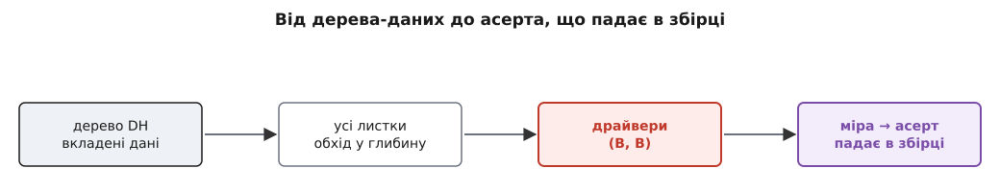

# ⚙️ Дерево корисності як живі дані

У статті ми повісили дерево на стіну й вибрали червоні листки **(В, В)** оком. Око впорається з чотирма листками спокійного вечора — але плаский плакат хворіє тією самою хворобою, з якою б'ється весь курс: він живе рівно доти, доки хтось його пам'ятає й поважає. Новий інженер його не бачив. Масштаб тихо міняє одну оцінку — а папір не помічає й не червоніє. І найгостріша міра на ньому — «замок відчиняється рівно раз» — лишається чорнилом, поки її ніхто не перевіряє.

Зробімо дерево операційним — не плакатом, а робочим механізмом. Три рухи, кожен — окремий крок цієї вставки. Перший: **закодуємо дерево даними**, точно тією ж вкладеністю, що на малюнку. Другий: **напишемо обхід**, який знаходить драйвери сам — фільтром «важливість В і складність В», рівно тим відбором, що в статті робили оком. Третій, найважливіший: візьмемо **один** драйвер і перетворимо його міру на [фітнес-функцію](topic:sf-apps/fitness-functions) — виконувану перевірку, що сама впаде в збірці, щойно система порушить обіцяну міру. Це і є місток від картки на стіні до коду, який не дає важливому тихо зламатися.


*Дерево перестає бути картинкою на стіні: відбір драйверів робить функція, а один драйвер стає воротами в збірці.*

## Крок 1 — дерево як вкладені дані

Дерево — це буквально вкладеність: корінь-корисність, товсті гілки-атрибути, іноді підгілки, а на кінчиках — листки з парою позначок. Закодуймо цю форму один-в-один. Кожен листок несе чотири поля: **сценарій**, його нещадну **міру** з числом (те, що згодом стане фітнес-функцією), **важливість** і **складність**. Атрибут листка — не окреме поле, а ланцюг гілок над ним; обхід підбере його сам.

Тут дві мови розходяться в характері, і це видно одразу. TypeScript любить, коли форма даних оголошена типами наперед: гілка й листок — це два різновиди вузла, і компілятор стежить, щоб ми не переплутали. Python натомість тримає дерево як звичайні вкладені словники — форма живе в самих даних, майже як JSON. Обидва підходи ідіоматичні; кожен грає за правилами свого дому.

:::tabs
```typescript
type Grade = "В" | "С" | "Н";   // високо · середньо · низько

// Листок: сценарій, його нещадна міра з числом і дві людські оцінки.
interface Leaf {
  kind: "leaf";
  scenario: string;
  measure: string;      // саме це згодом стане фітнес-функцією
  importance: Grade;    // наскільки успіх системи від цього залежить
  difficulty: Grade;    // наскільки важко це дати саме цій структурі
}

// Гілка: якісний атрибут, що ще розгалужується.
interface Branch {
  kind: "branch";
  attribute: string;
  children: Node[];
}

type Node = Branch | Leaf;

const tree: Branch = {
  kind: "branch",
  attribute: "Корисність Digital Homes",
  children: [
    {
      kind: "branch",
      attribute: "Доступність",
      children: [
        {
          kind: "branch",
          attribute: "без хмари",
          children: [
            {
              kind: "leaf",
              scenario: "дім живий, коли впав інтернет",
              measure:
                "0 пропущених спрацювань за 24 год офлайн; " +
                "після відновлення 0 втрачених і 0 подвоєних подій",
              importance: "В",
              difficulty: "В",
            },
            {
              kind: "leaf",
              scenario: "апка бачить дім у локальній мережі без хмари",
              measure: "апка показує стан дому за ≤ 2 с без доступу до хмари",
              importance: "В",
              difficulty: "С",
            },
          ],
        },
      ],
    },
    {
      kind: "branch",
      attribute: "Надійність",
      children: [
        {
          kind: "leaf",
          scenario: "замок відчиняється рівно раз",
          measure:
            "за будь-якого числа повторів однієї команди — " +
            "рівно 1 фізичне відмикання",
          importance: "В",
          difficulty: "В",
        },
      ],
    },
    {
      kind: "branch",
      attribute: "Змінюваність",
      children: [
        {
          kind: "leaf",
          scenario: "новий тип пристрою — без правки ядра",
          measure: "додати драйвер пристрою, не змінивши жодного файлу рушія правил",
          importance: "В",
          difficulty: "В",
        },
        {
          kind: "leaf",
          scenario: "нове правило додає сам користувач",
          measure: "нова автоматизація з'являється без випуску нової версії",
          importance: "С",
          difficulty: "С",
        },
      ],
    },
    {
      kind: "branch",
      attribute: "Швидкодія",
      children: [
        {
          kind: "leaf",
          scenario: "фізичний вимикач → світло",
          measure: "світло спалахує за ≤ 100 мс у 99% натискань",
          importance: "В",
          difficulty: "С",
        },
        {
          kind: "leaf",
          scenario: "флот 5 млн домів: телеметрія встигає",
          measure: "запис телеметрії не відстає від темпу її надходження",
          importance: "С",
          difficulty: "В",
        },
      ],
    },
    {
      kind: "branch",
      attribute: "Безпека",
      children: [
        {
          kind: "leaf",
          scenario: "відеопотік — лише власнику",
          measure: "відео доступне тільки автентифікованому власнику дому",
          importance: "В",
          difficulty: "В",
        },
      ],
    },
  ],
};
```
```python
Grade = str   # "В" · "С" · "Н" — високо · середньо · низько

# Вузол — це dict. Є ключ "children" → гілка; немає → листок.
tree = {
    "attribute": "Корисність Digital Homes",
    "children": [
        {
            "attribute": "Доступність",
            "children": [
                {
                    "attribute": "без хмари",
                    "children": [
                        {
                            "scenario": "дім живий, коли впав інтернет",
                            "measure":
                                "0 пропущених спрацювань за 24 год офлайн; "
                                "після відновлення 0 втрачених і 0 подвоєних подій",
                            "importance": "В",
                            "difficulty": "В",
                        },
                        {
                            "scenario": "апка бачить дім у локальній мережі без хмари",
                            "measure": "апка показує стан дому за ≤ 2 с без доступу до хмари",
                            "importance": "В",
                            "difficulty": "С",
                        },
                    ],
                },
            ],
        },
        {
            "attribute": "Надійність",
            "children": [
                {
                    "scenario": "замок відчиняється рівно раз",
                    "measure":
                        "за будь-якого числа повторів однієї команди — "
                        "рівно 1 фізичне відмикання",
                    "importance": "В",
                    "difficulty": "В",
                },
            ],
        },
        {
            "attribute": "Змінюваність",
            "children": [
                {
                    "scenario": "новий тип пристрою — без правки ядра",
                    "measure": "додати драйвер пристрою, не змінивши жодного файлу рушія правил",
                    "importance": "В",
                    "difficulty": "В",
                },
                {
                    "scenario": "нове правило додає сам користувач",
                    "measure": "нова автоматизація з'являється без випуску нової версії",
                    "importance": "С",
                    "difficulty": "С",
                },
            ],
        },
        {
            "attribute": "Швидкодія",
            "children": [
                {
                    "scenario": "фізичний вимикач → світло",
                    "measure": "світло спалахує за ≤ 100 мс у 99% натискань",
                    "importance": "В",
                    "difficulty": "С",
                },
                {
                    "scenario": "флот 5 млн домів: телеметрія встигає",
                    "measure": "запис телеметрії не відстає від темпу її надходження",
                    "importance": "С",
                    "difficulty": "В",
                },
            ],
        },
        {
            "attribute": "Безпека",
            "children": [
                {
                    "scenario": "відеопотік — лише власнику",
                    "measure": "відео доступне тільки автентифікованому власнику дому",
                    "importance": "В",
                    "difficulty": "В",
                },
            ],
        },
    ],
}
```
:::

Дані вийшли трохи багатослівні — але це й є суть. Дерево перестало бути малюнком, який кожен читає по-своєму, і стало **єдиним джерелом правди**, яке машина прочитає однаково. Зверніть увагу на «без хмари»: доступність тут не одразу листок, а підгілка з двома листками під нею — рівно як у статті хмарний драйвер сусідить із «апка бачить дім у LAN». Ця зайва вкладеність — не примха: саме вона за мить змусить обхід бути справжнім деревним обходом, а не двома вкладеними циклами.

## Крок 2 — обхід замість ока

Око робило дві речі одразу: пробігало всі листки й затримувалося на червоних. Розділимо їх. Спершу **обхід у глибину** зносить усі листки з їхньої вкладеності в один плаский список — і несе з собою ланцюг гілок, крізь які спускався, бо цей ланцюг і є атрибут листка. Потім простий **фільтр** лишає тих, у кого важливість В і складність В. Той самий відбір, що робили оком, — тільки тепер його роблять однаково, щоразу, без утоми й настрою.

:::tabs
```typescript
interface Driver {
  path: string;         // ланцюг гілок від верху до листка = атрибут
  scenario: string;
  measure: string;
  importance: Grade;
  difficulty: Grade;
}

// Обхід у глибину: зносимо всі листки в один плаский список,
// несучи з собою ланцюг гілок над кожним листком.
function* walkLeaves(node: Node, path: string[] = []): Generator<Driver> {
  if (node.kind === "leaf") {
    yield {
      path: path.join(" › "),
      scenario: node.scenario,
      measure: node.measure,
      importance: node.importance,
      difficulty: node.difficulty,
    };
    return;
  }
  for (const child of node.children) {
    yield* walkLeaves(child, [...path, node.attribute]);
  }
}

// Драйвери — рівно ті листки, що (В, В): важливі І важкі.
function drivers(root: Branch): Driver[] {
  return root.children
    .flatMap((branch) => [...walkLeaves(branch)])
    .filter((d) => d.importance === "В" && d.difficulty === "В");
}

for (const d of drivers(tree)) {
  console.log(`(${d.importance},${d.difficulty})  ${d.path}: ${d.scenario}`);
}
```
```python
def walk_leaves(node, path=()):
    """Обхід у глибину: усі листки, кожен — зі своїм ланцюгом гілок."""
    children = node.get("children")
    if children is None:                       # немає дітей → це листок
        yield {**node, "path": " › ".join(path)}
        return
    for child in children:
        yield from walk_leaves(child, path + (node["attribute"],))


def drivers(root):
    """Рівно ті листки, що (В, В): важливі І важкі."""
    leaves = (
        leaf
        for branch in root["children"]
        for leaf in walk_leaves(branch)
    )
    return [
        d for d in leaves
        if d["importance"] == "В" and d["difficulty"] == "В"
    ]


for d in drivers(tree):
    print(f'({d["importance"]},{d["difficulty"]})  {d["path"]}: {d["scenario"]}')
```
:::

Обидві версії, запущені на дереві, друкують те саме — і те саме, що ми колись виписали в статті рукою:

```
(В,В)  Доступність › без хмари: дім живий, коли впав інтернет
(В,В)  Надійність: замок відчиняється рівно раз
(В,В)  Змінюваність: новий тип пристрою — без правки ядра
(В,В)  Безпека: відеопотік — лише власнику
```

Чотири драйвери — рівно ті чотири межі, з яких стаття веліла починати архітектуру. Але тепер їх дістало не око, а функція. Різниця здається косметичною, поки листків чотири; вона стає рятівною, коли їх сто. Бо в дереві на сто листків око проґавить, а `drivers()` — ні: він однаково безжально прочитає кожен і поверне точний список тих, хто (В, В). [Драйвери](topic:sf-apps/architectural-drivers) — те, що [ці позначки](topic:sf-apps/attribute-scenarios) визначають; функція просто читає позначки без права на втому.

## Крок 3 — від картки до тесту, що падає

Тепер найважливіший рух. Візьмімо один драйвер — **«замок відчиняється рівно раз»** — і перетворимо його міру на код, який падає, коли міру порушено. Це і є [фітнес-функція](topic:sf-apps/fitness-functions): не «замок має спрацьовувати раз» як побажання на картці, а автоматична перевірка, що зупиняє складання тієї ж миті, коли замок спрацював двічі.

Згадаймо, звідки береться другий раз. За хиткої мережі команду «відчинити» доводиться **повторювати** — інакше вона загубиться в обриві. Але кожен повтор несе той самий наказ, і наївний контролер відчинить замок стільки разів, скільки повторів прилетіло. Міра ж нещадна: скільки б не повторили одну команду — рівно одне фізичне відмикання. Мовою розподілених систем це **ідемпотентність**: повтор наказу не додає нового ефекту. А спосіб її дати простий — контролер запам'ятовує **особу** кожного наказу (його `id`) і другий раз ту саму особу вже не виконує.

Ось контролер — і фітнес-функція, що стереже його міру:

:::tabs
```typescript
type OpenCommand = { id: string; action: "open" };

class LockController {
  private handled = new Set<string>();   // id уже виконаних наказів
  private actuations = 0;                // скільки разів реально клацнув замок

  handle(cmd: OpenCommand): void {
    if (this.handled.has(cmd.id)) return;   // повтор тієї самої особи — дубль
    this.handled.add(cmd.id);
    this.actuations += 1;                    // фізичний рух засува
  }

  get physicalOpens(): number {
    return this.actuations;
  }
}

// ── Фітнес-функція: падає в збірці, щойно міру порушено ──
function fitnessLockOpensExactlyOnce(): void {
  // 1) хитка мережа: клієнт повторив ОДИН наказ п'ять разів
  const one = new LockController();
  for (let i = 0; i < 5; i++) one.handle({ id: "cmd-42", action: "open" });
  if (one.physicalOpens !== 1) {
    throw new Error(
      `«замок рівно раз» порушено: 5 повторів однієї команди → ` +
        `${one.physicalOpens} відмикань, а міра — рівно 1`,
    );
  }

  // 2) три РІЗНІ накази: дедуплікація не сміє глушити справжні команди
  const many = new LockController();
  for (const id of ["cmd-43", "cmd-44", "cmd-45"]) {
    many.handle({ id, action: "open" });
  }
  if (many.physicalOpens !== 3) {
    throw new Error(
      `«замок рівно раз» порушено: 3 різні команди → ` +
        `${many.physicalOpens} відмикань, а мало бути 3`,
    );
  }
}
```
```python
class LockController:
    def __init__(self):
        self._handled = set()   # id уже виконаних наказів
        self._actuations = 0    # скільки разів реально клацнув замок

    def handle(self, cmd):
        if cmd["id"] in self._handled:   # повтор тієї самої особи — дубль
            return
        self._handled.add(cmd["id"])
        self._actuations += 1            # фізичний рух засува

    @property
    def physical_opens(self):
        return self._actuations


# ── Фітнес-функція: падає в збірці, щойно міру порушено ──
def fitness_lock_opens_exactly_once():
    # 1) хитка мережа: клієнт повторив ОДИН наказ п'ять разів
    one = LockController()
    for _ in range(5):
        one.handle({"id": "cmd-42", "action": "open"})
    assert one.physical_opens == 1, (
        f"«замок рівно раз» порушено: 5 повторів однієї команди → "
        f"{one.physical_opens} відмикань, а міра — рівно 1"
    )

    # 2) три РІЗНІ накази: дедуплікація не сміє глушити справжні команди
    many = LockController()
    for cid in ("cmd-43", "cmd-44", "cmd-45"):
        many.handle({"id": cid, "action": "open"})
    assert many.physical_opens == 3, (
        f"«замок рівно раз» порушено: 3 різні команди → "
        f"{many.physical_opens} відмикань, а мало бути 3"
    )
```
:::

Погляньте, що сталося з червоним листком. Він був чорнилом на картці — став **умовою, без якої складання не проходить**. Той, хто завтра перепише контролер і випадково загубить перевірку `handled`, не пройде далі: `fitnessLockOpensExactlyOnce` кине помилку з точним рядком «5 повторів → 5 відмикань, а міра — рівно 1», і [конвеєр](topic:sf-release/ci-cd) поверне складання назад. Ніякого рев'ю, ніякої надії на чужу пам'ять — міра стереже себе сама.

Зверніть увагу на **другу** перевірку, з трьома різними наказами. Без неї фітнес-функція брехала б: контролер, що не відчиняє замок **ніколи**, теж дасть «не більше одного відмикання» й пройде перший асерт. Міра ж каже «рівно раз», а не «не більше разу», — тому її треба стерегти з обох боків: повтори не множать, а різні накази не гублять. Фітнес-функція варта чогось лише тоді, коли перевіряє **саму** властивість, а не її зручну половину.

> 🔧 **Навіщо це.** Три кроки разом перетворюють дерево з плаката на механізм із трьома різними ролями. Дані — щоб машина читала дерево однаково. Обхід — щоб драйвери відбиралися правилом, а не настроєм. Асерт — щоб хоч один драйвер перестав покладатися на людську пам'ять і почав покладатися на збірку. Це той самий рух «вниз до числа», що й у сценарію, доведений до кінця: від «зробити добре» аж до рядка коду, який знає, коли добре зламалося.

## Складність і пастки

Спокуса — повірити, що ми автоматизували мудрість. Ні: ми автоматизували лише **дисципліну**. Різницю варто бачити чітко, бо саме тут інструмент найлегше обертається проти себе.

**Оцінки — людські, і сміття на вході дає сміття на виході.** `drivers()` безжально точний, але він лише слухняно вертає те, що ми самі проставили в полях `importance` й `difficulty`. Помились однією позначкою — постав відеопотоку складність С замість В, «бо здається легко» — і функція тихо викине його зі списку драйверів, з тією самою впевненою точністю, з якою щойно його туди внесла. Машина дає повторюваність і безжальність, не судження. Судження — чого варта якість і як важко її дати структурі — лишається людським, і жоден обхід його не замінить. Код тут стереже наслідок оцінок, а не їхню правду.

**Дерево живе — і дані мусять жити з ним.** Стаття вже попереджала: пара (С, В) у телеметрії — це фотографія сьогоднішнього дому на тисячу адрес. Коли їх стане п'ять мільйонів, важливість підскочить до В. У даних це один рядок: `importance` телеметрії з `"С"` на `"В"` — і `drivers()`, без жодної іншої правки, поверне вже **п'ять** драйверів; листок почервонів сам, без переклеювання плаката. Ось справжня перевага живих даних над стіною. Але й пастка тут же: рядок сам себе не змінить. Якщо дерево-дані ніхто не переоцінює, коли міняється масштаб, ринок чи закон, воно застаріває так само тихо, як плакат, — тільки виглядає солідніше. Живі дані вимагають ритуалу перегляду; інакше вони просто акуратніший спосіб помилятися.

**Зелений тест — не виконаний драйвер.** Це найтонше. `fitnessLockOpensExactlyOnce` зеленіє — і доводить, що контролер ідемпотентний **на стенді**, у нашому маленькому світі з п'ятьма повторами. Він **не** доводить, що о третій ночі за реального обриву мережі, з реальним засувом і реальними гонитвами, замок відчиниться саме раз. Так само асерт на «дім живий офлайн» у збірці — це лише перевірка логіки; що дім справді переживе добу без хмари, покаже тільки [неперервна перевірка на живій системі](topic:sf-apps/fitness-functions), а не тест у конвеєрі. Зелена збірка тут необхідна, але не достатня — а найгірше, коли фітнес-функція перевіряє іграшкову половину міри й світить зеленим: вона присипляє пильність краще за будь-яку відсутність перевірки. Тому асерт мусить кусати по-справжньому — ганяти повтори й різні накази, як вище, — а частину драйверів (офлайн, флот) стерегти не в збірці, а там, де їхня міра справді проявляється: у бойовому моніторингу.

Отже, дерево корисності як живі дані — це не магія, а зміщення на один щабель у бік невблаганності. Було: чотири рядки на картці, що виживають, доки їх пам'ятають. Стало: структура, яку машина читає однаково, відбір, що не залежить від настрою, і принаймні один драйвер, який упаде в збірці, щойно система порушить обіцяну міру. Плакат казав, що для Digital Homes важливо. Ці три кроки роблять важливе таким, що вміє сказати «ні» саме — без нас у петлі.
