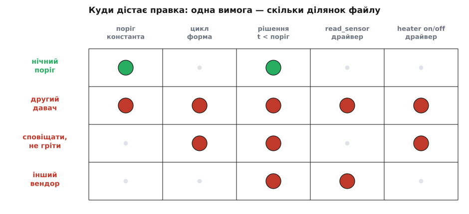

# ⚙️ Робочий хаб v0 — і чотири правки, що розповзаються

Кістяк із кількох рядків показує форму, але форму легко прийняти за іграшку. Тож зберімо **справжній** хаб — файл, який можна покласти на диск, запустити `python hub.py` і побачити, як кімната оживає: холоне, доходить до порога, вмикає обігрівач, гріється, вимикає. Без жодного дроту, без давача за десять доларів, без розетки — і все ж по-чесному робочий, бо замість заліза ми підставимо **моки** (англ. *mock* — підробка, що вдає справжнє), які поводяться, як поводилося б залізо. Ті самі імена, що в скелеті: `read_sensor()`, `heater_on()`, `heater_off()`, той самий `THRESHOLD = 20.0`, той самий `sleep(30)`. Змінюються тільки тіла драйверів — з порожнечі на щось, що працює.

Це важливо не заради «щоб запускалося». Робочий файл дає те, чого кістяк дати не може: у нього можна **тицьнути пальцем зміну** й побачити, докуди вона дістане. Друга половина цього кроку саме про це — приносимо по одній новій вимозі й дивимося, як далеко по файлу розходиться правка. Одна лишається цяткою. Інша розповзається по всьому.

## Ідея: дім, що живе в пам'яті

Уся програма — це три слова, поставлені в коло: **прочитати → вирішити → зробити**, і так вічно. Прочитати температуру, вирішити, холодно чи ні, смикнути розетку — і за тридцять секунд спочатку. Драйвери — це місток між цими словами й реальністю: `read_sensor()` знає, як витягти градуси з конкретного заліза, `heater_on()` — як подати живлення на конкретну розетку.

Щоб файл працював без заліза, мок мусить чесно вдавати **фізику кімнати**. Кімната сама поволі холоне, а коли ввімкнено обігрівач — поволі гріється. Тож заведімо прихований «справжній» стан — температуру повітря й те, чи подано струм на грілку, — і хай `read_sensor()` щоразу трішки посуває цю температуру: вниз, коли грілка вимкнена, вгору, коли ввімкнена, плюс дрібний шум вимірювання, бо реальний давач ніколи не віддає ідеально гладке число. Розетка ж лише перемикає той прапорець живлення. Виходить замкнене коло: розетка гріє → давач це «відчуває» → рішення змінюється → розетка перемикається. Точнісінько як удома, тільки в пам'яті.

І — головне обіцяння цього мока: **підмінити ці три тіла справжнім давачем і справжньою розеткою можна, не торкаючись циклу нижче.** Цикл говорить абстракцією «прочитати число, смикнути розетку»; звідки береться число й куди йде команда — справа драйвера. Принаймні так має бути. Наприкінці ми побачимо, наскільки це обіцяння в v0 крихке.

## Увесь дім в одному файлі

Ось повний хаб. Ліворуч Python, праворуч той самий дім мовою TypeScript — обидва запускаються як є.

:::tabs
```py
# hub.py — увесь «розумний дім» Digital Homes v0, один файл
from time import sleep
import random

THRESHOLD = 20.0                 # °C — поріг зашитий просто в код

# ── Драйвери. Тут вони МОКОВІ: замість заліза дім живе в пам'яті.
#    Кімната сама холоне, а коли ввімкнено розетку — гріється.
#    Ці три тіла — єдине, що знає мову конкретного пристрою. ──
_room = 18.0                     # прихований «фізичний» стан кімнати, °C
_heater = False                  # чи подано живлення на обігрівач

def read_sensor():               # драйвер давача → °C
    global _room
    _room += (0.4 if _heater else -0.2) + random.uniform(-0.05, 0.05)
    return round(_room, 1)

def heater_on():                 # драйвер розетки: подати живлення
    global _heater
    if not _heater:              # ідемпотентно: не смикати реле дарма
        _heater = True
        print("[розетка] обігрівач УВІМКНЕНО")

def heater_off():                # драйвер розетки: зняти живлення
    global _heater
    if _heater:
        _heater = False
        print("[розетка] обігрівач вимкнено")

# ── Серце дому: read → decide → act, і так вічно. ──
while True:
    t = read_sensor()            # read
    if t < THRESHOLD:            # decide
        heater_on()              # act
    else:
        heater_off()
    sleep(30)                    # знову спитати давач за 30 с
```
```ts
// hub.ts — увесь «розумний дім» Digital Homes v0, один файл
const THRESHOLD = 20.0;          // °C — поріг зашитий просто в код

// ── Драйвери-моки: кімната живе в пам'яті. Холоне сама,
//    гріється, коли ввімкнено розетку. ──
let roomTemp = 18.0;             // прихований «фізичний» стан, °C
let heaterIsOn = false;          // чи подано живлення

function readSensor(): number {  // драйвер давача → °C
  roomTemp += (heaterIsOn ? 0.4 : -0.2) + (Math.random() - 0.5) * 0.1;
  return Math.round(roomTemp * 10) / 10;
}

function heaterOn(): void {      // драйвер розетки: подати живлення
  if (!heaterIsOn) {             // ідемпотентно: не смикати реле дарма
    heaterIsOn = true;
    console.log("[розетка] обігрівач УВІМКНЕНО");
  }
}

function heaterOff(): void {
  if (heaterIsOn) {
    heaterIsOn = false;
    console.log("[розетка] обігрівач вимкнено");
  }
}

const sleep = (ms: number) => new Promise((r) => setTimeout(r, ms));

// ── Серце дому: read → decide → act, і так вічно. ──
async function main() {
  while (true) {
    const t = readSensor();              // read
    if (t < THRESHOLD) heaterOn();       // decide → act
    else heaterOff();
    await sleep(30_000);                 // знову спитати давач за 30 с
  }
}
main();
```
:::

Запустивши це, ви не побачите шквалу — драйвери навмисне подають голос лише коли грілка **перемикається**, а не щотакту. Кімната стартує з 18 °C, тож перший же вимір нижчий за поріг, і за кілька хвилин у консолі проступає розмірене дихання дому:

```
[розетка] обігрівач УВІМКНЕНО     ← кімната 17.8 °C, нижче за поріг
[розетка] обігрівач вимкнено      ← за ~3 хв дійшло до 20.2 °C
[розетка] обігрівач УВІМКНЕНО     ← холонучи, знову впало під 20
```

Щоб не чекати по пів години на кожен цикл, під час гри з файлом досить тимчасово поставити `sleep(1)` — фізика мока не прив'язана до реального годинника, і кімната задихає в десятки разів швидше. Ось і все — файл, що справді керує (уявним) теплом. Тепер — найцікавіше.

## Тепер попросимо дім змінитися

Домовмося про мірку. Ціну правки міряють не тим, скільки рядків ти набрав, а тим, **як далеко по файлу вона мусить дотягтися** — скільки різних місць доведеться зачепити, щоб вона запрацювала, і скільки з уже робочого при цьому ризикуєш зламати. Назвемо це **радіусом ураження** правки. Одна вимога лягає точкою; інша, зовні така сама невинна, розходиться по всьому файлу — і не тому, що її важче уявити, а тому, що вона суперечить припущенню, яке v0 мовчки закарбував у формі. Приносьмо вимоги по одній.

### Дешева правка: поріг удень і вночі

Перша вимога: удень тримати 20 °C, а вночі відпускати до 18 — сплячим тепло не потрібне, а рахунок за електрику росте. Ця зміна лягає в форму, як улита:

```diff
-from time import sleep
+from time import sleep, localtime

-THRESHOLD = 20.0                 # °C — поріг зашитий просто в код
+THRESHOLD_DAY   = 20.0           # °C удень
+THRESHOLD_NIGHT = 18.0           # °C уночі
+
+def threshold_now():             # 7:00–23:00 вважаємо днем
+    return THRESHOLD_DAY if 7 <= localtime().tm_hour < 23 else THRESHOLD_NIGHT

 while True:
     t = read_sensor()
-    if t < THRESHOLD:            # decide
+    if t < threshold_now():      # decide
         heater_on()
     else:
         heater_off()
     sleep(30)
```

Придивіться, куди дотяглася правка: до **того самого місця, де поріг і жив** — до константи вгорі й до єдиного рядка, що її читає. Цикл не змінився, драйвери не змінилися, форма програми ціла. Ми навіть не зачепили нічого робочого: обігрівання як гріло, так і гріє, просто число тепер обчислюється, а не лежить літералом. Радіус ураження — одна ділянка файлу. Ось як виглядає дешева зміна: вимога змінює саме те, що v0 і без того тримав як окрему дрібницю. Поріг справді був просто числом — тож і правка про поріг лишилася просто правкою числа.

Запам'ятаймо це відчуття «улитості» як еталон — бо наступні три вимоги дадуть протилежне.

### Правка, що ламає форму: другий давач

Вимога: «постав другий давач — у спальні, зі своїм порогом і своєю розеткою». Звучить як брат-близнюк попередньої: знову про пороги, знову про давач. Але тепер файл тріщить по швах:

```diff
-THRESHOLD = 20.0                 # поріг-константа більше не потрібна
-_room = 18.0                     # прихований стан ОДНІЄЇ кімнати
-_heater = False
-
-def read_sensor():
-    global _room
-    _room += (0.4 if _heater else -0.2) + random.uniform(-0.05, 0.05)
-    return round(_room, 1)
-
-def heater_on():
-    global _heater
-    if not _heater:
-        _heater = True
-        print("[розетка] обігрівач УВІМКНЕНО")
-
-def heater_off():
-    global _heater
-    if _heater:
-        _heater = False
-        print("[розетка] обігрівач вимкнено")
+def make_room(name, threshold, start_temp):
+    st = {"temp": start_temp, "heating": False}   # свій стан у КОЖНОЇ кімнати
+    def read():
+        st["temp"] += (0.4 if st["heating"] else -0.2) + random.uniform(-0.05, 0.05)
+        return round(st["temp"], 1)
+    def on():
+        if not st["heating"]:
+            st["heating"] = True
+            print(f"[{name}] обігрівач УВІМКНЕНО")
+    def off():
+        if st["heating"]:
+            st["heating"] = False
+            print(f"[{name}] обігрівач вимкнено")
+    return {"name": name, "threshold": threshold, "read": read, "on": on, "off": off}
+
+ROOMS = [
+    make_room("вітальня", 20.0, 18.0),
+    make_room("спальня",  18.0, 17.0),
+]

 while True:
-    t = read_sensor()
-    if t < THRESHOLD:
-        heater_on()
-    else:
-        heater_off()
+    for room in ROOMS:                    # цикл тепер обходить СПИСОК кімнат
+        t = room["read"]()
+        if t < room["threshold"]:
+            room["on"]()
+        else:
+            room["off"]()
     sleep(30)
```

Порахуймо радіус ураження — і жахнімося. Зникли обидві глобальні змінні стану. Зникли всі три драйвери в тому вигляді, у якому були, і повернулися **фабрикою** `make_room`, бо один комплект глобальних `_room`/`_heater` умів тримати рівно одну кімнату, а нам треба стільки комплектів, скільки кімнат. Зник поріг-константа — тепер він у кожної кімнати свій. Зник простий цикл — на його місці цикл у циклі, що обходить список. Практично **кожна ділянка файлу** перебудована. І все це — щоб дозволити число «2» там, де програма мовчки припускала «1».

Ось у чім різниця з нічним порогом. Там вимога торкнулася речі, яку v0 і так виніс окремо (порогового числа). А тут вимога вдарила по припущенню, **на якому трималося півпрограми**: «давач рівно один». Це припущення ніде не написане — його не видно, поки воно виконується. Одна змінна `t`, один `read_sensor()`, один поріг, один обігрівач — усе це були тихі підписи під тезою «кімната одна». Другий давач розриває підпис, і разом із ним розсипається все, що на нього спиралося. Дешевина чи дорожнеча зміни живе не в рядку коду, а в припущенні, до якого рядок причеплений.

### Розтяти зварене: сповіщати, а не гріти

Тепер тонша вимога — і показова саме тому, що виглядає крихітною. «У спальні не вмикай грілку сам, а надішли мені сповіщення, коли там холодно». Логіка та сама — «холодно/не холодно», — змінюється лише **що робити** з висновком. Наївно очікуєш правку на один рядок. А доводиться братися за ніж:

```diff
-def make_room(name, threshold, start_temp):
+def make_room(name, threshold, start_temp, policy="heat"):
     st = {"temp": start_temp, "heating": False}
     ...
-    return {"name": name, "threshold": threshold, "read": read, "on": on, "off": off}
+    return {"name": name, "threshold": threshold, "policy": policy,
+            "read": read, "on": on, "off": off}
+
+def notify(msg):                          # ще один драйвер дії — сповіщення
+    print(f"[сповіщення] {msg}")          # мок; справжня версія — пуш чи SMS

 ROOMS = [
     make_room("вітальня", 20.0, 18.0),
-    make_room("спальня",  18.0, 17.0),
+    make_room("спальня",  18.0, 17.0, policy="notify"),
 ]

 while True:
     for room in ROOMS:
         t = room["read"]()
-        if t < room["threshold"]:
-            room["on"]()
-        else:
-            room["off"]()
+        cold = t < room["threshold"]      # РІШЕННЯ — тепер окреме значення
+        if room["policy"] == "heat":      # ДІЯ — тепер розгалужується
+            if cold:
+                room["on"]()
+            else:
+                room["off"]()
+        elif room["policy"] == "notify":
+            if cold:
+                notify(f"{room['name']}: холодно, {t:.1f}°C")
     sleep(30)
```

Дивіться, що сталося з серцем циклу. У v0 рішення й дія були **зварені** в одну конструкцію: `if t < поріг: увімкнути`. Це один нероздільний жест — «холодно, тому вмикаю». Він не має щілини, куди можна встромити «а холодно — тому напиши». Щоб узагалі стало можливим друге «тому», рішення довелося спершу **витягти в окреме значення** — `cold = ...`, — а вже тоді розгалужувати дію за політикою кімнати. Ми не додали гілку до наявної структури; ми розтяли структуру, щоб гілка мала де вирости.

Це і є на дотик [зчеплення](topic:programming/coupling-cohesion) — коли два рішення склеєні так, що торкнешся одного, а переробляти доводиться обидва. «Прочитати», «вирішити» й «зробити» здавалися одним кроком, поки від них хотіли рівно одного. Перша ж вимога, що хоче іншого, оголює шов, якого ніколи не було, — і його доводиться прорізати наживо, посеред робочого коду.

### Драйвер, вплетений у логіку: інший вендор

Остання вимога наймовчазніша й тому найпідступніша. «Ми поміняли давач у вітальні на іншу модель». Драйвери ж на те й драйвери, щоб ховати марку заліза, — заміна має бути точковою. Пробуємо:

```diff
 ROOMS = [
-    make_room("вітальня", 20.0, 18.0),
+    make_room_1wire("вітальня", 20.0, 18.0),   # новий вендор
     make_room("спальня",  18.0, 17.0, policy="notify"),
 ]
```

Один рядок. Файл запускається, помилок нема. А вітальня перестає грітися — тихо, без жодного сліду в консолі. Щоб зрозуміти чому, гляньмо в тіло нового драйвера. Багато цифрових давачів (класичний приклад — 1-Wire DS18B20, як його віддає Linux) повертають температуру не дробом у градусах, а **цілим числом у тисячних частках градуса**: `t=20125` означає 20.125 °C. Чесний драйвер під цей давач так і читає:

```py
def make_room_1wire(name, threshold, start_temp):
    st = {"temp": start_temp, "heating": False}
    def read():
        st["temp"] += (0.4 if st["heating"] else -0.2) + random.uniform(-0.05, 0.05)
        return int(st["temp"] * 1000)    # 1-Wire: цілі мілі-градуси, 20°C → 20000
    ...
```

І ось де вибухає тиша. Цикл робить своє звичне порівняння:

```
t = 18000            # мілі-градуси від нового давача (18.0 °C)
cold = t < room["threshold"]     # 18000 < 20.0  →  False (!)
```

Вісімнадцять тисяч ніколи не менші за двадцять. `cold` завжди `False`, грілка не вмикається ніколи, вітальня повільно вистигає — а програма ані не падає, ані не скаржиться, бо з погляду синтаксису все бездоганно. Полагодити легко, коли вже знаєш: поділити на 1000 у драйвері, хай віддає градуси, як і колишній. Але питання не «як полагодити», а «**чому один рядок заміни давача мовчки зламав рішення в іншому місці файлу**».

Бо контракт «давач говорить градусами-дробом» ніде не був записаний. Він жив неявно — у голові автора й у тому єдиному порівнянні `t < THRESHOLD`. Логіка й мова конкретного давача зрослися: рішення напряму читало те, що видавав драйвер, у тих одиницях, у яких він це видавав. Драйвер не вийняти чисто, бо між ним і рішенням ніколи не було межі, яка сказала б уголос: «сюди входять градуси-дроби, і ніяк інакше». Радіус ураження цієї правки — крихітний на вигляд (один рядок) і підступно широкий насправді: він дістає до рішення, за файл від себе, і б'є туди тихо.


*Не число рядків, а розкид: та сама «одна вимога» то лягає цяткою, то запалює півфайлу. Зелений рядок — зміна, що входить у форму; червоні — що ламають припущення, зашите в структуру.*

> 🔧 **Навіщо це.** Порахуйте не рядки, а клітини на цій сітці — і побачите, що «дешево/дорого» не читається з розміру дифа. Нічний поріг і зміна вендора обидва торкнулися **двох** ділянок, а коштують незрівнянно різного: перша чесно міняє окреме число, друга тихо ламає рішення за файл від себе. Ціну диктує не обсяг правки, а те, у яке припущення вона влучає. Тому робоча звичка архітектора — не «розварювати шви заздалегідь» (для одного дому зварений v0 ідеальний), а **знати, де вони зварені**: які припущення тримають форму — «давач один», «read-decide-act — один жест», «давач говорить градусами». Тоді в день, коли приходить відповідний тікет, ти кажеш «так, це коштує перебудову, і ось причина за неї заплатити», а не «чому все раптом посипалося?».

## Складність і пастки

Найбільша пастка цього файлу — у тому, як **чемно** бреше мок. Він завжди віддає свіже число, ніколи не падає, ніколи не зволікає. Справжній давач — інший: 1-Wire з поганою контрольною сумою поверне сміття або нічого, розетка через Wi-Fi відповість за секунду, а то й відпаде на пів хвилини з таймаутом, годинник хоста поповзе. У циклі v0 немає ані рядка на цей випадок — сама лише сліпа довіра, що `t` справжнє, а `heater_on()` дійшло. Мок ховає цілий клас бід, які на залізі стають першими; тримайте в голові, що чистота цього циклу — почасти ілюзія лабораторних умов.

Друга пастка тонша й уже сидить у коді — недарма драйвери guard-нуть перемикання через `if not _heater`. Цикл кличе `heater_on()` **щотакту**, поки холодно. З мок-розеткою байдуже, а от справжнє реле, смикнуте тридцять разів на хвилину дарма, клацає, гріється й доживає віку швидше. Драйвер мусить бути **ідемпотентним** (лат. *idem* — те саме + *potentia* — сила): повторна команда «увімкни» на вже ввімкненому не робить нічого. Дрібниця на два рядки, що на залізі відділяє робочий пристрій від передчасно вбитого.

Третя причаїлася в `sleep(30)`. Для однієї кімнати заснути на тридцять секунд — саме те, що треба. Але щойно з'явився список кімнат (а ми його щойно завели), цикл обходить їх **по черзі в одному потоці**, і `sleep` стопорить усі одразу. Один давач, що відповідає повільно, підвішує весь дім; десять кімнат «одночасно» насправді обслуговуються послідовно. Це вже не пастка коду, а межа самої моделі — [той-таки super-loop, чиї обмеження проступають, коли робіт стає більше, ніж один нероздільний цикл встигає зробити вчасно](root:embedded/super-loop-limits). У v0 з однією кімнатою її не видно; вона чекає свого масштабу.

І четверта, найтихіша: поріг-літерал означає, що змінити одне число — це відредагувати, перезалити й перезапустити всю програму. При одному домі — дрібниця. Помножена на тисячу домів і на «власник крутить поріг щотижня», ця дрібниця стає [боргом, чиї відсотки капають тихо, аж поки чергова безневинна правка не лишить когось без тепла](topic:programming/technical-debt).

Зведімо в одне. Жодна з цих пасток не робить v0 поганим — навпаки, кожна є ціна, свідомо **не сплачена** заради простоти, і для одного дому не платити правильно. Небезпечна не сама несплата, а несплата **непомічена**: коли не знаєш, що мок чемніший за залізо, що реле не любить дарма смикатися, що `sleep` стопорить усіх, що літерал коштує рестарту, — тоді кожна з них одного дня прилетить як «загадковий» збій. Помічена ж несплата — це просто пункт у списку того, за що колись, можливо, доведеться заплатити.

А складати такий список наосліп, тицяючи у файл випадковими забаганками, як робили ми тут, — не метод, а розвідка боєм. Дисциплінований варіант тієї самої вправи — узяти не випадкові правки, а сценарії, що для дому справді важать, прогнати кожен крізь цю структуру навмисне й чесно записати, де вона не тримає, а тоді розставити знахідки за вагою. Це вже [перше рев'ю](root:progarch/dh-v0-scenario-audit) — і саме туди ми йдемо далі, з цим-таки файлом на столі.
