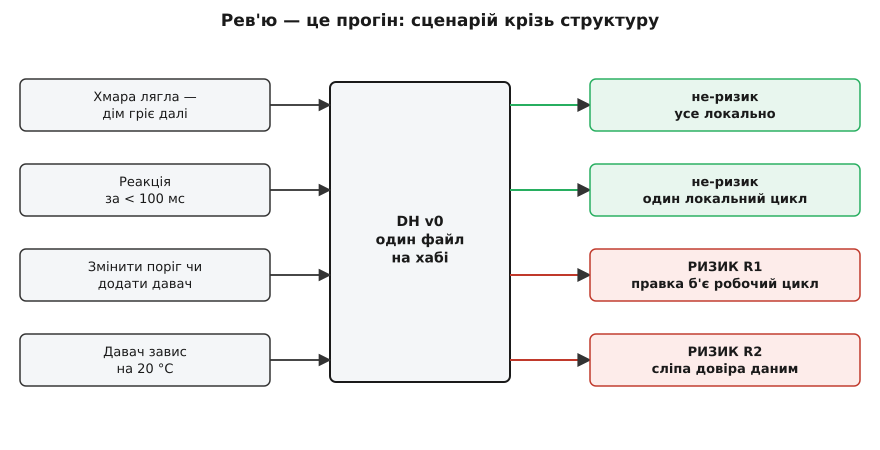
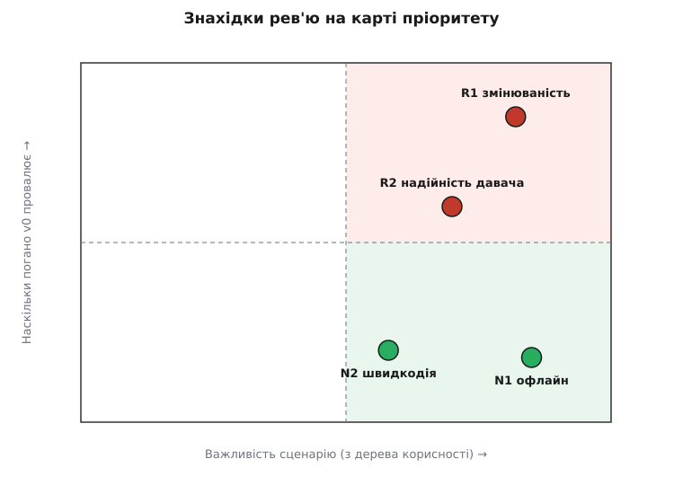

# Перше рев'ю

<preknowlist>
</preknowlist>

Ми зібрали інструменти, але жодного разу не наводили їх на щось живе. [Trade-off-аналіз](book:programming/tradeoff-analysis) навчив бачити, що кожне рішення щось віддає за те, що бере. Дерево корисності розставило сценарії за важливістю. Прикидка «на серветці» дала спосіб за хвилину оцінити порядок величини. Поки все це лежить окремо, воно — теорія. **Рев'ю** (англ. review, від лат. re- «знову» + videre «дивитися» — передивитися) — це момент, коли ми вперше наводимо весь набір на реальний проєкт і питаємо одне: чи витримає ця структура те, що для неї насправді важить?

## Рев'ю — не про код

Спокуса — розгорнути файл v0 і почати шукати негарне: коротке ім'я, магічне число, брак тесту. Це рефлекс код-рев'ю, і він тут майже марний. Код-рев'ю дивиться на рядок — чи легко його читати, чи не зламає він збірку. Рев'ю архітектури дивиться крізь рядки на **структуру під навантаженням сценарію**: не «чи гарний цей код», а «чи виживе цей поділ на частини, коли приїде те, що дерево корисності назвало найважливішим».

Різниця не косметична. Можна написати бездоганний за стилем файл, який розсиплеться від першої вимоги «додайте другий давач». І можна написати незграбний скрипт, що роками чесно тримає найважливіший сценарій. Рев'ю судить друге, а не перше. Тому воно й стоїть тут, наприкінці розмови про компроміси: спершу треба було навчитися бачити ціну рішень, і лише тоді є що передивлятися.

Механізм — простий до безсоромності. Береш один [сценарій](book:programming/attribute-scenarios), простежуєш його шлях крізь структуру й дивишся, де структура **не дає** обіцяної відповіді. Там, де не дає, — ризик. Дерево корисності вже зробило половину роботи: воно сказало, які сценарії брати першими. Нам лишається прогнати їх крізь v0 і чесно записати, що станеться.

## Підопічний під мікроскопом

Нагадаю, що таке [v0](root:progarch/dh-v0-one-sensor), бо саме його ми судимо. Весь дім — один файл на хабі:

```python
# hub.py — увесь «розумний дім» v0
THRESHOLD = 20.0                 # поріг зашитий у код

while True:
    t = read_sensor()            # один давач температури
    if t < THRESHOLD:
        heater_on()
    else:
        heater_off()
    sleep(30)
```

Десяток рядків, які працюють. І саме тому їх варто судити серйозно: «працює» — не те саме, що «витримає». Погляньмо, що ці рядки роблять із кожним пріоритетним сценарієм.

## Прогін сценаріїв

**«Хмара лягла — дім гріє далі».** Дерево корисності поставило офлайн-автономію на самий верх: дім не має тупіти, коли впав інтернет. Женемо сценарій крізь структуру — і бачимо, що v0 його **проходить**, причому задарма. У циклі немає жодного мережевого виклику; давач, поріг, рішення й грілка живуть в одному локальному процесі. Інтернету нема кому бракувати. Це не заслуга — це побічний наслідок наївності, — але результат чесний: тут структура дає рівно те, що сценарій вимагає. Ризику немає.

**«Швидка реакція».** Другий сценарій — між подією і дією не має бути відчутної паузи. І знову v0 проходить: один локальний цикл без жодного стрибка через мережу реагує за десятки мілісекунд. Ще один не-ризик. Але саме тут ховається пастка, до якої повернемось: обидва зелені вердикти тримаються на **одному й тому самому** рішенні — «усе в одному локальному процесі».

**«Змінити поріг чи додати давач».** А тепер сценарій, який дерево корисності теж підняло високо: власник хоче інший поріг, а завтра — другу кімнату з другим давачем. Женемо крізь структуру — і вона **не тримає**. Поріг зашитий у код поруч із робочим циклом опалення; змінити його — це відредагувати той самий файл, перезалити його на хаб і сподіватися, що правка не зачепила логіку, яка щойно справно гріла. Додати давач — переписати цикл, бо він уміє рівно один. Кожна зміна проходить крізь єдиний файл, де живе те, що ламати не можна. Це ризик.

**«Давач завис на 20 °C».** Останній прогін — надійність. Що як давач віддає не свіже значення, а застигле? У циклі немає жодної перевірки, що `t` узагалі оновлюється; є сліпа довіра. Застрягне давач на 19.9 — грілка грітиме вічно; застрягне на 21 — не ввімкнеться в мороз. Структура не питає «а чи це число ще справжнє?», тому сценарій вона провалює. Другий ризик.

Сценарій не мусить лишатися словами. Кожну з цих умов можна перетворити на кілька рядків, що женуть саме її крізь код v0 і червоніють, коли структура не тримає, — [так виглядає цей аудит, прогнаний як код](root:progarch/dh-v0-scenario-audit/proj-v0-audit-run.md).


*Рев'ю — це не читання коду, а прогін: кожен важливий сценарій женемо крізь ту саму структуру й дивимось, дає вона обіцяну відповідь чи ні.*

## Назвати знахідку точно

«Тут добре, а тут погано» — надто грубо, щоб на цьому діяти. [ATAM-лайт](book:programming/atam-lite) дає чотири слова, які роблять знахідку конкретною, і вони варті того, щоб уживати їх точно.

**Точка чутливості** — місце в структурі, від якого сильно залежить якийсь один сценарій. Зашитий поріг `THRESHOLD` — саме така точка для змінюваності: увесь сценарій «поміняти налаштування» впирається в цей рядок і в те, що він мешкає у файлі з робочою логікою.

**Ризик** — рішення, що загрожує сценарію. У нас їх два. R1: волатильне (поріг, набір пристроїв) не відділене від стабільного (цикл опалення), тому зміна б'є по тому, що працює. R2: вхідним даним віриться без перевірки, тому мертвий давач тихо ламає рішення.

**Не-ризик** — рішення, що сценарію не загрожує, часто непомітне. «Усе локально» — саме такий: воно задарма тримає і офлайн, і швидкодію.

**Точка компромісу** — точка чутливості, яка тягне **більш ніж один** сценарій, і то в різні боки. Ось де ховалась пастка. Рішення «увесь дім в одному локальному процесі» — не просто не-ризик. Те саме рішення, що дарує офлайн і швидку реакцію, водночас і є коренем R1: усе в одному місці — тому й ламається все разом. Один вибір, два протилежні наслідки. Це не привід його зневажати — це привід **знати**, що чіпати його доведеться обережно: рефакторинг заради змінюваності не має ненароком убити офлайн, який тут дорожчий.

> 🔧 **Навіщо це.** Рев'ю до того, як покладено перший цвях, коштує кількох годин розмови. Те саме відкриття після того, як v0 рік пропрацював у сотні домів, коштує польових виїздів, розлючених листів і переписування наживо. [Технічний борг](book:programming/technical-debt) тим і підступний, що відсотки за ним капають тихо: код працює, поки одного дня чергова «безневинна» правка не лишає когось без тепла. Рев'ю — це спосіб побачити рахунок, поки він ще малий.

## Не всі ризики рівні

Два ризики — R1 і R2 — і скінченні руки. З чого починати? Спокуса — з того, що страшніше звучить. Дисципліна — з того, що дорожче обійдеться, а це вимірюють, а не відчувають. [Прикидка «на серветці»](book:programming/back-of-envelope) для цього й потрібна.

Поміряймо R1. Ризик коштує рівно стільки, скільки перемножити «як часто його чіпають» на «скільки болю за раз»:

**Умова:** поріг і набір пристроїв власник міняє приблизно раз на тиждень; кожна зміна — правка того самого файлу, де живе цикл опалення; шанс зачепити робочий шлях правкою «наосліп» — близько 10 %.

```
змін на рік       = 52 тижні × 1        ≈ 52
шанс поломки      = 0.10 на зміну
очікувані аварії  = 52 × 0.10           ≈ 5 поломок опалення на рік
```

П'ять разів на рік дім може лишитися без тепла **не** через збій заліза, а через безневинну зміну налаштування. Для сценарію, який дерево корисності позначило найвищим пріоритетом, це неприйнятно. R2 (мертвий давач) теж реальний, але давач застигає рідше, ніж власник змінює налаштування, — тож у чергу він стає другим. Порядок з'явився не з інтуїції, а з двох множень.

Та сама логіка розставляє всі чотири знахідки на одній карті: по горизонталі — важливість сценарію (її дало дерево корисності), по вертикалі — наскільки погано v0 його провалює. Не-ризики сидять унизу праворуч: важливі, але структура їх тримає. Ризики повзуть угору, і що вище та правіше — то раніше братися.


*Вихід рев'ю — не «все погано», а впорядкована карта: верхній правий кут кричить «сюди руки», нижній правий шепоче «працює — не зламай».*

## Що рев'ю кладе на стіл

Найважливіше — чим рев'ю **не** закінчується. Воно не видає наказу «перепишіть усе». Воно кладе на стіл короткий ранжований список: R1 змінюваність — першим; R2 надійність давача — другим; офлайн і швидкодія — не чіпати, а берегти. Це вже не «мені здається, що v0 крихкий», а перелік, під яким можна підписатися й який можна показати тому, хто платить.

І список не просто називає ризики — він показує пальцем на **наступне рішення**. R1 каже: волатильне треба відділити від стабільного, поставити [шов](book:programming/modifiability-tactics) — межу, за якою поріг і набір пристроїв можна міняти, не торкаючись циклу опалення. Але «поставити шов» — це не одна очевидна дія: конфіг у файлі поруч? окремий реєстр пристроїв? плагінний рушій правил? У кожного варіанта своя ціна, і рев'ю чесно зупиняється тут — воно знайшло, **де** вирішувати, а не підмінило саме рішення. Як розкласти таку розвилку на варіанти й обрати чесно — тема [наступного кроку](root:progarch/variant-block-anatomy).

Жодного рядка коду ми не змінили — а про свій дім знаємо тепер більше, ніж поки він мовчки грів кімнату: де він тримає навантаження й вартий того, щоб його берегти, а де тріщина, до якої першими підуть руки. У цьому й суть рев'ю — не ремонт, а вміння побачити тріщину, поки вона ще лінія на кресленні, а не діра в стіні серед морозу.
