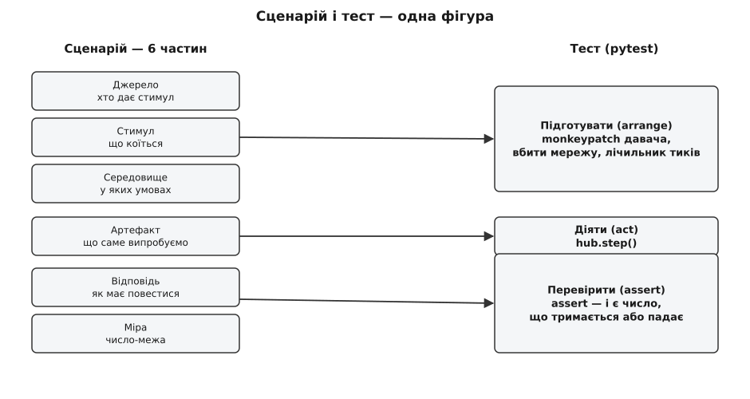
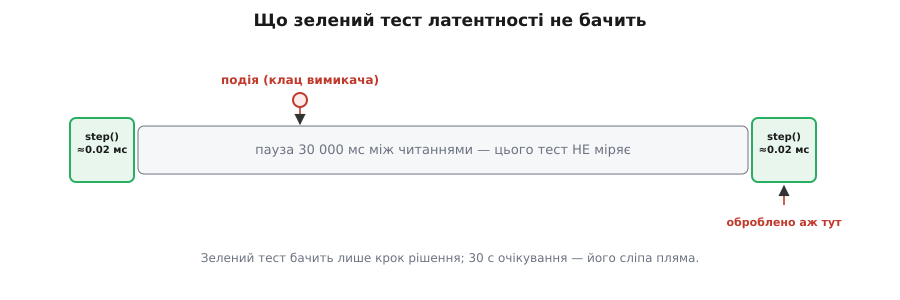

# ⚙️ Прогін рев'ю як код: чотири асерти проти v0

Рев'ю ми щойно провели словами. Вийшло чотири вердикти: два не-ризики (дім гріє офлайн; реакція без відчутної паузи) і два ризики — R1 змінюваність і R2 надійність давача. Звучить переконливо. Проблема лише в тому, що зі словами можна не погодитися. Автор [коду v0](root:progarch/dh-v0-one-sensor) має цілковите право сказати «а мені не здається, що воно крихке» — і поки ризик лишається твердженням, ця відповідь нічим не гірша за нашу. Суперечка двох вражень нічия за визначенням.

Є спосіб забрати в вердикта право бути враженням. Кожну з чотирьох умов можна перетворити на маленьку програму, що женеться саме за цією умовою крізь структуру v0 — і або лишається зеленою, або червоніє. Червоний асерт (англ. *assert* — стверджувати) — це не думка про код. Це подія, що або сталася, або ні, і подивитися на неї може кожен, хто вміє запустити один файл. Саме це ми зараз і зробимо: візьмемо `hub.py` з v0 і закодуємо той-таки аудит як чотири перевірки.

## Задача: відібрати у вердикта право бути думкою

Мета вправи не в тому, щоб «протестувати v0» у звичному сенсі — переконатися, що він правильно вмикає грілку. Це якраз працює, ми й не сумнівалися. Мета інша: зробити так, щоб **знахідка рев'ю перестала спиратися на чиюсь інтуїцію**. «R1: волатильне не відділене від стабільного» — доки це речення, його вага дорівнює вазі того, хто його вимовив. Той-таки R1 у вигляді тесту, який червоніє, важить стільки, скільки важить факт: запусти й побачиш.

Різниця не косметична, а політична — у буквальному сенсі розподілу влади в команді. Слова в рев'ю програють тому, хто голосніший або старший за посадою. Червоний асерт не має ні голосу, ні посади. Він рівний для всіх, і полагодити його можна рівно одним способом — змінити структуру так, щоб він позеленів. Ось що ми виграємо, переклавши аудит на код: не нове знання про v0 (знання вже здобуте на рев'ю), а **незаперечність** цього знання.

## Ідея: сценарій і тест — одна фігура

Переклад дається легко, бо [сценарій](book:programming/attribute-scenarios) і тест — це та сама фігура, лише різними словами. Сценарій якісного атрибута має шість частин: джерело подразника, сам стимул, артефакт (що випробовуємо), середовище (в яких умовах), очікувану відповідь і, найголовніше, **міру** — число, на якому відповідь або тримається, або ламається. Тест влаштований так само, тільки частин у нього видимих три: підготувати стан (*arrange*), виконати дію (*act*), перевірити результат (*assert*). Досить накласти одне на одне — і кожна частина сценарію знаходить своє місце в тесті.


*Сценарій закінчується мірою — числом; тест закінчується асертом — тим самим числом, лише таким, що падає, коли не тримається. Це один предмет у двох записах.*

Джерело, стимул і середовище стають підготовкою: ми зводимо той самий світ, у якому має спрацювати сценарій, — холодний давач, убиту мережу, застиглий сигнал. Артефакт — це те, що ми викликаємо: один крок рішення v0. А відповідь із мірою стають асертом: рядок, який промовляє «грілка мала ввімкнутися», «пауза мала бути менша за сто мілісекунд» — і падає, якщо ні. Прогнати сценарій крізь структуру, що на рев'ю ми робили в голові, олівцем по коду, тепер робить машина: механічно, однаково й стільки разів, скільки треба.

## Спершу v0 треба зробити спостережним

Тут ховається перша чесна складність, і замовчати її було б обманом. Узяти `hub.py` і «просто написати до нього тести» не вийде — його нíяк ухопити. Уся програма v0 — це вічний цикл із апаратними викликами всередині:

```python
# hub.py — v0, як він є
import time

THRESHOLD = 20.0                 # поріг зашитий у код

def read_sensor():               # драйвер конкретного давача → °C (локальний, без мережі)
    with open("/dev/therm0") as f:
        return float(f.read())

def heater_on():                 # драйвер конкретної розетки
    with open("/dev/relay0", "w") as f:
        f.write("1")

def heater_off():
    with open("/dev/relay0", "w") as f:
        f.write("0")

while True:
    t = read_sensor()
    if t < THRESHOLD:
        heater_on()
    else:
        heater_off()
    time.sleep(30)
```

Що тут викликати з тесту? Імпортувати цей файл не можна — на рядку `while True` імпорт зависне назавжди. Читання ходить у справжній `/dev/therm0`, якого на машині тесту немає. Дія смикає справжнє реле. Щоб хоч про щось запитати структуру, її треба спершу зробити **спостережною**: розчепити «один крок» і «крутити вічно», щоб той один крок можна було покликати окремо.

```python
# hub.py — той самий v0, лише крок відділено від вічного циклу
import time

THRESHOLD = 20.0

def read_sensor():
    with open("/dev/therm0") as f:
        return float(f.read())

def heater_on():
    with open("/dev/relay0", "w") as f:
        f.write("1")

def heater_off():
    with open("/dev/relay0", "w") as f:
        f.write("0")

def step():                      # рівно одна ітерація старого циклу
    t = read_sensor()
    if t < THRESHOLD:
        heater_on()
    else:
        heater_off()

def run():                       # те, що було while True
    while True:
        step()
        time.sleep(30)

if __name__ == "__main__":
    run()
```

Ця правка нічого в поведінці не міняє: `run()` робить рівно те, що робив цикл. Але вона важлива двома речами, і обидві варто назвати вголос, бо їх легко переплутати.

Перша: ми **вже мусили торкнутися v0**, щоб його роздивитися. Аудит не буває зовсім безкоштовним — навіть щоб поспостерігати структуру, довелося прорізати в ній маленький отвір. Добра новина в тому, що цей отвір поведінково-нейтральний (extract method — витягли тіло циклу в окрему назву), і його ціна — кілька рядків, а не переписування.

Друга, тонша: `step()` усе одно читає **глобальні** `read_sensor`, `heater_on` і `THRESHOLD`. Ми не провели між ними [шва](book:programming/modifiability-tactics) — межі, за якою давач можна підмінити, не чіпаючи логіку. Тому в тесті доведеться підмінювати самі глобальні імена модуля (те, що в pytest роблять через `monkeypatch`). І це не випадковість, а той-таки R1, побачений з іншого боку: те, що змушує тест лізти в нутрощі модуля, — і є відсутній шов. Аудит ще не почався, а перша ознака ризику вже проступила в тому, **як важко** до структури підступитися.

## Чотири асерти

Тепер у нас є `step()`, який можна кликати. Кладемо поряд файл `audit_v0.py` і перекладаємо кожен вердикт рев'ю на одну перевірку. Ідемо в тому ж порядку, що й на рев'ю: спершу два сценарії, які структура тримає, потім два, які провалює.

**Умова 1 (офлайн-автономія): вирубимо мережу цілком — рішення все одно має статися.** Найважливіший драйвер DH — дім живий без хмари. Закодуємо буквально: підмінюємо `socket` так, щоб будь-яка спроба вийти в мережу вибухала, а тоді женемо холодний давач крізь `step()`.

```python
import socket
import time
import hub

def test_offline_still_decides(monkeypatch):
    # середовище: інтернету НЕМА — будь-який сокет одразу падає
    def no_network(*a, **k):
        raise OSError("мережу відрубано")
    monkeypatch.setattr(socket, "socket", no_network)

    # давач каже «холодно»; команди грілці лише записуємо
    monkeypatch.setattr(hub, "read_sensor", lambda: 18.0)
    fired = []
    monkeypatch.setattr(hub, "heater_on",  lambda: fired.append("on"))
    monkeypatch.setattr(hub, "heater_off", lambda: fired.append("off"))

    hub.step()                                  # один крок рішення

    assert fired == ["on"]                       # рішення сталося попри вбиту мережу
```

*Висновок: зелено.* І зелено воно рівно тому, чому на рев'ю ми записали не-ризик: у `step()` немає жодного мережевого виклику, тож убивати нема чого. Тест не робить структуру офлайновою — він **показує**, що вона вже така, і робить це так, що заперечити нíчим: ось код, ось убита мережа, ось спрацьована грілка.

**Умова 2 (швидка реакція): один крок рішення має вкладатися в бюджет.** Другий не-ризик — між подією і дією нема відчутної паузи. Міряємо стінним годинником сам шлях рішення (без 30-секундного сну, що живе в `run()`, а не в `step()`).

```python
import time
import hub

def test_decision_latency_under_budget(monkeypatch):
    monkeypatch.setattr(hub, "read_sensor", lambda: 18.0)
    monkeypatch.setattr(hub, "heater_on",  lambda: None)
    monkeypatch.setattr(hub, "heater_off", lambda: None)

    start = time.perf_counter()
    hub.step()
    elapsed_ms = (time.perf_counter() - start) * 1000

    assert elapsed_ms < 100                      # шлях рішення без мережевого стрибка
```

*Висновок: зелено, з зіркою.* Локальна гілка без стрибка через мережу відпрацьовує за соті частки мілісекунди — сто в неї величезний запас. Зірку до цього «зелено» ми поставимо трохи згодом: вона й буде першою пасткою.

**Умова 3 (R1, змінюваність): другий давач у другій кімнаті — кожен зі своєю грілкою.** Ось перший ризик. Сценарій дерева корисності — не просто «поміняти поріг», а «додати друге приміщення». Закодуємо його чесно: дві кімнати, у кожної власний давач і власна грілка; спальня холодна — її грілка має ввімкнутися.

```python
import hub

def test_two_rooms_each_own_heater(monkeypatch):
    fired = {"bedroom": [], "living": []}

    # структура знає лише ОДИН давач і ОДНУ грілку — чиї вони, вона не питає
    monkeypatch.setattr(hub, "read_sensor", lambda: 18.0)                 # холодно
    monkeypatch.setattr(hub, "heater_on",  lambda: fired["bedroom"].append("on"))
    monkeypatch.setattr(hub, "heater_off", lambda: fired["bedroom"].append("off"))

    hub.step()

    # у вітальні свій давач і своя грілка — а їх у структурі просто немає
    assert fired["living"], "грілка вітальні жодного разу не отримала команди"
```

*Висновок: червоно.* І червоно не тому, що ми написали кривий тест, а тому, що сценарій **неможливо навіть виразити** проти цієї структури. `step()` уміє звернутися рівно до одного давача й однієї грілки; другої кімнати для нього не існує в природі. Список `fired["living"]` лишається порожнім, бо йому нíчому туди потрапити. Червоний асерт тут — точний відбиток того зрощення «давач рівно один», яке v0 закарбував у самій формі коду. R1 перестав бути буквою.

**Умова 4 (R2, надійність давача): застиглий давач структура мусить помітити.** Другий ризик — сліпа довіра вхідному числу. Змоделюймо мертвий давач: 240 читань поспіль (дві години по 30 секунд) віддають те саме 19.9.

```python
import hub

def test_stuck_sensor_is_flagged(monkeypatch):
    monkeypatch.setattr(hub, "read_sensor", lambda: 19.9)                 # застиг намертво
    monkeypatch.setattr(hub, "heater_on",  lambda: None)
    monkeypatch.setattr(hub, "heater_off", lambda: None)

    for _ in range(240):                          # 2 год по 30 с — те саме число
        hub.step()

    # надійність: після 240 однакових читань хаб мусив би засумніватися
    assert getattr(hub, "stale_alarm", False), \
        "давач застиг на 19.9 — хаб не помітив і грів дві години наосліп"
```

*Висновок: червоно.* `getattr(hub, "stale_alarm", False)` повертає `False`, бо ніякого `stale_alarm` у v0 немає й бути не може: структура ніде не тримає стану «а чи оновлюється взагалі це число?». Двісті сорок разів поспіль вона побачила 19.9 і двісті сорок разів беззастережно повірила. Асерт червоніє на цій сліпій довірі — рівно на тому, що на рев'ю ми назвали R2.

## Прогін: два зелені, два червоні

Запускаємо все разом — і рев'ю з розмови стає подією:

```text
$ pytest -q audit_v0.py
..FF                                                                     [100%]
=================================== FAILURES ===================================
_________________________ test_two_rooms_each_own_heater _______________________
    assert fired["living"], "грілка вітальні жодного разу не отримала команди"
E   AssertionError: грілка вітальні жодного разу не отримала команди
E   assert []
_________________________ test_stuck_sensor_is_flagged _________________________
    assert getattr(hub, "stale_alarm", False), \
E   AssertionError: давач застиг на 19.9 — хаб не помітив і грів дві години наосліп
E   assert False
2 failed, 2 passed in 0.04s
```

`..FF` — дві крапки, дві літери: офлайн і латентність пройшли, змінюваність і надійність упали. Це вже не «мені здається, що v0 крихкий». Це `2 failed`, і поряд — рядки, що самі кажуть, **де** саме крихкий: грілка другої кімнати не отримала команди; застиглому давачу повірили двісті сорок разів. Той самий висновок, який рев'ю зробило словами, тепер лежить у вигляді, під яким може підписатися машина. Хочеш заперечити ризик — не сперечайся з людиною, а зроби так, щоб `pytest` показав `4 passed`. Іншого способу немає, і в цьому вся сила.

## Складність і пастки

Червоний асерт незаперечний — і саме тому спокусливо повірити, що зелений так само незаперечний. Це неправда, і три застереження нижче важать не менше за самі перевірки.

**Зелене не означає добру структуру.** Тест — це сітка, і дірки в ній прорізали ми самі, розміром рівно з ті запитання, які додумалися поставити. Пройдений тест каже одне-єдине: «та конкретна умова, яку я спитав, тримається». Не «структура добра», не «сценарій безпечний» — лише «саме це саме так». Згадаймо зірку біля другого тесту. Він виміряв латентність `step()` — і чесно позеленів: шлях рішення справді мікросекундний. Але «швидка реакція» для вимикача світла — це подія в кімнаті й лампа за сто мілісекунд, а v0 опитує давач раз на **тридцять секунд**. Ця тридцятисекундна пауза живе в `run()`, якого наш тест і не торкався. Зелений асерт про латентність не збрехав — він просто дивився не туди, і його зелень нічого не знає про діру завширшки з півхвилини поряд.


*Перевірка бачить рівно те, на що наведена. Між двома її поглядами — тридцять секунд, яких вона не міряє, і в цю щілину провалюється зовсім інший сценарій.*

**Слабка версія сценарію бреше зеленим.** Ця пастка — сестра попередньої, тільки підступніша. Уявімо, що R1 ми закодували б ліниво — не «додати другу кімнату», а лише «поміняти поріг»:

```python
def test_change_threshold(monkeypatch):
    monkeypatch.setattr(hub, "THRESHOLD", 22.0)   # підмінили константу
    monkeypatch.setattr(hub, "read_sensor", lambda: 21.0)
    fired = []
    monkeypatch.setattr(hub, "heater_on",  lambda: fired.append("on"))
    monkeypatch.setattr(hub, "heater_off", lambda: fired.append("off"))
    hub.step()
    assert fired == ["on"]                          # 21 < 22 → гріємо
```

Він **зелений**. Поріг справді змінюється — підміни число й по всьому. І якби ми зупинилися на цій версії, то записали б «змінюваність у порядку» — і збрехали б собі, бо перевірили найлегший, найбезпечніший різновид зміни. Той самий сценарій у вимогливій формі — другий давач — червоніє негайно. Один сценарій, дві версії, протилежні вердикти. Мораль сувора: перевірку варто рівно стільки, скільки коштує **найважча** зміна, яку сценарій дозволяє собі уявити. Спитаєш легке — почуєш утішну брехню.

**І головне: це ще не фітнес-функція.** Чотири асерти зробили велику роботу — але вони одноразові. Ми написали їх, прогнали раз, побачили `..FF`, дістали доказ і поклали в шухляду. Вони прив'язані до тестового риштування (`monkeypatch` глобальних імен), а не до самої структури продукту, і ніхто не запустить їх завтра. [Фітнес-функція](book:programming/fitness-functions) — інша тварина: вона живе в збірці й падає **на кожній зміні**, щойно система порушує обіцяну міру. Різниця між нашим прогоном і нею — це різниця між «одного разу поставив діагноз» і «повісив на структуру постійного вартового». Наш офлайн-асерт діагностує v0 сьогодні; фітнес-функція з нього виросте того дня, коли ми захочемо, щоб збірка **сама** червоніла, тільки-но хтось додасть мережевий виклик у гарячий шлях хаба. Але це вже інструмент іншого кроку — тут ми лише навели на нього місток і зупиняємося, не забігаючи наперед.

Ось що дав прогін: рев'ю більше не тримається на нічиєму слові. Два вердикти позеленіли, два почервоніли, і кожен доступний для перевірки будь-кому з `pytest`. А куди подіти два червоні — де саме різати структуру, щоб вони позеленіли, не вбивши двох зелених, — це вже вибір між варіантами, і його [ми розкладемо наступним кроком](root:progarch/variant-block-anatomy).
