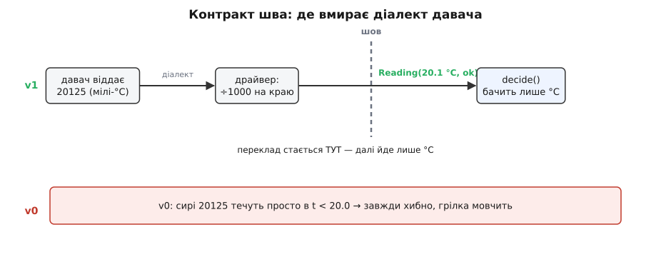
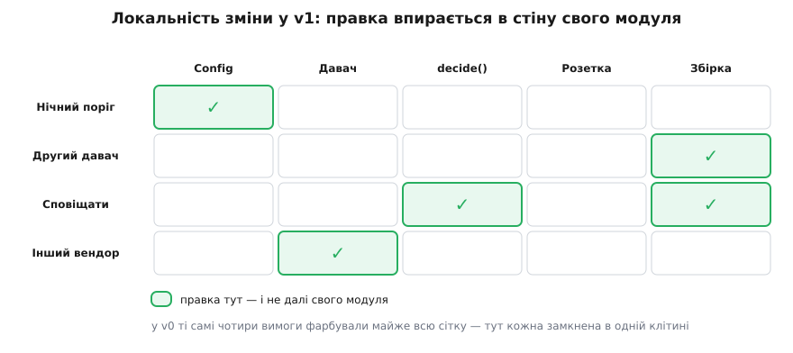

# DH v0 → v1: перший рефакторинг межами

<preknowlist>
- [Digital Homes v0](root:progarch/dh-v0-one-sensor) — наш підопічний: увесь дім в одному файлі, читання-рішення-дія зварені в одну лінію, поріг зашитий у код.
- [Зчеплення і зв'язність](topic:sf-apps/coupling-cohesion) — зчеплення: торкнув одне рішення — переробляєш і сусіднє; зв'язність — коли в одному місці живе те, що й міняється разом.
- [Приховування інформації](topic:sf-apps/information-hiding) — критерій Парнаса: різати систему на модулі навколо того, що ймовірно **зміниться**, і ховати це за стійким інтерфейсом.
- [Принцип інверсії залежностей (DIP)](topic:sf-apps/dependency-inversion) — високорівнева логіка залежить від абстракції (порту), а конкретний драйвер її реалізує, не навпаки.
</preknowlist>

Весь модуль ми збирали інструменти межі — і жодного разу не піднесли їх до живого коду. [Зчеплення і зв'язність](topic:sf-apps/coupling-cohesion) дали мову, щоб назвати, коли два рішення склеєні. [Приховування інформації](topic:sf-apps/information-hiding) сказало, що ховати треба саме те, що змінюється. [Інверсія залежностей](topic:sf-apps/dependency-inversion) показала, як розвернути стрілку залежності, щоб логіка не тримала в руках марку заліза. [Чисті функції](topic:sf-apps/pure-functions-side-effects), [незмінність](topic:sf-apps/immutability), [DTO](topic:sf-apps/dto) на межі, [помилки крізь шари](root:progarch/errors-through-layers) — усе це лежить готовим набором. Настав час зробити ним щось із нашим домом.

Візьмемо [v0](root:progarch/dh-v0-one-sensor) — той самий десяток рядків, що чесно гріли одну кімнату, — і вперше свідомо змінимо його **форму**. Не щоб додати функцію. Щоб провести межі там, де v0 їх зварив.

## Рефакторинг — не переписування і не нові функції

Спершу домовмося, чим v1 **не** є, бо інакше легко з'їхати не туди. Це не «перепишемо як слід» — v0 і так був слушним для одного дому. Це не «додамо нарешті хмару, базу, кілька кімнат» — жодної нової можливості v1 не приносить. Кімната гріється так само, поріг той самий, поведінка збоку — байдужа до того, що всередині.

Те, що змінюється рівно всередині, а назовні непомітне, — це **рефакторинг** (англ. *refactoring*, від *re-* «знову» + *factor* «розкладати на множники»): міняємо структуру, зберігаючи поведінку. Аналогія з арифметики точна й показує саме межу: розкласти 12 на 2·2·3 — це не інше число, це те саме 12, побачене крізь його множники. Ми не робимо дім теплішим; ми виносимо назовні множники, з яких він і без того складався, — просто досі вони були перемножені в одну кашу.

> 🔧 **Навіщо це.** Поведінка ціла — отже, рефакторинг можна робити **маленькими безпечними кроками** й будь-коли спинитися: після кожного кроку дім усе ще гріє. Якби ми змішали «розтяти шви» з «додати кімнати», то, зловивши баг, не знали б, звідки він — з нової межі чи з нової функції. Тому дисципліна залізна: спершу форма **без** нових можливостей, аж потім, на чистій формі, — можливості. Одне за раз.

## Три шви, які вимагали розтину

Пригадаймо, що саме ламалося у v0, коли ми [тицяли в нього змінами](root:progarch/dh-v0-one-sensor). Нічний поріг ліг цяткою — а три інші вимоги розповзлися по файлу. І кожна з тих трьох упиралася в свій **зварений шов**:

- «Сповіщати, а не гріти» боліло, бо **рішення й дія** зрослися в один жест `if холодно: увімкнути` — щілини між «вирішив» і «зробив» не було.
- «Інший вендор давача» тихо ламав опалення, бо **діалект заліза й логіка** зрослися: рішення напряму читало `20125` мілі-градусів, які видавав драйвер.
- «Змінити поріг» щоразу означало правити файл із робочим циклом, бо **волатильне** (поріг) сиділо в одному тілі зі **стабільним** (цикл опалення) — це той самий ризик R1, що його [перше рев'ю](root:progarch/dh-v0-scenario-audit) поставило першим.

Три болі — три шви. Отже, і план v1 — рівно три розтини, більше нічого: відділити читання від рішення, рішення від дії, і виставити поріг назовні. Різати навмання «щоб було модульно» — та сама передчасна складність, від якої курс застерігає; ми ріжемо **тільки** там, куди вже тицьнули реальні вимоги.

## Шов перший: давач за портом

Почнімо з найпідступнішого болю — мовчазної поломки від зміни вендора. Її корінь у тому, що рішення довіряло драйверові без жодного контракту: що той віддасть, у тих одиницях воно й порівнювалося. Полагодити це — значить провести між ними **межу, яка вголос називає, що її перетинає**.

Межу креслять два штрихи. Перший — **значення**, що ходить через шов: не гола `float`, а іменований [об'єкт передачі даних (DTO)](topic:sf-apps/dto), у якому одиниця записана в самому типі. Другий — **порт**: інтерфейс, від якого залежить логіка, замість конкретного давача. Драйвер тепер зобов'язаний цей порт реалізувати, тобто [стрілка залежності інвертується](topic:sf-apps/dependency-inversion) — не логіка тягнеться до заліза, а залізо підганяється під контракт логіки.

:::tabs
```py
from dataclasses import dataclass
from typing import Protocol

@dataclass(frozen=True)            # незмінний: отримав Reading — його вже не підмінять
class Reading:
    celsius: float                 # ЗАВЖДИ °C: одиниця живе в контракті, не в чиїйсь голові
    ok: bool = True                # чи вдалося дістати справжнє свіже число

class Sensor(Protocol):            # ПОРТ: рішення залежатиме від цього, а не від марки заліза
    def read(self) -> Reading: ...

class OneWireThermometer:          # драйвер: мову СВОГО давача знає тільки він
    def read(self) -> Reading:
        raw = self._device.millicelsius()    # 20125 — діалект саме цього давача
        return Reading(celsius=raw / 1000)   # переклад на °C ТУТ, на самому краю
```
```ts
interface Reading {
  readonly celsius: number;   // ЗАВЖДИ °C: одиниця в контракті, не в голові
  readonly ok: boolean;       // чи вдалося дістати справжнє свіже число
}

interface Sensor {            // ПОРТ: рішення залежить від цього, а не від марки заліза
  read(): Reading;
}

class OneWireThermometer implements Sensor {   // мову свого давача знає тільки драйвер
  read(): Reading {
    const raw = this.device.millicelsius();     // 20125 — діалект саме цього давача
    return { celsius: raw / 1000, ok: true };   // переклад на °C ТУТ, на самому краю
  }
}
```
:::

Гляньте, куди тепер потрапляє те кляте `20125`. Воно народжується всередині драйвера, там-таки, на краю, ділиться на тисячу — і за шов виходить уже чесним `Reading(celsius=20.1)`. Мілі-градуси **фізично не можуть** дотекти до рішення: між ними стоїть контракт, який каже «сюди — тільки °C». Заміна вендора стає новим класом за тим самим портом `Sensor`, що конвертує **свій** діалект у себе; рішення про цю заміну не дізнається взагалі.


*Той самий діалект давача: у v0 він тік просто в рішення й тихо його ламав; у v1 переклад стається на краю драйвера, а контракт шва пропускає лише °C.*

Це і є [приховування інформації](topic:sf-apps/information-hiding) у чистому вигляді: драйвер **ховає** те, що ймовірно зміниться (марку й діалект давача), за інтерфейсом, що не змінюється. А `Reading`, зроблений незмінним (`frozen` / `readonly`), додає тиху гарантію: значення, яке рішення побачило, ніхто по дорозі не перепише — [незмінність](topic:sf-apps/immutability) прибирає цілий клас питань «а чи те саме число дійшло».

> 🔧 **Навіщо це.** Порт — це страховий поліс проти вимирання заліза. Давач, куплений сьогодні, за три роки знімуть із виробництва, а на заміну прийде інший, зі своїм діалектом. Без порту така заміна означала б хірургію по всьому коду опалення в проді; із портом це новий клас на сотню рядків, дописаний збоку, поки логіка рішення спить незворушно. Ти платиш за межу один раз наперед — і викуповуєш собі спокій щоразу, коли постачальник щось міняє за твоєю спиною.

## Шов другий: рішення як чиста функція

Тепер розварімо рішення й дію. У v0 вони були одним жестом: `if t < THRESHOLD: heater_on()`. Тут немає значення «холодно» — є одразу вчинок. Саме тому туди й не втискалося друге «тому»: щоб поряд із «холодно — тому грій» став ще й «холодно — тому напиши», спершу треба, щоб «холодно» **існувало окремо** як щось, з чим можна робити різне.

Витягнімо його в **чисту функцію** (англ. *pure* — без домішок): вона бере вимір і конфіг, а віддає **команду-значення** — що́ належить зробити, — і сама при цьому не робить нічого. Ні розетки не смикне, ні в лог не напише.

:::tabs
```py
from enum import Enum, auto

class Command(Enum):               # рішення — це ЗНАЧЕННЯ, а не вчинок
    HEAT = auto()
    IDLE = auto()

def decide(r: Reading, cfg: "Config") -> Command:   # чиста: ті самі входи → той самий вихід
    if not r.ok:
        return Command.IDLE        # давач мовчить → безпечний спокій, а не «грій наосліп»
    return Command.HEAT if r.celsius < cfg.threshold else Command.IDLE
```
```ts
type Command = "HEAT" | "IDLE";   // рішення — це ЗНАЧЕННЯ, а не вчинок

function decide(r: Reading, cfg: Config): Command {   // чиста: входи → вихід, жодних ефектів
  if (!r.ok) return "IDLE";       // давач мовчить → безпечний спокій, не «грій наосліп»
  return r.celsius < cfg.threshold ? "HEAT" : "IDLE";
}
```
:::

Три речі сталися одним рухом. По-перше, `decide` тепер [чиста](topic:sf-apps/pure-functions-side-effects) — а отже, її можна перевірити, не піднімаючи жодного заліза: подав `Reading(19.0)`, отримав `HEAT`, і крапка, без розеток і без мереж. По-друге, з'явилася та сама щілина: команда — це значення, тож додати до неї третій різновид (написати сповіщення) буде дописуванням гілки, а не розтином наживо. По-третє — і це тонко — тут-таки, на межі, ми чесно вчинили з поганим виміром: якщо драйвер віддав `ok=false`, рішення не вдає, ніби все гаразд, а обирає безпечний спокій. Це [помилка, проведена крізь шар](root:progarch/errors-through-layers): драйвер переклав збій заліза (таймаут, сміття в контрольній сумі) на доменне «числу вірити не можна», а рішення на це доменне слово свідомо відповіло. У v0 такого слова не було — була сліпа довіра, той самий ризик R2.

Застережуся чесно: `ok=false` ловить давач, що **замовк** чи віддав сміття, — але не давач, що **завис** на правдоподібному 20 °C. Застиглий вимір v1 поки що прийме за свіжий. Різниця в тім, що тепер для цієї перевірки **є місце**: обгортка над портом `Sensor`, яка стежить, чи число ще ворушиться. У зварному v0 такому вартовому ніде було й стати. Межа не полагодила надійність до кінця — вона дала їй **де жити**.

## Шов третій: дія за портом, а поріг — геть із логіки

Лишилося двоє. Дію ставимо за такий самий порт, що й давач, — розетка ховається за інтерфейсом `Heater`, і драйвер лишається [ідемпотентним](topic:sf-release/design-by-contract) (повторний «увімкни» на ввімкненому нічого не робить — реле не смикається дарма). А поріг, останній зварений шов, нарешті виймаємо зі шляху рішення в окремий `Config`:

:::tabs
```py
@dataclass(frozen=True)
class Config:
    threshold: float = 20.0        # поріг більше не літерал усередині рішення

class Heater(Protocol):            # ПОРТ дії: розетка за абстракцією
    def on(self) -> None: ...      # ідемпотентно
    def off(self) -> None: ...
```
```ts
interface Config {
  readonly threshold: number;   // поріг більше не літерал усередині рішення
}

interface Heater {              // ПОРТ дії: розетка за абстракцією
  on(): void;                   // ідемпотентно
  off(): void;
}
```
:::

Тепер поріг — вхідний параметр рішення, а не його нутрощі. Змінити його — це підмінити `Config`, і жоден рядок робочого циклу опалення при цьому не здригнеться. Волатильне відділене від стабільного; R1, який рев'ю поставило найпершим, знято не тактикою на майбутнє, а самою формою.

## Збірка: тонкий цикл, що зшиває

Три шви прорізано — лишається зшити чотири шматки назад у робочий дім. Це робить **збірка** (англ. *composition root* — корінь склеювання): єдине місце, де абстрактні порти зустрічають конкретні драйвери й де народжується цикл.

:::tabs
```py
def run(sensor: Sensor, heater: Heater, cfg: Config):
    while True:
        reading = sensor.read()          # драйвер ховає діалект заліза
        match decide(reading, cfg):      # чисте рішення — саме лише °C усередині
            case Command.HEAT: heater.on()
            case Command.IDLE: heater.off()
        sleep(30)

# єдине місце, де конкретне зустрічає конкретне:
run(sensor=OneWireThermometer(), heater=SmartPlug(), cfg=Config(threshold=20.0))
```
```ts
function run(sensor: Sensor, heater: Heater, cfg: Config) {
  while (true) {
    const reading = sensor.read();        // драйвер ховає діалект заліза
    const cmd = decide(reading, cfg);     // чисте рішення — саме лише °C усередині
    if (cmd === "HEAT") heater.on();
    else heater.off();
    sleep(30);
  }
}

// єдине місце, де конкретне зустрічає конкретне:
run(new OneWireThermometer(), new SmartPlug(), { threshold: 20.0 });
```
:::

Придивіться до `run`. Той самий кістяк `read → decide → act`, що й у v0, — але кожна стрілка тепер перетинає названий шов. Читання приходить з-за порту `Sensor` уже в градусах; рішення — окреме, чисте, бачить лише `Reading` і `Config`; дія йде за порт `Heater`. Цикл нічого не знає ні про мілі-градуси, ні про марку розетки, ні про те, звідки взявся поріг. Він лише **диригує**. Повний робочий v1 із моковою фізикою кімнати, вкиданням збоїв давача й усіма чотирма правками, прогнаними наживо, зібрано в [робочому v1](root:progarch/dh-v1-modules/proj-dh-v1.md) — тут показано кістяк, бо на ньому вже все видно.


*Той самий дім, та сама поведінка: v0 тримав усе в одному тілі, v1 розклав його на модулі, між якими ходять названі значення, а збірка лишилася тонким диригентом.*

## Плата за межі

Межі коштували роботи. Спитаймо просто: що ми за неї купили? Найчесніша перевірка — прогнати крізь v1 ті самі чотири вимоги, що [колись роздирали v0](root:progarch/dh-v0-one-sensor), і подивитись, куди тепер дістає кожна правка.

- **Нічний поріг.** Торкається лише `Config` — поріг стає функцією часу доби. Ні `decide`, ні драйвери, ні цикл не ворушаться.
- **Другий давач.** `decide` і драйвери — незмінні; росте тільки збірка: заводимо другу трійку «давач-рішення-розетка», а `run` учиться тримати їхній список. Чиста функція рішення в кожної кімнати та сама.
- **Сповіщати замість гріти.** До `Command` додається третє значення `ALERT`, до `decide` — гілка, до збірки — куди його слати. Шов не розрізають — у нього **дописують**.
- **Інший вендор.** Новий клас за портом `Sensor`, що конвертує свій діалект на краю. `decide` не бачить різниці — мілі-градуси до нього не доходять.


*Ті самі чотири правки, що у v0 запалювали півфайлу, у v1 кожна лишається у своєму модулі: шов і є та стіна, об яку гаситься радіус ураження.*

Ось що купили межі — не швидший дім, а **локальність зміни**. У v0 кожна з цих вимог розходилася хвилею; у v1 кожна впирається в стіну свого модуля й далі не йде. Оце й є на дотик те, заради чого ми весь модуль говорили про зчеплення: [низьке зчеплення](topic:sf-apps/coupling-cohesion) — це не естетика, це коли правку не доводиться проносити через півсистеми. Ми не зробили дім розумнішим. Ми зробили його **дешевшим до зміни** — і рівно там, куди майбутні зміни, як ми вже перевіряли, і прийдуть.

## Де ми спинилися — і чому саме тут

Спокуса на цьому розігнатися величезна: якщо межі так добре гасять зміни, то нарубаймо їх ще — інтерфейс на конфіг, шар над логом, фабрику фабрик. Це була б та сама помилка, лише з іншого боку. У v0 гріхом було б навести абстракцій під один датчик завчасно; тут гріхом було б наводити межі там, куди **жодна реальна вимога ще не тицьнула**. Ми провели рівно три шви, бо болів було рівно три, і кожен показав пальцем, де різати. Четвертий шов «про всяк випадок» — це знову складність, за яку платиш зараз, а користь гіпотетична.

Тож v1 лишається чесно скромним: досі один процес, одна машина, дім у пам'яті. Ми не завели ні бази, ні хмари, ні кількох потоків — бо жодна вимога цього поки не зажадала. Що ми зробили — навчили дім тримати зміну в межах модуля. І кожен наступний великий крок курсу тепер має, за що зачепитися: коли прийде рестарт, що губить дані, межа скаже, де вставити сховище; коли прийде хмара — де пролягає шов між домом і сервером. Порожній файл v0 не давав таких місць; v1 їх виточив. Далі ми ці місця й почнемо заповнювати — по одному, коли за кожне з'явиться справжня причина заплатити.
