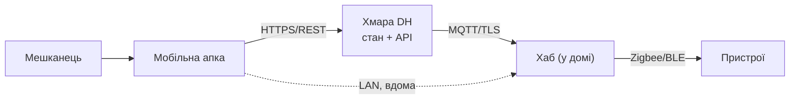
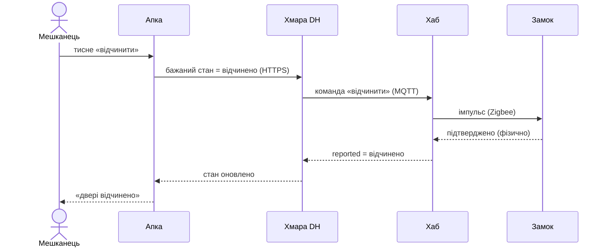

# DH на папері

<preknowlist>
- [MQTT](book:communications/mqtt) — довге двобічне з'єднання пристрій↔хмара: команди й телеметрія однією трубою, присутність онлайн/офлайн майже задарма; і що з цим з'єднанням стається, коли мережа падає.
- [Затримка й надійність](book:communications/latency-reliability) — кожен мережевий стрибок коштує часу й може не дійти, тож «хто з ким говорить через мережу» напряму задає поведінку системи.
</preknowlist>

Ми вже чимало вирішили про Digital Homes. Звели дерево корисності й побачили, які якості для дому головні; склали ризик-реєстр; чесно домовились, чого **не** будувати. Але все це — розсипані нотатки й картинки в кількох головах. DH досі існує як домовленість, а не як щось, на що можна показати пальцем. А попереду рости: перебирати хаб, виносити логіку в хмару, підключати апку. Перш ніж писати цей код, систему треба **побачити** цілою — і так, щоб її однаково бачив кожен у команді.

Спробуйте намалювати DH одним рисунком — і одразу вдаритесь у стіну. Покажете, як апка ходить у хмару, — сховаєте, що хаб тримає дім живим і без хмари. Покажете коробки-складники — не видно, де вони фізично крутяться й що з ними робить обрив мережі. Один рисунок мусить або збрехати, або втопити читача в деталях. Саме тому ми щойно розбирали множинні в'ю: не «краща діаграма», а **набір** діаграм, де кожна відповідає на одне питання й свідомо мовчить про решту.

Аналогія — креслення будинку. Дім описують не одним листом, а пачкою: план поверху, електрика, водогін, вентиляція. Одна будівля — багато креслень, кожне для свого фаху й ховає чуже; електрику не обходить, де труби, і навпаки. Де аналогія ламається — а вона ламається, і це варто бачити: наші в'ю перекриваються сильніше (та сама «хмара» стоїть і на контейнерній в'ю, і на в'ю розгортання), і, на відміну від паперового креслення, ми вміємо **генерувати** їх усі з одного текстового опису. Тож «на папері» тут не про туш і кальку, а про «до коду, у формі, яку дешево міняти».


*Одна система — чотири в'ю, і кожна відповідає на власне питання. Ловити треба не «правильну» діаграму, а повний набір питань.*

Ці чотири рамки — не випадковий набір, а сходинки [моделі C4](book:programming/c4-model), які ми щойно проходили, плюс дві динамічні в'ю поверх них. Пройдімо їх по черзі — вже не абстрактно, а на живому DH.

## Контекст: де межа системи

Найгрубша в'ю — **контекст** (C4, рівень 1): DH одним прямокутником, а навколо — хто його торкає й на що він спирається ззовні. Торкають: мешканець, члени сім'ї, гість із тимчасовим доступом. Спирається ззовні: магазин застосунків і push-служба (щоб донести «двері відчинено» до телефона), голосовий асистент, служба погоди (без неї правило «зачини жалюзі, коли сонце пряме» — сліпе).

Питання цієї в'ю — не «як усередині», а «**що це взагалі й де його край**». І тут напряму спливає наш модуль про те, чого не будувати: усе, що ми вирішили не робити самі, — це стрілка **назовні**, до чужої системи. Контекстна в'ю — місце, де межа рішення «купити, а не будувати» стає видимою однією лінією.

## Контейнери: з яких частин DH складається

Зробимо крок усередину — на **контейнерну** в'ю (C4, рівень 2). Контейнер тут — не латинське *contineo*-«вмістище», а термін C4: щось, що **окремо запускається й розгортається** (застосунок, процес, база даних). Питання: з яких таких частин зроблений DH і якими протоколами вони говорять.


*Контейнерна в'ю: чотири запускні частини й підписані зв'язки між ними. Кожна стрілка — це протокол і привід говорити.*

Читається як ланцюг довіри й відстані. **Мобільна апка** — те, що в руках мешканця. Вона ходить у **хмару DH** звичайним HTTPS/REST: «покажи стан дому», «увімкни світло». Хмара тримає стан дому — той самий цифровий двійник, або **твін**, до якого ми ще повернемось окремо, — і говорить з **хабом** уже інакше: не запит-відповідь, а довге двобічне з'єднання (MQTT поверх TLS), бо хаб треба будити командами й безперервно зливати з нього телеметрію. Хаб, уже в домі, керує **пристроями** місцевими радіо (Zigbee, BLE) — за мілісекунди й без інтернету.

Придивіться до пунктирної стрілки: апка вміє дійти до хаба **напряму**, коли телефон у тій самій Wi-Fi, що й хаб. Це не прикраса діаграми — це справжнє архітектурне рішення (світло вдома має вмикатись, навіть коли хмара лежить), і контейнерна в'ю робить його видимим одним пунктиром. Один погляд — і вже видно, що до хаба є **два** шляхи, а не один.

> 🔧 **Навіщо це.** Контейнерна в'ю — та єдина картинка, яку новачок мусить побачити в перший день. Не код, не діаграма класів — саме «з яких запускних шматків складена система і чим вони говорять». Половину питань на онбордингу («а апка сама ходить у хмару чи через хаб?») знімає цей один рисунок, і кожна стрілка з підписаним протоколом — це готовий пункт для рев'ю.

## Компонент: зазирнути в один контейнер

Якщо якийсь контейнер усередині нетривіальний, його розкривають **компонентною** в'ю (C4, рівень 3) — вже не «які застосунки», а «які частини всередині одного застосунку». У DH такий контейнер очевидний — **хаб**: саме там клубок. Усередині живуть шар драйверів (нормалізує зоопарк вендорів у єдину модель «пристрій–можливості–стан»), локальний рушій правил, локальний API для апки й буфер телеметрії, що переживає обрив. Далі в курсі ми цей клубок розплутаємо портами й адаптерами — а поки що просто **бачимо** його склад. Зазирати всередину варто лише туди, де є що вирішувати; малювати компонентну в'ю кожного контейнера — марна праця.

## Розгортання: де все це фізично крутиться

Досі ми малювали **логіку** — які частини й зв'язки. Але контейнерна в'ю мовчить про фізику: де кожна коробка справді працює й що між ними за проводом. На це відповідає **в'ю розгортання**.


*Ті самі частини, але розкладені по фізичних вузлах і межах мережі. Тепер видно те, чого контейнерна в'ю не показувала: хаб стоїть усередині дому.*

Це та сама система — але питання інше, і висновки інші. Тепер видно, що **хаб фізично сидить у домі**, поруч із пристроями, а хмара — за континент, по той бік однієї тонкої лінії з написом «інтернет». І одразу впадає в око червоний маркер: цей зв'язок може впасти. Логічна в'ю на це сліпа — на ній хмара й хаб просто дві коробки зі стрілкою; аж на в'ю розгортання стає ясно, що стрілка ця перетинає ненадійний інтернет, а решта зв'язків замкнена в домі. Саме тут, на папері, народжується головне питання надійності DH — і ми до нього зараз повернемось.

## Як це малювати, щоб не перемальовувати вічно

Малювати п'ять в'ю мишкою й тримати їх у синхроні — шлях до застарілих картинок у вікі. Тому в'ю пишуть **як код** (тема, яку ми щойно проходили): текстом, який рушій перетворює на діаграму. Ось контейнерна в'ю DH двома популярними інструментами — [Structurizr](book:programming/diagrams-as-code/comp-structurizr-c4.md) (мова саме під C4) і Mermaid (малюється прямо в багатьох вікі та на GitHub):

:::tabs
```structurizr
workspace {
  model {
    resident = person "Мешканець"
    dh = softwareSystem "Digital Homes" {
      app   = container "Мобільна апка"
      cloud = container "Хмара DH" "стан дому + API"
      hub   = container "Хаб" "у домі"
      dev   = container "Пристрої" "лампа, замок, камера"
    }
    resident -> app   "користується"
    app   -> cloud "керує, бачить стан" "HTTPS/REST"
    cloud -> hub   "команди, телеметрія" "MQTT/TLS"
    hub   -> dev   "локально"            "Zigbee/BLE"
    app   -> hub   "у домашній Wi-Fi"    "LAN"
  }
  views {
    container dh { include *; autolayout lr }
  }
}
```

:::

Різниця між ними принципова, і вона на боці Structurizr: у ньому ти описуєш **модель один раз** (люди, контейнери, зв'язки), а далі просиш різні в'ю з того самого опису — контекст, контейнери, розгортання. Змінив зв'язок — оновились **усі** в'ю, бо джерело в них одне. Mermaid натомість описує кожну картинку окремо, тож синхрон тримаєш ти. Обидва — текст: лягає в git, показує зміни рядок за рядком у pull-request'і, рев'юїться як звичайний код, а не як прикріплений `.png`, який ніхто не наважиться зачепити. Повний опис DH одним таким файлом, з якого справді генеруються всі ці в'ю, — і чим за це платиш — у проєкті [«Модель DH як код»](root:progarch/dh-v2-views/proj-dh-structurizr.md).

## Динаміка: у якому порядку все відбувається

Усі попередні в'ю — **статичні**: коробки й зв'язки, знімок будови. Але вони не кажуть, у якому **порядку** щось діється, скільки це триває й де може зламатись. На це відповідає **динамічна** в'ю — найчастіше діаграма послідовності. Візьмімо гострий сценарій: мешканець **не вдома** тисне в апці «відчинити двері».



Те, що на контейнерній в'ю було чотирма спокійними коробками, тут розгортається у **вісім кроків через чотири стрибки мережі**. І одразу видно ціну, якої статична картинка не показувала. По-перше, **затримка**: команда йде телефон → хмара → хаб → замок і назад; кожен стрибок додає часу, і «миттєве» відчинення насправді проходить пів планети. По-друге, **точки відмови**: кожна стрілка — місце, де команда може загубитись. Що, як хаб зараз офлайн — команда чекає в хмарі чи скасовується? Що, як підтвердження від замка не дійшло, і хмара повторює команду — замок відчиниться двічі? Для лампи байдуже, а для замка «рівно один раз» — це вимога, яку ми теж винесемо в окремий крок. Динамічна в'ю не розв'язує цих питань — вона їх **показує**, і показує рано, коду ще нема.

## Перспектива: одна турбота крізь усі в'ю

Лишилось останнє, і найтонше з того, що ми проходили: **перспектива** (лат. *perspicere* — бачити наскрізь). В'ю відповідає на питання «як влаштовано»; перспектива — це **турбота**, яку ти протягуєш **крізь усі в'ю** одразу: безпека, продуктивність, доступність. Не нова коробкова діаграма, а погляд, під яким кожна вже намальована в'ю висвічується по-своєму. Це і є [різниця «в'ю проти перспективи»](book:programming/viewpoints-perspectives) з Rozanski та Woods.

Візьмімо перспективу **доступності** й протягнімо через DH одне питання — «інтернет упав»:

- на **контейнерній** в'ю червоніє зв'язок хмара↔хаб (MQTT): усе, що йшло шляхом «апка → хмара → хаб», зупиняється;
- на **в'ю розгортання** видно рятунок: хаб — усередині дому, тож пунктирний шлях «апка → хаб по домашній Wi-Fi» живий, і локальні правила крутяться далі;
- на **динамічній** в'ю віддалене відчинення обривається на стрибку в хмару — а от локальна послідовність «телефон → хаб у LAN» доходить до кінця.

Одна турбота — і три в'ю засвітились по-різному. Ось навіщо взагалі відділяти в'ю від перспектив: якби ми мали одну діаграму, питання «а що при обриві?» не було б де поставити. А так ми щойно **побачили на папері** те, що пізніше в курсі будуватимемо всерйоз, — «дім живий і без інтернету».

> 🔧 **Навіщо це.** Перспектива, протягнута крізь усі в'ю, ловить діри, яких жодна окрема діаграма не покаже. «Що при обриві?», «де тут персональні дані?», «який шлях під піковим навантаженням?» — це питання не до **однієї** коробки, а до всієї системи. Пройтись такою турботою по кожній в'ю — дешевий і повторюваний спосіб знайти пропуск до того, як його знайде користувач.

## Що дала ця вправа

Жодного рядка коду ми не написали — а рисування витягло на поверхню саме ті питання, що коштують найдорожче. Де виконуються правила автоматизацій — на хабі чи в хмарі? Що залишається живим без інтернету? Чи доставляється «відчинити» рівно один раз? Кожне з них ми **побачили** ціною діаграми, поки жоден комміт ще не прив'язав нас до відповіді. Ось чому архітектор малює першим: папір — найдешевше місце помилитись і передумати.

І ці в'ю не лишаються в шухляді. Та сама діаграма, яку ти зробив, щоб **зрозуміти** DH, — це те, що ти покладеш перед колегою, щоб **домовитись**, і винесеш на рев'ю, щоб тебе почули. Саме туди курс і йде далі: перетворити ці картинки на письмове рішення — журнал рішень і design-doc, — а тоді провести рев'ю самого DH.
