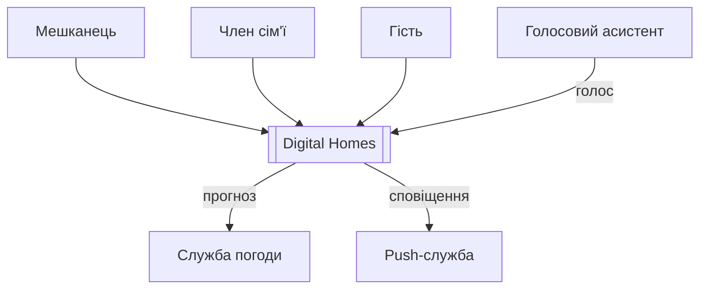
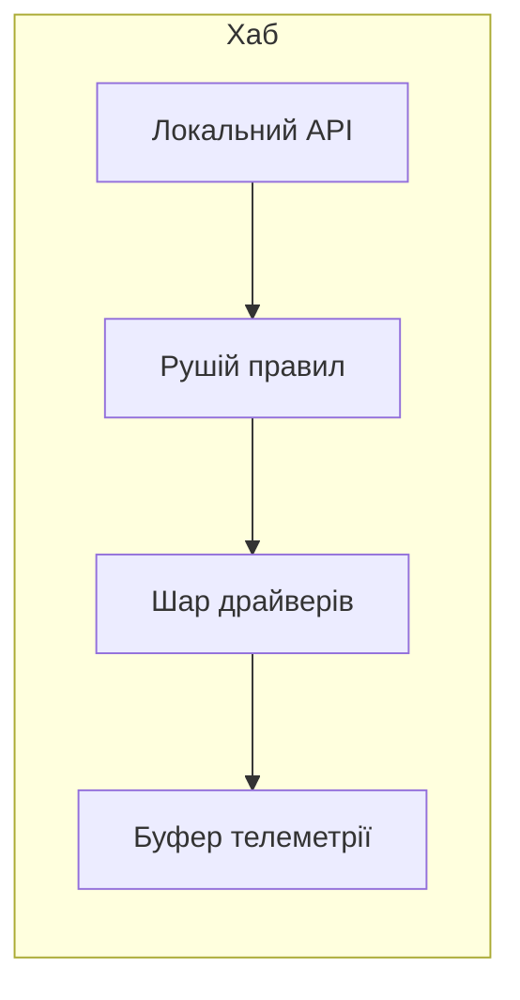
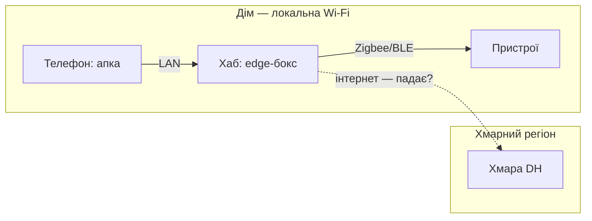
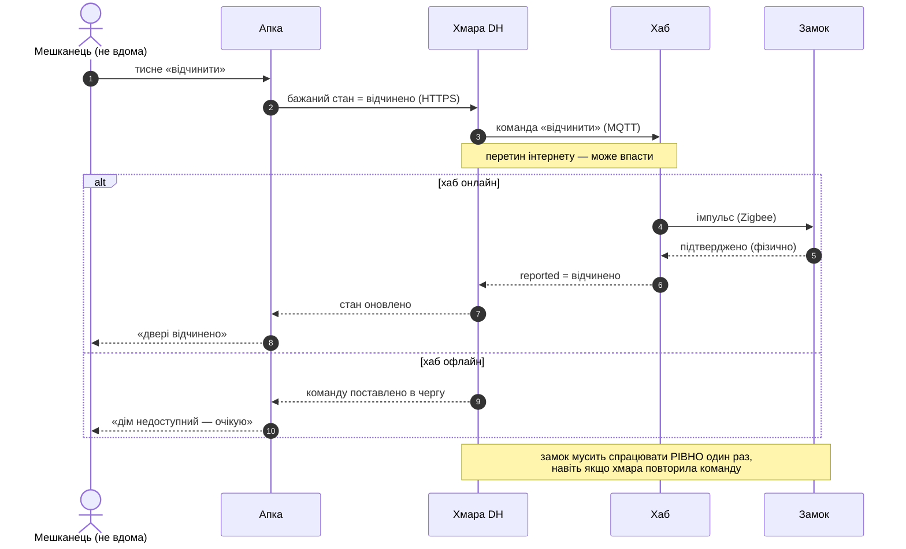

# ⚙️ Модель DH як код

Ми намалювали Digital Homes з чотирьох боків — контекст, контейнери, розгортання, динаміка — і кожна картинка вийшла окремим файлом у голові та у вікі. Проблема не в тому, що їх багато. Проблема в тому, що вони **розсипані**: перейменуєш «хаб» на «edge-бокс» — і мусиш згадати про це в чотирьох місцях, а забудеш в одному — картинки почнуть тихо суперечити одна одній. Задача цього кроку — прибрати розсип: описати DH **одним текстовим файлом**, з якого рушій сам нарізає всі в'ю, і зробити так, щоб застаріла картинка не могла просочитися повз тебе.

Загальний механізм «модель → багато в'ю» ми вже розібрали на прикладі інтернет-банку — тут припускаємо, що [DSL Structurizr](topic:programming/diagrams-as-code/comp-structurizr-c4.md) тобі вже знайома (сутності описуєш раз, а в'ю замовляєш вибіркою з тієї моделі), і одразу застосовуємо її до DH, з усіма його конкретними пастками.

> 🔧 **Навіщо це.** Кожна діаграма DH, яку ти зробив, щоб *зрозуміти* систему, за тиждень стане тим, що ти покладеш перед колегою, щоб *домовитись*, і винесеш на рев'ю, щоб тебе почули. Якщо ці діаграми — чотири незалежні `.png`, вони застаріють до першого рефакторингу. Якщо це один файл у git — вони старіють синхронно з кодом або валять збірку. Оце і є різниця між «намалював колись» і «показує правду сьогодні».

## Одне джерело: модель DH у Structurizr DSL

Почнімо з того, що є **правдою про систему**, і ще нічого не кажімо про картинки. Люди, зовнішні системи, сама DH з її запускними частинами й зв'язки між ними — усе описано рівно раз:

```structurizr
workspace "Digital Homes" "Дім, яким керують з телефона й хмари" {

  model {
    // — люди —
    resident = person "Мешканець"       "Господар дому"
    family   = person "Член сім'ї"      "Постійний доступ"
    guest    = person "Гість"           "Тимчасовий доступ"

    // — зовнішні системи (те, чого ми свідомо НЕ будуємо) —
    weather = softwareSystem "Служба погоди"      "Прогноз для сцен"            "External"
    push    = softwareSystem "Push-служба"        "Доставляє сповіщення на телефон" "External"
    voice   = softwareSystem "Голосовий асистент" "Голосові сцени"             "External"

    // — сама система і її контейнери —
    dh = softwareSystem "Digital Homes" {
      app    = container "Мобільна апка" "Керує домом, показує стан" "iOS/Android"
      cloud  = container "Хмара DH"      "Стан дому (твін) + API"    "Kubernetes"
      hub    = container "Хаб"           "Тримає дім живим локально" "edge-бокс" {
        localApi    = component "Локальний API"    "Приймає команди апки й хмари" "MQTT/HTTP"
        rulesEngine = component "Рушій правил"     "Виконує сцени й автоматизації"
        driverLayer = component "Шар драйверів"    "Нормалізує зоопарк вендорів"  "Zigbee/BLE"
        telemetry   = component "Буфер телеметрії" "Переживає обрив, доганяє хмару"
      }
      devices = container "Пристрої" "Лампа · замок · камера" "Zigbee/BLE-залізо"
    }

    // — зв'язки: хто з ким і чим говорить —
    resident -> app "користується"
    family   -> app "користується"
    guest    -> app "тимчасово користується"

    app   -> cloud   "керує, бачить стан"       "HTTPS/REST"
    cloud -> hub     "команди"                   "MQTT/TLS"  "Unreliable"
    hub   -> cloud   "телеметрія, reported-стан" "MQTT/TLS"  "Unreliable"
    hub   -> devices "керує, опитує"             "Zigbee/BLE"
    app   -> hub     "прямо в домашній Wi-Fi"    "LAN"

    cloud -> weather "тягне прогноз"     "HTTPS"
    cloud -> push    "надсилає сповіщення" "HTTPS"
    voice -> cloud   "голосові сцени"     "HTTPS"

    // — внутрішній потік хаба (годує компонентну в'ю) —
    localApi    -> rulesEngine "бажаний стан"
    rulesEngine -> driverLayer "команда пристрою"
    driverLayer -> telemetry   "події, фактичний стан"

    // — де воно фізично живе: та сама модель, іншою віссю —
    deploymentEnvironment "Живий дім" {
      deploymentNode "Дім" "локальна Wi-Fi" {
        deploymentNode "Смартфон"                    { containerInstance app }
        deploymentNode "Хаб (edge-бокс)" "Linux ARM" { containerInstance hub }
        deploymentNode "Zigbee-мережа"               { containerInstance devices }
      }
      deploymentNode "Хмарний регіон" "eu-central" {
        deploymentNode "Kubernetes" { containerInstance cloud }
      }
    }
  }
```

Зупинімось на трьох рішеннях, які тут неочевидні й прямо стосуються DH.

Перше — **зовнішні системи це стрілки назовні**. Погода, push, голосовий асистент — усе, що ми домовились не будувати самі, стоїть у моделі як `softwareSystem` з тегом `External` і з'єднане стрілкою з `cloud`. Це не декор: межа рішення «купити, а не будувати» стає рядком, який видно на рев'ю. Додав нову зовнішню залежність — це один новий `softwareSystem` і одна стрілка, і вони самі спливуть на контекстній в'ю.

Друге — **дві стрілки між хмарою й хабом, а не одна**. `cloud -> hub` (команди) і `hub -> cloud` (телеметрія) — це справді різні напрямки різного характеру: команду штовхають згори, телеметрію ллють знизу безперервно. Обидві помічені тегом `Unreliable`, бо саме вони перетинають інтернет; локальні `app -> hub` та `hub -> devices` тегу не мають. Один тег на дві стрілки — і будь-яка в'ю, де вони з'являться, підсвітить ненадійний перетин однаково, бо стиль ми задамо в одному місці.

Третє — **компоненти хаба описані всередині контейнера, а зв'язки між ними — лише внутрішні**. `localApi → rulesEngine → driverLayer → telemetry` — це потік *усередині* хаба. Ми свідомо не тягнемо звідси стрілку `driverLayer -> devices`: як хаб дотягується до пристроїв, уже сказано контейнерним зв'язком `hub -> devices`, і дублювати його на рівні компонента означало б, що Structurizr вивів би *другий*, неявний `hub -> devices` поверх нашого явного. Тримати кожен зв'язок на **одному** рівні — і є та дисципліна, що не дає моделі роздвоїтися.

Четверте — **розгортання теж живе в моделі, а не окремою картинкою**. Блок `deploymentEnvironment "Живий дім"` наприкінці описує вже не «з чого система», а «де вона фізично», проте стоїть у тому самому `model{}`, бо це така сама правда про DH, просто інша вісь. І `containerInstance app` не заводить новий контейнер — це той самий `app`, покладений на вузол «Смартфон»; опишеш його раз, а він з'явиться і в контейнерній в'ю коробкою, і в розгортанні екземпляром, і перейменується всюди разом.

> 🔧 **Навіщо це.** Помітили, що `hub` описано раз, а фігурує він і в контейнерній в'ю (як коробка), і в компонентній (розкритий зсередини), і в розгортанні (як екземпляр на залізі)? Це і є вся вигода: перейменуй `hub` на будь-що — воно переназветься в **усіх** в'ю разом, бо сутність там одна, а не тричі намальована. Три картинки фізично не можуть розійтися, бо в них спільне джерело.

## П'ять замовлень — п'ять діаграм

Тепер — і тільки тепер — кажемо, які картинки з цієї моделі малювати. Кожне в'ю це **замовлення-вибірка**: «покажи оце під таким кутом». Додаймо блок `views` і стилі, і файл замкнеться:

```structurizr
  // (продовження того самого workspace — тепер лише блок в'ю)

  views {
    systemContext dh "context" "Хто торкає DH і на що він спирається зовні" {
      include *
      autoLayout lr
    }
    container dh "containers" "З яких запускних частин зроблений DH" {
      include *
      autoLayout lr
    }
    component hub "hub" "Що всередині хаба" {
      include *
      autoLayout lr
    }
    deployment dh "Живий дім" "deploy" "Де все фізично крутиться" {
      include *
      autoLayout lr
    }
    dynamic dh "openRemote" "Відчинити двері не з дому" {
      resident -> app     "тисне «відчинити»"
      app      -> cloud   "бажаний стан = відчинено"
      cloud    -> hub     "команда «відчинити»"
      hub      -> devices "імпульс на замок"
      autoLayout lr
    }

    styles {
      element "Person"    { shape person background "#08427b" color "#ffffff" }
      element "Container" { background "#1168bd" color "#ffffff" }
      element "Component" { background "#4a90c2" color "#ffffff" }
      element "External"  { background "#8a8a8a" color "#ffffff" }
      relationship "Unreliable" { color "#c0392b" style dashed }
    }
  }
}
```

Прочитаймо, що з цих кількох рядків народжується — бо саме тут окупається вся морока з моделлю.

`systemContext dh` показує DH одним прямокутником серед сусідів: троє людей ліворуч, три зовнішні системи праворуч. Контейнери всередині рушій ховає сам — на рівні контексту вони не потрібні. `container dh` ту саму DH **розкриває**: апка, хмара, хаб, пристрої й підписані стрілки між ними, а люди й зовнішні системи лишаються по краях. `component hub` іде на щабель глибше — розкриває вже сам хаб на чотири складники з їхнім внутрішнім потоком. Три рівні масштабу, і **жодна сутність не намальована двічі**.

Далі найтонше. `deployment dh "Живий дім"` замовляє картину того середовища, яке ми оголосили в моделі, — тієї самої DH, але під **іншою віссю**: не «з чого складається», а «де крутиться». І щойно частини розкладені по фізичних вузлах, стрілка `cloud ↔ hub` перетинає межу «Дім ↔ Хмарний регіон» — і, помічена `Unreliable`, малюється червоним пунктиром саме там, де йде через інтернет. Логічна в'ю на це сліпа: на ній хмара й хаб — просто дві коробки зі стрілкою; аж розгортання показує, що стрілка ця йде ненадійним інтернетом, бо тут видно межі мережі.

І `dynamic dh "openRemote"` — п'яте замовлення до тієї ж моделі: не будова, а **порядок**. Тут ховається справжня пастка Structurizr, до якої ми зараз дійдемо; поки що лови головне — це **один файл**, `workspace.dsl`, з якого виходять **п'ять** узгоджених діаграм. Зміниш у моделі один зв'язок — оновляться всі п'ять разом.

## Ті самі в'ю у Mermaid — і чому їх стає багато

Тепер зробімо те саме [мовою Mermaid](topic:programming/diagrams-as-code/comp-text-diagram-langs.md), яку GitHub і більшість вікі малюють прямо в тексті `.md`, без жодного рушія збоку. І одразу спіткнемось об головну різницю: Mermaid описує **одну конкретну картинку**, тож кожна в'ю — це **окремий файл**, який ти синхронізуєш руками.

Ось контекст:



Ось нутрощі хаба (компонентна в'ю):



А ось розгортання — з підсвіченим ненадійним перетином:



Кожен блок читабельний, легкий, малюється миттєво. Але помітив, що я щойно **втретє** написав слово «хаб» окремими руками — у контексті його нема, у компонентній він `hub`, у розгортанні `H`? Ось у цьому вся ціна Mermaid: три файли, три незалежні описи однієї системи. Переназвеш хаб — правити тобі в трьох місцях, і забудеш в одному. Structurizr тримає синхрон **конструкцією** (сутність одна); Mermaid — **твоєю дисципліною** (сутностей стільки, скільки разів ти їх написав). Це не робить Mermaid поганим: для однієї схеми в README чи для послідовності в пул-реквесті він саме те, а важкий апарат моделі там був би з гармати по горобцях. Ключ у питанні «скільки в'ю однієї системи ти тримаєш живими»: одна — Mermaid; сімейство, як у DH, — модель.

> 🔧 **Навіщо це.** Гарний практичний гібрид: тримаєш **модель** у Structurizr DSL як джерело правди, а на **вихід** женеш прості Mermaid-картинки, які твій GitHub малює й так — без плагінів і хостингу. Багата семантика C4 на вході, дешева всюди-підтримувана картинка на виході. Як саме перегнати одне в друге автоматом — за мить, у розділі про CI.

## Сценарій «відчинути не з дому»: динамічна в'ю проти послідовності

Візьмімо гострий випадок — мешканець **не вдома** тисне «відчинити двері» — і подивімось, чим динамічна в'ю Structurizr відрізняється від Mermaid-послідовності. Різниця тут не косметична, а вбудована в інструмент.

У Structurizr динамічна в'ю (той блок `dynamic dh "openRemote"` вище) показує **впорядковані екземпляри вже наявних зв'язків**. І ось де підступ: динамічна в'ю **не має права вигадувати нові зв'язки** — вона лише впорядковує ті, що вже є в моделі. Наш прямий шлях команди лягає ідеально, бо всі чотири стрілки в моделі є:

```structurizr
    dynamic dh "openRemote" {
      resident -> app     "тисне «відчинити»"
      app      -> cloud   "бажаний стан = відчинено"
      cloud    -> hub     "команда «відчинити»"
      hub      -> devices "імпульс на замок"
      autoLayout lr
    }
```

А тепер спробуй домалювати **відповідь** — «замок підтвердив, хаб доповів хмарі, хмара оновила апку». Щоб показати зворотну стрілку `devices -> hub`, вона мусить існувати в моделі. А варто її туди додати — і вона тут же вилізе зайвою стрілкою на **контейнерній** в'ю, засмічуючи чисту картину. Це відома, документована межа Structurizr: щоб показати відповідь у динамічній в'ю, доводиться заводити другий зв'язок у зворотний бік у самій моделі — а він там не потрібен. Тож у Structurizr динамічна в'ю природно лягає на **однобічний потік команди**, а не на повний діалог із підтвердженнями.

Саме тому для сценарію, де **зворотний шлях і підтвердження — суть справи** (а для замка вони суть: він мусить відчинитися рівно один раз), чесніший інструмент — проста Mermaid-послідовність із її рідною стрілкою-відповіддю `-->>`:



Ця картинка показує те, чого статична в'ю не могла. По-перше, **затримку** — прикинемо її на пальцях:

```
відчинення ≈ телефон→хмара + хмара→хаб + хаб→замок + зворотний шлях
           ≈ 40 мс      + 30 мс     + 5 мс      + (те саме назад)
           ≈ 150 мс у кращому разі — і кожен стрибок може не дійти
```

По-друге, **точки відмови**: гілка `else` — це прямо той випадок, коли хаб офлайн, і питання «команда чекає в черзі чи скасовується?» стає видимим, поки коду ще нема. По-третє, нотатка внизу — вимога «рівно один раз»: якщо підтвердження від замка загубилось і хмара повторила команду, замок не має відчинитися двічі. Динамічна картинка не розв'язує цих питань — вона їх **показує**, і показує рано.

Мораль подвійна. Динамічна в'ю Structurizr безплатно бере зв'язки з моделі, але кульгає на відповідях. Mermaid-послідовність вільно малює діалог, але живе окремим файлом, який синхрон не тримає. У серйозному проєкті це не «або-або»: статику (контекст, контейнери, розгортання) тримаєш у моделі, а гострі сценарії з підтвердженнями пишеш Mermaid-послідовностями поруч — і обоє в git, поруч із кодом.

## Пастка перша: модель тихо розходиться з дійсністю

Найпідступніше в усьому цьому — що модель-як-код теж **уміє брехати**. Так, вона в репозиторії; так, вона в git. Але якщо реальність поїхала вперед — команда винесла рушій правил із хаба в окремий сервіс, а `workspace.dsl` ніхто не поправив, — файл упевнено малюватиме систему, якої вже нема. «Як код» саме собою не рятує: рятує лише те, що **текст живе там, де його видно, і хтось звіряє його з дійсністю**.

Три важелі, у порядку сили:

Найслабший, але базовий — **модель у тому ж пул-реквесті, що й зміна**. Переносиш рушій правил — правиш і код, і `workspace.dsl` в одному коміті. Рецензент бачить у diff, що `rulesEngine` виїхав з-під `hub`, і питає «а він тепер окремий контейнер?» — розмова стається до злиття.

Сильніший — **звірка моделі з тим, що справді розгорнуто**. Це вже [фітнес-функція](topic:programming/fitness-functions): автотест, що читає, скажімо, маніфести Kubernetes і падає, якщо в кластері є сервіс, якого нема в моделі (або навпаки). Тоді список контейнерів у `workspace.dsl` не може розійтися з реальним складом системи — за цим стежить машина, а не пам'ять.

І найглибший — **не описувати те, що можна прочитати**. Частину моделі беруть прямо з коду чи інфраструктури: деякі інструменти класу «модель C4 як код» уміють *витягати* структуру з джерел, тож вона не розходиться з реальністю навіть теоретично. Чим більше моделі виведено з дійсності, тим менше її треба тримати синхронною руками.

Але навіть найкраща модель показує *що з чим зв'язане*, а не *чому саме так* — чому команда до замка синхронна, чому телеметрія окремим потоком. Ці причини живуть не в діаграмі, а в [журналі архітектурних рішень](topic:programming/architecture-decision-records). Модель-як-код і журнал рішень — пара: перша тримає завжди-свіжу структуру, другий — обґрунтування, чому вона така.

## Пастка друга: рівень «код» руками не малюють

C4 має чотири рівні масштабу, і ми навмисно спинилися на **третьому** — компонентах хаба. Четвертий, «код» (класи, функції всередині компонента), у `workspace.dsl` ми не малюємо, і це не лінощі, а свідома межа.

Причина проста й механічна: код рухається щодня. Рушій правил цього тижня має три класи, наступного — п'ять; намалюєш їх руками — діаграма застаріє **раніше, ніж змержиться твій пул-реквест**. Сам автор C4 Саймон Браун (Simon Brown) наголошує: рівень коду **необов'язковий**, і якщо він тобі взагалі потрібен, його треба **генерувати з джерел** — середовищем розробки (IDE малює діаграму класів сама) чи інструментом, що читає код, — а не тримати руками (усталена позиція, багато разів повторена в матеріалах про C4).

Тож правило для DH таке: **найглибше, що ти малюєш руками, — це компонент**. Нижче — територія машини: треба схему класів рушія правил, попроси IDE згенерувати її з коду тут і зараз, і викинь, коли надивився. Structurizr свідомо спиняється на компоненті з тієї самої причини — щоб ти не заганяв себе на біговку ручного малювання того, що змінюється щокоміту.

## Гейт у CI: застаріла картинка валить збірку

Лишається діра, крізь яку дрейф вертається чорним ходом. Хтось згенерував Mermaid-файли з `workspace.dsl` один раз, вклав у документацію — і далі правит `workspace.dsl`, забуваючи перегенерувати. Джерело свіже, вкладені картинки старі. Загальну ідею гейта ми вже бачили в темі про [діаграми як код](topic:programming/diagrams-as-code); ось вона, зведена під конкретний конвеєр DH.

Правда одна — `workspace.dsl`. Вкладені `docs/diagrams/*.mmd` — **похідні**, як зкомпільований бінарник. CI на кожному пуші малює їх наново з джерела й **звіряє** з тим, що в репозиторії:

```bash
#!/usr/bin/env bash
set -euo pipefail

# 1. Малюємо Mermaid з ЄДИНОГО джерела у тимчасову теку.
#    Нова консолідована тула Structurizr (Spring Boot .war):
java -jar structurizr.war export -workspace workspace.dsl -format mermaid -output build/diagrams
#    (застаріла, але ще жива команда CLI:
#     ./structurizr.sh export -workspace workspace.dsl -format mermaid -output build/diagrams)

# 2. Порівнюємо згенероване з тим, що закоммічено. Будь-яка різниця — стоп.
if ! diff -r build/diagrams docs/diagrams; then
  echo "Діаграми застаріли: перегенеруй і закоммить docs/diagrams" >&2
  exit 1
fi
```

Той самий крок у GitHub Actions, через готовий docker-образ:

```yaml
name: diagrams
on: [push, pull_request]
jobs:
  check-diagrams:
    runs-on: ubuntu-latest
    steps:
      - uses: actions/checkout@v4
      - name: Export Mermaid з workspace.dsl
        run: >
          docker run --rm -v "$PWD:/work" -w /work structurizr/cli
          export -workspace workspace.dsl -format mermaid -output build/diagrams
      - name: Звірити з репозиторієм
        run: diff -r build/diagrams docs/diagrams
```

Тепер картинка **фізично не може** відстати від опису: конвеєр не пропустить коміт, де вони розійшлися. Це окремий випадок фітнес-функції, тільки властивість, яку стереже гейт, — «діаграма відповідає своєму джерелу».

Дві конкретні пастки саме цього конвеєра, на яких спотикаються:

**Звіряй текст, а не пікселі.** Спокуса — рендерити `.mmd` у `.svg` (через `mmdc`, mermaid-cli) і діфати картинки. Не роби так: різні версії рендерера дають різні пікселі на однаковому вході, і збірка червонітиме на порожньому місці. Експортований **Mermaid-текст детермінований** — його й діф. SVG рендери лише для людей, і краще на льоту, ніж коммітити.

**Пильнуй за деталями інструмента.** Сам Structurizr CLI офіційно **знято з підтримки** — усе консолідують в одну тулу (Spring Boot `.war` у репозиторії `structurizr/structurizr`), тож у нових конвеєрах бери її, а старий `structurizr.sh` лишай хіба в успадкованих (усталений факт станом на середину 2020-х). І ще: щоб браузер намалював експортований Mermaid без сюрпризів, його конфіг має містити `securityLevel: "loose"` — інакше частина діаграм не відрендериться.

## Коли весь цей апарат — зайвий

Чесно про межу: усе вище окупається лише тому, що DH — система **велика, довгожива й показана з кількох боків**. Модель, розгортання, п'ять узгоджених в'ю, гейт у CI — це інвестиція, і вона повертається саме там, де картинки інакше розійшлися б. Для однієї схеми на серветку чи для одного графа в README цей апарат — обряд заради обряду; там чесніший вибір простіший: кинь Mermaid прямо в `.md` і живи. Питання, яке відсіює одне від одного, завжди те саме — **скільки в'ю однієї системи ти тримаєш живими водночас**. Одна — розкладка-як-код. Сімейство, як у DH, — модель-як-код, і тоді вся ця морока з `workspace.dsl` окупається першого ж дня, коли хтось перейменує хаб і жодна з п'яти діаграм не збреше.
