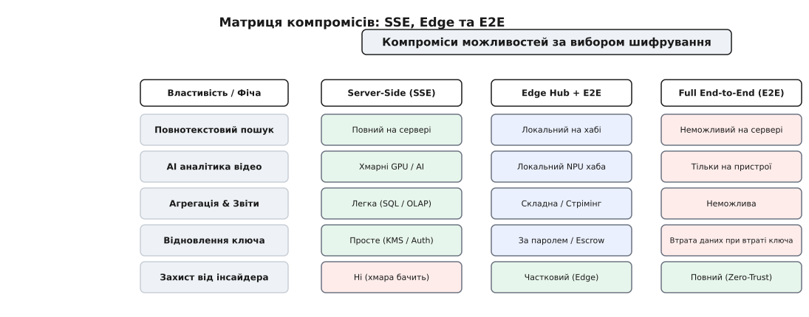
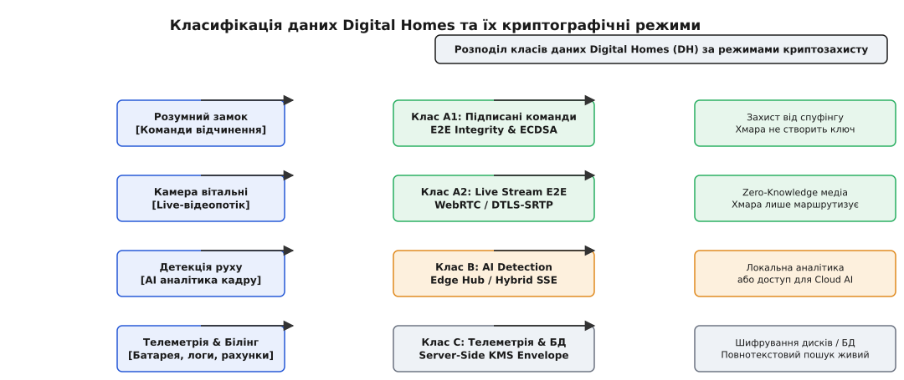

# E2E проти server-side: вибір за класифікацією даних

<preknowlist>
- [Шифрування у спокої й ключі](root:sf-security/encryption-at-rest) — прозоре проти прикладного шифрування, ієрархія DEK/KEK і сховища ключів (KMS).
- [Наскрізне шифрування](root:sf-security/end-to-end-encryption) — обмін ключами між кінцевими пристроями та осліплення сервера.
- [Моделювання загроз і межі довіри](root:sf-security/trust-boundaries) — межа довіри як точка автентифікації та обсяг прав хмари.
</preknowlist>

Уявімо команду розробників платформи розумного дому Digital Homes, яка зібралася на архітектурну раду після чергового заголовка у ЗМІ про витік даних із камери відеоспостереження іншого вендора. Мотив команди простий і зрозумілий: «Сховаймо все за скрізне шифрування (End-to-End Encryption, E2E)! Нехай камера шифрує ключ користувача прямо на пристрої, а хмара передає лише непрозорі байти. Якщо наш сервер зламають, нападник отримає лише сміття».

Архітектор погоджується, і за два місяці команда викочує E2E-відеопотік для всіх категорій пристроїв. Проте вже за тиждень відділ продукту приносить тривожний перелік зламаних функцій. Користувачі скаржаться, що хмарна AI-детекція руху (розпізнавання кур'єрів, авто та домашніх улюбленців) більше не працює. Повнотекстовий пошук за подіями у відеоархіві зник, бо хмарна база даних більше не бачить тегів і розшифрованих атрибутів. Пуш-сповіщення на смартфон тепер приходять без картинки-прев'ю, бо сервіс сповіщень не має ключа розшифрування. А коли користувач забуває мастер-пароль від акаунта, його відеоархів за п'ять років стає остаточно недоступним — і служба підтримки нічим не може зарадити.

Виявляється, вибір між скрізним шифруванням (E2E) та шифруванням на стороні сервера (Server-Side Encryption, SSE) — це не вибір між «безпечно» та «небезпечно». Це **архітектурний компроміс між межею довіри та функціональністю системи**. Кожен крок у бік абсолютного осліплення сервера вбиває серверні обчислення, індексацію, агрегацію даних та можливість відновлення доступу.


*Межі довіри визначено місцем, де живе відкритий текст. У SSE межа проходить усередині хмари, даючи живі фічі за рахунок довіри до сервера. В E2E межа висунута на кінцевий пристрій — сервер бачить лише непрозорі байти.*

## Межа довіри та ціна відкритого тексту

Щоб зрозуміти, чому цей вибір викликає стільки суперечок у продукті, розкладемо шлях даних від джерела (камери, давача чи розумного замка) до споживача (мобільного застосунку або настінної панелі). Дані на своєму шляху проходять три стани: **у русі** (*in transit*), **у спокої** (*at rest*) та **в обробці** (*in use*).

Шифрування в русі (TLS/mTLS) закриває мережевий канал між пристроєм та сервером. Але на крайньому вузлі хмари (API Gateway або Load Balancer) TLS-сесія завершується, і дані стають відкритим текстом. Тепер головне питання полягає в тому, **де саме зберігається відкритий текст і хто володіє ключами його перетворення**.

У системі з **Server-Side Encryption (SSE)** пристрій надсилає дані через мережевий TLS-тунель. Сервер хмари приймає їх у відкритому вигляді у свою оперативну пам'ять (RAM), виконує бізнес-логіку (індексування, AI-аналіз, фільтрацію), після чого запитує в [сервісу управління ключами (KMS)](root:sf-security/encryption-at-rest) ключ даних (DEK, *Data Encryption Key*), шифрує ними дані й зберігає їх у базу даних чи об'єктне сховище S3.

```
Пристрій (Plaintext) ──TLS──> Сервер RAM (Plaintext) ──KMS DEK──> Диск / БД (Ciphertext)
```

При такій схемі дані захищені від двох конкретних загроз: украденого фізичного накопичувача з дата-центру та витоку сирого дампу бази даних. Якщо зловмисник здобуде файли `.mdf` чи об'єкти S3 без доступу до API KMS, він побачить лише зашифровані блоки.

Але SSE має фундаментальне обмеження безпеки: **сервер бачить відкритий текст**. Якщо нападник здобуде привілеї компрометацією продуктового мікросервісу, перехопить токен сервісного акаунта KMS або отримає доступ через судовий запит до хмарного провайдера, він розшифрує всі дані, адже ключі та інфраструктура розшифрування належать хмарі.

У системі з **End-to-End Encryption (E2E)** пристрій шифрує корисне навантаження симетричним ключем, який відомий **лише цьому пристрою та приймачу** (мобільному застосунку). Сервер хмари стає [осліпленим транзитним вузлом](root:sf-security/end-to-end-encryption): він приймає зашифрований конверт і маршрутизує його за відкритими метаданими.

```
Пристрій (Plaintext) ──Key K──> Ciphertext ──TLS / Server (Opaque)──> Застосунок (Plaintext)
```

Тут межа довіри повністю висунута з хмари на кінцеві пристрої. Навіть якщо зловмисник захопить повний контроль над серверами Digital Homes, бази даних та KMS, він не прочитає жодного кадру відеопотоку, бо в хмарі просто **не існує ключів для його розшифрування**.

Детальний аналіз історичної боротьби цих підходів від PGP до Signal та сучасних Cloud KMS описано в вставці [Історія еволюції E2E та Server-Side шифрування](root:progarch/e2e-vs-serverside-choice/hist-e2e-vs-serverside-evolution.md).

> 🔧 **Навіщо це.** Безпека — це не шар, який «намазують» зверху на готову систему. Якщо ви розробили архітектуру, де хмарний сервіс шукає підрядки в підписах подій через SQL `LIKE '%motion%'`, ви більше **не можете** прозоро увімкнути E2E для цього поля. Вибір криптографічного режиму фіксує топологію обчислень: де живе ключ, там і мусить виконуватися алгоритм.

## Server-Side Encryption: функціональне багатство та його вразливості

Розгляньмо детальніше, які переваги отримує архітектура, якщо лишає шифрування на стороні сервера.

Головна перевага SSE — **збереження всіх можливостей централізованих обчислень**. Оскільки процес сервера бачить розшифровані дані в RAM, система може виконувати будь-які складні трансформації:

1. **Повнотекстовий пошук та індексація**: сервіс опрацьовує текстові описи подій, будує інвертовані індекси (Elasticsearch / PostgreSQL tsvector) та швидко повертає результати за довільними складними фільтрами.
2. **Нейромережева аналітика (Cloud AI)**: кадр з камери надходить у медіа-сервер, передається на GPU-кластер, де модель комп'ютерного зору виявляє обличчя, розпізнає номери авто й генерує векторні подібності (embeddings).
3. **Серверна агрегація та OLAP**: аналітичний шар будує погодинні графіки енергоспоживання, усереднює показники тисяч давачів температури та рахує білінгові метрики.
4. **Зручні пуш-сповіщення**: сервіс сповіщень бачить текст повідомлення («Двері відчинено о 14:02») та згенерований прев'ю-кадр, формує стандартний payload для Apple APNs / Google FCM, і користувач отримує банер із зображенням прямо на заблокований екран.
5. **Безпроблемне відновлення та мультипристроєвість**: якщо користувач купив новий телефон або зайшов через веб-браузер, йому достатньо пройти автентифікацію (OAuth / OIDC / 2FA). Сервер сам віддасть його дані, бо доступ визначається правами акаунта, а не наявністю криптографічного ключа на накопичувачі конкретного смартфона.

Проте за цю зручність архітектор платить розширеною [поверхнею атаки](root:sf-security/trust-boundaries). У схемі SSE існує чотири фундаментальні вектори компрометації:

- **Компрометація продуктового процесу**: вразливість типу RCE (Remote Code Execution) у веб-фреймворку дозволяє нападнику читати RAM сервера, де у відкритому вигляді лежать дані активних сесій.
- **Внутрішня загроза (Insider Threat)**: цікавий або підкуплений адміністратор бази даних чи інженер з доступом до KMS може сформувати запит на розшифрування ключів DEK і прочитати чужі записи.
- **Оверайпи та помилки конфігурації IAM**: якщо сервісний акаунт аналітики отримує занадто широкі права в KMS (`kms:Decrypt` на всі ресурси), зламаний мікросервіс логів отримує доступ до фінансових транзакцій.
- **Юридичні запити третьої сторони**: хмарний провайдер, який володіє інфраструктурою KMS, зобов'язаний виконати судовий припис і надати правоохоронним органам розшифровані дані без відома власника акаунта.

## End-to-End Encryption: абсолютний захист і параліч хмари

Осліплення сервера через E2E вирішує проблему довіри до хмари, створюючи модель **Zero-Trust Storage**. Якщо сервер не має ключів, він перетворюється на звичайну «сліпу трубу» (*blind pipe*).

Проте ціна цього захисту в реальних системах виявляється надзвичайно високою. Коли сервер втрачає доступ до відкритого тексту, виникають наступні архітектурні бар'єри:

### 1. Параліч серверних фіч
Сервер більше не може виконати SQL-запит `WHERE payload ILIKE '%кіт%'`. Він бачить лише випадкові послідовності байтів, однакові за довжиною. Серверний GPU не може прогнати кадр через нейромережу. Оновлення пуш-сповіщень не може вставити прев'ю-картинку — пристрій отримує пуш з текстом «Нове зашифроване повідомлення», відкриває застосунок, фоново підключається до мережі, розшифровує payload і лише тоді малює сповіщення на екрані.

### 2. Складність ключового менеджменту
У схемі SSE ключем керує централізована KMS. В E2E ключовий менеджмент перекладається на кінцеві пристрої:
- **Обмін ключами (Key Exchange)**: пристрої мусять узгодити спільний сесійний ключ через протоколи типу ECDH, Signal Double Ratchet або Olm/Megolm. Для цього потрібні сервери ключів (Key Transparency log), які зберігають відкриті ключі користувачів.
- **Мультипристроєвість (Multi-Device Fanout)**: якщо у користувача є смартфон, планшет і настінна панель, відправник мусить зашифрувати одне й те саме повідомлення **тричі** — окремим симетричним ключем для кожного пристрою отримувача. Це помножує обсяг мережевого трафіку та вимоги до сховища.
- **Відновлення після втрати пристрою (Key Recovery)**: якщо смартфон із приватним ключем згорів або вкрадений, всі E2E-дані стають остаточно недоступними. Щоб запобігти цьому, архітектори змушені будувати складні схеми: шифрувати резервну копію ключів мастер-паролем користувача (*Zero-Knowledge Key Escrow*) або реалізовувати порогову криптографію Шаміра (*Shamir's Secret Sharing*) між пристроями довірених друзів.

### 3. Витік метаданих
E2E захищає **корисне навантаження** (payload), але **не захищає метадані трафіку**. Сервер хмари все одно бачить:
- Хто і кому надсилає зашифровані пакети.
- Точний час надсилання та частоту повідомлень.
- Точний розмір зашифрованого відеопотоку та його бітрейт.

На основі аналізу розміру та частоти пакетів нападник може з високою точністю визначити, чи є хтось у будинку, або навіть відтворити характер руху перед камерою, навіть не розшифровуючи жодного байту медіапотоку.


*Таксономія можливостей: E2E дає максимальний захист приватності, але повністю блокує повнотекстовий пошук та хмарний AI. Гібридний підхід (Edge Hub) переносить обчислення на межу користувача.*

## Мережеві характеристики та накладні витрати транспорту

Окрім обчислювальних функцій, вибір криптографічного режиму справляє відчутний вплив на затримки (*latency*) та мережевий трафік (*bandwidth*).

### 1. Накладні витрати на розмір конверта (Envelope Overhead)
У системі з SSE пристрій передає чистий payload усередині стабільного TLS-тунелю. Заголовки KMS додаються вже усередині хмари під час запису в базу даних.

В E2E-режимі кожен окремий зашифрований пакет змушений нести власні криптографічні метадані:
- Вектор ініціалізації (`iv`): 12 байт.
- Тег автентифікації (`authTag`): 16 байт.
- Ідентифікатор ключа та крок ратчета (`keyRef` / `ratchetStep`): 40–128 байт.
- Ефемерний відкритий ключ (при оновленні ключа): 32–64 байти.

Для великих відеофайлів накладні витрати у 150 байт на фрагмент є невідчутними. Проте для малопотужних давачів (Zigbee, BLE, LoRaWAN), які передають показники температури розміром у 4 байти, E2E-конверт збільшує розмір пакета в 20–40 разів, що призводить до прискореного розряду батареї та перевантаження радіоефіру.

### 2. Затримка встановлення з'єднання (Handshake Latency)
У схемі SSE мобільний застосунок встановлює стандартне TLS 1.3 з'єднання з API Gateway за 1 RTT (Round Trip Time) та негайно надсилає запит.

В E2E-режимі, перед тим як надіслати перший зашифрований кадр відео або команду відчинення замка, пристрої мусять виконати процедуру узгодження ключів:
- Зчитати prekeys отримувача з сервера ключів (Key Registry): 1 RTT.
- Виконати локальне розрахування X25519 DH та згенерувати сесійний ключ: 2–5 мс CPU.
- Надіслати ініціалізаційний пакет отримувачу та отримати підтвердження: 1–2 RTT.

Для задач реального часу (наприклад, натискання кнопки відчинення дверей або дзвінок у домофон) додаткові 200–500 мс затримки на криптографічний хендшейк можуть негативно вплинути на сприйняття швидкодії системи користувачем.

## Економічна модель та катастрофічне відновлення (Disaster Recovery)

Вибір між E2E та SSE тягне за собою суттєві розходження в операційній вартості та процедурах аварійного відновлення системи.

### 1. Фінансова вартість викликів KMS проти CPU клієнтів
У схемі SSE за кожен запит на розшифрування чи шифрування ключа DEK хмарний провайдер (AWS KMS, GCP Cloud KMS) виставляє рахунок (наприклад, $0.03 за 10 000 викликів KMS API). При високочастотній телеметрії (мільйони подій на секунду) прямі виклики KMS можуть коштувати компанії десятки тисяч доларів на місяць. Архітектори змушені впроваджувати локальне кешування розшифрованих DEK у пам'яті сервісу на короткі проміжки часу (5–15 хвилин), зважуючи ризик витоку в RAM проти економії бюджету.

В E2E-режимі витрати на шифрування повністю перекладаються на CPU/NPU клієнтських смартфонів та IoT-пристроїв. Хмара платить лише за мережевий трафік (egress bandwidth), що суттєво дешевше за KMS-операції.

### 2. Катастрофічне відновлення (Disaster Recovery & Multi-Region HA)
Для системи з SSE мультирегіональне резервування (Multi-Region Failover) вимагає налаштування автоматичної дублікації майстер-ключів KEK між регіональними HSM (наприклад, AWS KMS Multi-Region Keys). Якщо один дата-центр стає недоступним, резервний регіон розшифровує DEK за допомогою скопійованого KEK без переривання сервісу.

В E2E-режимі падіння хмарного дата-центру взагалі не впливає на криптографічну спроможність клієнтів розшифровувати свої локальні дані. Проте падіння центрального сервера ключів (Key Registry) унеможливлює підключення нових пристроїв до E2E-сесій до моменту відновлення реєстру.

## Відповідність регуляторним вимогам: GDPR, HIPAA та Crypto-Shredding

Важливим аспектом архітектурного вибору є юридичні та регуляторні вимоги до обробки персональних даних.

### 1. Право на забуття (GDPR Article 17)
Згідно з регламентом GDPR, користувач має право вимагати повного видалення своїх персональних даних.
- У схемі **SSE** видалення вимагає фізичного виконання операцій `DELETE` у всіх базах даних, очищення аналітичних індексів, каскадного видалення з резервних копій та cold storage (що часто є важкою інженерною задачею).
- У схемі **E2E** видалення даних може бути реалізовано через **Crypto-Shredding (криптографічне знищення)**. Серверу або користувачу достатньо назавжди видалити або відкликати ключ розшифрування. Усі зашифровані терабайти в базі даних та бекапах миттєво стають математично еквівалентними випадковому шуму. Це дозволяє миттєво задовольнити вимоги GDPR без складного очищення резервних копій.

### 2. Незмінність аудит-логів (Audit Log Integrity)
Для журналів безпеки (хто і коли відчиняв замок) вимоги протилежні: аудит-лог мусить бути захищеним від модифікації навіть самим користувачем.
Якщо зробити аудит-логи E2E-зашифрованими ключем користувача, користувач зможе видалити свій ключ і знищити докази злому. Тому аудит-логи платформи завжди шифруються за схемою **SSE з KMS**, де запис дозволено лише системі логування, а видалення заблоковане політикою WORM (*Write Once, Read Many*).

## Міфи компромісів: криптографія проти практичної інженерії

У цей момент у недосвідченого архітектора виникає спокуса звернутися до теоретичної криптографії: «А хіба ми не можем використати спеціальні криптографічні схеми, щоб і дані були зашифровані E2E, і сервер міг по них шукати чи рахувати?».

Згадаймо чотири найбільш відомі теоретичні концепції та гляньмо, чому вони стикаються з жорсткими інженерними обмеженнями у реальному продакшені:

### 1. Пошукове симетричне шифрування (Searchable Symmetric Encryption, SSE-Search)
Ідея полягає у створенні зашифрованого індексу, який дозволяє серверу перевіряти наявність ключового слова за зашифрованим токеном-пасткою (*trapdoor*), не знаючи самого слова.
- **Реальність**: SSE-Search захищає вміст від статичного зрізу бази даних, але в динаміці піддається атакам за шаблонами доступу (*Access Pattern Leakage*). Спостерігаючи, які саме зашифровані документи повертаються на однакові запити-пастки, сервер може легко відновити шукані слова на основі частотного аналізу.

### 2. Шифрування із збереженням порядку (Order-Preserving Encryption, OPE)
Схема шифрує числа так, що відношення `A < B` зберігається і для зашифрованих значень `OPE(A) < OPE(B)`. Це дозволяє базі даних виконувати діапазонні SQL-запити `WHERE age > OPE(21)` без розшифрування.
- **Реальність**: OPE витікає топологію та розподіл даних. Зашифрований індекс OPE повністю розкриває гістограму розподілу величин, що дозволяє нападнику розшифрувати більшість значень банальним зіставленням із публічною статистикою.

### 3. Детерміноване шифрування (Deterministic Encryption)
Однакові вхідні дані завжди дають однаковий шифротекст (`Enc(k, "Київ") == Enc(k, "Київ")`). Це дозволяє будувати точні SQL-індекси `WHERE city = '...'`.
- **Реальність**: Повністю ламає семантичну безпеку (IND-CPA). Нападник миттєво групує однакові записи і за частотою появи відгадує значення унікальних полів (стать, статус, місто).

### 4. Повністю гомоморфне шифрування (Fully Homomorphic Encryption, FHE)
FHE дозволяє виконувати довільні математичні операції над зашифрованими даними `Enc(A) + Enc(B) = Enc(A + B)` без їх розшифрування.
- **Реальність**: FHE створює колосальний накладний витратний коефіцієнт: обчислення сповільнюються у `10 000`–`100 000` разів, а розмір зашифрованого файлу збільшується в сотні разів. Застосування FHE для стрімінгу відео чи високонавантаженої OLTP-бази даних на нинішньому етапі розвитку апаратури є інженерно неможливим.

Висновок для архітектора однозначний: **не існує магічної криптографічної «срібної кулі»**. Ви мусите або чесно довірити розшифрований текст процесу (у хмарі чи на локальному хабі), або змиритися з тим, що обчислення на сервері неможливі.

## Класифікація даних та розділення в Digital Homes

Оскільки спроба застосувати E2E до всієї системи вбиває її функціональність, а застосування SSE до всіх полів створює загрозу витоку приватного життя, єдиним зрілим рішенням є **розділення системи за класифікацією даних**.

Проаналізуймо, як це працює в архітектурі платформи Digital Homes.


*Архітектурне розділення за класами даних: критичні команди й приватні медіа захищені скрізною криптографією, тоді як метрики й білінг залишаються серверно-шифрованими.*

Усі потоки даних платформи діляться на три чіткі класи:

### Клас A: Критичне управління та приватне медіа (E2E-клас)
Сюди відносяться дані, витік або підробка яких створює безпосередню загрозу фізичній безпеці або приватності житла:
- **Команди відчинення розумного замка**: вимагають [E2E-цілісності та нез спростованості (Non-Repudiation)](root:sf-security/end-to-end-encryption). Команда шифрується або підписується асиметричним ключем смартфона (ECDSA). Сервер хмари перевіряє права доступу, але **не володіє приватним ключем для підпису команди**. Навіть якщо хмару зламають, нападник не зможе згенерувати валідний підпис для відчинення дверей.
- **Live-відеопотік із камер у спальні чи вітальні**: передається за протоколом WebRTC із шифруванням DTLS-SRTP, де сесійні ключі узгоджуються напряму між мобільним застосунком та камерою. Сервер хмари виконує лише STUN/TURN маршрутизацію сигнальних пакетів і бачить лише зашифрований медіапотік.

### Клас B: Аналітичні події та AI-детекція (Гібридний / Edge-клас)
Сюди відносяться події детекції руху та розпізнавання об'єктів:
- Якщо користувач вимагає суворого E2E, хмарна AI-детекція вимикається, а нейромережа переноситься на **локальний Edge Hub (домашній сервер)**. Хаб опрацьовує відкритий відеопотік у локальній мережі будинку, виявляє людину й надсилає в хмару лише зашифрований текстовий статус події.
- Якщо користувач обирає хмарний AI, відеопотік для детекції шифрується за схемою **SSE з коротким терміном життя DEK**. Сервер розшифровує кадр у RAM GPU-вузла, знаходить об'єкт, зберігає тег і негайно видаляє розшифрований кадр з оперативної пам'яті.

### Клас C: Телеметрія, білінг та системні логи (SSE-клас)
Сюди відносяться рівень заряду батарей давачів, графіки температури, логування підключень та білінгові трансакції:
- Ці дані шифруються на стороні сервера за допомогою **Envelope Encryption через Cloud KMS** (`CLASS_C_SSE`).
- Це дозволяє платформі будувати графіки розряду батарей у панелі адміністратора, виконувати повнотекстовий пошук за системними логами та автоматично виставляти рахунки за підписку.

Технічні деталі структури конвертів даних, заголовків та кодів помилок описано у вставці [Специфікація конверта даних та атрибутів шифрування](root:progarch/e2e-vs-serverside-choice/api-crypto-envelope-spec.md).

Практичну реалізацію C та C++ рушія крипто-політики, який приймає ці рішення на межі сервісу, наведено у вставці [Реалізація рушія крипто-політики та конвертного шифрування](root:progarch/e2e-vs-serverside-choice/proj-dh-crypto-policy-engine.md).

```
                  ┌─────────────────────────────────────────┐
                  │      Вхідний потік даних (Payload)      │
                  └────────────────────┬────────────────────┘
                                       │
                        Класифікація даних?
                                       │
             ┌─────────────────────────┼─────────────────────────┐
             ▼                         ▼                         ▼
   ┌───────────────────┐     ┌───────────────────┐     ┌───────────────────┐
   │    Клас A: E2E    │     │   Клас B: Edge    │     │    Клас C: SSE    │
   │  (Замок / Live)   │     │  (AI-детекція)    │     │ (Телеметрія/Логи) │
   └─────────┬─────────┘     └─────────┬─────────┘     └─────────┬─────────┘
             │                         │                         │
             ▼                         ▼                         ▼
┌────────────────────────┐┌────────────────────────┐┌────────────────────────┐
│ Сервер осліплений      ││ Обробка на Edge Hub    ││ Envelope Encryption    │
│ Маршрутизація байтів   ││ або коротка RAM GPU    ││ Cloud KMS (KEK/DEK)    │
│ Пошук/AI ВИМКНЕНІ      ││ Локальна аналітика     ││ Повний пошук & OLAP    │
└────────────────────────┘└────────────────────────┘└────────────────────────┘
```

## Фреймворк ADR: Шаблон ухвалення рішень

Щоб зафіксувати вибір криптографічного режиму в команді та запобігти безкінечним суперечкам у майбутньому, архітектор формулює **Architectural Decision Record (ADR)**.

Наводимо вивірений чекліст запитань, які слід поставити перед затвердженням ADR:

1. **Потреба серверних обчислень**: Чи вимагає бізнес-логіка пошуку, індексації, агрегації чи AI-аналізу цих даних на серверах хмари? Якщо так — E2E неможливий без перенесення алгоритмів на Edge.
2. **Модель відновлення доступу**: Що має статися, якщо користувач втратить свій мобільний пристрій або забуде пассфразу? Якщо відповідь «служба підтримки має скинути пароль і повернути дані» — це вимагає SSE. Якщо відповідь «дані можуть бути втрачені назавжди» — припустимий E2E.
3. **Регуляторні вимоги та витоки**: Чи є дані персональними медичними (HIPAA), фінансовими (PCI-DSS) або критично приватними (відео з житла)? Який штраф за витік сирого дампу з баз даних?
4. **Бюджет на розробку ключового менеджменту**: Чи є у команди ресурс будувати та підтримувати сервери ключів, обробку розсинхронізації Ratchet-сесій та мультипристроєве зашифрування?

### Приклад витягу з ADR платформи Digital Homes

> **Заголовок**: ADR-028: Розділення криптографічних режимів між E2E та Server-Side KMS для сервісу камери Digital Homes
>
> **Контекст**:
> Для запуску нової лінійки відеокамер спостереження потрібно обрати схему шифрування відеопотоку та медіа-архіву. Маркетинг вимагає E2E для захисту приватності, а продуктова команда вимагає хмарну детекцію облич та швидкий пошук подій.
>
> **Рішення**:
> 1. Запровадити дворежимну модель за класифікацією даних.
2. **Live-відеопотік (Клас A)** реалізувати за схемою **E2E (WebRTC DTLS-SRTP)**. Хмарні медіа-сервери виконують лише маршрутизацію трафіку без розшифрування.
3. **Хмарний архів подій (Клас B)** за замовчуванням використовує **Server-Side Envelope Encryption (AWS KMS)**. Це дозволяє хмарному GPU опрацьовувати кадри на предмет детекції руху, будувати повнотекстовий індекс та надавати миттєвий доступ з будь-якого нового пристрою після 2FA.
4. Додати в налаштування застосунку перемикач «Advanced Privacy Mode». При його ввімкненні архів подій переводиться в режим **E2E**, але користувача попереджають підписом про вимкнення хмарного AI та неможливість відновлення відео при втраті ключа.
>
> **Наслідки**:
> - Збережено бізнес-фічу хмарної детекції руху для 95% користувачів (SSE режим).
> - Забезпечено вимоги просунутих користувачів до Zero-Trust приватності (опціональний E2E режим).
> - Усунуто ризик підробки команд розумного замка завдяки суворому підпису ECDSA на пристрої.

Правильно спроєктована криптографічна архітектура не намагається підігнати всі дані під єдиний догматичний режим. Вона чітко розбирає потік даних за рівнями чутливості, висуває межу довіри для критичних точок на самі пристрої, а для аналітики застосовує прозоре серверне конвертне шифрування.
