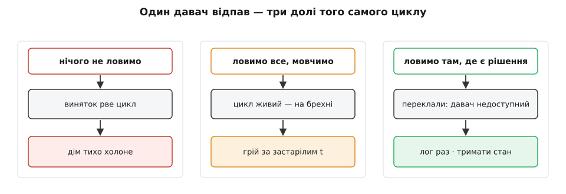
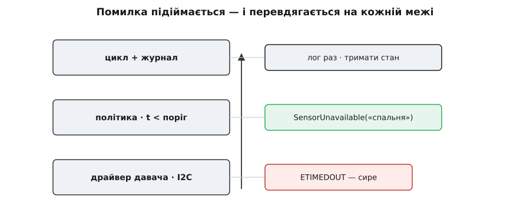
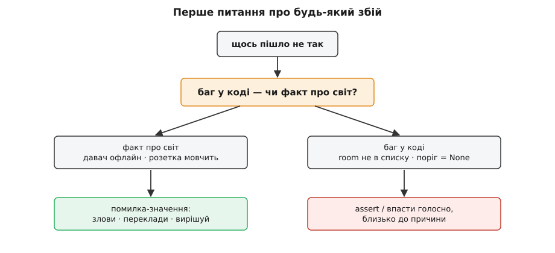

# Помилки крізь шари

<preknowlist>
- [Обробка помилок](book:programming/error-handling) — базові способи сигналити про збій: винятки (exceptions) й помилки-значення, розкрутка стека, `try/catch`.
- [Assert і паніка](book:programming/assert-panic) — твердження про інваріант, який НІКОЛИ не має бути хибним; хибний assert — це баг у коді, а не подія світу.
- [Захисне програмування](book:programming/defensive-programming) — перевіряти вхід на межі довіри, а не в кожному рядку; усередині довіряти вже перевіреному.
</preknowlist>

Весь цей модуль ми вчилися проводити межі: де поставити [шов](root:progarch/seams-and-boundaries), у який бік дивляться стрілки залежностей, що саме — [дані без поведінки](book:programming/dto) — перетинає межу. Але щоразу ми мовчки припускали, що по той бік межі все спрацьовує. `read_temp()` завжди повертає число. Виклик розетки завжди клацає реле. Цього разу приберемо це припущення — бо саме воно рано чи пізно й ламає систему, і саме на межах воно ламається найболючіше.

Повернімося до нашого [v0](root:progarch/dh-v0-one-sensor) — двадцять рядків, що читають давач і вмикають обігрівач. Питання, яке ми жодного разу не поставили: **що станеться першого ж разу, коли `read_sensor()` кине помилку?** Дріт давача випав із гнізда, шина I2C відповіла таймаутом — це не рідкість, це вівторок. У v0, як він написаний, відповідь така: виняток проб'є вічний цикл наскрізь, процес помре, скрипт під столом зникне. Дім почне холонути. І оскільки за скриптом під столом ніхто не стежить, система відмовить у найгірший спосіб, у який система взагалі може відмовити — **повністю й тихо**. Перша ж справжня помилка перетворює наш правильний-для-свого-розміру v0 на річ, що бреше самою мовчанкою.

Отже, помилки треба обробляти. Але саме тут більшість звертає не туди, тож пройдімо цей поворот повільно й свідомо.

## Дві погані рефлексії

Перша рефлексія — не робити нічого, тобто лишити v0 як є. Ми щойно бачили ціну: один збій убиває все. Одна невдала спроба зчитати давач — і гине не тільки читання, гине й обігрівач, і решта кімнат, і сам цикл. Це фейл-стоп: система падає ціла, від найменшого дотику.

Друга рефлексія — злякатися падінь і обгорнути все у `try`, щоб «не падало»:

```py
t = 20.0
while True:
    try:
        t = read_sensor()     # інколи кидає
    except Exception:
        pass                  # ← помилку проковтнули, лишили старе t
    if t < THRESHOLD:         # рішення — на застарілому числі
        heater_on()
    else:
        heater_off()
    sleep(30)
```

Тепер нічого не падає. І це гірше. Давач помер годину тому, а `t` так і застигло на `20.0`, і кожні тридцять секунд програма впевнено ухвалює рішення на числі, якого давно немає. Ми проміняли гучну смерть на тиху божевільність. **Проковтнута помилка майже завжди гірша за падіння** — бо падіння принаймні сказало правду: «я не знаю температури». А `except: pass` бреше, що все гаразд, і на цій брехні спокійно гріє порожню кімнату або морозить дитячу.

Ось перша долівка під ногами: обробка помилок — це **не** «зробити так, щоб не падало». Це рішення, для **кожного** збою окремо: **хто тут узагалі здатен щось із цим удіяти?** А це питання має адресу.


*Ігнорувати збій і глушити збій — обидва погані, кожен по-своєму; корисне лише третє: зловити там, де хтось справді може вирішити.*

## У помилки є адреса шару

Навіть у зварений v0 всередині вписані три ролі, три шари. Найнижчий — **драйвер**: він говорить із давачем мовою заліза, шиною I2C. Над ним — **політика**: порівняти температуру з порогом, вирішити «холодно / тепло». Найвищий — **застосунок**: цикл, що зшиває все докупи й веде журнал. У v0 вони злиті в один файл, але ролі різні, і це важливо саме тепер.

Бо помилка **народжується на одному шарі й говорить його мовою**. Драйвер кидає `I2CReadError` або системне `ETIMEDOUT` — слова про шину, реєстри, таймінги. Двома поверхами вище, у політиці, ця мова — порожній шум: політика не знає, що таке I2C, і **не повинна** знати. Якщо сире `I2CReadError` спливає в коді політики, це той самий витік, що й дротовий протокол давача, який просочився в логіку — тільки цього разу він тече не через дані, а через канал помилок. Це [зчеплення](book:programming/coupling-cohesion) заднім ходом: верхній шар раптом мусить знати назви збоїв нижнього.

Тож помилці, поки вона підіймається, треба **перекладатися на кожній межі**. Точно як [DTO](book:programming/dto) переносить *дані* через межу у форму приймача, помилка переносить через межу *збій* — і, як DTO, мусить заговорити мовою того боку, що її ловить. Драйвер ловить своє транспортне `ETIMEDOUT` і віддає вгору доменне «давач у спальні недоступний». Політика не бачить шини — вона бачить факт свого рівня: температури немає.


*Помилка мандрує вгору, і на кожній межі скидає мову нижнього шару та вдягає мову вищого; сире слово нижнього рівня не має спливати нагорі.*

## Три дієслова на межі

На кожній межі з помилкою роблять рівно одне з трьох — і весь фах у тому, щоб щоразу обрати правильне.

**Зловити** — коли в тебе тут є контекст, щоб вирішити. Драйвер може сам повторити мляве читання (шина інколи гикає — друга спроба вдається). Політика може вирішити: «температури немає — не чіпати обігрівач, тримати останній безпечний стан». Зловити — значить прийняти рішення й закрити тему.

**Прокинути, перекладене** — коли вирішити тут ти не можеш, тож передаєш вище. Але не сире: переодягаєш у слова свого шару й **докладаєш причину**. `I2CReadError` стає `SensorUnavailable("спальня", cause=…)`. Оригінал не викидаємо — зберігаємо як причину (для журналу й діагностики), але назовні показуємо доменне слово. Ніколи не пропускаємо сирий збій нижнього шару крізь свою межу — це і є той витік.

**Залогувати** — записати збій **один раз**, там, де його зрештою обробили, з контекстом, за яким потім можна діяти (яка кімната, яка причина). Не на кожному рівні — бо якщо логувати при кожному прокиданні, той самий збій надрукується пʼять разів, поки стек розкручується, і журнал перетвориться на кашу з дублів. Логувати треба **на тій межі, де ухвалено рішення**, а не всюди дорогою.

Ось ці три дієслова в коді читального шляху DH. Драйвер ловить транспортний збій, раз повторює, а на повторній невдачі — прокидає перекладене. Політика ловить уже доменне, логує раз і тримає стан:

:::tabs
```py
class SensorUnavailable(Exception):
    def __init__(self, room):
        super().__init__(f"давач у кімнаті «{room}» недоступний")
        self.room = room

def read_temp(room):                      # драйвер говорить мовою домену
    last = None
    for _ in range(2):                    # одна повторна спроба
        try:
            return i2c_read(room)         # може кинути I2CReadError
        except I2CReadError as e:
            last = e
    raise SensorUnavailable(room) from last   # переклали, зберігши причину (from)

# політика:
for room in rooms:
    try:
        t = read_temp(room)
    except SensorUnavailable as e:
        log.warning("тримаю стан: %s", e)     # лог РАЗ, саме тут
        continue                              # обігрівач цієї кімнати не чіпаємо
    apply_policy(room, t)
```
```go
type SensorUnavailable struct {
    Room  string
    Cause error
}
func (e *SensorUnavailable) Error() string {
    return fmt.Sprintf("давач у кімнаті %q недоступний", e.Room)
}
func (e *SensorUnavailable) Unwrap() error { return e.Cause }   // зберегли причину

func readTemp(room string) (float64, error) {   // помилка — звичайне значення
    var last error
    for i := 0; i < 2; i++ {                     // одна повторна спроба
        t, err := i2cRead(room)
        if err == nil {
            return t, nil
        }
        last = err
    }
    return 0, &SensorUnavailable{Room: room, Cause: last}   // переклали вгору
}

// політика:
for _, room := range rooms {
    t, err := readTemp(room)
    if err != nil {
        log.Printf("тримаю стан: %v", err)   // лог РАЗ, саме тут
        continue                             // обігрівач цієї кімнати не чіпаємо
    }
    applyPolicy(room, t)
}
```
:::

Два стилі — одна форма. Python прокидає помилку неявно (`raise`, і вона сама летить угору, поки хтось не зловить), Go повертає її явним значенням (`return …, err`, і кожен виклик мусить прямо спитати `if err != nil`). Різні звички, але **межа й переклад однакові**: нижній шар не пускає своє сире слово нагору, а верхній дістає рівно те, чим здатен розпорядитися. Той самий апаратний збій, що вбивав v0, тепер — записана в журнал, пережита подія: дім тримає останнє налаштування, ти дістаєш попередження, ніхто не бреше.

## Не кожен збій — «злови його»

Тут чигає пастка, дзеркальна до `except: pass`: почати ловити **все** підряд, у тому числі те, що ловити не можна. Бо не всяка погана подія — операційний збій світу. Є два різні роди, і плутати їх дорого.

**Очікуване, операційне.** Давач офлайн, розетка не відповідає, Wi-Fi моргнув. Це не аварія — це **сам світ**: воно *станеться*, питання лише коли. А отже, це частина контракту, і поводитися з ним треба як вище — зловити або прокинути перекладеним.

**Несподіване, баг.** `rooms[room]` для кімнати, якої в списку немає, — `KeyError`. Поріг, що виявився `None` через одрук у конфізі. Це не подія світу — це **зламане припущення коду про самого себе**. Обгорнути такий баг у `try/except` — значить сховати його й дати системі шкандибати далі вже зіпсованою: рішення на `None`, запис покаліченого стану, і за годину — інцидент, чиєї причини вже не знайти. Тут потрібне протилежне до захисного ловіння — [впасти швидко](book:programming/assert-panic): assert або невловлена паніка, що зупиняє **голосно й близько до причини**, щоб ти знайшов баг у тесті, а не о третій ночі в проді. Assert стереже інваріант «цього не може бути ніколи»; хибний assert — це не подія, яку обробляють, а дефект, який виправляють.


*Той самий інструмент — `try/except` — рятує від фактів світу й ховає баги коду; спершу спитай, з чим маєш справу.*

> 🔧 **Навіщо це.** Практичний тест на будь-якому збої: «якщо це спрацює — це баг у **моєму** коді чи факт про **світ**?» Баг — впасти швидко, не глушити. Світ — обробити як помилку. Зловити баг тим самим `except`, що й офлайн-давача, — це рівно той шлях, яким одрук в один рядок стає тихим інцидентом псування даних. Дешевше впасти голосно сьогодні в тесті, ніж тихо гнити тиждень у проді.

## Захист — на межі, а не всюди

Звідси випливає, як дозувати [захисне програмування](book:programming/defensive-programming). Спокуса — перевіряти все всюди: у кожній функції наново питати, чи не `None` аргумент, чи в діапазоні число. Це не робить код надійнішим — це робить його галасливим і **розмиває, де насправді проходить межа довіри**. Правило простіше й точніше: перевіряй **один раз, на краю**, там, де в систему входить неперевірене — драйвер, що парсить сирі байти з шини; ендпойнт, що приймає запит ззовні. А за цією межею — **довіряй** уже перевіреній формі й не переперевіряй її на кожному кроці.

Саме це купують [типи як дизайн](book:programming/type-driven-design): якщо на межі ти розібрав сирий вхід у тип, де недопустимий стан просто непредставний (немає такого значення «температура невідома, але вдаваймо, що 20»), то глибше в коді нема чого перевіряти — компілятор уже не дасть зібрати неможливе. Надмірно захисний код, що перевіряє те саме на кожному рівні, — така сама вада, як і геть беззахисний: обидва не бачать, де справжня межа.

## Помилка — частина контракту

Тепер зберімо все в одне речення, і воно виявиться про контракт — ту саму обіцянку межі, з якої цей модуль почався. Контракт функції `read_temp` — це **не** лише «дай мені кімнату, поверну температуру». Чесний контракт звучить так: «дай мені *зареєстровану* кімнату (передумова) — поверну температуру **або** сигнал `SensorUnavailable` (постумова), і я **ніколи не поверну тихо неправильне число**». Множина способів, якими виклик може не вдатися, і що кожен із них означає, — така сама частина обіцянки, як і тип результату. Сигнатура, що ховає свої збої, — бреше; це [проєктування за контрактом](book:programming/design-by-contract) з нарешті проговореним шляхом помилки.

Не випадково мови дедалі частіше вписують помилку прямо в тип: Go повертає `error` звичайним значенням, що стоїть просто в сигнатурі — його треба або обробити, або свідомо відкинути через `_`; а `Result` у Rust позначено як `#[must_use]`, тож мовчки зронити можливий збій не вийде — компілятор одразу попередить, а у звичному для збірок режимі «попередження = помилка» й геть не скомпілює. Це той самий інстинкт — зробити контракт помилки видимим, а не таємним.

Той самий закон діє й на поверх вище, на межі процесу. Контракт CLI-утиліти перед тим, хто ставить її в конвеєр, — це не лише те, що вона друкує в stdout; це її **код виходу** й потік stderr. Нуль — «усе гаразд», ненульовий — «сталося ось що», і скрипт-обгортка ухвалює рішення саме за цим кодом. Хто ловить, що логує й з яким кодом виходить командний інструмент — окремий, повчальний зріз тієї самої ідеї, розібраний у [контракті помилок CLI-утиліти](root:progarch/errors-through-layers/proj-cli-error-contract.md).

І коли захочеться зрозуміти, звідки взялися два стилі з прикладу — неявні винятки й явні помилки-значення — варто знати, що це не мода, а [давня суперечка про коди проти винятків](root:progarch/errors-through-layers/hist-exceptions-vs-codes.md), яка хитнулася туди й назад за півстоліття.

## Назад до DH: тихе замерзання — це брак контракту, не брак `try`

Отут коло й замикається. Тихе замерзання v0 — це **не** пропущений `try/except`. Це пропущений **контракт**: ніхто не вирішив, що означає «давача більше немає» і хто цим рішенням володіє. Додай читальному шляху контракт помилки — драйвер перекладає й повторює, віддає «температуру-або-недоступність»; політика володіє правилом «недоступно — тримати безпечний стан, залогувати раз» — і той самий збій, що валив систему, стає пережитою подією.

Це остання мовчазна відповідь v0, яку ми називаємо на імʼя в цьому модулі, перш ніж різати. Наступним кроком ми розведемо зварений цикл на модулі — драйвер, політику, застосунок — з явними межами. І тепер ми знаємо головне про ці межі: межа **не готова**, коли визначено лише дані та виклики, що її перетинають. Вона готова, коли сказано ще й третє — **що перетинає її, коли все йде не так, і чиєю мовою**. Дані, виклики й помилки — три контракти одного шва, а не один.
