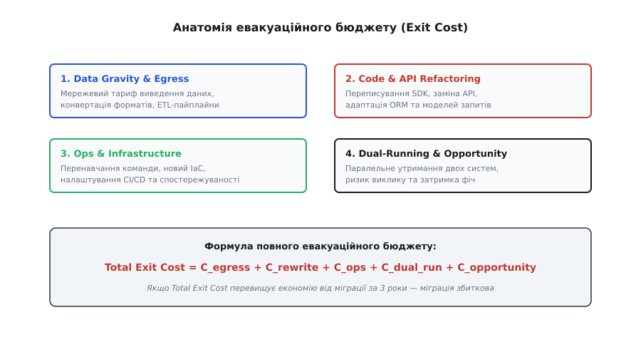
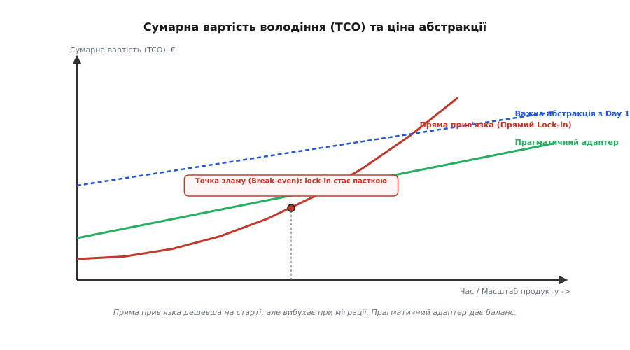

# Стратегія виходу як частина вибору

<preknowlist>
- [Однобічні та двобічні двері](topic:programming/one-way-two-way-doors) — класифікація рішень за здатністю до відкочування; як незворотні вибори вимагають більшого обсягу інформації.
- [Порти й адаптери](topic:sf-apps/hexagonal-architecture) — підхід до ізоляції доменної логіки від зовнішніх сервісів за допомогою абстрактних інтерфейсів.
- [Cloud cost як архітектурний драйвер](topic:sf-apps/cloud-cost-model) — моделювання unit-економіки та впливу архітектурних рішень на фінансовий рахунок.
- [Прив'язка і вартість виходу](topic:sf-apps/lock-in-exit-cost) — анатомія залежності від постачальника, формати даних та операційні ризики.
- [ADR — запис архітектурних рішень](topic:sf-apps/adr) — документ опису архітектурного вибору, його контексту, наслідків та обмежень.
</preknowlist>

Коли влітку 2023 року хмарний провайдер підвищив тариф на вихідний трафік (egress) для застарілих регіонів, а proprietary-база DynamoDB у системі Digital Homes розрослася до 180 терабайт, щомісячний рахунок за підтримку сервісу телеметрії зростав на 42 000 євро щокварталу. Спроба мігрувати дані на власний PostgreSQL-кластер показала, що швидка евакуація коштуватиме 640 000 євро та триватиме 14 місяців. Причиною стали не стільки гігабайти на дисках, скільки 140 мікросервісів, жорстко прив'язаних до AWS SDK, специфічна модель запитів NoSQL без відкритої схеми та відсутність проміжного шару абстракції.

Обіцянка хмарних провайдерів про «безмежне масштабування в один клік» ховає фінансовий механізм, про який інженери згадують лише у момент виписування підсумкового рахунку. Прив'язка до постачальника (Vendor Lock-in) — це не просто випадкова помилка проектирования чи наслідок «поганого коду». Це **фінансовий і технологічний кредит**, який команда свідомо або несвідомо бере у вендора на самому початку проекту. Вендор надає готові високорівневі сервіси — керовані бази даних, черги повідомлень, сервіси авторизації, — прискорюючи вихід продукту на ринок (Time-to-Market). Замість року розробки власної інфраструктури система запускається за місяць.

Проте відсоткова ставка за цим кредитом виражається у **вартості виходу (Exit Cost)** — обсязі грошей, часу та інженерних зусиль, які доведеться сплатити за евакуацію системи, якщо постачальник змінить умови ліцензування, піднята ціну або опиниться під геополітичними санкціями. Якщо вартість виходу з хмари не порахована до підписання договору, рішення вважається незрілим, а обрана інфраструктура — однобічними дверима, за якими зачиняються будь-які важелі фінансового впливу на постачальника.

Стратегія виходу (Exit Strategy) — це не панічний план втечі, складений за день до розриву контракту з хмарою. Це **обов'язковий елемент первинної оцінки архітектурного рішення**, який закладається у документ запису архітектурних рішень (ADR) у момент вибору постачальника.

---

## 1. Природа Vendor Lock-in як архітектурного кредиту

Усі інженерні рішення в хмарній економіці зводяться до балансу між двома величиною: вартістю розробки власного рішення (Build Cost) та вартістю використання готового керованого сервісу (Buy/Managed Cost). Коли команда обирає готовий керований сервіс (наприклад, AWS DynamoDB замість власного Cassandra-кластера або Auth0 замість власного сервера автентифікації), вона купує час.

Провайдери хмарних послуг будують цінову політику таким чином, щоб зробити момент входу в хмару максимального лагідним. Безкоштовний трафік на вхід (ingress), щедрі гранти для стартапів, відсутність плати за передачу даних між сервісами всередині одного регіону — усе це створює ілюзію дешевизни. 

Проте щойно система обростає даними та кодом, провайдер вмикає механізми фінансового утримання. Ціноутворення стає асиметричним: вихідний трафік коштує у 50–100 разів дорожче за внутрішній рух даних, а тривалі контракти на зарезервовані потужності (Reserved Instances) накладають жорсткі штрафи за дострокове розірвання.

Залежність від постачальника розподіляється по чотирьох архітектурних шарах. Детальний систематичний опис усіх чотирьох рівнів наведено у [моделі оцінки вартості евакуаційного бюджету](topic:progarch/exit-strategy/comp-evacuation-cost-model.md).

```
+-----------------------------------------------------------------------+
|  Рівні прив'язки (Lock-in Spectrum)                                  |
+-----------------------------------------------------------------------+
|  1. API & SDK Vector      (Найвищий ризик у коді)                     |
|  2. Data Gravity Vector   (Найвища фінансова вартість виходу)         |
|  3. Operations & IaC      (Високий ризик затримки процесів)           |
|  4. Ecosystem & Skills    (Опір людського чинника)                    |
+-----------------------------------------------------------------------+
```

### Вектор коду та інтерфейсів (API & SDK Vector)

Найпоширеніша форма прив'язки. Розробники імпортують специфічні SDK вендора безпосередньо у доменні сервіси. Наприклад, у коді обробки подій розумного будинку Digital Homes виклик збереження стану датчика виглядає як прямий виклик AWS DynamoDB Client API:

```ts
// Пряма прив'язка: доменний сервіс знає про тип AWS DynamoDB Client
import { DynamoDBClient, PutItemCommand } from "@aws-sdk/client-dynamodb";

export class SensorService {
  constructor(private db: DynamoDBClient) {}

  async saveTelemetry(sensorId: string, temp: number) {
    // Proprietary формат даних {"S": ...}, {"N": ...} протекти в бізнес-код
    await this.db.send(new PutItemCommand({
      TableName: "Telemetry",
      Item: {
        SensorId: { S: sensorId },
        Temperature: { N: temp.toString() },
        Timestamp: { N: Date.now().toString() }
      }
    }));
  }
}
```

У цій точці бізнес-логіка перестає бути нейтральною. Вона знає про proprietary-типи даних (`{"S": ...}`, `{"N": ...}`), специфічний синтаксис запитів та механіку обробки помилок провайдера. Якщо таких викликів у системі сотні, заміна бази даних вимагає масованого рефакторингу вихідного коду.

### Вектор гравітації даних (Data Gravity Vector)

Дані мають масу. Що більший обсяг даних накопичується у хмарі, то сильніше вони «притягують» обчислювальні ресурси до себе. Причиною є економіка мережевого трафіку: хмарні провайдери роблять вхідний трафік (ingress) безкоштовним, але стягують високу плату за вихідний трафік (egress).

Вивантаження 200 терабайт сирої телеметрії з AWS S3 або Google Cloud Storage на власні сервери або до іншого хмарного провайдера за стандартним тарифом коштує від 15 000 до 25 000 євро лише за мережеві пакети, не враховуючи час роботи конвертерів та простій сервісів.

Більше того, якщо дані збережені у proprietary-форматі (наприклад, у внутрішніх табличних блоках DynamoDB або Google Bigtable), їх додатково необхідно розпакувати й конвертувати у відкритий формат (JSON Lines, Apache Parquet або CSV), що вимагає значних обчислювальних потужностей і часу.

```
Порівняльна таблиця тарифів Egress у великих провайдерів (на 1 ТБ):
---------------------------------------------------------------------
Провайдер                Вхідний трафік (Ingress)   Вихідний трафік (Egress)
---------------------------------------------------------------------
AWS CloudFront / S3      Безкоштовно                80 – 90 $ / ТБ
Google Cloud Platform    Безкоштовно                80 – 120 $ / ТБ
Microsoft Azure          Безкоштовно                70 – 87 $ / ТБ
Cloudflare R2            Безкоштовно                0 $ / ТБ (Zero Egress)
Hetzner Cloud            Безкоштовно                1.00 € / ТБ
---------------------------------------------------------------------
```

Різниця в тарифах між гіперскалерами (AWS/GCP/Azure) та альт-хмарами (Cloudflare/Hetzner) демонструє, що ціна egress у гіперскалерів — це не технічна собівартість мережі, а **фінансовий бар'єр утримання даних**.

### Вектор операцій та інфраструктури (Operations & IaC Vector)

Навіть якщо вихідний код написаний абстрактно, інфраструктура системи може бути міцно прив'язана до провайдера через інструменти конфігурування (Terraform, CloudFormation), правила авторизації (IAM-ролі), політики безпеки та системи спостережуваності (CloudWatch, GCP Operations).

Заміна AWS IAM на відкритий Keycloak або апаратні Vault-секрети вимагає перебудови всього конвеєра CI/CD та переписання маніфестів deployment. Інфраструктурні скрипти часто виявляються більш прив'язаними до конкретного вендора, ніж сам вихідний код на C++ чи TypeScript.

### Вектор компетенцій команди (Ecosystem & Skill Vector)

Людський чинник та накопичений контекст. Інженери, які роками будували системи на базі специфічних сервісів AWS (наприклад, Kinesis, AppSync, DynamoDB), володіють глибокими знаннями саме цієї екосистеми.

Міграція на Apache Kafka, PostgreSQL та самостійно керований GraphQL-сервер вимагає часу на перенавчання команди, що призводить до тимчасового падіння швидкості розробки нових продуктів. Команда висловлює природний психологічний опір міграції, оскільки звичні інструменти моніторингу та налагодження змінюються новими.

---

## 2. Анатомія та розрахунок евакуаційного бюджету (Exit Cost)

Оцінка вартості виходу — це не інтуїтивне припущення, а точний економічний розрахунок. Повний бюджет евакуації (`Total_Exit_Cost`) складається з п'яти основних компонентів.


*Складові евакуаційного бюджету та порівняльний часовий профіль витрат при прямому використанні вендора проти використання абстрактного шару.*

Математична модель евакуаційного бюджету виглядає так:

```
Total_Exit_Cost = C_egress + C_rewrite + C_ops + C_dual_run + C_opportunity
```

Розберемо кожен доданок цієї формули на практичному прикладі системи Digital Homes, яка розглядає можливість евакуації з хмарної бази даних DynamoDB на відкритий кластер PostgreSQL.

### 1. Витрати на мережевий вихід та трансформацію даних (C_egress)

```
C_egress
= D · T_egress + D · C_transform
= 180 · 80 € + 180 · 20 €      [застосували тариф трафіку 80 €/ТБ та конвертацію 20 €/ТБ]
= 14 400 € + 3 600 €           [помножили 180 ТБ на відповідні цінові ставки]
= 18 000 €                     [отримали сумарні витрати на виведення даних]
```

### 2. Витрати на переписання коду та рефакторинг API (C_rewrite)

```
C_rewrite
= N_loc · C_loc_refactor
= 38 000 · 7 €                 [38 000 рядків коду залежностей при вартості рефакторингу 7 €/LOC]
= 266 000 €                    [отримали сумарну вартість інженерної праці розробників]
```

### 3. Витрати на операційну міграцію та інфраструктуру (C_ops)

```
C_ops
= (H_iac + H_train) · Rate_ops
= (280 + 140) · 80 €           [280 год на IaC + 140 год на перенавчання SRE за ставкою 80 €/год]
= 420 · 80 €                   [підсумували загальний обсяг операційних годин]
= 33 600 €                     [помножили години на погодинну ставку SRE]
```

### 4. Витрати на паралельну експлуатацію двох систем (C_dual_run)

Під час міграційного вікна, яке триває `M` місяців, стара та нова системи працюють паралельно у режимі подвійного запису (Dual-Write) для перевірки консистентності даних.

```
C_dual_run
= M · (Infra_old + Infra_new) · K_sync
= 5 · (22 000 € + 14 000 €) · 1.30 [5 місяців паралельного бігу з коефіцієнтом синхронізації 1.3]
= 5 · 36 000 € · 1.30          [підсумували щомісячні рахунки двох хмарних інфраструктур]
= 180 000 € · 1.30             [помножили сумарний рахунок на 5 місяців міграційного вікна]
= 234 000 €                    [врахували накладні витрати на подвійну реплікацію даних]
```

### 5. Альтернативна вартість замороженої розробки (C_opportunity)

Поки команда розробників оновлює 140 мікросервісів та переносе дані, створення нових бізнес-фіч зупиняється.

```
C_opportunity
= Dev_FTE · M · Monthly_Salary · K_velocity_loss
= 6 · 5 · 6 500 € · 0.50       [6 розробників на 5 місяців при зарплаті 6 500 € і втраті 50% швидкості]
= 195 000 € · 0.50             [підсумували фонд оплати праці виділеної команди за 5 місяців]
= 97 500 €                     [обрахували вартість замороженого випуску нових продуктів]
```

### Підсумковий розрахунок евакуаційного бюджету

```
Total_Exit_Cost
= 18 000 € + 266 000 € + 33 600 € + 234 000 € + 97 500 €
= 649 100 €                    [підсумували всі п'ять складових евакуаційного бюджету]
```

Отримана цифра — 649 100 євро — це реальний фінансовий поріг евакуації. Якщо перехід на PostgreSQL дасть економію у 10 000 євро на місяць (120 000 євро на рік), строк окупності міграції становитиме понад 5.4 року. У цьому випадку евакуація є **економічно недоцільною**, а поточна прив'язка до DynamoDB є раціональним технічним боргом, який дешевше обслуговувати, ніж ліквідовувати.

---

## 3. Три стратегічні запобіжники та їхня ціна

Для управління ризиком Vendor Lock-in архітектори застосовують три основні технічні запобіжники. Проте кожен із них має власну ціну, яку система сплачує з першого дня експлуатації.


*Сумарна вартість рішення залежно від життєвого циклу. На ранніх етапах пряма прив'язка до вендора дає високу швидкість, але з ростом масштабу прихований Exit Cost робить евакуацію дорожчою за повну перебудову.*

### 1. Подвійний постачальник (Multi-cloud / Dual-vendor Strategy)

Ідея здається привабливою: запускати застосунок одночасно в AWS та GCP (або Azure), розгортаючи сервіси в режимі Active-Active. Якщо один вендор підвищить ціни або зазнає аварії, трафік миттєво переключається на іншого.

**Ціна страховки:** Нактично Multi-cloud призводить до **синдрому найменшого спільного знаменника (Lowest Common Denominator Syndrome)**. Система позбавляється можливості використовувати унікальні, найефективніші сервіси кожного вендора (наприклад, AWS DynamoDB або GCP BigQuery) і змушена обмежуватися лише базовими віртуальними машинами чи сирими контейнерами Kubernetes.

Операційна складність подвоюється: команду доводиться навчати інструментам двох провайдерів, а вартість інфраструктури зростає на 40–80% через постійну міжхмарну синхронізацію трафіку.

**Коли це виправдано:** Лише для критичних вузлів з жорсткими вимогами до доступності (SLA 99.999%), де ціна хвилини простою перевищує мільйони євро (наприклад, платіжні gateway або потокова трансляція відео з лічильників безпеки).

### 2. Відкриті формати даних та портативність (Data Portability)

Формат збереження даних є важливішим за мову програмування чи шар коду. Якщо дані збережені у відкритому, стандартизованому форматі (Apache Parquet, PostgreSQL wire protocol, JSON Lines, Protobuf), вони можуть бути зчитані будь-яким іншим інструментом без участі початкового постачальника.

Показовим прикладом є створення евакуаційного пайплайну на основі Change Data Capture (CDC). Практичну реалізацію такого конвеєра наведено у [прикладі побудови евакуаційного пайплайну](topic:progarch/exit-strategy/proj-evacuation-pipeline.md).

```
+-----------------------------------------------------------------------+
|  Стратегія портативності даних (Data Portability Pipeline)            |
+-----------------------------------------------------------------------+
|  [Proprietary Cloud Store]                                           |
|            │ (CDC / Log Stream)                                      |
|            ▼                                                         |
|  [Neutral Schema Converter] ──► Open Format (Parquet / JSON Lines)   |
|                                        │                             |
|                                        ▼                             |
|                               [Neutral Target Store]                 |
+-----------------------------------------------------------------------+
```

Використання відкритих форматів повністю знімає ризик Data Gravity Lock-in, оскільки вивантаження та збереження знімків даних у формати Parquet чи CSV дозволяє завантажити їх у будь-яку альтернативну СУБД (PostgreSQL, ClickHouse, DuckDB) за години, а не місяці.

### 3. Шар абстракції (Abstraction Layers & Ports/Adapters)

Застосування патерну [Порти й адаптери](topic:sf-apps/hexagonal-architecture) дозволяє ізолювати бізнес-логіку від вендора. Доменний шар взаємодіє лише з абстрактним інтерфейсом (портом), а конкретний SDK хмари ховається за адаптером.

```ts
// Абстрактний порт (Нейтральний до вендора)
export interface TelemetryRepository {
  save(reading: SensorReading): Promise<void>;
  getByHome(homeId: string): Promise<SensorReading[]>;
}

// Адаптер #1 (AWS DynamoDB Implementation)
export class DynamoDBTelemetryAdapter implements TelemetryRepository {
  constructor(private client: DynamoDBClient) {}
  async save(reading: SensorReading): Promise<void> { /* AWS specific logic */ }
  async getByHome(homeId: string): Promise<SensorReading[]> { /* AWS specific query */ }
}

// Адаптер #2 (PostgreSQL Implementation — Створений для евакуації)
export class PostgresTelemetryAdapter implements TelemetryRepository {
  constructor(private pool: PgPool) {}
  async save(reading: SensorReading): Promise<void> { /* SQL INSERT */ }
  async getByHome(homeId: string): Promise<SensorReading[]> { /* SQL SELECT */ }
}
```

**Ціна страховки:** Створення та підтримка власних шарів абстракції вимагає додаткових інженерних зусиль на самому початку проекту. Крім того, виникає ризик **протікання абстракцій (Law of Leaky Abstractions)**: спроба створити єдиний інтерфейс, який ідеально закриває і реляційну базу SQL, і документоорієнтовану NoSQL, призводить до того, що розробники створюють громіздкі, повільні wrapper-оркестратори, які не дозволяють використати унікальні оптимізації жодної з баз.

---

## 4. Операційні стратегії переключення трафіку (Cutover Execution)

Коли прийнято рішення про евакуацію, інженерна команда повинна забезпечити перенесення даних та переключення користувацького трафіку без зупинки продукту. Існує чотири послідовні фази виконання евакуаційного плану:

```
+-----------------------------------------------------------------------+
|  Фази виконання евакуації (Cutover Timeline)                          |
+-----------------------------------------------------------------------+
|  Фаза 0: Підготовка та вивантаження історичного знімка (Snapshot ETL) |
|  Фаза 1: Запуск CDC-потоку та режиму подвійного запису (Dual Write)   |
|  Фаза 2: Тіньове читання та верифікація (Shadow Read Verification)    |
|  Фаза 3: Канареєчне переключення трафіку (Canary Shift Cutover)       |
|  Фаза 4: Виведення з експлуатації старої хмари (Decommissioning)      |
+-----------------------------------------------------------------------+
```

### Фаза 0: Вивантаження історичного знімка (Snapshot ETL)

Історичні дані вивантажуються у відкритий формат у фоновому режимі без блокування основних таблиць. Для баз даних великого обсягу створюються табличні знімки (read-only snapshots), які паралельно читаються декількома потоками воркерів та вивантажуються в об'єктне сховище. Записи, створені до початку евакуаційного вікна, завантажуються у цільову СУБД.

### Фаза 1: Подвійний запис та наздоганяння CDC-потоку (Dual-Write & CDC Catchup)

Нові події записуються одночасно у стару СУБД та за допомогою CDC-пайплайну реплікуються у нову СУБД. На цій фазі важливо відстежувати метрику `Replication_Lag` — затримку між появою запису в старому журналі та його матеріалізацією в новій СУБД. Канареєчне переключення дозволяється лише тоді, коли затримка реплікації падає нижче 50 мілісекунд.

### Фаза 2: Тіньове читання та валідація цілісності (Shadow Read Verification)

Застосунок виконує зчитування зі старої бази даних і повертає ці дані користувачеві, але паралельно асинхронно запитує нову базу даних. Система порівнює контрольні суми відповідей обох СУБД. 

Якщо виявляється розбіжність (Data Mismatch), запис фіксується у системі моніторингу для з'ясування причин (наприклад, розбіжність у часових поясах або відмінність у rounding правил для плаваючої коми). Тіньове читання триває до досягнення 99.999% відповідності відповідей.

### Фаза 3: Канареєчне переключення трафіку (Canary Shift Cutover)

Перші 5% користувачів або пристроїв переводяться на читання й запис із нової бази даних за допомогою динамічних прапорців конфігурації (Feature Flags). Команда SRE протягом 48 годин спостерігає за перцентилями затримки (p95/p99) та показниками помилок (Error Rate). За відсутності аномалій частка трафіку плавно нарощується за схемою: 5% -> 25% -> 50% -> 100%.

### Фаза 4: Демонтаж та виведення з експлуатації (Decommissioning)

Стара хмарна база даних переводиться в режим Read-Only на 30 днів для гарантії відновлення у разі виявлення прихованих дефектів у новій системі. Після завершення 30-денного карантинного періоду виконується остаточний демонтаж старої інфраструктури та анулювання хмарних підписок.

---

## 5. Коли Lock-in — раціональний борг, а коли — безпросвітна пастка

Прив'язка до постачальника не є абсолютним злом. На ранніх етапах життя проекту (Stage 1: Validation / MVP) свідома відмова від шарів абстракції та пряме використання сервісів вендора є **найбільш раціональним рішенням**.

```
+-----------------------------------------------------------------------+
|  Матриця оцінки залежності (Lock-in Decision Matrix)                  |
+-----------------------------------------------------------------------+
|  Високий вплив на бізнес  │  Квадрант 2: НЕБЕЗПЕКА                    |
|  (Business Criticality)   │  Потрібен тонкий адаптер та Exit Plan     |
|                           │  (наприклад, телеметрія, авторизація)     |
|                           ├───────────────────────────────────────────|
|  Низький вплив на бізнес  │  Квадрант 1: РАЦІОНАЛЬНИЙ БОРГ            |
|                           │  Пряма прив'язка до SDK провайдера        |
|                           │  (наприклад, надсилання SMS, аналітика)   |
|                           └───────────────────────────────────────────|
|                           Низький Exit Cost ────► Високий Exit Cost   |
+-----------------------------------------------------------------------+
```

### Матриця прийняття рішень

1. **Раціональний борг (Квадрант 1):** Якщо продукт знаходиться на стадії перевірки гіпотез, а Monthly Recurring Revenue (MRR) не перевищує 20 000 євро, витрачати 40% часу розробки на побудову портативних адаптерів — це передчасне проектування (Over-engineering). Швидкість перевірки ринку важливіша за майбутню вартість виходу. Якщо стартап згорить через півроку, вартість виходу дорівнюватиме нулю.
2. **Безпросвітна пастка (Квадрант 2):** Якщо модуль є серцем бізнесу (Core Domain), обсяг даних перевищує десятки терабайт, а вендор контролює і кодову базу, і формати збереження без можливості розпаковки, система опиняється у пастці. Вендор отримує монопольне право підвищувати ціни, знаючи, що вартість евакуації перевищує річний прибуток клієнта.

### Поріг зламу (Break-even Threshold)

Точка, у якій пряма прив'язка перестає бути раціональним боргом і стає пасткою, виражається через відношення щомісячного рахунку провайдера (`Cloud_Bill`) до вартості підтримки власного шару абстракції (`Adapter_Maintenance_Cost`).

```
Break_Even_Condition: Cloud_Bill > 3 · Adapter_Maintenance_Cost
```

Якщо щомісячний рахунок за хмарну базу даних перевищує трикратну вартість підтримки тонкого адаптера командою розробників, необхідно негайно впроваджувати шар ізоляції та готувати план евакуації.

---

## 6. Формування Стратегії Виходу та відтворення в ADR

Стратегія виходу є формальним документом або розділом у записі архітектурного рішення (ADR). Вона відповідає на чотири конкретні запитання:

1. **Які тригери евакуації (Evacuation Triggers)?** Чіткі числові умови, за яких організація починає процес виходу (наприклад: підвищення вартості сервісу вендором більше ніж на 25% за рік; зміна ліцензії з відкритої на proprietary; падіння показника доступності SLA нижче 99.9% протягом двох кварталів поспіль; вихід вендора з юрисдикції компанії).
2. **Яка цільова альтернатива (Target Landing Zone)?** Куди саме буде перенесено сервіс у разі евакуації (наприклад: з AWS SQS на самостійно керований кластер RabbitMQ в Hetzner або з DynamoDB на PostgreSQL).
3. **Який очікуваний час евакуації (Time-to-Evacuate - TTE)?** Скільки тижнів або місяців потрібно команді для повного переключення трафіку.
4. **Яка порахована вартість виходу (Exit Cost)?** Актуальний кошторис евакуаційного бюджету, оновлюваний щороку з урахуванням росту обсягів даних.

### Приклад оформлення Exit Strategy у структурі ADR

Нижче наведено практичний витяг із реального документу ADR системи Digital Homes при виборі сервісу черг повідомлень для телеметрії розумних будинків:

> **ADR-042: Вибір провайдера черг повідомлень для телеметрії**
>
> **Контекст:** Для обробки 45 000 подій на секунду від хабів Digital Homes необхідний високопродуктивний брокер повідомлень. Розглядаються варіанти: AWS SQS (Managed) проти власного кластера Apache Kafka у Kubernetes.
>
> **Рішення:** Обрати AWS SQS на перші 18 місяців розробки для забезпечення максимальної швидкості виходу на ринок (TTFV).
>
> **Управління Vendor Lock-in та Стратегія Виходу (Exit Strategy):**
> 1. *Ізоляція коду (Mitigation):* Усі мікросервіси видавців та споживачів подій НЕ повинні використовувати SDK `@aws-sdk/client-sqs` напряму. Взаємодія здійснюється виключно через інтерфейс доменного порту `EventBus`:

```ts
export interface EventBus {
  publish(topic: string, message: DomainEvent): Promise<void>;
  subscribe(topic: string, handler: (msg: DomainEvent) => Promise<void>): void;
}
```

> 2. *Тригери евакуації (Triggers):*
>    - Щомісячний рахунок за AWS SQS перевищує 12 000 € (точка економічного зламу проти утримання власної Kafka).
>    - Затримка доставки повідомлень (Latency p99) перевищує 150 мс протягом 3 днів поспіль.
>
> 3. *Цільовий план евакуації (Landing Zone):* Перехід на відкритий брокер RabbitMQ / NATS у власному Kubernetes-кластері.
>
> 4. *Оцінка вартості виходу (Exit Cost Estimate):*
>    - Переписання адаптерів `EventBus`: 40 інженерних годин (3 200 €).
>    - Налаштування та валідація кластера RabbitMQ: 120 інженерних годин (9 600 €).
>    - Тестування подій під навантаженням: 40 інженерних годин (3 200 €).
>    - **Разом Exit Cost:** 16 000 € | **Очікуваний TTE (Time-to-Evacuate):** 2 тижні.
>
> **Наслідки:** Ми приймаємо тимчасовий операційний lock-in на AWS SQS, оскільки вартість евакуації (16 000 €) є прозорою, а час евакуації (2 тижні) не створює загрози для стабільності бізнесу.

---

## 7. Баланс між засліпленням і прагматизмом

Стратегія виходу — це інструмент тверезого розрахунку, а не привід для параноїдальної відмови від хмарних технологій. Архітектор, який намагається з першого дня побудувати повністю портативну, абсолютно незалежну від будь-якого вендора систему, ризикує витратити увесь бюджет компанії на створення власної, недосконалої хмари всередині компанії (Inner-Platform Effect).

Прагматична архітектура визначає межі залежності свідомо. Для другорядних допоміжних функцій (надсилання повідомлень, аналітика логів, тимчасові файли) пряма прив'язка до хмарного вендора є виправданим компромісом. Для системного ядра, даних користувачів та ключової доменної логіки застосування тонких адаптерів, відкритих форматів та розрахованого евакуаційного бюджету гарантує, що компанія завжди зберігатиме повний контроль над власною технологічною долею та фінансовою економікою розробки.
