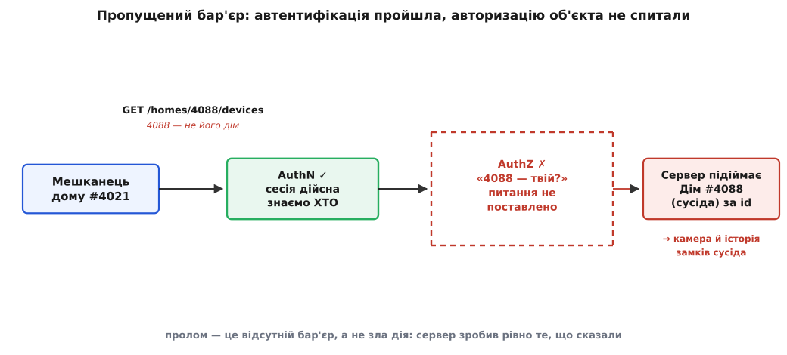
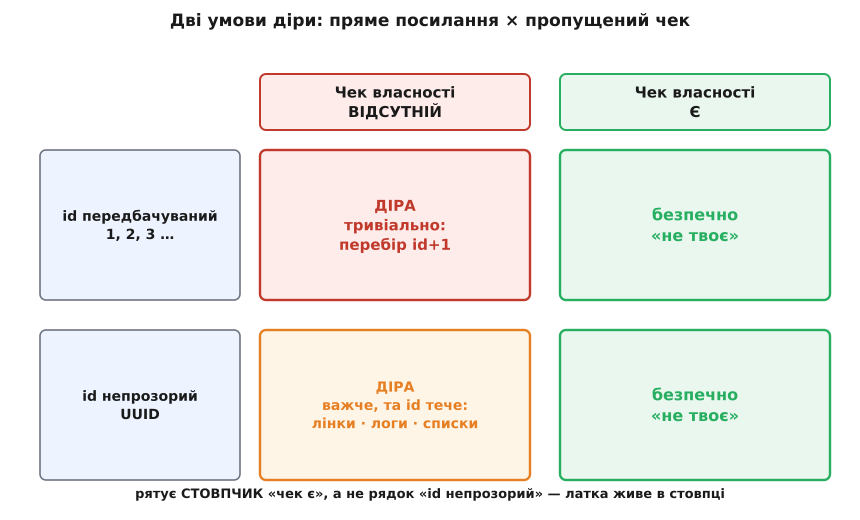

# Горизонтальна ескалація (IDOR) як загроза

<preknowlist>
- [Мультиарендність](topic:sf-distributed/tenant-isolation) — багато орендарів (у нашому випадку — родин) живуть в одній системі, і кожен має бачити лише своє; ця ізоляція між сусідами — саме та межа, яку ламає горизонтальна ескалація.
</preknowlist>

Минулі два кроки ми будували апарат авторизації: [моделі, що кажуть «хто й що може»](topic:sf-security/authorization-models), і [політики як код](topic:sf-security/policy-as-code), які цю відповідь записують і виконують. Апарат є. Тепер уявімо, що його просто **не спитали** — і подивімося, що з цього виходить.

Мешканець дому #4021 відкриває застосунок DH. У рядку запиту, яким його телефон тягне список пристроїв, стоїть `homes/4021/devices`. Він міняє одну цифру — `4021` на `4088` — і бачить пристрої **сусідського** дому: камеру у вітальні, історію, коли й хто відмикав вхідний замок. Нічого не зламано в буквальному сенсі. Сесія дійсна, запит правильно сформований, сервер зробив рівно те, що йому сказали. І це — не рідкісний екзотичний злам, а **найпоширеніша серйозна вада вебу**: система знала, **ХТО** прийшов, і забула спитати, **ЩО САМЕ** йому можна.

## Розрив між «хто ти» і «що саме твоє»

Щоб побачити механізм, розділімо два питання, які легко зливаються в одне. Перше — **автентифікація**: хто ти? На нього система відповіла чесно — сесія дійсна, це справді залогінений мешканець #4021, а не самозванець. Друге — **авторизація** цього конкретного об'єкта: а дім #4088 — твій? Ось його **ніхто не поставив**. Сервер узяв id із запиту, підняв за ним дім і віддав. [Різницю між цими питаннями](root:progarch/auth-vs-authz-boundary) ми вже проводили; тут вона перестає бути академічною й стає діркою, крізь яку витікають чужі дані.

Найпідступніше те, що вада — це **пропуск, а не дія**. Ніхто не дописав шкідливого коду; хтось **не дописав** одного рядка перевірки. А наслідок цього пропуску невидимий, поки на нього не натиснуть. Пройдімо звичайним шляхом: інтерфейс показує мешканцю тільки **його** дім, тому в усіх запитах, які застосунок робить сам, стоїть тільки `4021`. Демо блищить, тести на щасливому шляху зелені, рев'ю нічого не помічає — бо ніхто на щасливому шляху й не намагається підставити чужий id. Дірка тихо доживає до продакшену й чекає на першого, хто відредагує цифру.


*Автентифікація відповіла «так, це мешканець #4021» — і пропустила. Питання «а дім #4088 — його?» ніхто не поставив, тож сервер слухняно віддав пристрої сусіда. Пролом — це відсутній бар'єр, а не якась зла дія.*

> 🔧 **Навіщо це.** Тут вирішується, чи стане ваша платформа новиною. Мешканець, що відкрив камеру сусіда, — це не «дрібний баг у списку»; це витік приватного відео з чужого дому, і закон дивиться на нього як на витік персональних даних із усіма наслідками. Причому знайти таку дірку не треба бути хакером: досить цікавості й одного редагування адреси. Саме тому пропущена перевірка права на об'єкт — не «колись полагодимо», а перша річ, яку шукають і свої, і чужі.

## Як це називають і чому

У цієї діри є точна назва — **IDOR**, від англ. *Insecure Direct Object Reference*, «небезпечне пряме посилання на об'єкт». Розберімо назву по слову, бо в ній схований весь механізм. *Посилання на об'єкт* — це id, яким клієнт називає річ: `homeId=4088`. *Пряме* — бо це **справжній внутрішній ключ** (рядок у базі), і сервер вживає його **прямо**, щоб дістати об'єкт, не переклавши на питання «а цьому запитувачеві він належить?». *Небезпечне* — бо між «клієнт назвав об'єкт» і «сервер його віддав» немає перевірки права.

А сам маневр — крок **убік**, до сусіда на **тому самому** рівні влади, — зветься **горизонтальною ескалацією** (лат. *scala* — драбина). Її варто відрізняти від **вертикальної**: там нападник лізе **вгору** драбиною привілеїв — зі звичайного мешканця в адміністратора платформи, щоб отримати владу, якої не мав. Горизонтальна ж не піднімається над своїм рівнем: мешканець лишається мешканцем — але дотягується до чужого дому такого самого мешканця. IDOR — класичний засіб саме горизонтального руху: ти не стаєш «головнішим», ти просто читаєш сусідську комірку, до якої тебе не мали пускати.


*Вертикальна ескалація дереться вгору за владою — мешканець хоче стати адміном. Горизонтальна лишається на своєму рівні й ступає вбік — до дому сусіда-рівні. IDOR — типовий вагон саме горизонтального руху.*

Назви цієї вади мандрували десятиліттями. У ранніх списках OWASP вона була окремим пунктом під іменем IDOR; згодом її **влили в ширшу категорію** «зламаний контроль доступу» (*Broken Access Control*), яка в редакції 2021 року стоїть під номером **A01 — найбільший ризик вебу**, піднявшись із п'ятого місця. У світі API ту саму діру звуть **BOLA** (*Broken Object Level Authorization*, «зламана авторизація на рівні об'єкта») — і це **перший** ризик у окремому списку OWASP для API. Різні десятиліття, різні абревіатури — та сама пропущена перевірка. А корінь усього — давня ідея [заплутаного заступника](topic:sf-security/confused-deputy): сервер тут виступає заступником, що має широкий доступ до всієї бази, і його «заплутують» — намовляють ужити свою владу над об'єктом, до якого сам запитувач права не має. Звідки взялися ці назви й на яких гучних витоках вони кувалися — у [лінії назв цієї діри](root:progarch/idor-horizontal-escalation/hist-idor-lineage.md).

## Дві умови, з яких народжується діра

IDOR не з'являється з однієї причини — потрібні **дві** умови водночас, і це важливо, бо визначає, що саме лагодити.

Перша: **клієнт може назвати об'єкт, який йому не належить**. Ідентифікатори послідовні, тож `4088` вгадується як `4087 + 1`; або id **витік** іншим шляхом — із відкритого списку, зі спільного посилання, з логів, із заголовка `Referer`, із тексту помилки. Друга: **на кожному доступі бракує перевірки права на цей об'єкт** — сервер діє за наданим посиланням, не звіряючи, чи запитувач має на нього право.

Жодна з умов **поодинці** пролому не робить. Непрозорі, невгадувані id при відсутній перевірці — все одно пробій (id рано чи пізно протече). А вгадувані id **із** перевіркою — безпечні: підстав хоч `4088`, хоч `4089`, сервер відповість «не твоє». Тобто несуча відмова — **друга**: пропущений чек. Перша лише впливає на те, наскільки **легко** дірку знайти, а не на те, чи вона є.


*Рятує стовпчик «чек є», а не рядок «id непрозорий». Непрозорий id без перевірки — досі діра, лише знайти важче; передбачуваний id із перевіркою — безпечний. Латка живе в стовпці, не в рядку.*

## Дірка й латка в коді DH

Подивімося на дірку впритул. Ось обробник DH, який показує пристрої дому. Він **автентифікований** — до нього не пустять без дійсної сесії, — і саме це присипляє пильність:

:::tabs
```ts
// GET /api/homes/:homeId/devices — «показати пристрої дому»
app.get("/api/homes/:homeId/devices", requireSession, async (req, res) => {
  const homeId = req.params.homeId;             // ← id приходить від КЛІЄНТА
  const home = await homes.byId(homeId);        // ← беремо дім прямо за цим id
  if (!home) return res.status(404).end();
  res.json(await devices.ofHome(home.id));      // ← і віддаємо. А чий це дім — не спитали
});
```
```py
@app.get("/api/homes/{home_id}/devices")
def list_devices(home_id: str, user: User = Depends(current_user)):
    home = homes.by_id(home_id)                 # id — з URL, тобто від клієнта
    if home is None:
        raise HTTPException(404)
    return devices.of_home(home.id)             # чий це дім? не спитали
```
:::

`requireSession` / `current_user` зробили свою частину: без входу сюди не потрапиш. Але це відповідь лише на «хто ти». Другого питання — «дім `home_id` твій?» — у коді немає **фізично**, і сервер, маючи повний доступ до бази, слухняно піднімає будь-який дім за будь-яким id.

Латка — один рядок, той самий, якого бракувало:

:::tabs
```ts
app.get("/api/homes/:homeId/devices", requireSession, async (req, res) => {
  const home = await homes.byId(req.params.homeId);
  // Рядок, якого бракувало: цей дім належить тому, хто питає?
  if (!home || !home.belongsTo(req.session.userId))
    return res.status(404).end();               // 404, не 403: не зізнаємось, що дім існує
  res.json(await devices.ofHome(home.id));
});
```
```py
@app.get("/api/homes/{home_id}/devices")
def list_devices(home_id: str, user: User = Depends(current_user)):
    home = homes.by_id(home_id)
    # рядок, якого бракувало:
    if home is None or not home.belongs_to(user.id):
        raise HTTPException(404)                 # 404, не 403 — не зізнаємось, що дім є
    return devices.of_home(home.id)
```
:::

`belongsTo` / `belongs_to` питає модель дому те, що вона й так знає з [нашого доменного розкрою](root:progarch/dh-data-model): чи цей `userId` — власник дому або впущений ним член родини. Три речі в цій латці несучі, і кожну легко загубити. Перевірка — **на сервері**, а не в інтерфейсі (клієнту вірити не можна: він і підставляє чужий id). Перевірка — **на кожному доступі** до об'єкта, а не «десь раніше по дорозі». І ключ перевірки — **той, хто автентифікувався** (`req.session.userId`), а не id, надісланий клієнтом. Дрібниця наостанок, але з наслідками: відмовляємо через `404`, а не `403`, — бо `403` («заборонено») підтверджує, що дім #4088 **існує**, і це вже підказка нападнику; `404` не зізнається ні в чому.

Що це не гра уяви, показує найгучніший приклад. У 2019-му страховий гігант First American Financial тримав документи угод за адресами з **послідовним** дев'ятизначним номером і **без жодної перевірки** того, хто дивиться: змінив номер у посиланні — дістав чужу угоду з банківськими виписками й номерами соцстрахування. Так витекло близько **885 мільйонів** записів — рівно за цим механізмом, послідовний id плюс відсутній чек. Деталі цього й інших витоків — у [лінії назв](root:progarch/idor-horizontal-escalation/hist-idor-lineage.md).

## Чому UUID — не латка

Спокуса «полагодити» дешево очевидна: замінімо послідовні id на випадкові **UUID** — тоді `+1` не спрацює, сусіда не вгадаєш. І це справді трохи піднімає поріг. Але **дірку не закриває**, бо лікує не ту умову — першу (легкість знайти) замість другої (пропущений чек). Це [безпека через невідомість](topic:sf-security/least-privilege): непрозорий id усе одно **тече** — крізь спільне посилання, яким мешканець колись поділився; крізь `Referer`, лог, повідомлення помилки; крізь інший ендпоінт, що чесно вертає список id. Колишній член родини, що зберіг стару адресу з UUID, зайде так само вільно, бо перевірки як не було, так і немає.

Непрозорі id — добра **оборона в глибину**: не варто дарувати нападнику безкоштовний лічильник `id+1`. Але це **додача до** перевірки права, а не її заміна. Єдина справжня латка — та сама, з попереднього розділу: питати авторизаційне питання **на кожному доступі до об'єкта**. Погляньте ще раз на матрицю: безпеку дає стовпчик «чек є», і байдуже, у якому рядку — з UUID чи з послідовним номером — ви стоїте.

## Чому це рішення архітектури, а не рядок коду

Здавалося б, ми все розв'язали: допиши `belongsTo` — і по всьому. Але тут ховається пастка масштабу. Той рядок мусить стояти в **кожному** обробнику, що торкається об'єкта з власником, — а їх у зрілій системі сотні: пристрої, кімнати, сцени, записи камер, запрошення, рахунки. Якщо перевірка права — це те, що кожен розробник має **пам'ятати** дописати щоразу, то IDOR **неминучий**: досить одного забутого обробника серед сотень, щоб мати один пролом. А забувають люди надійно — надто коли щасливий шлях і без чека працює бездоганно.

Звідси випливає інша порода вимоги — **відмова за замовчуванням** (deny-by-default). Конвеєр запиту має бути влаштований так, щоб доступ **не надавався**, поки щось явно його не дозволило; забута перевірка мусить **падати в замкнене** (fail closed), а не тихо пропускати. «Пропустив, бо не заборонили» — це і є та архітектура, у якій живе IDOR; «заборонив, бо не дозволили» — та, у якій йому нема місця.

І ось тут загроза, яку ми розібрали, перестає бути темою про безпеку й стає **архітектурним питанням**, з яким модуль працюватиме далі: **де живе ця перевірка**, щоб її не можна було забути? Розкидати чек власності по кожному обробнику (варіант А — авторизація в самому сервісі)? Винести його в один спільний бар'єр, крізь який проходить кожен запит (варіант Б — централізована авторизація)? Поєднати? Кожен вибір має свою ціну — і саме IDOR робить цей вибір не косметичним, а таким, що визначає, чи буде платформа безпечною конструктивно чи лише за людською пильністю.

## Що взяти далі

Горизонтальна ескалація — це не хитрий експлойт, а **пропущене питання**: система впевнено відповіла «хто ти» й забула спитати «що саме твоє». IDOR — її класичний вагон: прямий id плюс відсутній чек права дорівнює чужі дані в руках. Ми побачили механізм упритул — дві умови, латку в один рядок, і чому непрозорий id тієї латки не заміняє. І, головне, побачили, що надійність тут не в старанності окремого розробника, а в тому, **де поставлено бар'єр**: перевірка на сервері, на кожному доступі, за особою запитувача, з відмовою за замовчуванням. Практичне полювання на цю діру в коді DH — харнес, що перебирає чужі id, вставлений чек і тест, який доводить закриття, — зібране в [окремій майстерні](root:progarch/idor-horizontal-escalation/proj-dh-idor-hunt.md). А наступні кроки модуля візьмуть головне питання, яке ця загроза поставила руба, і перетворять його на свідоме рішення: куди покласти авторизацію, щоб забути її було ніде.
