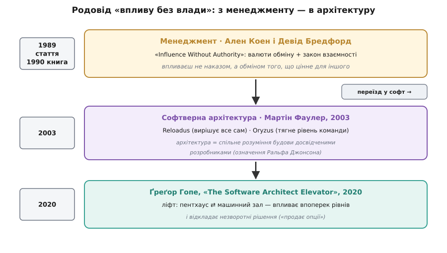

# 📜 Родовід «впливу без влади»: з менеджменту — в архітектуру

Вислів «вплив без влади» (англ. *influence without authority*) звучить так, ніби народився в софті: це ж наш вічний клопіт — відповідати за форму системи, не командуючи руками, що її пишуть. Насправді ані вислів, ані ідея не наші. Ми їх позичили — готовими, з іншого ремесла, де та сама скрута визріла на двадцять років раніше. Пройти цей родовід варто, бо він показує не просто «хто перший сказав», а **що саме переїхало** з менеджменту в архітектуру, а що народилося вже в дорозі — і чому без цієї дороги ідея розсипається.

Скрута, з якої все почалося, стара як великі організації. Штабний фахівець, керівник проєкту, внутрішній консультант — усі вони мусять досягати результату руками людей, які їм не підлеглі. Відповідальність є; важеля наказу немає. Хтось мав дати цій щоденній безвиході ім'я й інструмент.

## Менеджмент дає ім'я: Коен і Бредфорд (1989–1990)

Дали двоє американських дослідників менеджменту — Ален Коен (Allan R. Cohen, Babson College) і Девід Бредфорд (David L. Bradford, Stanford Graduate School of Business). Спершу — статтею «Influence Without Authority: The Use of Alliances, Reciprocity, and Exchange to Accomplish Work» у журналі *Organizational Dynamics* 1989 року; наступного року вона розрослася в книжку «Influence Without Authority» (John Wiley & Sons, 1990). *(Усталено: стаття 1989, книга 1990; сам вислів у заголовку — їхній.)*

Механізм, який вони запропонували, тримається на двох стовпах. Перший — **закон взаємності** (лат. *reciprocus* — той, що вертається туди-сюди): люди майже рефлекторно віддячують за зроблене їм добро. Другий, і точніший, — **валюти обміну** (англ. *currencies of exchange*). Коен і Бредфорд помітили: кожен цінує щось своє, і це «своє» можна розкласти на впізнавані валюти — приблизно п'ять родин: натхнення й спільна мета, конкретна поміч у задачі, статус і визнання, стосунки й прихильність, відчуття власної вправності. Впливати — означає не тиснути, а платити людині її валютою в обмін на те, що потрібне тобі. Наголошували вони й на тому, що це не маніпуляція: обмін чесний, обидві сторони справді щось виграють.

Ось перше, що переїде в архітектуру майже дослівно, — сама ідея «валюти співрозмовника». Коли архітекторові радять не казати «ви порушуєте архітектуру», а перекладати ризик у те, чим міряє вигоду саме цей стейкхолдер, — це рівно валюта обміну Коена й Бредфорда, лише вбрана в термінал і нічне чергування замість службового підвищення.

## Переїзд у софт: Фаулер називає два види архітектора (2003)

Місток між менеджментом і кодом перекинув Мартін Фаулер (Martin Fowler) — англійський інженер, головний науковець ThoughtWorks — колонкою «Who Needs an Architect?» у липнево-серпневому числі *IEEE Software* за 2003 рік. *(Усталено: IEEE Software, том 20, № 5, липень/серпень 2003.)*

Починається вона зі сценки в коридорі. Фаулер бачить похмурого колегу Дейва Райса (Dave Rice) — одного з їхніх провідних архітекторів — і той кидає: «Не варто брати на співбесіду нікого, у кого в резюме написано „архітектор“». Парадокс? Ні: Райс зневажає не роль, а її карикатуру — «самовдоволеного володаря усього», як архітектор у фіналі «Матриці: Перезавантаження». І звідси Фаулер виводить два різновиди.

**Architectus Reloadus** — той, хто ухвалює всі важливі рішення сам. Робить так, бо вірить, що для цілісності задуму потрібен єдиний розум, а ще, буває, бо не вважає команду досить умілою; рішення мусять лягти рано, щоб решта мала за чим іти. **Architectus Oryzus** — інший звір (Фаулер так і пише — «a different kind of animal», а розшифровку хитро ховає за посиланням на латинську граматику). Цей живе в гущі проєкту, ловить важливе, доки воно не проросло в біду, і — головне — **підтягує рівень команди**, щоб вона сама бралася за складніше. Звідси Фаулерове золоте правило: **цінність архітектора обернено пропорційна кількості рішень, які він ухвалює**.

Імена — жарт, і жарт двошаровий. «Reloadus» — відкрито з «Матриці: Перезавантаження» (*Reloaded*). «Oryzus» — прихована латинізація: *oryza* — рис, а взірцем цього типу в статті виступає сам Дейв **Райс** (Rice). *(Жарт напівявний: Фаулер лишає розшифровку читачеві, та саме Райса називає прикладом — тож рис-Oryzus прочитується певно.)* За назвами, однак, стоїть цілком серйозна теза, і вона — той самий місток.

Бо посеред статті Фаулер наводить означення архітектури, яке почув від Ральфа Джонсона (Ralph Johnson — один з «банди чотирьох» авторів «Design Patterns») у розсилці Extreme Programming, і цитує повністю. Стисло воно таке: **у більшості успішних проєктів досвідчені розробники мають спільне розуміння будови системи — це спільне розуміння й називають архітектурою**. *(Усталено: пряма цитата Джонсона у статті Фаулера.)* Джонсон навмисне робить архітектуру **соціальним конструктом**: вона живе не в діаграмі, а в головах, і залежить від того, що група спільно вважає важливим.

І тут клацає замок. Якщо архітектура — це спільне розуміння в головах, то **наказом її не створити**: розуміння не переказати згори директивою. Його можна лише виростити — переконуючи, навчаючи, підтягуючи. Отже, для архітектора «вплив без влади» — не м'яка навичка на додачу, а єдиний інструмент, яким узагалі будується те, за що він відповідає. Коен і Бредфорд дали вислів; Джонсонове означення пояснило, **чому** в архітектурі він неминучий; а Фаулерів Oryzus дав живий образ того, хто ним живе.

Тут треба чесно означити статус самого містка. Фаулер у статті **не цитує** Коена й Бредфорда — прямого посилання немає, збіг тематичний, не бібліографічний. Але вислів «influence without authority» на той час уже ходив у менеджерському обігу саме як їхній, і спільнота архітекторів перейняла і його, і поставу. Тож «переїзд» — це усталена практика запозичення, а не одна задокументована цитата.

## Гопе садить архітектора в ліфт (2020)

Третю станцію поставив Ґреґор Гопе (Gregor Hohpe) — інженер, знаний ще й як співавтор «Enterprise Integration Patterns», головний архітектор Allianz, згодом в AWS і в офісі CTO Google Cloud — книжкою «The Software Architect Elevator: Redefining the Architect's Role in the Digital Enterprise» (O'Reilly, 2020). *(Усталено: назва, підзаголовок, рік.)*

Його метафора — **ліфт**. У високій будівлі організації нагорі, в пентхаусі, сидять керівники зі стратегією; глибоко внизу, у машинному залі, крутиться код. Архітектор — той рідкісний, хто **курсує ліфтом** між поверхами: доносить нагору технічну правду, не розводнюючи її до банальностей, і зносить донизу сенс стратегії. Цінність його — саме в русі впоперек рівнів. А що він при цьому ні в раді директорів не засідає, ні командами розробників не володіє, то важіль його — знову той самий: вплив без влади, лише розтягнутий тепер на всю висоту організації.

Гопе додав до родоводу ще одну рису, і вона змикає коло з Фаулером. Свою роль головного архітектора він описує як **«продаж опцій»** (англ. *selling options*): найцінніше, що архітектор дає бізнесові, — це змога **відкласти незворотні рішення**, доки про проблему не стане відомо більше. Це майже дослівно перегукується з Фаулеровим «прибрати архітектуру, усунувши незворотність» і з правилом про обернену пропорцію рішень. *(Усталено: Гопе окремо писав про архітектуру як «продаж опцій».)* Отже, до містка «вплив без влади» додається другий трос — «мінімізуй ранні незворотні рішення», — і обидва тягнуться від 2003-го до 2020-го.

> 🔧 **Навіщо це.** Знати родовід — не педантство. Він показує, звідки в порадах про архітектора беруться «валюти», «підтягни команду», «обернена пропорція рішень», «продавай опції»: це не випадкові гасла, а злютована традиція з іменами й датами. І він застерігає: вислів прийшов з менеджменту, але в архітектурі має **власну, жорсткішу підставу** — бо тут спільне розуміння наказом не заміниш, хоч би скільки в тебе було влади.

## Що переїхало, а що народилося в дорозі

Складімо родовід в один рядок. З **менеджменту** приїхали готовими сам вислів і механізм обміну — валюти й взаємність Коена та Бредфорда. В **архітектурі** до них доросло те, чого в менеджменті не було: Джонсонове означення, яке робить вплив не бажаним, а **єдино можливим** інструментом (спільне розуміння не декретують), і Фаулерові образи Reloadus/Oryzus, що дали цьому імена й обличчя. А Гопе додав **географію** — впливати доводиться впоперек поверхів організації — і другий трос про відкладання незворотних рішень.

*Той самий вислів на трьох станціях за тридцять років. Народжений у менеджменті (валюти обміну, взаємність), він переїхав у софт, де Фаулер дав йому два обличчя, а Джонсонове означення — тверду підставу, і врешті сів у ліфт Гопе, курсуючи впоперек рівнів організації.*

Один практичний висновок з усього цього тримається окремо. Обидва пізніші автори — і Фаулер, і Гопе — незалежно вперлися в **незворотність рішень** як у корінь: цінність архітектора тим вища, чим менше незворотного він змушений вирішувати рано. Це та сама вісь, на якій стоїть [різниця зворотних і незворотних рішень](topic:programming/reversible-irreversible-decisions) — двобічні двері віддавай легко, однобічні бережи; родовід «впливу без влади» лише показує, що до цієї осі велика традиція йшла двадцять років.
