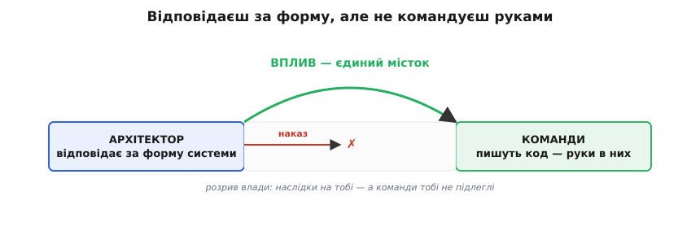
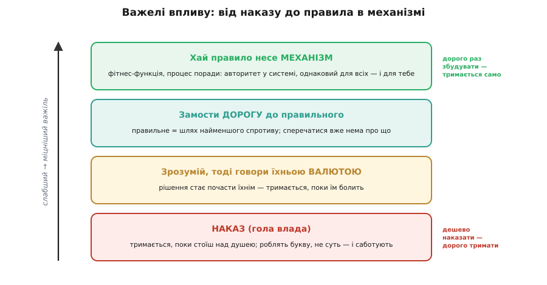
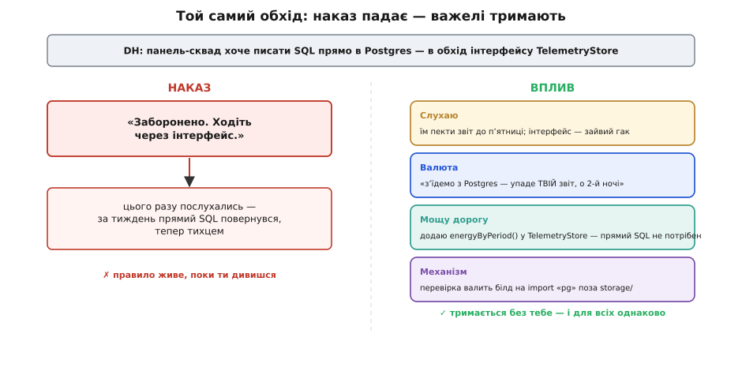

# Вплив без наказу

<preknowlist>
- [Зчеплення і зв'язність](topic:sf-apps/coupling-cohesion) — наскільки міцно одна частина коду тримається за іншу; прямий імпорт драйвера бази прив'язує код до конкретної БД — рівно те, що інтерфейс перед тим ховав, — тож обхід інтерфейсу не дрібниця стилю, а втрата змінюваності.
</preknowlist>

Digital Homes виросла так, що ти вже не єдиний, хто пише код. З'явилися сквади: хтось пестить мобільну апку, хтось — хмару, хтось — прошивку хабів. І ось панель-сквад під дедлайном ліпить новий звіт про енергоспоживання. Найшвидший шлях — запитати Postgres напряму, звичайним SQL. Одна біда: кроком раніше ти [домовився й записав в ADR](topic:sf-apps/architecture-decision-records), що вся телеметрія ходить лише через інтерфейс `TelemetryStore`. Саме так [ми колись купили собі зворотність](root:progarch/cost-of-delay) — база сховалася за вузьким швом, і замінити її потім коштуватиме зміни одного модуля, а не переписування половини коду. Прямий SQL цей шов пробиває: щойно запити до Postgres розповзуться панеллю, [код прикипить до конкретної бази](topic:sf-apps/coupling-cohesion), і зворотність, за яку ти заплатив, тихо випарується.

Ти скликаєш [рев'ю](topic:sf-apps/architecture-review), кладеш це на стіл — і по суті ти маєш рацію. А тоді впираєшся в незручну правду ремесла: **тиснути нема на що**. Немає кнопки «заборонити». Панель-сквад тобі не підлеглий; ніхто не робив тебе їхнім начальником. Ти [відповідаєш за форму системи](topic:sf-apps/architect-role) — за те, як усе складеться за рік, — але руки, що пишуть код, не твої. Це не збій конкретної компанії. Це звичайний стан архітектора: **відповідальність без влади**.


*Архітектор стоїть на боці, де живуть наслідки; руки, що пишуть код, — на іншому. Наказ до них не дотягується через розрив влади. Єдине, що перекидає місток, — вплив.*

Перша спокуса — оголосити це негараздом оргструктури: дайте архітекторові владу, і хай наказує. Спокуса оманлива, і варто побачити чому.

## Чому наказ не працює навіть тоді, коли він є

Уяви, що владу тобі таки дали. Ти кажеш «не смійте лізти в Postgres напряму» — і що станеться далі?

Найперше — **буква замість суті**. Люди зроблять рівно те, що звелено, і ні на йоту більше. Заборонив прямий SQL — вони обкладуть його тонкою обгорткою: формально вже «не прямий», а по суті той самий обхід. Наказ переносить **висновок**, але не переносить **розуміння**, з якого висновок виріс; а без розуміння підлеглий тримається літери й обходить дух за першої ж незручності.

Друге — **ти стаєш вузьким місцем**. Раз усе вирішуєш ти, кожне рішення мусить пройти крізь тебе. Десять сквадів — і перед тобою черга; ти вже не проєктуєш форму, а штампуєш дозволи. Це та сама арифметика, через яку [централізовані «ворота» рано чи пізно захлинаються](topic:sf-apps/architecture-review/hist-advice-process.md): стала місткість під потоком, що росте, завжди дає чергу.

Третє й найглибше. Пригадаймо, що таке архітектура насправді. Одне з найточніших означень дав Ральф Джонсон: **архітектура — це спільне розуміння будови системи досвідченими розробниками**. Не діаграма, не документ — саме *спільне розуміння* в головах людей. А якщо так, то наказ, якого ніхто не зрозумів, архітектурою не стає, хоч би яку схему ти намалював. Спільне розуміння — єдине, що переживе тебе, коли підеш у відпустку чи звільнишся. **Наказом його не викликати.** Його можна тільки виростити — по одній переконаній голові за раз.

І остання іронія: хто має найбільше влади, той зазвичай має найменше контексту. Що вище крісло, то далі воно від коду — наказ спускається згори, саме звідти, де деталей видно найменше. Тому «архітектор-диктатор, що вирішує все сам» — не сила, а тендітна конструкція; а «архітектор, що працює всередині команди й підтягує її рівень» тримається куди надійніше. [Обидва образи давно мають імена, а сам вислів «вплив без влади» прийшов у софт із менеджменту через цілу низку людей](root:progarch/influence-without-authority/hist-influence-lineage.md) — це окрема історія, варта того, щоб її знати.

Отже, наказ — важіль слабкий і крихкий. Тоді який міцний?

## Вплив — не харизма, а набір важелів

Найпоширеніша помилка — думати, що вплив це вроджена харизма: хтось «уміє переконувати», а хтось ні. Насправді вплив — це **впорядкований набір рухів**, яким можна навчитися, як будь-якому ремеслу. Розкладімо їх від того, за що хапається початківець (і що працює найгірше), до того, що тримається найкраще.


*Ті самі важелі за зростанням міцності. Наказ дешево віддати, але тримається він, лише поки стоїш над душею. Що вище — то дорожче збудувати раз і то надійніше воно тримається само, аж до правила, вшитого в механізм: воно однакове для всіх і не потребує тебе поруч.*

**Спершу зрозумій, і лише тоді будь зрозумілим.** Це порядок, який Стівен Кові поставив на перше місце: *спершу прагни зрозуміти, а вже тоді — бути зрозумілим*. Ти не можеш вплинути на те, чого не зрозумів. Панель-сквад не бешкетує знічев'я — вони оптимізують **свою** мету: викотити звіт до п'ятниці. Поки ти цього не почув, твій аргумент б'є в опудало, а не в живу причину. Слухати тут — не ввічливість, а розвідка: ти з'ясовуєш, що саме тисне на людину. І дає це дивовижний побічний ефект: коли ти вплітаєш їхнє обмеження у розв'язок, розв'язок стає почасти **їхнім** — а зі своїми ідеями люди не воюють.

**Говори їхньою валютою.** Тут криється точний прийом. Кожен стейкхолдер цінує своє: одному важлива швидкість поставки, другому — спокійні чергування, третьому — бюджет. Це його **валюта** *(від лат. valere — мати вагу, бути вартим)* — те, чим для нього міряється вигода. Слабкий архітектор говорить лише своєю валютою: «ви порушуєте архітектуру». Для сквада це порожній звук. Сильний **перекладає** ту саму думку в їхню валюту: «коли ми з'їдемо з Postgres — а ми з'їдемо, ми ж заради цього й ховали базу за інтерфейсом, — упаде саме **твій** звіт, і латати його тобі, о другій ночі, на своєму чергуванні». Той самий факт, але тепер він болить **їм**. Ідея обміну валютами — не моя вигадка; [звідки вона взялася, розказано в історії вислову](root:progarch/influence-without-authority/hist-influence-lineage.md).

**Зроби правильне легким.** Найглибший важіль, і найменш очевидний. Придивись: більшість «порушень» — не бунт, а **вода, що тече вниз**. Прямий SQL обрали не на зло, а тому, що він був **простіший** за прохід через інтерфейс. Отже, замість воювати з ухилом, зміни сам ухил. Бракує їм зручного способу дістати дані за період — додай цей спосіб **в інтерфейс**: `TelemetryStore.energyByPeriod(...)`. Тепер правильний шлях і є найлегшим, і сперечатися стало нема про що. Ти перестав переконувати й почав **мостити дорогу**. Наказ воює з ухилом вічно; мощена дорога прибирає саму бійку.

**Хай авторитет несе механізм, а не ти.** І останній важіль, що замикає коло. Замість «я кажу: без прямих імпортів Postgres» постав [фітнес-функцію](topic:sf-apps/fitness-functions) — автоматичну перевірку, що валить білд, коли код поза адаптером сховища імпортує драйвер бази. Тепер це вже не «ти проти сквада». Це **червоний білд**, однаковий для кожного — і для тебе теж. Авторитет переїхав із твоєї посади в **систему**: безособовий, послідовний, невтомний. Ось де «вплив без влади» стає «владою без людини» — правило живе в механізмі, а не в твоєму титулі. (Та сама логіка стоїть за [процесом поради](topic:sf-apps/architecture-review/hist-advice-process.md): будь-хто вирішує сам, але зобов'язаний спершу спитати поради в зачеплених і фахівців — авторитетом тут є не ранг, а сам обов'язок порадитися.)

Ось як виглядає та перевірка — коротко й насправді. Задача проста: у теці застосунку жоден файл, крім адаптера `storage/`, не сміє імпортувати драйвер Postgres.

:::tabs
```ts
import { readdirSync, readFileSync } from "node:fs";
import { join } from "node:path";

const ADAPTER = join("src", "storage");     // єдине легальне місце для драйвера БД
const DRIVER = /\bfrom\s+["']pg["']/;       // import ... from "pg"

function walk(dir: string): string[] {
  return readdirSync(dir, { withFileTypes: true }).flatMap((e) => {
    const p = join(dir, e.name);
    return e.isDirectory() ? walk(p) : [p];
  });
}

const offenders = walk("src")
  .filter((p) => p.endsWith(".ts") && !p.startsWith(ADAPTER))
  .filter((p) => DRIVER.test(readFileSync(p, "utf8")));

if (offenders.length) {
  console.error("Драйвер БД імпортовано поза storage/:\n  " + offenders.join("\n  "));
  console.error("Ходи через TelemetryStore.energyByPeriod() — інтерфейс тримає базу замінною.");
  process.exit(1);            // білд червоний: правило тримає перевірка, не людина
}
```
```py
import re, sys
from pathlib import Path

ADAPTER = Path("src") / "storage"           # єдине легальне місце для драйвера БД
DRIVER = re.compile(r"^\s*(import\s+psycopg|from\s+psycopg\b)", re.M)

offenders = [
    p for p in Path("src").rglob("*.py")
    if ADAPTER not in p.parents
    and DRIVER.search(p.read_text(encoding="utf-8"))
]

if offenders:
    print("Драйвер БД імпортовано поза storage/:")
    for p in offenders:
        print(f"  {p}")
    print("Ходи через TelemetryStore.energy_by_period() — інтерфейс тримає базу замінною.")
    sys.exit(1)               # білд червоний: правило тримає перевірка, не людина
```
:::

Двадцять рядків прибрали всю політику з розмови. Тепер сквад «сперечається» не з тобою, а з перевіркою, і повідомлення про помилку саме йому показує мощену дорогу. Одна засторога: **не кидай цю стіну червоною першого ж дня** — інакше ти відтвориш ту саму образу від наказу, тільки машиною. Спершу попередження, потім ворота; наявні порушення заморозити, а лічильник хай лише спадає. Як це розгорнути так, щоб перевірка не стала ненависним наглядачем, [винесено в окремий код-розбір](root:progarch/influence-without-authority/proj-arch-fitness-gate.md).

> 🔧 **Навіщо це.** Коли твоє рішення ігнорують, не підвищуй голос — спускайся драбиною важелів. Спитай, яка в них валюта й чому обхід був простішим. Домости бракучий зручний шлях, щоб правильне стало найлегшим. А те, що мусить триматися завжди, вшивай у механізм, а не в свою присутність. Наказ вимагає, щоб ти стояв поруч вічно; мощена дорога й червоний білд тримають правило самі — і однакове для всіх.

## Вплив — вичерпний ресурс

Лишається одне питання, без якого важелі перетворюються на батіг: **на що їх витрачати?** Бо кожен твій натиск — навіть найм'якший — коштує дещицю довіри й доброї волі команди. Штовхатимеш на кожній дрібниці — швидко станеш тим, від кого відвертаються, і твій голос знеціниться саме тоді, коли справді знадобиться.

Ключ — у тому, що ми вже вміємо розрізняти: [зворотні рішення й незворотні](topic:sf-apps/reversible-irreversible-decisions). Двобічні двері — назва змінної, структура одного модуля, вибір дрібної бібліотеки — **віддай команді**, навіть якщо сам обрав би інакше. Схиблять — відкотять за годину, зате навчаться й почнуть тобі довіряти. А свій обмежений капітал впливу бережи на однобічні двері: поділ даних між сервісами, формат, що потече в клієнти, публічний контракт API. Уміння **обрати, за що битися**, і є половина ремесла. І винагорода подвійна: віддавши дрібне, ти не тільки ростиш команду — ти робиш свої рідкісні «оце важливо» вагомими саме тому, що вони рідкісні.


*Та сама спроба обійти інтерфейс, пройдена двома шляхами. Наказ дає покору на один раз — і обхід повертається тихцем. Чотири важелі впливу, накладені на той самий випадок, лишають правило живим без твоєї присутності й однаковим для кожного.*

Повернімося до панель-сквада й складімо все докупи. Ти не заборонив прямий SQL. Ти вислухав і почув їхній дедлайн; переклав ризик у їхню валюту — «впаде твій звіт»; домостив `energyByPeriod()`, щоб через інтерфейс стало **легше**, ніж повз нього; і поставив перевірку, що тепер тримає межу за всіх, тебе включно. Наказу не було жодного — а межа стоїть міцніше, ніж стояла б під будь-яким наказом. І наступного разу цей сквад прийде до тебе **сам**, ще до того, як писати обхід, бо минулого разу розмова з тобою їм дала зручний інструмент, а не догану.

Тепер видно й те, що ми робили ввесь цей модуль, під новим кутом. [ADR](topic:sf-apps/architecture-decision-records), у якому ти записав не лише «що», а й «чому». [Рев'ю](topic:sf-apps/architecture-review), де рішення виносять на спільний стіл. Фітнес-функція, що стереже межу без тебе. Це не паперова тяганина й не бюрократія — це **машинерія впливу**. Архітектура є спільним розумінням; наказом його не створити, його можна тільки виростити — а ADR, рев'ю й перевірки і є ті інструменти, якими його вирощують і бережуть. Найбільший важіль тут — навіть не діаграма, а форма самої команди: але це вже наступна розмова.
