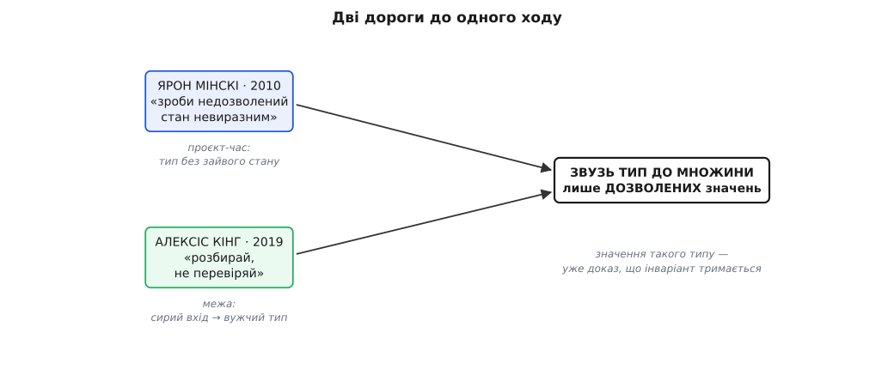

# 📜 Два гасла з одного кореня

Ця тема лишила два гасла, кинутих мимохідь, — «розбирай, не перевіряй» і «зроби недозволений стан невиразним». Обидва звучать так, ніби були завжди: почувши, киваєш і думаєш, що й сам це знав. Насправді кожне з них хтось мусив уперше сказати вголос, і сталося це не разом, а з дев'ятирічним розривом, у двох різних кутках того самого світу — типізованого функційного програмування. Цікаво тут не так «хто перший», як те, що дві людини, які розв'язували різні задачі й, схоже, не змовлялися, дійшли до однієї думки. Коли одну думку незалежно намацують двічі, це добра ознака, що думка справжня, а не мода.

Бо роками досвідчені програмісти на OCaml і Haskell робили той самий рух — моделюй точно, розбирай на межі — **на чуття**, не вміючи коротко пояснити новачкові, чому так правильно. Практика була, слова не було. А непойменована практика не передається: її можна лише перейняти, стоячи поруч, але не можна вписати в підручник як правило. Обидва наші гасла — це, по суті, акт іменування: хтось узяв мовчазну звичку цеху й дав їй фразу, яку можна повторити. У цьому вся їхня цінність, і саме тому їх варто розібрати нарізно, а тоді звести докупи.

## Ярон Мінскі й недозволений стан

Раніша з двох думок народилася там, де помилка коштує грошей негайно. **Ярон Мінскі** *(Yaron Minsky)* — це не Марвін Мінскі, піонер штучного інтелекту, а інша людина — працює в Jane Street, фірмі, що торгує на біржі власним коштом. У такому місці баг не незручність: хибний внутрішній стан може виставити хибну заявку й спалити реальні гроші за мілісекунди. І Jane Street зробила ставку, дику як на індустрію початку 2000-х: вести весь бізнес на OCaml — типізованій функційній мові, якої тоді в промисловості майже ніхто не вживав. Ставка була, по суті, парі на компілятор: нехай сувора система типів працює як безвідмовний перевіряч перед кожним запуском, і тоді цілі класи помилок не доживуть до біржі.

Мінскі роками доводив, що парі виправдалося. Найширше — у статті «OCaml for the Masses» (Communications of the ACM, листопад 2011, усталено), де він переконував інженерну спільноту, що типізована функційна мова окупається саме тим, що ловить баги ще до того, як вони чогось коштуватимуть. А найпам'ятніша фраза прозвучала в іншому місці — у гостьовій лекції «Effective ML», яку Мінскі прочитав студентам вступного курсу інформатики CS51 у Гарварді 2010 року (того семестру курс саме вчив OCaml) і повторив наступного року (усталено). Найраніше широко цитоване публічне джерело гасла — саме та лекція.

Гасло: **«зроби недозволений стан невиразним»** *(make illegal states unrepresentable)*. Сенс простий і безжальний. Не описуй свою предметну область як мішок вільних полів, які потім по всьому коду стережеш перевірками. Натомість збудуй тип так, щоб недозволена комбінація **не мала запису взагалі**. Класичний приклад — той самий, що ми вже бачили: стан пристрою двома полями, булеве «онлайн» і рядок «адреса», дає чотири комбінації, з яких дві безглузді — онлайн без адреси й офлайн з адресою. Опиши стан типом-сумою, «або Online(адреса), або Offline», — і безглузді комбінації зникають. Не тому, що ти їх заборонив, а тому, що їх **нічим написати**.

Ось де ховається сила ходу, і Мінскі це проговорив прямо. Перевірку, яку треба **пам'ятати**, колись **забудуть**: перевірок десятки, а пам'ять кінцева. А стан, який **не можна записати**, забути виключити **неможливо** — за тебе це робить компілятор, щоразу, безвідмовно. Для фірми, що ставить гроші на кожне внутрішнє значення, це не естетика типів, а керування ризиком: тип-сума дешевша за дисципліну, бо не покладається на дисципліну зовсім.

Чесності ради: саму практику — точні алгебричні типи замість вільних полів — Мінскі не винайшов. Вона була фольклором спільнот ML і Haskell задовго до 2010 року. Що він додав, то це фразу на слайді, яку можна повторити й передати далі. Іменування — теж внесок.

## Алексіс Кінг і згоряння знання

Друга думка прийшла з іншого боку й дев'ять років по тому. **Алексіс Кінг** *(Alexis King)* — американська програмістка (Чикаго; пише Haskell і Racket, згодом працювала з групою мов програмування Північно-Західного університету). П'ятого листопада 2019 року вона опублікувала в себе в блозі допис «Parse, don't validate» — «розбирай, не перевіряй», з прикладами мовою Haskell (усталено).

Кінг узялася за загадку, що дратувала практиків: функційні програмісти вперто обирали «розбирати» замість «перевіряти» — знову на чуття, — але не могли ясно сказати новачкові, у чому принцип. Вона його викристалізувала однією тезою: різниця між перевіркою й розбором майже цілком у тому, **як зберігається інформація**. Перевірка відповідає «так чи ні» й віддає здобуте знання в нікуди — найчистіша перевірка мовою Haskell повертає `()`, буквально ніщо. А розбір бере пухкий вхід і повертає **точніший тип**, тож знання, яке ти щойно здобув, їде далі **в самому типі**, доказом для кожного нижче за течією. Це рівно та «сліпота до булевого» і те «тип пам'ятає», з яких ми починали.

За наскрізний приклад Кінг узяла найскромнішу функцію на світі — `head`, що повертає перший елемент списку й падає на порожньому. Уся мораль вкладається у три рядки:

```haskell
-- частковий head: на порожньому списку [] падає в рантаймі
head :: [a] -> a

-- «розбір» списку: або доведи, що він непорожній, або скажи «ні»
nonEmpty :: [a] -> Maybe (NonEmpty a)

-- тотальний head: аргумент уже непорожній — падати нема на чому
head :: NonEmpty a -> a
```

Замість перевіряти «а чи не порожній?» щоразу перед викликом, ми один раз **розбираємо** список у тип `NonEmpty`, що просто не вміє бути порожнім. Далі `head` тотальна — компілятор приймає її без жодного припущення, бо порожнього входу до неї фізично не існує. Знання «список непорожній» не згоріло в булевому — воно вкарбоване в тип аргументу.

Кінг підвела під це й лінію з боку безпеки. Вона запозичила образ **«дробового розбору»** (shotgun parsing) у табору мовно-теоретичної безпеки (LangSec): коли перевірки розсипані, як шріт, і переплетені з обробною логікою по всьому коду, то пізня перевірка може провалитися вже після того, як ранні дії відбулися, — і стан програми стає непередбачним. Розбір на вході цю халепу знімає: спершу доводимо, потім діємо, ніколи навпаки. Звідси її практичне правило: **пхай тягар доведення вгору так далеко, як можеш** — заганяй дані в найточніший потрібний тип якомога раніше, на самій межі. Це і є той тонкий розбірний шар на вході, про який іде ця тема.

І тут — деталь, що видає спорідненість двох гасел ще до того, як ми звели їх разом. Усередині свого допису 2019 року Кінг радить читачеві дослівно: візьми структуру даних, що **робить недозволені стани невиразними**. Тобто старіше гасло Мінскі живе **всередині** новішого есею Кінг — уже без імені автора, як спільне надбання цеху. Два гасла не просто сумісні; одне цитує друге.

## Чому це та сама думка

Звівши обидва погляди, бачиш один-єдиний рух: **звузь тип, доки його населення не збіжиться рівно з множиною дозволених значень** — не ширше й не вужче. Мінскі заходить із боку моделювання: спроєктуй тип так, щоб у недозволеного стану не було жодного мешканця. Кінг заходить із боку межі: **виготов** мешканця вузького типу з сирого входу — раз, на вході. Один прибирає поганих мешканців, друга виробляє доброго. Це два боки однієї монети.

Глибший корінь лежить іще нижче. Це [типи як дизайн](root:sf-apps/type-driven-design), а під ними — відповідність Каррі–Говарда *(Curry–Howard)*: **тип — це твердження, а значення — його доказ**. Якщо зробити тип твердженням «цей інваріант тримається», то мати значення такого типу означає мати **доказ**, що інваріант тримається. Зненацька «дані валідні» перестає бути коментарем чи перевіркою в рантаймі й стає теоремою, яку компілятор уже прийняв. Обидва гасла — лише два способи зробити цю теорему істинною: звузити твердження так, щоб хибне в нього не влізло (Мінскі), або один раз розрахуватися з доведенням на межі й везти сертифікат далі (Кінг).

Ось чому типи `Celsius` й `Online(адреса)` з цієї теми відчуваються неминучими. Це [алгебра типів](root:sf-apps/type-driven-design/math-algebra-of-types.md) у дії: тип-сума — це «+» можливостей, і ти просто відмовляєшся виписувати ту гілку «+», що означала б безглуздя. Прибрати недозволений стан (Мінскі) чи розібрати вхід у дозволений (Кінг) — це та сама арифметика над множиною мешканців типу, ведена з двох кінців.


*Дві дороги до одного ходу. Мінскі прибирає недозволеного мешканця ще на етапі проєктування типу; Кінг виготовляє дозволеного мешканця з сирого входу на межі. Обидві звужують тип до тієї самої множини — і значення такого типу вже є доказом, що інваріант тримається.*

## Як одна думка розійшлася світом

Народившись у Haskell і OCaml, думка швидко переросла обидві колиски. Скотт Влашин *(Scott Wlaschin)* у циклі «F# for Fun and Profit» (серія «Designing with types: making illegal states unrepresentable») переніс її на F#. Річард Фелдман *(Richard Feldman)* доповіддю «Making Impossible States Impossible» на elm-conf 2016 року доніс те саме до фронтенду на Elm (усталено). А есей Кінг заніс «розбирай, не перевіряй» у щоденну практику на TypeScript, Rust, Go — далеко за межі функційної академії. Приклад із `Celsius` мовами TypeScript і Rust, який ми щойно писали, — це і є та хвиля, що докотилася до звичайного прикладного коду, за тисячу верст від Haskell.

Що з усього цього тверда земля, а що тлумачення? Дати й авторство стоять на первинних джерелах: допис Кінг має позначку 5 листопада 2019, стаття Мінскі в CACM — листопад 2011, лекція «Effective ML» — 2010, і те, і те збережене в записах. Це усталено. Глибша теза — що обидва гасла є одна думка з коренем у Каррі–Говарді — не історична подія, а прочитання, широко поділюване спільнотою; подаю його як зважений, загальноприйнятий аналіз, не як факт із дати. Одне тримаймо чесно: ні Мінскі, ні Кінг практику не винайшли — цех ML і Haskell «робив недозволені стани невиразними» десятиліттями, перш ніж хтось виніс це на слайд. Внесок 2010 і 2019 років — саме **іменування**. А назва — це те, що обертає ремесло, яке переймають з рук у руки, на правило, яке можна написати й навчити. Два гасла, один рух: коли наступного разу потягнешся по об'єкт-значення чи тип-суму, знай — під тобою обидва.
