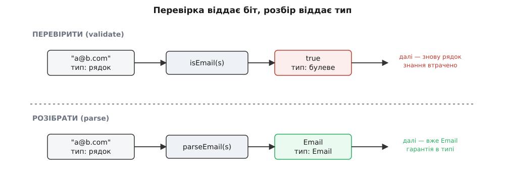
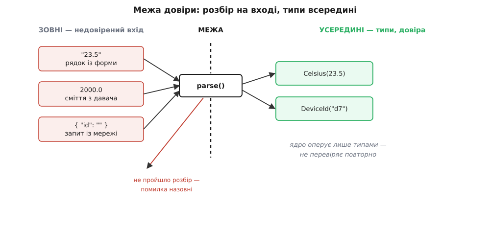

# Інваріанти й валідація на межі

<preknowlist>
- [Захисне програмування](topic:programming/defensive-programming) — перевіряти недовірений вхід на межі довіри, а не в кожному рядку; усередині межі довіряти вже перевіреному.
- [Assert і паніка](topic:programming/assert-panic) — твердження про інваріант, який НІКОЛИ не має бути хибним; хибний assert — це баг у коді, а не подія світу.
</preknowlist>

Цей модуль почався з думки, що [контракт — це межа](root:progarch/contract-as-boundary): дві частини системи домовляються, що саме одна одній обіцяють, і стик між ними тримається на цій обіцянці. [Контрактні тести](topic:programming/contract-testing) перевірили, що обидві сторони обіцянку справді дотримують. А ще раніше, коли ми вводили [проєктування за контрактом](topic:programming/design-by-contract), угода розпалася на три частини: передумову — борг викликача, постумову — борг функції, та **інваріант** — умову, що тримається до і після кожної операції. Про перші дві ми вже наговорилися. Настала черга третьої, найтихішої, бо саме вона вирішує, чи можна взагалі довіряти даним усередині системи.

## Інваріант — це обіцянка про дані

У контракті функції інваріант (латин. *invarians* — «незмінний») стосувався однієї структури: індекс кільцевого буфера завжди менший за розмір, лічильник завжди дорівнює відстані між головою й хвостом. Але той самий хід масштабується вгору — від однієї функції до цілої системи. **Інваріант предметної області** — це правда про дані, яка мусить бути істинною **скрізь**, де ці дані живуть, а не лише в одній функції.

У Digital Homes таких правд повно, і ми досі їх не називали вголос. Показник температури — не будь-яке число з рухомою комою, а число в межах, які фізично може дати кімнатний давач: приблизно від −50 до +80 °C. Ідентифікатор пристрою — не порожній рядок. Розклад дії має початок раніше за кінець. Кожна така умова — інваріант: якщо вона порушена, дані **безглузді**, і будь-яка логіка, що на них спирається, дає безглуздий результат. Обігрівач, якому сказали, що в кімнаті 2000 °C, слухняно вимкнеться — і дім поволі вихолоне, бо число було брехнею, а код йому повірив.

Питання, яке ставить архітектура, одне: **де і як цей інваріант тримати?** Тримати його треба скрізь, де ходять дані, — а джерело загрози при цьому одне-єдине конкретне місце.

## Загроза приходить іззовні

У [минулому кроці](root:progarch/errors-through-layers) ми вже прибрали одне зручне припущення — що по той бік межі все спрацьовує, — і навчилися проводити помилку крізь шари. Тепер приберемо сусіднє, ще підступніше: що дані, які **таки прийшли**, самі по собі осмислені.

Звідки в системі беруться дані? Зрештою — завжди ззовні: з давача, від людини через застосунок, із мережевого запиту, з конфігураційного файлу, з рядка бази, записаного торішньою версією схеми. Усе це — **недовірений вхід**: світ не зобов'язаний надсилати вам осмислене. Дріт давача, що бовтається в гнізді, дасть не виняток, а тихе число-сміття. Людина впише в поле «температура» слово. Старий рядок у базі матиме поле, якого код уже не чекає, або не матиме того, якого чекає.

А **всередині** система нічого нового не творить — вона лише переставляє й рахує те, що колись увійшло. Тож якщо на вході проскочило безглуздя, воно розповзається далі вже під личиною «наших власних даних», яким код довіряє без питань. Ось чому інваріант живе або вмирає саме на **межі** — тій самій межі довіри, про яку каже [захисне програмування](topic:programming/defensive-programming): ззовні підозріле й неперевірене, зсередини вже чисте. Уся справа в тому, **як** провести дані крізь цю межу.

## Дві погані відповіді й одна добра

Тут, як і з помилками, спокуса штовхає у два боки, і обидва хибні.

**Перша відповідь — довіритись наосліп.** Хай `read_sensor()` повертає число, а ми його одразу пускаємо в діло: порівнюємо з порогом, вмикаємо реле. Просто, поки давач справний. Але першого ж дня, коли контакт відійде й на вхід прийде 2000, ця довіра обертається бідою — і найгіршою, бо тихою: система не падає, вона **впевнено робить дурницю**. Безглузде число ні на що не скаржиться; воно просто тече системою як факт.

**Друга відповідь — перевіряти скрізь.** Злякавшись першого, обкладаємо перевіркою кожну функцію, що торкається температури: на вході в неї — ще раз глянути, чи число в межах. Тепер безглуздя ловиться... якщо ми ніде не забули перевірку. А ми забудемо — бо перевірок десятки, і кожна нова функція мусить пам'ятати про чужий інваріант. До того ж ці перевірки коштують: вони засмічують ядро логікою, яка до логіки не належить. Але найглибша вада тонша. Погляньте на тип: `float` виглядає **однаково**, перевіряли його чи ні. Тип нічого не пам'ятає. Тому жодна функція не може йому довіряти, не перевіривши сама, — і десь хтось таки не перевірить.

Обидві погані відповіді ростуть з одного кореня: **дані ходять системою в типі, який не несе жодної гарантії**. Число залишається просто числом. Звідси й третя, добра відповідь: **перевірити один раз, на межі, — і записати результат перевірки в сам тип.** Далі тип і буде доказом. Ніхто нижче за течією вже не перевіряє, бо перевіряти нема чого: недійсне значення сюди фізично не потрапило.

## Розбирай, не перевіряй

Різницю між поганою й доброю відповіддю найточніше вловлює одне гасло: **«розбирай, не перевіряй»** (англ. *parse, don't validate*). Ідея коштує пильного погляду, бо на позір дві дії однакові, а насправді відрізняються тим, що з ними стається **потім**.

**Перевірити** (validate) — це поставити запитання «так чи ні». Функція `isEmail(s)` бере рядок і повертає `true`. Що вона повернула? Одненький біт. А сам рядок як був `string`, так і лишився `string` — тип не змінився ні на йоту. Знання «цей рядок — валідна адреса» щойно народилося й тут-таки згоріло: далі за кодом ми знову тримаємо звичайний рядок, і компілятор (та й наступний читач) уже не знає, що його колись перевіряли. Цю ваду називають **сліпотою до булевого** (англ. *boolean blindness*): `true` не каже, **про що** він, і губиться в першому ж присвоєнні.

**Розібрати** (parse, від латин. *pars* — «частина»: розкласти вхід на осмислені частини) — це та сама перевірка, але вона повертає не біт, а **нове значення вужчого типу**, яке просто не може бути недійсним:

```ts
// перевірити: знання згоряє — далі знову голий рядок
function isEmail(s: string): boolean { /* ... */ }

// розібрати: знання лишається В ТИПІ — далі це вже Email
function parseEmail(s: string): Email | Error { /* ... */ }
```

Різниця не косметична. Після `parseEmail` ми тримаємо `Email` — і те, що адреса валідна, тепер каже **сам тип**, наскрізь, до кінця програми. Це знання вже не згубити й не забути перевірити: воно вмонтоване в річ, яку передаємо далі. Перевірка викидає інформацію; розбір її **зберігає**, підвищуючи тип від «щось» до «щось, що ми довели».


*Дві дії, що на вході однакові, а на виході різні. Перевірка віддає біт і лишає вас із тим самим недовіреним рядком. Розбір віддає нове значення вужчого типу, яке саме є доказом, що інваріант тримається.*

Саме гасло «розбирай, не перевіряй» вигострила Алексіс Кінг у нотатці 2019 року, а споріднену думку — «зроби недозволений стан невиразним» — раніше проповідував Ярон Мінскі; [звідки взялися обидві й чому вони те саме](root:progarch/invariants-and-validation/hist-parse-dont-validate.md), розберемо окремо.

## Об'єкт-значення: одні двері для інваріанта

Що ж це за «вужчий тип», який не вміє бути недійсним? Найпростіше його втілення — **об'єкт-значення** (англ. *value object*): маленький тип-обгортка навколо простого значення, у якого **єдині двері** — конструктор, що перевіряє. Поки ти тримаєш такий об'єкт у руках, інваріант тримається сам собою, бо іншого способу цей об'єкт створити немає.

Ось температура Digital Homes як об'єкт-значення. Конструктор закрито; єдиний вхід — розбірник `parse`, що або повертає готовий `Celsius`, у якому число вже в межах, або помилку:

:::tabs
```ts
// Об'єкт-значення: конструктор приватний, єдині двері — parse().
class Celsius {
  private constructor(public readonly value: number) {}

  static parse(raw: unknown): Celsius | Error {
    if (typeof raw !== "number" || Number.isNaN(raw))
      return new Error("температура — не число");
    if (raw < -50 || raw > 80)
      return new Error(`температура поза межами: ${raw}`);
    return new Celsius(raw);          // ЄДИНЕ місце, де Celsius народжується
  }
}

// Ядро бере Celsius, а не number — недійсне значення сюди не втрапить.
function decideHeating(room: Celsius, target: Celsius): boolean {
  return room.value < target.value;   // жодної повторної перевірки
}
```
```rust
/// Об'єкт-значення: поле приватне, єдині двері — parse().
pub struct Celsius(f64);

impl Celsius {
    pub fn parse(raw: f64) -> Result<Celsius, String> {
        if raw.is_nan() {
            return Err("температура — не число".into());
        }
        if !(-50.0..=80.0).contains(&raw) {
            return Err(format!("температура поза межами: {raw}"));
        }
        Ok(Celsius(raw))              // ЄДИНЕ місце, де Celsius народжується
    }
    pub fn value(&self) -> f64 { self.0 }
}

// Ядро бере Celsius, а не f64 — недійсне значення сюди не втрапить.
fn decide_heating(room: &Celsius, target: &Celsius) -> bool {
    room.value() < target.value()     // жодної повторної перевірки
}
```
:::

Придивіться, що сталося з інваріантом «температура в межах −50…80». Він **більше не розмазаний** десятками функцій — він живе в **одному** місці, у розбірнику `parse`. Це той самий виграш, що дав нам колись [шов](root:progarch/seams-and-boundaries): правило, зведене в одну точку, легко змінити й неможливо обійти. З'явиться новий давач із діапазоном до +120 — правимо один рядок, а не полюємо на всі перевірки в системі. А `decideHeating` бере `Celsius`, не число: викликач, який спробує згодувати їй сирий `float`, не пройде навіть компіляцію. Недійсне значення відсічене не в рантаймі, а в **системі типів**.

## Межа, накреслена на системі

Тепер видно, де фізично проходить та «межа», об яку ми весь час говоримо. Розбирачі-конструктори збираються в один тонкий **шар на вході** системи: там, де приходить мережевий запит, там, де читається давач, там, де вантажиться конфіг. Це — оболонка. За нею лежить **ядро**, яке оперує вже тільки об'єктами-значеннями й тому нічого не перевіряє повторно. Рівно цей поділ ми називали [функціональним ядром і імперативною оболонкою](topic:programming/functional-core-imperative-shell): оболонка розмовляє з брудним світом і **розбирає** його вхід, ядро отримує вже чисте й **довіряє типам**.


*Уся перевірка зібрана в тонкому шарі на межі. Що не пройшло розбір — вертається назовні помилкою й досередини не потрапляє. Усе, що дісталося ядра, уже несе гарантію у своєму типі, тож ядро працює без жодної оборонної перевірки.*

І тут — важлива стиковка з тим, що ми знаємо про [assert](topic:programming/assert-panic). Якщо на межі валідація боронить від **недовіреного світу** (і поганий вхід — це очікувана, нормальна подія: людина помилилась, дріт відійшов), то **всередині** ядра ситуація інша. Там дані вже перевірені, тож будь-яке порушення інваріанта — це не подія світу, а **баг у нашому коді**. Реакція теж інша: не м'яка помилка користувачеві, а гучний `assert`, що спиняє виконання й тицяє пальцем у зламаний рядок. Та сама умова `−50 ≤ t ≤ 80` на межі є валідацією недовіреного входу (повертаємо помилку), а глибоко в ядрі — контрактним `assert` (кричимо про баг). Різниця не в перевірці, а в тому, **звідки прийшли дані й чия це провина** — рівно та межа, яку провів [контракт](topic:programming/design-by-contract).

## Не поле, а ціле

Об'єкт-значення тримає інваріант **одного** поля. Але найкорисніші інваріанти — про **комбінації** полів, і тут та сама думка сягає глибше: не просто перевіряй значення, а **зроби недозволений стан таким, що його не можна навіть записати**.

Класичний приклад — стан пристрою в Digital Homes. Наївно його моделюють двома полями: булеве `online` й рядок `ip`. Але це чотири комбінації, з яких дві — безглузді: «онлайн без адреси» й «офлайн, але з адресою». Код тоді змушений вічно перепитувати «а якщо online, але ip порожній?» — і десь забуде. Натомість опишемо стан **типом-сумою**, де записати можна лише дозволене: пристрій — це або `Online(ip)`, або `Offline`, і жодного третього. Недозволена комбінація зникає не тому, що ми її перевіряємо, а тому, що її **ніде вписати**. Це і є [типи як дизайн](topic:programming/type-driven-design) у дії: інваріант вкарбовано у форму даних, і перевіряти його вже не треба.

На справжній межі полів багато, і розбирати їх треба гуртом: зібрати **всі** помилки одразу (а не спинятися на першій), щоб людина побачила повний список, а тоді зібрати з валідних частин один цілісний, довірений об'єкт команди. Повний робочий конвеєр такого розбору для вхідної команди DH — зі збором помилок і складанням типізованої команди, яку ядро приймає без жодної перевірки, — зібрано в [окремому прикладі](root:progarch/invariants-and-validation/proj-dh-boundary-validation.md).

## Скільки розбирати

Спокуса, знайома після кожного доброго прийому, — обгорнути в об'єкт-значення геть усе, і кожне ціле число в системі отримає свій іменний тип. Не варто, і причина та сама, що завжди: обгортка коштує, а платить вона лише там, де є **справжній інваріант**, який справді хочеться вберегти. Лічильник циклу інваріанта не несе — хай лишається числом. А от температура, ідентифікатор, адреса, гроші, діапазон дат — несуть, і кожен їхній «голий» прохід системою є дірка, крізь яку колись протече безглуздя.

> 🔧 **Навіщо це.** Правило просте: обгортай у тип те, що має інваріант, який боляче порушити, і що приходить іззовні. Тоді перевірку пишеш **раз**, на межі, а не сієш `if`-и по всьому ядру; недійсні дані ловляться там, де вперше ввійшли, з ясною помилкою, а не за п'ятдесят рядків углиб під час дивного краху. І, що найцінніше на довгій дистанції, ядро лишається чистим від оборонного шуму: воно розмовляє мовою предметної області — `Celsius`, `DeviceId`, `Online(ip)` — і кожен його тип уже є доведеною обіцянкою.

Ось чим завершується розмова про контракт як межу. Передумова й постумова назвали, хто кому що винен на кожному виклику; інваріант — те, що з цих обіцянок мусить триматися **завжди**; а валідація на межі — спосіб зробити його істинним раз і назавжди, перетворивши недовірений вхід на типи, яким можна вірити. Коли далі візьмемося за [тестованість і дублери](root:progarch/test-doubles-when), уся вигода вилізе ще раз: ядро, що приймає лише чисті типи й нічого не перевіряє саме, — це ядро, яке **тривіально** покрити тестами, бо в нього нема жодного недовіреного входу, який довелося б підробляти.
