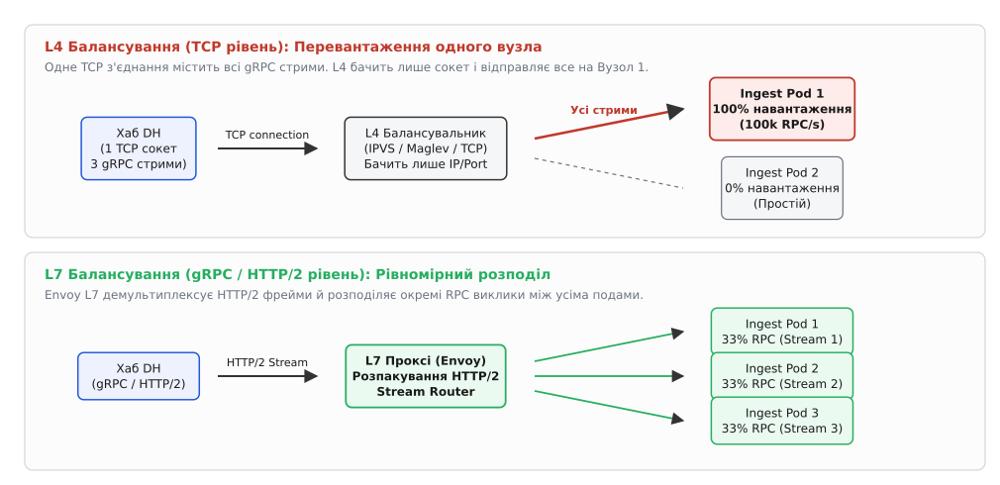
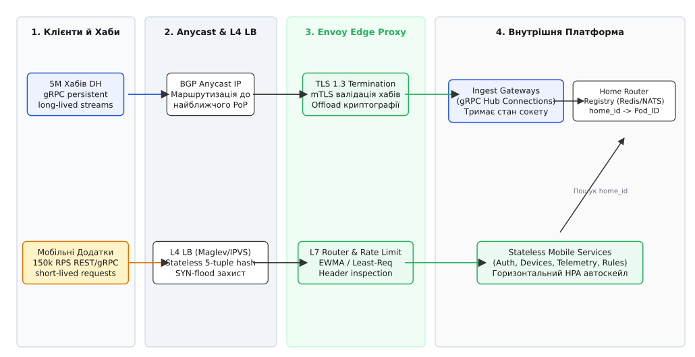
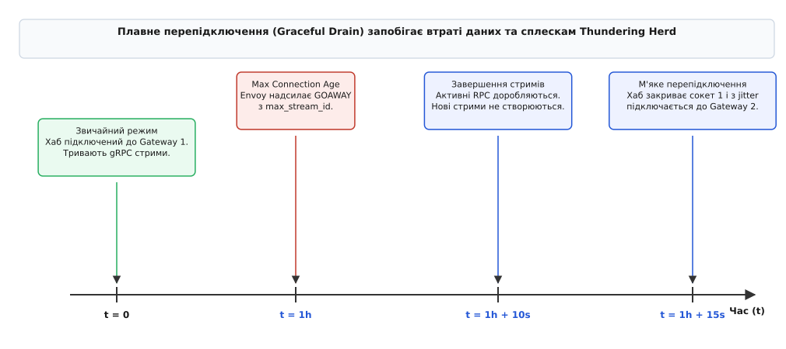

# Розподіл навантаження DH

<preknowlist>
- [Балансування L4 vs L7](root:sf-distributed/load-balancing) — розподіл на L4 (TCP/IP рівні) проти L7 (HTTP/gRPC), де балансувальник бачить заголовки й канали.
- [Зворотний проксі та термінація TLS](root:sf-web/reverse-proxy) — зняття шифрування на вході та проксування внутрішнього трафіку.
- [Anycast і глобальне балансування](root:com-transport/anycast) — один IP оголошується з багатьох точок світу через BGP, спрямовуючи пакет до найближчого входу.
</preknowlist>

Рівно о 18:00 у великому місті п'ять мільйонів родин повертаються додому. Домашні хаби Digital Homes масово надсилають події розблокування дверей, датчики руху генерують спалахи телеметрії, а господарі відкривають мобільні застосунки на підході до під'їзду, щоб увімкнути кондиціонер чи перевірити камери спостереження. 

У цифрах це означає одночасну наявність **5 мільйонів довгоживучих TCP-з'єднань** від домашніх хабів, якими через протокол gRPC тече фоновий потік у 100–170 тисяч повідомлень на секунду. На вечірньому піку цей потік стрибає до 500 тисяч повідомлень на секунду, до яких додаються 150 тисяч коротких HTTP/REST-запитів на секунду від мобільних додатків.

Перша спроба звичайного горизонтального масштабування під час такого піку закінчується інфраструктурною катастрофою. Інженери бачать перевантаження п'ятдесяти вузлів вхідного шлюзу (Ingest Gateway), процесори яких розігріті до 100%, і запускають додаткові двадцять нових вузлів. Проте навантаження на старих серверах не падає ані на один відсоток. Старі сервери продовжують падати від вичерпання пам'яті та таймаутів, а двадцять нових вузлів простоюють із нульовим CPU. 

Додавання нових машин не допомогло, бо традиційний L4-балансувальник навантаження бачить лише відкриті TCP-сокети й не може перерозподілити вже існуючі довгоживучі gRPC-стрими, які хаби тримають годинами. Цей крок — про те, як вибудувати багаторівневу архітектуру балансування L4/L7 трафіку для системи з двома кардинально різними профілями навантаження, не перетворюючи стан на краю на інфраструктурний хаос.

## Два профілі трафіку та чому L4 ламається на gRPC

Абстракція «мережевого запиту» в системі Digital Homes розпадається на два абсолютно протилежні за своєю природою профілі навантаження. Спроба обробляти їх за єдиною схемою — найкоротший шлях до каскадних відмов.

```
                  +-----------------------------------+
                  |   Вхідний трафік Digital Homes    |
                  +-----------------------------------+
                                    |
            +-----------------------+-----------------------+
            |                                               |
            v                                               v
+-----------------------+                       +-----------------------+
|  Профіль A: Мобільні  |                       |   Профіль B: Хаби     |
|  - Короткі REST/RPC   |                       |  - 5M gRPC стримів    |
|  - Повна stateless    |                       |  - Довгоживучі сокети |
|  - Легкий автоскейл   |                       |  - Стан підключення   |
+-----------------------+                       +-----------------------+
```

### Профіль А: Мобільний та веб-трафік (Stateless)
Мобільний додаток користувача працює за класичною моделлю «запит–відповідь». Користувач відкрив екран, застосунок відправив HTTP REST або коротке gRPC-повідомлення (наприклад, «надати список пристроїв» або «змінити цільову температуру»), отримав відповідь і закрив з'єднання або перевів сокет у режим очікування.

Цей потік є повністю **безплатформовим (stateless)**. Будь-який вузол мобільного API у дата-центрі може обробити будь-який запит від будь-якого користувача, оскільки дані авторизації лежать у JWT-тографі, а стан дому зчитується зі спільного кешу чи бази даних. Для цього профілю горизонтальний автоскейлінг (HPA) працює ідеально: додаємо нові поди, і балансувальник одразу рівномірно накидає на них нові HTTP-запити.

### Профіль Б: Потік хабів (Stateful IoT Ingest)
Домашній хаб — це не браузер. Він знаходиться за домашнім NAT та нестабільним Wi-Fi провайдера. Щоб хмара могла в будь-яку секунду передати на хаб команду (наприклад, «відчинити замок»), хаб відкриває і **постійно утримує ініційоване знизу вгору дуплексне gRPC-з'єднання** (засноване на HTTP/2).

Один такий TCP-сокет живе годинами або днями. Усередині нього через мультиплексування HTTP/2 протікають тисячі окремих RPC-викликів: телеметрія, серцебиття (keepalive pings), події з датчиків та командні стрими.

### Механіка зламу L4-балансування
Традиційні L4-балансувальники (IPVS, HAProxy в режимі TCP, апаратні модулі) працюють на транспортному рівні OSI. Вони приймають рішення про маршрутизацію в момент встановлення TCP-з'єднання (під час SYN-пакета), використовуючи 5-tuple заголовок (IP-адреса відправника, порт відправника, IP-адреса отримувача, порт отримувача, протокол).

Для HTTP/1.1 це працювало добре, бо запити породжували нові TCP-з'єднання. Але для HTTP/2 та gRPC це стає пасткою. 

```
L4 Балансування (TCP рівень):
[Хаб DH] ===(1 TCP сокет / 100k RPC/s)===> [L4 LB] ===(100% трафіку)===> [Ingest Pod 1] (ПЕРЕВАНТАЖЕНО)
                                                                 x=====> [Ingest Pod 2] (0% CPU, ПРОСТІЙ)

L7 Балансування (gRPC / HTTP/2 рівень):
[Хаб DH] ===(1 TCP сокет / HTTP/2 кадри)===> [Envoy L7] ---(Stream 1)---> [Ingest Pod 1] (33%)
                                                        ---(Stream 2)---> [Ingest Pod 2] (33%)
                                                        ---(Stream 3)---> [Ingest Pod 3] (33%)
```


*Порівняння L4 та L7 балансування для gRPC: L4 замикає весь трафік одного TCP-сокета на один вузол, тоді як L7 розпаковує HTTP/2 кадри й рівномірно розподіляє окремі RPC-стрими між подами.*

Якщо L4-балансувальник прив'язав TCP-сокет хаба до Вузла Ingest №1, то **абсолютно всі gRPC-стрими** всередині цього сокета підуть на Вузол №1. Якщо на Вузол №1 припало 100 000 активних хабів, він оброблятиме 100 000 RPC на секунду. Коли автоскейлер піднімає Вузол №2, L4-балансувальник не може передати йому частину існуючих TCP-сокетів без їхнього насильницького розриву. Новий вузол отримуватиме лише поодинокі нові підключення, поки старий вузол гине під вагою накопиченого стану.

Детальніше про те, як індустрія проходила цей болючий перехід під час появу gRPC, описано в історично-технічному екскурсі [`Історія gRPC та HTTP/2`](root:progarch/load-distribution-dh/hist-grpc-http2-lb.md).

## Глобальний вхід: Anycast, Maglev L4 та TLS termination

Щоб витримати мільйонні піки й захистити внутрішні сервіси від штормів підключень, архітектура входу Digital Homes побудована за принципом розшарованого захисту (Defense in Depth). Трафік проходить крізь три послідовні рубежі обробки.


*Багаторівнева архітектура входу Digital Homes: від BGP Anycast на краю через безсокетові L4-балансувальники Maglev до L7-проксі Envoy, які термінують TLS і спрямовують трафік на внутрішні сервіси й реєстр з'єднань.*

### 1. BGP Anycast: Географічний розподіл на входе
Усі хаби та мобільні додатки світу звертаються до єдиної публічної IP-адреси (наприклад, `198.51.100.1`). Ця адреса не належить конкретному серверу — вона оголошується через мережевий протокол BGP (Border Gateway Protocol) з десятків точок присутності (Points of Presence, PoP) у різних дата-центрах.

Маршрутизатори інтернет-провайдерів природно спрямовують пакети хаба до найближчого PoP за найменшою кількістю BGP-хопів. Це розв'язує три задачі:
- **Мінімізація латентності (RTT):** Первинний TLS Handshake відбувається у найближчому дата-центрі (наприклад, у франкфуртському PoP для європейських домів), що скорочує час встановлення зв'язку з 200 мс до 15 мс.
- **Локалізація аварій:** Якщо один дата-центр виходить із ладу, граничний роутер зупиняє оголошення Anycast-префікса, і мережа BGP за секунди перенаправляють трафік на сусідній PoP.
- **Поглинання DDoS-атак:** Атака розмазується по всьому світу й гаситься на краю, не доходячи до ядра системи.

### 2. L4 Stateless Balancing (Maglev / Katran): Захист від SYN-flood та розподіл пакетів
Усередині кожного PoP Anycast-трафік потрапляє на групу безсокетових L4-балансувальників (побудованих на базі Google Maglev або Meta Katran із технологією eBPF/XDP).

Головний принцип цього шару — **відсутність таблиці з'єднань (Stateless)**. L4-балансувальник не відкриває TCP-сокети й не зберігає стан підключень у пам'яті. Замість цього він обробляє сирі мережеві пакети прямо в драйвері мережевої карти за допомогою узгодженого хешування (Consistent Hashing) над 5-tuple заголовком пакета:

```
Hash = MurmurHash3(SrcIP, SrcPort, DstIP, DstPort, Protocol) mod M
```

Це дозволяє одному вузлу L4 обробляти понад 20 мільйонів пакетів на секунду, легко відбивати SYN-flood атаки та рівномірно розподіляти TCP-пакети між пулом L7-проксі Envoy.

### 3. L7 Envoy Proxy: TLS Termination та розпакування gRPC
На третьому рівні стоять шлюзи Envoy Proxy. Саме тут відбуваються найбільш ресурсомісткі операції:
- **Термінація TLS 1.3:** Envoy бере на себе асиметричну криптографію. Внутрішня мережа дата-центру звільняється від обчислювального тягаря TLS, або використовує полегшений mTLS між сервісами.
- **Аутентифікація mTLS:** Хаби подають криптографічні X.509 сертифікати, зашиті під час виробництва. Envoy перевіряє підпис CA і витягує унікальний `home_id` або `device_id` прямо з поля SAN (Subject Alternative Name) сертифіката.
- **HTTP/2 Stream Router:** Envoy розкодовує кадри HTTP/2, бачить окремі gRPC-виклики та балансує їх на внутрішні мікросервіси за допомогою алгоритму EWMA.

### Розрахунок ресурсоємності вхідного шару (Ingest Footprint Math)
Інженерний припуск на утримання 5 мільйонів довгоживучих підключень вимагає точного розрахунку RAM на вузлах L7 Envoy:

```
Пам'ять на 1 сокет = Buffer_rmem (16 KB) + Buffer_wmem (16 KB) + Envoy_Conn_Struct (8 KB) + TLS_Session (12 KB) = ~52 KB

5 000 000 сокетів × 52 KB = ~260 GB RAM (лише на мережеві сокети та TLS стан ядра)
```

При розподілі на пул із 25 вузлів Envoy кожен вузол утримує по 200 000 з'єднань і споживає близько 10.4 ГБ RAM суто під сокети. Це визначає нижню межу capacity planning для вхідного шару.

Детальний порівняльний аналіз пропускної здатності та накладних витрат кожного з трьох шарів наведено у вставці [`Клас балансувальників краю`](root:progarch/load-distribution-dh/comp-edge-lb-stack.md).

## gRPC Load Balancing: Envoy L7, xDS та ротація з'єднань через GOAWAY

Оскільки L4-балансувальник не здатний перерозподілити вже відкриті TCP-сокети, турбота про рівномірне навантаження під час автоскейлінгу лягає на механізм **плавної ротації з'єднань (Connection Draining)** за допомогою кадрів HTTP/2 `GOAWAY`.

### Принцип роботи HTTP/2 GOAWAY
Протокол HTTP/2 містить спеціальний службовий кадр — `GOAWAY`. Коли сервер або L7 Envoy Proxy хоче закрити TCP-з'єднання (наприклад, під час виведення вузла з експлуатації або після досягнення граничного віку з'єднання), він надсилає клієнту кадр `GOAWAY`, вказуючи в ньому `Last-Stream-ID` — ідентифікатор останнього успішно прийнятого RPC-стриму.

Отримавши `GOAWAY`, хаб діє за чітким алгоритмом:
1. **Припиняє створення нових RPC-стримів** у цьому TCP-сокеті.
2. **Продовжує виконувати вже відкриті RPC-стрими** до їхнього природного завершення (наприклад, дочитує відповідь на телеметрію).
3. Після завершення активних стримів хаб мовчки закриває старий TCP-сокет і **відкриває нове TLS/gRPC-з'єднання**.

Оскільки нове з'єднання ініціюється з нуля, воно проходить крізь L4/L7-балансувальники й природно потрапляє на новозбудовані порожні поди Ingest Gateway!


*Часова шкала плавної ротації з'єднань за допомогою HTTP/2 GOAWAY: від досягнення Max Connection Age через завершення активних стримів до м'якого перепідключення з джиттером на новий вузол.*

### Граничний вік з'єднання (MaxConnectionAge)
Щоб з'єднання не висіли вічно, в конфігурації Envoy та gRPC-серверів налаштовують параметр `MaxConnectionAge` (наприклад, 3600 секунд). Рівно через годину після відкриття сокета сервер надсилає `GOAWAY`.

> 🔧 **Навіщо це.** Без ротації через `MaxConnectionAge` ваша система стає «кришталевою»: вона добре працює у стаціонарному стані, але під час будь-якої спроби оновити код (Rolling Update) або розширити кластер під пікове навантаження 100% трафіку продовжує висіти на старих подах. Ротація з'єднань перетворює довгоживучі gRPC-сокети на еластичний потік, який плавно перетікає на нові ресурси.

Повний приклад реалізації налаштувань Keepalive, `MaxConnectionAge` та конфігурації Envoy Filter наведено у практичній вставці [`Практика gRPC load balancing`](root:progarch/load-distribution-dh/proj-dh-grpc-lb.md).

## Шардинг за home_id проти Sticky Sessions

У системі Digital Homes виникає фундаментальний архітектурний конфлікт між безплатформовим мобільним API та стантивним з'єднанням хаба.

Уявімо сценарій: користувач натискає у мобільному застосунку кнопку «Відчинити гараж для дому `home_9841`». Мобільний запит прилітає на безплатформовий вузол Mobile API. Але gRPC-сокет хаба `home_9841` фізично підключений до конкретного під-вузла `Ingest-Gateway-14` у дата-центрі. Як спрямувати команду з безплатформового API прямо на `Ingest-Gateway-14`?

```
                                  [Мобільний Додаток]
                                           |
                                  (Command: home_9841)
                                           |
                                           v
                              [Stateless Mobile API Pod]
                                           |
                    +----------------------+----------------------+
                    |                                             |
          (Варіант А: Router Lookup)                    (Варіант Б: Event Sharding)
                    |                                             |
                    v                                             v
        [Home Router Registry]                        [NATS JetStream Cluster]
        (home_9841 -> Pod_14)                        (Topic: home-events-part-3)
                    |                                             |
                    +----------------------+----------------------+
                                           |
                                           v
                                [Ingest Gateway Pod 14]
                                           |
                                (gRPC Persistent Stream)
                                           |
                                           v
                                    [Хаб home_9841]
```

### Чому Sticky Sessions — це згубна милиця
Перше спокусливе рішення, яке часто пропонують розробники, — увімкнути **липкі сесії (Sticky Sessions)** на балансувальнику за IP-адресою або HTTP-кукі.

У масштабних IoT-системах це антипатерн, який ламає архітектуру з кількох причин:
1. **Зміна IP-адрес клієнтами:** Мобільний телефон постійно перемикається між Wi-Fi, LTE та 5G. При кожній зміні IP-адреси «липкість» рветься, і запит потрапляє на інший вузол.
2. **Несумісність із проксі та NAT:** Тисячі домів одного провайдера можуть виходити в інтернет через один загальний CGNAT IP. Балансувальник за IP-адресою приклеїть усі ці тисячі домів до одного-єдиного сервера.
3. **Зруйнований автоскейлінг:** Липкі сесії перетворюють безплатформовий шар на стантивний, унеможливлюючи безболісне видалення або переміщення вузлів.

### Архітектурний паттерн: Home-ID Router & Connection Registry
Замість липкості на мережевому рівні Digital Homes застосовує розділення на рівні доменної маршрутизації (Domain-aware Routing).

1. **Реєстрація з'єднання (Connection Registry):** Коли хаб `home_9841` успішно проходить mTLS-аутентифікацію на вузлі `Ingest-Gateway-14`, цей вузол записує у розподілений реєстр оперативного стану (Redis Cluster або NATS KV) ключ:

```
conn:home_9841 -> {node: "ingest-gw-14", ts: 1718900000}
```

   Запис має короткий TTL (наприклад, 45 секунд) і постійно освіжається під час серверних серцебитів (pings).

2. **Маршрутизація команди за `home_id`:** Коли мобільний API приймає команду для `home_9841`, він витягує `x-home-id` з заголовка запиту і обирає один із двох варіантів доставки:

   - **Варіант А (Direct RPC Lookup):** Мобільний API опитує `Connection Registry`, дізнається адресата (`ingest-gw-14`) і відправляє точковий gRPC-виклик безпосередньо на цей вузол.
   - **Варіант Б (Event-driven Partitioning):** Мобільний API публікує подію `OpenGarageCommand` у шардований шинний топік (NATS JetStream або Kafka), де ключем шардування є `home_id`. Вузол `Ingest-Gateway-14` підписаний на свій шар партицій і локально вихоплює команду для підключеного хаба.

### Порівняльне зіставлення технологій Connection Registry

| Критерій порівняння | Redis Cluster (In-Memory Key-Value) | NATS JetStream KV Store | Consistent Hash Ring (Stateless Ring) |
| :--- | :--- | :--- | :--- |
| **Швидкість пошуку (Lookup Latency)** | Дуже низька (< 1 мс) | Дуже низька (< 1 мс) | Миттєва (0 мс, математичний розрахунок) |
| **Утримання стану (Statefulness)** | Зберігає ключ у пам'яті | Зберігає ключ у Raft-журналі | Stateless (не вимагає сховища) |
| **Реакція на ребалансування подів** | Автоматична оновленням TTL | Автоматична оновленням KV | Руйнівне (перемальовує кілець при масштабуванні) |
| **Складність експлуатації** | Середня (потребує Redis Cluster) | Низька (вбудовано у шину NATS) | Дуже низька (бібліотечний код) |

Для Digital Homes обрано **NATS JetStream KV**, оскільки NATS уже використовується як брокер повідомлень для подій телеметрії, що позбавляє від необхідності тримати окремий кластер Redis.

Цей підхід зберігає шар мобільного API абсолютно безплатформовим (stateless), а стан підключень хабів чітко ізолює в спеціалізованому шарі входу.

## Health-aware маршрутизація, Readiness probes та захист від Thundering Herd

Останній рубеж надійності балансування — це поведінка системи під час аварій, перезапусків та масових мережевих збоїв.

### Readiness Probes проти Liveness Probes
Поширеною помилкою є плутанина між готовністю (Readiness) та життєздатністю (Liveness) вузла балансування:
- **Liveness Probe (Чи живий процес):** Перевіряє, чи не зациклився процес. Якщо Liveness провалився, оркестратор (Kubernetes) вбиває контейнер (`SIGKILL`).
- **Readiness Probe (Чи готовий приймати трафік):** Перевіряє, чи має вузол вільну пам'ять, чи з'єднаний він із базою даних і чи не перебуває в стані виведення з експлуатації.

Під час оновлення коду (Rolling Update) вузол `Ingest Gateway` переключає свій Readiness Probe у стан `UNHEALTHY` за 15 секунд до зупинки. L7 Envoy негайно виключає цей вузол зі списку активних балансувальників і припиняє посилати на нього нові gRPC-стрими. Протягом наступних 15 секунд вузол спокійно доробляє існуючі запити й надсилає `GOAWAY`, після чого контейнер зупиняється без жодної втраченої транзакції.

### Захист від лавинних підключень (Thundering Herd & Jitter)
Коли у великому районі міста відновлюється електропостачання після блекауту, 50 000 домашніх хабів вмикаються одночасно. Якщо всі вони кинуться відкривати TLS-з'єднання в одну й ту ж мілісекунду, обчислювальний шторм асиметричної криптографії (TLS Handshake) вичерпає 100% CPU на Envoy-проксі, що призведе до таймаутів і каскадного падіння входу.

Для запобігання «гримучій отарі» (Thundering Herd) у прошивку хабів закладають алгоритм **експоненційного відступу з тремтінням (Exponential Backoff with Jitter)**:

```
T_wait = min(T_max, T_base · 2ᵃᵗᵗᵉᵐᵖᵗ) + random(0, Jitter)
```

де `T_base = 1` с, `T_max = 300` с, а `Jitter` додає випадковий зсув у межах ±30% від обчисленого значення. Завдяки цьому 50 000 хабів розмазують свої спроби підключення у часові смуги, даючи Envoy можливість спокійно обробити TLS Handshakes.

### Динамічний вибір вузла: EWMA замість Round-Robin
На звичайному Round-Robin балансувальник відправляє однакову кількість запитів на всі сервери. Проте якщо один із серверів пригальмовує (наприклад, через паузу збірника сміття GC або локальний перегрів CPU), Round-Robin продовжує бомбардувати його трафіком у тому ж обсязі, накопичуючи чергу очікування й збільшуючи хвостову латентність (p99).

L7 Envoy застосовує адаптивний алгоритм **EWMA (Exponentially Weighted Moving Average — експоненційно зважене ковзне середнє)** або **Peak EWMA**:

1. Envoy постійно вимірює RTT (час відповіді) та кількість активних запитів для кожного backend-вузла.
2. Нові значення RTT додаються до ковзного середнього з більшою вагою для останніх вимірів:

```
EWMA[t] = α·RTT_current + (1 - α)·EWMA[t-1]
```

3. Під час вибору вузла Envoy порівнює два випадкові сервери (алгоритм Power of Two Choices) і обирає той, у якого показник `EWMA · ActiveRequests` менший.

Якщо вузол уповільнюється хоча б на 50 мілісекунд, EWMA миттєво зменшує потік нових gRPC-стримів на цей вузол, даючи йому можливість вийти з пікового стану без розриву з'єднань.

## Евакуація дата-центру та аварійні сценарії (Multi-Region Evacuation)

У випадку катастрофічної відмови цілого регіонального дата-центру (наприклад, пожежа або масове знеструмлення PoP у Франкфурті) система балансування Digital Homes виконує чотирикрокову процедуру автоматичної евакуації трафіку:

1. **BGP Route Withdrawal:** Граничні Anycast-маршрутизатори франкфуртського PoP перестають оголошувати BGP-префікс `198.51.100.1`.
2. **Мережева перемаршрутизація:** Магістральні роутери провайдерів перенаправляють нові TCP-пакети від хабів до найближчого альтернативного PoP (наприклад, в Амстердамі).
3. **Обробка розриву сокетів хабами:** Існуючі 1 мільйон підключень у Франкфурті миттєво обриваються. Хаби сприймають це як звичайний мережевий збій та запускають алгоритм `Exponential Backoff with Jitter`.
4. **Розподілений прогрів (Warm-up):** Завдяки random jitter підключення європейських домів рівномірно наливаються в амстердамський PoP протягом 3–5 хвилин. Система автоскейлінгу в Амстердамі бачить зростання пам'яті й піднімає додаткові ноди Ingest без виникнення паніки чи розриву бізнес-транзакцій.

## Підсумок: Границі застосовності та архітектурний чек-лист

Розподіл навантаження у високоінтенсивних IoT-системах — це не пошук «найкращого балансувальника», а сувора дисципліна розділення відповідальності за шарами:

1. **Anycast L3** забезпечує географічний вхід та первинний захист від DDoS.
2. **Stateless L4 (Maglev)** балансує сирі TCP-пакети на швидкості мережевої карти без збереження стану сокетів.
3. **L7 Envoy Proxy** термінує TLS, перевіряє mTLS-сертифікати та балансує окремі gRPC-стрими всередині HTTP/2 за алгоритмом EWMA.
4. **Ротація через `GOAWAY`** робить довгоживучі gRPC-з'єднання еластичними для автоскейлінгу.
5. **Home-ID Router & Connection Registry** зберігають мобільне API безплатформовим, позбавляючи систему від крихких липких сесій.
