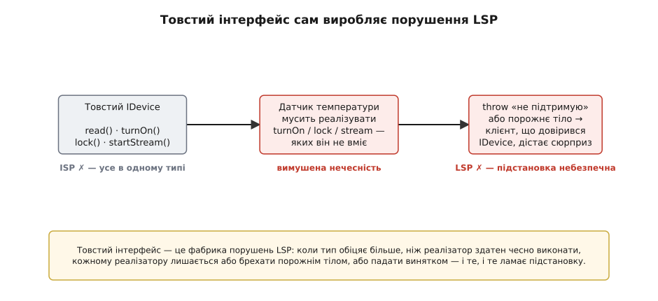
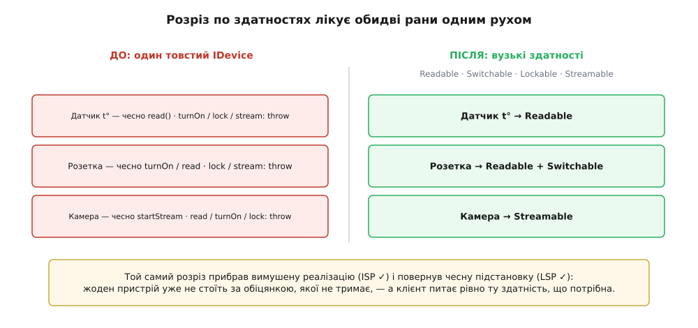

# LSP та ISP разом

<preknowlist>
- [Поліморфізм](topic:programming/polymorphism) — один виклик через спільний тип дає різну поведінку залежно від конкретного об'єкта за ним; саме тому «підставити підтип замість базового» взагалі має сенс.
- [Інтерфейс проти реалізації](topic:programming/interface-vs-implementation) — контракт (що обіцяно) окремо від того, як його виконано; клієнт бачить лише контракт.
</preknowlist>

Дві попередні літери SOLID ми брали поодинці: [SRP](topic:programming/single-responsibility) радив тримати в одній одиниці одну причину для зміни, [OCP](topic:programming/open-closed) — рости прибудовою за сталою абстракцією, не чіпаючи вже написаного. Наступні дві — **L** (принцип підстановки Лісков) та **I** (принцип розділення інтерфейсів) — теж звикли викладати нарізно, як два окремі пункти списку. Але це рідкісний випадок, коли дві літери — насправді одна думка, побачена з двох боків. І помітити їх разом простіше, ніж кожну окремо: одна показує, звідки береться біль, друга — як його прибрати.

Почнімо з болю. Digital Homes уже не той скрипт із першого вечора — платформа подорослішала, і тепер під хабом живе цілий зоопарк пристроїв: давачі температури, розумні розетки, дверні замки, камери. Щоб хаб міг ганяти їх усіх однією петлею, хтось завів спільний тип — `IDevice`, у який позносив геть усе, що вміє робити хоч якийсь пристрій:

:::tabs
```ts
interface IDevice {
  read(): number;          // прочитати вимір
  turnOn(): void;          // увімкнути
  turnOff(): void;         // вимкнути
  lock(): void;            // замкнути
  startStream(): string;   // почати відеопотік
}

class TempSensor implements IDevice {
  read(): number { return this.celsius; }           // це він уміє
  turnOn():  void { throw new Error("датчик не вмикається"); }
  turnOff(): void { throw new Error("датчик не вимикається"); }
  lock():    void { throw new Error("датчик не замикається"); }
  startStream(): string { throw new Error("у датчика немає камери"); }
}
```
```py
class IDevice(Protocol):
    def read(self) -> float: ...
    def turn_on(self) -> None: ...
    def turn_off(self) -> None: ...
    def lock(self) -> None: ...
    def start_stream(self) -> str: ...

class TempSensor:
    def read(self) -> float:            # це він уміє
        return self.celsius
    def turn_on(self):      raise NotImplementedError("датчик не вмикається")
    def turn_off(self):     raise NotImplementedError("датчик не вимикається")
    def lock(self):         raise NotImplementedError("датчик не замикається")
    def start_stream(self): raise NotImplementedError("у датчика немає камери")
```
:::

Придивися до `TempSensor`. Із п'яти методів, які вимагає `IDevice`, він чесно вміє **один** — `read`. Решту чотири він мусив написати, бо інакше код не компілюється: тип обіцяв п'ять методів, значить, усі п'ять мають бути. І що йому лишалося? Написати тіла, які кричать «не підтримую». Датчик температури не вмикається, не замикається й не знімає відео — але тип змусив його вдавати, що вміє.

Тепер хаб, який довіряє типу:

```ts
function nightMode(devices: IDevice[]): void {
  for (const d of devices) {
    d.turnOff();     // «повимикаймо все на ніч»
    d.lock();        // «і позамикаймо»
  }
}
```

Код чистий, компілятор мовчить, тести на розетках і замках зелені. А о третій ночі хаб проходить по списку, натрапляє на давач температури, кличе `d.turnOff()` — і падає з винятком просто посеред нічного режиму. Автор `nightMode` не винен: він писав під `IDevice`, а `IDevice` пообіцяв, що `turnOff` є в кожного. Збрехав не автор — збрехав тип.

## Одна рана, два імені

Те, що ти щойно побачив, — це **водночас** порушення двох принципів. І це не збіг, а той самий дефект, названий двома словами.

**Порушено принцип розділення інтерфейсів** (англ. *Interface Segregation Principle*, ISP; лат. *segregare* — відділити від отари, *grex*). Його формулювання коротке: **жоден код не повинен залежати від методів, яких він не використовує**. Роберт Мартін (Robert C. Martin) витягнув це правило не з теорії, а з болю живого проєкту — системи друку Xerox, де один розбухлий клас `Job` служив усім клієнтам одразу й розрісся так, що найдрібніша зміна тягла за собою годинний цикл перезбирання; [як фабрика Xerox породила ISP](root:progarch/lsp-isp-together/hist-isp-xerox.md) — окрема історія. А наш `TempSensor` залежить від `turnOn`, `lock`, `startStream` — мусить їх реалізувати, тягне їх у своєму типі, — хоч жоден із них йому не потрібен. Інтерфейс роздули так, що він накинув датчикові чотири зайві обіцянки.

**Порушено принцип підстановки Лісков** (англ. *Liskov Substitution Principle*, LSP). Барбара Лісков (Barbara Liskov) сформулювала його ще в доповіді 1987 року «Data Abstraction and Hierarchy» (надрукованій 1988-го): якщо `S` — підтип `T`, то всюди, де програма чекає на `T`, можна **непомітно** підставити `S`, і жодна її властивість не зламається. А `nightMode` чекав на `IDevice` — і підстановка `TempSensor` його зламала. Датчик виглядає як `IDevice`, компілюється як `IDevice`, але поводиться інакше: там, де очікували тиху дію, він кидає виняток. Це не підтип у сенсі Лісков — це самозванець зі знайомим обличчям. (Обидві літери мають і власні самодостатні статті — [LSP](topic:programming/liskov-substitution) та [ISP](topic:programming/interface-segregation); тут вони цікаві саме в парі.)

То чому це одна рана? Бо між двома порушеннями — прямий причинно-наслідковий ланцюжок, і ось він.

## Товстий інтерфейс — це фабрика порушень LSP

Простеж крок за кроком. Ти зібрав в одному типі методи, потрібні **різним** клієнтам: `read` — тому, хто знімає покази, `turnOn` — тому, хто керує живленням, `startStream` — тому, хто дивиться відео. Тепер **кожен** пристрій, який хоче бути `IDevice`, мусить реалізувати **всі** ці методи — навіть ті, до яких він жодного стосунку не має.

І тут у реалізатора рівно два виходи, обидва погані. Або він пише **порожнє тіло** — метод, що мовчки нічого не робить. Або він **кидає виняток** — чесно зізнається, що не вміє. Придивімося до кожного:

- Порожнє тіло тихо **порушує постумову**. Клієнт викликав `turnOff`, розраховуючи, що пристрій вимкнувся, — а той не зробив нічого й повернув «усе гаразд». Це найпідступніший різновид: нічого не падає, просто десь холодильник лишився ввімкненим, і ти три дні шукаєш чому.
- Виняток **посилює передумову**. Метод фактично каже: «не смій мене кликати на цьому об'єкті». Але ж клієнт тримає `IDevice`, а `IDevice` такої заборони не оголошував. Клієнт зробив рівно те, що дозволяв тип, — і дістав виняток.

Обидва виходи ламають те саме — **чесну підстановку**. І помітити тут головне: причина не в тому, що хтось погано написав `TempSensor`. Причина вище — у **роздутому інтерфейсі**. Товстий тип поставив реалізатора в безвихідь, де чесним бути неможливо. Порушення ISP (зайві методи в типі) з майже механічною неминучістю **виробляє** порушення LSP (реалізатор, що бреше або падає).



*Товстий інтерфейс не просто незручний — він примусово породжує нечесні реалізації, а отже, поламану підстановку.*

Ось звідки береться сила погляду «разом». LSP формулює **вимогу**: підтип має бути чесним замінником. ISP дає **інструмент** цю вимогу виконати: тримай інтерфейс досить вузьким, щоб його взагалі можна було чесно реалізувати. Одне без одного кульгає. Кажеш «підтипи мають бути чесні», але лишаєш товсті інтерфейси — і прирікаєш людей на нечесність. Ріжеш інтерфейси, але не питаєш про поведінку — і отримуєш купу вузьких типів, чиї реалізації все одно брешуть.

> 🔧 **Навіщо це.** Порушений LSP не ловиться компілятором і майже не ловиться тестами — бо тест спрацює лише там, куди хтось **здогадався** підсунути проблемний підтип. Реально він вибухає в проді, коли новий пристрій уперше потрапляє в стару петлю. Тобто ціна тут не «негарний код», а нічний виклик на пейджер і мовчазний холодильник. Товстий інтерфейс робить кожен новий клас застосунку потенційною міною сповільненої дії.

Форму LSP ми, до речі, вже бачили — це буквально [правила контракту](topic:programming/design-by-contract), про які йшлося, коли розбирали проєктування за контрактом: підтип **не має права посилювати передумову** (вимагати від клієнта більше), **не має права послаблювати постумову** (давати менше, ніж обіцяв базовий тип) і **мусить берегти інваріанти**. Датчик, що кидає виняток на `turnOff`, посилив передумову — і тим порушив контракт. [Формальний бік цих правил](topic:programming/liskov-substitution/math-contract-rules.md) (контраваріантність аргументів, коваріантність результатів) розписано окремо; а сам погляд на підтип як на носія поведінкового контракту — це [поведінкова підтипізація](topic:programming/behavioral-subtyping), яку Лісков згодом формалізувала з Жанет Вінг (Jeannette Wing) 1994 року.

## Той самий розріз лікує обидві рани

Якщо хвороба одна, то й ліки одні. Замість одного товстого `IDevice` розкраюємо його по **здатностях** (capabilities) — по тому, що пристрій справді вміє, — і робимо з кожної здатності окремий вузький інтерфейс:

:::tabs
```ts
interface Readable   { read(): number; }
interface Switchable { turnOn(): void; turnOff(): void; }
interface Lockable   { lock(): void; unlock(): void; }
interface Streamable { startStream(): string; }

class TempSensor  implements Readable { read() { return this.celsius; } }
class SmartSocket implements Readable, Switchable { /* покази + вмикання */ }
class DoorLock    implements Lockable { /* замикання */ }
class Camera      implements Streamable { /* відеопотік */ }
```
```py
@runtime_checkable
class Readable(Protocol):
    def read(self) -> float: ...

@runtime_checkable
class Switchable(Protocol):
    def turn_on(self) -> None: ...
    def turn_off(self) -> None: ...

class TempSensor:                # лише Readable
    def read(self) -> float: return self.celsius

class SmartSocket:               # Readable + Switchable
    def read(self) -> float: ...
    def turn_on(self): ...
    def turn_off(self): ...
```
:::

Подивися, що сталося з датчиком: тепер `TempSensor` — це `Readable`, і **все**. У ньому немає жодного методу, якого він не вміє. Порожні тіла зникли, викидати винятки нема з чого — бо тип більше не змушує обіцяти зайвого. Датчик став **чесним підтипом** `Readable`: усюди, де код чекає на щось, що вміє `read`, датчик підставляється без жодного сюрпризу. LSP відновлено — і відновлено не окремим зусиллям, а **тим самим розрізом**, яким ми задовольнили ISP.



*Один рух — розкрій по здатностях — прибирає і вимушену реалізацію (ISP), і нечесну підстановку (LSP).*

Змінюється й хаб. Раніше він тримав `IDevice` і сліпо кликав `turnOff` на будь-чому. Тепер він питає не «якого ти типу?», а «чи вмієш ти те, що мені треба?»:

```ts
function nightMode(devices: unknown[]): void {
  for (const d of devices) {
    if (isSwitchable(d)) d.turnOff();   // питаємо здатність
    if (isLockable(d))   d.lock();      // а не товстий тип
  }
}
```

Датчик просто не пройде перевірку `isSwitchable` — і петля спокійно його промине. Ніякого винятку о третій ночі: код звертається до пристрою лише через ту здатність, яку той справді має. Повний робочий рефакторинг — із перевірками здатностей, тестом на підстановку, що ловить давню пастку, і граблями, у які тут легко вступити, — зібрано в [проєкті «Здатності пристроїв DH»](root:progarch/lsp-isp-together/proj-device-capabilities.md).

## Чому вони стоять поряд зі SRP, OCP і DIP

Тепер видно, що ці дві літери не самотні — вони туго сплетені з трьома, що ми вже пройшли.

**ISP — це [SRP](topic:programming/single-responsibility), піднятий на рівень інтерфейсу.** SRP казав: одна одиниця — одна причина для зміни. Товстий `IDevice` тягли за поли **різні** клієнти: тому, хто знімає телеметрію, тому, хто керує живленням, тому, хто дивиться камери. Кожна група клієнтів — окрема причина, з якої інтерфейс міг би змінитися. Багато причин в одному типі — той самий запах, що й багато причин в одному класі. Розкроївши інтерфейс по здатностях, ти дав кожній групі клієнтів свою вузьку межу — точно як SRP дає кожній відповідальності свій клас.

**OCP спирається на обидві.** [OCP](topic:programming/open-closed) обіцяв: систему розширюють, додаючи нові реалізації за сталою абстракцією, не чіпаючи старого коду. Але ця обіцянка порожня, якщо абстракція нечесна. Додаси нову реалізацію, що ламає підстановку (порушення LSP) — і «стале» ядро почне поводитися по-новому, хоч ти його й не редагував. А якщо абстракція така товста, що нову реалізацію годі написати без брехні (порушення ISP), то точку розширення взагалі не використати. Виходить, LSP і ISP — це **умови, за яких OCP працює**, а не сусідні пункти списку.

**DIP каже, на що спиратися; ISP — якої воно має бути форми.** Принцип [інверсії залежностей](topic:programming/dependency-inversion) велить залежати від абстракцій, а не від конкретних класів. Але від **яких** абстракцій? Від вузьких, що належать клієнтові. `nightMode` залежить від `Switchable` — рівно тієї здатності, яка йому потрібна, — і йому байдуже, розетка це, реле чи майбутній розумний вимикач. Інтерфейс визначає **той, хто ним користується**, а не той, хто його реалізує; ISP підказує, де провести межі так, щоб ця залежність була тонкою.

> 🔧 **Навіщо це.** Вузькі інтерфейси окупаються щодня в тестах. Щоб перевірити `nightMode`, тобі досить підсунути крихітний дублер `Switchable` на два методи — а не ліпити підробний «пристрій» на дванадцять методів, з яких одинадцять зайві. Що вужчий інтерфейс, то дешевший дублер і то менше зчеплення тягнеться за кожним тестом. Розділення інтерфейсів — це не академічна охайність, це прямий важіль тестовності.

## Інструмент, а не догма

Легко зрозуміти обидва принципи навпаки — і завдати шкоди старанням.

«Розділяй інтерфейси» **не означає** «дроби кожен інтерфейс до одного методу». Якщо реальна група клієнтів завжди користується трьома методами разом — `turnOn`, `turnOff` і `isOn`, — розчахнути їх на три інтерфейси означало б розсіяти одну зв'язну здатність і змусити всіх збирати її назад. Ріж по **справжніх швах** — там, де окрема група клієнтів справді вживає свою окрему підмножину методів. Сигнал, що пора різати, конкретний і його видно оком: у реалізації з'явилося `throw «не підтримую»`, або порожнє тіло-вдавання, або клас реалізує інтерфейс і використовує з нього половину. Немає цього запаху — немає й потреби різати.

Так само LSP **не забороняє спадкування** й не каже «ніколи не роби підтипів». Він забороняє рівно одне — **оголошувати підтип, поведінку якого ти не можеш чесно витримати**. Класична пастка «квадрат — це прямокутник» ламається не тому, що спадкування зле, а тому, що квадрат не здатен дотримати обіцянок прямокутника. Питання завжди по суті поведінки, а не по формальній схожості імен.

Обидва принципи — це **лінзи, які наводять на конкретний біль**, а не закони, що їх треба «задовольнити» заради галочки. Ти дістаєш їх, коли бачиш роздутий тип чи нечесну підстановку, — і ховаєш, коли їх нема. Далі, коли розбиратимемо [композицію над спадкуванням](topic:programming/composition-inheritance), побачимо ще й те, що чимало цих напруг узагалі не виникає, якщо будувати поведінку складанням, а не деревом нащадків. Але це вже наступний крок.

А поки що звузьмо все до одного питання, яке ставлять **обидві** літери разом: **чи лишається ця абстракція чесною до кожного, хто на неї спирається?** ISP тримає інтерфейс досить вузьким, щоб його можна було чесно виконати. LSP перевіряє, що кожна реалізація його справді виконує. Одна дисципліна, два боки — і саме тому їх варто тримати в голові разом.
