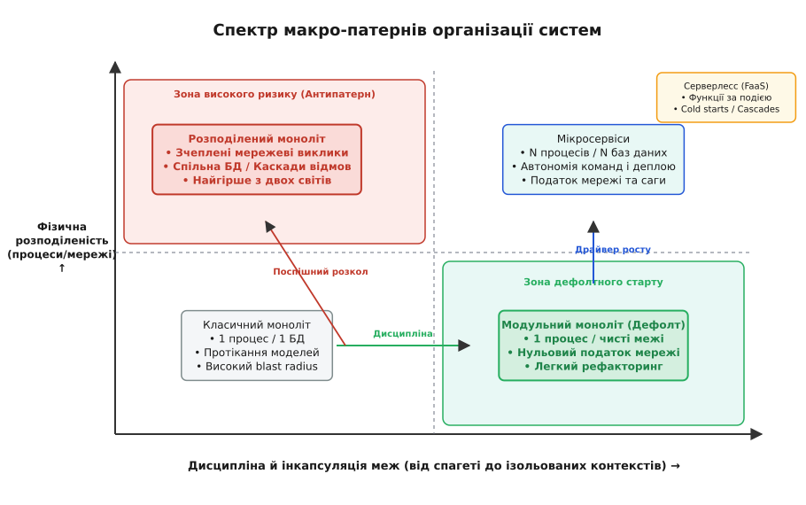
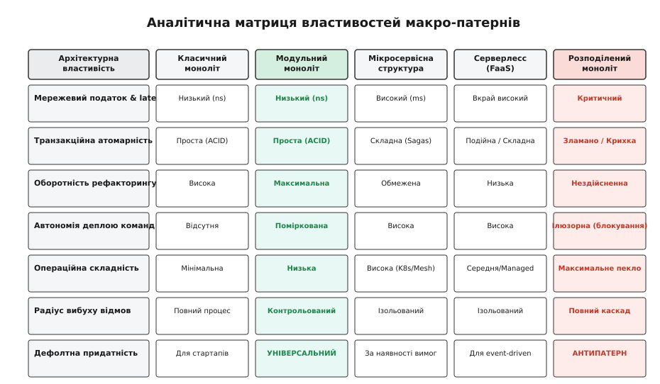
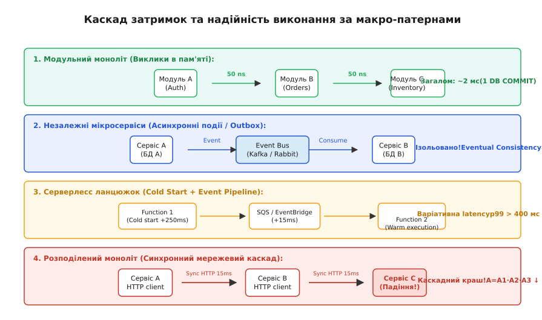

# Зведення макро-патернів організації систем

<preknowlist>
- [Модульний моноліт](topic:programming/modular-monolith) — дефолтна форма системи з жорсткими внутрішніми межами модулів без мережевого податку.
- [Мікросервіси](topic:programming/microservices) — розподіл системи на автономно деплоювані сервіси з власною базою даних та мережевою межею.
- [Закон Конвея](topic:programming/conways-law) — зв'язок між структурою команд та архітектурою програмної системи.
- [Податок на розподіленість](topic:programming/distributed-systems/fallacies-of-distributed-computing) — мережеві та операційні витрати, які виникають при протягуванні дроту між компонентами.
</preknowlist>

Коли затримка обробки транзакції зростає з 2 мілісекунд у спільному процесі до 80 мілісекунд через чотири синхронні мережеві стрибки між сервісами, а відсоток успішних відповідей p99 падає з 99.9% до 95.1% через множення ймовірностей часткових відмов, система платить не за бізнес-логіку, а за обрану форму фізичної організації. Макро-патерн системи — це спосіб розподілу обчислень, даних та меж сутності між процесовими просторами й мережевими вузлами. Неподалік від вибору макро-патерну лежить межа між економічно вигідною розробкою та операційним пеклом, у якому інфраструктурний податок з'їдає весь бюджет продуктової команди.

У цьому аналітичному підсумку ми зведемо в єдину систему п'ять фундаментальних макро-патернів — класичний моноліт, модульний моноліт, мікросервіси, серверлесс та розподілений моноліт — і проаналізуємо їх крізь призму п'яти інженерних осей: затримки, транзакційної атомарності, операційного тягаря, автономії команд та оборотності архітектурних рішень.

## 1. Анатомія та фізичні механізми п'яти макро-патернів

Архітектура програмного забезпечення оперує двома фундаментальними гранями розколу: **дисципліною інкапсуляції меж** (наскільки суворо код і дані ізольовані одне від одного) та **фізичною розподіленістю** (скільки окремих процесів розгортання та мережевих вузлів утворюють діючу систему). На перетині цих осей виникають п'ять домінантних макро-патернів.


*Спектр макро-патернів: від безструктурного класичного моноліта до модульного моноліта (дефолтна зелена зона), мікросервісів, серверлесу та червоної зони небезпеки розподіленого моноліта.*

### Класичний (сирий) моноліт

Класичний моноліт — це система, в якій весь кодовий масив розгортається як один бінарний файл або виконуваний процес, а всі дані живуть у єдиній реляційній структурі СУБД. Головна определяльна риса «сирого» моноліта — відсутність суворих інкапсульованих меж між доменними областями.

У такому середовищі будь-який модуль може звернутися до внутрішньої функції іншого модуля або виконати прямий SQL-запит у таблицю сусіднього контексту. 
- **Фізика виконання**: Виклики функцій відбуваються напряму через адресний простір операційної системи (`call` інструкція CPU), передаючи вказівники на об'єкти в оперативній пам'яті (RAM). Затримка виклику становить від 2 до 20 наносекунд. Процесорний кеш L1/L2/L3 працює максимально ефективно завдяки просторовій та часовій локальності даних.
- **Модель даних**: Єдина реляційна схема СУБД. Транзакція охоплює таблиці різних доменів атомарно в межах одного SQL `COMMIT`.
- **Недоліки**: Хвилеподібне протікання абстракцій; радіус вибуху (blast radius) будь-якого винятку або витоку пам'яті охоплює весь процес; неможливість асиметричного масштабування гарячих ділянок; важкий кумулятивний рефакторинг через високу зв'язаність (tight coupling).

### Модульний моноліт (Дефолтний макро-патерн)

Модульний моноліт зберігає єдиний процес розгортання та єдину СУБД, проте накладає суворі компіляційні та інкапсуляційні межі між доменними модулями. Кожен обмежений контекст (Bounded Context) розробляється як ізольований модуль із власною зачиненою схемою даних, власним фасадом API та приватними внутрішніми структурами.

Зв'язок між модулями здійснюється виключно через публічні інтерфейси мови програмування в пам'яті процесу, а прямі звернення до чужих таблицій бази даних заблоковані на рівні архітектурних тестів або приватних схем СУБД.
- **Фізика виконання**: Інкапсульований виклик у пам'яті через публічний фасад модуля. Код модуля приховує реалізацію за інтерфейсом (абстрактний клас або фасадний модуль). Обмін даними здійснюється через строгі DTO (Data Transfer Objects), що копіюються або передаються за незмінним посиланням (`std::string_view`, `std::span` у C++, іммутабельні об'єкти у TS/Java).
- **Модель даних**: Логічно розділені схеми у єдиній СУБД (наприклад, окремі PostgreSQL schemas `auth.*`, `orders.*`, `billing.*`). Прямі `JOIN` між таблицями різних схем заборонені на рівні архітектурного лінтера. Транзакція залишається атомарною, але проводиться через фасадний сервіс модуля.
- **Переваги**: Нульовий мережевий податок; збереження атомарних транзакцій у межах предикатів; висока швидкість локальних змін; максимальна оборотність рефакторингу (двобічні двері); відсутність операційного оверхеду на оркестрацію мережевих вузлів.

### Мікросервісна архітектура

Мікросервісний патерн здійснює повний розкол як на рівні обчислень, так і на рівні даних. Система розбивається на сукупність автономних сервісів, кожен з яких володіє власною базою даних (Database-per-Service), розгортається незалежно й спілкується з іншими виключно через мережеві протоколи (HTTP REST, gRPC, AMQP, Kafka).

Мікросервісна архітектура є перш за все **організаційним рішенням**, покликаним узгодити топологію коду з Законом Конвея для великих компаній.
- **Фізика виконання**: Кожен сервіс є ізольованим Linux-процесом у власному контейнері (Docker/cgroups/namespaces). Виклик сусіднього сервісу проходить повний системний стек: упакування DTO в JSON/Protobuf → виклик системного виклику `sys_sendto` → проходження через сокет та мережеву карту → транзит через Service Mesh (Envoy proxy) та мережеві комутатори → прийом через `sys_recvfrom` → десеріалізація. Затримка виклику становить від 2 до 15 мілісекунд (у 100 000 разів повільніше за моноліт).
- **Модель даних**: Фізично відокремлені бази даних. Прямий доступ стороннього сервісу до БД заборонений під загрозою архітектурного арбітражу. Зміни між сервісами синхронізуються асинхронно через витривалий журнал подій (Kafka / Transactional Outbox pattern).
- **Переваги**: Повна автономія деплою та релізних циклів окремих команд; можливість асиметричного технологічного стека й масштабування; локалізований радіус вибуху відмов.

### Серверлесс (Serverless / FaaS / Event-Driven Compute)

Серверлесс доводить дрібність обчислень до рівня окремих stateless-функцій (AWS Lambda, Google Cloud Run), які активуються зовнішніми подіями (HTTP-запит, подія в черзі SQS, завантаження файла в S3) та автоматично масштабуються до нуля при відсутності навантаження.

У серверлесс-парадигмі інфраструктурне управління повністю делегується хмарному провайдеру, а програміст оперує виключно графом обробників подій.
- **Фізика виконання**: Короткоживучий MicroVM контейнер (Firecracker у AWS), який піднімається за запитом. При відсутності трафіку середовище заморожується або знищується.
- **Недоліки**: Затримка холодного старту (Cold Start latency — від 200 до 1000 ms); небезпека затримок у ланцюгах викликів (Latency Cascades); складна спостережність і дебаг; висока вартість при постійному високоінтенсивному навантаженні; жорсткий vendor lock-in.

### Розподілений моноліт (Антипатерн)

Розподілений моноліт виникає тоді, коли систему порізали на мережеві сервіси, але не забезпечили автономності логіки та даних. Сервіси розгортаються у власних контейнерах, проте мають спільну базу даних, викликають один одного синхронно в лоб, вимагають каскадних одночасних релізів або залежать від спільного бінарного коду.

Це найгірший стан організації системи, в якому інженерна команда платить максимальну ціну за обома напрямками: всі витрати мережі, латентності та часткових відмов **плюс** усі обмеження жорсткої зв'язаності моноліта.

Детальний аналіз п'ятдесятирічної еволюції від мейнфреймів до мікросервісів та зворотного маятника консолідації Segment і Prime Video наведено в [📜 Еволюційний маятник макро-патернів](topic:guide/progarch/monolith-vs-microservices/macro-patterns-summary/hist-macro-patterns-evolution.md).

## 2. П'ять осей порівняльного аналізу та їхні фізичні прояви

Щоб вибір макро-патерну не перетворювався на суперечку смаків чи проходження за модою, оцінка проєкту проводиться за п'ятьма об'єктивними інженерними вимірами.


*Порівняльна матриця 5 макро-патернів за ключовими вимірами: латентність, атомарність транзакцій, оборотність рефакторингу, автономія деплою та операційна складність.*

### Вісь 1: Мережевий податок та затримка (Latency & Transport Overhead)

Кожна мережева межа, протягнута між двома компонентами, замінює виклик функції в пам'яті (коштує ~5–50 наносекунд) на сокетне з'єднання, серіалізацію структури даних у байти (JSON/Protobuf), мережевий RTT та зворотну десеріалізацію (коштує ~2–20 мілісекунд).


*Порівняння виконання запиту: наносекундні виклики у модульному моноліті проти асинхронних подій у мікросервісах, серверлесс-ланцюжків з cold start та небезпечного каскаду відмов у розподіленому моноліті.*

Для складних сценаріїв, де бізнес-операція торкається кількох доменів, різниця досягає трьох-чотирьох порядків:
- **Модульний моноліт**: Операція з 5 модулів виконується всередині одного процесу за одиниці мікросекунд із єдиним підсумковим зверненням до БД.
- **Мікросервіси (Синхронні)**: Послідовний ланцюг із 5 сервісів додає `5 × 8 ms = 40 ms` мережевої затримки, а квантиль p99 деградує за формулою `P_success = p^K`, що при `p = 0.99` дає `0.99⁵ = 95.1%`.
- **Серверлесс**: Додавання затримки холодного старту FaaS (200–500 ms) створює критичні сплески затримки на перших викликах.

### Вісь 2: Транзакційна межа та консистентність даних

Масштаб транзакційної межі прямо визначає складність бізнес-коду та гарантії узгодженості даних.

У моноліті збереження стану здійснюється в межах однієї ACID-транзакції: СУБД гарантує, що або всі зміни запишуться на диск, або жодна.

У мікросервісах та серверлесс-архітектурі, де кожен модуль має власну базу даних, транзакція `COMMIT` через мережу неможлива. Двофазний коміт (2PC) у розподілених системах є нежиттєздатним через проблему блокування ресурсів та нестійкість до мережевих розривів (FLP-теорема). Система змушена переходити на модель підсумкової консистентності (Eventual Consistency) та реалізовувати патерни **Saga (Orchestration/Choreography)** або **Transactional Outbox**. Це збільшує кількість коду обробки відмов у 3–5 разів і створює проміжні аномальні стани, помітні бізнесу.

### Вісь 3: Складність розгортання та операційний тягар (Microservice Premium)

Мартін Фаулер увів поняття **Microservice Premium** — постійні інфраструктурні та операційні надвитрати, які компанія сплачує за володіння розподіленою системою.

| Компонент інфраструктури | Модульний моноліт | Мікросервісна система |
| :--- | :--- | :--- |
| **Пайплайни CI/CD** | 1 збірка, 1 тестування, 1 деплой | N пайплайнів, версіонування artifacts |
| **Бази даних** | 1 СУБД (або Master/Replica) | N екземплярів БД, N міграцій |
| **Спостережність** | Простий логер, метрики процесу | Distributed Tracing (Jaeger), W3C Trace Context, Service Mesh |
| **Мережева безпека** | Приватні методи класів | TLS між сервісами, mTLS, OAuth2 tokens, Vault secret rotation |

Для малої команди з 3–5 інженерів операційний тягар мікросервісів здатний повністю заблокувати продуктовий потік, оскільки 70% часу витрачатиметься на обслуговування інфраструктури.

### Вісь 4: Автономія команд та Закон Конвея

Закон Конвея стверджує: *«Організації, які проєктують системи, обмежені тим, щоб створювати проєкти, які є копіями структур комунікації цих організацій»*.

- Коли над продуктом працює **одна-дві команди** (до 15–20 осіб), їхній комунікаційний граф щільний і природний. Модульний моноліт ідеально відповідає цій структурі: команди працюють у спільному репозиторії, а межі модулів узгоджуються на архітектурних рев'ю.
- Коли організація виростає до **сотен розробників** (10+ команд), єдиний кодовий масив створює точку тертя: коміти блокують один одного, релізи стають каскадними. У цій точці виділення мікросервісів купує **організаційну автономію**: кожна команда отримує власну коробку, власний репозиторій та власний релізний годинник.

### Вісь 5: Зворотно-допустимий рефакторинг та асиметрія дверей

Архітектурні рішення поділяються на двобічні (зворотні) та однобічні (незворотні) двері.

- **Межа всередині моноліта** — це двобічні двері. Якщо розробники помилилися з межею між модулями «Замовлення» та «Доставка», її перенесення коштує кількох годин рефакторингу в IDE: компілятор одразу підкаже зламані виклики, а зміна схеми робиться однією міграцією.
- **Мережева межа мікросервіса** — це однобічні двері. Щойно на REST/gRPC API вашого сервісу сперлися інші команди чи зовнішні клієнти, контракт стає **опублікованим**. Ви більше не можете вільно перейменувати поле або розбити сервіс навпіл без тривалого періоду деприкейшну, версіонування та паралельної підтримки старого API.

Математичне обґрунтування та формалізований аналіз затримок p99 і деградації доступності винесено в [🧮 Математична модель витрат та доступності](topic:guide/progarch/monolith-vs-microservices/macro-patterns-summary/math-macro-pattern-tradeoffs.md).

## 3. Механізми міжпроцесної взаємодії (IPC) та інженерія серіалізації

Різні макро-патерни задіють кардинально відмінні механізми обміну даними між доменними контекстами, які прямо визначають продуктивність, споживання пам'яті та навантаження на Garbage Collector (GC) або алокатор пам'яті:

1. **Direct Memory Call (Модульний моноліт)**:
   Передача адреси об'єкта в RAM через регістри CPU (`RDI`, `RSI` в x86-64). Затримка < 20 ns. Жодної серіалізації. Повна підтримка компілятором строгих типів даних та нульовий memory overhead.

2. **In-Memory Event Bus (Модульний моноліт)**:
   Асинхронна публікація події у внутрішній черзі процесу (наприклад, `std::vector<std::function>` або Rx-потік). Використовується для слабкого зчеплення модулів в одному деплої без виходу в мережу. Затримка < 1 microsecond.

3. **Synchronous HTTP/REST (Мікросервіси / Розподілений моноліт)**:
   Транспорт HTTP/1.1 або HTTP/2 із текстом у форматі JSON. Використовує socket buffers (`SO_RCVBUF`, `SO_SNDBUF`), викликає перемикання контексту ядра (context switch через `tcp_sendmsg` / `skb_copy_datagram_iter`). Вимагає динамічного виділення пам'яті під парсинг текстового JSON-дерева, створюючи високий тиск на Garbage Collector. Затримка 5–20 ms. Фізичне проходження пакунка через сокет операційної системи вимагає копіювання даних із буфера користувача (user space) в буфер ядра (kernel space socket buffer `sk_buff`), а відтак у кільцевий буфер мережевої карти (TX ring buffer). Сучасні технології eBPF (наприклад, eBPF socket redirection у Cilium) дозволяють скоротити шлях між сокетами контейнерів на одному ноді, оминаючи повний мережевий стек ядра, проте мережевий податок серіалізації залишається незмінним.

4. **Synchronous gRPC / Protobuf (Зрілі мікросервіси)**:
   Транспорт HTTP/2 з мультиплексуванням та бінарною серіалізацією Google Protocol Buffers. Забезпечує сувору контрактну типізацію через `.proto` файли та в 3–5 разів менший розмір пакунків порівняно з JSON. Бінарний парсинг працює без текстових алокацій. Затримка 2–8 ms.

5. **Asynchronous Log Streaming (Event-Driven Microservices / Kafka)**:
   Асинхронний запис подій у розподілений журнал (Append-only Event Log). Сервіс-видавець пише в Kafka-топік і негайно повертає відповідь. Сервіси-споживачі читають потік із власними offset. Використовує zero-copy передачу файлів на дискові сторінки через системний виклик `sendfile()`. Повне усунення мережевого запечення та захист від сплесків трафіку (Backpressure resilience).

## 4. Патерни міграції та ліквідації Розподіленого Моноліта

Якщо система вже опинилася у стані розподіленого моноліта або вимагає еволюційного розколу, застосовують три стандартизовані патерни рефакторингу:

### 1. Strangler Fig Pattern (Патерн «Душитель»)
Описаний Мартином Фаулером за аналогією з тропічною рослиною, що поступово оплітає дерево-господаря. Нові функції будуються в нових модулях/сервісах поруч зі старим монолітом, а API Gateway поступово перенаправляє частки трафіку зі старого коду на новий, доки моноліт не випорожниться природним шляхом.

### 2. Anti-Corruption Layer (ACL / Антикорупційний шар)
Коли новий модуль змушений спілкуватися зі старим розподіленим монолітом із брудною моделлю даних, між ними ставиться фасад-перекладач (ACL). Він конвертує брудні внутрішні структури старого коду в чисті доменні моделі нового контексту, запобігаючи «отруєнню» нового коду.

### 3. Change Data Capture (CDC / Захоплення змін даних)
Замість прямих SQL-запитів між сервісами або синхронних HTTP-викликів, інструменти класу Debezium вичитають транзакційний лог СУБД (PostgreSQL WAL або MySQL binlog) і транслюють зміни таблиць у Kafka-топіки. Це дозволяє винести дані для аналітики чи чужих контекстів асинхронно, не модифікуючи код старого моноліта.

## 5. Спостережність (Observability) та розслідування аномалій

Макро-патерн прямо визначає складність інфраструктури моніторингу та діагностики помилок:

### Спостережність у Модульному Моноліті
- **Структуровані логи**: Всі модулі пишуть у єдиний потік логів (stdout) із позначкою модуля (`[Auth]`, `[Orders]`). Пошук помилки за `correlation_id` здійснюється за один запит у Kibana/Loki.
- **Метрики**: Один екземпляр Prometheus exporter віддає метрики процесу (CPU, RAM, GC pauses, SQL pool locks).
- **Профілювання**: Профільне знаходження гарячих шляхів (Flamegraphs через `perf` або pprof) показує точний стек викликів функцій між усіма модулями в єдиному дереві.

### Спостережність у Мікросервісах та Серверлесі
- **Розподілене трасування (Distributed Tracing)**: Кожен вхідний запит на API Gateway отримує унікальний заголовок `traceparent` (за стандартом W3C Trace Context, наприклад `00-4bf92f3577b34da6a3ce929d0e0e4736-00f067aa0ba902b7-01`). Цей заголовок змушені вручну або через авто-інструментацію прокидати всі N сервісів у кожному HTTP/gRPC виклику.
- **Оверхед спостережності**: Обсяг телеметрії (траси, спани, метрики) у мікросервісах може перевищувати обсяг бізнес-даних. Зберігання та аналіз трас у Jaeger/Zipkin створюють додаткову інфраструктурну статтю витрат.

## 6. Крайові випадки, операційні пастки та Вплив на Тестованість

При впровадженні макро-патернів розробники часом припускаються чотирьох класичних помилок та стикаються з розривом у стратегії тестування:

1. **Плутанина між спільним екземпляром СУБД та спільною схемою даних**:
   Розміщення п'яти різних баз даних (`auth_db`, `orders_db`, `billing_db`) на одній фізичній машині PostgreSQL не є розподіленим монолітом, якщо між ними відсутні прямі SQL `JOIN` та спільні таблиці. Це припустимий крок економії інфраструктури на ранніх етапах. Натомість наявність двох сервісів, які читають одну й ту саму таблицю `users` у спільній схемі `public`, негайно створює розподілений моноліт — незалежно від того, розгорнуті вони на одному сервері чи в різних датацентрах.

2. **Незрілий виніс асинхронного контексту з залишками синхронних запитів**:
   Часто контекст виносять у подійний сервіс через Kafka, але забувають надати йому власну копію необхідних даних. У результаті на кожну отриману подію сервіс робить зворотний синхронний HTTP REST-запит у ядро моноліта: «Отримав подійний ID пристрою — а підтягни мені його назву та власника». Це відновлює зв'язаність розподіленого моноліта на гарячому шляху обробки подій.

3. **Пастка монорепозиторію проти мультирепозиторію**:
   Вибір способу збереження коду (Monorepo vs Multirepo) є ортогональним до вибору макро-патерну. Модульний моноліт природно живе в монорепозиторії, проте мікросервісна система також може розроблятися в єдиному монорепозиторії (модель Google та Meta) для спрощення атомного версіонування спільних DTO та прото-контрактів. Плутати монорепозиторій із монолітом — поширена концептуальна помилка.

4. **Проблема некерованого каскадного скасування (Distributed Cancellation)**:
   При синхронних HTTP/gRPC викликах у мікросервісах клієнт може скасувати запит через таймаут. Якщо верхній сервіс не транслює сигнал скасування (Context Cancellation / HTTP2 `RST_STREAM`) до нижніх сервісів, вони продовжують виконувати важку роботу та навантажувати свої бази даних у порожнечу. Це явище називається висячими обчисленнями (Orphaned Compute) і швидко призводить до відмови всієї розподіленої системи.

5. **Вплив на стратегію тестування (Testability Pyramid)**:
   У модульному моноліті повний сквозний integration-тест бізнес-сценарію виконується в пам'яті за сотні мілісекунд за допомогою бази в пам'яті (H2 / SQLite) чи локального PostgreSQL у контейнері. У мікросервісах сквозний тест вимагає підняття N сервісів та Kafka у Docker-compose або Testcontainers, а тести стають "крихкими" (flaky) через мережеві затримки. Мікросервіси змушують відмовлятися від e2e-тестів на користь контрактного тестування (Consumer-Driven Contract Testing / Pact).

## 7. Наскрізний вимір на матеріалі Digital Homes (DH)

Проілюструємо застосування макро-патернів на прикладі платформи розумного дому **Digital Homes (DH)**, яка містить 9 обмежених контекстів: Хаб (Hub), Керування (Control), Твін (Twin), Автоматизації (Automation), Телеметрія (Telemetry), Відео (Video), Сповіщення (Notifications), Ідентичність (Identity), Білінг (Billing).

### Порівняльний роззрахунок операційного шляху для запиту «Отримати стан дому»

Розглянемо найчастіший запит користувача в мобільному застосунку: відкриття головного екрана, що вимагає читання ідентичності користувача, стану пристроїв з Твіна та статусів активних правил Автоматизації.

```
Сценарій 1: Модульний моноліт DH (1 деплой, 9 модулів усередині)
  • Операційна поверхня:   1 CI/CD пайплайн · 1 кластер PostgreSQL · 1 дашборд Grafana
  • Запит стан дому:       Identity.verify() → Twin.getState() → Automation.getStatus()
  • Механізм виклику:      3 послідовні виклики методів у пам'яті (RAM)
  • Мережева затримка:     0 мс між модулями (1 SQL-запит у СУБД ≈ 1.8 мс)
  • Нових режимів відмови: 0 (відсутні таймаути та повтори між модулями)

Сценарій 2: Наївні мікросервіси DH (9 окремих сервісів по контекстах)
  • Операційна поверхня:   9 CI/CD пайплайнів · 9 екземплярів СУБД · 9 сервіс-меш sidecars
  • Запит стан дому:       API Gateway → Auth-Service → Twin-Service → Automation-Service
  • Механізм виклику:      3 послідовні синхронні HTTP/gRPC виклики по мережі
  • Мережева затримка:     3 × 8 мс (gRPC + mTLS) + 3 × 1.5 мс (БД) = 28.5 мс (у 15 разів повільніше)
  • Нових режимів відмови: 3 (таймаути, повтори, Circuit Breaker на кожному стрибку)
```

Наївний розкол DH на 9 сервісів на першому етапі розробки роздуває операційну поверхню вдев'ятеро й додає 27 мілісекунд затримки на гарячому шляху читання, не купуючи жодного асиметричного масштабування.

### Виділення виправданих сервісів у DH через виміряні драйвери

Застосувавши дефолт «Модульний моноліт», платформа DH залишає 7 контекстів усередині єдиного процесу. Проте два контексти демонструють виміряний інженерний драйвер для винесення:

1. **Телеметрія (Telemetry)**: Потік запису сенсорних даних (температура, вологість, енергоспоживання) від 40 000 пристроїв створює асиметричне навантаження на запис (10 000 RPS). Телеметрія вимагає часової бази даних (TimescaleDB / ClickHouse) та терпить секундну затримку доставки. Вона виноситься в окремий подійний сервіс через Kafka.
2. **Відео (Video)**: Передача HLS/WebRTC відеопотоків вимагає високої мережевої смуги (Bandwidth) та використання GPU для транскодування. Залишати відео всередині моноліта загрожувало б вичерпанням оперативної пам'яті для бізнес-модулів. Відео виноситься в окремий медіа-сервіс.

Решта 7 контекстів (Ідентичність, Твін, Керування, Автоматизація, Білінг, Сповіщення, Хаб-сервер) залишаються модулями всередині модульного моноліта DH.

## 8. Еволюційний маршрут та ворота прийняття рішень

Правильний вибір макро-патерну — це не одноразовий вибір «назавжди», а **еволюційний маршрут системи**, в якому розподіленість додається свідомо й локально за наявності чіткого драйвера.

```
                  ┌──────────────────────────────────────────┐
                  │    Новий проєкт / Нова система           │
                  └────────────────────┬─────────────────────┘
                                       │
                                       ▼
                  ┌──────────────────────────────────────────┐
                  │      СТАРТ: Модульний моноліт            │
                  │   (1 процес, чисті межі контекстів)      │
                  └────────────────────┬─────────────────────┘
                                       │
                      Чи з'явився виміряний драйвер?
                                       │
        ┌──────────────────────────────┼──────────────────────────────┐
        │ Ні                           │ Так (Scale / Conway)         │
        ▼                              ▼                              ▼
┌───────────────┐            ┌───────────────────┐          ┌───────────────────┐
│ Залишити в    │            │ Асиметричний      │          │ Автономія команд  │
│ Моноліті      │            │ профіль масштабу  │          │ (Команд > 4,      │
│ (Записати     │            │ (напр. Телеметрія)│          │  контекст дозрів) │
│ фітнес-тест)  │            └─────────┬─────────┘          └─────────┬─────────┘
                                       │                              │
                                       ▼                              ▼
                             ┌───────────────────┐          ┌───────────────────┐
                             │ Виділити окремий  │          │ Виділити контекст │
                             │ Event-Driven      │          │ у автономний      │
                             │ Сервіс / FaaS     │          │ Мікросервіс       │
                             └───────────────────┘          └───────────────────┘
```

### Формат документально зафіксованого рішення (Architecture Decision Record — ADR)

Кожна зміна макро-патерну повинна бути зафіксована у формі формального ADR-документа:

```markdown
# ADR-014: Винесення контексту Телеметрії в окремий Event-Driven сервіс

## Статус: Прийнято

## Контекст
Платформа Digital Homes досягла позначки в 40 000 активних хабів. Потік записів телеметрії 
перевищив 10 000 подій на секунду, створивши навантаження на диск СУБД модульного моноліта.

## Інженерний драйвер
- Асиметричне навантаження на запис (10 000 RPS телеметрії проти 50 RPS бізнес-транзакцій).
- Потреба у спеціалізованій СУБД для часових рядів (ClickHouse).

## Прийняте рішення
Винести модуль Телеметрії з єдиного процесу в окремий подійний сервіс. Передачу даних 
між монолітом та сервісом телеметрії реалізувати асинхронно через Kafka.

## Наслідки
- Переваги: Навантаження телеметрії знято з PostgreSQL; швидкість читання станів зросла.
- Недоліки: З'явився операційний оверхед на обслуговування Kafka-кластера та Debezium CDC.
```

Для автоматичної оцінки метрик проєкту та запобігання непомітному виникненню розподіленого моноліта розроблено аналітичний інструментарій, винесений у [⚙️ Практичний оцінювач та фітнес-функції макро-патернів](topic:guide/progarch/monolith-vs-microservices/macro-patterns-summary/proj-macro-pattern-evaluator.md).

## 9. Зведення в систему та інженерний регламент

Завершуючи аналітичний огляд макро-патернів, зафіксуємо чотири фундаментальні правила архітектурної дисципліни:

1. **Модульний моноліт — це дефолт, а не тимчасовий компроміс.** Починайте будь-яку нову систему як один деплоймент-вузол із жорстко зафіксованими інкапсульованими межами модулів.
2. **Тягар доказу лежить на розподіленості.** Виділення мікросервісу чи FaaS-функції вимагає назвати й виміряти конкретний драйвер (масштаб, залізо, команда). Немає виміряного драйвера — дріт не протягується.
3. **Остерігайтеся розподіленого моноліта.** Спільна база даних поверх мережевих меж, синхронні розгалужені виклики та спільний бінарний код — це антипатерн, який бере найгірше від двох світів.
4. **ТРИМАЙТЕ МЕЖІ ГНУЧКИМИ, ДОКИ ВОНИ В МОНОЛІТІ.** Використовуйте двобічні двері моноліта для намацування справжніх меж домену, перш ніж закарбувати їх однобічними дверима мережевого API. Контроль дотримання інкапсуляції в коді реалізується автоматизованою фітнес-функцією в CI, яка завалює збірку при виявленні циклічних залежностей або прямих викликів приватних класів сусідніх модулів повз публічний фасад. Оновлення конфігурації меж виконується виключно через процедуру вимірювання навантаження та колегіальне схвалення інженерного арбітражу, зафіксоване у відповідному ADR. Регулярний аналіз графа залежностей та метрологія міжмодульних викликів запобігають ерозії інкапсуляції під тиском щоденних продуктових релізів. Системний підхід до вибору макро-патерну забезпечує довгострокову стійкість кодової бази та оптимальне використання інженерних ресурсів компанії.

Ця дисципліна перетворює вибір макро-патерну з імпульсивної моди на прозорий інженерний розрахунок, у якому система росте й розколюється природно — рівно тоді й рівно там, де мережевий податок купує реальну цінність для бізнесу та безпеку майбутнього розвитку.
