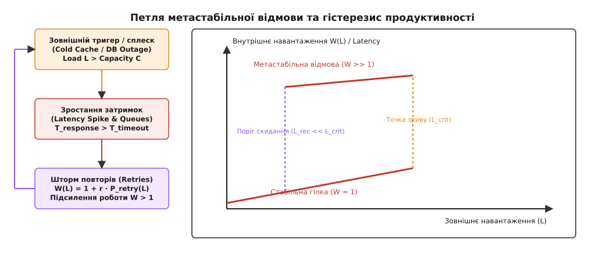
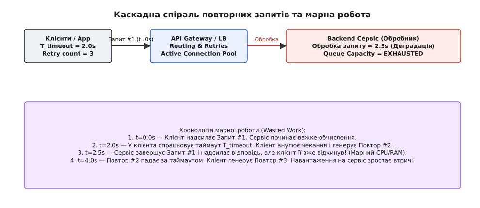
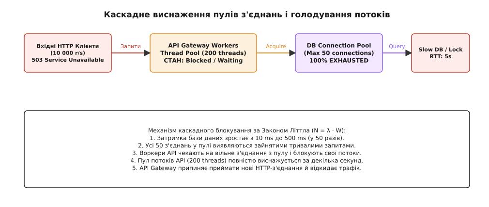
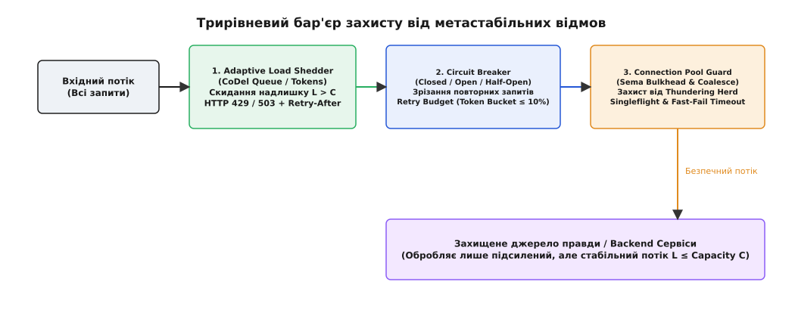

# Розбори масштабу: метастабільні пастки у масштабованих системах

<preknowlist>
- [Багатоярусна кеш-ієрархія](root:progarch/dh-cache-hierarchy) — каскадне кешування, кеш-шторм (Cache Stampede) та інвалідація.
- [Розподіл навантаження й балансування](root:progarch/load-distribution-dh) — L4/L7 балансування, gRPC, термінація TLS та Health Checks.
- [Тактики доступності й стійкості](root:sf-apps/availability-tactics) — повторні спроби (retries), автомативне розмикання (Circuit Breaker) та ізоляція (Bulkheading).
</preknowlist>

Коли IoT-платформа Digital Homes розростається до 500 000 активних розумних будинків і 10 мільйонів підключених пристроїв, що генерують понад 100 000 запитів на секунду, інженери з доступності опиняються віч-на-віч із найпідступнішою фазовою патологією розподілених систем. Під час планового переключення первинного вузла бази даних PostgreSQL або короткочасного вимикання централізованого кешу Redis вхідний потік запитів від мобільних застосунків та настінних панелей зупиняється всього на 3 секунди. Проте після того, як база даних завершує процедуру Failover і повністю відновлює свою роботу, сервіс не повертається до нормального життя. Кластер API Gateway продовжує віддавати 100% помилок HTTP 503, навантаження на CPU усіх воркерів тримається на позначці 100%, пули з'єднань миттєво виснажуються, а перезапуск контейнерів лише поглиблює колапс. Зовнішній тригер відмови вже давно зник, але система застрягла у самопідтримуваному стані повної відсутності продуктивності — **метастабільній відмові (Metastable Failure)**.


*Формування позитивного зворотного зв'язку між зростанням затримок і повторними спробами переводить систему на верхню гілку метастабільної відмови, вихід з якої вимагає глибокого скидання трафіку до порогу L_rec.*

> 🔧 **Навіщо це.** Масштабування розподілених систем — це не просто лінійне додавання серверів у відповідність до зростання користувачів. При досягненні високої щільності запитів у системі виникають нелінійні зв'язкі, де помилка одного компонента спричиняє хвилю підсилення навантаження (Work Amplification). Розуміння природи метастабільних пасток дозволяє архітектору спроєктувати бар'єри стійкості, які розривають замкнені петлі зворотного зв'язку до того, як вони приведуть до каскадного колапсу усієї платформи.

## Анатомія метастабільного збою: тригер проти підсилення

Діагностика метастабільного стану вимагає чіткого розмежування двох сутностей, які плутають недосвідчені інженери: первинного зовнішнього тригера та внутрішнього механізму підсилення навантаження.

Детально [історію дослідження метастабільних відмов у розподілених системах](root:progarch/metastable-and-scale-cases/hist-metastable-failures.md) висвітлено в окремому історичному огляді. Практичний досвід аварій в інфраструктурах Amazon, Google та Cloudflare показав, що тригер майже завжди є короткочасною і неминучою подією. Тригером може стати:
- Коротке мережеве коливання (Network Flap) між дата-центрами тривалістю 500 мілісекунд.
- Сплеск трафіку (Traffic Spike), викликаний маркетинговою розсилкою або погодним анабіозом.
- Вимивання гарячих ключів з кешу Redis під час планового рестарту вузла.
- Тимчасова пауза на збір сміття (GC Pause) у процесі з високим споживанням оперативної пам'яті.

Сам по собі тригер викликає лише тимчасовий стрибок затримки. Проблема починається тоді, коли цей стрибок вмикає у системі **петлю позитивного зворотного зв'язку (Positive Feedback Loop)**.

Розглянемо механізм створення цієї петлі. Коли затримка обробки запиту `T_response` перевищує клієнтський таймаут `T_timeout`, клієнтський застосунок вважає запит втраченим і генерує повторну спробу (Retry). З цього моменту навантаження на систему більше не дорівнює вхідному потоку `L`: воно підсилюється на коефіцієнт повторів `W(L) = L · (1 + r)`. Зростання навантаження `W(L)` призводить до ще більшого подовження черг обробників, що знову збільшує затримку `T_response`.

Детально [математичну модель підсилення навантаження та гістерезису](root:progarch/metastable-and-scale-cases/math-metastable-amplification.md) з виведенням точок біфуркації виведено у відповідному математичному розборі. Ключовий висновок моделі полягає в тому, що залежність внутрішньої роботи від зовнішнього трафіку утворює криву гістерезису з двома стабільними станами:

1. **Стабільна гілка (Lower Stable Branch):** Внутрішнє навантаження близьке до вхідного (`W(L) ≈ L`), затримки низькі, повторні спроби відсутні. Система легко компенсує малі коливання.
2. **Метастабільна гілка відмови (Upper Metastable Branch):** Внутрішнє навантаження багаторазово перевищує вхідне (`W(L) >> L`), затримки перевищують таймаути, 100% запитів зазнають відмови, а сукупний Hit-Rate джерела правди прямує до нуля.

Коли зовнішній тригер зсуває систему праворуч за точку зриву `L_crit`, вона перестрибує на метастабільну гілку. І головна пастка полягає в тому, що після зникання тригера система **не повертається назад** самостійно! Вона залишається на верхній гілці навіть тоді, коли вхідний трафік падає до звичайного рівня. Для відновлення роботи вхідний потік необхідно штучно зрізати нижче критичного порогу відновлення `L_rec`, який часто становить лише 10–20% від номінальної спроможності кластера.

## Пастка 1: Повторні збої після відновлення та спіраль марної роботи

Найпоширенішою метастабільною пасткою у мікросервісній архітектурі Digital Homes є **спіраль марної роботи (Wasted Work Spiral)**, яка виникає внаслідок неузгоджених клієнтських повторів.

Уяви послідовність подій під час деградації API-сервісу керування пристроями:


*Клієнт анулює чекання за таймаутом і робить повторний запит, змушуючи backend виконувати важке обчислення для вже відкинутого виклику.*

Коли backend-сервіс зазнає уповільнення через контенцію бази даних, час обробки запиту `GET /homes/{id}/state` зростає з 50 мілісекунд до 2.5 секунд. 

Проте мобільний застосунок має жорстко зафіксований таймаут `T_timeout = 2.0` секунди. Події розгортаються наступним чином:

1. У момент `t = 0.0s` мобільний застосунок надсилає Запит #1. Воркер API Gateway приймає запит і починає важку процедуру зчитування стану 50 пристроїв з бази даних.
2. У момент `t = 2.0s` на мобільному пристрої спрацьовує таймаут. Застосунок анулює HTTP-з'єднання й миттєво надсилає Повтор #2.
3. У момент `t = 2.5s` backend-сервіс нарешті завершує обробку Запиту #1 і повертає сформований JSON-документ. Але цей результат **нікому не потрібен**: сокет уже закрито клієнтом, а відповідь скидається мережевим стеком. Сервіс витратив 2.5 секунди дорогоцінного CPU та I/O на виконання абсолютно марної роботи (Wasted Work).
4. У цей же момент backend-сервіс отримує Повтор #2 і починає виконувати те саме важке обчислення повторно, перебуваючи під ще більшим завантаженням.

У результаті сукупна пропускна здатність корисної роботи системи падає до нуля. Сервіс на 100% завантажений обчисленням відповідей, які клієнти відкидають за таймаутом ще до їх завершення.

Для розриву цієї спіралі застосовуються три критичні тактики:

- **Cancelation Propagation (Прокидання скасування):** Якщо клієнт закриває сокет або вилітає за таймаут, API Gateway повинен негайно надсилати сигнал скасування контексту (gRPC `context.Cancel` або POSIX signal) на всі внутрішні сервіси, зупиняючи виконання SQL-запитів та обчислень у цю ж мікросекунду.
- **Exponential Backoff з Full Jitter:** Повторні спроби ніколи не повинні виконуватися через фіксований інтервал. Додавання випадкового зсуву (Jitter) розмазує піки навантаження у часі.
- **Retry Budgets (Бюджет повторів):** Сервісний шар або клієнтський SDK підтримує баланс токенів: повторні спроби дозволяються лише тоді, коли частка повторів у сукупному трафіку не перевищує 10%. Якщо підсилення досягає 10%, ретраї блокуються на корені.

## Пастка 2: Виснаження пулів з'єднань і голодування потоків

Другою метастабільною пасткою високонавантаженого середовища є каскадне голодування обчислювальних потоків (Thread Pool Starvation), спровоковане виснаженням пулів мережевих з'єднань.

Розглянемо взаємодію між API Gateway та внутрішнім кластером бази даних. API Gateway має пул з 200 робочих потоків (Worker Threads) для обробки вхідних HTTP-запитів та пул з 50 активних TCP-з'єднань до PostgreSQL.


*Зростання затримки бази даних виснажує пул з'єднань, що викликає блокування усіх воркерів API Gateway та каскадне скидання вхідного трафіку.*

За нормальних умов середня тривалість SQL-запиту становить 10 мілісекунд. Відповідно до Закону Літтла (`N = λ · W`), для обробки потоку в 5000 запитів на секунду потрібно всього `5000 · 0.010 = 50` активних з'єднань. Пул працює зі 100% утилізацією, але без затримок.

Уяви тепер, що у базі даних виникає контенція блокувань таблиці (Row Lock Tension), і середня тривалість SQL-запиту зростає з 10 мілісекунд до 500 мілісекунд (у 50 разів).

Події розвиваються каскадно:

1. Усі 50 з'єднань у пулі миттєво стають зайнятими тривалими SQL-запитами.
2. Наступні вхідні HTTP-запити, що надходять на API Gateway, не можуть отримати вільне з'єднання з пулу. Робочі потоки API Gateway блокуються на системному мутексі або умові чекання пулу `pool.acquireConnection()`.
3. За лічені секунди усі 200 робочих потоків API Gateway виявляються заблокованими у чеканні сокетів бази даних.
4. API Gateway більше не має вільних потоків для прийому нових вхідних TCP-з'єднань від мобільних клієнтів. Вхідні черги сокетів (OS Backlog) переповнюються, і мережевий стек починає скидати нові підключення за допомогою `TCP RST` або повертати `HTTP 503 Service Unavailable`.

Принциповим моментом тут є те, що деградація **одного слабкого ендпойнта** (наприклад, важкого звіту аналітики `GET /homes/analytics`) призводить до повного виснаження спільного пулу з'єднань і валить **усі критичні сервіси** (включаючи відкриття замків або вимкнення сигналізації).

Для усунення цієї пастки застосовуються наступні інженерні рішення:

- **Bulkheading (Ізоляція пулів):** Виділення окремих незалучених пулів з'єднань для різних класів критичності трафіку. Сигналізація та керування замками отримують свій ізольований пул на 20 з'єднань, який ніколи не може бути захоплений запитами аналітики.
- **Fast-Fail Timeout Budgets:** Час очікування вільного з'єднання у черзі пулу обмежується жорстким порогом (наприклад, 100 мілісекунд). Якщо з'єднання не вивільнилося, запит миттєво завершується помилкою, не заблоковуючи робочий потік API Gateway.
- **Connection Rate Limiting на етапі відновлення:** При рестарті бази даних тисячі воркерів не повинні одночасно кидатися створювати нові сокети. Швидкість відкриття нових TCP/TLS-з'єднань обмежується плаваючим вікном (Connection Warmup Rate).

## Пастка 3: Шторм кешів і каскадна інвалідація

Третьою метастабільною пасткою є кеш-шторм (Cache Stampede / Thundering Herd), поєднаний із неконтрольованою каскадною інвалідацією.

Розглянемо сценарій, у якому стан 10 000 пристроїв великого житлового комплексу кешується у Redis за ключем `dh:complex:404`. Потік читання цього ключа становить 20 000 запитів на секунду.

О 12:00:00 збігає час життя ключа (TTL Expire). У наступну мікросекунду `12:00:00.001` усі 20 000 паралельних запитів виявляють промах кешу (Cache Miss) у Redis.

Не маючи захисного бар'єру, усі 20 000 воркерів одночасно біжать у первинну базу даних PostgreSQL з однаковим важким SQL-запитом `SELECT * FROM devices WHERE complex_id = 404`.

Це викликає наступні наслідки:
- CPU бази даних моментально вилітає в 100%.
- Затримка виконання SQL-запиту зростає з 5 мілісекунд до 15 секунд.
- База даних падає за виснаженням пам'яті (OOM Killer) або таймаутом з'єднань.
- Оскільки база даних впала, вона не може повернути результат для оновлення кешу у Redis.
- Ключ у Redis **залишається порожнім**.
- Усі наступні вхідні запити продовжують пробивати кеш і падати на мертву базу даних.

Система потрапляє у класичну метастабільну пастку холодного кешу (Cold Cache Collapse): база даних не може піднятися, тому що кеш порожній, а кеш не може заповнитися, тому що база даних впала.


*Каскад захисних бар'єрів на вхідному рубежі системи зрізає надлишкове навантаження та запобігає переходу у метастабільний стан.*

Для захисту від кеш-шторму застосовуються три фундаментальні паттерни:

1. **Singleflight (Request Coalescing / Схлопування запитів):** При виникненні промаху кешу лише перший запит отримує право виконати реальний виклик до бази даних. Решта 19 999 запитів блокуються на локальній умові чекання (Condition Variable) й отримують результат від першого виклику.
2. **Probabilistic Early Expiration (Алгоритм XFetch):** Запропонований у працях VLDB алгоритм імовірнісного дострокового оновлення. Що ближче час життя ключа до закінчення, то вища ймовірність того, що поточний виклик читання асинхронно запустити фонове оновлення кешу ще до того, як ключ реально згасне.
3. **Stale-While-Revalidate (М'яке оновлення):** При згасанні ключа CDN або L1-кеш продовжує віддавати старе значення (Stale Data) протягом 30 секунд, асинхронно відправляючи єдиний фоновий запит на оновлення до джерела правди.

## Діагностика та простеження метастабільності через eBPF та Linux Tracepoints

Коли система знаходиться у стані метастабільної відмови, звичайні інструменти моніторингу вищого рівня (Application APM) перестають надавати достовірну інформацію. Якщо воркери API Gateway заблоковані у чергах, вони не можуть відправляти спани OpenTelemetry, а метрики Prometheus показують рівні плато.

Для діагностики фазового переходу застосовується простеження на рівні ядра Linux за допомогою eBPF (Extended Berkeley Packet Filter) та tracepoint-подій мережевого стека.

### Простеження переповнення черги сокетів через `bpftrace`

Скрипт `bpftrace` дозволяє відстежувати скидання TCP-пакетів на рівні точки входу ядра `tcp_drop`:

```bash
# bpftrace -e 'kprobe:tcp_drop { @[kstack] = count(); }'
```

Якщо під час деградації спостерігається масове зростання трасування у функції `tcp_v4_rcv` при переповненні `sk_rcvbuf`, це свідчить про те, що воркери API Gateway припинили вибирати дані з мережевих сокетів через блокування пулу з'єднань.

### Простеження контенції мутексів у просторі користувача

Для виявлення голодування потоків у просторі користувача застосовується eBPF-інструмент `syscount` або `uprobe` на виклики `pthread_mutex_lock`:

```bash
# argdist -C 'uprobe:/lib/x86_64-linux-gnu/libpthread.so.0:pthread_mutex_lock(void *mutex):u64:arg1'
```

Аналіз розподілу затримок дозволяє точно вказати адреси мутексів у пам'яті, на яких вилаштувалися в чергу робочі потоки API Gateway, що підтверджує патологію Bulkhead exhaustion.

## Реальній конфігураційний захист на рівні NGINX та Envoy

Надійний захист від метастабільності будується на рівні вхідних проксі-серверів (Ingress Proxies). Розглянемо реальні виробничі конфігурації NGINX та Envoy Proxy, які реалізують адаптивне скидання навантаження та Circuit Breaking.

### Конфігурація NGINX Ingress з Adaptive Rate Limiting

```nginx
# Зона обмеження частоти запитів на основі IP з буфером CoDel
limit_req_zone $binary_remote_addr zone=api_limit:20m rate=100r/s;

server {
    listen 443 ssl http2;
    server_name api.digitalhomes.io;

    location /api/v1/ {
        # Скидання надлишку запитів із поверненням HTTP 429
        limit_req zone=api_limit burst=30 nodelay;
        limit_req_status 429;

        # Таймаути захисту від марної роботи
        proxy_connect_timeout 500ms;
        proxy_read_timeout 2000ms;
        proxy_send_timeout 2000ms;

        # Захист пулу від очікування
        proxy_next_upstream error timeout http_503;
        proxy_next_upstream_tries 2;

        proxy_pass http://backend_cluster;
    }
}
```

### Конфігурація Envoy Proxy Circuit Breaker

```yaml
clusters:
  - name: backend_devices_service
    connect_timeout: 0.25s
    type: STRICT_DNS
    lb_policy: ROUND_ROBIN
    circuit_breakers:
      thresholds:
        - priority: DEFAULT
          max_connections: 100        # Максимальна кількість TCP з'єднань
          max_pending_requests: 20    # Максимальна черга очікування
          max_requests: 500           # Максимальна кількість паралельних запитів
          max_retries: 3              # Жорстке обмеження повторів
    outlier_detection:
      consecutive_5xx: 5
      interval: 10s
      base_ejection_time: 30s
      max_ejection_percent: 50
```

## Ціна й компроміси системних бар'єрів

Упровадження захисних бар'єрів від метастабільності вимагає від архітектора усвідомленого вибору компромісів (Trade-offs):

1. **Хибні спрацьовування Load Shedding (False Positives):** Адаптивний обмежувач може відкинути legitimate користувацький запит під час короткого сплеску навантаження. Це ціна за збереження життєздатності усієї системи: краще відхилити 5% запитів із кодом HTTP 429, ніж дозволити всій системі впасти у 100% відмову.
2. **Накладні витрати на телеметрію (Telemetry Overhead):** Вимірювання затримок P99, підрахунок токенів Retry Budget та відстеження станів Circuit Breaker вимагають атомарних операцій та додаткової оперативної пам'яті. При продуктивності 100 000 rps ці витрати складають близько 1.5–2% CPU API Gateway.
3. **Ускладнення операційного налагодження (Debugging Complexity):** Наявність м'якої деградації та Singleflight ускладнює пошук помилок, оскільки один реальний запит у логах бази даних може відповідати сотням успішних HTTP-відповідей клієнтам.

## Системний бар'єр захисту та контракти стійкості

Для гарантованого захисту платформи Digital Homes від усіх трьох типів метастабільних пасток будується **трирівневий архітектурний бар'єр стійкості (Resilience Control Barrier)**.

Детально [практичну реалізацію Load Shedder, Circuit Breaker та Singleflight](root:progarch/metastable-and-scale-cases/proj-metastable-resilience.md) мовами C та C++ наведено у відповідному проєктному матеріалі.

Архівна специфікація системних контрактів описана у розборі [специфікації контрактів скидання навантаження та готовності вузлів](root:progarch/metastable-and-scale-cases/api-resilience-control.md).

Зведемо фундаментальні компоненти захисного бар'єру в єдину аналітичну таблицю:

| Рівень захисту | Застосовуваний механізм | Точка перехоплення | Захищаємий ресурс | Поведінка при перевищенні порогу |
| :--- | :--- | :--- | :--- | :--- |
| **Ingress Level** | Adaptive Load Shedder (CoDel Queue) | API Gateway / NGINX | CPU та RAM API-вузлів | Повернення `HTTP 429` або `503` із заголовком `Retry-After: 5` |
| **Service Level** | Circuit Breaker + Retry Budget | Microservice Client SDK | Мережевий канал та gRPC воркери | Миттєва відмова `gRPC UNAVAILABLE` без генерації мережевого I/O |
| **Data Level** | Bulkhead & Singleflight | Connection Pool / Cache Layer | Origin Database (PostgreSQL / Scylla) | Схлопування повторних читань та жорсткий ліміт сокетів |

Критичним елементом цієї системи є **перебудова контракту Readiness Probe**. Індикатор готовності контейнера у Kubernetes більше не має права повертати `200 OK` лише на основі наявності відкритого сокета.

Readiness Probe зобов'язаний оцінювати сукупну пропускну спроможність:
- Якщо черга активних запитів воркера перевищує 50 елементів — повертати `503`.
- Якщо пул з'єднань до бази даних зайнятий на > 95% — повертати `503`.
- Якщо локальний кеш вузла не прогрітий після рестарту — повертати `503`.

Це дозволяє Kubernetes Load Balancer автоматично відводити потік трафіку від вузлів, які перебувають на межі метастабільного зриву.

## Операційне виведення системи з колапсу: Інструкція SRE

Якщо внаслідок збігу обставин або відсутності первинних бар'єрів система все ж потрапила у метастабільний стан відмови і перебуває під 100% завантаженням без корисної роботи, намагатися розв'язати проблему звичайним автоматичним масштабуванням (Auto-scaling) є грубою помилкою. Додавання 50 нових контейнерів лише збільшить кількість підключень до бази даних і прискорить каскадний колапс.

Інженери з доступності (SRE) повинні дотримуватися жорсткого алгоритму виведення системи з метастабільності (Emergency Outage Playbook):

1. **Жорстке відсікання вхідного трафіку (Shed Offered Load to `L_rec`):** На вхідних балансувальниках Cloudflare / Edge Proxy вмикається примусовий Rate Limiter, який зрізає 80–90% вхідного трафіку. Потік запитів штучно опускається нижче порогу відновлення `L_rec`.
2. **Очищення внутрішніх черг (Drain Queues):** Виконується примусове скидання черг у RabbitMQ / Kafka та анулювання заблокованих з'єднань у пулах API Gateway, щоб звільнити пам'ять і CPU воркерів.
3. **Ізольоване прогрівання кешів (Isolated Cache Warming):** Якщо катастрофа була спровокована холодним кешем, запускаються автономні скрипти прогріву, які завантажують найгарячіші 20% ключів у Redis за відсутності зовнішнього користувацького трафіку.
4. **Поетапне відкриття шлюзів (Canary Traffic Ramp-up):** Після відновлення роботи бази даних та прогріву кешу вхідний трафік підвищується ступенями: 10% → 25% → 50% → 100% з інтервалом у 5 хвилин для моніторингу затримок та утилізації пулів.

Впровадження адаптивного скидання навантаження, вимикачів Circuit Breaker із Full Jitter та схлопування запитів Singleflight перетворює крихку розподілену систему на стійку платформу, здатну автоматично гасити хвилі перевантаження та зберігати працездатність під час найсильніших системних тригерів.
