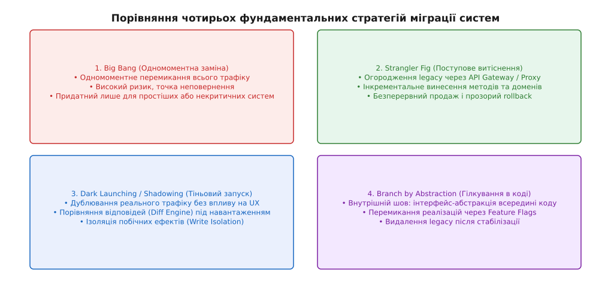
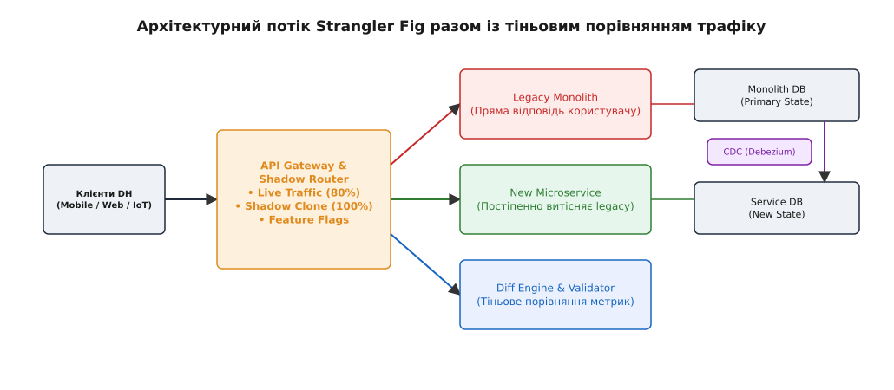
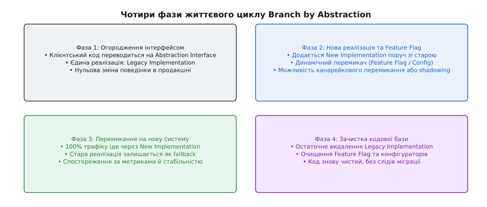

# Вибір стратегії переходу великого

<preknowlist>
- [Ерозія архітектури](topic:programming/architecture-erosion) — розходження між задуманою та реалізованою архітектурою під тиском років.
- [Rewrite vs refactor](topic:programming/rewrite-vs-refactor) — дилема між повним переписуванням та локальним відновленням системи.
- [Strangler fig](topic:programming/strangler-fig) — патерн поступового витіснення монолітного коду за допомогою огороджувального проксі.
- [Deprecation як керований процес](topic:programming/deprecation-policy) — виведення з експлуатації застарілих інтерфейсів та сервісів.
- [Прийшов у чужу систему](root:progarch/legacy-and-evolution/reading-unknown-system) — методи кодової археології та побудови мапи незнайомого legacy.
</preknowlist>

Платформа Digital Homes (DH) обслуговує 500 тисяч активних розумних будинків по всій країні. Старий моноліт на Python та PostgreSQL обробляє телеметрію давачів, керує смарт-замками, розраховує щомісячний білінг та виконує користувацькі сценарії автоматизації. У години пік пікова латентність обробки подій досягає 3.5 секунди, утилізація CPU на головній базі даних підбирається до 98%, а додавання нового тарифного плану вимагає внесення змін у 14 монолітних файлів та 4 пов'язані таблиці. Бізнес вимагає негайного переходу на високоефективну мікросервісну архітектуру на Go та C++ з використанням TimescaleDB для часових рядів та Kafka для потоків подій. Однак розумні замки, датчики протікання води та автоматичні платіжні шлюзи не вибачають ані хвилини зупинки (Downtime), ані втрати транзакцій. Попередня спроба команди провести «одномоментну міграцію за вихідні» (Big Bang) завершилася катастрофою: скрипти трансформації даних зависли на 30-й годині, покривши лише 40% баз даних, і міграцію довелося аварійно скасувати за чотири години до відкриття робочого дня. Інженер опиняється перед фундаментальним архітектурним викликом: як замінити працюючий двигун літака безпосередньо під час польоту, не втративши керованість і не зашкодивши пасажирам.


*Чотири фундаментальні стратегії міграції великих систем: радикальний Big Bang, інкрементальний Strangler Fig, безпечний Dark Launching та внутрішньопроцесний Branch by Abstraction.*

## 1. Фундаментальні фізичні обмеження міграцій великих систем

Спроба замінити велику програмну систему завжди зіштовхується з фундаментальним протиріччям між прагненням до найшвидшого отримання нового функціоналу та збереженням безперервності бізнесу. Технічні керівники та молоді інженери часто потрапляють у пастку ментальної простоти Big Bang Cutover. З концептуального погляду Big Bang здається ідеальним: не потрібно будувати складні маршрутизатори трафіку, не потрібно підтримувати сумісність між двома різними схемами СУБД, не потрібно писати компенсаційні скрипти подвійного запису та підтримувати два середовища розгортання. Команда сподівається написати нову систему з чистого аркуша, зупинити стару у п'ятницю увечері й увімкнути нову в понеділок вранці.

Проте у сфері високонавантажених і стан-залежних (Stateful) систем діє негласний фізичний закон міграцій: **ймовірність успіху одномоментного перемикання є зворотно пропорційною обсягу стану та кількості зовнішніх інтеграцій системи**.

### Теорема стану та радіус ураження (Blast Radius)

Щоб зрозуміти, чому Big Bang ламається у великих масштабах, необхідно розділити системи за критерієм наявності стану:

1. **Безстанні системи (Stateless):** Якщо сервіс лише виконує обчислення або трансформує вхідні дані без збереження довготривалого стану (наприклад, сервіс генерації PDF-звітів або калькулятор валютних курсів), його міграція є тривіальною. Можна паралельно розгорнути нову версію, спрямувати на неї 100% трафіку через DNS або Load Balancer і в разі помилки миттєво відкотитися назад. Радіус ураження обмежується поточними запитами.
2. **Стан-залежні системи (Stateful):** Якщо система володіє первинним джерелом правди (Primary Source of Truth) — баз даних на террабайти, реляційні зв'язки, незбережені черги повідомлень, сесії користувачів та тривалі бізнес-процеси, — одномоментна міграція перетворюється на операцію з високим ступенем ризику.

Основна причина поразки Big Bang у стан-залежних системах полягає у виникненні **Точки неповернення (Point of No Return)**. Точка неповернення — це момент часу після початку вихідного перемикання, коли нова система починає приймати нові мутуючі транзакції від користувачів у власну базу даних.

```text
[Зупинка Legacy] ──► [Експорт БД] ──► [Імпорт у New DB] ──► [Перемикання DNS] ──► [ТОЧКА НЕПОВЕРНЕННЯ]
                                                                                        │
                                                                       Нові транзакції в New DB!
                                                                                        │
                                                                   [Виявлено критичний баг!]
                                                                                        │
                                                                   Відкат на Legacy неможливий:
                                                                   стара БД застаріла!
```

Якщо через дві години після проходження цієї точки у новій системі виявляється критичний витік пам'яті або хибне списання коштів, простий відкат на стару систему вже **неможливий**. Стара база даних більше не містить тих нових транзакцій, які відбулися за дві години роботи нової системи. Команда опиняється перед вибором: або зупинити бізнес на дні для ручної реконсиляції даних, або продовжувати гасити пожежі в продакшні на нестабільній новій системі.

> 🔧 **Навіщо це.** Без свідомого вибору комбінованої стратегії міграції команда витрачає місяці на гасіння пожеж, породжених спробами оновити систему в режимі Big Bang. Системний підхід перетворює небезпечний перехід на серію передбачуваних та повністю зворотних інженерних кроків.

### Математична оцінка ризику та радіуса ураження

Масштаб ризику при міграції можна виразити через три залежні величини: обсяг стану `S`, кількість зовнішніх інтеграційних точок `I`, та час роботи вихідного вікна `T_window`. Збільшення будь-якого з цих параметрів підвищує ймовірність збою під час одномоментного перемикання:

```text
P(failure) = 1 - e^(-λ · S · I · T_window)    [ймовірність збою Big Bang]
```

При досягненні певного порогу (наприклад, у платформи DH з 500 000 користувачами та десятками тисяч пристроїв) значення `P(failure)` наближається до 1.0 (100%). Це означає, що спроба провести Big Bang міграцію на такій системі не є інженерним ризиком — це завідомо гарантована поразка.

Також необхідно враховувати психологічний фактор Другої системи (Second-System Syndrome), описаний Фредериком Бруксом. Коли команда створює нову систему «з нуля» замість інкрементального оздоровлення, вона прагне закласти туди всі нереалізовані за роки ідеї. Нова система стає роздутою, терміни розробки зміщуються на роки, а старий моноліт продовжує накопичувати нові бізнес-фічі, розширюючи прірву між legacy та новою версією.

> 🔧 **Навіщо це.** Усвідомлення фізики Точки неповернення змушує архітектора відмовитися від ілюзії Big Bang для критичних систем. Замість пошуку «ідеального вікна зупинки» архітектор будує систему міграції так, щоб Точка неповернення або відсувалася до самого фіналу, або взагалі не виникала завдяки асинхронній двосторонній синхронізації даних.

Історія розвитку інженерних методів дала відповідь на ризики Big Bang у вигляді трьох гранулярних, зворотних і керованих патернів: **Strangler Fig Pattern**, **Dark Launching / Shadowing** та **Branch by Abstraction**.

## 2. Strangler Fig Pattern: інкрементальне огородження та витіснення

Патерн «Душитель» (Strangler Fig Pattern), вперше описаний Мартином Фаулером, спирається на аналогію з тропічним фікусом-душителем. Замість руйнування старого дерева фікус випускає коріння навколо стовбура, поступово перехоплює поживні речовини та світло, і з часом повністю заміщає господарське дерево.

В архітектурі програмного забезпечення Strangler Fig реалізує ідею **мережевого огородження (Network Interception Boundary)**. Замість того щоб змінювати моноліт зсередини або намагатися замінити його повністю, навколо legacy-системи будується проміжний шар маршрутизації (API Gateway, Reverse Proxy або Service Mesh), який перехоплює всі вхідні виклики.

### Механіка маршрутизації та вектори розщеплення трафіку

Огороджувальний проксі-шар дає змогу виділяти й переміщувати функціональність з моноліту DH до нових мікросервісів за чотирма основними векторами:

1. **Маршрутизація за URL-шляхами (Path-Based Routing):** Найпростіший варіант. API Gateway спрямовує всі класичні запити `/api/v1/*` на легасі-моноліт, але як тільки розроблено новий сервіс телеметрії, трафік за шляхом `/api/v1/telemetry` переключається на новий Go-сервіс.
2. **Маршрутизація за ідентифікатором клієнта (Tenant / Device ID Routing):** Шлюз аналізує заголовки HTTP або JWT-токен. Запити від 99% будинків ідуть на старий моноліт, але запити від 1% тестових будинків (або будинків співробітників компанії) спрямовуються на нову систему.
3. **Вагова канарейкова маршрутизація (Weighted Canary Routing):** Шлюз плавно піднімає відсоток трафіку, що спрямовується на новий сервіс: `1% → 5% → 25% → 50% → 100%`. Якщо метрики помилок або латентності нового сервісу виходять за нормативні межі, вага миттєво скидається до `0%`.
4. **Маршрутизація за версіями контрактів (Header/Accept Routing):** Виклики зі старих мобільних застосунків опрацьовуються монолітом, а виклики з нових версій із заголовком `Accept: application/vnd.dh.v2+json` спрямовуються на нові мікросервіси.

На практиці налаштування такого огородження у сучасному інгрес-контролері (наприклад, Nginx або Envoy) виглядає як конфігурація вагового балансування. Проксі-сервер розподіляє вхідні HTTP-запити між продуктивним upstream моноліту та новим upstream мікросервісу на основі заздалегідь визначених правил і заголовків сесії.

### Найголовніший виклик Strangler Fig: Зв'язаність даних (Data Coupling)

Відокремити код контролера легко; відірвати код від спільної бази даних — це найскладніша інженерна задача Strangler Fig. У моноліті DH таблиці `devices`, `telemetry_logs` та `billing_accounts` пов'язані Foreign Keys і спільними SQL-транзакціями. Якщо новий мікросервіс телеметрії потребує власної бази даних (TimescaleDB), виникає проблема розходження стану між старою PostgreSQL та новою TimescaleDB.

Для розв'язання цієї проблеми застосовують три класичні підходи до синхронізації даних:

#### Підхід A. Прямий подвійний запис (Dual Writes)
Проксі-шар або сам моноліт при отриманні мутуючого запиту виконує синхронний або асинхронний запис в обидві бази даних.
- *Перевага:* Простота первинного розуміння.
- *Недолік:* Небезпека часткових відмов (Partial Failures). Якщо запис у першу БД пройшов успішно, а у другу — впав через мережевий таймаут, бази даних входять у розсинхронізований стан. Спроба обгорнути це у розподілену двофазну транзакцію (2PC) вбиває продуктивність системи.

#### Підхід B. Change Data Capture (CDC на основі транзакційного логу)
Замість внесення змін на рівні коду застосунку на базу даних legacy натскається спеціалізований коннектор (наприклад, Debezium). CDC зчитує бінарні логи транзакцій СУБД (PostgreSQL WAL або MySQL binlog) у режимі реального часу, трансформує події `INSERT`/`UPDATE`/`DELETE` і публікує їх у брокер повідомлень Apache Kafka. Новий мікросервіс вичитує події з Kafka й оновлює власну базу даних.

```text
[Legacy App] ──► [Monolith PostgreSQL]
                         │ (Write WAL)
                         ▼
                 [Debezium CDC] ──► [Kafka Topic] ──► [New Service] ──► [TimescaleDB]
```

CDC забезпечує майтоже нульове навантаження на кодову базу моноліту та гарантує асинхронну послідовну доставку подій змін без блокування основних HTTP-запитів.

#### Підхід C. Двосторонній узгоджувач даних (Data Drift Reconciler)
Навіть при використанні CDC або Dual Writes у розподіленій системі неминуче виникає так званий «дрейф даних» (Data Drift) через втрату подій, мережеві перебої або баги у трансформаціях. Для забезпечення цілісності запускається фоновий процес (Reconciler). Він періодично сканує первинні ключі та хеш-суми записів у обох базах даних, знаходить невідповідності та виправляє їх (Auto-healing), гарантуючи, що нова система володіє точним зрізом стану.

Детальний історичний огляд виникнення цих патернів та аналіз найбільших катастроф галузі наведено у вставці [📜 Еволюція стратегій міграції: від капітальних Big Bang 1970-х до тіньових запущених систем](root:progarch/legacy-and-evolution/migration-choice/hist-migration-evolution.md).

## 3. Dark Launching та Traffic Shadowing: тіньове випробування реальністю

Навіть якщо новий мікросервіс покритий 100% модульних та інтеграційних тестів у тестовому середовищі (Staging), це не дає відповіді на головні питання високонавантаженої системи:
- Як поводитиметься новий сервіс під реальним профілем паралельних з'єднань (наприклад, при одночасному сплеску від 50 000 давачів після відновлення живильної мережі)?
- Чи немає у новому коді прихованих витоків пам'яті або конкурентних стан-гонок (Race Conditions), які проявляються лише на реальному обсязі даних?
- Чи точно новий алгоритм обчислення білінгу повертає ідентичні суми для всіх 500 000 акаунтів, ураховуючи всі накопичені за роки крайові випадки?

Для відповіді на ці питання застосовують патерн **Dark Launching (Тіньовий запуск)** та його інфраструктурне втілення — **Traffic Shadowing (Тіньове дублювання трафіку)**.


*Архітектурний потік тіньового дублювання трафіку (Traffic Shadowing): реальні запити дзеркалюються на новий сервіс та Diff Engine без впливу на кінцевого користувача.*

### Механізм асинхронного дзеркалювання трафіку

Тіньове дублювання працює на рівні API Gateway або Service Mesh (наприклад, Envoy Proxy). Коли від клієнта надходить продуктивний запит:
1. Proxy створює точну копію HTTP/gRPC запиту (включаючи заголовки, URL та тіло).
2. Оригінальний запит відправляється на продуктивний legacy-моноліт. Його відповідь повертається клієнту без жодної затримки.
3. Скопійований запит асинхронно (у режимі Fire-and-Forget) відправляється на новий сервіс.
4. Відповідь від нового сервісу **ніколи не повертається клієнту**. Вона спрямовується у спеціальний модуль порівняння — **Diff Engine**.

### Валідація та конструкція Diff Engine

Модуль порівняння (Diff Engine) отримує дві відповіді — від Legacy та від нового сервісу — і виконує їх глибоку порівняльну діагностику:

- **Порівняння статус-кодів та структур:** Релевантність JSON/Protobuf відповідей.
- **Виключення волатильних полів:** Алгоритм порівняння має свідомо ігнорувати поля, які змінюються при кожному запиті — часові мітки (`timestamp`), унікальні ідентифікатори запитів (`request_id`), хеші сесій та серверні підписи.
- **Аналіз латентності:** Порівнюється розподіл p50, p95 та p99 латентності. Якщо новий Go-сервіс відповідає за 15 мс, а legacy-моноліт відповідає за 250 мс, це підтверджує ефективність нової архітектури. Якщо ж новий сервіс демонструє спайки до 2000 мс — виявлено дефект конфігурації пул-з'єднань або GC-пауз до виходу в продакшн.

Складність Diff Engine зростає, коли відповіді містять числа з плаваючою крапкою (Float). Через відмінності у реалізації математичних бібліотек між Python та C++ обчислення сум у чеках можуть відрізнятися на частки копійок ($0.000001$). Diff Engine повинен мати налаштовувані допуски точності (Epsilon Tolerance) для таких полів.

### Критична пастка Тіньового Запуску: Побочні ефекти (Side Effects)

Головна небезпека тіньового дублювання трафіку полягає у **неконтрольованому повторному виконанні побічних ефектів**.

Якщо продуктивний запит користувача — це `POST /api/v1/locks/unlock` (відчинити двері розумного будинку), або `POST /api/v1/billing/charge` (зняти $50 з платіжної картки), то неконтрольоване тіньове дублювання цього запиту призведе до того, що:
- Двері будинку відчиняться два рази поспіль (або закриються через тіньовий конфлікт).
- З платіжної картки клієнта кошти будуть списані двічі — один раз монолітом, другий раз тіньовим мікросервісом!

> ⚠️ **Залізнице правило Dark Launching:** Тіньовий трафік **ніколи** не повинен виконувати незворотні побічні ефекти у зовнішньому світі.

Для гарантування безпеки застосовують три рівні захисту:

1. **Header-Based Dry-Run Isolation:** Тіньовий маршрутизатор обов'язково додає заголовок `X-Dark-Launch-Shadow: true`. Всі внутрішні адаптери нового сервісу (клієнти SMS-шлюзів, платіжних систем, зовнішніх REST API) аналізують цей заголовок і переключаються в режим `Dry-Run` (перевірка валідності аргументів без реального мережевого виклику).
2. **Database Write Sandboxing:** Мутуючі транзакції тіньового сервісу спрямовуються в ізольовану тестову схему бази даних (Sandbox Schema) або виконуються всередині SQL-транзакції, яка завжди завершується викликом `ROLLBACK`.
3. **Read-Only First Shadowing:** На перших етапах міграції тіньове дублювання вмикається виключно для чільних операцій читання (`GET`, `SEARCH`, `FETCH`), де побічні ефекти природно відсутні.

## 4. Branch by Abstraction: внутрішньопроцесне гілкування коду

Поки Strangler Fig та Dark Launching розв'язують завдання міграції на мережевих межах (між окремими процесами та сервісами), всередині кодової бази монолітного застосунку часто виникає потреба замінити велику внутрішню підсистему без її винесення в окремий мережевий мікросервіс.

Наприклад, у моноліті DH підсистема обчислення тарифних сіток електроенергії заплутана у 40 файлах. Спроба винести її у окремий мікросервіс через мережу додасть 20 мс мережевої латентності на кожен запит, що є неприпустимим для гарячого циклу обробки телеметрії. Підсистему потрібно переписати зсередини моноліту, звернувши стару реалізацію на новий високоефективний C++ / Go модуль.

Спроба зробити це у довгоживуючій Feature-гілці в git (`git checkout -b feature/new-tariff-engine`) гарантовано призводить до **Merge Hell** (пекла злиття гілок). Поки команда три місяці переписує модуль у своїй гілці, основна кодова база в `main` іде вперед, і злиття гілок стає практично неможливим через сотні конфліктів.

Для розв'язання цієї проблеми Пол Хаммант сформулював патерн **Branch by Abstraction (Гілкування через абстракцію)**, який дає змогу проводити масштабні внутрішні заміни безпосередньо у main-гілці без розриву безперервної інтеграції (Trunk-Based Development).


*Чотири послідовні фази життєвого циклу Branch by Abstraction: від огородження інтерфейсом до повного видалення застарілого коду.*

### Життєвий цикл Branch by Abstraction у чотири фази

Паттерн реалізується у чотири послідовні етапи:

#### Фаза 1. Створення шва (Introduce Abstraction / Seam)
Без зміни існуючої бізнес-логіки у main-гілці виділяється абстрактний інтерфейс (або чисто віртуальний клас у C++, `interface` у Go/TS), який описує контракти підсистеми. Існуючий legacy-код обгортається у першу реалізацію цього інтерфейсу (`LegacyImplementation`). Весь клієнтський код переводиться на виклики через цей інтерфейс. Система комітиться у `main` і розгортається в продакшн. Поведінка системи не змінилася ні на йоту, але створено **Шов (Seam)**.

#### Фаза 2. Написання нової реалізації поруч (Implement New Side-by-Side)
У кодову базу додається друга реалізація інтерфейсу (`NewImplementation`). Вона будується поруч, у тих самих комітах до `main`, але поки що не отримує викликів у продакшні. Нова реалізація покривається характеристичними й юніт-тестами.

#### Фаза 3. Динамічний перемикач (Feature Flag / Config Router)
Всередині точки виклику інтерфейсу додається динамічний перемикач на основі Feature Flag або Atomic Config:

```text
[Client Code] ──► [Abstraction Interface]
                           │
                 ┌─────────┴─────────┐
       (Flag = false)          (Flag = true)
                 │                   │
                 ▼                   ▼
      [LegacyImplementation]   [NewImplementation]
```

Це дає змогу канарейково переключати виконання на новий модуль для 1% запитів, виконувати тіньовий запуск всередині процесу або миттєво повертатися на `LegacyImplementation` при виявленні помилок без редеплою застосунку.

#### Фаза 4. Демонтаж та зачистка (Cleanup Legacy)
Після того як `NewImplementation` відпрацювала під 100% продакшн-навантаженням протягом кількох тижнів без жодного інциденту, проводиться фінальна зачистка. Клас `LegacyImplementation`, конфігураційний перемикач та умовні розгалуження видаляються з репозиторію. У кодовій базі залишається лише новий чистий код, без жодних слідів міграційного «риштування».

### Баланс накладних витрат та пам'яті при Branch by Abstraction

При застосуванні Branch by Abstraction у високозавантажених системах на C++ або Go необхідно враховувати два технічних проекти:
1. **Продуктивність віртуального виклику:** Використання динамічного поліморфізму (віртуальні функції в C++) додає один непрямий виклик через таблицю vtable. У 99.9% випадків це нехтувано мало (~1 нс). Якщо ж виклик знаходиться у гарячому внутрішньому циклі (мільйони ітерацій на секунду), замість динамічного vtable застосовується статичний поліморфізм через шаблони (CRTP) або розгалуження за допомогою лямбда-функцій.
2. **Управління пам'яттю та RAII:** При створенні `NewImplementation` важливо використовувати Smart Pointers (`std::unique_ptr`, `std::shared_ptr`) для автоматичного звільнення ресурсів при аварійному перемиканні реалізацій під час виконання.

Продуктові приклади реалізації даного патерну на мовах C++ та Go із застосуванням атомарних прапорців та безвиняткової обробки помилок наведено у вставці [⚙️ Практична реалізація Dark Launching та Branch by Abstraction](root:progarch/legacy-and-evolution/migration-choice/proj-shadow-and-abstraction.md).

## 5. Багатовимірна матриця прийняття рішень та комбіновані евристики

Жодна з чотирьох розглянутих стратегій не є універсальною панацеєю. Професійна архітектура полягає у здатності вибрати правильний інструмент під конкретні характеристики кожного домену та комбінувати їх у цілісний конвеєр міграції.

### Оцінка компромісів за п'ятьма вимірами

Під час вибору стратегії міграції архітектор оцінює компроміси за п'ятьма основними вимірами:

1. **Характер стану (Statefulness & Coupling):** Чи містить модуль власну базу даних? Стан-залежні модулі вимагають Strangler Fig + CDC; безстанні модулі легко мігрують через канарейкову маршрутизацію.
2. **Вимоги до SLA та Downtime:** Чи припустима зупинка системи на 2 години? Якщо це нічний пакетний процес — Big Bang може бути найдешевшим і найрозумнішим рішенням. Якщо це цілодобовий IoT-сервіс — лише Strangler Fig або Branch by Abstraction.
3. **Область зміни (Boundary Level):** Де проходить межа заміни? Якщо межа мережева (між сервісами) — працюють Strangler Fig та Dark Launching. Якщо межа внутрішньопроцесна (всередині моноліту) — працює Branch by Abstraction.
4. **Вартість інфраструктури та спостережуваності:** Dark Launching вимагає подвійного обсягу обчислювальних потужностей та розробки Diff Engine. Якщо бізнес не готовий оплачувати подвійні інфраструктурні витрати, вибір зміщується в бік канарейкового Strangler Fig з малим кроком (1%).
5. **Когнітивне навантаження на команду:** Підтримка подвійних записів, CDC та Feature Flags створює тимчасову складність (Accidental Complexity). Якщо команда невелика, спроба реалізувати всі патерни одночасно призведе до вигорання й помилок у конфігурації.

Повну порівняльну матрицю, алгоритмічне дерево рішень, граничні значення метрик та п'ятифазний чек-лист безпечного переходу зведено у вставці [📋 Довідник архітектора: Матриця вибору стратегії та чек-лист міграції](root:progarch/legacy-and-evolution/migration-choice/api-migration-playbook.md).

### Комбінований сценарій міграції для платформи Digital Homes

Для розв'язання початкової задачі платформи Digital Homes архітектор будує **комбіновану еволюційну стратегію**, яка об'єднує всі три безпечні патерни в єдиний часовий конвеєр:

```text
[Крок 1: Внутрішні модулі]    ──►  [Крок 2: Мережеве огородження] ──►  [Крок 3: Тіньова валідація]  ──►  [Крок 4: Канарейка й Зачистка]
Branch by Abstraction              Strangler Fig + CDC                Dark Launching                      Canary 1% -> 100%
(Очищення тарифного ядра)          (Винесення телеметрії)             (Перевірка білінгу під навантаженням) (Видалення legacy)
```

1. **Внутрішній рефакторинг ядра (Branch by Abstraction):** Всередині моноліту підсистема розрахунку тарифних сіток огороджується C++ / Go інтерфейсом. Логіка виправляється й покривається характеристичними тестами без винесення у мережу.
2. **Огородження високонавантаженої телеметрії (Strangler Fig + CDC):** На API Gateway виділяються URL-шляхи телеметрії. Дані давачів спрямовуються у новий Go-сервіс, а історичний стан синхронізується з PostgreSQL у TimescaleDB через Debezium CDC.
3. **Тіньове випробування білінгу (Dark Launching / Shadowing):** Запити на розрахунок щомісячних платежів дублюються в новий сервіс. Diff Engine протягом двох тижнів порівнює суми у чеках для всіх 500 000 користувачів, гарантуючи 100% точність до включення реального списання коштів.
4. **Канарейкове перемикання та фінальний демонтаж:** Трафік поступово переводиться на нову мікросервісну платформу, після чого застарілий Python-моноліт вимикається.

## 6. Синтез: міграція як постійна архітектурна спроможність

Головний висновок еволюції стратегій міграції полягає в тому, що перехід з однієї системи на іншу — це не разовий болісний проект, який трапляється раз на п'ять років під тиском критичних спайків навантаження, а **постійна функціональна спроможність (Continuous Architectural Capability)** зрілої програмної системи.

Зріла архітектура відрізняється від крихкої тим, що у неї від початку закладено **Шви (Seams)** — на мережевому рівні через API Gateway, Reverse Proxy та Service Mesh, і на рівні кодової бази через чистоту abstractions, модульні межі та динамічні Feature Flags. Інженерна культура, яка опанувала трикутник стратегій «Strangler Fig — Dark Launching — Branch by Abstraction», більше не боїться застарівання технологічного стеку. Наявність цих швів перетворює колись небезпечну катастрофу типу Big Bang на плановий, керований, вимірюваний та абсолютно прозорий процес повсякденного еволюційного розвитку програмної платформи.
