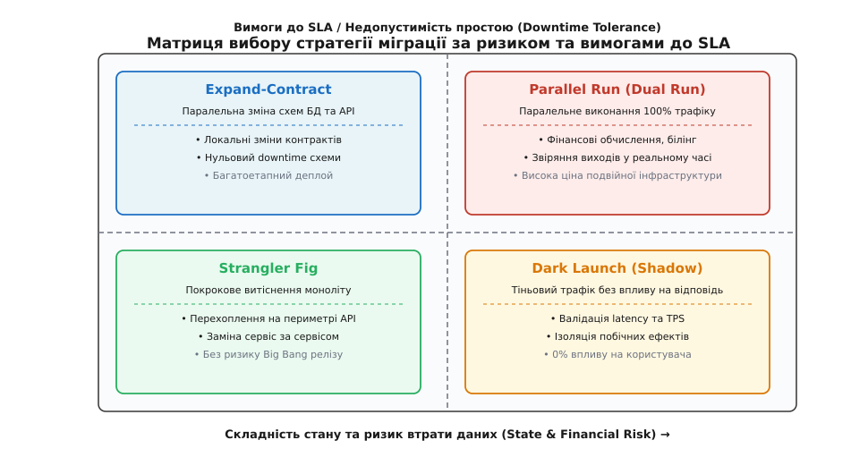
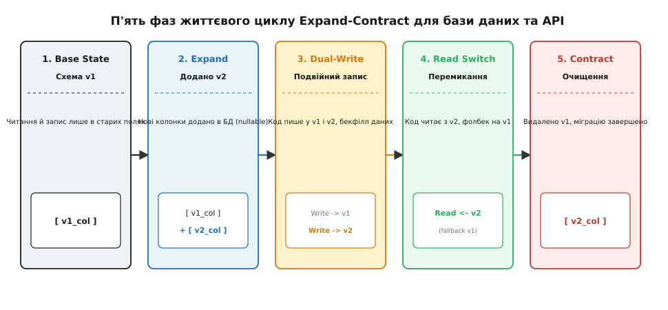
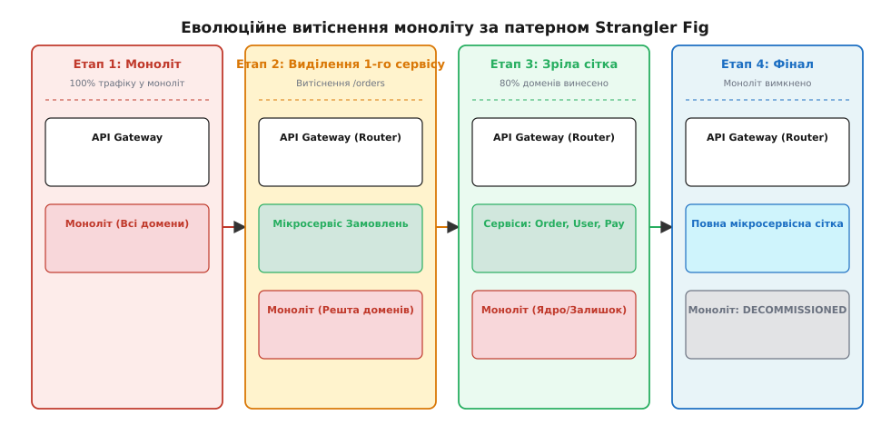
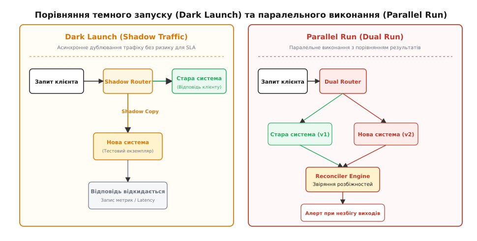

# Вибір стратегії зміни живої системи

<preknowlist>
- [Zero-downtime міграції даних](root:progarch/change-and-cache-tactics/zero-downtime-migration) — розширення та звуження схем, подвійний запис без простою.
- [Canary, blue-green, feature-flags](root:progarch/change-and-cache-tactics/canary-bluegreen-featureflags) — розділення розгортання коду та випуску функціональності.
- [Компакт-вибір типу зв'язку для зміни](root:progarch/change-and-cache-tactics/change-coupling-choice) — зчеплення релізів та незалежність деплою.
- [Еволюція API та розширюваність контракту](root:progarch/api-and-compatibility/api-evolution-dh) — поблажливі читачі та адитивні зміни DTO.
</preknowlist>

Міжнародна платіжна платформа обробляє 40 000 транзакцій на секунду з гарантованим рівнем доступності 99.999%. Під час планового оновлення ядра процесингу інженери спробували замінити монолітний сервіс авторизації за один крок — зупинили старий процес, виконали блокуючу SQL-міграцію бази даних та запустили новий контейнер. Через неявну розбіжність у форматах часових поясів новий сервіс почав відхиляти 100% платежів. Спроба негайного відкату провалилася: SQL-міграція вже видалила застарілі колонки, а відновлення з резервної копії вимагало зупинки всієї системи на 4 години. Підсумок — 15 мільйонів доларів прямого збитку, регуляторні штрафи та повна втрата репутаційної довіри клієнтів.

Ця катастрофа сталася через фундаментальну інженерну помилку: спробу виконати незворотну зміну в системі зі станом через один синхронний крок (Big Bang release). Чим більший обсяг накопичених даних та ніжніші вимоги бізнесу до відсутності простою, тим дорожчою стає будь-яка спроба оновлення «в лоб». Зміна живої системи під навантаженням подібна до заміни авіаційного двигуна під час трансатлантичного перельоту: пасажири в салоні не повинні відчути навіть найменшої вібрації, а літак зобов'язаний утримувати висоту й курс.

Безпечне оновлення живої системи спирається на свідомий вибір однієї з чотирьох фундаментальних стратегій міграції: **Expand-Contract**, **Strangler Fig**, **Parallel Run (Dual Run)** або **Dark Launch (Shadow Traffic)**. У цьому кроці ми розберемо внутрішню анатомію кожного патерну, з'ясуємо їхні інфраструктурні й обчислювальні ціни та побудуємо формалізований архітектурний фреймворк вибору стратегії залежно від ризику втрати даних, складності стану та вимог до SLA.

---

## 1. Пастка Big Bang релізу та вартість помилки у живій системі

Традиційне розгортання ПЗ, успадковане з епохи коробкового софту, будується на припущенні про існування вікна обслуговування (Maintenance Window). Команда попереджає користувачів про зупинку сервісу в неділю о 03:00 ночі, зупиняє процеси, накатує зміни та запускає нову версію.

У сучасних розподілених високонавантажених платформах це припущення повністю ламається з двох причин:

1. **Глобалізація трафіку та нульовий Downtime:** Для глобальних сервісів не існує «нічного часу». Неділя 03:00 у Києві — це пікове навантаження у Токіо або Сан-Франциско. Вимога доступності 99.999% виділяє всього 5.26 хвилин допустимого простою на рік, що виключає можливість проведення будь-яких ручних міграцій під час зупинки.
2. **Незворотність змін у системі зі станом (Stateful Systems):** Якщо stateless-сервіс (наприклад, конвертер зображень) можна легко відкотити назад шляхом перезапуску старого контейнера, то сервіс із базою даних після виконання мутуючих транзакцій втрачає можливість простого повернення. Якщо новий код записав дані у новому форматі, старий код більше не зможе їх прочитати.

```
Звичайний Big Bang реліз (Високий ризик):
[Стара система v1] ===(Зупинка + Ламаюча міграція БД)===> [Нова система v2]
                                                                  |
                                                    💥 Помилка: Втрата даних
                                                    ❌ Відкат неможливий!

Еволюційна міграція (Нульовий ризик):
[Стара v1] ---> [Фаза Expand (Паралелізм)] ---> [Фаза Read Switch] ---> [Фаза Contract]
```

Головна мета будь-якої стратегії міграції — **зменшення радіуса ураження (Blast Radius)** від потенційного багу. Замість ризику падіння 100% системи для 100% користувачів, архітектор розбиває міграцію на серію дрібних, зворотних та ізольованих фаз.

Більше того, лабораторне та Staging-тестування принципово не здатне виявити всі крайні випадки, що виникають у живому продакшні. Ентропія реальних даних, хаотичні затримки мережевих каналів та специфічна поведінка мільйонів користувачів створюють умови, які неможливо симулювати автотестами. Стратегії міграції перетворюють реліз із небезпечної здогадки на контрольований фізичний експеримент.

Детальний аналіз того, як корпоративна індустрія перейшла від руйнівних релізів початку 2000-х років до ізольованих фазових змін, описано в [історії витоків патернів Strangler Fig, Parallel Run та Dark Launch](root:progarch/change-and-cache-tactics/migration-strategy-choice/hist-strangler-and-shadow.md).

---

## 2. Таксономія чотирьох стратегій міграції

Вибір стратегії міграції визначається позиціонуванням задачі у двовимірному просторі обмежень: **складністю стану даних (State Complexity)** та **вимогами до SLA / допустимості простою (Downtime Tolerance)**.


*Матриця вибору стратегії міграції: розподіл чотирьох патернів за осями ризику втрати стану та вимог до доступності (SLA).*

Кожен із чотирьох патернів вирішує свій чітко окреслений клас архітектурних задач:

- **Expand-Contract (Parallel Change):** Використовується для локальних змін схем баз даних, структур таблиць та API-контрактів всередині одного сервісу без зупинки системи.
- **Strangler Fig:** Застосовується для глобальної заміни монолітних застосунків або великомасштабних legacy-систем шляхом покрокового витіснення функціональності на периметрі API-шлюзу.
- **Parallel Run (Dual Run):** Призначений для міграцій критичних бізнес-доменів (білінг, фінансовий облік, процесинг платежів), де найменша розбіжність у розрахунках веде до катастрофічних наслідків.
- **Dark Launch (Shadow Traffic):** Використовується для перевірки продуктивності, навантажувальної здатності та характеристик затримки нового коду під реальним продакшн-трафіком без ризику для користувачів.

Правильне поєднання цих стратегій дозволяє інженерній команді проводити рефакторинг будь-якого масштабу — від додавання нового поля у SQL-таблицю до повної заміни монолітного двигуна на нову мікросервісну сітку.

---

## 3. Expand-Contract: еволюція схем та контрактів без простою

Стратегія **Expand-Contract** (також відома як Parallel Change) є фундаментальною тактикою проведення локальних змін у структурах даних та API-контрактах. Вона усуває часову прив'язку між оновленням схеми бази даних та оновленням коду застосунку.

### П'ять фаз життєвого циклу Expand-Contract

Процес реалізації Expand-Contract розгортається у п'ять послідовних кроків:


*П'ять фаз життєвого циклу Expand-Contract: від розширення схеми до залишкового очищення старого поля.*

1. **Фаза 1: Початковий стан (Base State).** Система працює на версії `v1`. Код прочитання та запису спирається виключно на старі колонки або поля API (`v1_field`).
2. **Фаза 2: Розширення (Expand).** У базу даних додається нове поле або нова таблиця (`v2_field`). Головне правило фази Expand: **нова структура має бути опціональною (Nullable) або мати значення за замовчуванням**. Старий код `v1` продовжує працювати і просто ігнорує нове поле. Зміни в БД виконуються без блокування таблиць (наприклад, `ALTER TABLE ... ADD COLUMN ... NULL` у PostgreSQL або MySQL).
3. **Фаза 3: Подвійний запис та бекфілл (Dual-Write & Backfill).** Розгортається нова версія коду `v1.1`. Під час створення або оновлення записів код атомарно пише дані **в обидва поля одночасно** (`v1_field` та `v2_field`). Для існуючих історичних даних запускається фоновий процес міграції (Backfill Worker), який порціями (batches) зчитує старі записи, трансформує їх і заповнює поле `v2_field`.
4. **Фаза 4: Перемикання читання (Read Switch).** Після завершення бекфіллу розгортається версія коду `v1.2`. Код починає читати дані з нового поля `v2_field`. Якщо з якоїсь причини значення у `v2_field` відсутнє, застосовується фолбек на `v1_field`. На цьому етапі відкат на стару версію залишається тривіальним, оскільки подвійний запис продовжує підтримувати `v1_field` у актуальному стані.
5. **Фаза 5: Звуження (Contract).** Переконавшись у стабільності роботи `v1.2`, код переводять у режим запису лише в `v2_field` (версія `v1.3`). Після цього із бази даних видаляють старе поле `v1_field` (`ALTER TABLE ... DROP COLUMN`), а з коду виплітають застарілі класи DTO. Міграцію завершено.

> 🔧 **Навіщо це.**
> Патерн Expand-Contract повністю усуває потребу у небезпечних блокуючих SQL-міграціях під час деплою. Він перетворює одну ламаючу зміну на три безпечні, зворотно-сумісні викатки коду, дозволяючи проводити десятки міграцій баз даних на день без найменшого просідання доступності сервісу.

### Низькорівнева механіка у базах даних та DTO

На рівні реляційних баз даних (PostgreSQL, MySQL) виконання команди `ALTER TABLE DROP COLUMN` або `ADD COLUMN` без урахування блокувань може паралізувати систему. У PostgreSQL команда `ALTER TABLE ADD COLUMN NOT NULL DEFAULT ...` у старих версіях вимагала повного перепису таблиці з ексклюзивним блокуванням `AccessExclusiveLock`, що приводило до каскадного накопичення з'єднань і падіння сервісу.

В рамках Expand-Contract будь-яке додавання колонок виконується у два етапи:
- Крок A: Додавання колонки без обмеження `NOT NULL` та без дефолтного значення (`ALTER TABLE orders ADD COLUMN tax_code VARCHAR(64);`). Така операція у сучасних СУБД є миттєвою metadata-only зміною.
- Крок B: Заповнення даних фоновими пакетами й лише після цього додавання обмеження `NOT NULL` через `CHECK (tax_code IS NOT NULL) NOT VALID` з наступним `VALIDATE CONSTRAINT`.

Для NoSQL баз даних (MongoDB, Cassandra, DynamoDB), де відсутня сувора схема на рівні рушія, патерн Expand-Contract реалізується на рівні шар-десеріалізатора застосунку (Application Schema Evolution). Код моделі об'єкта підтримує псевдоніми полів (Field Aliases) та фонову ліниву міграцію (Lazy Migration): при читанні документа зі старою версією схеми код трансформує його у пам'яті й асинхронно перезаписує у новій формі.

Для REST та gRPC контрактів механіка Expand-Contract реалізується через принцип **поблажливого читача (Tolerant Reader)**. При додаванні нового поля DTO JSON-десеріалізатор старих сервісів налаштовується так, щоб невідомі поля ігнорувалися (`FAIL_ON_UNKNOWN_PROPERTIES = false`), а не викликали винятки.

### Захист від гонки даних під час бекфіллу (Race Conditions)

Найбільш вразливим місцем Expand-Contract є період роботи фонового мігратора (Phase 2 Backfill). Якщо користувач оновлює свій профіль у ту саму мілісекунду, коли фоновий воркер перезаписує його старий рядок, виникає гонка даних.

Для запобігання втраті найновіших даних фонові мігратори повинні дотримуватися правила **атомарного умовного оновлення (Optimistic Locking)**:

```sql
-- Безпечний SQL-запит бекфіллу із захистом від перезапису свіжих даних
UPDATE users 
SET phone_number_v2 = CONCAT('+380', legacy_phone),
    updated_at = NOW()
WHERE id = 10452 
  AND phone_number_v2 IS NULL -- Оновлюємо ЛИШЕ якщо новий код ще не записав сюди значення
  AND version = 4;            -- Перевірка версії для оптимістичного блокування
```

---

## 4. Strangler Fig: покрокове витіснення монолітів

Якщо Expand-Contract працює всередині одного сервісу, то **Strangler Fig (фікус-душитель)** — це стратегія вищого рівня, призначена для повної заміни великих монолітних систем або морально застарілих платформ.

Головний принцип Strangler Fig полягає у відмові від спроб переписати весь моноліт за один раз. Замість цього на периметрі системи встановлюється роутер або API-шлюз (API Gateway / Reverse Proxy), а стара система витісняється домен за доменом.

### Чотириетапна механіка витіснення


*Еволюційне витіснення моноліту за патерном Strangler Fig: чотири етапи поступового перенесення доменів на нову мікросервісну сітку.*

1. **Етап 1: Монолітний периметр.** Усі вхідні HTTP/gRPC запити від мобільних застосунків та веб-клієнтів проходять крізь API Gateway. Шлюз конфігурується з правилом за замовчуванням: 100% трафіку перенаправляється на старий моноліт.
2. **Етап 2: Виділення першого домену (First Cut).** Команда обирає один ізольований бізнес-домен (наприклад, сервіс відгуків або каталог товарів) і реалізує його у вигляді нового автономного мікросервісу. На API Gateway додається правило маршрутизації:
   - `GET /api/v1/reviews`  ===> **Новий Мікросервіс Відгуків**
   - `ALL /api/v1/*`        ===> **Старий Моноліт**
3. **Етап 3: Покрокове розростання сітки.** Команда послідовно виділяє нові домени (Замовлення, Оплати, Користувачі). Щоразу, коли новий сервіс досягає продакшн-готовності, шлюз перемикає відповідний URL-маршрут. Моноліт поступово втрачає навантаження й перетворюється на порожнисту шарманку, яка обробляє лише некритичні залишки legacy-функціоналу.
4. **Етап 4: Повне вимкнення (Decommissioning).** Коли останній маршрут переключено на нову сітку сервісів, трафік на моноліт стає нульовим. Старий монолітний процес та його базу даних остаточно вимикають і видаляють з інфраструктури.

### Попередження пастки «Монолітного шлюзу» (Monolithic Gateway Trap)

Під час впровадження Strangler Fig архітектори часто потрапляють у пастку роздування відповідальності API-шлюзу. Якщо перенести бізнес-логіку авторизації, трансляції параметрів та валідації DTO безпосередньо у конфігураційні скрипти API Gateway (наприклад, у складні Lua-скрипти Nginx чи правила Kong), API-шлюз сам перетвориться на новий важкий моноліт.

Правило периметра для Strangler Fig: **API Gateway має залишатися «дурним» роутером трафіку (Dumb Pipe / Smart Endpoints)**. Шлюз лише зіставляє URL-префікси та перенаправляв байти, а будь-яке складне фасадне перетворення покладається на виділені сервіси-адаптери (BFF — Backend For Frontend).

### Маршрутизація периметра та наскрізне трасування (Distributed Tracing)

Під час тривалої міграції за патерном Strangler Fig частина запитів користувача обробляється монолітом, а частина — новим сервісним контуром. Для збереження єдиного контексту відлагодження API Gateway зобов'язаний генерувати та прокидати наскрізні заголовки трасування (W3C Trace Context / Jaeger headers):

```http
GET /api/v1/orders/7821 HTTP/1.1
Host: api.example.com
traceparent: 00-4bf92f3577b34da6a3ce929d0e0e4736-00f067aa0ba902b7-01
```

Якщо новий мікросервіс замовлень мусить звернутися назад до моноліту за даними про профіль користувача, заголовок `traceparent` передається далі у внутрішній HTTP/gRPC виклик. Це дозволяє інженерам бачити суцільний граф затримок у Jaeger або Zipkin, незалежно від того, скрізь які межі моноліту чи нових сервісів пройшов запит.

### Стратегії управління даними під час витіснення (Data Interception)

Найбільшим викликом при застосуванні Strangler Fig є **розділення спільної бази даних**. Якщо новий мікросервіс виділено, але йому потрібні дані з таблиць, які продовжують мутувати всередині моноліту, виникає проблема міжсервісної консистентності.

Для розв'язання цього архітектори застосовують один із трьох підходів:

1. **Перехоплення на рівні API (API Interception):** Новий сервіс викликає внутрішній приватний API моноліту для отримання неперенесених даних.
2. **Зміна захоплення даних (Change Data Capture, CDC):** Інструменти на зразок Debezium зчитують журнал транзакцій (WAL/Binlog) бази даних моноліту і асинхронно транслюють події зміни таблиць у Kafka. Новий мікросервіс слухає Kafka-топік і будує власну локальну проекцію даних (Read Model).
3. **Тригери подій та Transactional Outbox:** Моноліт при кожній мутації записує подію в таблицю `outbox`, яка публікується у брокер для споживання новим сервісом.

---

## 5. Parallel Run (Dual Run): 100% перевірка консистентності у фінансових системах

Існують бізнес-домени, де навіть 0.001% помилок або одна неочікувана розбіжність у розрахунках є неприпустимою. Приклади: процесинг банківських карт, білінговий рушій телеком-оператора, модуль нарахування податків або калькулятор ризиків для страхових полісів.

У таких системах ані канарейкові випуски, ані темне тестування не дають достатніх гарантій, оскільки вони не перевіряють **абсолютну точність обчислень на 100% обсягу реальних даних**. Для цих задач використовується стратегія **Parallel Run (паралельне виконання / Dual Run)**.

### Механіка роботи та шар звіряння (Reconciler Engine)

При паралельному виконанні вхідний запит дублюється і виконується **в обох системах одночасно (в старій v1 та новій v2)**. Результати обчислень обох систем передаються у спеціальний модуль — **Reconciler (рушій звіряння)**.


*Порівняння Dark Launch (тіньове дублювання для метрик затримки) та Parallel Run (паралельне виконання зі звірянням виходів у Reconciler).*

Reconciler виконує поблок порівняння структури відповідей, статусного коду та підсумкових числових значень.

- Якщо `Response(v1) == Response(v2)` — Reconciler підтверджує консистентність і повертає клієнту відповідь від `v1`.
- Якщо `Response(v1) != Response(v2)` — Reconciler фіксує аномалію, генерує алерт критичного рівня (`CRITICAL_RECONCILIATION_DIFF`), записує повний дамп обох відповідей у журнальну базу і повертає клієнту еталонну відповідь від перевіреної системи `v1`.

### Детерміновані та недетерміновані розбіжності (Diff Classification)

Під час роботи Reconciler інженери зіштовхуються з двома типами розбіжностей у відповідях:

1. **Детерміновані розбіжності (Справжні бага):** Похибки у розрахунку податкової ставки, відсутність поля у вихідному JSON, інший код HTTP-статусу. Ці розбіжності вимагають зупинки міграції та виправлення коду нової системи `v2`.
2. **Недетерміновані розбіжності (Хибні тривоги):** Різниця у порядках елементів у масиві, відмінності часових штампів (`10:00:00.001` vs `10:00:00.004`), випадкові ідентифікатори (UUIDv4).

Для ігнорування хибних тривог Reconciler налаштовується за допомогою правил маскування (Ignored Fields) та нормалізації структури. Порівняння проводиться після приведення JSON-об'єктів до канонічного вигляду.

### Операційний регламент обробки алертів розбіжності

Коли Reconciler фіксує розбіжність виходів, черговий інженер отримує сповіщення. Регламент обробки алерту вимагає класифікації помилки протягом 15 хвилин:
- Якщо розбіжність зумовлена помилкою в новій алгоритмічній моделі, розкочування зупиняється, а трафік на нову службу блокується.
- Дамп запиту та двох відповідей копіюється у репозиторій регресійних тестів. Нова версія `v2` знову проходить коло виправлень та локального тестування перед повторним увімкненням Parallel Run.

### Розв'язання проблеми подвійних мутацій (Dual Mutation Problem)

Якщо система, що тестується, виконує лише читання (Read-Only), паралельний прогон не створює проблем. Проте якщо сервіс реалізує бізнес-операцію зі зміною стану (наприклад, `Сплатити рахунок` або `Списати кошти`), пряме виконання двох систем призведе до **подвійного списання грошей з рахунку клієнта**.

Для розв'язання проблеми подвійних мутацій застосовують три інженерні техніки:

1. **Режим холостого прогону (Dry-Run Mode):** Нова система `v2` запускається зі спеціальним прапорцем. Вона виконує всі складні математичні розрахунки, будує транзакцію у пам'яті, але у найостанніший момент замість `COMMIT` робить `ROLLBACK` або замість виклику банківського API викликає тестову заглушку.
2. **Ізольована тіньова БД (Shadow Sandbox Database):** Нова система `v2` підключається до точної копії бази даних. Мутації відбуваються реально, але в ізольованому контурі. Фонові реплікаційні воркери постійно синхронізують початковий стан Sandbox БД з продакшном.
3. **Асинхронний Reconciler після виконання (Post-Factum Audit):** Система `v1` виконує транзакцію і відправляв відповідь клієнту. Подія мутації відправляється у чергу, де `v2` відтворює обчислення, а Reconciler перевіряє, чи совпали б підсумкові записи у регістрах.

Паралельний прогон триває від кількох тижнів до кількох місяців (зазвичай охоплюючи повний фінансовий цикл із закриттям місяця). Стару систему вимикають лише після того, як Reconciler показує **0 розбіжностей на мільйонах транзакцій поспіль**.

---

## 6. Dark Launch (Shadow Traffic): перевірка під повним продакшн-навантаженням

Якщо Parallel Run фокусується на **бізнес-точності розрахунків**, то стратегія **Dark Launch (темний запуск / тіньовий трафік)** фокусується на **перевірці продуктивності, навантажувальної здатності та характеристик затримки (Latency & Capacity Validation)**.

Головний виклик при розробці нових високонавантажених сервісів — неможливість точно відтворити профіль продакшн-навантаження на Staging-стендах. Синтетичні генератори трафіку (JMeter, Locust, k6) створюють ідеальні, однотипні запити. У реальному продакшні трафік містить хаотичні комбінації параметрів, довгі хвости затримок (p99 latency spikes), несподівані розміри payloads та специфічну мережеву поведінку клієнтів.

### Механіка тіньового дублювання трафіку (Traffic Mirroring)

При Dark Launch вхідний трафік асинхронно дублюється на рівні L7-маршрутизатора (Envoy, Nginx або API Gateway):

1. **Основа лінія (100% Sync):** Запит клієнта потрапляє на L7-проксі і спрямовується на працюючу систему `v1`. Відповідь від `v1` повертається користувачу з мінімальною затримкою.
2. **Тіньова лінія (100% Async Mirror):** L7-проксі створює повну клон-копію HTTP-пакета (включаючи заголовки, тіло та куки) і асинхронно відправляє її на екземпляри нової системи `v2`.
3. **Ізоляція та скидання відповідей:** Нова система `v2` обробляє запит у повному обсязі (проходить через стек парсингу, роботу з пам'яттю, обчислення та кеші). Проте її відповідь **ігнорується проксі-сервером і відкидається**. Всі метрики (час обробки, використання CPU/RAM, GC pauses, кількість помилок) записуються у Prometheus.

```
                      +-----------------------------+
                      |   Вхідний HTTP-запит        |
                      +-----------------------------+
                                     |
                      +-----------------------------+
                      |   L7 Proxy (Envoy Mirror)   |
                      +-----------------------------+
                         /                       \
        (Синхронно 100%) /                         \ (Асинхронно 100% Mirror)
                        v                           v
             +--------------------+       +--------------------+
             | Стара система v1   |       | Нова система v2    |
             | (Відповідь клієнту)|       | (Тіньовий запуск)  |
             +--------------------+       +--------------------+
                        |                           |
                        v                           v
              [Користувач бачить 200]     [Відповідь відкидається]
                                          [Метрики -> Prometheus]
```

### Мережеві та обчислювальні ризики тіньового трафіку

Не зважаючи на те, що відповідь тіньової системи відкидається, сам процес дублювання створює суттєве додаткове навантаження на інфраструктуру:

- **Перенасичення мережевої смуги (Bandwidth Saturation):** Дублювання 100% HTTP/gRPC трафіку на рівні L7-проксі подвоює вихідний мережевий потік між балансувальником та backend-вузлами. Якщо мережевий інтерфейс проксі-сервера завантажений на 60%, увімкнення Shadow Mirroring призведе до відкидання пакетів (Packet Loss) на первинній лінії.
- **Вплив на CPU балансувальника:** Асинхронне копіювання буферів пам'яті та створення додаткових TCP/TLS з'єднань збільшує навантаження на CPU L7-проксі.

Для нейтралізації цих ризиків у конфігураціях Envoy застосовують квантоване дзеркалювання трафіку (наприклад, `mirrorPercentage: 10%`), поступово збільшуючи частку тіньового потоку від 1% до 100% за аналогією з канарейковим випуском.

### Тіньове дзеркалювання у подійних архітектурах (Event-Driven Shadowing)

У асинхронних системах, побудованих на Kafka або RabbitMQ, темний запуск реалізується шляхом створення нової споживчої групи (Consumer Group):
- Основна служба `v1` слухає топік `orders_stream` під групою `orders_v1_group` і виконує бізнес-операції.
- Тіньова служба `v2` підключається до того ж топіка `orders_stream` під новою групою `orders_v2_shadow_group`.

Завдяки збереженню зсувів (Offsets) у Kafka тіньова служба зчитує 100% реальних подій продакшну без найменшого впливу на швидкість читання первинної групи.

Завдяки Dark Launch інженери бачать реальну поведінку нової системи під 100% продакшн-навантаженням задовго до того, як перша реальна людина отримає відповідь від нового коду. Якщо нова система падає через витік пам'яті під піковим навантаженням — користувачі цього навіть не помічають.

Зразкову інженерну реалізацію асинхронного роутера трафіку із підтримкою режимів Dark Launch та Parallel Run подано у вставці з [практичної реалізації роутера тіньового трафіку](root:progarch/change-and-cache-tactics/migration-strategy-choice/proj-shadow-router-engine.md).

---

## 7. Архітектурний фреймворк та матриця прийняття рішень

Для автоматизації та стандартизації процедури вибору стратегії міграції в організації використовується деревний алгоритм прийняття рішень. Він запобігає омані овер-інжинірингу — використанню надто складних і дорогих стратегій там, де достатньо локального Expand-Contract.

```
[Початок оцінки міграції]
       |
       v
Чи є міграція зміною структури БД чи API-контракту в межах одного сервісу?
       ├── ТАК ──> Чи дозволено розбити деплой на 3 фази (Expand -> DualWrite -> Contract)?
       │              ├── ТАК ──> 🏆 Використовуй EXPAND-CONTRACT
       │              └── НІ  ──> ⚠️ Потрібне вікно обслуговування (Maintenance Window)
       │
       └── НІ  ──> Чи вимагає зміна повної заміни монолітного застосунку або цілої підсистеми?
                      ├── ТАК ──> Чи дозволяє API-периметр перехоплювати окремі URL-маршрути?
                      │              ├── ТАК ──> 🏆 Використовуй STRANGLER FIG
                      │              └── НІ  ──> ⚠️ Створіть Facade / API Gateway шари
                      │
                      └── НІ  ──> Чи є головним ризиком фінансова точність та ACID-консистентність?
                                     ├── ТАК ──> 🏆 Використовуй PARALLEL RUN (DUAL RUN)
                                     │
                                     └── НІ  ──> Чи є головним ризиком навантаження, TPS та Latency?
                                                    ├── ТАК ──> 🏆 Використовуй DARK LAUNCH (SHADOW)
                                                    └── НІ  ──> Використовуй Canary / Blue-Green
```

Повний набір критеріїв, розрахунок інфраструктурних витрат та специфікацію конфігурацій зведено у довіднику з [формалізованого масиву прийняття рішень та специфікації міграцій](root:progarch/change-and-cache-tactics/migration-strategy-choice/api-migration-decision-matrix.md).

### Економічна модель: ціна подвійної інфраструктури

Вибір стратегії міграції — це завжди компроміс між **вартістю проведення експерименту** та **вартістю бізнес-ризику від помилки**.

Стратегії Parallel Run та Dark Launch вимагають утримання подвійного комплекту серверних потужностей (2x Compute & Storage Cost) протягом усього періоду тестування. Якщо міграція великої банківської системи триває 6 місяців, ціна подвоєння хмарного кластера може сягати сотень тисяч доларів.

```
Сумарна вартість міграції = Базова вартість інфраструктури × (1 + Коефіцієнт_подвоєння × Час) + Трудомісткість_команди
```

Обчислення бюджету помилок (Error Budget) прояснює цей вибір. Якщо система оперує бюджетом доступності у 99.9% (допускається до 8.76 годин простою на рік), а вартість проведення Parallel Run перевищує річний прибуток підсистеми, архітектор зобов'язаний відмовитися від Parallel Run на користь фазового Strangler Fig з асинхронним канарейковим розкочуванням.

Натомість для банківського процесингу з вимогами 99.999% та потенційними штрафами у мільйони євро за втрату фінансової консистентності, витрати на Parallel Run протягом трьох місяців є виправданою платою за нульовий ризик.

Прийняття рішень про вибір стратегії оновлення не повинно залишатися на розсуд окремого розробника в день деплою. Воно документується у вигляді релізного контракту (Release Architecture ADR) ще на етапі проектування фічі.

Стратегія міграції живої системи — це не технічний вибір інструменту, а архітектурний контракт між бізнес-вимогами до доступності та фізичною реальністю еволюції даних.
