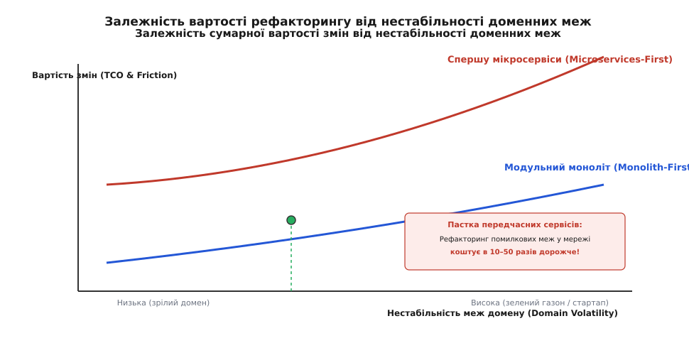
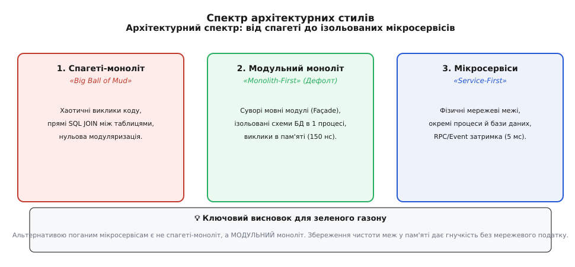
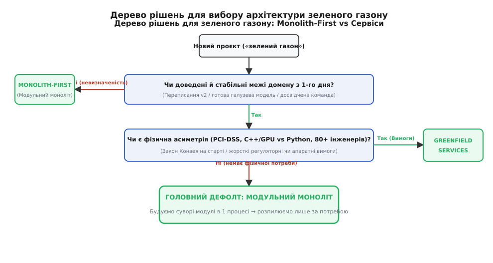

# Monolith-first проти «спершу сервіси»

<preknowlist>
- [Модульний моноліт як дефолт](book:programming/software-design/modular-monolith) — архітектурний стиль монолітного застосунку із суворими внутрішніми межами модулів.
- [Коли виділяти сервіс: критерії та хибні приводи](root:progarch/monolith-vs-microservices/when-to-extract-service) — чотири сили, які роблять мережеву межу обґрунтованою.
- [Закон Конвея](book:programming/software-design/conways-law) — залежність софтверної архітектури від структури комунікації організаційних команд.
- [Обмежений контекст](book:programming/software-design/bounded-context) — концепція DDD для опису явних меж предметної моделі.
</preknowlist>

Команда розробників сервісу «SmartCourier» витратила перші шість місяців роботи стартапу на проектування та розгортання восьми окремих мікросервісів — приймання замовлень, диспетчеризації кур'єрів, розрахунку вартості, гео-навігації, складського обліку, білінгу, розсилки сповіщень та аналітики. Кожен сервіс отримав власний Git-репозиторій, окремий екземпляр бази даних PostgreSQL та розгортався у кластері Kubernetes із налаштованим Service Mesh Istio. Коли бізнес-модель компанії змінила фокус із термінової 15-хвилинної доставки продуктів на планову доставку обідів для офісів, алгоритм розподілу кур'єрів та правила нарахування бонусів довелося змінювати одночасно у п'яти репозиторіях та чотирьох базах даних. Найпростіша зміна бізнес-правила вимагала тритижневих узгоджень REST-контрактів між чотирма інженерними командами, складних миграцій даних між окремими PostgreSQL-інстансами та обробки часткових відмов у асинхронних чергах повідомлень RabbitMQ. Швидкість викочування оновлень впала до нуля, а інфраструктурний чек за Kubernetes та Sidecar-проксі перевищив щомісячний прибуток компанії.

Цей сценарій демонструє класичну пастку, у яку потрапляють проєкти при спробі розкроїти нову систему на сервіси з першого дня («Microservices-First»). Бажання отримати гіпотетичну масштабованість на етапі невизначеності створює найгірший вид софтверної архітектури — розподілений моноліт з високою затримкою та низькою швидкодією розробки.

## Суть стратегії Fowler Monolith-First

Стратегія **Monolith-First**, сформульована Мартіном Фаулером у 2015 році, спирається на базове емпіричне спостереження з практики сотень софтверних проєктів: доменні межі нової системи на етапі її створення є нечіткими й перебувають у стані постійної плинності.

Коли продукт тільки запускається на «зеленому газоні» (greenfield), розробники та бізнес-аналітики не володіють повним знанням про те, які сутності стануть ядрами предметної області, які методи вимагатимуть найвищої частоти викликів і де проходитимуть справжні межі [обмежених контекстів](book:programming/software-design/bounded-context). Якщо на цьому етапі провести фізичні мережеві межі, увівши окремі сервіси та фізично відокремлені бази даних, будь-яка помилка в проведення меж стає надзвичайно дорогою.

```
Зелений газон (High Uncertainty)
   │
   ├─► Помилкові межі у Модульному моноліті
   │      └─► Рефакторинг у пам'яті (move class, 15 хвилин) ──► УСПІХ
   │
   └─► Помилкові межі у Мікросервісах
          └─► Зміна gRPC/HTTP контрактів + CDC миграції (3 тижні) ──► РОЗПОДІЛЕНИЙ МОНОЛІТ
```

Стратегія Monolith-First пропонує будувати нову систему у вигляді моноліта, але приділяти максимальну увагу його внутрішній модуляризації. Лінії розкрою системи розвідуються в ході реальної експлуатації, і лише після того, як межі предметної області стабілізуються, а навантаження чи розмір команди перевищать можливості єдиного процесу, окремі модулі виносяться в мережу.

Детальний історичний огляд виникнення дискусії довкола Monolith-First, конфлікту між Мартіном Фаулером та Стефаном Тількофом, а також гучного досвіду компаній Segment, Istio та Amazon Prime Video наведено у розвідці [Витоки дискусії Monolith-First: від есе Мартіна Фаулера до ретроспектив сегментації](root:progarch/monolith-vs-microservices/monolith-first-or-never/hist-monolith-first-debate.md).

## Фізична ціна та математика дрейфу меж

Головна причина, чому стратегія Monolith-First справджується у більшості випадків — це колосальний розрив у вартості рефакторингу меж усередині одного процесу порівняно з рефакторингом між мережевими сервісами.

### 1. Перенесення коду усередині моноліта

Якщо модуль розрахунку знижок знаходиться у тому самому процесі, що й модуль формування замовлень, зміна їхньої взаємодії вимагає лише оновлення внутрішніх викликів методів та перенесення файлів усередині репозиторію.

Виклик функції усередині одного процесу описується інструкцією процесора `call`. Передача параметрів відбувається через регістри CPU або стек за 10–150 наносекунд. Процесорний кєш L1/L2 залишається гарячим, компілятор здійснює повну статичну перевірку типів, а ймовірність виникнення мережевого таймауту або втрати зв'язку дорівнює нулю.

### 2. Перенесення коду між мікросервісами

Якщо ті самі два модулі винесені в окремі мережеві сервіси `PricingService` та `OrderService`, перенесення бізнес-логіки перетворюється на багатоетапну операцію:
- Зміна або депрекація gRPC/REST контрактів;
- Створення проміжних згладжувальних фасадів для забезпечення зворотної сумісності;
- Написання та тестування логіки повторних спроб (retries) та тайм-аутів;
- Миграція даних між фізично ізольованими базами даних через інструменти Change Data Capture (CDC) або ETL-скрипти;
- Обробка ситуацій, коли один із сервісів тимчасово недоступний.

Практичний кодовий приклад виконання рефакторингу в Модульному моноліті проти сервісного виклику з обробкою мережевих відмов мовами C++ та TypeScript наведено у проєктному розборі [Вартість рефакторингу меж: порівняння перенесення коду в модульному моноліті та між мікросервісами](root:progarch/monolith-vs-microservices/monolith-first-or-never/proj-boundary-refactor-cost.md).



*Залежність вартості рефакторингу від волатильності домену: на зеленому газоні (висока волатильність) вартість еволюції мікросервісів зростає експоненціально.*

Формальну математичну модель, яка обчислює критичний поріг волатильності домену `D_drift*` та доводить недоцільність сервісного розкрою при нестійких межах, наведено у математичному розборі [Математична модель доцільності Monolith-First: поріг складності предметної області та інфраструктурного накладного чеку](root:progarch/monolith-vs-microservices/monolith-first-or-never/math-monolith-first-tradeoff.md).

## П'ять крайових випадків для «Microservices-First»

Попри переконливість стратегії Monolith-First, її перетворення на абсолютну догму є небезпечним спрощенням. Існують конкретні інженерні ситуації, коли розгортання мікросервісів із першого дня є обґрунтованим і єдино правильним рішенням.

Розглянемо детально п'ять обґрунтованих сценаріїв для негайного сервісного розкрою («Greenfield Microservices»):

### 1. Доведені та стабільні доменні межі з першого дня

Якщо розробка здійснюється не для стартапу з невизначеною бізнес-моделлю, а для добре вивченої галузі, де межі обмежених контекстів доведені десятиліттями експлуатації або попередньою версією системи (System v2), ризик помилкового розкрою прямує до нуля.

Приклади:
- Переписання застарілого моноліта (Legacy Rewrite), де доменна модель є повністю зрозумілою та зафіксованою;
- Побудова стандартних галузевих систем, таких як білінг за стандартом TM Forum або поштовий шлюз, де контракти та структури даних регламентовані міжнародними специфікаціями.

### 2. Жорстка асиметрія технологічного стека та фізичні обмеження

Коли різні модулі системи вимагають принципово різних середовищ виконання, мов програмування або апаратних ресурсів, поєднання їх у єдиному монолітному процесі є технічно недоцільним або фізично неможливим.

Приклади:
- **Обчислювальна асиметрія:** Сервіс обробки відеопотоків або аналізу медичних знімків на базі машинного навчання вимагає мов C++/CUDA, прискорювачів GPU та специфічних системних бібліотек, у той час як веб-портал адміністрування створюється на TypeScript/Node.js або Python;
- **Режим навантаження:** Гео-телеметричний шлюз приймає 100 000 асинхронних UDP-пакетів на секунду через високонавантажений рантайм Go/Elixir, а модуль генерації щомісячних фінансових звітів виконує важкі SQL-запити раз на добу.

### 3. Межі регуляторного комплаєнсу та безпеки

Вимоги до безпеки даних можуть зробити монолітний підхід катастрофічно дороговартісним із точки зору юридичного та інфраструктурного аудиту.

Приклад:
Якщо система обробляє транзакції банківських карток і підпадає під суворий аудит стандарту **PCI-DSS Level 1**, розміщення платіжного модуля у спільному моноліті автоматично розширює контур аудиту на **весь монолітний застосунок** та всіх інженерів компанії. Виділення платіжного модуля у крихітний, фізично ізольований мікросервіс із першого дня звужує контур аудиту до двох таблиць і одного репозиторію, зберігаючи високу швидкість розробки для решти системи.

### 4. Організаційний масштаб закону Конвея з першого дня

За [законом Конвея](book:programming/software-design/conways-law), структура софтверної системи дзеркально відображає структуру комунікації організації.

Якщо велика корпорація запускає новий масштабний проєкт і з першого дня виділяє під нього 80–100 інженерів, розділених на 10 окремих продуктових команд, спроба змусити їх працювати в єдиному монолітному репозиторії створить колосальне тертя:
- Черги на проходження CI/CD пайплайнів;
- Постійні конфлікти при злитті гілок (Merge Conflicts);
- Розмивання відповідальності за стабільність продуктового середовища.

У цьому випадку виділення сервісних меж з першого дня слугує інструментом забезпечення соціотехнічної автономії команд.

### 5. Асиметрія частоти викочування релізів (Release Velocity Disparity)

Якщо один із модулів вимагає безперервного розгортання (Continuous Deployment) по 30 разів на день для проведення маркетингових A/B експериментів, а інший є консервативним ядром фінансового обліку, що проходить тривале регресійне тестування перед релізом раз на місяць, їхнє знаходження в одному процесі стає руйнівним.

Мережева межа дозволяє продуктовій команді котити свій код 30 разів на день, не запитуючи дозволу у команди фінансового обліку й не ризикуючи пошкодити їхній стан.

## Помилкова альтернатива: Спагеті-моноліт проти Модульного моноліта

Найчастіша причина, чому інженери прагнуть будувати мікросервіси на зеленому газоні — це травматичний досвід роботи з занедбаними монолітами, які перетворилися на «великий ком бруду» (Big Ball of Mud).

Проте важливо усвідомити: **альтернативою поганим мікросервісам є не спагеті-моноліт, а Модульний моноліт**.



*Архітектурний спектр: Модульний моноліт поєднує сувору модуляризацію та чистоту меж із відсутністю мережевого податку.*

### Порівняння трьох архітектурних станів

| Критерій | Спагеті-моноліт | Модульний моноліт | Мікросервіси |
| :--- | :--- | :--- | :--- |
| **Фізичні межі** | 1 процес | 1 процес | N мережевих процесів |
| **Межі даних** | Спільна база, прямі SQL JOIN | Ізольовані схеми/таблиці для кожного модуля | Фізично окремі БД |
| **Взаємодія модулів** | Хаотичні прямі виклики класів | Публічний фасад (Façade / API модуля) | gRPC / REST / Kafka |
| **Затримка виклику** | 150 наносекунд | 150 наносекунд | 2–15 мілісекунд |
| **Транзакції** | Спільна ACID транзакція | Спільна ACID транзакція | Saga / Eventual Consistency |
| **Дисципліна меж** | Відсутня (ком бруду) | Гарантована мовними інструментами | Гарантована мережею |

[Модульний моноліт](book:programming/software-design/modular-monolith) дозволяє будувати систему із суворою ізоляцією модулів на рівні мовних пакетів, приватних класів та окремих баз даних (або логічних схем), зберігши при цьому атомарність транзакцій та високу швидкість виконання викликів у пам'яті.

## Практична реалізація Модульного моноліта в мовних екосистемах

Реалізація суворих модульних меж залежить від використаного стек технологій. Сучасні мови програмування надають вбудовані інструменти для запобігання протіканню абстракцій усередині монолітного процесу:

### 1. C++ (Модулі C++20 та CMake Target Visibility)
У C++20 з'явилася офіційна підтримка модулів (`export module app.orders;`). Компілятор фізично забороняє імпортувати класи та функції, які не позначені ключовим словом `export`. На рівні системи збірки CMake ізоляція модулів гарантується через `target_link_libraries(orders PRIVATE core_domain)` — модуль Orders може бачити лише абстракції публічного заголовочного файла Core Domain, але не бачить внутрішніх деталей реалізації інших модулів.

### 2. Java / Kotlin (JPMS та Spring Modulith)
У мові Java починаючи з версії 9 впроваджено систему модулів **JPMS** (Java Platform Module System), де у файлі `module-info.java` явно вказуються викриті пакети (`exports`) та необхідні залежності (`requires`). Фреймворк **Spring Modulith** дозволяє аннотувати доменні модулі та під час запуску юніт-тестів автоматично перевіряти архітектурний граф за допомогою бібліотеки **ArchUnit**. Якщо клас із модуля `Orders` намагається напряму імпортувати приватний репозиторій із модуля `Pricing`, ArchUnit негайно валить компиляцію проєкту.

### 3. Go (Пакетна ізоляція internal/)
У мові Go компілятор підтримує суворе правило `internal/`: будь-який пакет, розміщений у теці `internal/`, може бути імпортований лише тими пакетами, які знаходяться у тій самій батьківській теці. Спроба імпортувати `app/orders/internal/repository` з пакета `app/pricing` призведе до помилки компіляції. Це дозволяє розробникам створювати чистий публічний фасад у теці `app/orders`, приховуючи всі деталі реалізації.

### 4. TypeScript / Node.js (Nx Monorepo та ESLint Boundaries)
У середовищі Node.js ізоляція гарантується за допомогою монорепозиторних інструментів Nx або Turborepo. Правило плагіна ESLint `@nx/enforce-module-boundaries` визначає допустимі напрямки імпортів між бібліотеками. Якщо розробник у фронтенді чи бекенді намагається зробити відносний імпорт `import { PrivateService } from '../../pricing/src/lib/private.service'`, ESLint блокує збірку з повідомленням про порушення меж домену.

## Сувора ізоляція даних усередині моноліта

Ключовим фактором стійкості Модульного моноліта є **відмова від спільних таблиць та SQL JOIN між модулями**.

```
База даних Модульного моноліта (PostgreSQL)
  ├── Схема schema_orders
  │     ├── Таблиця orders (Доступ лише з OrderModule)
  │     └── Таблиця order_items
  │
  ├── Схема schema_pricing
  │     ├── Таблиця discount_rules (Доступ лише з PricingModule)
  │     └── Таблиця promo_codes
  │
  └── Правило безпеки: Прямий JOIN між schema_orders та schema_pricing — ЗАБОРОНЕНО!
```

Щоб гарантувати збереження меж даних у моноліті:
- Кожен модуль отримує власну логічну схему БД (`schema_orders`, `schema_pricing`, `schema_fleet`);
- Для кожного модуля створюється окремий користувач БД з обмеженими правами (`GRANT SELECT, INSERT ON schema_orders.* TO orders_db_user`);
- Спільні вибірки реалізуються або через виклик у пам'яті публічного методу сусіднього модуля, або через асинхронні доменні події усередині процесу (In-Memory Outbox Pattern).

Цей підхід дає головну перевагу: якщо у майбутньому модуль `Pricing` дійсно вимагатиме відокремлення у мікросервіс, його база даних вже є фізично ізольованою, а код не містить прямих SQL-залежностей від сусідніх таблиць. Виділення сервісу перетвориться на просту зміну мовного виклику на gRPC-транспорт.

## Покроковий конвеєр виділення сервісу (The 4-Stage Extraction Pipeline)

Коли Модульний моноліт виростає і в одному з його модулів виникає обґрунтований критерій (наприклад, асиметричний масштаб відеокодувальника або PCI-DSS комплаєнс), виділення в мережу виконується безболісно за чотири кроки:

1. **Етап 1: Стабілізація мовного фасаду.** Перевіряємо, що модуль спілкується з рештою моноліта виключно через публічний фасадний інтерфейс. Всі прямі виклики приватних методів чи класів ліквідовуються;
2. **Етап 2: Виділення логічної схеми бази даних.** Відокремлюємо таблиці модуля в окрему схему PostgreSQL, забороняємо прямі SQL `JOIN` та переводимо зв'язки між даними на ідентифікатори (Foreign Keys заступаються бізнес-ID);
3. **Етап 3: Перехід на асинхронні події в пам'яті.** Синхронні виклики між модулями замінюються на випуск доменних подій через внутрішньопроцесорну шину подій (In-Memory Event Bus);
4. **Етап 4: Фізичне винесення в мережу (Strangler Fig).** Модуль виноситься в окремий контейнер Docker, а внутрішній фасадний виклик замінюється на мережевий gRPC/HTTP клієнт. Завдяки попереднім крокам ця зміна стосується лише транспорту й не ламає бізнес-логіку.

## Операційний TCO: Моноліт проти Сервісів

Вибір між Моноліт-First та Сервісами визначає не лише структуру коду, але й щомісячні операційні витрати компанії (Total Cost of Ownership):

### 1. Складність CI/CD конвеєрів
- **У моноліті:** Один монорепозиторій, один пайплайн збірки та розгортання. Рефакторинг меж тестується за один прогін юніт-тестів;
- **У мікросервісах:** N Git-репозиторіїв, N пайплайнів, інструменти синхронізації версій API, Consumer-Driven Contract testing (Pact), стейджинг-середовища з десятків контейнерів.

### 2. Налагодження (Observability)
- **У моноліті:** Локальний налагоджувач підключається до одного процесу. Стектрейс помилки містить повну послідовність викликів від контролера до бази даних;
- **У мікросервісах:** Помилка розмазана між N сервісами. Вимагає прокидання заголовків `traceparent`, впровадження OpenTelemetry, збору логів у Loki/Elasticsearch та аналізу мережевих дампів у Jaeger/Zipkin.

## П'ять небезпечних міфів про Monolith-First

При прийнятті рішення щодо вибору архітектури розробники часто керуються поширеними міфами:

1. **Міф 1: «Monolith-First означає написання спагеті-коду».**
   *Реальність:* Monolith-First вимагає проектування Модульного моноліта. Відсутність мережевої межі не означає відсутність дисципліни модуляризації.
2. **Міф 2: «Ми легко поріжемо моноліт пізніше, коли з'явиться час».**
   *Реальність:* Неможливо порізати немодуляризований спагеті-моноліт. Дисципліна меж модулів та ізоляція схем даних повинна впроваджуватися в CI/CD з 1-го дня.
3. **Міф 3: «Мікросервіси потрібні для частого Continuous Deployment».**
   *Реальність:* Сучасні Модульні моноліти з швидким часом компиляції легко деплояться по 10–20 разів на день за допомогою канареєчних розгортань (Canary Deployments).
4. **Міф 4: «Мікросервіси автоматично підвищують відмовостійкість системи».**
   *Реальність:* Синхронні міжсервісні HTTP-виклики зменшують підсумкову доступність ланцюга за законом `A_chain = ∏ A_i`. Без складних паттернів Circuit Breaker мікросервіси падають каскадно.
5. **Міф 5: «Можна мати мікросервіси, які працюють зі спільною базою даних».**
   *Реальність:* Спільна база даних для кількох сервісів — це найгірший вид розподіленого моноліта, який поєднує високу мережеву затримку з блокуваннями таблиць та миграційним пеклом.

## Дерево рішень для зеленого газону (Greenfield Framework)

Для вибору між стратегією Monolith-First та негайним сервісним розкроєм на зеленому газоні слід використовувати послідовний алгоритм прийняття рішень:



*Покроковий алгоритм прийняття архітектурного рішення для нового проєкту на зеленому газоні.*

### Покрокові запитання для архітектора:

1. **Чи є межі предметної області повністю стабільними й доведеними з 1-го дня?**
   - *Ні:* Приймаємо **Monolith-First** (Модульний моноліт).
   - *Так:* Переходимо до кроку 2.
2. **Чи існують жорсткі вимоги до асиметрії ресурсів, PCI-DSS комплаєнсу або розробки на гетерогенних мовах (C++/GPU vs Python)?**
   - *Так:* Виділяємо специфічні модулі у **Greenfield Microservices**.
   - *Ні:* Переходимо до кроку 3.
3. **Чи перевищує розмір команди розробки з 1-го дня 50+ інженерів із наявним поділом на автономні продуктові підрозділи?**
   - *Так:* Застосовуємо **Greenfield Microservices** для забезпечення автономії команд.
   - *Ні:* Приймаємо **Monolith-First** (Модульний моноліт).

Головний дефольт архітектури — будувати Модульний моноліт, зберігати чистоту меж у пам'яті та виконувати виділення окремих сервісів за методикою [Коли виділяти сервіс](root:progarch/monolith-vs-microservices/when-to-extract-service) лише тоді, коли для цього виникають виміряні фізичні або соціотехнічні сили.
