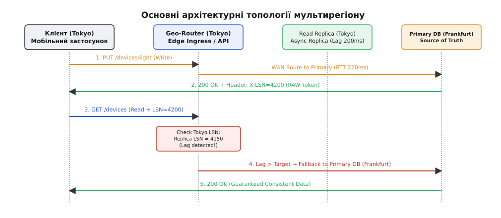
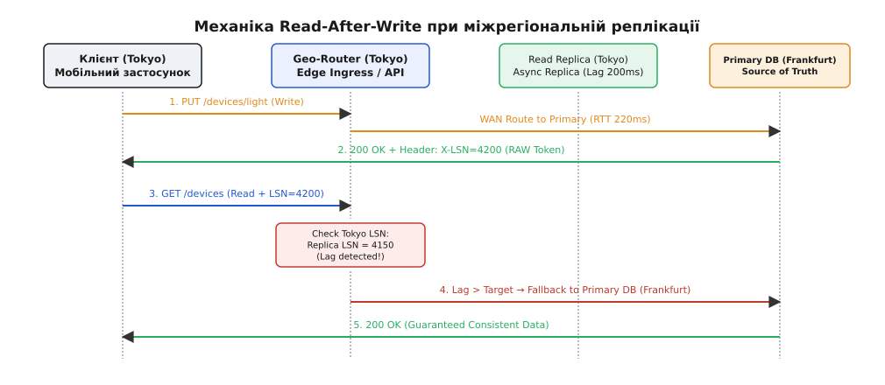

# Топології мультирегіону

<preknowlist>
- [Лідер-фоловер і мультилідерна реплікація](book:programming/distributed-systems/replication-leader-follower) — механізми синхронізації стану між вузлами в мережі.
- [Шардинг та партиціювання](book:programming/distributed-systems/partitioning-sharding) — горизонтальне розбиття даних за ключами або територіями.
- [CAP-теорема та PACELC](book:programming/distributed-systems/cap-theorem) — межі узгодженості, доступності й латентності у розподілених системах.
- [Розподіл навантаження DH](root:progarch/scale-and-load/load-distribution-dh) — L4/L7 балансування та гео-маршрутизація трафіку.
</preknowlist>

Коли платформа Digital Homes розростається від єдиного дата-центру у Франкфурті до обслуговування 50 мільйонів активних розумних будинків по всьому світу — від Берліна й Нью-Йорка до Токіо та Сіднея, — архітектура системи наражається на непохитну стіну фізики: затримку поширення сигналу в оптоволоконних кабелях (Round-Trip Time, RTT). Мобільний застосунок мешканця у Токіо, який намагається відкрити панель керування будинком, надсилає TCP-запит через міжконтинентальний підводний кабель до Франкфурта. Фізична відстань у 9 350 кілометрів створює мінімальне запізнення сигналу в 220 мілісекунд на кожне мережеве коло. Якщо для відображення інтерфейсу застосунок виконує 4 послідовні API-виклики, користувач чекає понад секунду лише на пересилання пакетів крізь океан — незалежно від того, наскільки потужні сервери та як швидко оптимізовано SQL-запити.

Окрім латентності, прив'язка платформи до єдиного центрального дата-центру створює точку катастрофічної відмови (Single Point of Failure). Будь-яка локальна аварія — знеструмлення регіонального вузла, пожежа у машиній залі або розрив магістрального оптичного кабелю в Атлантиці — миттєво знеструмлює мобільне керування для десятків мільйонів людей на всій планеті. Щоб подолати затримку світла та забезпечити безперервну стійкість до катастроф, архітектура застосунку мусить вийти за межі одного центрів обробки даних і розгортатися у **кількох географічних регіонах (Multi-Region Topology)**.

Проте рознесення обчислень та баз даних на різні континенти кардинально змінює закони узгодженості: синхронізація стану між регіонами стає повільною або втрачає гарантії невідкладності, а спроба писати в бази даних одночасно на різних материках призводить до конфліктів і розщеплення мережі.

---

## Прірва відстані та фізичні межі латентності

Спроба розглядати мережу як прозору безмежну трубу з нульовою затримкою — одна з найнебезпечніших оман розподілених обчислень. Усередині одного дата-центру мережевий RTT між серверами становить від `0.1` до `1.0` мілісекунди, що дозволяє виконувати синхронні виклики та розподілені транзакції майже непомітно для користувача. Проте при виході на міжконтинентальний рівень швидкість світла у прозорому склі оптичного волокна (`v ≈ 204 190 км/с`) накладає суворі часові обмеження.

Детально [математичну модель RTT та пропускної здатності міжрегіональних каналів](root:progarch/scale-and-load/multi-region-topologies/math-rtt-replication-latency.md) виведено в окремому матеріалі. При розрахунку реальних трас із урахуванням коефіцієнтів згину кабелів та затримок у комутаторах отримуємо наступні неминучі затримки в один бік і назад (RTT):

- **Франкфурт ↔ Київ:** `25 – 28 мс`
- **Франкфурт ↔ Північна Вірджинія (США):** `78 – 85 мс`
- **Франкфурт ↔ Токіо (Японія):** `210 – 235 мс`

Ці числа означають, що при використанні протоколу TCP з рукостисканням TLS 1.3 встановлення нового захищеного з'єднання з Токіо до Франкфурта вимагає 2 RTT, тобто `440 – 470 мс` ще до того, як буде передано перший байт корисної відповіді API. Навіть використання сесійних квітків TLS 0-RTT скорочує цей час лише на 1 RTT, залишаючи мінімальну затримку на рівні `220 мс`.

Окрім латентності одиночного пакета, великий RTT обмежує пропускну здатність каналів реплікації через механіку вікна прийому TCP (Bandwidth-Delay Product, BDP). Для 10-гігабітного міжконтинентального каналу між Франкфуртом та Вірджинією обсяг даних «у польоті» становить понад `100 МБ`. Якщо системні буфери TCP не налаштовані на відповідне динамічне розширення, реальна швидкість передачі журналу реплікації деградує з 10 Гбіт/с до жалюгідних 6.5 Мбіт/с.

Згідно з теоремою PACELC (розширенням CAP-теореми), навіть за відсутності мережевих розривів (`P — Partition`), архітектор змушений обирати між латентністю (`L — Latency`) та узгодженістю (`C — Consistency`). Якщо ми вимагаємо строгої синхронної реплікації даних між Франкфуртом та Токіо при кожній зміні стану пристрою, кожна операція запису чекатиме `220 мс` підтвердження з іншого боку планети. Якщо ж ми обираємо низьку затримку та записуємо дані локально у Токіо, ми втрачаємо миттєву узгодженість і наражаємося на ризик втрати або розходження даних при асинхронній синхронізації.

Для розв'язання цієї дилеми індустрія сформувала три основні архітектурні топології мультирегіону, кожна з яких пропонує власний баланс між латентністю, складністю та ризиками відмови.

---

## Топологія Active-Passive (Disaster Recovery)

Топологія Active-Passive (Active-Standby) є найпростішою формою мультирегіональності, головна мета якої — забезпечення виживання системи під час тотальної аварії основного дата-центру (Disaster Recovery, DR).

У цій конфігурації один географічний регіон оголошується **основним (Primary Region)**, а другий — **резервним (Secondary / Standby Region)**.


*Порівняння трьох топологій: Active-Passive забезпечує аварійний резерв; Global Read / Single Write прискорює читання глобально; Active-Active з локальними записами знімає мережеві затримки на записи.*

### Механіка роботи Active-Passive

1. **Нормальний режим:** 100% користувацького трафіку (і читання, і записи) через географічний DNS (GeoDNS) або Anycast BGP спрямовується до Primary-регіону (Франкфурт). Там працюють усі безвинятку API-вузли та головна база даних (Primary Master DB).
2. **Асинхронна реплікація:** База даних у Франкфурті фоново відправляє журнал передзапису (Write-Ahead Log, WAL) або бінарний журнал транзакцій у резервний регіон (Вірджинія). Резервна база даних перебуває у режимі постійного відновлення з журналу (Standby Replica).
3. **Аварійний режим (Failover):** При падінні Франкфурта моніторингові системи або чергові інженери змінюють маршрутизацію трафіку на Вірджинію, а резервну базу даних підвищують до статусу Primary Master (Promote to Primary).

Розрізняють три рівні готовності пасивного регіону:
- **Cold Standby (Холодний резерв):** Обчислювальні вузли у резервному регіоні вимкнені або відсутні, а дані зберігаються у вигляді резервних копій (Backups/Snapshots) в об'єктному сховищі. Час відновлення (RTO) становить години.
- **Warm Standby (Теплий резерв):** Резервна база даних працює і приймає реплікацію, але обчислювальний кластер (API Worker) зменшений до мінімального розміру (наприклад, 10% потужності). При аварії потрібен час на автоскейлінг серверів.
- **Hot Standby (Гарячий резерв):** API-вузли та сервіси розгорнуті у резервному регіоні у повній бойовій готовності та готові прийняти 100% трафіку за лічені секунди після переключення DNS.

### Метрики стійкості: RTO та RPO

Оцінка ефективності Active-Passive топології виконується за двома фундаментальними метриками:
- **RTO (Recovery Time Objective):** Максимально допустимий час простою системи від миті відмови Primary-регіону до повного відновлення обслуговування у Standby-регіоні. Для Hot Standby цільовий RTO становить 1–5 хвилин, необхідних на оновлення DNS та виявлення збою.
- **RPO (Recovery Point Objective):** Максимально допустимий обсяг втрачених даних, виражений у часі. Якщо асинхронний лаг реплікації між Франкфуртом та Вірджинією становив `3 секунди` у мить кабельного розриву, то всі транзакції, записані за ці 3 секунди, будуть неповоротно втрачені при аварійному переключенні (`RPO = 3s`).

Детально [історію розвитку мультирегіональних архітектур від холодного DR до TrueTime](root:progarch/scale-and-load/multi-region-topologies/hist-multi-region-lineage.md) розібрано в історичному екскурсі.

### Пастка Split-Brain та механізми огорожі (Fencing)

Найбільша небезпека топології Active-Passive полягає у **помилковому спрацюванні автоматичного переключення (False Failover)**, яке призводить до стану **розщеплення мозку (Split-Brain)**.

Якщо міжмережевий канал між Франкфуртом та Вірджинією розривається, але обидва дата-центри залишаються повністю справними, моніторинговий агент у Вірджинії бачить втрату зв'язку з Франкфуртом. Якщо агент автоматично підвищить резервну базу у Вірджинії до статусу Primary, у системі виникнуть **два активних Primary-вузли**:
- Користувачі з Європи продовжують писати у Франкфурт.
- Користувачі з Америки починають писати у Вірджинію.

Обидва дата-центри приймають записи та модифікують ті самі рядки баз даних під однаковими ідентифікаторами. Коли міжрегіональний зв'язок відновлюється, реплікація зупиняється з конфліктом: розібрати суперечливі WAL-журнали без втрати чи спотворення бізнес-даних стає математично неможливо.

Окрім псування даних, переключення DNS супроводжується проблемою **кешування TTL на проксі-серверах та у клієнтах**. Навіть якщо авторитативний DNS-сервер оновив A-запис з IP Франкфурта на IP Вірджинії із TTL = 60 секунд, мільйони мобільних пристроїв та провайдерських кешувальних DNS-серверів продовжують надсилати трафік на старий IP протягом 5–15 хвилин, ігноруючи RFC. Це призводить до підплішування запитів та нерівномірного розгону навантаження на резервному майданчику.

Для запобігання Split-Brain застосовують **токени епохи (Epoch Tokens / Generation Numbers)** та **механізми огорожі (Fencing / STONITH — Shoot The Other Node In The Head)**. Кожен вибір нового Primary супроводжується інкрементом номера епохи (наприклад, `Epoch 42 → 43`). База даних та обчислювальні вузли відхиляють будь-яку команду від старого Master, чий номер епохи нижче за поточний. Перед підвищенням Standby-репліки оркестратор за допомогою апаратних засобів (IPMI/PDU) або хмарного API знеструмлює або мережево ізолює старий Primary-вузол. Якщо віддалене знеструмлення неможливе, рішення про переключення залишають за **ручною авторизацією чергового інженера (Manual Failover)** або за підтвердженням **третього незалежного регіону-арбітра (Quorum Witness)**.

---

## Топологія Global Read / Single Write

Коли система Digital Homes виростає до мільйонів користувачів, топологія Active-Passive перестає влаштовувати бізнес через високу затримку читання: клієнти з Азії та Америки змушені гоняти кожен `GET`-запит до Франкфурта.

При цьому профілю навантаження платформи притаманна різка асиметрія: співвідношення читань стану пристроїв до записів нових команд становить `100:1` або `1000:1`.

Це робить доцільним перехід до топології **Global Read / Single Write (Глобальне читання, єдиний запис)**.

### Принцип роботи

1. **Єдине джерело запису (Primary Master):** Усі операції зміни стану (`POST`, `PUT`, `DELETE`) з усього світу маршрутизуються до єдиного Primary-вузла бази даних у Франкфурті.
2. **Локальні Read-репліки (Read Replicas):** У віддалених регіонах (Вірджинія, Токіо) розгортаються локальні API-вузли та локальні репліки бази даних у режимі «лише для читання» (Read-Only).
3. **Локальне читання:** Запити `GET /api/v1/homes/{id}/devices` від мобільних застосунків у Токіо обробляються локально у токіоському дата-центрі за `10 – 15 мс`, оскільки дані зчитуються з локальної Read-репліки.
4. **Асинхронний потік оновлень:** Зміни, внесені у Франкфурті, безперервно транслюються крізь міжконтинентальний канал на усі Read-репліки світу.

### Проблема Replication Lag та втрата узгодженості Read-After-Write

Головний архітектурний виклик цієї топології — **асинхронний лаг реплікації (Replication Lag)**.

Уяви ситуацію: мешканець у Токіо відкриває застосунок і натискає кнопку «Увімкнути світло у вітальні».
1. Запит `PUT /devices/dev-42` іде через океан до Франкфурта (`RTT = 220 мс`).
2. Primary DB у Франкфурті успішно змінює стан реле на `on` і повертає відповідь `200 OK`.
3. Мобільний застосунок у Токіо отримує `200 OK` і негайно робить повторний запит `GET /devices`, щоб оновити інтерфейс.
4. Запит `GET` потрапляє на **локальну Read-репліку у Токіо**.
5. Проте зміна з Франкфурта ще перебуває «у польоті» в оптоволоконному кабелі через океан (асинхронний лаг `200 мс`).
6. Локальна репліка у Токіо повертає старий стан: світло `off`.

Користувач бачить, що перемикач на екрані повернувся у вимкнений стан, натискає кнопку повторно і вважає застосунок зламаним. Це класична аномалія втрати **причинної узгодженості (Causal Consistency)**, а саме гарантії **«прочитай власний запис» (Read-Your-Own-Writes / Read-After-Write, RAW)**.


*Причинна узгодженість RAW: якщо локальна Read-репліка відстає від токена LSN, отриманого при записі, маршрутизатор тимчасово перенаправляє читання на Primary DB.*

### Тактики забезпечення Read-After-Write

Для усунення цієї аномалії в топології Global Read / Single Write застосовують дві основні тактики:

#### 1. Сесійна приклеєність запису (Session Write Stickiness)

Після виконання будь-якої операції запису API-шлюз встановлює у сесійну куку або заголовок мобільного клієнта часову позначку `write_timestamp`. Протягом наступних `N` секунд (наприклад, 5 секунд, що гарантовано перекривають типовий лаг реплікації) **усі запити читання цього конкретного користувача перенаправляються на Primary DB у Франкфурт**. Після завершення таймера читання повертаються на швидку локальну Read-репліку.

#### 2. Токени узгодженості LSN (Monotonic Read Tokens)

При виконанні запису Primary DB повертає у заголовку відповіді `X-LSN` поточний номер позиції транзакційного журналу (наприклад, `LSN = 4200`). Мобільний застосунок зберігає цей токен і передає його у заголовку наступного запиту читання `GET`.

Гео-маршрутизатор на вхідному Edge-вузлі порівнює `X-LSN` з токена з поточним `LSN` локальної Read-репліки:
- Якщо `Replica_LSN ≥ 4200` — репліка вже догнала запис, читання виконується локально (`15 мс`).
- Якщо `Replica_LSN < 4200` — виявлено лаг реплікації! Маршрутизатор тимчасово перенаправляє запит на Primary DB у Франкфурт.

Повний робочий приклад [маршрутизатора гео-запитів із підтримкою причинної узгодженості Read-After-Write](root:progarch/scale-and-load/multi-region-topologies/proj-multi-region-router.md) зібрано у кодовому прикладі.

---

## Топологія Active-Active з локальними записами

Топологія Global Read / Single Write повністю розв'язує проблему швидкості читання, проте залишає записи повільними (`220 мс` RTT для віддалених регіонів). Якщо розумний будинок у Токіо надсилає телеметрію давачів руху або виконує локальні сценарії автоматизації через хмару, чекати на міжконтинентальний круг для кожного запису стає неприпустимим.

Топологія **Active-Active (Multi-Primary)** дозволяє приймати операції запису та читання **локально у кожному географічному регіоні**.

Проте спроба дозволити довільний запис будь-яких даних у будь-якому регіоні без спеціальної структури призводить до конфліктного пекла: один і той самий рядок бази даних модифікується одночасно у Франкфурті та Токіо, створюючи суперечливі версії стану.

Щоб Active-Active працював у реальному проді, застосовують дві фундаментальні моделі: **Географічне партиціювання** та **Конфліктне злиття (Conflict Resolution)**.

### Model A: Географічне партиціювання (Home-Region Affinity)

Найбільш надійним та широко застосовуваним підходом до Active-Active є **прив'язка власника даних до домашнього регіону (Tenant / Home-Region Partitioning)**.

У системі Digital Homes кожен розумний будинок належить до конкретної географічної локації:
- Будинок `h-101` у Берліні прив'язаний до **Домашнього регіону Франкфурт (`eu-central-1`)**.
- Будинок `h-202` у Кіото прив'язаний до **Домашнього регіону Токіо (`ap-northeast-1`)**.

#### Правила маршрутизації

1. **Локальний запис:** Усі записи та читання для будинку `h-202` обробляються **Master-базою даних регіону Токіо**. Для мешканця Кіото латентність запису становить `< 15 мс`, оскільки Primary-джерело правди для його будинку знаходиться поруч.
2. **Асинхронний глобальний фоновий зв'язок:** Дані будинку `h-202` асинхронно реплікуються у Франкфурт та Вірджинію лише як ненавантажений аварійний резерв (Read Replica / Backup Target).
3. **Відсутність конфліктів запису:** Оскільки права на запис будинку `h-202` належать виключно кластеру Токіо, двох конкуруючих записів у різних регіонах **не виникає в принципі**.

Географічне партиціювання усуває міжрегіональні конфлікти для 99% операцій, оскільки дані розумного будинку жорстко локалізовані. Якщо власник будинку переїжджає на інший континент, перенесення домашнього регіону виконується як планова процедура міграції тенента (Tenant Relocation) з тимчасовим переведенням будинку у режим «лише читання».

### Model B: Локальні записи з розв'язанням конфліктів

Що робити з даними, які є принципово глобальними або спільними для кількох регіонів (наприклад, глобальний каталог користувачів, міжрегіональний шеринг доступу до будинку чи баланс коштів на рахунку)?

При виконанні локальних записів у різних регіонах виникає вилка конфліктів, яка вимагає алгоритмічного розв'язання:

#### 1. Last Write Wins (LWW — Перемагає останній запис)

База даних приймає всі записи у всіх регіонах, присвоюючи кожній операції фізичну часову позначку (Physical Timestamp). При реплікації конфліктних записів перемагає запис із більшою позначкою часу, а старий запис тихо перезаписується.

> ⚠️ **Пастка LWW:** Годинники на різних серверах у мережі схильні до фізичного дрейфу (Clock Skew). Якщо годинник у Франкфурті поспішає на `150 мс` відносно Токіо, то запис із Франкфурта буде систематично вбивати свіжіші записи з Токіо, спричиняючи тиху втрату даних (Silent Data Loss).

#### 2. Векторні годинники та початкове розгалуження (Vector Clocks & Tombstones)

Для відстеження причинно-наслідкових зв'язків між операціями замість фізичного часу застосовують **векторні годинники (Vector Clocks / Lamport Timestamps)**. Кожен регіон підтримує вектор лічильників `[EU: 4, US: 2, AP: 5]`. Якщо дві операції відбулися паралельно без знання одна про одну, векторний годинник показує конфлікт (Concurrent Divergence). База даних береже обидва варіанти значення у вигляді розгалуження (Siblings) та вимагає від клієнтського застосунку свідомого злиття на боці читача. При видаленні об'єктів створюються спеціальні маркери видалення (**Tombstones**), які запобігають «воскресінню» видалених даних старими репліками.

#### 3. Безконфліктні репліковані типи даних (CRDT)

Для математично коректного Active-Active без втрати даних та без розгалужень застосовують структури даних **CRDT (Conflict-free Replicated Data Types)**:
- **State-based CRDT (CvRDT):** Регіони обмінюються повними станами, які об'єднуються за допомогою напівгратки (semilattice) через математично комутативну, асоціативну та ідемпотентну операцію `join()` (наприклад, `max()`).
- **Operation-based CRDT (Pn-Counters, OR-Set):** Замість підстави значення регіони обмінюються операціями приросту/зменшення (наприклад, лічильник спожитої електроенергії чи множина підключених пристроїв).

Використання CRDT дозволяє кластерам у Франкфурті та Токіо приймати записи незалежно і гарантує, що при відновленні зв'язку обидві бази даних прийдуть до **однакового кінцевого стану (Eventual Consistency)** без застосування блокувань.

---

## Консолідація баз даних та сучасний Global Data Plane

Традиційний підхід до побудови мультирегіону вимагав від інженерної команди вручну обв'язувати окремі екземпляри PostgreSQL чи MySQL скриптами асинхронної реплікації, налаштовувати роутери та самостійно обробляти міграції схем у кожному регіоні.

Сучасний розвиток систем зберігання привів до появи концепції **Global Data Plane (Єдина глобальна площина даних)** на основі баз даних класу **NewSQL** (Google Spanner, CockroachDB, YugabyteDB) та міжрегіональної подієвої шини (Multi-Region Event Mesh на основі Apache Kafka / MirrorMaker 2.0).

### Консенсус Raft / Paxos замість асинхронних реплік

Замість асиметричного поділу на Master та Read-Replicas, глобальна NewSQL-база даних розбиває усі таблиці на дрібні діапазони ключів (Ranges / Tablets). Кожен діапазон даних управляється власною **групою консенсусу Raft або Paxos**, репліки якої географічно розподілені між регіонами.

```
Таблиця "Homes" → Range 1 (h-001..h-500)   → Raft Group 1 (EU-Leader, US-Follower, AP-Follower)
               → Range 2 (h-501..h-1000)  → Raft Group 2 (AP-Leader, EU-Follower, US-Follower)
```

У базах даних CockroachDB та YugabyteDB власник конкретного діапазону даних зветься **лізингоотримувачем (Leaseholder)**. Усі прочитання та записи для конкретного діапазону обробляються Leaseholder-вузлом без звернення до інших регіонів. Спеціальні правила гео-партиціювання (Geo-Partitioning Declarative Constraints) дозволяють прив'язати Leaseholder до найближчого дата-центру користувача:

```sql
-- Прив'язка діапазону європейських будинків до Франкфурта в CockroachDB
ALTER TABLE homes CONFIGURE ZONE USING constraints = '["+region=eu-central-1"]';
```

При надходженні запису лідер конкретної Raft-групи виконує запис і чекає на підтвердження від **більшості вузлів своєї групи (Quorum)**. Якщо лідер Raft-групи розташований у Токіо, то запис підтверджується локально за участю сусіднього регіону, а дальній регіон у Франкфурті отримує оновлення асинхронно, не блокуючи клієнта.

### Міжрегіональна подієва шина та транзакційний Outbox (Multi-Region Event Mesh)

Окрім синхронізації баз даних, мультирегіональна архітектура вимагає надійного перенесення подій між мікросервісами у різних дата-центрах.

Для цього застосовується патерн **Transactional Outbox у поєднанні з міжрегіональною шиною подій (MirrorMaker 2.0 / Confluent Cluster Linking)**:
1. Заняття або зміна стану будинку записується у локальну базу даних разом із подекуди подій у таблицю `outbox` в межах однієї локальної ACID-транзакції.
2. Локальний консюмер (Debezium CDC) вичитує події з `outbox` та публікує їх у локальний кластер Kafka.
3. Міжрегіональний MirrorMaker асинхронно дзеркалює топіки Kafka між Франкфуртом, Вірджинією та Токіо з дедуплікацією на боці споживача.

Це запобігає втраті подій при міжконтинентальних мережевих збоях та забезпечує гарантію доставки принаймні один раз (At-Least-Once Delivery across Regions).

### Фізичний апаратний час: Google Spanner та TrueTime

Вершиною технології консолідованого мультирегіону став підхід Google Spanner, який розв'язав проблему дрейфу годинників за допомогою апаратного комплексу **TrueTime API**.

У центри обробки даних Google встановлюються апаратні приймачі GPS та рубінієві атомні годинники. TrueTime надає системі час не як дискретне число, а як гарантований часовий інтервал `[t_earliest, t_latest]` з похибкою `ε < 7 мс`.

Завдяки фізичному обмеженню розходження часу Spanner здатен присвоювати транзакціям монотонні позначки часу (Commit Timestamps) у різних куточках планети, забезпечуючи **строгу зовнішню узгодженість (External Consistency / Linearizability)** для мультирегіональних ACID-транзакцій без виділення міжконтинентальних блокувань.

У базах даних без апаратних атомних годинників (CockroachDB) аналогічний ефект досягається комбінацією логічних годинників Лампорта та фізичного часу (Hybrid Logical Clocks, HLC) із використанням процедур безпечного очікування (Uncertainty Interval Wait).

### Вибір між консолідацією NewSQL та Cell-Based ізоляцією

При архітектурному проєктуванні платформи Digital Homes постає вибір між двома філософіями глобального масштабування:

1. **Єдиний NewSQL-кластер (Global Distributed DB):** База даних сприймається як єдиний логічний масив. Складність реплікації, консенсусу та гео-маршрутизації перекладається на рушій бази даних (CockroachDB). Зменшується операційна складність застосунку, але з'являється залежність від складного розподіленого рушія.
2. **Комірочна архітектура (Cell-Based Architecture):** Кожен географічний регіон розгортається як повністю автономна, незалежна «комірка» (Cell) зі своєю власною локальною базою даних PostgreSQL. Комірки не знають про існування одна одної та не ділять спільних баз. Глобальний Edge-маршрутизатор спрямовує користувача у його комірку.

> 🔧 **Навіщо це.** Комірочна архітектура (Cell-Based) пропонує абсолютну ізоляцію відмов: катастрофа у комірці Токіо ніяк не може завалити комірку Франкфурта. Проте вона ускладнює міжкомірочні транзакції та глобальну аналітику. Єдиний NewSQL-кластер надає зручність цілісного SQL-простору, але вимагає високої кваліфікації в обслуговуванні міжрегіональних Raft-групувань та створенні правил гео-партиціювання (Geo-Partitioning Rules).

---

## Практична матриця вибору топології для Digital Homes

Для ухвалення зваженого архітектурного рішення зведемо характеристики, затримки, фінансові витрати на трафік та ризики розглянутих топологій у порівняльну матрицю:

| Атрибут / Топологія | Active-Passive (Hot Standby) | Global Read / Single Write | Active-Active (Home-Region) | True Global Active-Active (NewSQL) |
| :--- | :--- | :--- | :--- | :--- |
| **Латентність читання** | `220 ms` (для віддалених) | `< 15 ms` (глобально) | `< 15 ms` (локально) | `< 15 ms` (локальний кворум) |
| **Латентність запису** | `220 ms` (для віддалених) | `220 ms` (все через Primary) | `< 15 ms` (у домашній регіон) | `80–220 ms` (залежно від кворуму) |
| **RTO (Час відновлення)** | `1 – 5 хвилин` (Failover) | `1 – 5 хвилин` (Primary Failover) | `< 1 секунди` (ізольовано) | `0 секунд` (авто-Raft election) |
| **RPO (Втрата даних)** | `1 – 10 секунд` (асинхронно) | `1 – 10 секунд` (написи WAL) | `0` (для домашнього регіону) | `0` (за наявності кворуму) |
| **Витрати на міжрегіональний трафік** | Низькі (лише фоновий WAL) | Середні (WAL + Cross-WAN запиписи) | Низькі (локальний запис) | Високі (Raft-кворумний трафік) |
| **Складність реалізації** | Низька (стандартний DR) | Середня (RAW токени, LSN) | Висока (партиціювання ключів) | Дуже висока (NewSQL / TrueTime) |
| **Ризик відмови** | Split-Brain при помилці | Перевантаження Primary DB | Складність міграції тенента | Мережевий розрив кворуму |
| **Відповідність GDPR** | Важко (дані Європи в US) | Важко (WAL йде глобально) | Ідеально (дані живуть в EU) | Потребує Geo-Partitioning |

### Підсумковий алгоритм ухвалення рішення

1. **Якщо система перебуває на початковій стадії глобального росту:** Обирай **Active-Passive з гарячим резервом (Hot Standby)**. Це вимагатиме найменших інженерних зусиль, захистить бізнес від тотальної втрати дата-центру та дозволить відпрацювати регламенти аварійного відновлення (DR Disaster Drills).
2. **Якщо читання переважають записи (> 90% GET):** Переходь до **Global Read / Single Write**. Впроваджуй локальні Read-репліки у ключових регіонах присутності та обов'язково захищай мобільний застосунок токенами `X-LSN` для забезпечення Read-After-Write узгодженості.
3. **Якщо потрібні миттєві записи по всьому світу (< 20 ms) та сувора відповідність регуляціям (GDPR / Data Residency):** Застосовуй **Active-Active з географічним партиціюванням (Home-Region Affinity)**. Закріплюй кожен розумний будинок за найближчим дата-центром, залишаючи міжрегіональний зв'язок лише для асинхронного резервування та глобальних подій.

Мультирегіональна топологія — це не сліпа дань моді на глобальні хмари, а свідомий компроміс між физикою світла, вартістю інфраструктури та ціною втрачених бізнес-транзакцій.
