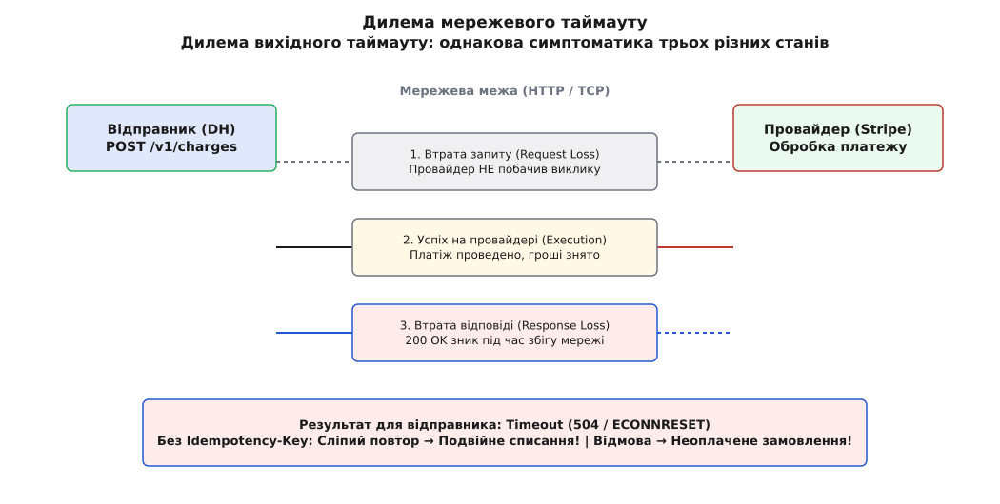
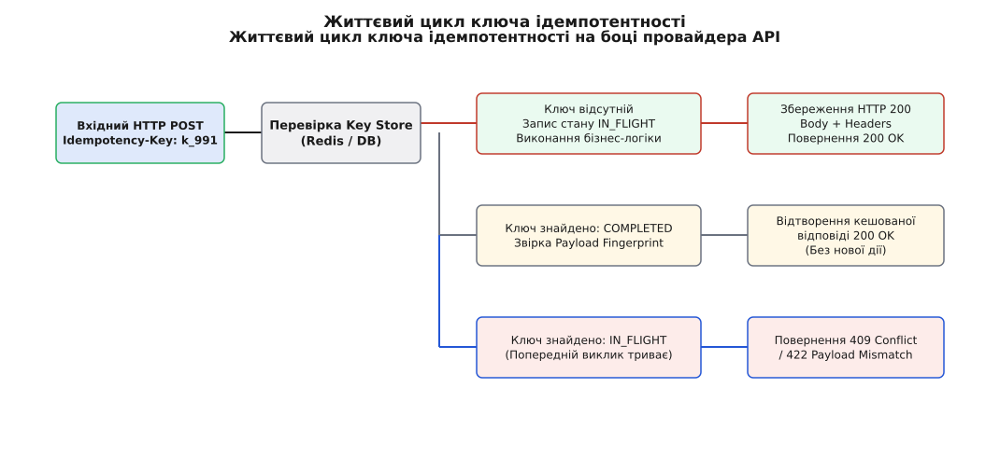
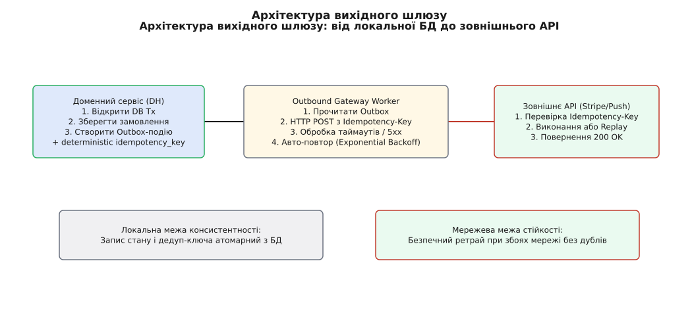

# Ідемпотентність вихідної розмови

<preknowlist>
- [Гарантії доставки](topic:programming/delivery-guarantees) — доставка «щонайменше раз» (at-least-once) та дублювання мережевих запитів.
- [Ідемпотентні консюмери](root:progarch/idempotent-consumers) — дедуплікація та повторна обробка вхідних повідомлень на стороні отримувача.
- [Вебхуки як провайдер](topic:programming/webhook-provider) — надсилання вихідних подій на сторонні системи з політиками повторів.
- [Пастка мережевих таймаутів](topic:communications/network-timeouts) — чому відсутність відповіді не дорівнює невиконанню операції.
- [Outbox та транзакційні події](root:progarch/outbox-pattern) — збереження вихідних намірів атомарно з локальною БД.
</preknowlist>

У п'ятницю о 18:42 мешканець смарт-квартири Коваленко в застосунку Digital Homes натиснув кнопку замовлення послуги розблокування автономного сейфу й одночасно активував місячну підписку на хмарний відеоархів вартістю $120. Бекенд Digital Homes відкрив локальну транзакцію в базі даних PostgreSQL, виконав запис про намір платежу й відправив вихідний HTTP POST запит на ендпоінт платіжного провайдера Stripe. На позначці 4.8 секунди, коли доменний сервіс очікував на підтвердження, проміжний хмарний маршрутизатор зазнав короткочасного збою — і TCP-з'єднання обірвалося з помилкою `ECONNRESET`. 

На боці Digital Homes виникла класична кризова ситуація: платіжний сервіс викинув виняток таймауту, а стан операції став повністю невідомим. Якщо бекенд негайно виконає повторну спробу (retry) і пошле той самий HTTP POST запит ще раз, платіжний провайдер обробить його як новий виклик — і з картки користувача буде списано $240 замість $120. Якщо ж бекенд злякається подвійного списання і скасує операцію — мешканець залишиться без доступу до сейфу, хоча банк вже фактично заблокував його $120 при першому запиті.

Цей інцидент висвітлює фундаментальний архітектурний розлам: вихідні мережеві виклики — це не просто читання даних чи внутрішня перевірка стану, а **незворотні побічні ефекти** (англ. *outbound side-effects*). Коли сервіс виходить назовні — звертається до банківського еквайрингу, надсилає пуш-повідомлення через Apple APNs/Google FCM, викликає SMS-шлюз Twilio чи штовхає сторонній вебхук — він перетинає межу власних ACID-транзакцій. І якщо на вхідному боці ми можемо скасувати транзакцію (`ROLLBACK`) або перевірити таблицю вхідних подій, то на вихідному боці ми звертаємося до чужої системи, стан якої ми не контролюємо.

Забезпечити детерміновану роботу в таких умовах дозволяє **ідемпотентність вихідної розмови** (англ. *outbound idempotency*) — архітектурний паттерн, який гарантує, що навіть при багаторазових повторах вихідного виклику внаслідок мережевих збоїв зовнішня система виконає дію строго один раз, а наш сервіс гарантовано отримає результат.

---

## Небезпека незворотного виходу назовні

Щоб зрозуміти, чому вихідні виклики потребують окремого архітектурного захисту, порівняємо їх із внутрішніми операціями сервісу.

Коли бекенд Digital Homes змінює статус пристрою у власній базі PostgreSQL, операція захищена механізмами локальної ACID-транзакції. Якщо на середині запису вимикається живлення або виникає помилка диска, СУБД автоматично відкочує всі зміни до початкового стану. Ніхто у зовнішньому світі не побачить напівзмінених даних.

Вихідний HTTP-виклик до стороннього API позбавлений цієї розкоші. З точки зору теорії розподілених систем, будь-який вихідний HTTP POST/PUT запит проходить крізь **три послідовні точки відмови**:

1. **Втрата запиту по дорозі до провайдера (Request Loss)**: HTTP-пакет зникає на маршрутизаторі до того, як дістається сервера Stripe. Зовнішня система НЕ побачила запиту, бізнес-операція НЕ відбулася.
2. **Збій під час обробки на боці провайдера (Processing Crash)**: Запит дійшов до провайдера, той зняв гроші з картки або відправив SMS, але під час формування відповіді процес провайдера впав або перезавантажився. Операція відбулася, але відповідь не збереглася.
3. **Втрата відповіді на зворотному шляху (Response Loss)**: Провайдер успішно виконав дію, згенерував відповідь `HTTP 200 OK`, але відповідь зникла у мережі через таймаут або обрив TCP-сесії. Операція виконана повністю, але відправник дізнався лише про помилку зв'язку.


*Три абсолютно різні випадки на мережевій межі дають відправнику один і той самий результат — таймаут. Сліпий повтор у другому й третьому випадках призводить до подвоєння побічного ефекту.*

Найтрагічнішим є те, що з боку клієнта (сервісу Digital Homes) **усі три випадки виглядають абсолютно однаково**: код винятку `504 Gateway Timeout`, `ECONNRESET` або `ETIMEDOUT`. Клієнт не має жодного способу дізнатися з самого лише факту таймауту, чи було виконано дію на іншому кінці дроту.

### Анатомія таймауту на сокетному рівні Linux (procfs та tracepoints)

Якщо опуститися на рівень операційної системи Linux і простежити вихідний виклик через системні виклики та псевдофайлову систему `procfs`, стає зрозуміло, звідки береться ця сліпота.

Коли додаток відкриває вихідний сокет і надсилає HTTP POST, операційна система переводить сокет у стан `ESTABLISHED` (що можна спостерігати у `/proc/net/tcp`). Налаштування таймерів сокета задаються параметрами `SO_SNDTIMEO` (таймаут відправки) та `SO_RCVTIMEO` (таймаут очікування відповіді).

Якщо проміжний фаєрвол або роутер скидає TCP-з'єднання без надсилання пакета `FIN` або `RST` (так звана «чорна діра» мережі), сокет ядра Linux продовжує перебувати у стані `ESTABLISHED`. Таймер ретрансмісії TCP (Retransmission Timer) надсилає повторні сирі SYN/ACK або DATA пакети за експоненціальною шкалою (RTO — Retransmission TimeOut).

Якщо зафіксувати це через трасування ядра (kernel tracepoints):
```bash
# Трасування знищення сокетів через таймаут ретрансмісії
sudo perf trace -e tcp:tcp_destroy_sock,net:net_dev_xmit
```

Ми побачимо, що після вичерпання спроб `tcp_retries2` (що за замовчуванням у Linux становить 15 спроб або близько 13–30 хвилин, якщо не обмежено на рівні додатка), ядро Linux надсилає додатку виняток `ETIMEDOUT`. Якщо ж провайдер надіслав `RST` після завершення обробки — додаток отримує `ECONNRESET`.

З точки зору сокета Linux, обидві події є просто сигналами про закриття TCP-сесії. Вони не несуть жодної інформації про те, чи встиг аплікаційний шар Stripe записати транзакцію у базі даних PostgreSQL перед тим, як впав мережевий інтерфейс.

Саме тому вихідний виклик назовні — це завжди небезпечний side-effect. І єдиний спосіб розірвати це коло невідомості — змусити обидві сторони розмовляти мовою **дедуплікаційних ключів**.

---

## Механізм Idempotency Key: Від ідеї до контракту

Перш ніж називати терміни й розбирати заголовки, побудуємо інтуїцію механізму.

Уявімо, що ви купуєте квиток на концерт у касі, але зв'язок постійно переривається. Щоб касир не продав вам два квитки замість одного, ви не просто кажете «продайте квиток», а додаєте: «Ось мій унікальний номер замовлення — `#9912`. Якщо ви вже віддрукували квиток за номером `#9912`, просто видайте мені його дублікат. Не друкуйте новий!»

Саме ця ідея покладена в основу протоколу **ключа ідемпотентності** (англ. *Idempotency Key*).

Відправник (клієнтський сервіс) прикріплює до вихідного HTTP-запиту унікальний заголовок `Idempotency-Key`. Отримувач (зовнішнє API) перед виконанням будь-якої бізнес-логіки перевіряє свій реєстр ключів:

1. **Якщо ключ бачиться вперше**: Сервер фіксує ключ у стані `IN_FLIGHT`, виконує транзакцію (списання грошей, надсилання пуша), зберігає точний результат (HTTP статус, headers, body) у сховище ідемпотентності й повертає відповідь `200 OK`.
2. **Якщо ключ уже існує й має стан `COMPLETED`**: Сервер **НЕ виконує бізнес-логіку повторно**. Замість цього він миттєво повертає збережену раніше HTTP-відповідь із додаванням заголовка `Idempotent-Replay: true`.
3. **Якщо ключ існує, але має стан `IN_FLIGHT`** (попередній запит ще виконується паралельно): Сервер повертає статус `409 Conflict` із проханням зачекати (`Retry-After`).

[Історія створення Idempotency-Key у Stripe](topic:root/course/progarch/outbound-idempotency/hist-stripe-idempotency-key.md) демонструє, як у 2017 році цей підхід перетворився з локального трюку платіжного шлюзу на загальноіснуючий стандарт індустрії.


*Життєвий цикл ключа на боці провайдера. Новий ключ відкриває фазу IN_FLIGHT та виконання бізнес-логіки; повторний ключ відтворює збережену відповідь без повторного списання коштів чи надання послуги.*

Завдяки цьому контракту мережевий таймаут перестає бути пасткою. Отримавши таймаут, відправник може **безболісно й безпечно повторити точно такий самий HTTP POST запит із тим самим ключем**. Якщо перший запит не дійшов — провайдер виконає його зараз. Якщо дійшов і зберігся — провайдер просто відтворить відповідь. В обох випадках побічний ефект відбудеться строго один раз.

Детальний перелік заголовков, мапінг статус-кодів та правила формування помилок описані в [Специфікація заголовків та статусів Idempotency-Key](topic:root/course/progarch/outbound-idempotency/api-idempotency-key-spec.md).

---

## Детермінована генерація ключів на боці відправника

Тепер станьмо на бік відправника — нашого доменного сервісу Digital Homes. Звідки саме відправник бере заголовок `Idempotency-Key`?

Тут новачки роблять свою **головну фатальну помилку**: вони генерують новий випадковий UUID безпосередньо в циклі повторів (retry loop):

```ts
// ❌ НЕПРАВИЛЬНО: Новий UUID на кожну спробу ретраю!
for (let attempt = 0; attempt < 3; attempt++) {
  const response = await fetch("https://api.stripe.com/v1/charges", {
    method: "POST",
    headers: {
      "Idempotency-Key": crypto.randomUUID(), // Руйнує ідемпотентність!
    },
    body: JSON.stringify({ amount: 120 }),
  });
}
```

Якщо при кожній спробі ретраю генерується новий UUID, то з точки зору платіжного провайдера це **три абсолютно різні операції**. Перша спроба зазнає таймауту на зворотному шляху (гроші знято), друга спроба приходить із новим UUID (гроші знято вдруге), третя — з третім UUID (гроші знято втретє). Генерація випадкового UUID усередині ретраю повністю анулює захист ідемпотентності.

Правильне правило свідчить: **Ключ ідемпотентності мусить бути детермінованим функціоналом від бізнес-наміру операції.**

Існує дві основні стратегії детермінованої генерації ключів на боці відправника:

### Стратегія 1: Бізнес-ідентифікатор сутності (Natural Business Key)

Якщо вихідний виклик прив'язаний до сутності з унікальним первинним ключем у базі даних (наприклад, ID замовлення `order_8812` або ID сповіщення `notif_4410`), заголовок формується безпосередньо з цього ключа та версії дієслова:

```
Idempotency-Key: dh_charge_order_8812_v1
```

Незалежно від того, скільки разів worker перезавантажуватиметься, відправлятиме запит чи аварійно завершуватиметься, для замовлення `order_8812` завжди вилітатиме один і той самий заголовок `dh_charge_order_8812_v1`.

### Стратегія 2: Детермінований криптографічний геш (Payload Hash Fingerprint)

Якщо природного ID немає або операція є параметризованою дією над ресурсом, ключ обчислюється як HMAC/SHA-256 над сукупністю контексту:

```
key_input = tenant_id + ":" + target_action + ":" + canonical_json_body
Idempotency-Key: idemp_sha256(key_input)
```

Завдяки цьому два абсолютно однакові запити на надсилання пуш-повідомлення мешканцю про витік води отримають один і той самий ключ, навіть якщо вони були згенеровані двома паралельними потоками сервісу автоматизації.

### Вікно життя ключа (TTL) та розходження часових меж

Критичний момент, який часто ігнорують: **Час життя (TTL) ключа ідемпотентності на боці отримувача мусить перевищувати максимальне вікно повторів на боці відправника.**

Якщо сервіс Digital Homes налаштований повторювати невдалі вихідні виклики впродовж 24 годин (використовуючи фонову чергу з логарифмічним запізненням), а платіжний провайдер очищає ключі ідемпотентності з Redis через 1 годину, то через 2 години повторний запит потрапить на порожнє місце — і провайдер спише гроші вдруге. Еталонний TTL для фінансових ідемпотентних ключів у пром-системах становить від **24 до 72 годин**.

---

## Архітектура вихідного ідемпотентного шлюзу

Щоб не прописувати заголовки й цикли повторів вручну в кожному контролері, у визрілих архітектурах застосовують паттерн **Outbound Idempotency Gateway** (вихідний ідемпотентний шлюз).

Його задача — відокремити бізнес-логіку домену від мережевої невизначеності й гарантувати, що жоден вихідний виклик з побічним ефектом не вийде в мережу ввечері «голим».


*Архітектурний шлюз вихідного зв'язку. Доменна транзакція зберігає намір із детермінованим дедуп-ключем у базі, а фоновий шлюз виконує вихідний HTTP-виклик із авторетраями та безпечним реплеєм.*

Схема роботи шлюзу складається з чотирьох послідовних кроків:

1. **Атомарна фіксація наміру (Outbox Intent)**: Доменний сервіс у межах локальної ACID-транзакції записує в базу даних бізнес-зміни й створює запис у таблиці `outbound_messages` із прапорцем `PENDING` та згенерованим `idempotency_key`. На цьому етапі **жоден мережевий виклик ще не виконується**.
2. **Асинхронний виклик (Worker Processing)**: Фоновий процес (Worker) вичитує `PENDING`-записи з таблиці Outbox, формує HTTP POST запит, прикріплює `Idempotency-Key` і надсилає його до зовнішнього API.
3. **Обробка мережевих відповідей**:
   - **Успіх `200/201`**: Шлюз атомарно оновлює стан запису в Outbox на `COMPLETED` і зберігає тіло відповіді зовнішньої системи.
   - **Конфлікт `409 Conflict`**: Збережений ключ показує, що попередній запит ще обробляється. Шлюз робить паузу (Backoff) і повертає завдання в чергу.
   - **Таймаут або `5xx`**: Шлюз збільшує лічильник `retry_count`, вираховує час наступної спроби (Exponential Backoff + Jitter) і залишає заголовок `Idempotency-Key` **незмінним**.
   - **Помилка `422 Payload Mismatch`**: Виявлено фатальну помилку домену (тіло запиту було змінено під час ретраю). Завдання позначається як `FAILED_FATAL` і відправляється в Dead Letter Queue (DLQ).
4. **Завершення бізнес-саги**: Після отримання підтвердження доменний сервіс переводить стан замовлення з `PAYMENT_PENDING` у `PAYMENT_SUCCESS`.

Детальний опис внутрішніх модулів та матриці станів компонента наведено в [Компонентна архітектура вихідного ідемпотентного шлюзу](topic:root/course/progarch/outbound-idempotency/comp-idempotency-gateways.md).

Повний приклад реалізації вихідного шлюзу мовами C, C++, TypeScript, Python та Go з підтримкою авторетраю та обробки таймаутів дивіться в [Реалізація вихідного шлюзу з авторетраєм та ідемпотентністю](topic:root/course/progarch/outbound-idempotency/proj-outbound-retry-gateway.md).

---

## Гонка запитів та конкурентні повтори (Concurrent Retries & Lock Contention)

У високонавантажених розподілених системах трапляється підступна ситуація: через затримку в черзі або паралельне виконання саги **два різні воркери одночасно відправляють той самий вихідний виклик із однаковим `Idempotency-Key`**.

Що відбувається на боці отримувача (провайдера API)?

Якщо провайдер спроєктований грамотно, він виконує **атомарну перевірку й захоплення ключа** (наприклад, за допомогою операції `SETNX` у Redis або `INSERT INTO idempotency_keys ... ON CONFLICT DO NOTHING` у SQL):

1. **Перший запит** встигає першим. Він створює запис із статусом `IN_FLIGHT` та затримує блокування.
2. **Другий запит** приходить через 10 мілісекунд, коли перший ще виконується. Провайдер бачить стан `IN_FLIGHT` і відмовляється виконувати бізнес-логіку паралельно. Сервер повертає другому запиту статус `HTTP 409 Conflict` або `HTTP 429 Too Many Requests` із заголовком `Retry-After: 2`.

Дисциплінований вихідний шлюз на боці відправника мусить правильно обробляти статус `409 Conflict`: він **не повинен вважати `409` фатальною помилкою**. `409 Conflict` у контексті ідемпотентності означає: *«Я вже роблю цю роботу для першого запиту. Не заважай мені, зачекай пару секунд і спитай знову з цим самим ключем!»*

Воркер відправника отримує `409`, засинає на вказаний термін і при наступній спробі отримує вже готовий статус `200 OK` з збереженим результатам від першого запиту.

---

## Відстеження та кореляція: Ідемпотентний ключ проти Correlation ID

У початківців часто виникає плутанина між двома схожими поняттями: **Correlation ID** (ідентифікатор кореляції) та **Idempotency Key** (ключ ідемпотентності). Здається, ніби це одне й те саме, адже обидва є унікальними рядками в HTTP-заголовках.

Однак їхня архітектурна мета фундаментально різна:

- **Correlation ID (або W3C `traceparent`)** — це інструмент **спостережності (Observability)**. Він зв'язує логи й спани розподіленого трейсингу крізь десятки мікросервісів. Він каже розробнику: «Ось шлях, яким ішов цей конкретний запит від мобільного телефону до бази даних». Якщо ви надішлете два повторні запити з однаковим Correlation ID, сервер обробить обидва як окремі дії, просто записавши їх під однією міткою в журналі.
- **Idempotency Key** — це інструмент **управління станом (Control Flow & Transaction Management)**. Він змінює алгоритм виконання на боці провайдера, примусово блокируючи повторне виконання бізнес-логіки.

У зрілих вихідних шлюзах ці два заголовки використовуються **разом**:
```http
POST /v1/charges HTTP/1.1
Host: api.stripe.com
Idempotency-Key: dh_charge_order_8812_v1
traceparent: 00-4bf92f3577b34da6a3ce929d0e0e4736-00f067aa0ba902b7-01
X-Correlation-ID: req_c8a9120a
```

Такий підхід дозволяє оператору бачити в сквозних логах (Loki/Elastic) усі 3 спроби вихідного виклику за `X-Correlation-ID`, переконуючись, що платіжний провайдер обробив лише першу спробу завдяки `Idempotency-Key`.

---

## Практична зона: Навіщо це та межі застосування

> 🔧 **Навіщо це.** Спроба вийти назовні без ключа ідемпотентності — це гра в російську рулетку з чужим станом і чужими грошима. Кожен вихідний HTTP POST/PUT запит, який міняє стан (платіж, SMS, замок, вебхук), мусить обгортатися вихідним шлюзом із детермінованим `Idempotency-Key`. Це єдиний спосіб перетворити нестабільну мережу на надійний інструмент бізнесу.

При всій потужності паттерна, архітектор мусить чітко бачити **чесні межі його застосування** та супутні ціни:

### 1. Що робити, якщо зовнішнє API НЕ підтримує `Idempotency-Key`?

На жаль, чимало застарілих банківських API або самописних служб партнерів не підтримують заголовки ідемпотентності. Якщо ви надішлете їм `Idempotency-Key`, вони його просто проігнорують.

У таких випадках вихідний шлюз застосовує **двофазну тактику перевірки перед повтором** (англ. *Read-Before-Retry* або *Reconciliation Polling*):
- Перед тим як робити повторний POST запит після таймауту, шлюз виконує **безпечний виклик читання** `GET /v1/charges?external_reference=order_8812` або викликає спеціальний API статусів.
- Якщо запит читання показує, що транзакція з `order_8812` уже існує на боці провайдера — шлюз вважає виклик успішним і скасовує повтор.
- Якщо транзакції немає — шлюз робить повторний POST.

Якщо API не має навіть пошуку за власним ідентифікатором, єдиним захистом стає **фоновий модуль звірки (Reconciliation Worker)**, який раз на добу порівнює виписки провайдера із локальним журналом дій і створює компенсаційні проведення при виявленні розходжень.

### 2. Пастка зміни корисного навантаження (Payload Mutation Trap)

Якщо розробник змінив суму платежу з $120 на $150, але забув змінити дедуп-ключ `charge_order_8812_v1`, виникає помилка **Payload Mismatch**. Провайдер відхилить запит із кодом `422 Unprocessable Entity`, бо заголовок обіцяє відтворити стару операцію, а тіло вимагає нової.

Правило дисципліни: **Будь-яка зміна бізнес-параметрів операції мусить породжувати новий версіонований ключ ідемпотентності** (наприклад, `charge_order_8812_v2`).

### 3. Ціна збереження стану ключів

Ідемпотентність не безкоштовна. Отримувач (і локальний шлюз) змушені зберігати терабайти кешованих HTTP-відповідей та ключів у сховищах Redis чи PostgreSQL. Для підтримки високої продуктивності системи обов'язково налаштовують фонові процедури очищення (TTL / Garbage Collection), які видаляють ключі, старіші за 30-90 днів.

---

## Підсумок спіралі

Вихід назовні — це остання межа розподіленого сервісу. Захистивши вхідні вебхуки та внутрішні саги, ми замикаємо контур надійності вихідною ідемпотентністю.

Коли кожна вихідна розмова захищена детермінованим `Idempotency-Key`, мережеві таймаути втрачають свою руйнівну силу. Система Digital Homes може спокійно переживати обриви Wi-Fi, падіння хмарних маршрутизаторів та перезавантаження серверів еквайрингу — адже кожен вихідний виклик гарантовано виконає свою дію строго один раз.
