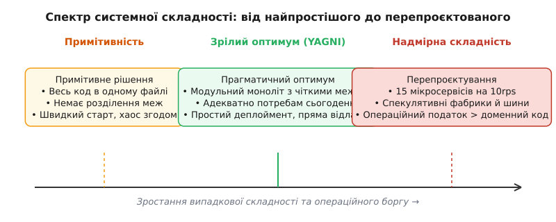
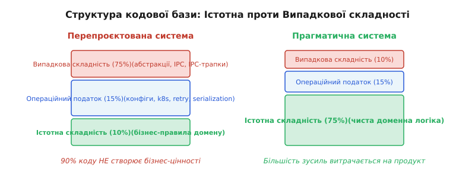
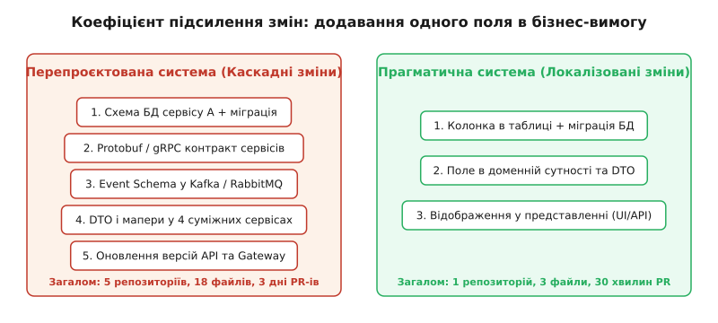

# Перепроєктування

<preknowlist>
- [YAGNI та DRY](topic:sf-apps/dry-kiss-yagni) — принципи економічності коду: чому передчасна абстракція збільшує борг.
- [Моноліт проти мікросервісів](root:progarch/monolith-vs-microservices/monolith-first) — межі процесів, мережевий оверхед та вибір початкової топології.
- [Cloud cost як архітектурний драйвер](topic:sf-apps/cloud-cost-model) — структура витрат на хмару, непрямі кошти підтримки й операційна складність.
</preknowlist>

Команда з шести інженерів проєктувала підсистему аналітики для стартапу в галузі розумного дому. Очікуване навантаження першого року становило близько 300 запитів на хвилину — потік даних, який навіть скромний екземпляр бази даних PostgreSQL на двох ядрах CPU здатен обробляти з завантаженням менше 2%. Проте у фінальній архітектурній схемі з'явилися 14 окремих мікросервісів, кластер Apache Kafka на дев'яти вузлах, два сервіс-меші Istio, окреме сховище Redis для розподіленого кешування транзитних станів та складний двигун плагінів на основі динамічного завантаження shared-бібліотек. Через вісім місяців розробки продукт ще не мав жодного реального користувача, але місячний рахунок за хмарну інфраструктуру AWS сягав \$3 800. Понад 65% часу кожного спринту команда витрачала не на створення бізнес-фіч, а на усунення неузгодженостей gRPC-контрактів, налагодження розсинхронізації офсетів у Kafka, розв'язання циклічних залежностей між сервісами та підтримку конфігурацій Kubernetes.

Ця ситуація — класичний прояв **перепроєктування** (*Overengineering*). Це стан системи, коли її архітектурна складність, кількість шарів абстракцій, мережевих меж та інфраструктурний оверхед у рази перевищують істотні потреби доменної задачі й реального навантаження. Перепроєктування не є випадковою опискою чи локальним багом у коді — це системний економічний і технічний викривлювач, який перетворює програмування з інструменту створення бізнес-цінності на самообслуговування інженерного інструментарію.


*Спектр системної складності. Примітивний хаос усувається дисципліною меж, але намагання закласти всі можливі майбутні масштаби відводить систему в зону надмірної складності, де операційний борг переважає корисну роботу.*

> 🔧 **Навіщо це.** Розпізнавання та профілактика перепроєктування — це головна економічна навичка архітектора. Без неї система обростає передчасними мікросервісами, порожніми фабриками та необов'язковими шинами подій, перетворюючи кожну зміну вимог на багаторазове каскадне редагування коду й інфраструктури.

---

## Психологічні та соціальні джерела перепроєктування

Щоб зрозуміти, чому освічені й досвідчені інженери систематично будують надмірно складні системи, необхідно зняти суто технічну оптику й подивитися на психологічні та соціальні сили, які діють у команді розробки. Перепроєктування рідко народжується з злого наміру. Найчастіше воно є побічним продуктом непропрацьованих ризиків, когнітивних викривлень та викривлених професійних мотивацій.

### 1. Resume-Driven Development (RDD) та синдром випередження моди
У сучасній IT-індустрії кар'єрне зростання інженера часто залежить від того, якими технологіями він володіє на папері. Написати простий модульний моноліт на C++ або Python із використанням PostgreSQL — це чудове рішення для бізнесу, але воно виглядає «нудно» у резюме. Натомість досвід побудови розподілених саг у Kubernetes за допомогою Kafka, gRPC та GraphQL робить фахівця більш затребуваним на ринку праці. Це створює фундаментальний конфлікт інтересів: інженер підсвідомо мотивований обирати складніші інструменти, оскільки ризик невдачі проєкту бере на себе бізнес, а технологічний багаж у резюме залишається фахівцеві.

### 2. Страх майбутніх змін та нездатність жити з невизначеністю
Інший психологічний драйвер — це страх опинитися в ситуації, коли систему доведеться кардинально переробляти через зміну бізнес-вимог. Інженерам здається, що якщо вони закладуть «універсальний шар абстракції» або розіб'ють систему на 20 мікросервісів просто зараз, це вбереже їх від майбутніх зусиль. Проте це ілюзія. Оскільки реальне майбутнє майже ніколи не збігається з фантазіями архітектора, спекулятивно створені абстракції виявляються непридатними для нових вимог. У результаті команда платить двічі: спочатку за створення складності, яка не потрібна сьогодні, а потім за її демонтаж і переписування, коли реальність вимагає геть іншого вектора розвитку.

### 3. Пастка безпідставного копіювання гігантів (Cargo Cult Architecture)
Малі та середні компанії часто копіюють архітектурні патерни технологічних гігантів на кшталт Google, Netflix, Amazon чи Uber. Проте вони ігнорують той факт, що архітектура цих компаній є вимушеною відповіддю на унікальні масштаби (мільйони запитів на секунду) та величезні організації (тисячі інженерів у сотнях команд). Копіювання мікросервісного заплутаного ландшафту компанією з 10 розробників — це архітектурний карго-культ: копіювання зовнішньої форми без розуміння обмежень і сил, які цю форму згенерували.

### 4. Закон Конвея та організаційна гіпертрофія
Закон Конвея стверджує, що структура системи повторює структуру комунікацій організації. Якщо в компанії є п'ять розробників або п'ять дрібних підрозділів, виникає спокуса створити рівно п'ять мікросервісів — по одному на людину чи групу, — аби уникнути конфліктів під час скомпілювання коду та злиття PR. Проте штучне виділення меж процесів заради комфорту комунікації в малій команді створює мережевий оверхед і катастрофічну складність міжпроцесної відладки.

### 5. Догматичний unit-тестинг та фальшива мокізація
Ще один непомітний драйвер перепроєктування — це неправильне трактування фазового тестування. Коли культ unit-тестів вимагає ізолювати кожну функцію від зовнішнього світу, інженери починають створювати десятки штучних інтерфейсів (`IUserRepository`, `IDateTimeProvider`, `IEmailService`) виключно для того, щоб підставити мок-об'єкт у тестах. У результаті система обростає порожніми шарами індирекції, а підсумкові unit-тести лише перевіряють, що мок повернув мок, не гарантуючи реальної працездатності підключення до БД.

---

## Три вежі надмірної складності

На практиці перепроєктування матеріалізується у трьох чітких формах, які охоплюють топологію процесів, внутрішню структуру коду та ставлення до функціональних вимог.

```
                  ┌─────────────────────────────────────────┐
                  │      Спекулятивні архітектури           │
                  └────────────────────┬────────────────────┘
                                       │
         ┌─────────────────────────────┼─────────────────────────────┐
         ▼                             ▼                             ▼
┌─────────────────┐           ┌─────────────────┐           ┌─────────────────┐
│   Передчасне    │           │Занадто абстрактні│           │  Нерозношений   │
│  масштабування  │           │    патерни      │           │      код        │
│(Premature Scale)│           │ (Pattern Obses.)│           │  (Unworn Code)  │
└─────────────────┘           └─────────────────┘           └─────────────────┘
```

### 1. Передчасне масштабування (Premature Scaling)

Передчасне масштабування полягає в прийнятті архітектурних рішень, розрахованих на екстремальне навантаження чи гігантську організаційну структуру, на етапі, коли система обробляє десятки запитів на секунду, а розробкою займається одна команда.

Розгляньмо ключові прояви передчасного масштабування та їх справжню ціну:

- **Передчасне розбиття на мікросервіси:** Розділення моноліту на десятки процесів до того, як стабілізувалися межі доменних контекстів. Замість виклику функції в пам'яті (який займає 2–5 наносекунд), кожен крок логіки починає проходити через мережевий стек, серіалізацію JSON/Protobuf, DNS-розпізнавання та маршрутизацію (що займає 5–50 мілісекунд). Система потрапляє у пастку помноження затримок `N × latency` та втрачає атомарність транзакцій.
- **Передчасне впровадження подієвих шин (Kafka/RabbitMQ):** Застосування асинхронного розчіплення подій там, де достатньо звичайного виклику у межах однієї БД-транзакції. Замість простішого гарантованого ACID-запису команда отримує проблему eventual consistency, потребу в ідемпотентних приймачах, боротьбу з повторною доставкою подій та оверхед на підтримку кластера шини.
- **Передчасний шардинг та NoSQL-манія:** Створення складних схем горизонтального шардингу таблиць або перехід на Key-Value/Document сховища до того, як вичерпано можливості класичного реляційного рушія. Сучасний PostgreSQL на одному залізобетонному екземплярі здатен виконувати понад 50 000 складних транзакцій на секунду та зберігати терабайти даних. Початок проєкту з передчасного шардингу позбавляє розробників JOIN-ів, закордонних ключів (foreign keys) та транзакційної цілісності.

### 2. Культ абстракцій та манія патернів (Pattern Obsession)

Друга форма надмірної складності виникає всередині кодової бази окремого процесу. Це намагання побудувати «нескінченно гнучку» систему через бездумне застосування патернів проєктування (GoF) та багаторівневих індирекцій без реальної потреби у варіативності.

Приклад надмірної абстракції для звичайної процедури збереження користувача в БД:

```
[HTTP Request]
   ↓
[UserController]
   ↓
[IUserServiceAdapter]
   ↓
[UserServiceImpl]
   ↓
[IUserDomainProcessorFactory]
   ↓
[UserDomainProcessorVisitor]
   ↓
[IUserRepositoryProvider]
   ↓
[SqlUserRepositoryAdapter]
   ↓
[Database]
```

У цьому ланцюжку є сім шарів індирекції для операції, яка у своїй істотній основі є звичайним `INSERT INTO users`. Кожен шар обґрунтовується гіпотетичною можливістю: «А що, як ми замінимо базу даних?», «А що, як процесор користувачів стане динамічним плагіном?», «А що, як контролер буде працювати через gRPC замість HTTP?».

Проте в реальному житті 95% таких гіпотетичних змін не настають ніколи. А ціна за цю «спекулятивну гнучкість» сплачується щодня:
- Кожна зміна бізнес-поля вимагає оновлення 7 файлів та 5 DTO-маперів.
- Навігація в IDE перетворюється на блукання по десятках інтерфейсів із єдиною реалізацією (`UserServicesImpl`, який реалізує `IUserService`).
- Стектрейс помилки розростається до 80 рядків, приховуючи реальне місце збою під шарами інфраструктурного виклику DI-контейнера.

### 3. Ціна нерозношеного коду (Unworn Code)

Поняття **нерозношеного коду** можна порівняти із новим важким взуттям, яке ще жодного разу не випробували в реальному поході. Це код, написаний «про всяк випадок» (*Just-in-Case Engineering*) — узагальнені класи, універсальні параметри конфігурації, гіпотетичні гілки `else`, які жодного разу не виконувалися під реальним продакшн-навантаженням і з реальними даними користувачів.

Спекулятивний нерозношений код несе три приховані загрози:
1. **Ілюзія готовності:** Команда вважає, що система підтримує мультитенантність або динамічні тарифні плани, бо для цього написані порожні абстрактні класи. Проте під час реального включення другого тентанта з'ясовується, що спекулятивний код містить фундаментальні хибні припущення і його все одно треба повністю переписати.
2. **Пасивний борг тестування:** Нерозношений код вимагає unit-тестів, які треба підтримувати під час кожного рефакторингу. Інженери витрачають години на підтримку тестів для фіч, якими ніхто й ніколи не користується в продакшені.
3. **Приховані точки збою та вразливості:** Мертві або «майбутні» гілки коду часто стають джерелом вразливостей безпеки (наприклад, неперевірені шляхи автентифікації у спекулятивних API) або неочікуваних крашів під час випадкового потрапляння нестандартних вхідних даних.

---

## Виявлення та вимірювання системної складності

Складність перестає бути суб'єктивною оцінкою («мені здається, це заскладно»), коли її починають вимірювати конкретними метриками кодової бази та операційного процесу.


*Порівняння структури кодової бази. У перепроєктованій системі левова частка коду та часу витрачається на випадкову складність та операційний податок, тоді як у прагматичній — на бізнес-правила домену.*

Для точного виявлення перепроєктування використовуються чотири основні інженерні виміри.

### 1. Глибина індирекції (Indirection Depth)

Глибина індирекції вимірює кількість шарів виклику (стекових кадрів), які долає виконання від зовнішнього входу (API/CLI) до безпосередньої доменної дії або запиту до сховища.

```
Глибина індирекції = K_total - K_domain
```

Де `K_total` — загальна кількість викликів методів у стек-трейсі, а `K_domain` — виклики, які дійсно виконують трансформацію бізнес-даних або валідацію інваріантів. Якщо `K_total` = 16, а `K_domain` = 2, це означає, що 87% каскаду викликів — це порожній транзит через фабрики, адаптери, обгортки та проксі.

### 2. Коефіцієнт підсилення змін (Change Amplification Factor)

Коефіцієнт підсилення змін показує, скільки файлів, репозиторіїв та контрактів потрібно змінити для реалізації однієї атомарної бізнес-вимоги (наприклад, додавання поля `middle_name` до сутності користувача або додавання давача вологості до моделі пристрою).


*Підсилення змін у дії. Якщо додавання одного поля вимагає каскадного редагування Protobuf, трьох мікросервісів та двох шарів DTO — система має високий коефіцієнт підсилення змін, що свідчить про перепроєктування.*

```
CAF
= N_files_changed / N_business_concepts_changed    [коефіцієнт підсилення змін: змінені файли проти концепцій]
```

Виміряти CAF можна прямо в CI за допомогою команд аналізу аналітики комітів git:
`git diff --name-only HEAD~1 HEAD | wc -l`

- **CAF = 1–3:** Зріла прагматична архітектура. Зміна локалізована в межах одного контексту чи модуля.
- **CAF > 8:** Перепроєктована система. Наявне каскадне підсилення змін через надмірну фрагментацію меж, розбухання маперів та відсутність єдиного джерела правди для моделей даних.

### 3. Співвідношення коду до домену (Code-to-Domain Ratio)

Метрика порівнює загальний обсяг кодової бази (Lines of Code, LOC) з обсягом коду, який безпосередньо реалізує бізнес-правила, розрахунки та валідацію домену.

```
Domain Ratio
= LOC_domain / LOC_total                            [частка доменного коду: бізнес-правила проти загального обсягу]
```

Якщо в проєкті на 60 000 рядків коду бізнес-логіка (правила обчислень, валідатори, машини станів) займає лише 4 000 рядків, а решта 56 000 — це інфраструктурний бройлерплейт, конфігурації DI-контейнерів, серіалізатори, проксі-шари та мережеві контракти, система задушена випадковою складністю.

### 4. Жетони інноваційного ризику (Innovation Tokens)

Концепція **Innovation Tokens** (жетонів інновацій), запропонована Деном Маккінлі, додає економічний та операційний вимір до оцінки технологічного стеку. Кожна організація має дуже обмежений ресурс на освоєння та операційне обслуговування невипробуваних або складних технологій (не більше 2–3 «жетонів» на проєкт).

Витрата жетона відбувається щоразу, коли команда обирає:
- Нестандартну базу даних (наприклад, графову БД або розподілену NoSQL замість реляційної).
- Нову мову програмування для окремого сервісу, якої раніше не було в компанії.
- Розподілений асинхронний двигун замість класичної черги в БД.

Перепроєктування настає тоді, коли команда витрачає 6–8 жетонів інновацій на задачу, яка не має унікальних вимог до масштабу, перетворюючи щоденну експлуатацію системи на постійне гасіння інфраструктурних пожеж. Детальніше еволюцію боротьби зі складністю від Брукса до Маккінлі описано в [історії боротьби з надмірною складністю](root:progarch/cost-and-lock-in/overengineering/hist-overengineering-lineage.md).

---

## Хмарна економіка та вартість виходу з перепроєктованих систем

Перепроєктування тісно пов'язане з економікою хмари та вендорською прив'язкою (Vendor Lock-in). Коли команда будує надмірно складну розподілену систему, вона починає масово спиратися на спеціалізовані хмарні сервіси (Managed Kafka, Managed Service Mesh, Serverless Event Bus, NoSQL Document Databases), щоб хоч як якось впоратися з операційним навантаженням.

Це створює подвійний економічний удар:

1. **Прямі витрати на інфраструктуру (Cloud Cost Inflation):** Замість одного екземпляра сервера за \$100/місяць компанія сплачує за десяток Pod-ів у Kubernetes, трафік між зонами доступності (Cross-AZ traffic cost), сервіс-меш proxy overhead та ліцензії/підписки на керовані брокери, збільшуючи чек у 10–20 разів.
2. **Астрономічна вартість виходу (Exit Cost):** Перепроєктована система, яка зав'язана на десяток пропрієтарних сервісів хмарного провайдера, стає непереносимою. Спроба мігрувати її на інший хмарний майданчик або On-Premise залізо вимагає переписування сотень інфраструктурних маніфестів і контрактів, що робить компанію заручником одного вендора.

---

## Порівняльний розбір: YAGNI в дії на прикладі Digital Home

Розгляньмо реальний архітектурний конфлікт на матеріалі підсистеми агрегації та обробки телеметрії платформи розумного дому **Digital Home**.

### Задача системи
Платформа обслуговує 50 000 домашніх хабів. Кожен хаб щохвилини надсилає метрики (температура, стан замків, споживання енергії). Загальний потік даних становить ~830 запитів/сек. Потрібно обчислювати щогодини сумарне споживання енергії кожним домом та надсилати push-сповіщення у разі перевищення ліміту.

```
                                 [ 50 000 Хабів ]
                                        │
                                        ▼ (830 rps)
                          ┌───────────────────────────┐
                          │   Підсистема аналітики    │
                          └─────────────┬─────────────┘
                                        │
                      ┌─────────────────┴─────────────────┐
                      ▼                                   ▼
        [ Щогодинні агрегати ]               [ Push-сповіщення ]
```

### Варіант A: Перепроєктоване подієве розбиття
Команда побудувала ланцюжок із чотирьох мікросервісів (`Ingest`, `Aggregator`, `RulesEngine`, `Notifier`), з'єднаних через Kafka-топіки та gRPC.

Недоліки, які виявилися під час експлуатації під реальним навантаженням:
- Затримка обробки (p99) складала 140 мс через 3 послідовні мережеві хопи й потрійну серіалізацію/десеріалізацію.
- Тимчасова відмова сервісу правил (`RulesEngine`) призводила до накопичення лавини подій у Kafka, ребалансування партицій і вимагала побудови складної системи Dead Letter Queues (DLQ).
- Інфраструктура вимагала 12 Pods у Kubernetes та 3 вузли Kafka, що коштувало \$1 450/місяць.

### Варіант B: Прагматичний модульний моноліт
Команда провела рефакторинг, об'єднавши всі чотири етапи в **один процес модульного моноліту** з єдиною базою даних PostgreSQL.

Механізм роботи:
1. `IngestModule` приймає метрики й пише їх у таблицю `telemetry_raw` (PostgreSQL вільно обробляє 830 write/sec у батчах на одному вузлі).
2. За розкладом (крон усередині процесу або фоновий воркер) виконується один SQL-запит агрегації.
3. Якщо поріг перевищено, запис про сповіщення додається у таблицю `outbox_events` у межах **тої самої БД-транзакції**.
4. Фоновий потік читає `outbox_events` і надсилає Push через Apple/Google API.

Повний кодовий порівняльний розбір реалізації обох варіантів мовами C++, TypeScript та Python наведено у вставці [розбір рефакторингу Digital Home](root:progarch/cost-and-lock-in/overengineering/proj-dh-simplification.md).

### Результати порівняння двох підходів

| Параметр | Варіант A (Мікросервіси + Kafka) | Варіант B (Модульний моноліт + Outbox) | Економічний ефект |
| :--- | :--- | :--- | :--- |
| **Рядків коду (LoC)** | 8 400 | 2 100 | **−75% кодової бази** |
| **Інфраструктурні вузли** | 12 (K8s pods, Kafka, Redis) | 2 (App instance + PostgreSQL) | **−83% вузлів** |
| **Середня затримка (p99)** | 140 мс | 12 мс | **у 11 разів швидше** |
| **Витрати на хмару** | \$1 450 / місяць | \$120 / місяць | **−91% cloud cost** |
| **Час onboarding інженера** | 3 тижні (вивчення всіх сервісів) | 2 дні (один репозиторій) | **прискорення у 7 разів** |

Аналіз показує: Варіант B виконує 100% бізнес-вимог системи з набагато вищими гарантіями надійності (транзакційна консистентність замість eventual consistency) і в рази нижчою вартістю володіння.

---

## Стратегія деконструкції наявної надмірної складності

Якщо команда вже успадкувала перепроєктовану систему з десятками сервісів та непотрібних шин, її спрощення має відбуватися за чітким сценарієм, а не через хаотичне переписування:

1. **Заморожування нових шарів (Abstraction Freeze):** Впровадження суворого правила: нові фічі додаються лише у наявні модулі без створення нових мікросервісів чи шарів індирекції.
2. **Зворотний Strangler Fig (Consolidation into Modular Monolith):** Сервіси, які постійно змінюються синхронно (високий CAF), об'єднуються назад у єдиний процес. Мережеві gRPC-виклики замінюються на прямі виклики функцій в пам'яті.
3. **Заміна подієвих шин на Transactional Outbox:** Kafka чи RabbitMQ демонується у місцях, де вона використовувалася лише для передачі подій між модулями однієї доменної області. Обмін переводиться на PostgreSQL `outbox_events`.
4. **Видалення мертвих спекулятивних гілок:** Систематичний стачний аналіз коду та видалення інтерфейсів, які мають лише одну реалізацію, разом із мертвими конфігураційними прапорцями.

---

## Профілактика та культура економічної архітектури

Забігати настільки далеко в бік складності не доведеться, якщо у процесі проєктування застосовувати чотири системні запобіжники.

```
┌─────────────────────────────────────────────────────────────────────────┐
│                    Запобіжники перепроєктування                         │
├───────────────────┬───────────────────┬────────────────┬────────────────┤
│   Остання відпов. │   Правило трьох   │ Реверсивність  │   Fitness      │
│        мить       │  (Rule of Three)  │   рішень       │  Functions     │
│(Last Resp. Moment)│                   │(1-Way / 2-Way) │    в CI        │
└───────────────────┴───────────────────┴────────────────┴────────────────┘
```

### 1. Остання відповідальна мить (Last Responsible Moment)

Принцип «останньої відповідальної миті» — це стратегія свідомого відкладання зв'язуючих архітектурних рішень (вибір специфічної бази даних, розбиття моноліту на сервіси, впровадження зовнішньої черги) до моменту, коли накопичено максимальний обсяг реальних даних про точку болю й навантаження.

Відкладання рішення — це не лінь і не бездіяльність, а дисциплінований аналіз:
- **Передчасне рішення:** «Давайте одразу поставимо Cassandra, бо через два роки у нас може бути петабайт даних». (Рішення прийнято в умовах максимальної невідомості).
- **Рішення в останню відповідальну мить:** «Зараз наші 50 Гб даних чудово живуть у PostgreSQL. Ми побудуємо інтерфейс доступу так, щоб у момент, коли навантаження на читання досягне 80% ліміту вузла, ми могли винести часові ряди в спеціалізоване сховище без переписування всієї системи».

### 2. Правило трьох (Rule of Three)

Правило трьох застерігає від створення абстракцій на основі одного або двох прикладів використання:

1. **Перше використання:** Пишеться прямий, конкретний код без абстракцій.
2. **Друге використання:** Код повторюється або злегка дублюється (DRY не порушується радикально, якщо дублювання локальне). Нагадаємо відоме формулювання Сенді Метц: *«Дублювання є набагато дешевшим, ніж хибна абстракція»* (*Duplication is far cheaper than the wrong abstraction*).
3. **Третє використання:** Лише тепер, коли виділено **три реальні точки варіативності**, створюється загальний інтерфейс або абстрактний шар.

Створення абстракції на першому або другому виклику є класичним передчасним узагальненням.

### 3. Класифікація реверсивності рішень (One-Way vs Two-Way Doors)

Архітектурні рішення слід ділити за критерієм вартості їх скасування (фреймворк рішень Джеффа Безоса, адаптований для розробки ПЗ):
- **Двері в один бік (One-Way Doors):** Незворотні або надзвичайно дорогі у скасуванні рішення (зміна мови кодової бази, вибір вендорського пропрієтарного API, вибір бази даних із власною мовою запитів чи протоколом). Для таких рішень потрібен глибокий аналіз, вимірювання, прототипування та фіксація у формених ADR (Architectural Decision Records).
- **Двері в обидва боки (Two-Way Doors):** Легкооборотні рішення (вибір бібліотеки валідації, внутрішня структура модуля, конкретний алгоритм кешування). Такі рішення мають ухвалюватися максимально швидко без тривалого проєктування та без роздування церемоній.

### Документування рішень у контролі складності (ADR)
Для рішень класу «One-Way Doors» у проєкті обов'язково ведеться журнал архітектурних рішень (ADR). Шаблон ADR для контролю складності вимагає явного опису **найпростішого альтернативного рішення**, яке було відхилено:

```markdown
# ADR-014: Обробка агрегатів телеметрії та сповіщень Digital Home

## Статус: Прийнято
## Контекст
Необхідно обробляти 830 rps телеметрії від 50 000 хабів та формувати сповіщення.

## Розглянуті варіанти
1. Варіант A: Kafka + 4 мікросервіси у Kubernetes (Оцінка cloud cost: $1 450/міс).
2. Варіант B: Модульний моноліт + Transactional Outbox у PostgreSQL (Оцінка: $120/міс).

## Рішення
Обрано Варіант B (Модульний моноліт). 

## Обґрунтування відмови від Варіанта A
Поточне навантаження (830 rps) повністю покривається одним вузлом PostgreSQL.
Витрата жетонів інновацій на Kafka та сервіс-меш не виправдана бізнес-потребами.
```

### 4. Вартість як Fitness Function у CI

Сучасний підхід до профілактики складності полягає у впровадженні автоматичних перевірок (Architectural Fitness Functions) прямо у конвеєр безперервної інтеграції (CI):

- **Ліміт глибини залежностей:** Автоматичний статичний аналізатор перевіряє, щоб цикломатична складність або глибина викликів у модулях не перевищувала заданий поріг.
- **Моніторинг каскадних змін:** CI-бот аналізує Pull Request і попереджає команду, якщо зміна одного файлу в домені зачіпає понад 5 зовнішніх модулів чи сервісів.
- **Cloud Cost Drift Gate:** Автоматичний розрахунок прогнозованого рахунку за хмару (наприклад, через інструмент Infracost) під час кожної зміни Terraform або Kubernetes конфігурацій. Якщо PR збільшує місячний чек на 20% без відповідного обґрунтування в ADR, білд вимагає додаткового затвердження головного архітектора.

---

## Підсумковий синтез

Перепроєктування — це не знак високої кваліфікації розробника, а ознака втрати зв'язку між технічними рішеннями та економічною реальністю продукту. Професіоналізм архітектора полягає не у здатності побудувати найскладнішу систему з можливих, а у здатності знайти **найпростішу структуру, яка надійно вирішує задачу сьогодні й залишає простір для еволюції завтра**.

Кожен шар абстракції, кожен новий мікросервіс і кожна шина подій — це пасив, який вимагає щоденної плати у вигляді операційного часу інженерів, витрат на хмару та затримок розробки. Зменшення цієї випадкової складності — єдиний шлях до створення довговічних, зрілих та економічно ефективних програмних систем.
